<div style="text-align: center; width: 100%;">


<h1>Universidad Peruana de Ciencias Aplicadas</h1>

<h2>Carrera de Ingeniería de Software</h2>

<h2>1ACC0238</h2>

<p>Aplicaciones para Dispositivos Móviles</p>

<p>13980</p>

<p>Docente: <strong>Mayta Guillermo, Jorge Luis</strong></p>

<p>Informe del Trabajo Final</p>

<p>Equipo: Healthify</p>

<p>Proyecto: Guardian+</p>

<h2>Integrantes</h2>

<p>
u202411310 - Azama Fukuda, Juan Pablo<br>
u20241b843 - Mechan Montenegro, Luciana Carolina<br>
u20241d185 - Luis Miranda, Diego Andres<br>
u202421866 - López Monroy, Rodrigo Alfredo<br>
u202319404 - Sanchez Cuadrado, Juan Antonio
</p>

<p>2026 - 2</p>

<p><em>Octubre, 2026</em></p>

</div>

<div style="page-break-before: always; break-before: page;"></div>

# Registro de Versiones del Informe

| Versión | Fecha | Autor | Descripción de modificación |
|---|---|---|---|
| 1.0 | 16/09/2026 | u202411310 - Azama Fukuda, Juan Pablo<br>u20241b843 - Mechan Montenegro, Luciana Carolina<br>u20241d185 - Luis Miranda, Diego Andres<br>u202421866 - López Monroy, Rodrigo Alfredo<br>u202319404 - Sanchez Cuadrado, Juan Antonio | Se agregó la documentación relacionada a la investigación inicial de la problemática y el planteamiento de la solución. Asimismo, se agrego el diseño inicial basado en Domain Driven Design del Backend  |
| 2.0 | 05/10/2026 | u202411310 - Azama Fukuda, Juan Pablo<br>u20241b843 - Mechan Montenegro, Luciana Carolina<br>u20241d185 - Luis Miranda, Diego Andres<br>u202421866 - López Monroy, Rodrigo Alfredo<br>u202319404 - Sanchez Cuadrado, Juan Antonio | Se agregó el Capítulo III con la guía de estilos, la arquitectura de información, el diseño de la Landing Page y el prototipado de la aplicación móvil. Se agregó el Capítulo IV con la configuración del entorno de desarrollo, la gestión del código fuente, la configuración del despliegue y la implementación del Sprint 1. Asimismo, se corrigieron las User Stories y la coherencia de los Bounded Contexts del Capítulo II según la retroalimentación del AV1 |
| 3.0 | 10/10/2026 | u202411310 - Azama Fukuda, Juan Pablo<br>u20241b843 - Mechan Montenegro, Luciana Carolina<br>u20241d185 - Luis Miranda, Diego Andres<br>u202421866 - López Monroy, Rodrigo Alfredo<br>u202319404 - Sanchez Cuadrado, Juan Antonio | Se atendieron las observaciones de la revisión previa a la entrega. En formato: cada capítulo inicia en una nueva página, se homologó la presentación de los integrantes y de los Bounded Contexts, se agregó texto introductorio a cada sección y se numeraron y referenciaron las figuras y tablas, con sus índices. En Domain-Driven Design: se mejoró la presentación del EventStorming, del Domain Message Flow Modelling, de los Bounded Context Canvases (V5) y del Context Mapping según las guías de DDD Crew. Asimismo, se completaron las evidencias de ejecución y de documentación de los Web Services del Sprint 1, las entrevistas de validación y las conclusiones |

# Project Report Collaboration Insights

**URL del repositorio:** https://github.com/upc-pre-202620-1asi0238-13980-Healthify/guardian-plus-report.git

Las siguientes capturas muestran los insights del repositorio del informe, con los pull requests integrados y los commits de cada integrante durante cada entrega.

**AV1:**


**TB1:**

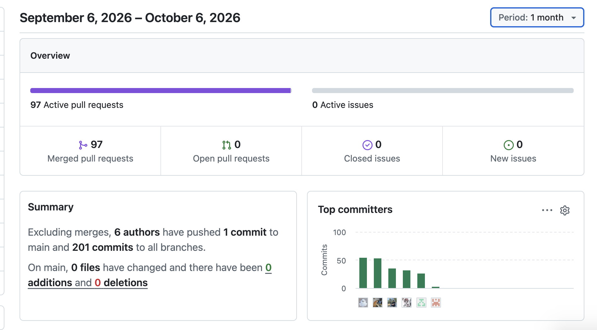

<div style="page-break-before: always; break-before: page;"></div>

# Contenido

- [Índice de tablas](#índice-de-tablas)
- [Índice de figuras](#índice-de-figuras)
- [Capítulo I: Presentación](#capítulo-i-presentación)
  - [1.1. Startup Profile](#11-startup-profile)
    - [1.1.1. Descripción de la Startup](#111-descripción-de-la-startup)
    - [1.1.2. Perfiles de integrantes del equipo](#112-perfiles-de-integrantes-del-equipo)
  - [1.2. Solution Profile](#12-solution-profile)
    - [1.2.1. Antecedentes y problemática](#121-antecedentes-y-problemática)
    - [1.2.2. Lean UX Process](#122-lean-ux-process)
      - [1.2.2.1. Lean UX Problem Statements](#1221-lean-ux-problem-statements)
      - [1.2.2.2. Lean UX Assumptions](#1222-lean-ux-assumptions)
      - [1.2.2.3. Lean UX Hypothesis Statements](#1223-lean-ux-hypothesis-statements)
      - [1.2.2.4. Lean UX Canvas](#1224-lean-ux-canvas)
  - [1.3. Segmentos objetivo](#13-segmentos-objetivo)
- [Capítulo II: Requirements Development and Software Solution Design](#capítulo-ii-requirements-development-and-software-solution-design)
  - [2.1. Competidores](#21-competidores)
    - [2.1.1. Análisis competitivo](#211-análisis-competitivo)
    - [2.1.2. Estrategias y tácticas frente a competidores](#212-estrategias-y-tácticas-frente-a-competidores)
  - [2.2. Entrevistas](#22-entrevistas)
    - [2.2.1. Diseño de entrevistas](#221-diseño-de-entrevistas)
    - [2.2.2. Registro de entrevistas](#222-registro-de-entrevistas)
    - [2.2.3. Análisis de entrevistas](#223-análisis-de-entrevistas)
  - [2.3. Needfinding](#23-needfinding)
    - [2.3.1. User Personas](#231-user-personas)
    - [2.3.2. User Task Matrix](#232-user-task-matrix)
    - [2.3.3. User Journey Mapping](#233-user-journey-mapping)
    - [2.3.4. Empathy Mapping](#234-empathy-mapping)
    - [2.3.5. Big Picture EventStorming](#235-big-picture-eventstorming)
    - [2.3.6. Ubiquitous Language](#236-ubiquitous-language)
  - [2.4. Requirements specification](#24-requirements-specification)
    - [2.4.1. User Stories](#241-user-stories)
    - [2.4.2. Impact Mapping](#242-impact-mapping)
    - [2.4.3. Product Backlog](#243-product-backlog)
  - [2.5. Strategic-Level Domain-Driven Design](#25-strategic-level-domain-driven-design)
    - [2.5.1. EventStorming](#251-eventstorming)
      - [2.5.1.1. Candidate Context Discovery](#2511-candidate-context-discovery)
      - [2.5.1.2. Domain Message Flows Modeling](#2512-domain-message-flows-modeling)
      - [2.5.1.3. Bounded Context Canvases](#2513-bounded-context-canvases)
    - [2.5.2. Context Mapping](#252-context-mapping)
      - [2.5.2.1. Heurísticas de Diseño y Exploración de Alternativas (What-If Analysis Global)](#2521-heurísticas-de-diseño-y-exploración-de-alternativas-what-if-analysis-global)
      - [2.5.2.2. Discusión de Alternativas de Context Mapping Global](#2522-discusión-de-alternativas-de-context-mapping-global)
      - [2.5.2.3. Context Map Global de Guardian+](#2523-context-map-global-de-guardian)
      - [2.5.2.4. Catálogo de Relaciones y Patrones de Integración Global](#2524-catálogo-de-relaciones-y-patrones-de-integración-global)
    - [2.5.3. Software Architecture](#253-software-architecture)
      - [2.5.3.1. Software Architecture Context Level Diagrams](#2531-software-architecture-context-level-diagrams)
      - [2.5.3.2. Software Architecture Container Level Diagrams](#2532-software-architecture-container-level-diagrams)
      - [2.5.3.3. Software Architecture Components Level Diagrams](#2533-software-architecture-components-level-diagrams)
      - [2.5.3.4. Software Architecture Deployment Diagrams](#2534-software-architecture-deployment-diagrams)
  - [2.6. Tactical-Level Domain-Driven Design](#26-tactical-level-domain-driven-design)
    - [2.6.1. Bounded Context: Emergency & Alerting](#261-bounded-context-emergency--alerting)
      - [2.6.1.1. Domain Layer](#2611-domain-layer)
      - [2.6.1.2. Interface Layer](#2612-interface-layer)
      - [2.6.1.3. Application Layer](#2613-application-layer)
      - [2.6.1.4. Infrastructure Layer](#2614-infrastructure-layer)
      - [2.6.1.5. Bounded Context Software Architecture Component Level Diagrams](#2615-bounded-context-software-architecture-component-level-diagrams)
      - [2.6.1.6. Bounded Context Software Architecture Code Level Diagrams](#2616-bounded-context-software-architecture-code-level-diagrams)
        - [2.6.1.6.1. Bounded Context Domain Layer Class Diagrams](#26161-bounded-context-domain-layer-class-diagrams)
        - [2.6.1.6.2. Bounded Context Database Design Diagram](#26162-bounded-context-database-design-diagram)
    - [2.6.2. Bounded Context: Health Monitoring](#262-bounded-context-health-monitoring)
      - [2.6.2.1. Domain Layer](#2621-domain-layer)
      - [2.6.2.2. Interface Layer](#2622-interface-layer)
      - [2.6.2.3. Application Layer](#2623-application-layer)
      - [2.6.2.4. Infrastructure Layer](#2624-infrastructure-layer)
      - [2.6.2.5. Bounded Context Software Architecture Component Level Diagrams](#2625-bounded-context-software-architecture-component-level-diagrams)
      - [2.6.2.6. Bounded Context Software Architecture Code Level Diagrams](#2626-bounded-context-software-architecture-code-level-diagrams)
        - [2.6.2.6.1. Bounded Context Domain Layer Class Diagrams](#26261-bounded-context-domain-layer-class-diagrams)
        - [2.6.2.6.2. Bounded Context Database Design Diagram](#26262-bounded-context-database-design-diagram)
    - [2.6.3. Bounded Context: Subscriptions](#263-bounded-context-subscriptions)
      - [2.6.3.1. Domain Layer](#2631-domain-layer)
      - [2.6.3.2. Interface Layer](#2632-interface-layer)
      - [2.6.3.3. Application Layer](#2633-application-layer)
      - [2.6.3.4. Infrastructure Layer](#2634-infrastructure-layer)
      - [2.6.3.5. Bounded Context Software Architecture Component Level Diagrams](#2635-bounded-context-software-architecture-component-level-diagrams)
      - [2.6.3.6. Bounded Context Software Architecture Code Level Diagrams](#2636-bounded-context-software-architecture-code-level-diagrams)
        - [2.6.3.6.1. Bounded Context Domain Layer Class Diagrams](#26361-bounded-context-domain-layer-class-diagrams)
        - [2.6.3.6.2. Bounded Context Database Design Diagram](#26362-bounded-context-database-design-diagram)
    - [2.6.4. Bounded Context: Profile](#264-bounded-context-profile)
      - [2.6.4.1. Domain Layer](#2641-domain-layer)
      - [2.6.4.2. Interface Layer](#2642-interface-layer)
      - [2.6.4.3. Application Layer](#2643-application-layer)
      - [2.6.4.4. Infrastructure Layer](#2644-infrastructure-layer)
      - [2.6.4.5. Bounded Context Software Architecture Component Level Diagrams](#2645-bounded-context-software-architecture-component-level-diagrams)
      - [2.6.4.6. Bounded Context Software Architecture Code Level Diagrams](#2646-bounded-context-software-architecture-code-level-diagrams)
        - [2.6.4.6.1. Bounded Context Domain Layer Class Diagrams](#26461-bounded-context-domain-layer-class-diagrams)
        - [2.6.4.6.2. Bounded Context Database Design Diagram](#26462-bounded-context-database-design-diagram)
    - [2.6.5. Bounded Context: Care Routines & Wellness](#265-bounded-context-care-routines--wellness)
      - [2.6.5.1. Domain Layer](#2651-domain-layer)
      - [2.6.5.2. Interface Layer](#2652-interface-layer)
      - [2.6.5.3. Application Layer](#2653-application-layer)
      - [2.6.5.4. Infrastructure Layer](#2654-infrastructure-layer)
      - [2.6.5.5. Bounded Context Software Architecture Component Level Diagrams](#2655-bounded-context-software-architecture-component-level-diagrams)
      - [2.6.5.6. Bounded Context Software Architecture Code Level Diagrams](#2656-bounded-context-software-architecture-code-level-diagrams)
        - [2.6.5.6.1. Bounded Context Domain Layer Class Diagrams](#26561-bounded-context-domain-layer-class-diagrams)
        - [2.6.5.6.2. Bounded Context Database Design Diagram](#26562-bounded-context-database-design-diagram)
    - [2.6.6. Bounded Context: Mobility & Geofencing](#266-bounded-context-mobility--geofencing)
      - [2.6.6.1. Domain Layer](#2661-domain-layer)
      - [2.6.6.2. Interface Layer](#2662-interface-layer)
      - [2.6.6.3. Application Layer](#2663-application-layer)
      - [2.6.6.4. Infrastructure Layer](#2664-infrastructure-layer)
      - [2.6.6.5. Bounded Context Software Architecture Component Level Diagrams](#2665-bounded-context-software-architecture-component-level-diagrams)
      - [2.6.6.6. Bounded Context Software Architecture Code Level Diagrams](#2666-bounded-context-software-architecture-code-level-diagrams)
        - [2.6.6.6.1. Bounded Context Domain Layer Class Diagrams](#26661-bounded-context-domain-layer-class-diagrams)
        - [2.6.6.6.2. Bounded Context Database Design Diagram](#26662-bounded-context-database-design-diagram)
    - [2.6.7. Bounded Context: IAM](#267-bounded-context-iam)
      - [2.6.7.1. Domain Layer](#2671-domain-layer)
      - [2.6.7.2. Interface Layer](#2672-interface-layer)
      - [2.6.7.3. Application Layer](#2673-application-layer)
      - [2.6.7.4. Infrastructure Layer](#2674-infrastructure-layer)
      - [2.6.7.5. Bounded Context Software Architecture Component Level Diagrams](#2675-bounded-context-software-architecture-component-level-diagrams)
      - [2.6.7.6. Bounded Context Software Architecture Code Level Diagrams](#2676-bounded-context-software-architecture-code-level-diagrams)
        - [2.6.7.6.1. Bounded Context Domain Layer Class Diagrams](#26761-bounded-context-domain-layer-class-diagrams)
        - [2.6.7.6.2. Bounded Context Database Design Diagram](#26762-bounded-context-database-design-diagram)
- [Capítulo III: Solution UI/UX Design](#capítulo-iii-solution-uiux-design)
  - [3.1. Product design](#31-product-design)
    - [3.1.1. Style Guidelines](#311-style-guidelines)
      - [3.1.1.1. General Style Guidelines](#3111-general-style-guidelines)
    - [3.1.2. Information Architecture](#312-information-architecture)
      - [3.1.2.1. Organization Systems](#3121-organization-systems)
      - [3.1.2.2. Labelling Systems](#3122-labelling-systems)
      - [3.1.2.3. SEO Tags and Meta Tags](#3123-seo-tags-and-meta-tags)
      - [3.1.2.4. Searching Systems](#3124-searching-systems)
      - [3.1.2.5. Navigation Systems](#3125-navigation-systems)
    - [3.1.3. Landing Page UI Design](#313-landing-page-ui-design)
      - [3.1.3.1. Landing Page Wireframe](#3131-landing-page-wireframe)
      - [3.1.3.2. Landing Page Mock-up](#3132-landing-page-mock-up)
    - [3.1.4. Mobile Applications UX/UI Design](#314-mobile-applications-uxui-design)
      - [3.1.4.1. Mobile Applications Wireframes](#3141-mobile-applications-wireframes)
      - [3.1.4.2. Mobile Applications Wireflow Diagrams](#3142-mobile-applications-wireflow-diagrams)
      - [3.1.4.3. Mobile Applications Mock-ups](#3143-mobile-applications-mock-ups)
      - [3.1.4.4. Mobile Applications User Flow Diagrams](#3144-mobile-applications-user-flow-diagrams)
      - [3.1.4.5. Mobile Applications Prototyping](#3145-mobile-applications-prototyping)
- [Capítulo IV: Product Implementation & Validation](#capítulo-iv-product-implementation--validation)
  - [4.1. Software Configuration Management](#41-software-configuration-management)
    - [4.1.1. Software Development Environment Configuration](#411-software-development-environment-configuration)
    - [4.1.2. Source Code Management](#412-source-code-management)
      - [4.1.2.1. GitFlow & Branching Strategy](#4121-gitflow--branching-strategy)
    - [4.1.3. Source Code Style Guide & Conventions](#413-source-code-style-guide--conventions)
    - [4.1.4. Software Deployment Configuration](#414-software-deployment-configuration)
  - [4.2. Landing Page & Mobile Application Implementation](#42-landing-page--mobile-application-implementation)
    - [4.2.1. Sprint 1](#421-sprint-1)
      - [4.2.1.1. Sprint Planning 1](#4211-sprint-planning-1)
      - [4.2.1.2. Aspect Leaders and Collaborators](#4212-aspect-leaders-and-collaborators)
      - [4.2.1.3. Sprint Backlog 1](#4213-sprint-backlog-1)
      - [4.2.1.4. Development Evidence for Sprint Review](#4214-development-evidence-for-sprint-review)
      - [4.2.1.5. Testing Suite Evidence for Sprint Review](#4215-testing-suite-evidence-for-sprint-review)
      - [4.2.1.6. Execution Evidence for Sprint Review](#4216-execution-evidence-for-sprint-review)
      - [4.2.1.7. Services Documentation Evidence for Sprint Review](#4217-services-documentation-evidence-for-sprint-review)
      - [4.2.1.8. Software Deployment Evidence for Sprint Review](#4218-software-deployment-evidence-for-sprint-review)
      - [4.2.1.9. Team Collaboration Insights during Sprint](#4219-team-collaboration-insights-during-sprint)
  - [4.3. Validation Interviews](#43-validation-interviews)
    - [4.3.1. Diseño de Entrevistas](#431-diseño-de-entrevistas)
    - [4.3.2. Registro de Entrevistas](#432-registro-de-entrevistas)
    - [4.3.3. Evaluaciones según heurísticas](#433-evaluaciones-según-heurísticas)
- [Conclusiones y recomendaciones](#conclusiones-y-recomendaciones)
- [Bibliografía](#bibliografía)

<div style="page-break-before: always; break-before: page;"></div>

# Índice de tablas

**Capítulo I: Presentación**

- [Tabla 1.1. Perfiles de los integrantes del equipo Healthify](#tabla-1-1)

**Capítulo II: Requirements Development and Software Solution Design**

- [Tabla 2.1. Competitive Analysis Landscape de Guardian+ frente a sus competidores](#tabla-2-1)
- [Tabla 2.2. Datos de la entrevista a Rocío Miranda Alvarado Silva](#tabla-2-2)
- [Tabla 2.3. Datos de la entrevista a Lucía Infante](#tabla-2-3)
- [Tabla 2.4. Datos de la entrevista a Junio Antenor Ayala](#tabla-2-4)
- [Tabla 2.5. Datos de la entrevista a Roxana Paola Diana](#tabla-2-5)
- [Tabla 2.6. Datos de la entrevista a Piero Segura](#tabla-2-6)
- [Tabla 2.7. Datos de la entrevista a Fernanda Llanos](#tabla-2-7)
- [Tabla 2.8. Datos de la entrevista a Gabriela Cuadros Curihuaman](#tabla-2-8)
- [Tabla 2.9. Características identificadas en el segmento de familiares](#tabla-2-9)
- [Tabla 2.10. Características identificadas en el segmento de cuidadores](#tabla-2-10)
- [Tabla 2.11. Elementos para la construcción de los arquetipos de usuario](#tabla-2-11)
- [Tabla 2.12. User Task Matrix de los segmentos de familiares y cuidadores](#tabla-2-12)
- [Tabla 2.13. User Story US01: Visualización de ritmo cardíaco en tiempo real](#tabla-2-13)
- [Tabla 2.14. User Story US02: Visualización de presión arterial estimada](#tabla-2-14)
- [Tabla 2.15. User Story US03: Visualización de saturación de oxígeno periférico (SpO₂)](#tabla-2-15)
- [Tabla 2.16. User Story US04: Supervisión de temperatura corporal continua](#tabla-2-16)
- [Tabla 2.17. User Story US05: Visualización de frecuencia respiratoria estimada](#tabla-2-17)
- [Tabla 2.18. User Story US06: Emisión y confirmación de recordatorios de medicación](#tabla-2-18)
- [Tabla 2.19. User Story US07: Análisis comparativo y tendencias históricas de signos vitales](#tabla-2-19)
- [Tabla 2.20. User Story US08: Detección automática de caídas y despacho de emergencia](#tabla-2-20)
- [Tabla 2.21. User Story US09: Generación de alertas por transgresión de umbrales biomédicos](#tabla-2-21)
- [Tabla 2.22. User Story US10: Confirmación manual de estado de bienestar tras incidente](#tabla-2-22)
- [Tabla 2.23. User Story US11: Escalamiento automatizado de alertas críticas no atendidas](#tabla-2-23)
- [Tabla 2.24. User Story US12: Configuración y parametrización de niveles de alerta](#tabla-2-24)
- [Tabla 2.25. User Story US13: Programación y notificación de consultas médicas](#tabla-2-25)
- [Tabla 2.26. User Story US14: Recordatorios programados para actividad física ligera](#tabla-2-26)
- [Tabla 2.27. User Story US15: Activación de auxilio mediante botón SOS en pulsera](#tabla-2-27)
- [Tabla 2.28. User Story US16: Administración de agenda de contactos de auxilio](#tabla-2-28)
- [Tabla 2.29. User Story US17: Estimación y registro de fases de sueño](#tabla-2-29)
- [Tabla 2.30. User Story US18: Telemetría de geolocalización en tiempo real](#tabla-2-30)
- [Tabla 2.31. User Story US19: Exportación de reporte cronológico de telemetría médica](#tabla-2-31)
- [Tabla 2.32. User Story US20: Notificación de nivel crítico de batería en wearable](#tabla-2-32)
- [Tabla 2.33. User Story US21: Sincronización y persistencia resiliente de telemetría (Offline Sync)](#tabla-2-33)
- [Tabla 2.34. User Story US22: Silenciamiento de alertas no críticas en el Care Circle](#tabla-2-34)
- [Tabla 2.35. User Story US23: Establecimiento de canal de comunicación directa](#tabla-2-35)
- [Tabla 2.36. User Story US24: Consolidación y despacho de reporte semanal de salud](#tabla-2-36)
- [Tabla 2.37. User Story US25: Despacho simultáneo a múltiples contactos de auxilio](#tabla-2-37)
- [Tabla 2.38. User Story US26: Recordatorios periódicos de hidratación y pausas activas](#tabla-2-38)
- [Tabla 2.39. User Story US27: Detección de inactividad física prolongada](#tabla-2-39)
- [Tabla 2.40. User Story US28: Delimitación y monitoreo perimetral mediante geocercas múltiples](#tabla-2-40)
- [Tabla 2.41. User Story US29: Previsión de agotamiento de stock y pedidos de medicinas](#tabla-2-41)
- [Tabla 2.42. User Story US30: Navegación entre secciones informativas de la Landing Page](#tabla-2-42)
- [Tabla 2.43. User Story US31: Presentación de características y beneficios clave del sistema](#tabla-2-43)
- [Tabla 2.44. User Story US32: Captura y procesamiento de solicitudes de contacto institucional](#tabla-2-44)
- [Tabla 2.45. User Story US33: Visualización comparativa de planes de suscripción Guardian+](#tabla-2-45)
- [Tabla 2.46. Technical Story TS01: Endpoint RESTful para consulta y filtrado de incidentes y alertas](#tabla-2-46)
- [Tabla 2.47. Technical Story TS02: Endpoint RESTful para ingesta de telemetría biomédica por lotes](#tabla-2-47)
- [Tabla 2.48. Spike SP01: Investigación de protocolos de transporte ligero y telemetría MQTT sobre ESP32-S3](#tabla-2-48)
- [Tabla 2.49. Spike SP02: Investigación de pasarela de pagos y cobro recurrente de suscripciones con Stripe](#tabla-2-49)
- [Tabla 2.50. Product Backlog de Guardian+](#tabla-2-50)
- [Tabla 2.51. Alternativas de Context Mapping evaluadas](#tabla-2-51)
- [Tabla 2.52. Leyenda de patrones del Context Map](#tabla-2-52)
- [Tabla 2.53. Catálogo de relaciones del Context Map](#tabla-2-53)
- [Tabla 2.54. Command Handlers de Subscriptions](#tabla-2-54)
- [Tabla 2.55. Query Handlers de Subscriptions](#tabla-2-55)
- [Tabla 2.56. Event Handlers de Subscriptions](#tabla-2-56)

**Capítulo III: Solution UI/UX Design**

- [Tabla 3.1. Paleta de colores de Guardian+](#tabla-3-1)
- [Tabla 3.2. Escala tipográfica de Guardian+](#tabla-3-2)
- [Tabla 3.3. Criterios de etiquetado](#tabla-3-3)
- [Tabla 3.4. Correspondencia entre el Ubiquitous Language y las etiquetas de interfaz](#tabla-3-4)
- [Tabla 3.5. Etiquetas del Landing Page](#tabla-3-5)
- [Tabla 3.6. Funcionalidades del Landing Page y sección asociada en la aplicación](#tabla-3-6)
- [Tabla 3.7. Etiquetas de la navegación principal de la aplicación](#tabla-3-7)
- [Tabla 3.8. Etiquetas dentro de cada sección de la aplicación](#tabla-3-8)
- [Tabla 3.9. Etiquetas de estado](#tabla-3-9)
- [Tabla 3.10. Etiquetas de la pulsera](#tabla-3-10)
- [Tabla 3.11. Elementos SEO del Landing Page](#tabla-3-11)
- [Tabla 3.12. Etiquetas HTML de SEO del Landing Page](#tabla-3-12)
- [Tabla 3.13. Elementos ASO de la aplicación móvil](#tabla-3-13)
- [Tabla 3.14. Anatomía del desplegable con búsqueda](#tabla-3-14)
- [Tabla 3.15. Elementos del filtrado por etiquetas](#tabla-3-15)
- [Tabla 3.16. Aplicación de los mecanismos de búsqueda por sección](#tabla-3-16)
- [Tabla 3.17. Mecanismos de navegación del Landing Page](#tabla-3-17)
- [Tabla 3.18. Tipos de navegación de la aplicación móvil](#tabla-3-18)
- [Tabla 3.19. Reglas de navegación de la aplicación móvil](#tabla-3-19)
- [Tabla 3.20. Ruta de emergencia](#tabla-3-20)
- [Tabla 3.21. Pantallas de los wireframes de Health Monitoring](#tabla-3-21)
- [Tabla 3.22. Pantallas de los wireframes de Profile, IAM y Subscriptions](#tabla-3-22)
- [Tabla 3.23. Pantallas de los mock-ups de Health Monitoring](#tabla-3-23)
- [Tabla 3.24. Pantallas de los mock-ups de Extras](#tabla-3-24)
- [Tabla 3.25. Criterios de interacción del prototipo](#tabla-3-25)
- [Tabla 3.26. Flujos cubiertos por el prototipo](#tabla-3-26)
- [Tabla 3.27. Enlaces al prototipo y al video del recorrido](#tabla-3-27)

**Capítulo IV: Product Implementation & Validation**

- [Tabla 4.1. Herramientas de Project Management](#tabla-4-1)
- [Tabla 4.2. Herramientas de Requirements Management](#tabla-4-2)
- [Tabla 4.3. Herramientas de Product UX/UI Design](#tabla-4-3)
- [Tabla 4.4. Herramientas de Software Architecture & Modeling](#tabla-4-4)
- [Tabla 4.5. Herramientas de Software Development](#tabla-4-5)
- [Tabla 4.6. Herramientas de Software Testing](#tabla-4-6)
- [Tabla 4.7. Herramientas de Software Deployment](#tabla-4-7)
- [Tabla 4.8. Herramientas de Software Documentation](#tabla-4-8)
- [Tabla 4.9. Technology Stack de Guardian+](#tabla-4-9)
- [Tabla 4.10. Repositorios de Guardian+](#tabla-4-10)
- [Tabla 4.11. Ramas del workflow GitFlow](#tabla-4-11)
- [Tabla 4.12. Convenciones de nombres de ramas](#tabla-4-12)
- [Tabla 4.13. Tipos de Conventional Commits](#tabla-4-13)
- [Tabla 4.14. Lenguajes y tecnologías por producto](#tabla-4-14)
- [Tabla 4.15. Resumen de convenciones de nombres](#tabla-4-15)
- [Tabla 4.16. Deployment Overview de Guardian+](#tabla-4-16)
- [Tabla 4.17. Entornos de despliegue](#tabla-4-17)
- [Tabla 4.18. Pasos del despliegue del Landing Page](#tabla-4-18)
- [Tabla 4.19. Recursos de Azure de los Web Services](#tabla-4-19)
- [Tabla 4.20. Preparación del repositorio de los Web Services](#tabla-4-20)
- [Tabla 4.21. Aprovisionamiento de los Web Services en Azure](#tabla-4-21)
- [Tabla 4.22. Variables de entorno de los Web Services](#tabla-4-22)
- [Tabla 4.23. Pasos del despliegue de la aplicación móvil](#tabla-4-23)
- [Tabla 4.24. Recursos aprovisionados para el IoT Simulator](#tabla-4-24)
- [Tabla 4.25. Preparación y despliegue del IoT Simulator](#tabla-4-25)
- [Tabla 4.26. Variables de Terraform del IoT Simulator](#tabla-4-26)
- [Tabla 4.27. Variables de entorno del IoT Simulator](#tabla-4-27)
- [Tabla 4.28. Consideraciones de despliegue](#tabla-4-28)
- [Tabla 4.29. Sprint Planning del Sprint 1](#tabla-4-29)
- [Tabla 4.30. User Stories comprometidas en el Sprint 1](#tabla-4-30)
- [Tabla 4.31. Leadership-and-Collaboration Matrix del Sprint 1](#tabla-4-31)
- [Tabla 4.32. Sprint Backlog 1](#tabla-4-32)
- [Tabla 4.33. Commits del Landing Page](#tabla-4-33)
- [Tabla 4.34. Commits de Web Services: Emergency & Alerting](#tabla-4-34)
- [Tabla 4.35. Commits de Web Services: Care Routines & Wellness](#tabla-4-35)
- [Tabla 4.36. Commits de Web Services: Health Monitoring](#tabla-4-36)
- [Tabla 4.37. Commits de Web Services: Mobility & Geofencing](#tabla-4-37)
- [Tabla 4.38. Commits de Web Services: Profile](#tabla-4-38)
- [Tabla 4.39. Commits de Mobile App: Emergency & Alerting](#tabla-4-39)
- [Tabla 4.40. Commits de Mobile App: Health Monitoring](#tabla-4-40)
- [Tabla 4.41. Commits de IoT Simulator](#tabla-4-41)
- [Tabla 4.42. Unit Tests del Bounded Context Profile](#tabla-4-42)
- [Tabla 4.43. Commit de los Unit Tests de Profile](#tabla-4-43)
- [Tabla 4.44. Video de ejecución del Landing Page](#tabla-4-44)
- [Tabla 4.45. Video de ejecución de la aplicación móvil](#tabla-4-45)
- [Tabla 4.46. Video de ejecución de los Web Services](#tabla-4-46)
- [Tabla 4.47. Endpoints de Emergency & Alerting](#tabla-4-47)
- [Tabla 4.48. Endpoints de Health Monitoring](#tabla-4-48)
- [Tabla 4.49. Endpoints de Care Routines & Wellness](#tabla-4-49)
- [Tabla 4.50. Procesos de Care Routines & Wellness disparados por el sistema](#tabla-4-50)
- [Tabla 4.51. Endpoints de Mobility & Geofencing](#tabla-4-51)
- [Tabla 4.52. Endpoints de Profile](#tabla-4-52)
- [Tabla 4.53. Despliegue del Landing Page en el Sprint 1](#tabla-4-53)
- [Tabla 4.54. Pasos del despliegue del Landing Page en el Sprint 1](#tabla-4-54)
- [Tabla 4.55. Resultados de Lighthouse del Landing Page](#tabla-4-55)
- [Tabla 4.56. Despliegue de los Web Services en el Sprint 1](#tabla-4-56)
- [Tabla 4.57. Pasos del despliegue de los Web Services en el Sprint 1](#tabla-4-57)
- [Tabla 4.58. Despliegue del IoT Simulator en el Sprint 1](#tabla-4-58)
- [Tabla 4.59. Pasos del despliegue del IoT Simulator en el Sprint 1](#tabla-4-59)
- [Tabla 4.60. Datos de la entrevista de validación a Rocio Alvarado](#tabla-4-60)
- [Tabla 4.61. Datos de la entrevista de validación a Junior Antenor](#tabla-4-61)
- [Tabla 4.62. Datos de la entrevista de validación a Roxana Paola Diana](#tabla-4-62)
- [Tabla 4.63. Datos de la entrevista de validación a Piero Segurda Cardenas](#tabla-4-63)
- [Tabla 4.64. Datos de la entrevista de validación a Gabriela Cuadros](#tabla-4-64)
- [Tabla 4.65. Datos generales de la evaluación heurística](#tabla-4-65)
- [Tabla 4.66. Escala de severidad de la evaluación heurística](#tabla-4-66)
- [Tabla 4.67. Resumen de problemas de la evaluación heurística](#tabla-4-67)

<div style="page-break-before: always; break-before: page;"></div>

# Índice de figuras

**Capítulo I: Presentación**

- [Figura 1.1. Análisis 5W2H de la problemática](#figura-1-1)
- [Figura 1.2. Lean UX Canvas de Guardian+](#figura-1-2)

**Capítulo II: Requirements Development and Software Solution Design**

- [Figura 2.1. Captura de la entrevista a Rocío Miranda Alvarado Silva](#figura-2-1)
- [Figura 2.2. Captura de la entrevista a Lucía Infante](#figura-2-2)
- [Figura 2.3. Captura de la entrevista a Junio Antenor Ayala](#figura-2-3)
- [Figura 2.4. Captura de la entrevista a Roxana Paola Diana](#figura-2-4)
- [Figura 2.5. Captura de la entrevista a Piero Segura](#figura-2-5)
- [Figura 2.6. Captura de la entrevista a Fernanda Llanos](#figura-2-6)
- [Figura 2.7. Captura de la entrevista a Gabriela Cuadros Curihuaman](#figura-2-7)
- [Figura 2.8. User Persona del segmento de familiares](#figura-2-8)
- [Figura 2.9. User Persona del segmento de cuidadores](#figura-2-9)
- [Figura 2.10. User Journey Map del segmento de familiares](#figura-2-10)
- [Figura 2.11. User Journey Map del segmento de cuidadores](#figura-2-11)
- [Figura 2.12. Empathy Map del segmento de familiares](#figura-2-12)
- [Figura 2.13. Empathy Map del segmento de cuidadores](#figura-2-13)
- [Figura 2.14. Big Picture EventStorming de Guardian+](#figura-2-14)
- [Figura 2.15. Impact Mapping de Guardian+](#figura-2-15)
- [Figura 2.16. Eventos del Big Picture EventStorming usados como punto de partida](#figura-2-16)
- [Figura 2.17. EventStorming del Bounded Context Emergency & Alerting](#figura-2-17)
- [Figura 2.18. EventStorming del Bounded Context Health Monitoring](#figura-2-18)
- [Figura 2.19. EventStorming del Bounded Context Care Routines & Wellness](#figura-2-19)
- [Figura 2.20. EventStorming del Bounded Context Mobility & Geofencing](#figura-2-20)
- [Figura 2.21. EventStorming del Bounded Context IAM](#figura-2-21)
- [Figura 2.22. EventStorming del Bounded Context Profile](#figura-2-22)
- [Figura 2.23. EventStorming del Bounded Context Subscriptions](#figura-2-23)
- [Figura 2.24. Domain message flow del flujo de caída confirmada](#figura-2-24)
- [Figura 2.25. Domain message flow del flujo de SOS manual](#figura-2-25)
- [Figura 2.26. Domain message flow del flujo de anomalía biométrica reconocida a tiempo](#figura-2-26)
- [Figura 2.27. Domain message flow del flujo de anomalía biométrica escalada](#figura-2-27)
- [Figura 2.28. Domain message flow del flujo de recordatorio de medicación reemitido](#figura-2-28)
- [Figura 2.29. Domain message flow del flujo de inactividad prolongada](#figura-2-29)
- [Figura 2.30. Bounded Context Canvas de Emergency & Alerting](#figura-2-30)
- [Figura 2.31. Bounded Context Canvas de Health Monitoring](#figura-2-31)
- [Figura 2.32. Bounded Context Canvas de Care Routines & Wellness](#figura-2-32)
- [Figura 2.33. Bounded Context Canvas de Subscriptions](#figura-2-33)
- [Figura 2.34. Bounded Context Canvas de Profile](#figura-2-34)
- [Figura 2.35. Bounded Context Canvas de Mobility & Geofencing](#figura-2-35)
- [Figura 2.36. Bounded Context Canvas de IAM](#figura-2-36)
- [Figura 2.37. Context Map global de Guardian+](#figura-2-37)
- [Figura 2.38. Context Map de las señales que disparan alertas](#figura-2-38)
- [Figura 2.39. Context Map de identidad y sistemas externos](#figura-2-39)
- [Figura 2.40. Diagrama de contexto de Guardian+](#figura-2-40)
- [Figura 2.41. Diagrama de contenedores de Guardian+](#figura-2-41)
- [Figura 2.42. Diagrama de componentes de la Guardian+ REST API](#figura-2-42)
- [Figura 2.43. Diagrama de despliegue de Guardian+](#figura-2-43)
- [Figura 2.44. Diagrama de componentes del Bounded Context Emergency & Alerting](#figura-2-44)
- [Figura 2.45. Diagrama de clases de la Domain Layer de Emergency & Alerting](#figura-2-45)
- [Figura 2.46. Diagrama de base de datos de Emergency & Alerting](#figura-2-46)
- [Figura 2.47. Diagrama de componentes del Bounded Context Health Monitoring](#figura-2-47)
- [Figura 2.48. Diagrama de clases de la Domain Layer de Health Monitoring](#figura-2-48)
- [Figura 2.49. Diagrama de base de datos de Health Monitoring](#figura-2-49)
- [Figura 2.50. Diagrama de componentes del Bounded Context Subscriptions](#figura-2-50)
- [Figura 2.51. Diagrama de clases de la Domain Layer de Subscriptions](#figura-2-51)
- [Figura 2.52. Diagrama de base de datos de Subscriptions](#figura-2-52)
- [Figura 2.53. Diagrama de componentes del Bounded Context Profile](#figura-2-53)
- [Figura 2.54. Diagrama de clases de la Domain Layer de Profile](#figura-2-54)
- [Figura 2.55. Diagrama de base de datos de Profile](#figura-2-55)
- [Figura 2.56. Diagrama de componentes del Bounded Context Care Routines & Wellness](#figura-2-56)
- [Figura 2.57. Diagrama de clases de la Domain Layer de Care Routines & Wellness](#figura-2-57)
- [Figura 2.58. Diagrama de base de datos de Care Routines & Wellness](#figura-2-58)
- [Figura 2.59. Diagrama de componentes del Bounded Context Mobility & Geofencing](#figura-2-59)
- [Figura 2.60. Diagrama de clases de la Domain Layer de Mobility & Geofencing](#figura-2-60)
- [Figura 2.61. Diagrama de base de datos de Mobility & Geofencing](#figura-2-61)
- [Figura 2.62. Diagrama de componentes del Bounded Context IAM](#figura-2-62)
- [Figura 2.63. Diagrama de clases de la Domain Layer de IAM](#figura-2-63)
- [Figura 2.64. Diagrama de base de datos de IAM](#figura-2-64)
- [Figura 2.65. Esquema físico consolidado de la base de datos de Guardian+](#figura-2-65)

**Capítulo III: Solution UI/UX Design**

- [Figura 3.1. Paleta de colores aplicada en el design system](#figura-3-1)
- [Figura 3.2. Tipografía aplicada en el design system](#figura-3-2)
- [Figura 3.3. Espaciado, bordes y elevaciones del design system](#figura-3-3)
- [Figura 3.4. Ejemplo de componentes con los lineamientos de estilo](#figura-3-4)
- [Figura 3.5. Ejemplo de vista con los lineamientos de estilo](#figura-3-5)
- [Figura 3.6. Esquemas de organización de la aplicación móvil](#figura-3-6)
- [Figura 3.7. Navegación del Landing Page](#figura-3-7)
- [Figura 3.8. Mapa de navegación de la aplicación móvil](#figura-3-8)
- [Figura 3.9. Wireframe de escritorio del Landing Page: Cómo funciona](#figura-3-9)
- [Figura 3.10. Wireframe de escritorio del Landing Page: Beneficios](#figura-3-10)
- [Figura 3.11. Wireframe de escritorio del Landing Page: Por qué Guardian+](#figura-3-11)
- [Figura 3.12. Wireframe de escritorio del Landing Page: Precios](#figura-3-12)
- [Figura 3.13. Wireframe de escritorio del Landing Page: Contacto](#figura-3-13)
- [Figura 3.14. Wireframes móviles del Landing Page](#figura-3-14)
- [Figura 3.15. Mock-up de escritorio del Landing Page: Cómo funciona](#figura-3-15)
- [Figura 3.16. Mock-up de escritorio del Landing Page: Beneficios](#figura-3-16)
- [Figura 3.17. Mock-up de escritorio del Landing Page: Por qué Guardian+](#figura-3-17)
- [Figura 3.18. Mock-up de escritorio del Landing Page: Precios](#figura-3-18)
- [Figura 3.19. Mock-up de escritorio del Landing Page: Contacto](#figura-3-19)
- [Figura 3.20. Mock-ups móviles del Landing Page](#figura-3-20)
- [Figura 3.21. Wireframes de Health Monitoring](#figura-3-21)
- [Figura 3.22. Wireframes de Profile, IAM y Subscriptions](#figura-3-22)
- [Figura 3.23. Wireframes de Emergency & Alerting](#figura-3-23)
- [Figura 3.24. Wireframes de Care Routines & Wellness](#figura-3-24)
- [Figura 3.25. Wireflow de Health Monitoring: Consultar ritmo cardíaco (US01)](#figura-3-25)
- [Figura 3.26. Wireflow de Health Monitoring: Consultar presión arterial (US02)](#figura-3-26)
- [Figura 3.27. Wireflow de Health Monitoring: Consultar saturación de oxígeno (US03)](#figura-3-27)
- [Figura 3.28. Wireflow de Health Monitoring: Supervisar temperatura corporal (US04)](#figura-3-28)
- [Figura 3.29. Wireflow de Health Monitoring: Consultar frecuencia respiratoria (US05)](#figura-3-29)
- [Figura 3.30. Wireflow de Health Monitoring: Analizar tendencias históricas (US07)](#figura-3-30)
- [Figura 3.31. Wireflow de Health Monitoring: Exportar historial de telemetría (US19)](#figura-3-31)
- [Figura 3.32. Wireflow de Health Monitoring: Sincronizar telemetría sin conexión (US21)](#figura-3-32)
- [Figura 3.33. Wireflow de Health Monitoring: Revisar reporte semanal de salud (US24)](#figura-3-33)
- [Figura 3.34. Wireflow de Extras: Gestionar información personal](#figura-3-34)
- [Figura 3.35. Wireflow de Extras: Consultar entorno de cuidado (persona bajo cuidado)](#figura-3-35)
- [Figura 3.36. Wireflow de Extras: Consultar entorno de cuidado (círculo de cuidado)](#figura-3-36)
- [Figura 3.37. Wireflow de Extras: Consultar entorno de cuidado (pulsera)](#figura-3-37)
- [Figura 3.38. Wireflow de Extras: Consultar suscripción actual](#figura-3-38)
- [Figura 3.39. Wireflow de Extras: Configurar preferencias de la aplicación (idioma)](#figura-3-39)
- [Figura 3.40. Wireflow de Extras: Configurar preferencias de la aplicación (accesibilidad)](#figura-3-40)
- [Figura 3.41. Wireflow de Extras: Cerrar sesión de forma segura](#figura-3-41)
- [Figura 3.42. Wireflow de Emergency & Alerting: Atender una alerta de caída (US08, US11)](#figura-3-42)
- [Figura 3.43. Wireflow de Emergency & Alerting: Responder a un SOS (US15)](#figura-3-43)
- [Figura 3.44. Wireflow de Emergency & Alerting: Seguir una alerta de signos vitales (US09, US10)](#figura-3-44)
- [Figura 3.45. Wireflow de Care Routines & Wellness: Programar una toma de medicación (US06)](#figura-3-45)
- [Figura 3.46. Wireflow de Care Routines & Wellness: Agendar una cita médica (US13)](#figura-3-46)
- [Figura 3.47. Mock-ups de Health Monitoring](#figura-3-47)
- [Figura 3.48. Mock-ups de Extras](#figura-3-48)
- [Figura 3.49. Mock-ups de Emergency & Alerting](#figura-3-49)
- [Figura 3.50. Mock-ups de Care Routines & Wellness](#figura-3-50)
- [Figura 3.51. User flow de Mobility & Geofencing: Consultar la ubicación en tiempo real](#figura-3-51)
- [Figura 3.52. User flow de Mobility & Geofencing: Comunicarse directamente con la persona bajo cuidado](#figura-3-52)
- [Figura 3.53. User flow de Mobility & Geofencing: Configurar y monitorear zonas seguras](#figura-3-53)
- [Figura 3.54. User flow de Health Monitoring: Consultar ritmo cardíaco (US01)](#figura-3-54)
- [Figura 3.55. User flow de Health Monitoring: Consultar presión arterial (US02)](#figura-3-55)
- [Figura 3.56. User flow de Health Monitoring: Consultar saturación de oxígeno (US03)](#figura-3-56)
- [Figura 3.57. User flow de Health Monitoring: Supervisar temperatura corporal (US04)](#figura-3-57)
- [Figura 3.58. User flow de Health Monitoring: Consultar frecuencia respiratoria (US05)](#figura-3-58)
- [Figura 3.59. User flow de Health Monitoring: Analizar tendencias históricas (US07)](#figura-3-59)
- [Figura 3.60. User flow de Health Monitoring: Exportar historial de telemetría (US19)](#figura-3-60)
- [Figura 3.61. User flow de Health Monitoring: Sincronizar telemetría sin conexión (US21)](#figura-3-61)
- [Figura 3.62. User flow de Health Monitoring: Revisar reporte semanal de salud (US24)](#figura-3-62)
- [Figura 3.63. User flow de Extras: Gestionar información personal](#figura-3-63)
- [Figura 3.64. User flow de Extras: Consultar entorno de cuidado](#figura-3-64)
- [Figura 3.65. User flow de Extras: Consultar suscripción actual](#figura-3-65)
- [Figura 3.66. User flow de Extras: Configurar preferencias de la aplicación](#figura-3-66)
- [Figura 3.67. User flow de Emergency & Alerting: Atender una alerta de caída (US08, US11)](#figura-3-67)
- [Figura 3.68. User flow de Emergency & Alerting: Responder a un SOS (US15, US25)](#figura-3-68)
- [Figura 3.69. User flow de Emergency & Alerting: Seguir una alerta de signos vitales (US09, US10)](#figura-3-69)
- [Figura 3.70. Conexiones del prototipo de Guardian+](#figura-3-70)
- [Figura 3.71. Conexiones de la sección Salud en el prototipo](#figura-3-71)
- [Figura 3.72. Ejecución del prototipo desde la pantalla de Inicio](#figura-3-72)

**Capítulo IV: Product Implementation & Validation**

- [Figura 4.1. Diagrama de despliegue de Guardian+](#figura-4-1)
- [Figura 4.2. Tablero del Sprint 1 en ClickUp (parte 1)](#figura-4-2)
- [Figura 4.3. Tablero del Sprint 1 en ClickUp (parte 2)](#figura-4-3)
- [Figura 4.4. Ejecución de los Unit Tests de Profile](#figura-4-4)
- [Figura 4.5. Landing Page en ejecución](#figura-4-5)
- [Figura 4.6. Aplicación móvil en ejecución en el emulador](#figura-4-6)
- [Figura 4.7. Web Services en ejecución en Swagger UI](#figura-4-7)
- [Figura 4.8. Landing Page publicado en Cloudflare Pages](#figura-4-8)
- [Figura 4.9. Grupo de recursos guardian-plus-rg en Azure](#figura-4-9)
- [Figura 4.10. Máquina virtual guardian-plus-vm en Azure](#figura-4-10)
- [Figura 4.11. Servidor de Azure Database for PostgreSQL](#figura-4-11)
- [Figura 4.12. Ejecuciones de los workflows de GitHub Actions](#figura-4-12)
- [Figura 4.13. Documentación de los Web Services en Swagger UI](#figura-4-13)
- [Figura 4.14. Insights del repositorio de los Web Services](#figura-4-14)
- [Figura 4.15. Insights del repositorio de la aplicación móvil](#figura-4-15)
- [Figura 4.16. Insights del repositorio del Landing Page](#figura-4-16)
- [Figura 4.17. Insights del repositorio del IoT Simulator](#figura-4-17)
- [Figura 4.18. Captura de la entrevista de validación a Rocio Alvarado](#figura-4-18)
- [Figura 4.19. Captura de la entrevista de validación a Junior Antenor](#figura-4-19)
- [Figura 4.20. Captura de la entrevista de validación a Roxana Paola Diana](#figura-4-20)
- [Figura 4.21. Captura de la entrevista de validación a Piero Segurda Cardenas](#figura-4-21)
- [Figura 4.22. Captura de la entrevista de validación a Gabriela Cuadros](#figura-4-22)
- [Figura 4.23. Pantalla Nueva toma del módulo de Rutinas](#figura-4-23)
- [Figura 4.24. Pantalla Nueva cita del módulo de Rutinas](#figura-4-24)
- [Figura 4.25. Pantalla Nueva actividad del módulo de Rutinas](#figura-4-25)
- [Figura 4.26. Pantalla Contactos de emergencia](#figura-4-26)
- [Figura 4.27. Panel Buscar y filtrar del módulo de Salud](#figura-4-27)
- [Figura 4.28. Pantalla Exportar expediente](#figura-4-28)
- [Figura 4.29. Pantalla Sueño del módulo de Rutinas](#figura-4-29)

<div style="page-break-before: always; break-before: page;"></div>

# Student Outcome

**ABET - EAC - Student Outcome 7**

Criterio: *La capacidad de adquirir y aplicar nuevos conocimientos según sea necesario, utilizando estrategias de aprendizaje apropiadas.*

En el siguiente cuadro se describen las acciones realizadas y enunciados de conclusiones por parte del grupo, que permiten sustentar el haber alcanzado el logro del ABET – EAC - Student Outcome 7.

<table>
<thead>
<tr>
<th>Criterio específico</th>
<th>Acciones realizadas</th>
<th>Conclusiones</th>
</tr>
</thead>
<tbody>
<tr>
<td>Actualiza conceptos y conocimientos necesarios para su desarrollo profesional y en especial para su proyecto en soluciones de software.</td>
<td>
<strong>Azama Fukuda, Juan Pablo</strong><br>
<em>AV1:</em> Investigué y apliqué el patrón Bounded Context Canvas (Nick Tune V1) y el enfoque táctico de Domain-Driven Design (agregados, value objects, domain services y repositorios) para diseñar desde cero el Bounded Context IAM: registro y verificación de credenciales, autenticación con segundo factor (OTP) y recuperación de contraseña. También diseñé y documenté el Bounded Context Health Monitoring, contrastando mi propio modelo de dominio contra el diagrama de clases que ya habíamos elaborado como equipo para asegurarme de que ambos coincidieran. Redacté y prioricé las User Stories del proyecto, documenté el User Task Matrix y elaboré el análisis competitivo con las estrategias frente a nuestros competidores. Para terminar de documentar IAM aprendí por mi cuenta dos notaciones que no vimos en clase, Structurizr DSL para el diagrama de componentes C4 y PlantUML para el diagrama de clases, y las apliqué directamente sobre mi propio diseño.<br>
<em>TB1:</em> Elaboré la guía de estilos general y los Searching Systems de la arquitectura de información, y diseñé los flujos, wireframes y mock-ups del Bounded Context Health Monitoring en la aplicación móvil. Como líder de UX/UI Design, Health Monitoring e IAM, implementé Health Monitoring en los Web Services con Spring Boot y desarrollé las pantallas de inicio de sesión y de monitoreo de salud en Kotlin con Jetpack Compose. También construí en Python el simulador IoT que reproduce los datos de la pulsera para probar el sistema sin el dispositivo físico. Por último, preparé el Sprint Planning, el Sprint Backlog y la matriz de líderes y colaboradores del Sprint 1 en ClickUp.
<br><br>
<strong>Mechan Montenegro, Luciana Carolina</strong><br>
<em>AV1:</em> Reforcé el concepto de Análisis Competitivo como herramienta estratégica para contrastar la propuesta de valor de una solución frente al mercado, aplicándolo dentro del contexto específico de este proyecto. Amplié y actualicé mis conocimientos sobre User Personas dentro del proceso de Needfinding, afinando la forma en que sintetizo información cualitativa en arquetipos de usuario. Profundicé en Domain-Driven Design (DDD) a nivel estratégico, reforzando el uso de Event Storming como técnica colaborativa para el descubrimiento del dominio, así como el Bounded Context Canvas para delimitar responsabilidades entre subdominios. De igual forma, actualicé mi manejo del C4 Model para la representación de arquitectura de software en distintos niveles de abstracción, y reforcé el concepto de Ubiquitous Language como práctica para establecer un vocabulario común entre el equipo técnico y los stakeholders del negocio.<br>
<em>TB1:</em> Actualicé y apliqué conceptos de diseño de interfaces móviles al elaborar en Figma las pantallas principales del bounded context de Care Routines & Wellness, cuidando la consistencia visual con las Style Guidelines del proyecto, la usabilidad y los principios de diseño inclusivo para usuarios como familiares y cuidadores. Además, amplié mi manejo de Domain-Driven Design a nivel táctico al implementar el backend con Java y Spring Boot, llevando el modelo de dominio diseñado en la entrega anterior a código organizado en capas (Domain, Application, Interface e Infrastructure).
<br><br>
<strong>Luis Miranda, Diego Andres</strong><br>
<em>AV1:</em> Identifiqué al público objetivo al que va dirigido el producto: cuidadores y familiares. Las entrevistas que realicé me permitieron transformar sus necesidades en requerimientos funcionales. Además, elaboré la descripción de la startup y diseñé un bounded context de Mobility & Geofencing, complementado con sesiones de event storming, canvas estratégico y la aplicación de Tactical Domain Driven Design dividido en capas (interface, domain, application, infrastructure). Finalmente, desarrollé diagramas de base de datos y modelos arquitectónicos C4, lo que me exigió investigar y aplicar herramientas de modelado avanzadas. Estas actividades reflejan mi capacidad de aprender de manera autónoma y aplicar ese aprendizaje en la práctica.<br>
<em>TB1:</em> Me encargué de diseñar la interfaz (wireframes, mock-ups y flujos) del Bounded Context Mobility & Geofencing, teniendo en cuenta la arquitectura de información, nuestras User Stories y sus criterios de aceptación para cumplir cada user goal. Además, participé en la implementación de este contexto en el backend, integrado con la arquitectura por capas definida con DDD. También apoyé en el apartado Development Evidence for Sprint Review, documentando las evidencias del avance del proyecto (Web Services, Landing Page y aplicación móvil).
<br><br>
<strong>López Monroy, Rodrigo Alfredo</strong><br>
<em>AV1:</em> Apliqué Domain-Driven Design en sus dos niveles para diseñar el Bounded Context Emergency & Alerting, que es el Core Domain de Guardian+. En lo estratégico partí del EventStorming para delimitar el contexto y armar su Bounded Context Canvas, y en lo táctico definí sus agregados, value objects y eventos de dominio sobre una arquitectura de cuatro capas. Modelé el recorrido completo de una emergencia, desde la señal de riesgo hasta la respuesta del cuidador, con sus reglas de despacho y escalamiento. Para documentarlo aprendí por mi cuenta Mermaid y Graphviz, que no vimos en clase, y me permitieron mantener los diagramas como código versionado junto al informe.<br>
<em>TB1:</em> Desarrollé los Labelling Systems y Navigation Systems de la arquitectura de información. Para ello investigué los tipos de navegación y las recomendaciones de Material Design para la bottom navigation bar, que limitan los destinos principales a cinco, lo que me llevó a reubicar Perfil en la barra superior. Implementé el Bounded Context Emergency & Alerting en los Web Services con Spring Boot y sus pantallas en la aplicación móvil con Kotlin y Jetpack Compose, además de construir el Landing Page con React. Para publicar el backend aprendí a desplegarlo en una máquina virtual de Azure con Docker Compose, Caddy y Azure Database for PostgreSQL, y a automatizar ese despliegue con GitHub Actions. También conecté el prototipo navegable en Figma y rehíce el Context Map con la notación de DDD Crew usando Context Mapper.
<br><br>
<strong>Sanchez Cuadrado, Juan Antonio</strong><br>
<em>AV1:</em> Durante el desarrollo de Guardian+ profundicé y apliqué conceptos de Domain-Driven Design y arquitectura de software para diseñar y documentar los Bounded Contexts Subscriptions y Profile. Trabajé desde el EventStorming y los Bounded Context Canvases hasta el diseño táctico, definiendo Aggregate Roots, Entities, Value Objects, Domain Policies, Repository Interfaces y las capas Interface, Application, Domain e Infrastructure. Además, aprendí y apliqué Structurizr DSL para elaborar los diagramas de componentes C4 y reforcé el modelado UML en Lucidchart para mantener los Code Level Diagrams alineados con el modelo de persistencia. Durante la revisión también identifiqué y corregí inconsistencias entre los modelos de dominio, los diagramas de componentes y el ERD, manteniendo coherencia entre las reglas de negocio, la arquitectura y la base de datos.<br>
<em>TB1:</em> Actualicé y apliqué mis conocimientos de Domain-Driven Design y arquitectura por capas durante la implementación del Bounded Context Profile de Guardian+. Pasé del diseño conceptual a una implementación funcional mediante aggregates como UserProfile, CareRecipientProfile, CareRelationship y UserPreferences, incorporando commands, queries, domain events, repositories, servicios de aplicación, persistencia con JPA y endpoints REST. También reforcé mis conocimientos de pruebas automatizadas utilizando JUnit Jupiter, Mockito y el patrón AAA, implementando una suite de 18 Unit Tests que validan el comportamiento del dominio y los servicios de aplicación. Asimismo, apliqué conocimientos de Git y GitFlow para integrar la rama de Profile con develop, resolver conflictos en recursos compartidos y mantener la compatibilidad con los demás bounded contexts. Finalmente, reforcé el prototipado interactivo en Figma conectando el Dashboard con Perfil y sus pantallas de Persona bajo cuidado, Círculo de cuidado, Configuración, Idioma y Accesibilidad.
</td>
<td><em>AV1:</em> Como equipo notamos que avanzar con Guardian+ nos obligó a reforzar conceptos que no dominábamos del todo, sobre todo en Domain-Driven Design estratégico y táctico, y en notaciones de arquitectura (C4, Structurizr, PlantUML) que terminamos aplicando directamente sobre nuestro propio backend en vez de quedarnos solo con la teoría vista en clase.<br><br>
<em>TB1:</em> Como equipo pasamos del diseño a la implementación y eso nos llevó a actualizar conocimientos en frentes muy distintos: arquitectura de información, guía de estilos y prototipado en Figma para la aplicación móvil; Spring Boot, JPA y pruebas con JUnit y Mockito para los Web Services; Kotlin con Jetpack Compose para la app; y un simulador IoT en Python para reemplazar la pulsera física. Aplicar el modelo táctico de DDD en código real nos mostró que el diseño del AV1 necesitaba ajustes, por lo que tuvimos que volver a la documentación y alinearla con lo implementado en cada Bounded Context.</td>
</tr>
<tr>
<td>Reconoce la necesidad del aprendizaje permanente para el desempeño profesional y el desarrollo de proyectos en soluciones de software.</td>
<td>
<strong>Azama Fukuda, Juan Pablo</strong><br>
<em>AV1:</em> Como team leader revisé la coherencia entre los artefactos de DDD que ya teníamos (EventStorming, Bounded Context Canvases y diseño táctico) y esto me forzó a aprender nuevos conceptos relacionados a DDD. De la misma manera, al diseñar los bounded context de IAM, tuve que investigar sobre los conceptos de OTP y servicios de envío de correos electrónicos, actualmente es una primera iteración de diseño pero con el tiempo todo se irá refinando poco a poco. Esto me da a comprender que, obviamente, a lo largo de mi carrera siempre tendré que aprender conocimientos técnicos nuevos, al igual que mejorar mis habilidades blandas.<br>
<em>TB1:</em> Pasar del diseño a la implementación me mostró que el modelo de Health Monitoring del AV1 no coincidía del todo con lo que realmente necesitaba el código, por lo que tuve que volver a la documentación y alinear cada capa con lo implementado. Además, trabajar por primera vez con Jetpack Compose y con un simulador IoT me obligó a aprender sobre la marcha, y coordinar el Sprint en ClickUp me enseñó a planificar considerando la capacidad real del equipo y no solo el alcance deseado.
<br><br>
<strong>Mechan Montenegro, Luciana Carolina</strong><br>
<em>AV1:</em> Reconocí que, pese a haber aplicado antes Event Storming, Bounded Context Canvas y C4 Model, cada nuevo dominio de negocio me exige volver a estudiar y adaptar estas técnicas, ya que su correcta aplicación depende de la comprensión particular del proyecto y no de un conocimiento memorizado. También identifiqué que un artefacto como el Ubiquitous Language necesita revisión y actualización constante a medida que el proyecto avanza, lo que confirma que el aprendizaje no se detiene una vez que se domina una herramienta por primera vez.<br>
<em>TB1:</em> Reconocí que pasar del diseño a la implementación exige seguir aprendiendo ya que al convertir el modelo de dominio en un backend funcional con Spring Boot tuve que revisar y reforzar conceptos de DDD táctico que en el diseño inicial se veían correctos, pero que en el código requerían decisiones adicionales. De igual forma, al diseñar las pantallas de Figma comprendí que el diseño de interfaces debe contrastarse constantemente con las necesidades reales de los usuarios identificadas en las entrevistas, lo que me llevó a revisar y ajustar mis decisiones de diseño.
<br><br>
<strong>Luis Miranda, Diego Andres</strong><br>
<em>AV1:</em> Desde la perspectiva de identificación del público objetivo y la realización de entrevistas con cuidadores y familiares, hasta la elaboración de la propuesta de la startup y el diseño del bounded context de Mobility & Geofencing, tuve que incorporar metodologías de análisis de usuarios, técnicas de Domain Driven Design y herramientas de modelado arquitectónico como diagramas de base de datos y C4. Este proceso evidenció que el desempeño en soluciones de software requiere una actitud constante de aprendizaje, exploración de nuevas prácticas y adaptación a contextos cambiantes, lo cual fortalece mi capacidad de crecer profesionalmente.<br>
<em>TB1:</em> Amplié y apliqué mis conocimientos en diseño de interfaces, arquitectura de información, user stories y criterios de aceptación para desarrollar los mockups, wireframes y flujos correspondientes al bounded context de Mobility & Geofencing. Asimismo, reforcé mis conocimientos sobre Domain-Driven Design (DDD) y arquitectura por capas mediante mi participación en la implementación del backend de este contexto y su integración con la arquitectura definida para el proyecto. Complementariamente, participé en la documentación de las evidencias de desarrollo para el Sprint Review, recopilando y organizando los avances relacionados con los web services, landing page y aplicación móvil. Estas actividades me permitieron aprender y adaptarme a diferentes aspectos del desarrollo de software, demostrando que la actualización constante de conocimientos es necesaria para responder a los requerimientos del proyecto y mejorar la calidad de las soluciones desarrolladas.
<br><br>
<strong>López Monroy, Rodrigo Alfredo</strong><br>
<em>AV1:</em> Modelar reglas de temporización y escalamiento me tomó varias iteraciones y discusiones con el equipo hasta llegar a un modelo que representara el negocio y no solo mis supuestos. También aprendí que mantener alineados los distintos diagramas no es algo que ocurra solo: si cada uno avanza por su lado, terminan describiendo cosas distintas del mismo dominio. Hacia adelante quiero especializarme en sistemas embebidos, que tiene estándares y restricciones bastante distintos a los del desarrollo web, así que doy por hecho que voy a seguir aprendiendo por mi cuenta después de la carrera.<br>
<em>TB1:</em> Al definir la navegación de la app antes de que existieran sus wireframes, entendí que las decisiones de arquitectura de información condicionan el trabajo de diseño que viene después, por lo que deben documentarse y comunicarse al equipo. Pasar del diseño de Emergency & Alerting a su implementación me obligó a ajustar el modelo que había planteado en el AV1, porque varias reglas de escalamiento solo se entendieron bien al programarlas. El despliegue en Azure tampoco salió a la primera: tuve que aprender sobre la marcha a leer los registros de un pipeline y a trabajar con los límites de memoria de la máquina virtual. Esto me confirma que cada entrega me va a exigir herramientas que todavía no conozco.
<br><br>
<strong>Sanchez Cuadrado, Juan Antonio</strong><br>
<em>AV1:</em> El desarrollo de Guardian+ me permitió reconocer que los conocimientos aprendidos en clase necesitan complementarse continuamente con investigación y práctica autónoma. Para completar mis responsabilidades tuve que aprender a relacionar artefactos de distintos niveles, como EventStorming, Bounded Context Canvas, C4, UML y modelos relacionales, entendiendo cómo un cambio en el dominio puede afectar también la arquitectura y la persistencia. Asimismo, investigué por mi cuenta el uso de Structurizr DSL y conceptos de integración y desacoplamiento entre Bounded Contexts. Esta experiencia me permitió comprender que, en el desarrollo profesional de software, las herramientas, tecnologías y decisiones de diseño evolucionan constantemente, por lo que será necesario continuar actualizando mis conocimientos técnicos durante toda mi carrera.<br>
<em>TB1:</em> Durante el desarrollo de Guardian+ reconocí que implementar una solución real exige seguir aprendiendo y adaptando conocimientos incluso después de haber realizado el diseño inicial. La implementación de Profile me llevó a revisar y profundizar conceptos de DDD, persistencia con JPA, diseño de servicios REST, validaciones, internacionalización y pruebas unitarias. Además, al integrar mi trabajo con develop tuve que aprender a resolver conflictos de Git sin afectar los cambios realizados por otros integrantes y verificar nuevamente el funcionamiento mediante pruebas automatizadas. Del mismo modo, el desarrollo del prototipo en Figma me permitió aprender a definir flujos de navegación coherentes entre pantallas sin depender únicamente del Bottom Navigation. Estas actividades me permitieron reconocer que las tecnologías, herramientas y buenas prácticas evolucionan constantemente y que mantener un aprendizaje continuo será necesario para desarrollar soluciones de software de manera profesional.
</td>
<td><em>AV1:</em> Como equipo reconocimos que, incluso contando con experiencia previa en DDD y en herramientas de arquitectura, cada nuevo dominio de negocio nos exige volver a investigar, adaptar y refinar esos conceptos en lugar de aplicarlos de forma mecánica, ya sea al diseñar bounded contexts desde cero, al mantener coherencia entre los artefactos elaborados como equipo o al actualizar el Ubiquitous Language conforme avanza el proyecto. Esto nos confirma que el aprendizaje técnico no termina al dominar una herramienta por primera vez, sino que es un proceso continuo que se repite en cada proyecto, y que a lo largo de nuestra carrera profesional deberemos seguir actualizando tanto nuestros conocimientos técnicos como nuestras habilidades blandas.<br><br>
<em>TB1:</em> Como equipo comprobamos que implementar una solución real exige seguir aprendiendo después de haber terminado el diseño: tecnologías nuevas para varios de nosotros, como Jetpack Compose o el despliegue en la nube, la integración de ramas con GitFlow sin afectar el trabajo de los demás y la planificación del Sprint según la capacidad real del equipo. También notamos que las versiones de frameworks y las condiciones de los servicios en la nube cambian con rapidez, por lo que cada decisión técnica deberá volver a investigarse en futuros proyectos. Esto confirma que el aprendizaje continuo es parte del trabajo profesional y no una etapa que termina con el curso.</td>
</tr>
</tbody>
</table>


# Objetivos SMART

## Azama Fukuda, Juan Pablo

**Objetivo SMART 1:**
Dentro de los 3 años posteriores a mi graduación, alcanzaré el rol de Ingeniero de Software Semi Senior, liderando el diseño arquitectónico de al menos 2 aplicaciones web en producción (definición de arquitectura, ADRs y patrones de diseño), evidenciado por la propiedad técnica de al menos un módulo crítico en cada proyecto y la aprobación formal de mis decisiones de diseño en revisiones de arquitectura.
- *Specific:* Rol + entregable concreto (ownership arquitectónico de 2 apps).
- *Measurable:* Se verifica con el cambio de título/rol y el conteo de ADRs/módulos bajo mi propiedad.
- *Achievable:* Alcanzable en 3 años dado el ciclo típico junior a mid senior.
- *Relevant:* Aplica directamente arquitectura de software y diseño de software, áreas que me interesan.
- *Time-bound:* 3 años desde la graduación.

**Objetivo SMART 2:**
Dentro de los primeros 2 años de carrera, entregaré al menos 3 mejoras medibles (rendimiento, reducción de deuda técnica o automatización) en los productos web de las empresas donde trabaje, cada una respaldada por una métrica de impacto (p. ej. ≥20% de reducción en tiempo de carga o ≥15% de reducción de bugs en producción).
- *Specific:* Tipo y cantidad de contribuciones definidas (3, medibles).
- *Measurable:* Métricas numéricas concretas por contribución.
- *Achievable:* Realista para un ingeniero que busca responsabilidad propia activamente desde el inicio.
- *Relevant:* Responde directamente a "crear valor" y "contribuciones significativas", algo que considero que es importante para mi crecimiento.
- *Time-bound:* 2 años desde el inicio de la carrera profesional.

## Mechan Montenegro, Luciana Carolina

**Objetivo SMART 1:**
Durante los primeros 18 meses después de graduarme, me desempeñaré como desarrolladora backend en una empresa de tecnología, consolidando experiencia práctica en el diseño e implementación de servicios backend y arquitecturas escalables en proyectos reales de producción. Para ello, comenzaré desde ahora a prepararme para obtener una certificación relacionada a arquitectura de software en la nube (por ejemplo, AWS Certified Solutions Architect – Associate o equivalente), la cual buscaré tener lista como máximo dentro de los primeros meses tras egresar.
- *Specific:* Desempeñarme como desarrolladora backend consolidando experiencia en diseño de servicios y arquitecturas escalables, y obtener una certificación en arquitectura cloud.
- *Measurable:* Un puesto laboral formal como backend developer y una certificación obtenida.
- *Achievable:* Cuento con base técnica previa en desarrollo backend y arquitectura de software desarrollada durante la carrera, y ya puedo empezar a prepararme para la certificación desde ahora.
- *Relevant:* Sienta las bases técnicas necesarias para avanzar hacia roles de mayor responsabilidad en arquitectura de software.
- *Time-bound:* Certificación lista a más tardar en los primeros meses tras la graduación; consolidación en el rol backend dentro de los 18 meses posteriores.

**Objetivo SMART 2:**
En un plazo de 4 años tras graduarme, asumiré un rol de mayor responsabilidad técnica (Senior Backend Developer o Software Architect Jr.) en el que participe activamente en la toma de decisiones de arquitectura de software, como definición de bounded contexts, patrones de integración entre servicios y selección de tecnologías, habiendo liderado o co-liderado al menos dos proyectos de diseño o migración de arquitectura de software dentro de ese periodo.
- *Specific:* Asumir un rol donde participe en decisiones de arquitectura de software, con al menos dos proyectos liderados o co-liderados en ese ámbito.
- *Measurable:* Cargo formal alcanzado y número de proyectos de arquitectura en los que haya participado activamente.
- *Achievable:* Es una progresión natural desde un rol de desarrollo backend, apoyada en la experiencia técnica acumulada desde la universidad.
- *Relevant:* Está directamente alineado con mi interés profesional a largo plazo en arquitectura de software y desarrollo backend.
- *Time-bound:* 4 años después de la graduación.

## Luis Miranda, Diego Andres

**Objetivo SMART 1:**
Dentro de los 2 años posteriores a mi graduación, alcanzaré el rol de AI Engineer o Full Stack Developer, liderando la integración de modelos de Inteligencia Artificial (modelos predictivos), asumiré roles de liderazgo técnico en al menos 2 proyectos de software, aplicando principios de arquitectura y documentando resultados, con el fin de consolidar mi perfil como arquitecto de software.
- *Specific:* Desarrollar habilidades en diseño de arquitecturas de software y liderazgo técnico en proyectos colaborativos.
- *Measurable:* Participar en al menos 2 proyectos académicos o personales donde asuma el rol de arquitecto o líder técnico, documentando las decisiones de diseño y resultados.
- *Achievable:* Aprovechar cursos de la carrera y proyectos extracurriculares para aplicar patrones de arquitectura y buenas prácticas.
- *Relevant:* Fortalecer mi perfil profesional AI Engineer para roles de liderazgo en desarrollo de software.
- *Time-bound:* Antes de 2 años posteriores a mi graduación.

**Objetivo SMART 2:**
En los próximos 2 años después de graduarme, contribuiré con al menos 5 funcionalidades clave en proyectos de software (académicos, open source o laborales), asegurando que generen valor medible para usuarios o equipos, consolidando mi especialización en AI Engineer o full stack developer.
- *Specific:* Generar impacto directo en proyectos de desarrollo mediante aportes técnicos en AI, full stack o Dev.
- *Measurable:* Contribuir con al menos 5 funcionalidades clave en proyectos académicos, open source o laborales, que sean utilizadas por otros usuarios o equipos.
- *Achievable:* Usar mis conocimientos adquiridos en .NET, Spring Boot, Node.js y bases de datos para implementar soluciones completas.
- *Relevant:* Alinear mi crecimiento profesional con la especialización en AI Engineer o full stack developer.
- *Time-bound:* Alcanzar este objetivo dentro de los 2 años posteriores a mi graduación.

## López Monroy, Rodrigo Alfredo

**Objetivo SMART 1:**
Dentro de los primeros 18 meses posteriores a mi graduación, me incorporaré como ingeniero de software embebido o de firmware, programando en C y C++ sobre sistemas operativos de tiempo real, y consolidaré esa base con al menos 3 proyectos propios documentados en un repositorio público y un curso o certificación formal en sistemas embebidos.
- *Specific:* Incorporarme a un rol de software embebido o firmware con C/C++ y RTOS, con 3 proyectos documentados y una certificación del área.
- *Measurable:* Un puesto formal en el rubro, 3 repositorios públicos con su documentación y el certificado obtenido.
- *Achievable:* Parte de la base en programación de bajo nivel y protocolos de comunicación la trabajé durante la carrera, y los proyectos propios puedo iniciarlos desde ahora sin depender de un empleador.
- *Relevant:* Es la puerta de entrada al diseño de software de bajo nivel, que es el campo en el que quiero especializarme.
- *Time-bound:* 18 meses desde la graduación, con la certificación lista durante el primer año.

**Objetivo SMART 2:**
En un plazo de 4 años tras graduarme, cursaré una especialización de posgrado en sistemas embebidos o software automotriz en el extranjero y daré el paso a la industria automotriz, habiendo postulado a al menos 4 programas con financiamiento o beca, obtenido admisión en uno de ellos, y acreditado formación en los estándares del sector, como AUTOSAR para la arquitectura de software automotriz, MISRA C como estándar de codificación e ISO 26262 de seguridad funcional, para contribuir en al menos un proyecto de software vehicular en desarrollo o en producción.
- *Specific:* Cursar un posgrado en el extranjero en sistemas embebidos o software automotriz y entrar a la industria automotriz con formación acreditada en AUTOSAR, MISRA C e ISO 26262.
- *Measurable:* 4 postulaciones enviadas, una carta de admisión, los certificados de los tres estándares y la participación verificable en un proyecto de software vehicular.
- *Achievable:* Los 18 meses previos de experiencia en firmware y el portafolio del primer objetivo sostienen tanto la postulación al posgrado como el cambio de industria.
- *Relevant:* Reúne mis tres metas profesionales: especializarme en el extranjero, trabajar en software de bajo nivel y hacerlo en el sector automotriz.
- *Time-bound:* 4 años desde la graduación, con las postulaciones enviadas antes del segundo año.

## Sanchez Cuadrado, Juan Antonio

**Objetivo SMART 1:**
Dentro de los primeros 2 años posteriores a mi graduación, participaré en el desarrollo y publicación de al menos 2 aplicaciones móviles Android en producción utilizando Kotlin e integración con servicios backend, asumiendo responsabilidad directa sobre al menos un módulo funcional completo en cada proyecto y alcanzando una cobertura mínima de pruebas automatizadas del 70% en dichos módulos.
- *Specific:* Desarrollar aplicaciones Android reales y asumir responsabilidad completa sobre módulos funcionales.
- *Measurable:* 2 aplicaciones en producción, al menos 1 módulo funcional bajo mi responsabilidad por aplicación y una cobertura mínima de pruebas del 70% en dichos módulos.
- *Achievable:* Es alcanzable considerando mi formación en Ingeniería de Software y la experiencia que estoy desarrollando actualmente en Android, arquitectura de aplicaciones e integración con APIs.
- *Relevant:* Está alineado con mi interés profesional en desarrollo móvil y en la construcción de soluciones de software completas y mantenibles.
- *Time-bound:* Dentro de los primeros 2 años posteriores a mi graduación.

**Objetivo SMART 2:**
Durante los primeros 3 años de mi carrera profesional, diseñaré e implementaré al menos 3 módulos backend aplicando principios de arquitectura modular o Domain-Driven Design, integrando en cada uno como mínimo una base de datos y un servicio externo, y documentando sus principales decisiones mediante diagramas C4, UML o ADRs antes de su puesta en producción.
- *Specific:* Diseñar e implementar módulos backend con arquitectura modular o DDD, persistencia e integración con servicios externos.
- *Measurable:* Al menos 3 módulos completados, cada uno con base de datos, una integración externa y documentación arquitectónica.
- *Achievable:* Es una meta progresiva y alcanzable a partir de los conocimientos que estoy desarrollando en diseño de Bounded Contexts, APIs, repositories, C4 y modelado de dominio.
- *Relevant:* Complementa mi perfil de desarrollo móvil con capacidades de backend, integración y diseño arquitectónico de soluciones.
- *Time-bound:* Dentro de los primeros 3 años de mi carrera profesional.

<div style="page-break-before: always; break-before: page;"></div>

# Capítulo I: Presentación

En este capítulo se presenta Guardian+ y al equipo Healthify que la desarrolla. Se describe la problemática que motiva la solución, el proceso Lean UX aplicado para plantearla y los segmentos objetivo a los que se dirige.

## 1.1. Startup Profile

En esta sección se describe la startup detrás de Guardian+ y se presenta a los integrantes del equipo que la conforman.

### 1.1.1. Descripción de la Startup

Guardian+ es una startup tecnológica desarrollada por estudiantes de Ingeniería de Software de la UPC que busca mejorar el cuidado y monitoreo de personas vulnerables que requieren cuidado como adultos mayores, personas con discapacidad o en situación de dependencia mediante una aplicación móvil integrada con dispositivos wearables.

Surgió ante la necesidad de brindar a familiares y cuidadores una herramienta que les permita realizar un seguimiento más oportuno y eficiente del estado de la persona a su cuidado, especialmente en situaciones donde la supervisión presencial no es constante. Actualmente, los familiares pueden encontrarse ausentes debido a sus responsabilidades laborales o personales, mientras que los cuidadores requieren herramientas que faciliten el seguimiento continuo de las personas bajo su responsabilidad

Como respuesta a esta problemática, Guardian+ propone una solución móvil que conecta a la persona que requiere cuidado con sus familiares o cuidadores, utilizando los datos obtenidos desde un dispositivo wearable para proporcionar información relevante sobre su estado y generar alertas ante situaciones que puedan requerir atención y asi ayudar a los responsables a reaccionar rápidamente ante situaciones que puedan comprometer su bienestar.


### 1.1.2. Perfiles de integrantes del equipo

El equipo Healthify está conformado por cinco estudiantes de Ingeniería de Software de la UPC. La Tabla 1.1 presenta a cada integrante con su código, su carrera y un resumen de sus conocimientos y de su rol dentro del proyecto.

<a id="tabla-1-1"></a>**Tabla 1.1.** Perfiles de los integrantes del equipo Healthify

<table>
  <tr>
    <th width="130">Foto</th>
    <th>Apellidos y Nombres</th>
    <th>Código</th>
    <th>Carrera</th>
    <th>Resumen</th>
  </tr>
  <tr>
    <td align="center"></td>
    <td>Azama Fukuda, Juan Pablo</td>
    <td align="center">u202411310</td>
    <td>Ingeniería de Software</td>
    <td>Soy Juan Pablo Azama Fukuda (Código: u202411310), estudiante de sexto ciclo de Ingeniería de Software. En el ámbito técnico, poseo una base sólida en lenguajes como C++, Java y Unity. Para este proyecto, mi contribución principal tendrá un foco en la parte de diseño/frontend de la aplicación, tanto en la aplicación web y el landing page. Para ello, me respaldo en mis conocimientos decentes en Figma, HTML y CSS, además de mi manejo de React.js, competencias que seguiré escalando a lo largo del curso. A nivel de gestión, asumo el rol de team leader, con la responsabilidad de articular los esfuerzos del equipo, guiar el desarrollo y garantizar una metodología de trabajo eficiente.</td>
  </tr>
  <tr>
    <td align="center"></td>
    <td>Mechan Montenegro, Luciana Carolina</td>
    <td align="center">u20241b843</td>
    <td>Ingeniería de Software</td>
    <td>Soy Luciana Carolina Mechan Montenegro (Código: u20241b843), estudiante del sexto ciclo de la carrera de Ingeniería de Software. Cuento con conocimientos en lenguajes de programación como C++, Python y Java, los cuales he aplicado en distintos proyectos académicos orientados a la resolución de problemas y desarrollo de sistemas. Dentro del equipo, mi contribución se enfoca tanto en el desarrollo frontend como backend, participando en la implementación de funcionalidades y en la integración de los distintos componentes del sistema. Me caracterizo por ser responsable, proactiva y con una gran capacidad de aprendizaje, además de tener facilidad para el trabajo en equipo y la adaptación a nuevos retos dentro del proyecto.</td>
  </tr>
  <tr>
    <td align="center"></td>
    <td>Luis Miranda, Diego Andres</td>
    <td align="center">u20241d185</td>
    <td>Ingeniería de Software</td>
    <td>Estudiante de la carrera de ingeniería de software del 6to ciclo, apasionado en la programación, con reflejos por el desarrollo web frontend y backend, mediante diversos lenguajes de programación. Me gusta trabajar con responsabilidad, orden, metodología ágiles para entregar un buen proyecto. Con mi experiencia y capacidades sé que puedo aportar más de lo logrado siendo una persona proactiva y perseverante.</td>
  </tr>
  <tr>
    <td align="center"></td>
    <td>López Monroy, Rodrigo Alfredo</td>
    <td align="center">u202421866</td>
    <td>Ingeniería de Software</td>
    <td>Estudiante del 6to ciclo de Ingeniería de Software, con interés en el desarrollo de soluciones tecnológicas. Me enfoco en analizar problemas y plantear soluciones estructuradas, aplicando buenas prácticas y patrones de software. Mis principales habilidades técnicas incluyen el diseño de soluciones de software, desarrollo backend con Spring Boot y despliegue de aplicaciones en infraestructura cloud.</td>
  </tr>
  <tr>
    <td align="center"></td>
    <td>Sanchez Cuadrado, Juan Antonio</td>
    <td align="center">u202319404</td>
    <td>Ingeniería de Software</td>
    <td>Soy estudiante de Ingeniería de Software con conocimientos en diversos lenguajes de programación y tecnologías web, entre ellos Python, JavaScript, Java, SQL, HTML y CSS. Poseo habilidades en desarrollo de aplicaciones web, lógica de programación y manejo de bases de datos, lo que me permite contribuir en la construcción tanto del frontend como del backend del sistema. Asimismo, tengo capacidad para analizar problemas, diseñar soluciones tecnológicas y trabajar en equipo bajo metodologías de desarrollo, aportando de manera activa en la implementación y mejora continua del proyecto.</td>
  </tr>
</table>

## 1.2. Solution Profile

En esta sección se expone el contexto en el que surge Guardian+, la problemática que busca resolver y el proceso Lean UX con el que el equipo formuló sus supuestos e hipótesis.

### 1.2.1. Antecedentes y problemática

En el Perú, una parte importante de la población se encuentra en situación de vulnerabilidad y requiere cuidado y supervisión constante. Según el Censo 2017 del INEI, el 10,4 % de la población (más de 3 millones de personas) presenta algún tipo de discapacidad, y el 40,6 % de ellas depende de otra persona para realizar sus actividades diarias (INEI, ENEDIS). Esta situación se cruza fuertemente con la vejez: 47 de cada 100 personas con discapacidad son adultos mayores (INEI). Además, el envejecimiento poblacional se acelera: durante el tercer trimestre de 2025, el 44,6 % de los hogares del país contaba con al menos un adulto mayor (47,4 % en Lima Metropolitana), y el índice de dependencia de adultos mayores pasará de 23,0 % en 2025 a 41,5 % en 2050 (INEI, 2025). A ello se suman condiciones como la fragilidad, la comorbilidad y el riesgo de caídas: uno de cada tres adultos mayores de 65 años sufre al menos una caída al año, una de las principales causas de hospitalización en esta población (Gobierno del Perú, 2018).

El punto crítico es que el cuidado de estas personas recae en familiares y cuidadores que no siempre pueden estar presentes. De hecho, entre quienes apoyan a una persona con discapacidad, muchos dejan de trabajar (27,1 %) o de realizar sus quehaceres del hogar (46,7 %) para asumir ese cuidado (INEI, ENEDIS). Cuando la persona vulnerable queda sola, sus familiares y cuidadores carecen de una forma oportuna, centralizada y a distancia de conocer su estado y de ser alertados ante un evento crítico. Guardian+ aborda esta brecha mediante un aplicativo móvil que recibe los datos de un dispositivo wearable, los presenta de forma clara y genera alertas, permitiendo una respuesta rápida sin necesidad de presencia constante.

La Figura 1.1 resume la problemática mediante el análisis 5W2H, que responde qué ocurre, quiénes la enfrentan, dónde, cuándo, por qué, cómo se presenta y cuánto impacta.

<a id="figura-1-1"></a>**Figura 1.1.** Análisis 5W2H de la problemática

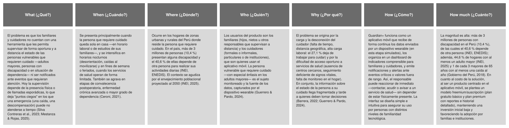

### 1.2.2. Lean UX Process

El equipo aplicó el proceso Lean UX para pasar de la problemática identificada a supuestos e hipótesis verificables. A continuación se presentan los problem statements, los supuestos, las hipótesis y el Lean UX Canvas que resume el planteamiento.

#### 1.2.2.1. Lean UX Problem Statements

Los problem statements describen la situación actual de los usuarios, la brecha que las soluciones existentes dejan sin atender y el foco con el que Guardian+ la aborda. Se plantea un enunciado principal y dos enunciados secundarios por objetivo.

**Problem Statement principal (PS-1):**
El cuidado de personas vulnerables que requieren cuidado (adultos mayores, personas con discapacidad o en situación de dependencia) en el Perú se ha apoyado principalmente en la supervisión presencial y en herramientas genéricas (llamadas, mensajería o wearables orientados al fitness) que no fueron diseñadas para el acompañamiento a distancia. Lo que los familiares y cuidadores necesitan es una forma oportuna, centralizada y confiable de conocer el estado de la persona a su cuidado y de ser alertados ante eventos críticos, incluso cuando no están presentes. Debido a que las soluciones actuales no integran monitoreo, alertas y comunicación pensados para este contexto, la información llega fragmentada y tarde. Por ello, Guardian+ abordará esta brecha mediante un aplicativo móvil que recibe los datos de un dispositivo wearable, los presenta en un dashboard claro y emite notificaciones y alertas en tiempo real. Nuestro foco inicial serán los familiares y cuidadores de personas vulnerables que requieren cuidado, con especial énfasis en los adultos mayores.

Enunciados secundarios por objetivo:

- **PS-2 (Seguridad):** los familiares y cuidadores no reciben aviso oportuno ante caídas o emergencias. ¿Cómo garantizar una respuesta rápida mediante alertas inmediatas en la app?
- **PS-3 (Salud):** no existe un seguimiento continuo y comprensible de los signos de la persona a su cuidado. ¿Cómo ofrecer un monitoreo preventivo desde el aplicativo móvil?

#### 1.2.2.2. Lean UX Assumptions

Los supuestos reúnen lo que el equipo cree sobre el negocio, los usuarios y las funcionalidades de Guardian+, y sirven como punto de partida para las hipótesis que se validarán.

**Business Assumptions (Suposiciones de negocio)**

- Creemos que existe un mercado creciente de familias e instituciones que necesitan supervisar a distancia a personas vulnerables que requieren cuidado.
- Creemos que podemos adquirir usuarios mediante alianzas con instituciones de salud, EPS/seguros y centros de cuidado, además de canales digitales.
- Creemos que generaremos ingresos con un modelo freemium/suscripción (plan básico gratuito y plan premium con reportes e historial detallado).
- Creemos que nuestro principal riesgo es que los datos mostrados sean imprecisos o que las alertas fallen, y lo mitigaremos con validación de datos y un diseño cuidadoso de la lógica de alertas.

**Business Outcome Assumptions (Resultados de negocio esperados)**

- Creemos que el éxito se reflejará en un uso recurrente de la app (usuarios activos diarios) y en una alta tasa de respuesta a las alertas.
- Creemos que una buena experiencia elevará la retención y la conversión del plan gratuito al premium.

**User Assumptions (Suposiciones sobre los usuarios)**

- Creemos que nuestros usuarios iniciales son familiares que supervisan a distancia y cuidadores con varias personas a cargo.
- Creemos que valoran, ante todo, la tranquilidad: saber a tiempo cómo está la persona a su cuidado y poder reaccionar rápido.
- Creemos que tienen niveles variados de familiaridad tecnológica, por lo que requieren una interfaz simple e intuitiva.

**User Outcome Assumptions (Beneficios esperados por el usuario)**

- Creemos que los familiares reducirán su incertidumbre al acceder a indicadores y alertas oportunas.
- Creemos que los cuidadores optimizarán su labor al centralizar el monitoreo de varias personas y reducir la carga de supervisión manual.

**Feature Assumptions (Suposiciones sobre funcionalidades)**

- Creemos que un dashboard de indicadores claro cubre la necesidad de conocer el estado de la persona a su cuidado.
- Creemos que las notificaciones y alertas en tiempo real ante eventos críticos permiten reaccionar a tiempo.
- Creemos que los reportes e historial del estado de la persona a su cuidado aportan valor preventivo.
- Creemos que la comunicación directa (contacto rápido con familiares o servicios) refuerza la respuesta ante emergencias.

#### 1.2.2.3. Lean UX Hypothesis Statements

A partir de los supuestos anteriores se formularon las siguientes hipótesis, cada una con la métrica que permitirá validarla.

- **H1:** Creemos que mejoraremos la respuesta ante emergencias si los familiares y cuidadores reciben avisos oportunos mediante alertas en tiempo real ante caídas o eventos críticos. *Métrica:* se reduce el tiempo promedio entre el evento detectado y la primera acción del responsable.
- **H2:** Creemos que aumentaremos el uso recurrente de la app si los cuidadores logran supervisar sin presencia física mediante un dashboard de indicadores centralizado. *Métrica:* usuarios activos diarios y frecuencia de consultas al dashboard.
- **H3:** Creemos que incrementaremos la confianza y la retención si los familiares obtienen mayor tranquilidad mediante reportes e historial del estado de la persona a su cuidado. *Métrica:* número de reportes revisados y tasa de retención semanal.
- **H4:** Creemos que elevaremos la capacidad de respuesta si los familiares y cuidadores pueden actuar de inmediato mediante comunicación directa integrada en la app. *Métrica:* tasa de respuesta a las alertas y tiempo hasta el primer contacto.

#### 1.2.2.4. Lean UX Canvas

El Lean UX Canvas de la Figura 1.2 reúne en una sola vista el problema de negocio, los usuarios y sus beneficios, las soluciones propuestas, las hipótesis y los resultados esperados de Guardian+.

<a id="figura-1-2"></a>**Figura 1.2.** Lean UX Canvas de Guardian+

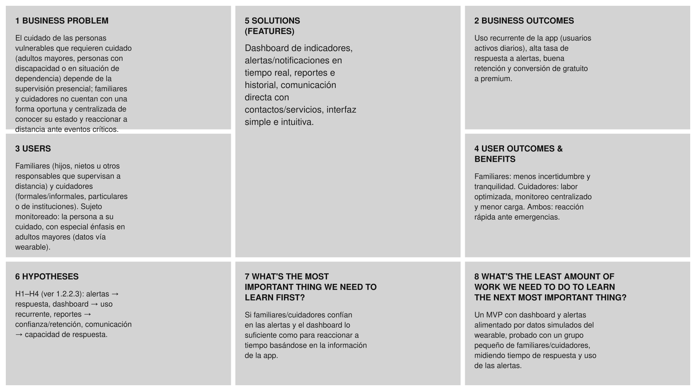

## 1.3. Segmentos objetivo

Guardian+ está dirigido a dos segmentos que forman parte de nuestro ecosistema, estos segmentos estan relacionado dentro del dominio del problema

- **Segmento 1: Familiares**
El primer segmento está dirigido a familiares de personas vulnerables que requieren cuidado (adultos mayores, personas con discapacidad o en situación de dependencia), como hijos, nietos, hermanos u otros responsables, que necesitan supervisar su bienestar sin estar presentes de manera permanente. Este segmento puede enfrentar limitaciones de tiempo, distancia o responsabilidades laborales que dificultan el acompañamiento continuo. Guardian+ les permite acceder a indicadores relevantes de la persona a su cuidado y recibir notificaciones ante eventos críticos, facilitando una supervisión oportuna y una respuesta rápida ante posibles situaciones de emergencia.</br></br>
Durante el tercer trimestre de 2025, el 44,6% de los hogares del país tenía al menos un miembro adulto mayor, mientras que en Lima Metropolitana la proporción llegó al 47,4%. Esto representa un grupo importante de hogares potencialmente vinculados con necesidades de acompañamiento, supervisión y cuidado. Para los familiares, la propuesta de se centra principalmente en reducir la incertidumbre asociada al cuidado a distancia, proporcionando información y alertas que permitan reaccionar oportunamente ante determinados eventos.

- **Segmento 1: Cuidadores**  
El segundo segmento está dirigido a personas encargadas del cuidado frecuente o permanente de personas vulnerables que requieren cuidado (adultos mayores, personas con discapacidad o en situación de dependencia), ya sea de manera particular o como parte de una institución especializada. A diferencia de los familiares, los cuidadores tienen una participación más activa y frecuente en el cuidado de la persona a su cuidado, por lo que requieren herramientas que faciliten la supervisión de varias actividades y permitan identificar rápidamente situaciones que requieran intervención.. Guardian+ les proporciona un dashboard de monitoreo con indicadores relevantes y notificaciones ante eventos críticos, permitiendo centralizar la información y mejorar la capacidad de respuesta ante situaciones que requieran atención.</br></br>
La necesidad de soluciones de apoyo se relaciona también con el proceso de envejecimiento de la población peruana. El incremento proyectado del índice de dependencia de adultos mayores de 23,0% en 2025 a 41,5% en 2050 evidencia que las necesidades de acompañamiento y cuidado tenderán a adquirir mayor relevancia en los próximos años.

<div style="page-break-before: always; break-before: page;"></div>

# Capítulo II: Requirements Development and Software Solution Design

En este capítulo se documenta el levantamiento de requerimientos y el diseño de la solución: el análisis de competidores, las entrevistas y los artefactos de needfinding, la especificación de requerimientos y el diseño estratégico y táctico de Guardian+ con Domain-Driven Design.

## 2.1. Competidores

En esta sección se analizan las soluciones que compiten con Guardian+ en el mercado peruano y se definen las estrategias y tácticas con las que el equipo busca diferenciarse.

### 2.1.1. Análisis competitivo

Se identificaron cuatro competidores con dispositivos y servicios orientados al monitoreo de personas: LifeWatch, SaveFamily Senior, SeniorDomo y MovilTecno 866. A continuación se describe cada uno y se comparan con Guardian+ en el Competitive Analysis Landscape.

#### LifeWatch/LifeWatch 2:
Reloj inteligente que monitorea pulso, presión arterial, oxígeno, ejercicio, temperatura corporal y patrones de sueño. Está más orientado al fitness y bienestar general que al cuidado de personas con necesidades específicas, y no cuentan con funciones de emergencia o conectividad familiar especializada. Precio aproximado: S/.140 soles.

#### SaveFamily Senior: 
Smartwatch completo con detector de caídas, frecuencia cardíaca, podómetro, medición de tensión arterial y recordatorio de medicamentos. Su propuesta está orientada al monitoreo integral, pero carece del concepto de "lazo de cuidado" bidireccional y requiere configuración técnica más compleja. Precio aproximado: S/.370 soles.

#### SeniorDomo:
Reloj pulsera con GPS, botón SOS, detección de caídas y llamadas que ofrece protección 24 horas. Está más orientado a la seguridad y emergencias que al acompañamiento cotidiano, y no dispone de la dupla de dispositivos.

#### MovilTecno 866:
Reloj de pulsera diseñado específicamente para personas mayores, ancianos o con principios de Alzheimer, con localización GPS y tecla de socorro. Aunque tiene un enfoque geriátrico, su mercado está limitado a casos avanzados y no contempla el monitoreo preventivo o la conexión familiar cotidiana .

#### Competitive Analysis Landscape

**¿Por qué llevar a cabo este análisis?**
Para nuestra empresa (Guardian+) es esencial identificar fortalezas y debilidades frente a la competencia, entender sus estrategias, tomar decisiones informadas, detectar oportunidades de crecimiento, anticipar movimientos y optimizar recursos para mejorar nuestra posición en el mercado. La Tabla 2.1 compara a Guardian+ con cada competidor en sus principales dimensiones.

<a id="tabla-2-1"></a>**Tabla 2.1.** Competitive Analysis Landscape de Guardian+ frente a sus competidores

|  | Guardian+ | LifeWatch / LifeWatch 2 | SaveFamily Senior | SeniorDomo | MovilTecno866 |
|---|---|---|---|---|---|
| **Logo** | | LIFE WATCH | SaveFamily SENIOR | seniorDOMO | MovilTecno.com |
| **Overview** | Pulsera + suscripción mensual accesible para la app (modelo freemium/premium). | Reloj inteligente orientado al fitness y bienestar: mide pulso, presión, oxígeno, temperatura y sueño. | Smartwatch para adultos mayores: frecuencia cardíaca, detector de caídas, recordatorio de medicamentos, podómetro. | Pulsera con GPS, botón SOS, detección de caídas y llamadas de emergencia 24/7. | Reloj GPS localizador 4G para adultos mayores (Alzheimer, demencia), con detector de caídas, botón SOS y respuesta automática a llamadas entrantes. |
| **Precios y Costos** | Modelo mixto: venta de dispositivo + suscripción (freemium/premium). | S/.140 (aprox.). | S/.370 (aprox.). | S/.470 (aprox.), requiere servicio adicional de geolocalización. | Disponible sin cuotas adicionales, aunque precio no claramente especificado. |
| **Ventaja Competitiva (Valor ofrecido)** | "Lazo de cuidado" bidireccional (persona con necesidades específicas–familiar/cuidador), app intuitiva y accesible, reportes médicos, comunicación directa y enfoque en salud + bienestar emocional. | Económico y multifuncional, accesible como gadget fitness. | Amplia cobertura en salud preventiva, incluye recordatorios de medicación. | Fuerte en seguridad y localización, SOS en tiempo real. | Alta orientación en seguridad y localización en tiempo real con respuesta automática y detector de caídas. |
| **Mercado Objetivo** | Personas que requieren de atención especial, familiares y cuidadores que buscan tranquilidad y monitoreo constante. | Jóvenes y adultos que buscan cuidar su salud y condición física. | Adultos mayores con necesidad de monitoreo de salud integral y rutinas médicas. | Adultos mayores con alto riesgo de caídas o desorientación (Alzheimer, demencia). | Personas mayores con Alzheimer, demencia, desorientación o condiciones similares; enfoque en seguridad. |
| **Estrategias de Marketing** | Enfoque en la tranquilidad familiar, alianzas con instituciones de salud y seguros, comunicación en redes sociales y campañas educativas. | Marketing en tiendas online y marketplaces (ej. MercadoLibre, Linio). | Marketing digital especializado en cuidado de mayores, distribuidores autorizados. | Orientado a familias en Europa, con campañas web y distribuidores de teleasistencia. | Facebook y web informativa; poca inversión en publicidad. |
| **Productos & Servicios** | Pulsera IoT con sensores (FC, SpO2, movimiento, caídas) + app móvil con alertas, reportes, comunicación y soporte. | Wearable fitness (ritmo cardíaco, sueño, oxígeno, presión, podómetro, ejercicio). | Smartwatch senior con caídas, tensión arterial, podómetro y recordatorio de medicación. | Pulsera SOS con GPS, llamadas y caídas, protección permanente. | Reloj con GPS, botón SOS, detección de caídas, llamada automática, sin necesidad de pulsar pantalla. |
| **Canales de Distribución (Web y/o Móvil)** | App móvil, página web, redes sociales, WhatsApp, alianzas con EPS y seguros. | Marketplaces online, tiendas minoristas. | Distribuidores online especializados y página web. | Distribución online y teleasistencia en Europa; importadores en LatAm. | Sitio web oficial MovilTecno, tiendas online (global), marketing web. |
| **Fortalezas** | Solución integral de cuidado físico, emocional y familiar; interfaz simplificada para las personas vulnerables que requieren cuidado. | Precio bajo, multifuncional, fácil acceso. | Orientado específicamente a seniors, con medición integral de salud. | Seguridad y geolocalización permanente, SOS en tiempo real. | Tecnología probada en seguridad, facilidad de uso para situaciones de desorientación (respuesta automática). |
| **Oportunidades** | Integración con servicios de telemedicina, expansión en provincias, modelo escalable con cuidadores y clínicas, integración con seguros. | Ampliar mercado hacia adultos mayores, añadir alertas familiares. | Mejorar accesibilidad y simplicidad de configuración. | Complementar con app de acompañamiento y reportes familiares. | Complementar funcionalidades con monitoreo de salud y comunicación familiar para ofrecer mayor valor añadido. |
| **Debilidades** | En fase de validación y crecimiento, aún sin base de usuarios consolidada. | No enfocado en adultos mayores, sin alertas familiares. | Requiere configuración técnica más compleja, carece de "lazo de cuidado" bidireccional. | Sin acompañamiento emocional, no incluye reportes médicos ni monitoreo integral. | Enfoque limitado a la seguridad física y localización; sin capacidad de monitoreo médico ni reportes de salud. |
| **Amenazas** | Competidores globales con mayor capital y alcance comercial. | Sustitución por otros relojes fitness más económicos. | Aparición de apps con pulseras más intuitivas. | Competencia tecnológica que combine seguridad + monitoreo de salud. | Competidores con plataforma más robusta o integración con servicios de salud podrían desplazarlo. |

### 2.1.2. Estrategias y tácticas frente a competidores

Nuestra solución contará con compatibilidad completa con dispositivos móviles Android e iOS(teóricamente, dado que en el curso no es 100% necesario trabajar con IOS), así como con servicios de geolocalización en tiempo real, lo que permitirá a cuidadores o familiares localizar a las personas que supervisan en cualquier momento, con notificaciones inmediatas ante emergencias o caídas.

La pulsera IoT enviará actualizaciones constantes sobre signos vitales (frecuencia cardíaca, oxígeno, presión arterial), estado de actividad física y posibles caídas, de manera continua antes, durante y después de un evento crítico, generando un historial médico accesible desde la app.

A diferencia de dispositivos genéricos como LifeWatch o SeniorDomo, nuestra propuesta incorpora el concepto de “lazo de cuidado” bidireccional, en el que tanto la persona vulnerable que requiere cuidado como el familiar/cuidador están conectados entre sí. Esto permite comunicación directa, envío de alertas y generación de confianza mutua en tiempo real.

La plataforma contará con un registro digital de incidentes y alertas previas, lo que permitirá a los familiares conocer antecedentes de salud, historial de caídas y cambios en los signos vitales. Esto ofrece mayor capacidad de prevención y facilita la consulta médica posterior.

Hemos identificado una oportunidad clave en las familias que actualmente dependen de dispositivos importados o genéricos, los cuales suelen estar orientados al fitness o a la seguridad básica. Nuestra propuesta integra seguridad, salud y acompañamiento emocional en un solo dispositivo, diferenciándonos por ofrecer un servicio más integral y enfocado en las personas vulnerables que requieren cuidado.

La aplicación contará con pagos seguros e integración con servicios adicionales (como telemedicina, seguros o planes premium), lo que permitirá a los usuarios acceder a un ecosistema completo desde la misma plataforma, generando valor agregado y fidelización.

## 2.2. Entrevistas

En esta sección se presentan las entrevistas realizadas a familiares y cuidadores de personas vulnerables: su diseño, el registro de cada entrevista y el análisis de sus resultados.

### 2.2.1. Diseño de entrevistas

Las entrevistas se diseñaron para conocer cómo familiares y cuidadores acompañan a la persona bajo su cuidado, qué situaciones les generan mayor preocupación y qué herramientas utilizan. A continuación se presentan las preguntas preparadas para cada segmento.

**Preguntas para segmento 1**
**(Familiares de personas vulnerables que requieren cuidado)**

- ¿Qué relación tiene con la persona que cuida o acompaña, y vive usted con ella o de forma independiente?
- ¿Su familiar suele estar solo o con poca compañía en algunos momentos del día? Si es así, ¿qué es lo que más le preocupa a usted en esa situación?
- ¿Cómo maneja usted las situaciones en las que su familiar se siente mal de salud o sufre algún malestar repentino?
- ¿Ha tenido alguna experiencia reciente en la que su familiar necesitó ayuda y no había nadie cerca? ¿Qué ocurrió?
- ¿Qué tipo de ayuda o acompañamiento le gustaría que su familiar tuviera disponible sin depender de que usted esté siempre presente?
- ¿Qué significa para usted que su familiar se sienta seguro en su propia casa?
- En caso de una caída o un problema de salud repentino de su familiar, ¿qué tan rápido cree que podría conseguirse ayuda?
- ¿Su familiar suele tener dificultades para recordar sus horarios de medicamentos o sus citas médicas? Si es así, ¿qué sistemas utilizan actualmente para recordárselos?
- ¿Qué tan cómodo se siente usted usando tecnología (aplicaciones, relojes inteligentes, pulseras) para temas de salud o para comunicarse con el resto de la familia sobre el estado de su familiar?
- ¿A través de qué medios o canales digitales suele mantenerse informado sobre el estado de salud o bienestar de su familiar (WhatsApp, llamadas, apps, redes sociales)?
- Si pudiera contar con un dispositivo que le ayude a monitorear el bienestar de su familiar, ¿qué características serían las más importantes para usted, además de conocer su ubicación?
- ¿Qué tipo de actividades realiza su familiar con más frecuencia (caminar, hacer ejercicio suave, socializar con amigos u otros familiares)?
- ¿Qué cambios ha notado en la salud o en la vida cotidiana de su familiar en los últimos años?
- ¿Qué le daría más tranquilidad: prevenir problemas de salud de su familiar o recibir ayuda inmediata cuando ocurren?
- ¿Qué cosas le resultan fáciles y cuáles difíciles a su familiar al usar aparatos electrónicos?
- Si existiera una pulsera o dispositivo que apoye el cuidado de su familiar, ¿qué es lo primero que le gustaría que hiciera por él/ella?
- ¿Qué funciones o características evitaría en un dispositivo para que no le resulte molesto o incómodo de usar a su familiar?
- ¿Existen marcas de tecnología o salud (relojes, apps, seguros) en las que usted confía especialmente para el cuidado de su familia? ¿Por qué?
- ¿Estaría dispuesto/a a pagar por un servicio de este tipo? ¿Qué precio consideraría razonable?

**Preguntas para segmento 2**
**(Cuidadores responsables del bienestar de personas vulnerables que requieren cuidado)**

- ¿Cómo es un día típico en el cuidado de la persona a su cargo, qué tareas debe hacer normalmente?
- ¿En algún momento ha tenido que dejar a la persona a su cargo sola en casa?
- ¿Qué es lo que más le preocupa cuando la persona a su cargo está sola en casa?
- ¿Cómo le gustaría enterarse si ocurre algo mientras usted no está?
- ¿En qué momentos del día siente mayor necesidad de monitorear a la persona a su cargo?
- ¿Qué aspectos de la salud de la persona a su cargo considera más difíciles de vigilar constantemente?
- ¿Qué tan cómodo cree que sería usar tecnologías (apps, pulseras, dispositivos) para apoyar el cuidado de la persona a su cargo?
- ¿Qué información cree que sería útil que le muestre nuestro servicio sobre el estado de la persona a su cargo, aparte de los signos vitales básicos?
- ¿Piensa usted que la supervisión constante que debe realizar le genera carga? De ser así, ¿de qué manera cree que nuestro servicio le ayudaría a reducir la carga?
- ¿Qué funciones cree que serían más útiles en una aplicación de monitoreo para personas vulnerables que requieren cuidado?
- ¿Cómo le gustaría que se vieran estas funciones en la aplicación o la pulsera, en relación a la facilidad de uso de estas?
- ¿Qué situaciones de emergencia ha tenido que enfrentar con la persona a su cargo y cómo las resolvió?
- ¿Alguna vez ha sentido que la supervisión manual sobre la persona a su cargo fue insuficiente?
- ¿Qué características harían que usted confíe en un sistema de monitoreo para complementar su trabajo?
- ¿Usted compraría el servicio que le ofrecemos si es a un precio razonable?

### 2.2.2. Registro de entrevistas

A continuación se presenta el registro de las entrevistas realizadas a los segmentos de Familiares y Cuidadores, incluyendo la ficha de cada entrevistado y la captura de pantalla correspondiente.

**Enlace a la grabación de las entrevistas:** [Ver grabación en SharePoint](https://upcedupe-my.sharepoint.com/:v:/g/personal/u202421866_upc_edu_pe/IQACcQNLkvZqQpHQRm3if26lAffXgxwl4EZcZ-_CvP5Vc0A?nav=eyJyZWZlcnJhbEluZm8iOnsicmVmZXJyYWxBcHAiOiJPbmVEcml2ZUZvckJ1c2luZXNzIiwicmVmZXJyYWxBcHBQbGF0Zm9ybSI6IldlYiIsInJlZmVycmFsTW9kZSI6InZpZXciLCJyZWZlcnJhbFZpZXciOiJNeUZpbGVzTGlua0NvcHkifX0&e=xXF12j)

#### Segmento 1: Familiares

**Entrevistado 1**

La Tabla 2.2 resume los datos de la entrevista a Rocío Miranda Alvarado Silva.

<a id="tabla-2-2"></a>**Tabla 2.2.** Datos de la entrevista a Rocío Miranda Alvarado Silva

| Campo | Valor |
|---|---|
| Nombre y apellido | Rocío Miranda Alvarado Silva |
| Edad | 22 |
| Distrito | Jesús María |
| Timing (inicio en la grabación) | 00:04 |
| Duración | 12:35 |

La Figura 2.1 muestra una captura de la entrevista realizada a Rocío Miranda Alvarado Silva.

<a id="figura-2-1"></a>**Figura 2.1.** Captura de la entrevista a Rocío Miranda Alvarado Silva


**Resumen de la entrevista:** Rocío Alvarado, junto a su madre, es responsable directa del cuidado de su hermano (quien padece esquizofrenia y otros trastornos asociados y convive con ambas). Se turnan para acompañarlo durante el día, aunque existen lapsos de 40 minutos a una hora en los que él queda solo por motivos laborales o académicos, lo que le genera preocupación constante ante el riesgo de brotes psicóticos; relató un episodio en el que, tras ausentarse cerca de dos horas, vecinos les informaron que su hermano se había alterado sin que ellas pudieran enterarse a tiempo, evidenciando la falta de un canal de supervisión inmediata. El control de la medicación depende completamente de ellas mediante registros manuales. Rocío se mostró cómoda con la tecnología (apps, relojes y pulseras de salud) y priorizó el monitoreo del ritmo cardíaco como la funcionalidad más importante de un dispositivo de este tipo, seguido de otros indicadores como la glucosa, prefiriendo la prevención antes que solo reaccionar ante emergencias. Destacó que la facilidad de uso es un requisito indispensable y se mostró dispuesta a pagar hasta S/. 100 mensuales por un servicio que le brinde tranquilidad frente al cuidado de su hermano.

**Entrevistado 2**

La Tabla 2.3 resume los datos de la entrevista a Lucía Infante.

<a id="tabla-2-3"></a>**Tabla 2.3.** Datos de la entrevista a Lucía Infante

| Campo | Valor |
|---|---|
| Nombre y apellido | Lucía Infante |
| Edad | 27 |
| Distrito | Santiago de Surco |
| Timing (inicio en la grabación) | 12:39 |
| Duración | 12:32 |

La Figura 2.2 muestra una captura de la entrevista realizada a Lucía Infante.

<a id="figura-2-2"></a>**Figura 2.2.** Captura de la entrevista a Lucía Infante


**Resumen de la entrevista:** Lucía Infante vive sola con un adulto mayor bajo su cuidado y comentó que debe dejarlo solo durante sus jornadas laborales, lo que le genera preocupación al tener como único medio de comunicación con él los mensajes o llamadas telefónicas. Consideró que una propuesta como Guardian+ sería de gran alivio, ya que le permitiría saber en todo momento dónde se encuentra su familiar, acceder a información sobre sus signos vitales y recibir alertas ante emergencias. Entre las funcionalidades adicionales que le gustaría encontrar en la aplicación, mencionó opciones para organizar citas médicas y chequeos del adulto mayor, así como recomendaciones o sugerencias sobre su alimentación. Indicó que estaría dispuesta a pagar entre S/. 50 y S/. 100 mensuales por el servicio (aparte del costo del equipo), y sugirió que sería interesante manejar distintos planes según los servicios o necesidades específicas del adulto mayor a su cuidado.

**Entrevistado 3**

La Tabla 2.4 resume los datos de la entrevista a Junio Antenor Ayala.

<a id="tabla-2-4"></a>**Tabla 2.4.** Datos de la entrevista a Junio Antenor Ayala

| Campo | Valor |
|---|---|
| Nombre y apellido | Junio Antenor Ayala |
| Edad | 32 |
| Distrito | San Juan Baustista |
| Timing (inicio en la grabación) | 25:11 |
| Duración | 13:06 |

La Figura 2.3 muestra una captura de la entrevista realizada a Junio Antenor Ayala.

<a id="figura-2-3"></a>**Figura 2.3.** Captura de la entrevista a Junio Antenor Ayala


**Resumen de la entrevista:** El entrevistado Junior Ayala de 32 años y soldador, vive con su pareja y su hijo y manifiesta preocupación principalmente por la seguridad y el bienestar de su familia cuando no puede estar presente debido al trabajo u otras actividades. Señala que, ante emergencias o problemas de salud, suele experimentar preocupación y desesperación, recurriendo a familiares cercanos o a servicios de emergencia. Considera que una solución tecnológica, como una pulsera o dispositivo inteligente, podría ayudar a monitorear el estado de salud, las actividades y la seguridad de sus familiares, además de recordar medicamentos y citas médicas. Actualmente no utiliza herramientas de monitoreo ni lleva un control preventivo de la salud, ya que normalmente acuden a un centro de salud cuando los síntomas se vuelven graves. Está dispuesto a utilizar tecnología de este tipo, aunque considera importantes factores como el costo, la duración de la batería y la conectividad, especialmente en zonas rurales. Finalmente, estaría dispuesto a pagar por un dispositivo que realmente aporte seguridad y bienestar a su familia, realizando un esfuerzo económico si considera que el producto es útil y de buena calidad.

#### Segmento 2: Cuidadores

**Entrevistado 1**

La Tabla 2.5 resume los datos de la entrevista a Roxana Paola Diana.

<a id="tabla-2-5"></a>**Tabla 2.5.** Datos de la entrevista a Roxana Paola Diana

| Campo | Valor |
|---|---|
| Nombre y apellido | Roxana Paola Diana|
| Edad | 39 |
| Distrito | Surco |
| Timing (inicio en la grabación) | 38:21 |
| Duración | 11:16 |

La Figura 2.4 muestra una captura de la entrevista realizada a Roxana Paola Diana.

<a id="figura-2-4"></a>**Figura 2.4.** Captura de la entrevista a Roxana Paola Diana


**Resumen de la entrevista:** De la entrevista realizada a Roxana Paola Diana Ramírez se pudieron obtener datos que favorecen a la implementación de nuevas features. En primer lugar, el usuario menciona un poco sobre la rutina que debe seguir, en este caso, hace mayor énfasis en el suministro de las pastillas que debe controlar. En segundo lugar, menciona que hay ciertos signos precisos que el usuario debe rastrear los cuales son la presión, saturación y la temperatura. Entre estos, el primero destaca más en el caso particular de este usuario. En tercer lugar, en relación al manejo de situaciones críticas, el usuario generalmente toma medidas generales (llamado a emergencia o sacar citas médicas).
Ante todo lo mencionado, se puede evidenciar que algunas de las features proporcionadas pueden ser aplicables, como los recordatorios de medicación (especialmente en este caso), contacto directo a emergencias o médicos especializados y la medición de signos vitales.


**Entrevistado 2**

La Tabla 2.6 resume los datos de la entrevista a Piero Segura.

<a id="tabla-2-6"></a>**Tabla 2.6.** Datos de la entrevista a Piero Segura

| Campo | Valor |
|---|---|
| Nombre y apellido | Piero Segura|
| Edad | 22 |
| Distrito | Callao |
| Timing (inicio en la grabación) | 49:37 |
| Duración | 5:10 |

La Figura 2.5 muestra una captura de la entrevista realizada a Piero Segura.

<a id="figura-2-5"></a>**Figura 2.5.** Captura de la entrevista a Piero Segura


**Resumen de la entrevista:** Piero Segura Cárdenas, de 22 años, del distrito del Callao y estudiante de psicología, cuenta con experiencia como voluntario en un asilo, donde apoyaba a los adultos mayores en su alimentación, medicamentos, higiene, movilidad y atención ante posibles emergencias. Cuando debía dejar solo a un paciente, su principal preocupación era que pudiera sufrir una caída, descompensarse o necesitar ayuda urgente sin poder comunicarlo. Considera que recibir alertas en su celular con información sobre lo ocurrido sería una solución útil, especialmente cuando se encuentra estudiando, fuera del lugar o durante la noche. Le interesa monitorear aspectos como caídas, presión, ritmo cardíaco, estado de ánimo, sueño, medicación y actividad física. Considera que una aplicación o pulsera sería útil siempre que sea sencilla, cómoda para el paciente y muestre información clara. Además, señala que la supervisión constante le genera carga, por lo que un sistema de monitoreo le permitiría sentirse más tranquilo y organizar mejor su tiempo. Para confiar en el servicio, considera importantes la precisión, rapidez de las alertas, buena duración de la batería y protección de la información del paciente. Finalmente, estaría dispuesto a comprar el servicio si el precio es razonable, ya que considera que facilitaría el cuidado y brindaría mayor seguridad tanto al paciente como al cuidador.

**Entrevistado 3**

La Tabla 2.7 resume los datos de la entrevista a Fernanda Llanos.

<a id="tabla-2-7"></a>**Tabla 2.7.** Datos de la entrevista a Fernanda Llanos

| Campo | Valor |
|---|---|
| Nombre y apellido | Fernanda Llanos |
| Edad | 59 |
| Distrito | San Borja |
| Timing (inicio en la grabación) | 54:47 |
| Duración | 12:19 |

La Figura 2.6 muestra una captura de la entrevista realizada a Fernanda Llanos.

<a id="figura-2-6"></a>**Figura 2.6.** Captura de la entrevista a Fernanda Llanos


**Resumen de la entrevista:** La Sra. Fernanda Llanos trabaja como cuidadora de una señora de 88 años. Comentó que, al no estar siempre presentes los familiares, en varios momentos del día se ve en la necesidad de dejar sola a la señora, lo cual le genera preocupación: teme que se dirija a zonas de la casa que puedan representar un peligro (como escaleras o la cocina) o que sufra algún incidente de salud sin que nadie esté cerca para asistirla a tiempo. Frente a este escenario, considera útil la implementación de una tecnología de supervisión como la que propone Guardian+, ya que le permitiría conocer el estado y la ubicación de la señora incluso en su ausencia, y manifestó que apoyaría y utilizaría una solución de este tipo si estuviera disponible.

**Entrevistado 4**

La Tabla 2.8 resume los datos de la entrevista a Gabriela Cuadros Curihuaman.

<a id="tabla-2-8"></a>**Tabla 2.8.** Datos de la entrevista a Gabriela Cuadros Curihuaman

| Campo | Valor |
|---|---|
| Nombre y apellido | Gabriela Cuadros Curihuaman |
| Edad | 21 |
| Distrito | Santa Anita |
| Timing (inicio en la grabación) | 01:06:58 |
| Duración | 8:53 |

La Figura 2.7 muestra una captura de la entrevista realizada a Gabriela Cuadros Curihuaman.

<a id="figura-2-7"></a>**Figura 2.7.** Captura de la entrevista a Gabriela Cuadros Curihuaman


**Resumen de la entrevista:** Gabriela Cuadro Curihuamán, de 21 años, es enfermera y trabaja en la Casa del Adulto Mayor de Santa Anita, donde se encarga de acompañar y supervisar a pacientes adultos mayores, apoyándolos en su alimentación, higiene, medicamentos y actividades diarias. Su principal preocupación cuando debe dejar solo a un paciente es que pueda sufrir una caída, sentirse mal o tener alguna emergencia sin recibir ayuda inmediata. Considera que un sistema de monitoreo mediante una aplicación y una pulsera sería muy útil para recibir alertas en su celular, conocer la ubicación, actividad, calidad del sueño y detectar caídas o comportamientos fuera de lo normal. También destaca la importancia de contar con recordatorios de medicamentos y un historial del estado del paciente. Señala que la supervisión constante puede ser agotadora y generar preocupación, por lo que la tecnología podría reducir su carga y brindarle mayor tranquilidad. Para confiar en el sistema, considera fundamental que sea preciso, confiable, fácil de usar, con botones grandes, información clara, poco peso, alertas rápidas y una batería que dure todo el día. Finalmente, estaría dispuesta a adquirir el servicio siempre que tenga un precio accesible y cumpla adecuadamente con estas funciones.

### 2.2.3. Análisis de entrevistas

En esta sección se resumen los hallazgos de cada entrevista y, a partir de ellos, se analizan los patrones de cada segmento y las características que sirvieron para construir los arquetipos de usuario.

* En la entrevista con Rocío Alvarado es una familiar cuidadora que vive con su hermano y su madre, quienes se turnan para supervisarlo debido a sus necesidades de atención. Su principal preocupación es que su hermano atraviese una crisis mientras se encuentra solo, ya que en una ocasión reciente ocurrió una situación de este tipo sin que ellas pudieran enterarse hasta regresar a casa. Valora especialmente una solución tecnológica que permita monitorear su estado a distancia, recibir notificaciones y controlar indicadores como el ritmo cardíaco y la actividad física. Se muestra cómoda utilizando tecnología y considera importante que el dispositivo sea sencillo. Su principal motivación es reducir la preocupación y tener mayor tranquilidad, mostrando además una alta disposición de pago, de hasta S/100 mensuales, por un servicio que considere útil.
* La entrevista con Lucía Infante, de 27 años, es diseñadora gráfica y vive con su padre adulto mayor, quien todavía mantiene cierta autonomía. Su principal dificultad aparece cuando se encuentra fuera de casa y no puede saber qué está ocurriendo con él, especialmente cuando no responde sus llamadas. Considera que una aplicación de monitoreo debe ser sencilla, intuitiva y poco recargada, debido a las posibles dificultades de los adultos mayores con la tecnología. Valora la seguridad, la facilidad de uso y la confianza en el manejo de los datos. Está dispuesta a pagar aproximadamente entre S/30 y S/40 mensuales, siempre que el servicio ofrezca beneficios claros y se adapte al nivel de cuidado que requiere cada usuario.
* En la entrevista con Junior Antenor, de 32 años y soldador, vive con su pareja y su hijo, y su principal preocupación es conocer la seguridad y bienestar de su familia cuando se encuentra trabajando o fuera de casa. Ha experimentado situaciones en las que su hijo necesitó la presencia de un adulto debido a accidentes o problemas repentinos, generándole preocupación y la necesidad de recurrir rápidamente a familiares cercanos. Actualmente no utiliza sistemas de monitoreo ni realiza un seguimiento preventivo constante de la salud familiar. Considera atractiva una solución tecnológica que permita monitorear el estado de sus familiares, facilitar la atención ante emergencias y recordar medicamentos o citas. Está dispuesto a realizar un esfuerzo económico por adquirirla, aunque considera importantes el precio, la duración de la batería y la conectividad, especialmente en zonas con poca cobertura.

* La entrevistada Roxana Paola tiene a su cargo el cuidado diario de una adulta mayor y realiza actividades como higiene, alimentación, administración de medicamentos, control de presión y saturación, además de acompañarla durante sus actividades cotidianas. Su principal preocupación está relacionada con el cumplimiento de la medicación, ya que la adulta mayor puede olvidar si tomó sus pastillas, así como con la supervisión durante la noche, cuando existe mayor riesgo de caídas o accidentes al levantarse para ir al baño. Considera que una pulsera vinculada a una aplicación sería útil para automatizar el control de signos vitales como presión, temperatura y saturación, además de generar alertas ante situaciones anormales. Valora especialmente que la solución sea sencilla, funcional y fácil de utilizar, con información precisa y confiable. También reconoce que la tecnología podría reducir la carga que genera la supervisión constante y facilitar el seguimiento del estado de salud de la adulta mayor. Aunque actualmente siempre existe otra persona acompañándola, muestra interés en adquirir el dispositivo si identifica una necesidad concreta y percibe que realmente puede ser útil para el cuidado.
* La entrevista Gabriela Cuadros, de 21 años, es enfermera y trabaja cuidando adultos mayores, por lo que tiene experiencia directa en tareas de alimentación, higiene, medicación y supervisión. Su principal preocupación cuando no puede estar presente es que el paciente pueda sufrir una caída, presentar un problema de salud o tener una emergencia sin recibir ayuda inmediata. Considera que un dispositivo conectado a una aplicación sería una herramienta útil para complementar el cuidado y reducir la carga que genera la supervisión constante. Valora funciones como alertas de emergencia, ubicación, monitoreo de actividad, sueño y medicamentos. Para confiar en el servicio, espera que sea preciso, confiable, sencillo, ligero, con botones grandes, alertas rápidas y batería de larga duración. Además, estaría dispuesta a adquirirlo si el precio es accesible.
* Piero, de 22 años, estudiante de psicología y voluntario en un asilo, cuenta con experiencia apoyando a adultos mayores en su alimentación, higiene, movilidad y medicación. Su principal preocupación son las caídas, descompensaciones y situaciones en las que el paciente pueda necesitar ayuda urgente mientras él se encuentra estudiando o fuera del lugar. Considera útil recibir alertas en el celular y acceder a información sobre signos vitales, medicamentos, sueño, actividad física y posibles comportamientos inusuales. La solución ideal para él debe ser simple, cómoda y fácil de comprender. También considera fundamentales la precisión, rapidez de las alertas, duración de la batería y protección de los datos del paciente. Está dispuesto a comprar el servicio si este facilita el cuidado y proporciona mayor seguridad tanto al paciente como al cuidador.
* En la entrevista con Fernanda Llanos, de 59 años, residente de San Borja y cuidadora de una adulta mayor de 88 años, realiza labores de acompañamiento y supervisión, pero enfrenta dificultades cuando debe dejarla sola debido a la ausencia de los familiares. Su principal preocupación es que la adulta mayor pueda desplazarse hacia lugares peligrosos de la vivienda, como las escaleras o la cocina, o sufrir algún problema de salud sin recibir asistencia inmediata. Esta situación evidencia una necesidad de supervisión a distancia que le permita conocer tanto la ubicación como el estado de la adulta mayor cuando no se encuentra presente. Fernanda muestra una actitud favorable hacia el uso de tecnología para complementar el cuidado y considera que una solución como Guardian+ podría brindarle mayor tranquilidad y seguridad. Su perfil representa a un cuidador con experiencia que busca reducir los riesgos asociados a la ausencia física y contar con información oportuna para actuar ante posibles incidentes.

#### 1. Segmento: familiares de personas que requieren atención 

En este segmento identificamos a **Rocío Alvarado**, **Junior Ayala Miranda**, **Lucia Infante** por lo que la muestra es de **3 entrevistados**. La Tabla 2.9 resume las características identificadas y la proporción de entrevistados que las mencionan.

<a id="tabla-2-9"></a>**Tabla 2.9.** Características identificadas en el segmento de familiares

| Característica identificada                                      | Entrevistados que la mencionan | %    |
| ---------------------------------------------------------------- | ------------------------------ | ---- |
| Preocupación por la seguridad del familiar cuando está solo      | 3/3                            | 100% |
| Necesidad de recibir alertas o información a distancia           | 3/3                            | 100% |
| Interés en monitorear la salud mediante tecnología               | 3/3                            | 100% |
| Preocupación ante emergencias o problemas repentinos             | 3/3                            | 100% |
| Consideran importante una respuesta rápida ante emergencias      | 3/3                            | 100% |
| No utilizan actualmente un sistema tecnológico especializado de monitoreo | 3/3                       | 100% |
| Valoran la facilidad de uso del dispositivo                      | 3/3                            | 100% |
| Consideran importante la conectividad                            | 2/3                            | 67%  |
| Consideran importante una buena duración de batería              | 2/3                            | 67%  |
| Están dispuestos a pagar por una solución útil                   | 3/3                            | 100% |

**Análisis:** Los familiares entrevistados presentan como principal necesidad la seguridad y supervisión de sus seres queridos cuando no pueden estar físicamente presentes. El 100% manifestó preocupación por posibles emergencias, accidentes o problemas de salud durante los períodos en los que el familiar permanece solo. Rocío, por ejemplo, relató una situación en la que su hermano tuvo una crisis mientras ella y su madre se encontraban fuera de casa y no tuvieron conocimiento de lo ocurrido hasta regresar. Por su parte, Junior señaló que cuando se encuentra trabajando o realizando sus actividades diarias le preocupa no saber qué está haciendo su hijo o si se encuentra bien al igual que Lucia. Los entrevistados mostraron interés en una solución tecnológica que permita monitorear el estado del familiar y enviar alertas a distancia, evidenciando una necesidad de mayor tranquilidad y control. Asimismo, el 100% indicó estar dispuesto a utilizar o adquirir una solución de este tipo si resulta útil. Entre las características más valoradas aparecen la facilidad de uso, el monitoreo de indicadores de salud y la posibilidad de recibir asistencia rápida ante una emergencia. Rocío incluso manifestó una disposición de pago de hasta S/100 mensuales, mientras que Junior indicó que realizaría un esfuerzo económico si la tecnología realmente aporta seguridad y salud a su familia.

#### 2. Segmento: cuidadores 

En este segmento podemos considerar a **Roxana Paola**, **Fernanda Llanos**, **Gabriela Curihuamán** y **Piero Segura**, por lo que tenemos una muestra de **4 entrevistados**. La Tabla 2.10 resume las características identificadas y la proporción de entrevistados que las mencionan.

<a id="tabla-2-10"></a>**Tabla 2.10.** Características identificadas en el segmento de cuidadores

| Característica identificada                                      | Entrevistados que la mencionan | %    |
| ---------------------------------------------------------------- | ------------------------------ | ---- |
| Preocupación por caídas o emergencias                            | 4/4                            | 100% |
| Consideran útil recibir alertas en el celular                    | 4/4                            | 100% |
| Interés en monitorear al adulto mayor a distancia                | 4/4                            | 100% |
| Valoran la facilidad de uso                                      | 4/4                            | 100% |
| Consideran importante monitorear medicamentos                    | 2/4                            | 50%  |
| Interés en conocer actividad/sueño del adulto mayor              | 3/4                            | 67%  |
| Consideran que el monitoreo reduce la carga del cuidador         | 3/4                            | 67%  |
| Consideran importantes las alertas rápidas                       | 4/4                            | 67%  |
| Consideran importante una buena duración de batería              | 3/4                            | 67%  |
| Están dispuestos a pagar por el servicio                         | 4/4                            | 100% |

**Analisis:** Los entrevistados de este segmento coinciden principalmente en que el cuidado del adulto mayor requiere una supervisión constante, lo que puede generar preocupación y carga para el cuidador. El 100% identifica las caídas y las emergencias como situaciones críticas y considera útil recibir alertas cuando no se encuentra junto al adulto mayor. Gabriela menciona que la supervisión constante es agotadora y que una aplicación podría ayudarla a sentirse más tranquila, mientras que Piero señala que el monitoreo le permitiría organizar mejor su tiempo cuando debe estudiar o atender otras actividades. Asimismo, existe una alta valoración de funciones relacionadas con la medicación, ubicación, actividad física, sueño y signos vitales. El 100% de los entrevistados considera importante que la solución sea sencilla y fácil de utilizar, especialmente debido a las posibles dificultades que pueden presentar los adultos mayores frente a la tecnología. En cuanto a la disposición de pago, los tres entrevistados estarían dispuestos a adquirir el servicio si el precio resulta razonable; Lucía estima un rango de S/30 a S/40 mensuales, mientras Gabriela y Piero también condicionan su compra a que el precio sea accesible y que el sistema realmente aporte seguridad y utilidad.

#### 3. Características para la construcción de los arquetipos

A partir del análisis, la Tabla 2.11 resume los principales elementos que deberían formar parte de los arquetipos:

<a id="tabla-2-11"></a>**Tabla 2.11.** Elementos para la construcción de los arquetipos de usuario

| Variable                | Familiares                                | Cuidadores de adultos mayores                          |
| ----------------------- | ----------------------------------------- | ------------------------------------------------------ |
| Principal preocupación  | Seguridad y bienestar del familiar        | Caídas, emergencias y estado de salud                  |
| Necesidad principal     | Saber qué ocurre cuando están lejos        | Supervisar sin estar constantemente presentes          |
| Emoción predominante    | Preocupación / desesperación              | Preocupación / agotamiento                             |
| Solución esperada       | Monitoreo y alertas a distancia           | Monitoreo, alertas y seguimiento                       |
| Funciones más valoradas | Salud, seguridad, ubicación y emergencias | Caídas, medicamentos, ubicación, signos vitales, sueño |
| Diseño esperado         | Fácil de utilizar                         | Simple, intuitivo y cómodo                             |
| Problema actual         | Falta de información cuando están ausentes| Supervisión manual constante                           |
| Barreras                | Precio y conectividad                     | Precio, batería y facilidad de uso                     |
| Disposición de pago     | Sí                                        | Sí                                                     |

## 2.3. Needfinding

En esta sección se sintetizan los hallazgos de las entrevistas en los artefactos de needfinding: User Personas, User Task Matrix, User Journey Mapping, Empathy Mapping, Big Picture EventStorming y Ubiquitous Language.

### 2.3.1. User Personas

Las fichas de User Persona presentadas a continuación son el resultado directo del análisis realizado sobre las entrevistas aplicadas a ambos segmentos objetivo: familiares y cuidadores de personas con necesidades especiales. A partir de las respuestas recogidas, se identificaron patrones comunes en preocupaciones, necesidades, emociones y expectativas frente a una solución tecnológica de monitoreo, los cuales fueron sistematizados y traducidos en las características que conforman cada arquetipo. Se elaboró una ficha de User Persona por cada segmento identificado, procurando que cada uno de sus componentes —background, motivations, frustrations, goals, quote, skills y brands and influencers— refleje de manera representativa los hallazgos obtenidos y no las características de un único entrevistado en particular.

Para el segmento de **familiares**, el análisis evidenció que el 100% de los entrevistados manifestó preocupación por la seguridad de su familiar cuando este permanece solo, así como la necesidad de recibir alertas o información a distancia y de monitorear su salud mediante tecnología, incluso sin contar actualmente con un sistema especializado para ello. Estos hallazgos, junto con la alta disposición de pago identificada y la valoración por dispositivos fáciles de usar, dieron forma al User Persona de este segmento, representado en la ficha de María Fernanda Rojas Ibáñez.

Para el segmento de **cuidadores**, el análisis mostró que la totalidad de los entrevistados coincide en la preocupación por caídas y emergencias, la utilidad de recibir alertas en el celular y el interés en monitorear a distancia al adulto mayor, además de una valoración compartida por la facilidad de uso y el seguimiento de medicamentos y signos vitales como funciones clave para reducir la carga que genera la supervisión constante. Estas características quedaron plasmadas en el User Persona de este segmento, representado en la ficha de Roxana Paola Diana Ramírez. Ambas fichas fueron elaboradas en la herramienta UXPressia, siguiendo las mejores prácticas para la especificación de arquetipos de usuario.

#### Primer segmento: Familiares 

La Figura 2.8 presenta el User Persona del segmento de familiares.

<a id="figura-2-8"></a>**Figura 2.8.** User Persona del segmento de familiares

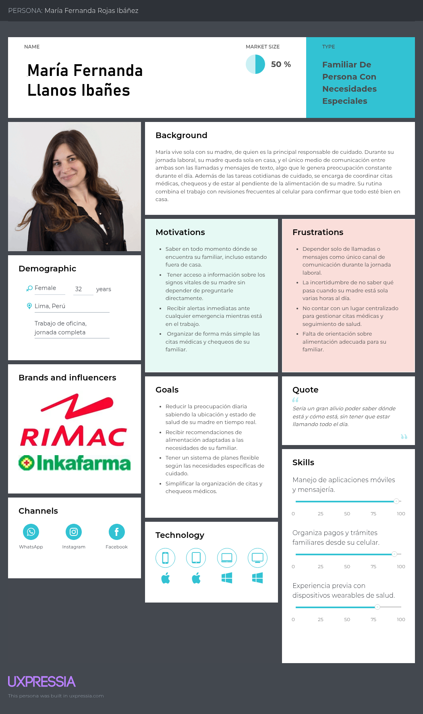

#### Segundo segmento: Cuidadores

La Figura 2.9 presenta el User Persona del segmento de cuidadores.

<a id="figura-2-9"></a>**Figura 2.9.** User Persona del segmento de cuidadores

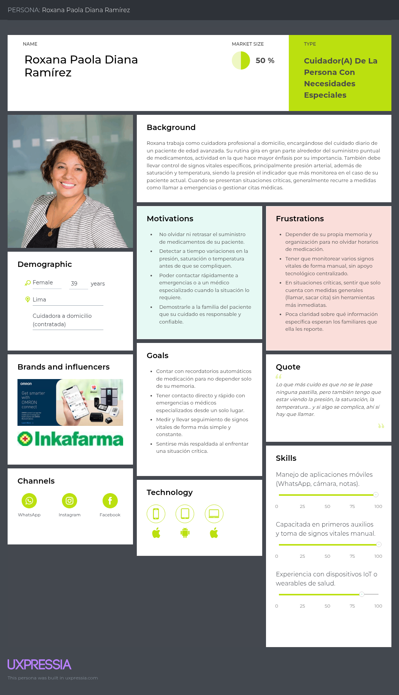

### 2.3.2. User Task Matrix

El User Task Matrix que se presenta a continuación concentra las tareas que cada User Persona realiza para cumplir sus objetivos de cuidado y supervisión. Es fundamental distinguir entre **tareas** (actividades realizadas por los usuarios independientemente de la existencia de Guardian+) y **características de software** (funcionalidades que la solución proporciona). Las tareas aquí identificadas representan actividades que los usuarios realizan actualmente mediante métodos manuales, informales o tradicionales para garantizar el bienestar y la seguridad del ciudadano frágil.

Los User Personas analizados son:
- **María Fernanda Llanos Ibáñes**: Representa a familiares que asumen la responsabilidad del cuidado y supervisión a distancia.
- **Roxana Paola Diana Ramírez**: Representa a cuidadores que brindan atención directa y cotidiana.

Para cada User Persona, se evaluaron las tareas considerando dos dimensiones:
- **Frecuencia**: Regularidad con que realiza la tarea (Baja, Media, Alta).
- **Importancia**: Criticidad de la tarea para cumplir objetivos de cuidado (Baja, Media, Alta).

#### Matriz de Tareas de Usuario

La Tabla 2.12 presenta la frecuencia e importancia de cada tarea para ambos User Personas.

<a id="tabla-2-12"></a>**Tabla 2.12.** User Task Matrix de los segmentos de familiares y cuidadores

| Tarea | María Fernanda – Frecuencia | María Fernanda – Importancia | Roxana Paola – Frecuencia | Roxana Paola – Importancia |
|---|---|---|---|---|
| Supervisar toma de medicamentos | Media | Alta | Alta | Alta |
| Monitorear signos vitales | Media | Alta | Alta | Alta |
| Atender alertas de emergencia | Baja | Alta | Baja | Alta |
| Conocer estado general de salud | Media | Alta | Alta | Alta |
| Revisar reportes médicos | Alta | Alta | Media | Media |
| Acompañar en citas médicas | Baja | Media | Alta | Alta |
| Supervisar rutinas diarias | Baja | Alta | Alta | Alta |
| Coordinar acciones de cuidado | Baja | Alta | Media | Alta |
| Registrar cambios en el estado de salud | Media | Alta | Alta | Alta |
| Comunicar información a otros miembros del círculo de cuidado | Media | Alta | Alta | Alta |

#### Análisis de Resultados

**Tareas de Mayor Frecuencia e Importancia:**

- **Roxana Paola (Cuidadora)**: Las tareas con mayor impacto son la supervisión de medicamentos, el monitoreo de signos vitales, el conocimiento del estado general de salud, el acompañamiento en citas médicas, la supervisión de rutinas diarias y el registro de cambios en el estado de salud. Todas estas se realizan con alta frecuencia y son consideradas de alta importancia. Esto refleja que la responsabilidad cotidiana y directa del cuidador requiere una vigilancia continua y sistemática del Fragile Citizen.

- **María Fernanda (Familiar)**: La revisión de reportes médicos es la única tarea que realiza con alta frecuencia; sin embargo, tareas como supervisar medicamentos, monitorear signos vitales, conocer el estado general de salud, registrar cambios y comunicar información con el círculo de cuidado son consideradas de alta importancia aunque se realicen con frecuencia media. Esta combinación refleja que María Fernanda requiere información periódica y resumida que le permita mantener la tranquilidad sin necesidad de supervisión continua.

**Principales Diferencias entre User Personas:**

1. **Proximidad y Naturaleza del Contacto**: Roxana Paola, como cuidadora, está físicamente presente y realiza tareas de supervisión con alta frecuencia. María Fernanda, como familiar a distancia, realiza tareas principalmente a través de información indirecta (reportes, alertas, comunicación con otros cuidadores).

2. **Responsabilidad en Actividades Médicas**: Roxana Paola acompaña frecuentemente al ciudadano frágil en citas médicas (Alta, Alta), siendo una tarea operativa clave. María Fernanda participa ocasionalmente (Baja, Media), coordinando de forma puntual.

3. **Tipo de Información Requerida**: Roxana Paola necesita información operativa detallada para ejecutar el cuidado día a día (medicamentos específicos, horarios, signos vitales actuales). María Fernanda requiere información estratégica y tendencias (reportes periódicos, cambios generales en el estado de salud).

4. **Frecuencia en Monitoreo de Reportes**: María Fernanda revisa reportes médicos con alta frecuencia, lo que constituye su principal fuente de información verificable. Roxana Paola lo hace con frecuencia media, ya que está en contacto directo con cambios que puede observar en tiempo real.

**Principales Coincidencias entre User Personas:**

1. **Importancia Crítica de Alertas de Emergencia**: Ambas personas, a pesar de diferencias en frecuencia (ambas Baja), consideran de alta importancia atender alertas de emergencia. Esta coincidencia refleja una preocupación compartida: estar preparadas para responder rápidamente ante situaciones críticas.

2. **Monitoreo de Salud como Tarea Central**: La supervisión de medicamentos y el monitoreo de signos vitales son tareas de alta importancia para ambas. En Roxana Paola es operativo (Alta frecuencia); en María Fernanda es verificador (Media frecuencia), pero ambas reconocen que estos indicadores son fundamentales.

3. **Necesidad de Comunicación en el Círculo de Cuidado**: Ambas valoran la comunicación con otros miembros del círculo de cuidado como tarea importante. Para Roxana Paola es un deber operativo (Media-Alta); para María Fernanda es un mecanismo de coordinación y control.

4. **Registro y Seguimiento**: Tanto María Fernanda como Roxana Paola reconocen la importancia de registrar cambios en el estado de salud. Para la cuidadora es operativo y diario; para la familiar es analítico y periódico, pero ambas usan esta información para tomar decisiones.

### 2.3.3. User Journey Mapping

En esta sección se presentan los User Journey Maps As-Is elaborados para los User Personas correspondientes a los segmentos objetivo de Guardian+. Estos artefactos permiten representar el recorrido actual que realizan los usuarios para cumplir sus objetivos de cuidado y supervisión, antes de la existencia de la solución Guardian+.

Los journeys se construyen a partir de la información obtenida durante las entrevistas, su análisis y los User Personas previamente definidos. Para cada recorrido se identifican las principales etapas, acciones, puntos de contacto, pensamientos, emociones, dificultades y oportunidades encontradas durante la experiencia.

#### User Journey Map - Familiar

El recorrido del segmento de familiares representa la experiencia de supervisar a distancia el bienestar de una persona vulnerable. El journey inicia con la necesidad de conocer su estado, continúa con la búsqueda de información mediante llamadas, mensajería u otros responsables, y contempla la evaluación de posibles situaciones de riesgo, la coordinación de asistencia y el seguimiento posterior. La Figura 2.10 presenta el User Journey Map del segmento de familiares.

<a id="figura-2-10"></a>**Figura 2.10.** User Journey Map del segmento de familiares

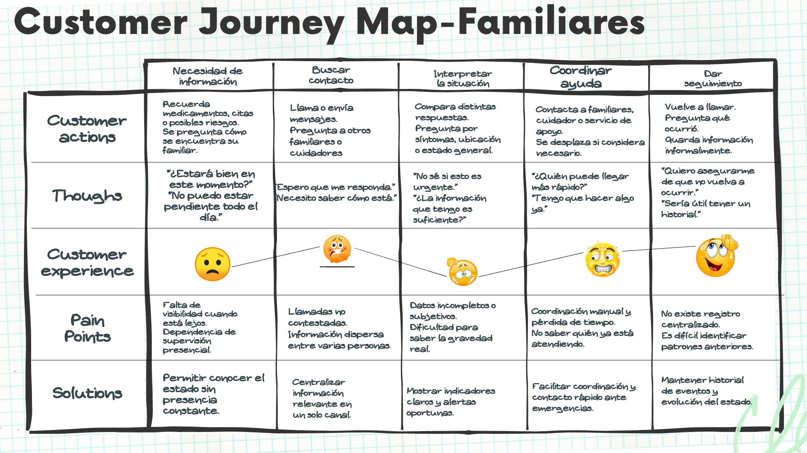

#### User Journey Map - Cuidador

El recorrido del segmento de cuidadores representa una jornada habitual de supervisión de una o varias personas bajo su responsabilidad. Comprende la revisión inicial del estado y actividades pendientes, el seguimiento de rutinas, la vigilancia continua, la atención de posibles incidencias y el registro o comunicación de lo ocurrido a familiares u otros responsables. La Figura 2.11 presenta el User Journey Map del segmento de cuidadores.

<a id="figura-2-11"></a>**Figura 2.11.** User Journey Map del segmento de cuidadores

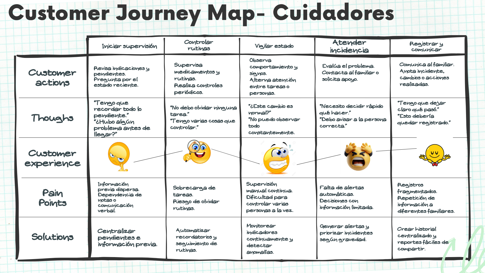

### 2.3.4. Empathy Mapping

En esta sección se presentan los Empathy Maps elaborados para los User Personas de cada segmento objetivo de Guardian+. Estos artefactos permiten profundizar en la perspectiva de los usuarios, identificando lo que necesitan hacer, lo que ven, dicen, hacen, escuchan, piensan y sienten durante su labor de cuidado, así como sus principales dolores (pains) y beneficios esperados (gains).

Los mapas se construyen a partir de la información obtenida en las entrevistas, su análisis, los User Personas y los User Journey Maps previamente definidos, consolidando los hallazgos comunes de cada segmento.

#### Empathy Map - Familiar

El mapa del segmento de familiares refleja la experiencia de una persona que asume la responsabilidad del cuidado de un familiar vulnerable mientras cumple con su jornada laboral. Destaca la preocupación constante por no saber qué ocurre en casa, la dependencia de llamadas y mensajes como único canal de información, y la necesidad de recibir alertas oportunas y datos confiables que le brinden tranquilidad a distancia. La Figura 2.12 presenta el Empathy Map del segmento de familiares.

<a id="figura-2-12"></a>**Figura 2.12.** Empathy Map del segmento de familiares

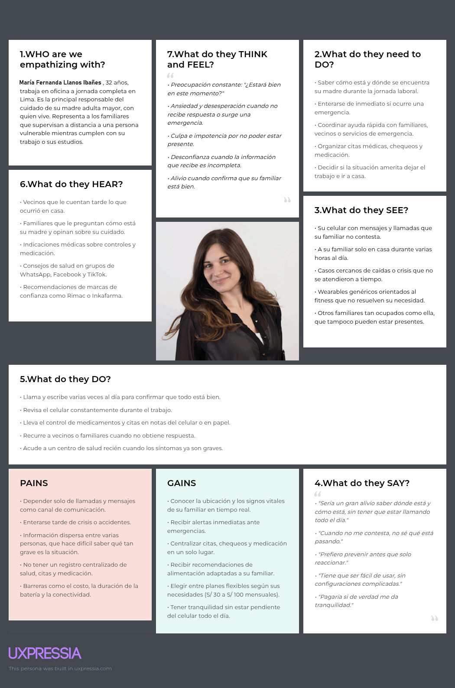

#### Empathy Map - Cuidador

El mapa del segmento de cuidadores refleja la experiencia de una persona encargada del cuidado directo y cotidiano de un Fragile Citizen. Destaca la carga que genera la supervisión manual continua, el riesgo de olvidar horarios de medicación o no advertir una caída durante sus ausencias, y la necesidad de contar con recordatorios, alertas automáticas y un historial centralizado que facilite su labor y la comunicación con la familia. La Figura 2.13 presenta el Empathy Map del segmento de cuidadores.

<a id="figura-2-13"></a>**Figura 2.13.** Empathy Map del segmento de cuidadores

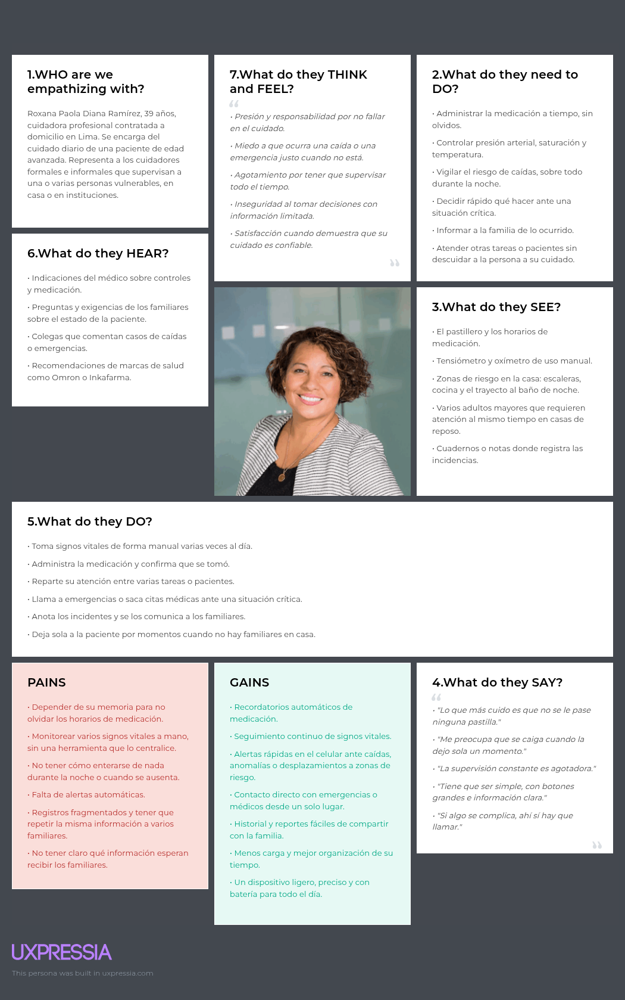

### 2.3.5. Big Picture EventStorming

El Big Picture EventStorming permitió explorar el dominio de Guardian+ desde una perspectiva integral, identificando los principales Domain Events que ocurren a lo largo del ciclo de uso de la solución. Este artefacto fue utilizado para comprender de manera global cómo interactúan los actores principales, los sistemas externos y los eventos relevantes del negocio antes de profundizar en la identificación formal de Bounded Contexts.

A diferencia de un EventStorming detallado orientado al diseño interno de un contexto específico, en esta etapa se priorizó la visualización general del comportamiento del dominio. Por ello, se representaron los actores involucrados, los sistemas externos relevantes y los eventos significativos organizados de manera cronológica aproximada, desde la configuración inicial del ecosistema de cuidado hasta los eventos de monitoreo, prevención y respuesta ante incidentes.

Entre los actores identificados se encuentran el usuario de Guardian+, el suscriptor, el cuidador, el Fragile Citizen y los familiares o cuidadores responsables de responder ante alertas. Asimismo, se consideraron sistemas externos como el wearable y el sistema de tracking de ubicación, ya que forman parte esencial del funcionamiento de la solución. A partir de esta exploración fue posible reconocer eventos importantes como la creación de perfiles, el establecimiento de relaciones de cuidado, la activación de suscripciones, la programación y confirmación de recordatorios, la recepción de ubicaciones, la detección de anomalías biométricas, la emisión de advertencias preventivas, la detección de caídas, la activación de SOS y la atención de alertas críticas.

Este artefacto sirvió como base para construir una visión compartida del dominio, alinear el lenguaje del equipo y preparar el análisis posterior de Strategic Domain-Driven Design, especialmente las actividades de Candidate Context Discovery y Context Mapping. La Figura 2.14 presenta el resultado de la sesión.

<a id="figura-2-14"></a>**Figura 2.14.** Big Picture EventStorming de Guardian+

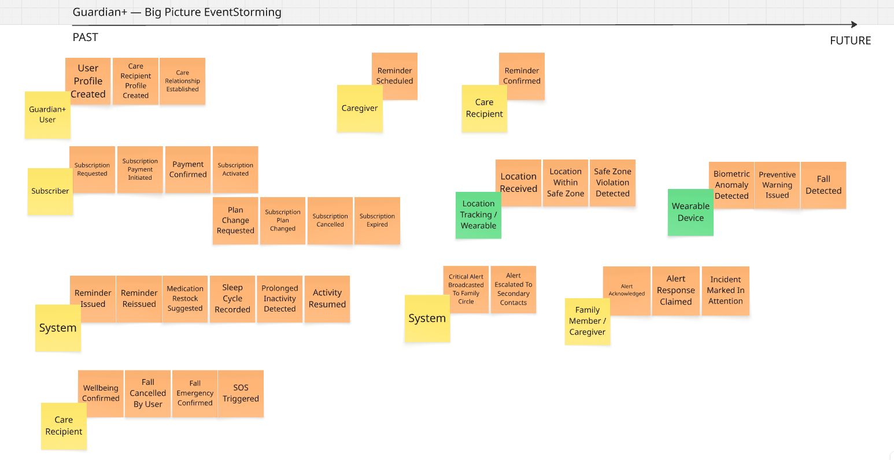


### 2.3.6. Ubiquitous Language

Eric Evans plantea que el Ubiquitous Language se modela dentro de un contexto delimitado, donde se identifican los términos y conceptos del dominio del negocio, y no debe existir ambigüedad¹. A continuación, se presenta el glosario de términos del dominio de negocio de Guardian+, construido a partir del análisis de segmentos, entrevistas y arquetipos elaborados.

- **Fragile Citizen (Ciudadano frágil):** Persona con necesidades especiales —adulto mayor, paciente con movilidad reducida, condición crónica o de salud mental, entre otras— que requiere supervisión y monitoreo constante para garantizar su seguridad y bienestar.

- **Family (Familiar):** Persona con un vínculo familiar directo con el Fragile Citizen, que asume la responsabilidad principal o compartida de su cuidado, aunque no lo haga como labor remunerada.

- **Caregiver (Cuidador):** Persona contratada o designada para brindar atención directa y cotidiana al Fragile Citizen, encargándose de tareas como el suministro de medicación, la vigilancia de signos vitales y el acompañamiento diario.

- **Care Circle (Círculo de cuidado):** Conjunto de personas —familiares y/o cuidadores— vinculadas a un mismo Fragile Citizen, que coordinan y comparten la responsabilidad de su cuidado.

- **Bidirectional Care Bond (Lazo de cuidado bidireccional):** Vínculo de comunicación y monitoreo constante entre el Fragile Citizen y su Care Circle, que permite a ambas partes mantenerse informadas y conectadas en tiempo real.

- **Vital Signs (Signos vitales):** Conjunto de indicadores fisiológicos del Fragile Citizen —como frecuencia cardíaca, saturación de oxígeno, presión arterial y temperatura corporal— utilizados para evaluar su estado de salud.

- **Fall Detection (Detección de caídas):** Identificación automática de una caída sufrida por el Fragile Citizen, a partir de la cual se genera una alerta hacia su Care Circle.

- **Emergency Alert (Alerta de emergencia):** Notificación inmediata enviada al Care Circle o a servicios de emergencia ante una situación crítica en la salud o seguridad del Fragile Citizen, como una caída, un signo vital anormal o un episodio de crisis.

- **Crisis Episode (Episodio de crisis):** Situación en la que el Fragile Citizen presenta una alteración repentina y severa de su condición de salud física o mental, que puede requerir intervención inmediata de su Care Circle o de un centro de salud.

- **Safe Zone (Zona segura):** Área geográfica predefinida dentro de la cual se espera que el Fragile Citizen permanezca, cuyo abandono genera una notificación al Care Circle.

- **Medication Reminder (Recordatorio de medicación):** Aviso relacionado con los horarios en que el Fragile Citizen debe recibir su medicación, orientado a evitar olvidos o retrasos en su administración.

- **Care Routine (Rutina de cuidado):** Conjunto de actividades cotidianas relacionadas con la atención del Fragile Citizen, como la administración de medicamentos, el control de signos vitales y el acompañamiento diario.

- **Wellness Recommendation (Recomendación de bienestar):** Sugerencia orientada a mejorar la calidad de vida del Fragile Citizen, como pautas de alimentación o actividad física adaptadas a su condición.

- **Medical Appointment (Cita médica):** Encuentro programado entre el Fragile Citizen y un profesional de la salud, cuya organización y seguimiento suele estar a cargo de su Care Circle.

- **Health History (Historial de salud):** Registro acumulado de signos vitales, alertas e incidentes del Fragile Citizen, utilizado como referencia para consultas médicas y toma de decisiones de cuidado.

- **Peace of Mind (Tranquilidad):** Estado de confianza y bienestar emocional que experimenta el Care Circle al saber que el Fragile Citizen se encuentra seguro y monitoreado, incluso en su ausencia.

- **Care Plan (Plan de cuidado):** Modalidad de servicio contratada por el Care Circle, que define el nivel de funcionalidades y monitoreo disponibles según las necesidades específicas del Fragile Citizen.

- **Alert (Alerta):** Aviso disparado ante una señal que compromete la seguridad del Fragile Citizen —como una caída, una activación de SOS, una anomalía biométrica, la salida de una Safe Zone o una inactividad prolongada—, registrado con su origen, severidad y estado, y entregado a los Emergency Contacts a través de uno o más canales. Cuando su severidad es crítica, constituye una Emergency Alert.

- **Incident (Incidente):** Registro de la atención de una Alert reconocida por un integrante del Care Circle, desde que se marca en atención hasta su estabilización y cierre. Cada Alert origina como máximo un Incident, que forma parte del Health History del Fragile Citizen.

- **Emergency Contact (Contacto de emergencia):** Integrante del Care Circle designado para recibir las Alerts de un Fragile Citizen, con un orden de prioridad que define quién es el contacto primario y a quién se escala después.

- **Escalation Chain (Cadena de escalamiento):** Secuencia de niveles de notificación —contacto primario, contactos secundarios y difusión a todos los Emergency Contacts— que avanza cuando la Alert no es reconocida dentro del tiempo de espera configurado.

- **Alert Settings (Configuración de alertas):** Preferencias de alertamiento definidas para cada Fragile Citizen: tiempo de espera del reconocimiento del contacto primario, habilitación del escalamiento y estado del Silent Mode. Los canales de notificación se configuran por cada integrante del Care Circle.

- **Severity (Severidad):** Nivel de criticidad de una Alert —crítica, alta o media— que determina la estrategia de notificación: difusión simultánea a todos los Emergency Contacts, escalamiento secuencial mediante la Escalation Chain o aviso únicamente al contacto primario.

- **Acknowledgment (Reconocimiento):** Confirmación explícita de un integrante del Care Circle de haber recibido una Alert, que detiene el escalamiento y abre el Incident en atención.

- **Silent Mode (Modo silencioso):** Configuración de cada Fragile Citizen que hace que sus Alerts no críticas lleguen sin sonido a los celulares del Care Circle; las Alerts de severidad crítica siempre suenan.

## 2.4. Requirements specification

En esta sección se especifican los requerimientos de Guardian+: las User Stories agrupadas en epics, el Impact Mapping que las relaciona con los objetivos de negocio y el Product Backlog priorizado.

### 2.4.1. User Stories

Las User Stories describen las funcionalidades de Guardian+ desde la perspectiva de sus usuarios, cada una con sus criterios de aceptación. Se organizan en las siguientes epics.

#### Epics Identificadas

* **EP01 - Monitoreo de Salud en Tiempo Real:** Supervisión continua y telemetría de signos vitales (ritmo cardíaco, presión arterial, saturación de oxígeno, temperatura y frecuencia respiratoria) para la detección temprana de irregularidades fisiológicas.
* **EP02 - Recordatorios y Rutinas de Bienestar:** Gestión programada de tomas de medicación, hidratación, actividad física, citas médicas y supervisión de patrones de descanso.
* **EP03 - Alertas y Gestión de Emergencias:** Procesamiento, detección local/remota y escalamiento automatizado ante situaciones de riesgo crítico como caídas, anomalías biomédicas o activación manual de SOS.
* **EP04 - Localización y Seguridad en Movilidad:** Rastreo geográfico en tiempo real, delimitación de perímetros seguros (geocercas) y canales de comunicación directa familiar.
* **EP05 - Presencia Web y Adquisición (Landing Page):** Difusión de la propuesta de valor, planes de suscripción, canales de contacto y educación al usuario respecto al ecosistema Guardian+.
* **EP06 - Servicios de Integración y Plataforma Backend:** Capacidades técnicas de ingesta de telemetría, consultas RESTful y persistencia segura de datos clínicos e incidentes.
* **EP07 - Spikes de Investigación Técnica:** Exploración, análisis de compatibilidad y prototipado rápido de dependencias de hardware embebido, protocolos IoT y pasarelas de pago.

---

Las Tablas 2.13 a 2.49 presentan cada User Story, Technical Story y Spike con su identificador, usuario, prioridad, epic, título, descripción y criterios de aceptación.

<a id="tabla-2-13"></a>**Tabla 2.13.** User Story US01: Visualización de ritmo cardíaco en tiempo real

<table>
  <tr>
    <th style="width: 20%;">Story ID</th>
    <th style="width: 25%;">User</th>
    <th style="width: 20%;">Priority</th>
    <th style="width: 35%;">Epic</th>
  </tr>
  <tr>
    <td><strong>US01</strong></td>
    <td>Cuidador</td>
    <td>High</td>
    <td>EP01 - Monitoreo de Salud en Tiempo Real</td>
  </tr>
  <tr>
    <th>Title</th>
    <td colspan="3"><strong>Visualización de ritmo cardíaco en tiempo real</strong></td>
  </tr>
  <tr>
    <th colspan="4" style="text-align: center;">Description</th>
  </tr>
  <tr>
    <td colspan="4">Como cuidador, deseo consultar la lectura actual del ritmo cardíaco del Fragile Citizen para monitorear su estabilidad cardiovascular e identificar irregularidades de manera oportuna.</td>
  </tr>
  <tr>
    <th colspan="4" style="text-align: center;">Acceptance Criteria</th>
  </tr>
  <tr>
    <td colspan="4"><strong>Escenario 1: Lectura de ritmo cardíaco en rango normal</strong><br>- <strong>Dado que</strong> el dispositivo wearable transmite lecturas de frecuencia cardíaca entre 60 y 100 lpm.<br>- <strong>Cuando</strong> el cuidador consulta el estado cardiovascular actual del Fragile Citizen.<br>- <strong>Entonces</strong> el sistema presenta el valor biométrico en tiempo real y clasifica el estado cardíaco como normal.<br><br><strong>Escenario 2: Detección de taquicardia o ritmo elevado</strong><br>- <strong>Dado que</strong> el dispositivo wearable transmite una frecuencia cardíaca superior a 100 lpm.<br>- <strong>Cuando</strong> el cuidador consulta el estado cardiovascular del Fragile Citizen.<br>- <strong>Entonces</strong> el sistema clasifica el valor como elevado y genera un indicador de advertencia sobre la lectura.<br><br><strong>Escenario 3: Detección de bradicardia o ritmo bajo</strong><br>- <strong>Dado que</strong> el dispositivo wearable transmite una frecuencia cardíaca inferior a 50 lpm.<br>- <strong>Cuando</strong> el cuidador consulta el estado cardiovascular del Fragile Citizen.<br>- <strong>Entonces</strong> el sistema clasifica el valor como bajo y genera un indicador de advertencia sobre la lectura.<br><br><strong>Escenario 4: Interrupción en la transmisión de telemetría</strong><br>- <strong>Dado que</strong> la transmisión de telemetría desde el dispositivo wearable no responde o pierde sincronización.<br>- <strong>Cuando</strong> el cuidador intenta consultar el ritmo cardíaco actual.<br>- <strong>Entonces</strong> el sistema expone el último valor histórico registrado indicando la ausencia de señal en vivo.</td>
  </tr>
</table>

<br>

<a id="tabla-2-14"></a>**Tabla 2.14.** User Story US02: Visualización de presión arterial estimada

<table>
  <tr>
    <th style="width: 20%;">Story ID</th>
    <th style="width: 25%;">User</th>
    <th style="width: 20%;">Priority</th>
    <th style="width: 35%;">Epic</th>
  </tr>
  <tr>
    <td><strong>US02</strong></td>
    <td>Cuidador</td>
    <td>High</td>
    <td>EP01 - Monitoreo de Salud en Tiempo Real</td>
  </tr>
  <tr>
    <th>Title</th>
    <td colspan="3"><strong>Visualización de presión arterial estimada</strong></td>
  </tr>
  <tr>
    <th colspan="4" style="text-align: center;">Description</th>
  </tr>
  <tr>
    <td colspan="4">Como cuidador, deseo consultar los valores estimados de presión arterial sistólica y diastólica del Fragile Citizen para evaluar su condición hemodinámica y prevenir descompensaciones.</td>
  </tr>
  <tr>
    <th colspan="4" style="text-align: center;">Acceptance Criteria</th>
  </tr>
  <tr>
    <td colspan="4"><strong>Escenario 1: Presión arterial dentro del umbral normotenso</strong><br>- <strong>Dado que</strong> el sensor registra valores de presión arterial dentro de 90/60 mmHg y 120/80 mmHg.<br>- <strong>Cuando</strong> el cuidador consulta las mediciones de presión arterial del Fragile Citizen.<br>- <strong>Entonces</strong> el sistema expone los valores sistólicos y diastólicos indicando un estado estable sin generar alertas.<br><br><strong>Escenario 2: Detección de pico hipertensivo</strong><br>- <strong>Dado que</strong> el sensor registra un valor sistólico superior a 140 mmHg o diastólico superior a 90 mmHg.<br>- <strong>Cuando</strong> el cuidador solicita los valores actuales de presión arterial.<br>- <strong>Entonces</strong> el sistema categoriza la lectura como valor fuera de rango y activa una marca de observación clínica.<br><br><strong>Escenario 3: Detección de hipotensión</strong><br>- <strong>Dado que</strong> el sensor registra una presión arterial inferior a 90/60 mmHg.<br>- <strong>Cuando</strong> el cuidador solicita los valores actuales de presión arterial.<br>- <strong>Entonces</strong> el sistema clasifica la condición como presión baja y notifica el valor fuera de umbral de seguridad.<br><br><strong>Escenario 4: Lectura fallida o no concluyente</strong><br>- <strong>Dado que</strong> las señales hemodinámicas obtenidas por el sensor presentan ruido excesivo o artefactos de movimiento.<br>- <strong>Cuando</strong> el cuidador consulta la presión arterial.<br>- <strong>Entonces</strong> el sistema descarta la medición errónea y reporta la lectura como inválida sin alterar los umbrales de alerta.</td>
  </tr>
</table>

<br>

<a id="tabla-2-15"></a>**Tabla 2.15.** User Story US03: Visualización de saturación de oxígeno periférico (SpO₂)

<table>
  <tr>
    <th style="width: 20%;">Story ID</th>
    <th style="width: 25%;">User</th>
    <th style="width: 20%;">Priority</th>
    <th style="width: 35%;">Epic</th>
  </tr>
  <tr>
    <td><strong>US03</strong></td>
    <td>Cuidador</td>
    <td>High</td>
    <td>EP01 - Monitoreo de Salud en Tiempo Real</td>
  </tr>
  <tr>
    <th>Title</th>
    <td colspan="3"><strong>Visualización de saturación de oxígeno periférico (SpO₂)</strong></td>
  </tr>
  <tr>
    <th colspan="4" style="text-align: center;">Description</th>
  </tr>
  <tr>
    <td colspan="4">Como cuidador, deseo consultar el porcentaje de saturación de oxígeno en sangre del Fragile Citizen para identificar posibles cuadros de hipoxemia o dificultad respiratoria.</td>
  </tr>
  <tr>
    <th colspan="4" style="text-align: center;">Acceptance Criteria</th>
  </tr>
  <tr>
    <td colspan="4"><strong>Escenario 1: Saturación de oxígeno en nivel óptimo</strong><br>- <strong>Dado que</strong> la pulsera registra una saturación de oxígeno SpO₂ igual o superior al 95%.<br>- <strong>Cuando</strong> el cuidador consulta el nivel de oxígeno del Fragile Citizen.<br>- <strong>Entonces</strong> el sistema confirma el porcentaje en tiempo real catalogándolo en estado normal.<br><br><strong>Escenario 2: Hipoxemia o saturación por debajo de umbral seguro</strong><br>- <strong>Dado que</strong> el sensor de oximetría registra un valor inferior al 90% de SpO₂.<br>- <strong>Cuando</strong> el cuidador consulta el nivel de oxígeno o el sistema procesa la telemetría.<br>- <strong>Entonces</strong> el sistema clasifica inmediatamente el estado como crítico y reporta la anomalía de oxigenación.<br><br><strong>Escenario 3: Artefacto de censado por desconexión</strong><br>- <strong>Dado que</strong> la pulsera pierde contacto cutáneo continuo durante la captura fotopletismográfica.<br>- <strong>Cuando</strong> se procesa la lectura de saturación de oxígeno.<br>- <strong>Entonces</strong> el sistema suspende el cálculo de SpO₂ y registra una condición de lectura incompleta conservando el último registro válido.</td>
  </tr>
</table>

<br>

<a id="tabla-2-16"></a>**Tabla 2.16.** User Story US04: Supervisión de temperatura corporal continua

<table>
  <tr>
    <th style="width: 20%;">Story ID</th>
    <th style="width: 25%;">User</th>
    <th style="width: 20%;">Priority</th>
    <th style="width: 35%;">Epic</th>
  </tr>
  <tr>
    <td><strong>US04</strong></td>
    <td>Cuidador</td>
    <td>High</td>
    <td>EP01 - Monitoreo de Salud en Tiempo Real</td>
  </tr>
  <tr>
    <th>Title</th>
    <td colspan="3"><strong>Supervisión de temperatura corporal continua</strong></td>
  </tr>
  <tr>
    <th colspan="4" style="text-align: center;">Description</th>
  </tr>
  <tr>
    <td colspan="4">Como cuidador, deseo supervisar las mediciones de temperatura corporal del Fragile Citizen para alertar de forma oportuna episodios febriles o cuadros de hipotermia.</td>
  </tr>
  <tr>
    <th colspan="4" style="text-align: center;">Acceptance Criteria</th>
  </tr>
  <tr>
    <td colspan="4"><strong>Escenario 1: Registro de normotermia</strong><br>- <strong>Dado que</strong> el sensor infrarrojo reporta una temperatura cutánea normal entre 36.0 °C y 37.2 °C.<br>- <strong>Cuando</strong> el cuidador revisa la telemetría térmica del Fragile Citizen.<br>- <strong>Entonces</strong> el sistema valida el estado térmico como normal y registra la serie temporal.<br><br><strong>Escenario 2: Detección de estado febril</strong><br>- <strong>Dado que</strong> el sensor reporta una temperatura corporal que excede los 37.8 °C de manera sostenida.<br>- <strong>Cuando</strong> el sistema procesa la medición térmica recibida.<br>- <strong>Entonces</strong> el sistema cataloga el evento como fiebre y marca visualmente la anomalía en el perfil del usuario.<br><br><strong>Escenario 3: Detección de hipotermia</strong><br>- <strong>Dado que</strong> el sensor reporta una temperatura corporal inferior a 35.0 °C.<br>- <strong>Cuando</strong> el sistema procesa la medición térmica recibida.<br>- <strong>Entonces</strong> el sistema cataloga el registro como hipotermia y genera un aviso de control inmediato.</td>
  </tr>
</table>

<br>

<a id="tabla-2-17"></a>**Tabla 2.17.** User Story US05: Visualización de frecuencia respiratoria estimada

<table>
  <tr>
    <th style="width: 20%;">Story ID</th>
    <th style="width: 25%;">User</th>
    <th style="width: 20%;">Priority</th>
    <th style="width: 35%;">Epic</th>
  </tr>
  <tr>
    <td><strong>US05</strong></td>
    <td>Cuidador</td>
    <td>High</td>
    <td>EP01 - Monitoreo de Salud en Tiempo Real</td>
  </tr>
  <tr>
    <th>Title</th>
    <td colspan="3"><strong>Visualización de frecuencia respiratoria estimada</strong></td>
  </tr>
  <tr>
    <th colspan="4" style="text-align: center;">Description</th>
  </tr>
  <tr>
    <td colspan="4">Como cuidador, deseo examinar la frecuencia respiratoria del Fragile Citizen para monitorear su ritmo ventilatorio e identificar taquipnea o bradipnea.</td>
  </tr>
  <tr>
    <th colspan="4" style="text-align: center;">Acceptance Criteria</th>
  </tr>
  <tr>
    <td colspan="4"><strong>Escenario 1: Frecuencia ventilatoria normal</strong><br>- <strong>Dado que</strong> el algoritmo biomédico procesa entre 12 y 20 respiraciones por minuto (rpm).<br>- <strong>Cuando</strong> el cuidador consulta la frecuencia respiratoria del Fragile Citizen.<br>- <strong>Entonces</strong> el sistema muestra la métrica actual catalogándola dentro de los estándares fisiológicos seguros.<br><br><strong>Escenario 2: Detección de frecuencia respiratoria alterada</strong><br>- <strong>Dado que</strong> el algoritmo estima una frecuencia respiratoria superior a 24 rpm o menor a 10 rpm.<br>- <strong>Cuando</strong> el sistema procesa el flujo continuo de datos respiratorios.<br>- <strong>Entonces</strong> el sistema destaca el valor como anómalo y actualiza la condición de alerta respiratoria del Fragile Citizen.</td>
  </tr>
</table>

<br>

<a id="tabla-2-18"></a>**Tabla 2.18.** User Story US06: Emisión y confirmación de recordatorios de medicación

<table>
  <tr>
    <th style="width: 20%;">Story ID</th>
    <th style="width: 25%;">User</th>
    <th style="width: 20%;">Priority</th>
    <th style="width: 35%;">Epic</th>
  </tr>
  <tr>
    <td><strong>US06</strong></td>
    <td>Cuidador</td>
    <td>High</td>
    <td>EP02 - Recordatorios y Rutinas de Bienestar</td>
  </tr>
  <tr>
    <th>Title</th>
    <td colspan="3"><strong>Emisión y confirmación de recordatorios de medicación</strong></td>
  </tr>
  <tr>
    <th colspan="4" style="text-align: center;">Description</th>
  </tr>
  <tr>
    <td colspan="4">Como cuidador, deseo programar las tomas de medicación del Fragile Citizen y que su pulsera emita los avisos hápticos y sonoros en los horarios exactos para asegurar la adherencia al tratamiento prescrito.</td>
  </tr>
  <tr>
    <th colspan="4" style="text-align: center;">Acceptance Criteria</th>
  </tr>
  <tr>
    <td colspan="4"><strong>Escenario 1: Disparo puntual del recordatorio programado</strong><br>- <strong>Dado que</strong> el cuidador ha registrado una toma de medicamento para una hora específica.<br>- <strong>Cuando</strong> el reloj del sistema alcanza la hora programada.<br>- <strong>Entonces</strong> el dispositivo emite señales vibratorias y sonoras, y el sistema marca el recordatorio como emitido.<br><br><strong>Escenario 2: Confirmación manual de ingestión de medicamento</strong><br>- <strong>Dado que</strong> el recordatorio de medicamento está activo en el dispositivo.<br>- <strong>Cuando</strong> el Fragile Citizen ejecuta la confirmación de la toma en el dispositivo.<br>- <strong>Entonces</strong> el sistema registra la dosis como administrada exitosamente y refleja el evento en la aplicación del cuidador.<br><br><strong>Escenario 3: Reintento por omisión de confirmación</strong><br>- <strong>Dado que</strong> un recordatorio ha sido emitido y no se registra la confirmación de la toma dentro de 10 minutos.<br>- <strong>Cuando</strong> expira dicho lapso de tolerancia.<br>- <strong>Entonces</strong> el sistema genera una segunda advertencia local y remite una notificación de dosis pendiente al cuidador.</td>
  </tr>
</table>

<br>

<a id="tabla-2-19"></a>**Tabla 2.19.** User Story US07: Análisis comparativo y tendencias históricas de signos vitales

<table>
  <tr>
    <th style="width: 20%;">Story ID</th>
    <th style="width: 25%;">User</th>
    <th style="width: 20%;">Priority</th>
    <th style="width: 35%;">Epic</th>
  </tr>
  <tr>
    <td><strong>US07</strong></td>
    <td>Cuidador</td>
    <td>Medium</td>
    <td>EP01 - Monitoreo de Salud en Tiempo Real</td>
  </tr>
  <tr>
    <th>Title</th>
    <td colspan="3"><strong>Análisis comparativo y tendencias históricas de signos vitales</strong></td>
  </tr>
  <tr>
    <th colspan="4" style="text-align: center;">Description</th>
  </tr>
  <tr>
    <td colspan="4">Como cuidador, deseo revisar gráficas de tendencias históricas de los signos vitales para identificar patrones de deterioro fisiológico y compartir reportes con el médico tratante.</td>
  </tr>
  <tr>
    <th colspan="4" style="text-align: center;">Acceptance Criteria</th>
  </tr>
  <tr>
    <td colspan="4"><strong>Escenario 1: Generación de serie temporal consolidada</strong><br>- <strong>Dado que</strong> existen registros continuos de signos vitales durante los últimos 7 días.<br>- <strong>Cuando</strong> el cuidador solicita el análisis de tendencia para un parámetro específico y rango de fechas.<br>- <strong>Entonces</strong> el sistema consolida los valores históricos y calcula los promedios, valores mínimos y valores máximos.<br><br><strong>Escenario 2: Muestreo insuficiente para conformar tendencia</strong><br>- <strong>Dado que</strong> el período seleccionado posee menos de 12 horas acumuladas de lecturas válidas.<br>- <strong>Cuando</strong> el cuidador intenta generar la gráfica de tendencia histórica.<br>- <strong>Entonces</strong> el sistema notifica que el volumen de datos recolectado es insuficiente para emitir un gráfico representativo.</td>
  </tr>
</table>

<br>

<a id="tabla-2-20"></a>**Tabla 2.20.** User Story US08: Detección automática de caídas y despacho de emergencia

<table>
  <tr>
    <th style="width: 20%;">Story ID</th>
    <th style="width: 25%;">User</th>
    <th style="width: 20%;">Priority</th>
    <th style="width: 35%;">Epic</th>
  </tr>
  <tr>
    <td><strong>US08</strong></td>
    <td>Familiar / Cuidador</td>
    <td>Highest</td>
    <td>EP03 - Alertas y Gestión de Emergencias</td>
  </tr>
  <tr>
    <th>Title</th>
    <td colspan="3"><strong>Detección automática de caídas y despacho de emergencia</strong></td>
  </tr>
  <tr>
    <th colspan="4" style="text-align: center;">Description</th>
  </tr>
  <tr>
    <td colspan="4">Como familiar o cuidador, deseo recibir una alerta crítica inmediata cuando la pulsera detecte un patrón de caída del Fragile Citizen para gestionar auxilio oportuno.</td>
  </tr>
  <tr>
    <th colspan="4" style="text-align: center;">Acceptance Criteria</th>
  </tr>
  <tr>
    <td colspan="4"><strong>Escenario 1: Identificación cinemática de caída no mitigada</strong><br>- <strong>Dado que</strong> el microcontrolador detecta una aceleración brusca seguida de impacto e inmovilidad relativa.<br>- <strong>Cuando</strong> concluye el ciclo de evaluación cinemática en el firmware.<br>- <strong>Entonces</strong> el sistema despacha una notificación de emergencia de máxima prioridad en un lapso menor a 5 segundos.<br><br><strong>Escenario 2: Cancelación por falsa alarma efectuada por el usuario</strong><br>- <strong>Dado que</strong> el sistema clasifica una caída y activa una ventana de cancelación local de 20 segundos.<br>- <strong>Cuando</strong> el Fragile Citizen activa la opción de confirmación de bienestar antes del vencimiento del temporizador.<br>- <strong>Entonces</strong> el sistema interrumpe el despacho a contactos de emergencia y clasifica el evento como falso positivo resuelto.<br><br><strong>Escenario 3: Escalamiento por falta de respuesta del usuario</strong><br>- <strong>Dado que</strong> se dispara el temporizador de alerta local por caída.<br>- <strong>Cuando</strong> el temporizador de 20 segundos culmina sin interacción del Fragile Citizen.<br>- <strong>Entonces</strong> el sistema confirma la emergencia, envía la telemetría con coordenadas GPS y activa el flujo de auxilio.</td>
  </tr>
</table>

<br>

<a id="tabla-2-21"></a>**Tabla 2.21.** User Story US09: Generación de alertas por transgresión de umbrales biomédicos

<table>
  <tr>
    <th style="width: 20%;">Story ID</th>
    <th style="width: 25%;">User</th>
    <th style="width: 20%;">Priority</th>
    <th style="width: 35%;">Epic</th>
  </tr>
  <tr>
    <td><strong>US09</strong></td>
    <td>Familiar / Cuidador</td>
    <td>Highest</td>
    <td>EP03 - Alertas y Gestión de Emergencias</td>
  </tr>
  <tr>
    <th>Title</th>
    <td colspan="3"><strong>Generación de alertas por transgresión de umbrales biomédicos</strong></td>
  </tr>
  <tr>
    <th colspan="4" style="text-align: center;">Description</th>
  </tr>
  <tr>
    <td colspan="4">Como familiar o cuidador, deseo que el sistema genere una notificación prioritaria cuando los signos vitales del Fragile Citizen excedan los rangos seguros configurados para intervenir preventivamente.</td>
  </tr>
  <tr>
    <th colspan="4" style="text-align: center;">Acceptance Criteria</th>
  </tr>
  <tr>
    <td colspan="4"><strong>Escenario 1: Superación persistente de umbrales clínicos</strong><br>- <strong>Dado que</strong> una variable biomédica se mantiene fuera de los límites de seguridad durante más de 3 lecturas consecutivas.<br>- <strong>Cuando</strong> el motor de reglas procesa la telemetría entrante.<br>- <strong>Entonces</strong> el sistema genera un evento de alerta crítica con nivel de severidad correspondiente y la distribuye al cuidador.<br><br><strong>Escenario 2: Restablecimiento de valores basales seguros</strong><br>- <strong>Dado que</strong> una alerta por anomalía biomédica se encuentra activa.<br>- <strong>Cuando</strong> las lecturas biométricas retornan a valores dentro de los márgenes seguros por 5 minutos continuos.<br>- <strong>Entonces</strong> el sistema actualiza el estado del incidente a estabilizado y notifica el cierre de la anomalía al cuidador.</td>
  </tr>
</table>

<br>

<a id="tabla-2-22"></a>**Tabla 2.22.** User Story US10: Confirmación manual de estado de bienestar tras incidente

<table>
  <tr>
    <th style="width: 20%;">Story ID</th>
    <th style="width: 25%;">User</th>
    <th style="width: 20%;">Priority</th>
    <th style="width: 35%;">Epic</th>
  </tr>
  <tr>
    <td><strong>US10</strong></td>
    <td>Familiar / Cuidador</td>
    <td>High</td>
    <td>EP03 - Alertas y Gestión de Emergencias</td>
  </tr>
  <tr>
    <th>Title</th>
    <td colspan="3"><strong>Confirmación manual de estado de bienestar tras incidente</strong></td>
  </tr>
  <tr>
    <th colspan="4" style="text-align: center;">Description</th>
  </tr>
  <tr>
    <td colspan="4">Como familiar o cuidador, deseo que el Fragile Citizen pueda descartar desde su pulsera una advertencia preventiva cuando se encuentra a salvo para evitar movilizaciones innecesarias del Care Circle ante falsas alarmas.</td>
  </tr>
  <tr>
    <th colspan="4" style="text-align: center;">Acceptance Criteria</th>
  </tr>
  <tr>
    <td colspan="4"><strong>Escenario 1: Notificación de resolución rápida por parte del Fragile Citizen</strong><br>- <strong>Dado que</strong> se ha emitido una advertencia preventiva en el ecosistema Guardian+.<br>- <strong>Cuando</strong> el Fragile Citizen confirma la opción de estado seguro dentro de una ventana de 30 segundos.<br>- <strong>Entonces</strong> el sistema notifica al cuidador que el evento ha sido atendido y descartado desde la pulsera por el Fragile Citizen.<br><br><strong>Escenario 2: Vencimiento de ventana de confirmación manual</strong><br>- <strong>Dado que</strong> la advertencia preventiva se encuentra activa en el dispositivo.<br>- <strong>Cuando</strong> transcurren 30 segundos continuos sin registro de interacción manual.<br>- <strong>Entonces</strong> el sistema promueve la advertencia a categoría de alerta de confirmación requerida y la despacha al cuidador.</td>
  </tr>
</table>

<br>

<a id="tabla-2-23"></a>**Tabla 2.23.** User Story US11: Escalamiento automatizado de alertas críticas no atendidas

<table>
  <tr>
    <th style="width: 20%;">Story ID</th>
    <th style="width: 25%;">User</th>
    <th style="width: 20%;">Priority</th>
    <th style="width: 35%;">Epic</th>
  </tr>
  <tr>
    <td><strong>US11</strong></td>
    <td>Familiar / Cuidador</td>
    <td>Highest</td>
    <td>EP03 - Alertas y Gestión de Emergencias</td>
  </tr>
  <tr>
    <th>Title</th>
    <td colspan="3"><strong>Escalamiento automatizado de alertas críticas no atendidas</strong></td>
  </tr>
  <tr>
    <th colspan="4" style="text-align: center;">Description</th>
  </tr>
  <tr>
    <td colspan="4">Como familiar o cuidador, deseo que las alertas críticas no reconocidas se transmitan a contactos secundarios o entidades de apoyo para asegurar que el Fragile Citizen reciba atención de emergencia.</td>
  </tr>
  <tr>
    <th colspan="4" style="text-align: center;">Acceptance Criteria</th>
  </tr>
  <tr>
    <td colspan="4"><strong>Escenario 1: Reenvío a lista jerárquica de contactos de respaldo</strong><br>- <strong>Dado que</strong> se emite una alerta crítica de emergencia dirigida al cuidador primario.<br>- <strong>Cuando</strong> el cuidador primario no confirma la recepción del evento dentro de los 60 segundos posteriores.<br>- <strong>Entonces</strong> el sistema despacha la alerta de auxilio de forma simultánea a los contactos secundarios definidos.<br><br><strong>Escenario 2: Neutralización del protocolo de escalamiento</strong><br>- <strong>Dado que</strong> la alerta crítica ha sido escalada hacia contactos secundarios.<br>- <strong>Cuando</strong> cualquiera de los contactos autorizados registra el reconocimiento de la emergencia.<br>- <strong>Entonces</strong> el sistema detiene los envíos sucesivos de escalamiento y actualiza el estado a incidente en atención.</td>
  </tr>
</table>

<br>

<a id="tabla-2-24"></a>**Tabla 2.24.** User Story US12: Configuración y parametrización de niveles de alerta

<table>
  <tr>
    <th style="width: 20%;">Story ID</th>
    <th style="width: 25%;">User</th>
    <th style="width: 20%;">Priority</th>
    <th style="width: 35%;">Epic</th>
  </tr>
  <tr>
    <td><strong>US12</strong></td>
    <td>Familiar / Cuidador</td>
    <td>Medium</td>
    <td>EP03 - Alertas y Gestión de Emergencias</td>
  </tr>
  <tr>
    <th>Title</th>
    <td colspan="3"><strong>Configuración y parametrización de niveles de alerta</strong></td>
  </tr>
  <tr>
    <th colspan="4" style="text-align: center;">Description</th>
  </tr>
  <tr>
    <td colspan="4">Como familiar o cuidador, deseo personalizar los canales y umbrales de severidad de las notificaciones para adaptar el comportamiento del sistema a los requerimientos clínicos específicos del Fragile Citizen.</td>
  </tr>
  <tr>
    <th colspan="4" style="text-align: center;">Acceptance Criteria</th>
  </tr>
  <tr>
    <td colspan="4"><strong>Escenario 1: Modificación de canales de notificación por severidad</strong><br>- <strong>Dado que</strong> el cuidador dispone de permisos de administración sobre el perfil del Fragile Citizen.<br>- <strong>Cuando</strong> el cuidador asigna canales específicos (vibración, notificación prioritaria, SMS) a un tipo de alerta.<br>- <strong>Entonces</strong> el sistema persiste la configuración y la aplica de forma inmediata a los eventos generados a partir de ese momento.<br><br><strong>Escenario 2: Restablecimiento de umbrales clínicos predeterminados</strong><br>- <strong>Dado que</strong> existen parámetros de alerta modificados respecto a la configuración original.<br>- <strong>Cuando</strong> el cuidador opta por restablecer los valores de fábrica.<br>- <strong>Entonces</strong> el sistema reasigna los rangos estándar definidos por las guías clínicas preconfiguradas.</td>
  </tr>
</table>

<br>

<a id="tabla-2-25"></a>**Tabla 2.25.** User Story US13: Programación y notificación de consultas médicas

<table>
  <tr>
    <th style="width: 20%;">Story ID</th>
    <th style="width: 25%;">User</th>
    <th style="width: 20%;">Priority</th>
    <th style="width: 35%;">Epic</th>
  </tr>
  <tr>
    <td><strong>US13</strong></td>
    <td>Cuidador</td>
    <td>Medium</td>
    <td>EP02 - Recordatorios y Rutinas de Bienestar</td>
  </tr>
  <tr>
    <th>Title</th>
    <td colspan="3"><strong>Programación y notificación de consultas médicas</strong></td>
  </tr>
  <tr>
    <th colspan="4" style="text-align: center;">Description</th>
  </tr>
  <tr>
    <td colspan="4">Como cuidador, deseo agendar los controles y citas médicas del Fragile Citizen para recibir avisos preventivos y evitar inasistencias a los centros de salud.</td>
  </tr>
  <tr>
    <th colspan="4" style="text-align: center;">Acceptance Criteria</th>
  </tr>
  <tr>
    <td colspan="4"><strong>Escenario 1: Generación de recordatorio previo a la cita</strong><br>- <strong>Dado que</strong> existe una cita médica registrada en el calendario del Fragile Citizen.<br>- <strong>Cuando</strong> el tiempo restante coincide con la antelación configurada por el cuidador (por ejemplo, 1 hora antes).<br>- <strong>Entonces</strong> el sistema genera una notificación preventiva tanto en el dispositivo del Fragile Citizen como en el del cuidador.<br><br><strong>Escenario 2: Cancelación de evento programado</strong><br>- <strong>Dado que</strong> una cita médica agendada es anulada por el cuidador en el sistema.<br>- <strong>Cuando</strong> se confirma la cancelación de la cita.<br>- <strong>Entonces</strong> el sistema desactiva los temporizadores asociados y purga los recordatorios pendientes correspondientes.</td>
  </tr>
</table>

<br>

<a id="tabla-2-26"></a>**Tabla 2.26.** User Story US14: Recordatorios programados para actividad física ligera

<table>
  <tr>
    <th style="width: 20%;">Story ID</th>
    <th style="width: 25%;">User</th>
    <th style="width: 20%;">Priority</th>
    <th style="width: 35%;">Epic</th>
  </tr>
  <tr>
    <td><strong>US14</strong></td>
    <td>Cuidador</td>
    <td>Low</td>
    <td>EP02 - Recordatorios y Rutinas de Bienestar</td>
  </tr>
  <tr>
    <th>Title</th>
    <td colspan="3"><strong>Recordatorios programados para actividad física ligera</strong></td>
  </tr>
  <tr>
    <th colspan="4" style="text-align: center;">Description</th>
  </tr>
  <tr>
    <td colspan="4">Como cuidador, deseo programar recordatorios de pausas activas y ejercicios de movilidad suave en la pulsera del Fragile Citizen para contribuir a la conservación de su autonomía funcional.</td>
  </tr>
  <tr>
    <th colspan="4" style="text-align: center;">Acceptance Criteria</th>
  </tr>
  <tr>
    <td colspan="4"><strong>Escenario 1: Disparo de rutina de ejercicio planificada</strong><br>- <strong>Dado que</strong> el cuidador ha configurado un plan de actividad física para un horario definido.<br>- <strong>Cuando</strong> el reloj del sistema coincide con dicho horario.<br>- <strong>Entonces</strong> la pulsera emite una señal háptica indicando el inicio del bloque de actividad física.<br><br><strong>Escenario 2: Registro de cumplimiento de actividad</strong><br>- <strong>Dado que</strong> el recordatorio de actividad física ha sido presentado al Fragile Citizen.<br>- <strong>Cuando</strong> el Fragile Citizen confirma la finalización del ejercicio en el dispositivo.<br>- <strong>Entonces</strong> el sistema incrementa el contador de adherencia a rutinas de movilidad en el registro diario consultable por el cuidador.</td>
  </tr>
</table>

<br>

<a id="tabla-2-27"></a>**Tabla 2.27.** User Story US15: Activación de auxilio mediante botón SOS en pulsera

<table>
  <tr>
    <th style="width: 20%;">Story ID</th>
    <th style="width: 25%;">User</th>
    <th style="width: 20%;">Priority</th>
    <th style="width: 35%;">Epic</th>
  </tr>
  <tr>
    <td><strong>US15</strong></td>
    <td>Familiar / Cuidador</td>
    <td>Highest</td>
    <td>EP03 - Alertas y Gestión de Emergencias</td>
  </tr>
  <tr>
    <th>Title</th>
    <td colspan="3"><strong>Activación de auxilio mediante botón SOS en pulsera</strong></td>
  </tr>
  <tr>
    <th colspan="4" style="text-align: center;">Description</th>
  </tr>
  <tr>
    <td colspan="4">Como familiar o cuidador, deseo recibir un aviso de auxilio de máxima prioridad cuando el Fragile Citizen presione el botón SOS físico de la pulsera para acudir de inmediato sin que él dependa del teléfono móvil.</td>
  </tr>
  <tr>
    <th colspan="4" style="text-align: center;">Acceptance Criteria</th>
  </tr>
  <tr>
    <td colspan="4"><strong>Escenario 1: Disparo efectivo por pulsación sostenida</strong><br>- <strong>Dado que</strong> la pulsera se encuentra encendida y con enlace de datos disponible.<br>- <strong>Cuando</strong> el Fragile Citizen presiona el botón físico de SOS por al menos 3 segundos continuos.<br>- <strong>Entonces</strong> el sistema despacha de forma inmediata un evento de auxilio de máxima severidad a los contactos de emergencia registrados, incluyendo la ubicación actual.<br><br><strong>Escenario 2: Aborto preventivo por pulsación involuntaria</strong><br>- <strong>Dado que</strong> el Fragile Citizen presiona el botón de SOS por un lapso inferior a 3 segundos.<br>- <strong>Cuando</strong> se libera la presión del botón sin alcanzar el umbral requerido.<br>- <strong>Entonces</strong> el dispositivo descarta la acción y evita el despacho de cualquier evento de alarma.</td>
  </tr>
</table>

<br>

<a id="tabla-2-28"></a>**Tabla 2.28.** User Story US16: Administración de agenda de contactos de auxilio

<table>
  <tr>
    <th style="width: 20%;">Story ID</th>
    <th style="width: 25%;">User</th>
    <th style="width: 20%;">Priority</th>
    <th style="width: 35%;">Epic</th>
  </tr>
  <tr>
    <td><strong>US16</strong></td>
    <td>Cuidador</td>
    <td>High</td>
    <td>EP03 - Alertas y Gestión de Emergencias</td>
  </tr>
  <tr>
    <th>Title</th>
    <td colspan="3"><strong>Administración de agenda de contactos de auxilio</strong></td>
  </tr>
  <tr>
    <th colspan="4" style="text-align: center;">Description</th>
  </tr>
  <tr>
    <td colspan="4">Como cuidador, deseo registrar y ordenar los contactos prioritarios de emergencia para garantizar que las notificaciones críticas se canalicen a las personas correctas.</td>
  </tr>
  <tr>
    <th colspan="4" style="text-align: center;">Acceptance Criteria</th>
  </tr>
  <tr>
    <td colspan="4"><strong>Escenario 1: Incorporación de nuevo contacto de auxilio válido</strong><br>- <strong>Dado que</strong> el cuidador ingresa nombre completo, parentesco y número telefónico con código internacional válido.<br>- <strong>Cuando</strong> se solicita el guardado del nuevo contacto.<br>- <strong>Entonces</strong> el sistema valida la integridad de los datos, almacena el registro y lo asocia a la cadena de alertas.<br><br><strong>Escenario 2: Retiro de contacto de emergencia obsoleto</strong><br>- <strong>Dado que</strong> un contacto de emergencia existe en el directorio del Fragile Citizen.<br>- <strong>Cuando</strong> el cuidador elimina dicho contacto y la lista mantiene al menos un contacto primario.<br>- <strong>Entonces</strong> el sistema actualiza la lista de distribución excluyendo al contacto removido de futuros eventos.</td>
  </tr>
</table>

<br>

<a id="tabla-2-29"></a>**Tabla 2.29.** User Story US17: Estimación y registro de fases de sueño

<table>
  <tr>
    <th style="width: 20%;">Story ID</th>
    <th style="width: 25%;">User</th>
    <th style="width: 20%;">Priority</th>
    <th style="width: 35%;">Epic</th>
  </tr>
  <tr>
    <td><strong>US17</strong></td>
    <td>Cuidador</td>
    <td>Low</td>
    <td>EP02 - Recordatorios y Rutinas de Bienestar</td>
  </tr>
  <tr>
    <th>Title</th>
    <td colspan="3"><strong>Estimación y registro de fases de sueño</strong></td>
  </tr>
  <tr>
    <th colspan="4" style="text-align: center;">Description</th>
  </tr>
  <tr>
    <td colspan="4">Como cuidador, deseo acceder al registro de descanso nocturno del Fragile Citizen para evaluar la calidad del sueño e identificar patrones de insomnio o agitación.</td>
  </tr>
  <tr>
    <th colspan="4" style="text-align: center;">Acceptance Criteria</th>
  </tr>
  <tr>
    <td colspan="4"><strong>Escenario 1: Procesamiento consolidado de descanso nocturno</strong><br>- <strong>Dado que</strong> la pulsera recopila datos de micromovimientos y frecuencia cardíaca durante la ventana nocturna.<br>- <strong>Cuando</strong> el sistema procesa el intervalo al inicio de la mañana.<br>- <strong>Entonces</strong> el sistema computa el total de horas de sueño, la continuidad del descanso y el número de despertares.<br><br><strong>Escenario 2: Identificación de descanso interrumpido atípico</strong><br>- <strong>Dado que</strong> el análisis de telemetría detecta más de 4 interrupciones prolongadas en una sola noche.<br>- <strong>Cuando</strong> se consolida el reporte matutino.<br>- <strong>Entonces</strong> el sistema cataloga la sesión de descanso como sueño fragmentado y lo registra en el historial del Fragile Citizen.</td>
  </tr>
</table>

<br>

<a id="tabla-2-30"></a>**Tabla 2.30.** User Story US18: Telemetría de geolocalización en tiempo real

<table>
  <tr>
    <th style="width: 20%;">Story ID</th>
    <th style="width: 25%;">User</th>
    <th style="width: 20%;">Priority</th>
    <th style="width: 35%;">Epic</th>
  </tr>
  <tr>
    <td><strong>US18</strong></td>
    <td>Cuidador</td>
    <td>Highest</td>
    <td>EP04 - Localización y Seguridad en Movilidad</td>
  </tr>
  <tr>
    <th>Title</th>
    <td colspan="3"><strong>Telemetría de geolocalización en tiempo real</strong></td>
  </tr>
  <tr>
    <th colspan="4" style="text-align: center;">Description</th>
  </tr>
  <tr>
    <td colspan="4">Como cuidador, deseo consultar las coordenadas de ubicación en tiempo real del Fragile Citizen para verificar su paradero y actuar rápidamente si sufre una desorientación.</td>
  </tr>
  <tr>
    <th colspan="4" style="text-align: center;">Acceptance Criteria</th>
  </tr>
  <tr>
    <td colspan="4"><strong>Escenario 1: Transmisión de coordenadas en condiciones normales</strong><br>- <strong>Dado que</strong> el receptor GNSS de la pulsera dispone de cobertura satelital activa.<br>- <strong>Cuando</strong> el cuidador solicita la posición actual del Fragile Citizen.<br>- <strong>Entonces</strong> el sistema entrega las coordenadas de latitud y longitud con una marca de tiempo actualizada dentro de los últimos 30 segundos.<br><br><strong>Escenario 2: Degradación de señal satelital en interiores</strong><br>- <strong>Dado que</strong> la pulsera entra en una zona subterránea o sin cobertura GNSS.<br>- <strong>Cuando</strong> se solicita la localización geográfica del Fragile Citizen.<br>- <strong>Entonces</strong> el sistema expone el último punto geográfico válido conocido indicando explícitamente la pérdida momentánea de fijación satelital.</td>
  </tr>
</table>

<br>

<a id="tabla-2-31"></a>**Tabla 2.31.** User Story US19: Exportación de reporte cronológico de telemetría médica

<table>
  <tr>
    <th style="width: 20%;">Story ID</th>
    <th style="width: 25%;">User</th>
    <th style="width: 20%;">Priority</th>
    <th style="width: 35%;">Epic</th>
  </tr>
  <tr>
    <td><strong>US19</strong></td>
    <td>Cuidador</td>
    <td>Medium</td>
    <td>EP01 - Monitoreo de Salud en Tiempo Real</td>
  </tr>
  <tr>
    <th>Title</th>
    <td colspan="3"><strong>Exportación de reporte cronológico de telemetría médica</strong></td>
  </tr>
  <tr>
    <th colspan="4" style="text-align: center;">Description</th>
  </tr>
  <tr>
    <td colspan="4">Como cuidador, deseo generar y exportar el historial de signos vitales en formato estandarizado para respaldar las consultas médicas presenciales.</td>
  </tr>
  <tr>
    <th colspan="4" style="text-align: center;">Acceptance Criteria</th>
  </tr>
  <tr>
    <td colspan="4"><strong>Escenario 1: Exportación exitosa de expediente de telemetría</strong><br>- <strong>Dado que</strong> el Fragile Citizen cuenta con mediciones registradas durante un intervalo de 30 días.<br>- <strong>Cuando</strong> el cuidador selecciona el rango y solicita la exportación documental.<br>- <strong>Entonces</strong> el sistema compila un reporte estructurado en formato PDF conteniendo tablas y resúmenes de las anomalías detectadas.<br><br><strong>Escenario 2: Solicitud de exportación en rango vacío</strong><br>- <strong>Dado que</strong> no existen lecturas de signos vitales dentro del período seleccionado.<br>- <strong>Cuando</strong> el cuidador intenta ejecutar la exportación documental.<br>- <strong>Entonces</strong> el sistema bloquea la generación del archivo y notifica que no existen registros en el rango indicado.</td>
  </tr>
</table>

<br>

<a id="tabla-2-32"></a>**Tabla 2.32.** User Story US20: Notificación de nivel crítico de batería en wearable

<table>
  <tr>
    <th style="width: 20%;">Story ID</th>
    <th style="width: 25%;">User</th>
    <th style="width: 20%;">Priority</th>
    <th style="width: 35%;">Epic</th>
  </tr>
  <tr>
    <td><strong>US20</strong></td>
    <td>Cuidador</td>
    <td>High</td>
    <td>EP03 - Alertas y Gestión de Emergencias</td>
  </tr>
  <tr>
    <th>Title</th>
    <td colspan="3"><strong>Notificación de nivel crítico de batería en wearable</strong></td>
  </tr>
  <tr>
    <th colspan="4" style="text-align: center;">Description</th>
  </tr>
  <tr>
    <td colspan="4">Como cuidador, deseo recibir una advertencia oportuna cuando la batería de la pulsera del Fragile Citizen descienda del 20% para coordinar su recarga y evitar la suspensión del monitoreo.</td>
  </tr>
  <tr>
    <th colspan="4" style="text-align: center;">Acceptance Criteria</th>
  </tr>
  <tr>
    <td colspan="4"><strong>Escenario 1: Advertencia preventiva por descarga progresiva</strong><br>- <strong>Dado que</strong> el circuito de carga de la pulsera mide un remanente igual o menor al 20% de energía.<br>- <strong>Cuando</strong> se procesa la lectura periódica del estado de la batería.<br>- <strong>Entonces</strong> el dispositivo activa un aviso de recarga necesaria y envía una notificación preventiva a la aplicación del cuidador.<br><br><strong>Escenario 2: Umbral de apagado inminente</strong><br>- <strong>Dado que</strong> el nivel de batería alcanza un 5% de capacidad residual.<br>- <strong>Cuando</strong> el dispositivo evalúa su reserva energética crítica.<br>- <strong>Entonces</strong> el sistema emite una última telemetría con prioridad crítica avisando del cese temporal inminente de la supervisión.</td>
  </tr>
</table>

<br>

<a id="tabla-2-33"></a>**Tabla 2.33.** User Story US21: Sincronización y persistencia resiliente de telemetría (Offline Sync)

<table>
  <tr>
    <th style="width: 20%;">Story ID</th>
    <th style="width: 25%;">User</th>
    <th style="width: 20%;">Priority</th>
    <th style="width: 35%;">Epic</th>
  </tr>
  <tr>
    <td><strong>US21</strong></td>
    <td>Cuidador</td>
    <td>High</td>
    <td>EP01 - Monitoreo de Salud en Tiempo Real</td>
  </tr>
  <tr>
    <th>Title</th>
    <td colspan="3"><strong>Sincronización y persistencia resiliente de telemetría (Offline Sync)</strong></td>
  </tr>
  <tr>
    <th colspan="4" style="text-align: center;">Description</th>
  </tr>
  <tr>
    <td colspan="4">Como cuidador, deseo que los datos recopilados por la pulsera durante pérdidas de red se almacenen localmente y se sincronicen al recuperar conexión para garantizar la integridad histórica.</td>
  </tr>
  <tr>
    <th colspan="4" style="text-align: center;">Acceptance Criteria</th>
  </tr>
  <tr>
    <td colspan="4"><strong>Escenario 1: Buffer local por indisponibilidad de conexión</strong><br>- <strong>Dado que</strong> el dispositivo wearable pierde conexión a la red de datos durante su operación.<br>- <strong>Cuando</strong> se efectúan nuevas lecturas biométricas o de incidentes.<br>- <strong>Entonces</strong> el microcontrolador persiste las tramas localmente en su memoria no volátil manteniendo el orden cronológico.<br><br><strong>Escenario 2: Vaciado automático de buffer tras reconexión</strong><br>- <strong>Dado que</strong> existen tramas biométricas retenidas en la memoria local del dispositivo.<br>- <strong>Cuando</strong> se restablece el enlace inalámbrico con el backend.<br>- <strong>Entonces</strong> el dispositivo transmite en bloque la telemetría pendiente y el servidor las persiste eliminando registros duplicados.</td>
  </tr>
</table>

<br>

<a id="tabla-2-34"></a>**Tabla 2.34.** User Story US22: Silenciamiento de alertas no críticas en el Care Circle

<table>
  <tr>
    <th style="width: 20%;">Story ID</th>
    <th style="width: 25%;">User</th>
    <th style="width: 20%;">Priority</th>
    <th style="width: 35%;">Epic</th>
  </tr>
  <tr>
    <td><strong>US22</strong></td>
    <td>Cuidador</td>
    <td>Low</td>
    <td>EP03 - Alertas y Gestión de Emergencias</td>
  </tr>
  <tr>
    <th>Title</th>
    <td colspan="3"><strong>Silenciamiento de alertas no críticas en el Care Circle</strong></td>
  </tr>
  <tr>
    <th colspan="4" style="text-align: center;">Description</th>
  </tr>
  <tr>
    <td colspan="4">Como cuidador, deseo silenciar las alertas no críticas del Fragile Citizen en los celulares del Care Circle para no ser interrumpido por avisos menores, por ejemplo durante la noche, sin dejar de enterarme de una emergencia.</td>
  </tr>
  <tr>
    <th colspan="4" style="text-align: center;">Acceptance Criteria</th>
  </tr>
  <tr>
    <td colspan="4"><strong>Escenario 1: Activación del modo silencioso</strong><br>- <strong>Dado que</strong> el modo silencioso del Fragile Citizen está desactivado.<br>- <strong>Cuando</strong> el cuidador lo activa desde Configuración de alertas y se genera una alerta de severidad alta o media.<br>- <strong>Entonces</strong> el sistema la notifica sin sonido a los integrantes del Care Circle y la mantiene visible en la aplicación.<br><br><strong>Escenario 2: Excepción para alertas críticas</strong><br>- <strong>Dado que</strong> el modo silencioso del Fragile Citizen está activo.<br>- <strong>Cuando</strong> se genera una alerta de severidad crítica, como una caída o un SOS.<br>- <strong>Entonces</strong> el sistema la notifica con sonido a todos sus destinatarios.</td>
  </tr>
</table>

<br>

<a id="tabla-2-35"></a>**Tabla 2.35.** User Story US23: Establecimiento de canal de comunicación directa

<table>
  <tr>
    <th style="width: 20%;">Story ID</th>
    <th style="width: 25%;">User</th>
    <th style="width: 20%;">Priority</th>
    <th style="width: 35%;">Epic</th>
  </tr>
  <tr>
    <td><strong>US23</strong></td>
    <td>Familiar</td>
    <td>Medium</td>
    <td>EP04 - Localización y Seguridad en Movilidad</td>
  </tr>
  <tr>
    <th>Title</th>
    <td colspan="3"><strong>Establecimiento de canal de comunicación directa</strong></td>
  </tr>
  <tr>
    <th colspan="4" style="text-align: center;">Description</th>
  </tr>
  <tr>
    <td colspan="4">Como familiar, deseo iniciar un canal de comunicación rápida con el Fragile Citizen, mediante videollamada o llamada de voz según la capacidad del modelo de pulsera vinculado, para verificar su condición ante cualquier sospecha o inquietud cotidiana.</td>
  </tr>
  <tr>
    <th colspan="4" style="text-align: center;">Acceptance Criteria</th>
  </tr>
  <tr>
    <td colspan="4"><strong>Escenario 1: Videollamada en pulsera con cámara y pantalla</strong><br>- <strong>Dado que</strong> la pulsera vinculada al Fragile Citizen corresponde a un modelo con cámara y pantalla, y ambos dispositivos mantienen conexión de datos activa.<br>- <strong>Cuando</strong> el familiar solicita la apertura de una videollamada desde la aplicación.<br>- <strong>Entonces</strong> el sistema establece la sesión de vídeo en la pulsera y confirma la conexión entre ambas partes.<br><br><strong>Escenario 2: Degradación a llamada de voz por limitación del modelo</strong><br>- <strong>Dado que</strong> la pulsera vinculada admite audio bidireccional pero no dispone de cámara.<br>- <strong>Cuando</strong> el familiar solicita una videollamada.<br>- <strong>Entonces</strong> el sistema informa que el modelo no admite vídeo y establece la sesión como llamada de voz, sin requerir una nueva solicitud.<br><br><strong>Escenario 3: Modelo sin capacidad de comunicación bidireccional</strong><br>- <strong>Dado que</strong> la pulsera vinculada solo admite telemetría, avisos hápticos y la activación del botón SOS.<br>- <strong>Cuando</strong> el familiar intenta abrir un canal de comunicación con el Fragile Citizen.<br>- <strong>Entonces</strong> el sistema indica que el modelo vinculado no admite llamadas y ofrece la marcación telefónica al número registrado de la persona bajo cuidado o de su acompañante.<br><br><strong>Escenario 4: Llamada no contestada</strong><br>- <strong>Dado que</strong> se emite la señal de comunicación hacia el dispositivo receptor.<br>- <strong>Cuando</strong> transcurren 30 segundos sin que el receptor atienda la solicitud.<br>- <strong>Entonces</strong> el sistema cierra el intento de conexión y genera un registro de llamada no atendida en el historial del cuidador.</td>
  </tr>
</table>

<br>

<a id="tabla-2-36"></a>**Tabla 2.36.** User Story US24: Consolidación y despacho de reporte semanal de salud

<table>
  <tr>
    <th style="width: 20%;">Story ID</th>
    <th style="width: 25%;">User</th>
    <th style="width: 20%;">Priority</th>
    <th style="width: 35%;">Epic</th>
  </tr>
  <tr>
    <td><strong>US24</strong></td>
    <td>Cuidador</td>
    <td>Medium</td>
    <td>EP01 - Monitoreo de Salud en Tiempo Real</td>
  </tr>
  <tr>
    <th>Title</th>
    <td colspan="3"><strong>Consolidación y despacho de reporte semanal de salud</strong></td>
  </tr>
  <tr>
    <th colspan="4" style="text-align: center;">Description</th>
  </tr>
  <tr>
    <td colspan="4">Como cuidador, deseo recibir una síntesis semanal automatizada del estado de salud del Fragile Citizen para evaluar su evolución global sin revisar telemetría segundo a segundo.</td>
  </tr>
  <tr>
    <th colspan="4" style="text-align: center;">Acceptance Criteria</th>
  </tr>
  <tr>
    <td colspan="4"><strong>Escenario 1: Compilación automática al cierre de ciclo semanal</strong><br>- <strong>Dado que</strong> culmina el ciclo operativo de 7 días del Fragile Citizen.<br>- <strong>Cuando</strong> el servicio de reportes ejecuta su tarea programada de cierre.<br>- <strong>Entonces</strong> el sistema genera una síntesis agregando estabilidad de signos vitales, alertas disparadas y porcentaje de adherencia a medicación.<br><br><strong>Escenario 2: Resaltado de incidentes recurrentes</strong><br>- <strong>Dado que</strong> el Fragile Citizen experimentó más de 3 anomalías del mismo tipo a lo largo de la semana.<br>- <strong>Cuando</strong> se genera la síntesis semanal.<br>- <strong>Entonces</strong> el sistema marca el parámetro como recurrente e incluye una recomendación de revisión médica preventiva.</td>
  </tr>
</table>

<br>

<a id="tabla-2-37"></a>**Tabla 2.37.** User Story US25: Despacho simultáneo a múltiples contactos de auxilio

<table>
  <tr>
    <th style="width: 20%;">Story ID</th>
    <th style="width: 25%;">User</th>
    <th style="width: 20%;">Priority</th>
    <th style="width: 35%;">Epic</th>
  </tr>
  <tr>
    <td><strong>US25</strong></td>
    <td>Familiar</td>
    <td>High</td>
    <td>EP03 - Alertas y Gestión de Emergencias</td>
  </tr>
  <tr>
    <th>Title</th>
    <td colspan="3"><strong>Despacho simultáneo a múltiples contactos de auxilio</strong></td>
  </tr>
  <tr>
    <th colspan="4" style="text-align: center;">Description</th>
  </tr>
  <tr>
    <td colspan="4">Como familiar, deseo que las alertas de máxima criticidad se remitan simultáneamente a todo el Care Circle registrado para maximizar la velocidad de respuesta.</td>
  </tr>
  <tr>
    <th colspan="4" style="text-align: center;">Acceptance Criteria</th>
  </tr>
  <tr>
    <td colspan="4"><strong>Escenario 1: Difusión simultánea ante evento crítico</strong><br>- <strong>Dado que</strong> se confirma una emergencia crítica (como caída o SOS manual).<br>- <strong>Cuando</strong> el motor de despacho procesa el incidente.<br>- <strong>Entonces</strong> el sistema emite notificaciones simultáneas a todos los contactos registrados en el Care Circle activo.<br><br><strong>Escenario 2: Notificación colaborativa de atención confirmada</strong><br>- <strong>Dado que</strong> múltiples familiares recibieron la notificación de emergencia en paralelo.<br>- <strong>Cuando</strong> el primer familiar pulsa la opción de acudir al auxilio.<br>- <strong>Entonces</strong> el sistema distribuye una actualización al resto de los contactos informando que dicho integrante ya asumió la respuesta.</td>
  </tr>
</table>

<br>

<a id="tabla-2-38"></a>**Tabla 2.38.** User Story US26: Recordatorios periódicos de hidratación y pausas activas

<table>
  <tr>
    <th style="width: 20%;">Story ID</th>
    <th style="width: 25%;">User</th>
    <th style="width: 20%;">Priority</th>
    <th style="width: 35%;">Epic</th>
  </tr>
  <tr>
    <td><strong>US26</strong></td>
    <td>Cuidador</td>
    <td>Low</td>
    <td>EP02 - Recordatorios y Rutinas de Bienestar</td>
  </tr>
  <tr>
    <th>Title</th>
    <td colspan="3"><strong>Recordatorios periódicos de hidratación y pausas activas</strong></td>
  </tr>
  <tr>
    <th colspan="4" style="text-align: center;">Description</th>
  </tr>
  <tr>
    <td colspan="4">Como cuidador, deseo que la pulsera del Fragile Citizen le recuerde periódicamente tomar agua o levantarse para prevenir la deshidratación y la rigidez articular.</td>
  </tr>
  <tr>
    <th colspan="4" style="text-align: center;">Acceptance Criteria</th>
  </tr>
  <tr>
    <td colspan="4"><strong>Escenario 1: Notificación de intervalo de hidratación</strong><br>- <strong>Dado que</strong> transcurren 120 minutos consecutivos sin registro de confirmación de ingesta hídrica.<br>- <strong>Cuando</strong> se cumple la ventana de tiempo establecida.<br>- <strong>Entonces</strong> el dispositivo emite un patrón de vibración indicando el recordatorio de hidratación.<br><br><strong>Escenario 2: Supresión durante horas de descanso</strong><br>- <strong>Dado que</strong> el sistema identifica que el Fragile Citizen se encuentra dentro del rango horario de sueño nocturno.<br>- <strong>Cuando</strong> vence el ciclo de hidratación periódica.<br>- <strong>Entonces</strong> el sistema inhibe la emisión del recordatorio para resguardar el descanso del Fragile Citizen.</td>
  </tr>
</table>

<br>

<a id="tabla-2-39"></a>**Tabla 2.39.** User Story US27: Detección de inactividad física prolongada

<table>
  <tr>
    <th style="width: 20%;">Story ID</th>
    <th style="width: 25%;">User</th>
    <th style="width: 20%;">Priority</th>
    <th style="width: 35%;">Epic</th>
  </tr>
  <tr>
    <td><strong>US27</strong></td>
    <td>Cuidador</td>
    <td>Medium</td>
    <td>EP02 - Recordatorios y Rutinas de Bienestar</td>
  </tr>
  <tr>
    <th>Title</th>
    <td colspan="3"><strong>Detección de inactividad física prolongada</strong></td>
  </tr>
  <tr>
    <th colspan="4" style="text-align: center;">Description</th>
  </tr>
  <tr>
    <td colspan="4">Como cuidador, deseo ser alertado si el Fragile Citizen permanece inmóvil por un período anómalo durante el día para descartar episodios de desvanecimiento o auxilio retenido.</td>
  </tr>
  <tr>
    <th colspan="4" style="text-align: center;">Acceptance Criteria</th>
  </tr>
  <tr>
    <td colspan="4"><strong>Escenario 1: Superación de umbral de inmovilidad en horas diurnas</strong><br>- <strong>Dado que</strong> el Fragile Citizen no presenta movimiento articular durante más de 60 minutos en su jornada activa.<br>- <strong>Cuando</strong> se evalúa el contador de inactividad física.<br>- <strong>Entonces</strong> el sistema despacha un aviso preventivo de inactividad prolongada al cuidador.<br><br><strong>Escenario 2: Restablecimiento de conteo por detección motriz</strong><br>- <strong>Dado que</strong> el contador de inactividad acumula 45 minutos continuos.<br>- <strong>Cuando</strong> los acelerómetros del dispositivo detectan patrones de marcha o desplazamiento físico.<br>- <strong>Entonces</strong> el sistema reinicia el contador a cero sin generar ningún tipo de alarma.</td>
  </tr>
</table>

<br>

<a id="tabla-2-40"></a>**Tabla 2.40.** User Story US28: Delimitación y monitoreo perimetral mediante geocercas múltiples

<table>
  <tr>
    <th style="width: 20%;">Story ID</th>
    <th style="width: 25%;">User</th>
    <th style="width: 20%;">Priority</th>
    <th style="width: 35%;">Epic</th>
  </tr>
  <tr>
    <td><strong>US28</strong></td>
    <td>Cuidador</td>
    <td>High</td>
    <td>EP04 - Localización y Seguridad en Movilidad</td>
  </tr>
  <tr>
    <th>Title</th>
    <td colspan="3"><strong>Delimitación y monitoreo perimetral mediante geocercas múltiples</strong></td>
  </tr>
  <tr>
    <th colspan="4" style="text-align: center;">Description</th>
  </tr>
  <tr>
    <td colspan="4">Como cuidador, deseo delimitar zonas geográficas seguras (hogar, parque, club) para ser alertado oportunamente si el Fragile Citizen cruza los perímetros autorizados.</td>
  </tr>
  <tr>
    <th colspan="4" style="text-align: center;">Acceptance Criteria</th>
  </tr>
  <tr>
    <td colspan="4"><strong>Escenario 1: Detección de salida de zona segura autorizada</strong><br>- <strong>Dado que</strong> el Fragile Citizen dispone de una o más geocercas activas configuradas con coordenadas y radio métrico.<br>- <strong>Cuando</strong> las coordenadas del receptor GPS se posicionan de forma sostenida fuera de todas las zonas seguras activas.<br>- <strong>Entonces</strong> el sistema genera una alerta de egreso de perímetro seguro y la remite de inmediato al cuidador.<br><br><strong>Escenario 2: Reingreso automático al perímetro seguro</strong><br>- <strong>Dado que</strong> el Fragile Citizen se encuentra registrada fuera del perímetro seguro.<br>- <strong>Cuando</strong> las coordenadas actualizadas confirman su retorno al interior del área delimitada.<br>- <strong>Entonces</strong> el sistema notifica el reingreso a la zona de seguridad y restablece la condición de vigilancia regular.</td>
  </tr>
</table>

<br>

<a id="tabla-2-41"></a>**Tabla 2.41.** User Story US29: Previsión de agotamiento de stock y pedidos de medicinas

<table>
  <tr>
    <th style="width: 20%;">Story ID</th>
    <th style="width: 25%;">User</th>
    <th style="width: 20%;">Priority</th>
    <th style="width: 35%;">Epic</th>
  </tr>
  <tr>
    <td><strong>US29</strong></td>
    <td>Familiar</td>
    <td>Low</td>
    <td>EP02 - Recordatorios y Rutinas de Bienestar</td>
  </tr>
  <tr>
    <th>Title</th>
    <td colspan="3"><strong>Previsión de agotamiento de stock y pedidos de medicinas</strong></td>
  </tr>
  <tr>
    <th colspan="4" style="text-align: center;">Description</th>
  </tr>
  <tr>
    <td colspan="4">Como familiar, deseo recibir avisos de reabastecimiento cuando las dosis prescritas estén por terminarse para coordinar oportunamente la compra de medicamentos.</td>
  </tr>
  <tr>
    <th colspan="4" style="text-align: center;">Acceptance Criteria</th>
  </tr>
  <tr>
    <td colspan="4"><strong>Escenario 1: Generación de advertencia por saldo bajo de medicamentos</strong><br>- <strong>Dado que</strong> el conteo de dosis registradas en el tratamiento indica una disponibilidad remanente para 3 días o menos.<br>- <strong>Cuando</strong> el sistema computa el balance de consumo diario.<br>- <strong>Entonces</strong> se emite un recordatorio de reposición al familiar sugiriendo la reposición del medicamento prescrito.<br><br><strong>Escenario 2: Actualización de stock farmacéutico tras adquisición</strong><br>- <strong>Dado que</strong> el familiar confirma la adquisición de un nuevo envase de medicamento en la plataforma.<br>- <strong>Cuando</strong> se ingresa la cantidad de unidades adicionadas.<br>- <strong>Entonces</strong> el sistema recalcula el balance total y actualiza la fecha estimada del próximo requerimiento de compra.</td>
  </tr>
</table>

<br>

<a id="tabla-2-42"></a>**Tabla 2.42.** User Story US30: Navegación entre secciones informativas de la Landing Page

<table>
  <tr>
    <th style="width: 20%;">Story ID</th>
    <th style="width: 25%;">User</th>
    <th style="width: 20%;">Priority</th>
    <th style="width: 35%;">Epic</th>
  </tr>
  <tr>
    <td><strong>US30</strong></td>
    <td>Visitante</td>
    <td>Medium</td>
    <td>EP05 - Presencia Web y Adquisición (Landing Page)</td>
  </tr>
  <tr>
    <th>Title</th>
    <td colspan="3"><strong>Navegación entre secciones informativas de la Landing Page</strong></td>
  </tr>
  <tr>
    <th colspan="4" style="text-align: center;">Description</th>
  </tr>
  <tr>
    <td colspan="4">Como visitante, deseo navegar de forma fluida entre las diferentes secciones del portal web para conocer rápidamente la propuesta de valor, funciones y testimonios de Guardian+.</td>
  </tr>
  <tr>
    <th colspan="4" style="text-align: center;">Acceptance Criteria</th>
  </tr>
  <tr>
    <td colspan="4"><strong>Escenario 1: Transición dirigida mediante elementos de navegación</strong><br>- <strong>Dado que</strong> el visitante se encuentra explorando cualquier bloque de la Landing Page.<br>- <strong>Cuando</strong> el visitante selecciona un enlace del menú principal de navegación.<br>- <strong>Entonces</strong> el navegador efectúa un desplazamiento animado hacia el bloque seleccionado y actualiza el estado activo de la opción.<br><br><strong>Escenario 2: Fijación contextual de la barra de navegación</strong><br>- <strong>Dado que</strong> el visitante realiza desplazamiento vertical superando el área superior de bienvenida.<br>- <strong>Cuando</strong> la posición de scroll sobrepasa el umbral inicial de la página.<br>- <strong>Entonces</strong> la barra de navegación permanece anclada en la parte superior manteniendo accesibles los accesos a todas las secciones.</td>
  </tr>
</table>

<br>

<a id="tabla-2-43"></a>**Tabla 2.43.** User Story US31: Presentación de características y beneficios clave del sistema

<table>
  <tr>
    <th style="width: 20%;">Story ID</th>
    <th style="width: 25%;">User</th>
    <th style="width: 20%;">Priority</th>
    <th style="width: 35%;">Epic</th>
  </tr>
  <tr>
    <td><strong>US31</strong></td>
    <td>Visitante</td>
    <td>Medium</td>
    <td>EP05 - Presencia Web y Adquisición (Landing Page)</td>
  </tr>
  <tr>
    <th>Title</th>
    <td colspan="3"><strong>Presentación de características y beneficios clave del sistema</strong></td>
  </tr>
  <tr>
    <th colspan="4" style="text-align: center;">Description</th>
  </tr>
  <tr>
    <td colspan="4">Como visitante, deseo examinar las ventajas comparativas y capacidades de Guardian+ en la Landing Page para evaluar si satisface los requerimientos de cuidado de mi familia.</td>
  </tr>
  <tr>
    <th colspan="4" style="text-align: center;">Acceptance Criteria</th>
  </tr>
  <tr>
    <td colspan="4"><strong>Escenario 1: Despliegue de capacidades y arquitectura de valor</strong><br>- <strong>Dado que</strong> el visitante accede al portal desde un navegador web compatible.<br>- <strong>Cuando</strong> se presenta la sección de características del producto.<br>- <strong>Entonces</strong> el sistema expone los pilares de la solución (sensores biomédicos, detección de caídas, geolocalización y lazo familiar) de forma ordenada y legible.<br><br><strong>Escenario 2: Interacción con componentes informativos de producto</strong><br>- <strong>Dado que</strong> los bloques explicativos de beneficios se encuentran renderizados en la página.<br>- <strong>Cuando</strong> el visitante interactúa sobre cada beneficio presentado.<br>- <strong>Entonces</strong> el sistema expone información complementaria detallando el impacto funcional de cada capacidad.</td>
  </tr>
</table>

<br>

<a id="tabla-2-44"></a>**Tabla 2.44.** User Story US32: Captura y procesamiento de solicitudes de contacto institucional

<table>
  <tr>
    <th style="width: 20%;">Story ID</th>
    <th style="width: 25%;">User</th>
    <th style="width: 20%;">Priority</th>
    <th style="width: 35%;">Epic</th>
  </tr>
  <tr>
    <td><strong>US32</strong></td>
    <td>Visitante</td>
    <td>Medium</td>
    <td>EP05 - Presencia Web y Adquisición (Landing Page)</td>
  </tr>
  <tr>
    <th>Title</th>
    <td colspan="3"><strong>Captura y procesamiento de solicitudes de contacto institucional</strong></td>
  </tr>
  <tr>
    <th colspan="4" style="text-align: center;">Description</th>
  </tr>
  <tr>
    <td colspan="4">Como visitante, deseo enviar mis dudas o consultas comerciales a través de un formulario de contacto web para recibir orientación directa del equipo de Guardian+.</td>
  </tr>
  <tr>
    <th colspan="4" style="text-align: center;">Acceptance Criteria</th>
  </tr>
  <tr>
    <td colspan="4"><strong>Escenario 1: Envío de solicitud con datos íntegros</strong><br>- <strong>Dado que</strong> el visitante ingresa nombre completo, correo con sintaxis válida y mensaje explicativo.<br>- <strong>Cuando</strong> el visitante confirma el envío del formulario de contacto.<br>- <strong>Entonces</strong> el sistema persiste la consulta, emite acuse de recibo en pantalla y despacha un correo de confirmación al remitente.<br><br><strong>Escenario 2: Rechazo por omisión o formato inválido de datos</strong><br>- <strong>Dado que</strong> el visitante intenta remitir el formulario omitiendo campos mandatorios o con un formato de correo erróneo.<br>- <strong>When</strong> el visitante ejecuta la acción de envío.<br>- <strong>Then</strong> el sistema interrumpe el procesamiento, marca los campos en error y mantiene los datos previamente ingresados.</td>
  </tr>
</table>

<br>

<a id="tabla-2-45"></a>**Tabla 2.45.** User Story US33: Visualización comparativa de planes de suscripción Guardian+

<table>
  <tr>
    <th style="width: 20%;">Story ID</th>
    <th style="width: 25%;">User</th>
    <th style="width: 20%;">Priority</th>
    <th style="width: 35%;">Epic</th>
  </tr>
  <tr>
    <td><strong>US33</strong></td>
    <td>Visitante</td>
    <td>Medium</td>
    <td>EP05 - Presencia Web y Adquisición (Landing Page)</td>
  </tr>
  <tr>
    <th>Title</th>
    <td colspan="3"><strong>Visualización comparativa de planes de suscripción Guardian+</strong></td>
  </tr>
  <tr>
    <th colspan="4" style="text-align: center;">Description</th>
  </tr>
  <tr>
    <td colspan="4">Como visitante interesado, deseo comparar los planes de suscripción y sus beneficios asociados para elegir el esquema comercial más adecuado a mis necesidades.</td>
  </tr>
  <tr>
    <th colspan="4" style="text-align: center;">Acceptance Criteria</th>
  </tr>
  <tr>
    <td colspan="4"><strong>Escenario 1: Comparativa de tarifas y coberturas disponibles</strong><br>- <strong>Dado que</strong> existen planes comerciales parametrizados en la plataforma (básico, familiar, premium).<br>- <strong>Cuando</strong> el visitante consulta la sección de tarifas y suscripciones.<br>- <strong>Entonces</strong> el sistema expone los costos periódicos, las inclusiones de servicio y los métodos de pago aceptados.<br><br><strong>Escenario 2: Selección y redirección hacia flujo de adquisición</strong><br>- <strong>Dado que</strong> el visitante examina la tabla comparativa de planes comerciales.<br>- <strong>Cuando</strong> el visitante selecciona la opción de contratación en un plan seleccionado.<br>- <strong>Entonces</strong> el sistema canaliza la sesión hacia el flujo de registro y procesamiento de pago correspondiente al plan elegido.</td>
  </tr>
</table>

<br>

<a id="tabla-2-46"></a>**Tabla 2.46.** Technical Story TS01: Endpoint RESTful para consulta y filtrado de incidentes y alertas

<table>
  <tr>
    <th style="width: 20%;">Story ID</th>
    <th style="width: 25%;">User</th>
    <th style="width: 20%;">Priority</th>
    <th style="width: 35%;">Epic</th>
  </tr>
  <tr>
    <td><strong>TS01</strong></td>
    <td>Developer</td>
    <td>High</td>
    <td>EP06 - Servicios de Integración y Plataforma Backend</td>
  </tr>
  <tr>
    <th>Title</th>
    <td colspan="3"><strong>Endpoint RESTful para consulta y filtrado de incidentes y alertas</strong></td>
  </tr>
  <tr>
    <th colspan="4" style="text-align: center;">Description</th>
  </tr>
  <tr>
    <td colspan="4">Como Developer, deseo disponer de un endpoint RESTful `/api/v1/incidents` para consultar, paginar y filtrar incidentes registrados por rango de fechas, tipo de evento y severidad clínica.</td>
  </tr>
  <tr>
    <th colspan="4" style="text-align: center;">Acceptance Criteria</th>
  </tr>
  <tr>
    <td colspan="4"><strong>Escenario 1: Consulta de incidentes autorizada y exitosa</strong><br>- <strong>Dado que</strong> la base de datos de telemetría está operativa y el cliente HTTP remite un token JWT de autorización válido.<br>- <strong>Cuando</strong> el Developer envía una petición <code>GET /api/v1/incidents?patientId={id}&page=1&size=20</code>.<br>- <strong>Entonces</strong> la API retorna el código de estado HTTP 200 OK junto con una carga JSON paginada con los incidentes requeridos.<br><br><strong>Escenario 2: Petición sin cabecera de autenticación válida</strong><br>- <strong>Dado que</strong> la solicitud HTTP no incluye un token de autorización o este ha expirado.<br>- <strong>Cuando</strong> el cliente realiza un requerimiento <code>GET /api/v1/incidents</code>.<br>- <strong>Entonces</strong> la API intercepta la petición y responde con el código de estado HTTP 401 Unauthorized y un cuerpo de error descriptivo.<br><br><strong>Escenario 3: Filtro por severidad crítica sin resultados asociados</strong><br>- <strong>Dado que</strong> una persona monitoreada no posee registros clasificados bajo el nivel de criticidad solicitado.<br>- <strong>Cuando</strong> el Developer envía una petición <code>GET /api/v1/incidents?patientId={id}&severity=CRITICAL</code>.<br>- <strong>Entonces</strong> la API devuelve el código HTTP 200 OK conteniendo un arreglo JSON vacío y metadatos de paginación en cero.</td>
  </tr>
</table>

<br>

<a id="tabla-2-47"></a>**Tabla 2.47.** Technical Story TS02: Endpoint RESTful para ingesta de telemetría biomédica por lotes

<table>
  <tr>
    <th style="width: 20%;">Story ID</th>
    <th style="width: 25%;">User</th>
    <th style="width: 20%;">Priority</th>
    <th style="width: 35%;">Epic</th>
  </tr>
  <tr>
    <td><strong>TS02</strong></td>
    <td>Developer</td>
    <td>High</td>
    <td>EP06 - Servicios de Integración y Plataforma Backend</td>
  </tr>
  <tr>
    <th>Title</th>
    <td colspan="3"><strong>Endpoint RESTful para ingesta de telemetría biomédica por lotes</strong></td>
  </tr>
  <tr>
    <th colspan="4" style="text-align: center;">Description</th>
  </tr>
  <tr>
    <td colspan="4">Como Developer, deseo implementar un endpoint `POST /api/v1/telemetry/batches` que procese y valide cargas útiles por lotes provenientes del wearable o gateway móvil.</td>
  </tr>
  <tr>
    <th colspan="4" style="text-align: center;">Acceptance Criteria</th>
  </tr>
  <tr>
    <td colspan="4"><strong>Escenario 1: Ingesta de lote biométrico estructurado correctamente</strong><br>- <strong>Dado que</strong> el lote enviado contiene lecturas con marcas de tiempo ISO-8601, identificador de pulsera y mediciones fisiológicas válidas.<br>- <strong>Cuando</strong> se efectúa una petición <code>POST /api/v1/telemetry/batches</code> con autenticación válida de dispositivo.<br>- <strong>Entonces</strong> la API persiste las mediciones en la base de datos de series temporales y retorna el código de estado HTTP 202 Accepted.<br><br><strong>Escenario 2: Ingesta rechazada por malformación de esquema</strong><br>- <strong>Dado que</strong> la carga útil contiene campos numéricos fuera de los rangos admisibles o carece de identificador de dispositivo.<br>- <strong>Cuando</strong> se efectúa una petición <code>POST /api/v1/telemetry/batches</code>.<br>- <strong>Entonces</strong> la API rechaza el procesamiento retornando el código HTTP 422 Unprocessable Entity detallando los campos inválidos.</td>
  </tr>
</table>

<br>

<a id="tabla-2-48"></a>**Tabla 2.48.** Spike SP01: Investigación de protocolos de transporte ligero y telemetría MQTT sobre ESP32-S3

<table>
  <tr>
    <th style="width: 20%;">Story ID</th>
    <th style="width: 25%;">User</th>
    <th style="width: 20%;">Priority</th>
    <th style="width: 35%;">Epic</th>
  </tr>
  <tr>
    <td><strong>SP01</strong></td>
    <td>Developer</td>
    <td>High</td>
    <td>EP07 - Spikes de Investigación Técnica</td>
  </tr>
  <tr>
    <th>Title</th>
    <td colspan="3"><strong>Investigación de protocolos de transporte ligero y telemetría MQTT sobre ESP32-S3</strong></td>
  </tr>
  <tr>
    <th colspan="4" style="text-align: center;">Description</th>
  </tr>
  <tr>
    <td colspan="4">Como equipo de desarrollo, deseamos investigar, comparar y prototipar la transmisión de telemetría biométrica mediante MQTT y WebSockets sobre el microcontrolador ESP32-S3 para determinar el balance óptimo entre latencia de alerta (menor a 5 segundos) y consumo de batería.</td>
  </tr>
  <tr>
    <th colspan="4" style="text-align: center;">Acceptance Criteria</th>
  </tr>
  <tr>
    <td colspan="4"><strong>Escenario 1: Evaluación y prueba de rendimiento de latencia y sobrecarga de red</strong><br>- <strong>Dado que</strong> se despliega un broker de mensajería de prueba (EMQX/HiveMQ) y un entorno de prototipado con firmware en ESP-IDF.<br>- <strong>Cuando</strong> el desarrollador mide los tiempos de entrega de mensajes de alerta simulados bajo MQTT con QoS 1 frente a WebSockets bajo condiciones de cobertura 4G/WiFi variables.<br>- <strong>Entonces</strong> el desarrollador elabora un reporte comparativo documentando los tiempos de latencia observados y la sobrecarga de bytes por trama transmitida.<br><br><strong>Escenario 2: Prototipo funcional de reconexión y almacenamiento en buffer local</strong><br>- <strong>Dado que</strong> se simula una caída forzada del enlace inalámbrico durante la ejecución del firmware del ESP32-S3.<br>- <strong>Cuando</strong> el microcontrolador retiene lecturas simuladas en memoria flash y detecta la reanudación del canal de comunicación.<br>- <strong>Entonces</strong> el prototipo ejecuta la retransmisión completa sin pérdidas de tramas y el proceso queda evidenciado en un repositorio y reporte técnico.<br><br><strong>Definition of Done (DoD):</strong><br>- Código fuente del firmware prototipo disponible en una rama del repositorio de GitHub.<br>- Reporte técnico comparativo documentado con conclusiones sobre consumo de energía y latencia.<br>- Refinamiento de historias técnicas de backend y firmware basadas en el protocolo seleccionado.<br>- Límite de tiempo (Timebox): 16 horas de desarrollo e investigación.</td>
  </tr>
</table>

<br>

<a id="tabla-2-49"></a>**Tabla 2.49.** Spike SP02: Investigación de pasarela de pagos y cobro recurrente de suscripciones con Stripe

<table>
  <tr>
    <th style="width: 20%;">Story ID</th>
    <th style="width: 25%;">User</th>
    <th style="width: 20%;">Priority</th>
    <th style="width: 35%;">Epic</th>
  </tr>
  <tr>
    <td><strong>SP02</strong></td>
    <td>Developer</td>
    <td>Medium</td>
    <td>EP07 - Spikes de Investigación Técnica</td>
  </tr>
  <tr>
    <th>Title</th>
    <td colspan="3"><strong>Investigación de pasarela de pagos y cobro recurrente de suscripciones con Stripe</strong></td>
  </tr>
  <tr>
    <th colspan="4" style="text-align: center;">Description</th>
  </tr>
  <tr>
    <td colspan="4">Como equipo de desarrollo, deseamos investigar e implementar una prueba de concepto mínima con la API de Stripe para validar la integración de cobros recurrentes de suscripciones tanto en la aplicación web como en los clientes móviles.</td>
  </tr>
  <tr>
    <th colspan="4" style="text-align: center;">Acceptance Criteria</th>
  </tr>
  <tr>
    <td colspan="4"><strong>Escenario 1: Análisis de compatibilidad de flujos Checkout y Payment Intents</strong><br>- <strong>Dado que</strong> el equipo requiere determinar la arquitectura más segura y costo-eficiente para gestionar planes de suscripción mensual.<br>- <strong>Cuando</strong> el desarrollador analiza la integración de Stripe Billing mediante webhooks y componentes móviles.<br>- <strong>Entonces</strong> el desarrollador documenta el flujo de autenticación, cumplimiento PCI-DSS y gestión de estados de pago en un reporte técnico compartido.<br><br><strong>Escenario 2: Prueba de concepto funcional en entorno Sandbox</strong><br>- <strong>Dado que</strong> se dispone de credenciales de prueba de la API de Stripe y un endpoint webhook en el backend.<br>- <strong>Cuando</strong> se ejecuta una transacción simulada de suscripción mensual con tarjetas de prueba.<br>- <strong>Entonces</strong> el backend procesa el evento <code>invoice.paid</code>, actualiza el estado de la suscripción y registra el ciclo de facturación exitosamente.<br><br><strong>Definition of Done (DoD):</strong><br>- Prueba de concepto (PoC) operativa en rama de desarrollo probada en entorno Sandbox.<br>- Diagrama de secuencia de integración y reporte de comisiones y consideraciones legales documentado.<br>- Historias de usuario para el módulo de facturación refinadas y estimadas en el Product Backlog.<br>- Límite de tiempo (Timebox): 12 horas de investigación y prototipado.</td>
  </tr>
</table>

### 2.4.2. Impact Mapping

El Impact Mapping de Guardian+ permite relacionar los objetivos de negocio de la solución con los actores que participan en el ecosistema, los cambios de comportamiento esperados en cada uno de ellos y los entregables que permitirán generar dichos impactos.

Para este análisis se consideran tres actores principales: los familiares, los cuidadores y las personas bajo cuidado, conformadas principalmente por adultos mayores, personas con discapacidad o personas en situación de dependencia. El mapa permite mantener trazabilidad entre las necesidades del negocio, el comportamiento esperado de los usuarios, las funcionalidades planteadas y las User Stories definidas previamente.

El objetivo de negocio planteado busca mejorar de manera integral la efectividad del cuidado remoto y favorecer la adopción de Guardian+. Durante los primeros seis meses del piloto se espera alcanzar un uso recurrente de la plataforma por parte de al menos el 70% de los familiares y cuidadores activos, lograr que al menos el 80% de las alertas críticas sean reconocidas dentro de los primeros 60 segundos y alcanzar una conversión mínima del 15% de usuarios del plan gratuito hacia un plan de pago.

Los impactos identificados se concentran en reducir la dependencia de la supervisión presencial, mejorar la capacidad de respuesta frente a emergencias, facilitar el monitoreo continuo de la salud, apoyar el cumplimiento de rutinas de bienestar y brindar mayor autonomía y seguridad a las personas bajo cuidado. A partir de estos impactos se identifican entregables relacionados con monitoreo remoto, gestión de emergencias, reportes de salud, recordatorios de cuidado, localización segura y planes de suscripción. La Figura 2.15 presenta el Impact Mapping resultante.

<a id="figura-2-15"></a>**Figura 2.15.** Impact Mapping de Guardian+

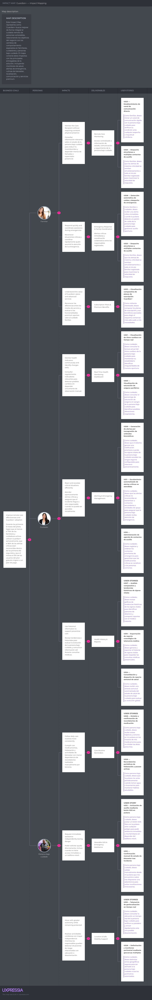

El Impact Map evidencia que las funcionalidades principales de Guardian+ no se plantean de manera aislada, sino como mecanismos orientados a generar cambios concretos en el comportamiento de los actores. Los familiares buscan reducir la incertidumbre y reaccionar con mayor rapidez; los cuidadores requieren centralizar la supervisión y mejorar la toma de decisiones; mientras que las personas bajo cuidado necesitan mayor autonomía para cumplir sus rutinas y solicitar ayuda ante situaciones de riesgo.

Asimismo, el artefacto permite mantener trazabilidad con las User Stories del Product Backlog. Entre las historias relacionadas se encuentran la detección automática de caídas y despacho de emergencia (US08), la generación y escalamiento de alertas críticas (US09 y US11), el monitoreo de signos vitales (US01-US05), los reportes históricos de salud (US07, US19 y US24), los recordatorios de bienestar (US06, US14 y US26), el botón SOS (US15), la localización y geocercas (US18 y US28), y la visualización comparativa de planes de suscripción (US33).

### 2.4.3. Product Backlog

El Product Backlog se construyó a partir de las 33 User Stories definidas en la sección 2.4.1, ordenadas según el valor que cada una aporta al negocio. Bajo ese criterio, las historias con mayor valor de negocio son las de detección y respuesta ante emergencias (EP03) y localización (EP04), pues constituyen la propuesta de valor central de Guardian+ ("lazo de cuidado" bidireccional ante situaciones críticas); les siguen el monitoreo de salud en tiempo real (EP01) y, después, recordatorios, reportes y comunicación (EP02). Las historias del sitio web estático o Landing Page (EP05) se incorporan desde el primer sprint, en un frente de trabajo paralelo al del aplicativo móvil, ya que son necesarias tempranamente para la difusión de la propuesta de valor y la adquisición de usuarios.

La estimación de esfuerzo se realizó con Story Points en escala de Fibonacci, en función de la complejidad técnica y del número de escenarios de aceptación de cada historia, utilizando ClickUp como herramienta de gestión del Product Backlog. La Tabla 2.50 presenta el Product Backlog priorizado.


<a id="tabla-2-50"></a>**Tabla 2.50.** Product Backlog de Guardian+

| # Orden | User Story Id | Título | Story Points (1 / 2 / 3 / 5 / 8) | Sprint |
|---|---|---|---|---|
| 1 | US15 | Activación de auxilio mediante botón SOS en pulsera | 5 | Sprint 1 |
| 2 | US08 | Detección automática de caídas y despacho de emergencia | 8 | Sprint 1 |
| 3 | US09 | Generación de alertas por transgresión de umbrales biomédicos | 5 | Sprint 1 |
| 4 | US11 | Escalamiento automatizado de alertas críticas no atendidas | 5 | Sprint 1 |
| 5 | US16 | Administración de agenda de contactos de auxilio | 2 | Sprint 1 |
| 6 | US18 | Telemetría de geolocalización en tiempo real | 5 | Sprint 1 |
| 7 | US30 | Navegación entre secciones informativas de la Landing Page | 1 | Sprint 1 |
| 8 | US31 | Presentación de características y beneficios clave del sistema | 2 | Sprint 1 |
| 9 | US32 | Captura y procesamiento de solicitudes de contacto institucional | 3 | Sprint 1 |
| 10 | US33 | Visualización comparativa de planes de suscripción Guardian+ | 3 | Sprint 1 |
| 11 | US01 | Visualización de ritmo cardíaco en tiempo real | 3 | Sprint 2 |
| 12 | US02 | Visualización de presión arterial estimada | 3 | Sprint 2 |
| 13 | US03 | Visualización de saturación de oxígeno periférico (SpO₂) | 3 | Sprint 2 |
| 14 | US04 | Supervisión de temperatura corporal continua | 3 | Sprint 2 |
| 15 | US05 | Visualización de frecuencia respiratoria estimada | 3 | Sprint 2 |
| 16 | US10 | Confirmación manual de estado de bienestar tras incidente | 3 | Sprint 2 |
| 17 | US20 | Notificación de nivel crítico de batería en wearable | 2 | Sprint 2 |
| 18 | US25 | Despacho simultáneo a múltiples contactos de auxilio | 3 | Sprint 2 |
| 19 | US21 | Sincronización y persistencia resiliente de telemetría (Offline Sync) | 8 | Sprint 2 |
| 20 | US06 | Emisión y confirmación de recordatorios de medicación | 5 | Sprint 3 |
| 21 | US07 | Análisis comparativo y tendencias históricas de signos vitales | 5 | Sprint 3 |
| 22 | US12 | Configuración y parametrización de niveles de alerta | 3 | Sprint 3 |
| 23 | US13 | Programación y notificación de consultas médicas | 3 | Sprint 3 |
| 24 | US19 | Exportación de reporte cronológico de telemetría médica | 3 | Sprint 3 |
| 25 | US23 | Establecimiento de canal de comunicación directa | 5 | Sprint 3 |
| 26 | US24 | Consolidación y despacho de reporte semanal de salud | 3 | Sprint 3 |
| 27 | US28 | Delimitación y monitoreo perimetral mediante geocercas múltiples | 5 | Sprint 3 |
| 28 | US14 | Recordatorios programados para actividad física ligera | 2 | Sprint 4 |
| 29 | US17 | Estimación y registro de fases de sueño | 5 | Sprint 4 |
| 30 | US22 | Silenciamiento de alertas no críticas en el Care Circle | 2 | Sprint 4 |
| 31 | US26 | Recordatorios periódicos de hidratación y pausas activas | 2 | Sprint 4 |
| 32 | US27 | Detección de inactividad física prolongada | 5 | Sprint 4 |
| 33 | US29 | Previsión de agotamiento de stock y pedidos de medicinas | 5 | Sprint 4 |

## 2.5. Strategic-Level Domain-Driven Design

En esta sección se presenta el diseño estratégico de Guardian+ con Domain-Driven Design: el EventStorming con el que se descubrieron los Bounded Contexts, el Context Mapping que define sus relaciones y la arquitectura de software representada con el C4 Model.

### 2.5.1. EventStorming

El equipo aplicó EventStorming para explorar el dominio de Guardian+ a partir de sus eventos, comandos, actores y políticas. Con ese análisis se identificaron los Bounded Contexts candidatos, se modelaron los flujos de mensajes del contexto principal y se elaboraron los Bounded Context Canvases.

#### 2.5.1.1. Candidate Context Discovery

Una vez detallados los flujos mediante Design-Level EventStorming, se procedió con la actividad de Candidate Context Discovery. Esta etapa representa la transición entre el análisis del comportamiento del dominio y la definición de su arquitectura estratégica. El objetivo fue identificar agrupaciones de funcionalidades que comparten un mismo Lenguaje Ubicuo, reglas de negocio relacionadas y responsabilidades cohesivas.

A partir del análisis de los eventos, comandos, actores, políticas, agregados y sistemas externos identificados durante el EventStorming, fue posible reconocer límites naturales dentro del dominio de Guardian+. Estas agrupaciones permitieron proponer contextos candidatos que posteriormente servirán como base para la descomposición del sistema en módulos independientes y con responsabilidades claramente diferenciadas.

Como resultado del análisis se identificaron siete Bounded Contexts candidatos, clasificados de acuerdo con su relevancia estratégica dentro del dominio de Guardian+: dos pertenecientes al Core Domain, dos al Supporting Domain y tres al Generic Domain. A continuación, se presentan los resultados de EventStorming utilizados para sustentar el descubrimiento de cada contexto. De la misma manera, por practicidad, se adjuntan nuevamente los eventos encontrados en el Big Picture Eventstorming.

##### Eventos obtenidos previamente

La Figura 2.16 retoma los eventos identificados en el Big Picture EventStorming, que sirvieron como punto de partida para descubrir los Bounded Contexts candidatos.

<a id="figura-2-16"></a>**Figura 2.16.** Eventos del Big Picture EventStorming usados como punto de partida


##### Emergency & Alerting Bounded Context (Core Domain)

La Figura 2.17 presenta el EventStorming del Bounded Context Emergency & Alerting.

<a id="figura-2-17"></a>**Figura 2.17.** EventStorming del Bounded Context Emergency & Alerting

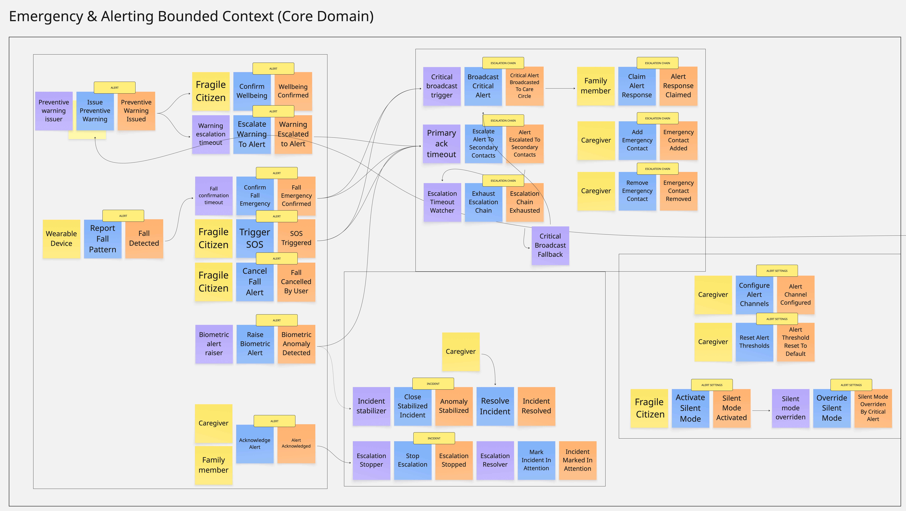

Este contexto candidato agrupa los comportamientos relacionados con la detección y gestión de situaciones de emergencia, la generación y escalamiento de alertas, el reconocimiento de incidentes y la coordinación de la respuesta por parte de familiares y cuidadores.

Su Lenguaje Ubicuo se encuentra asociado a conceptos como detección de caídas, SOS, alerta crítica, reconocimiento de alerta, escalamiento, contacto de emergencia y estabilización de incidentes.

Se clasificó como parte del **Core Domain** debido a que representa una de las capacidades de mayor valor diferencial de Guardian+: permitir que familiares y cuidadores reaccionen oportunamente ante eventos que puedan comprometer el bienestar de una persona vulnerable.


##### Health Monitoring Bounded Context (Core Domain)

La Figura 2.18 presenta el EventStorming del Bounded Context Health Monitoring.

<a id="figura-2-18"></a>**Figura 2.18.** EventStorming del Bounded Context Health Monitoring

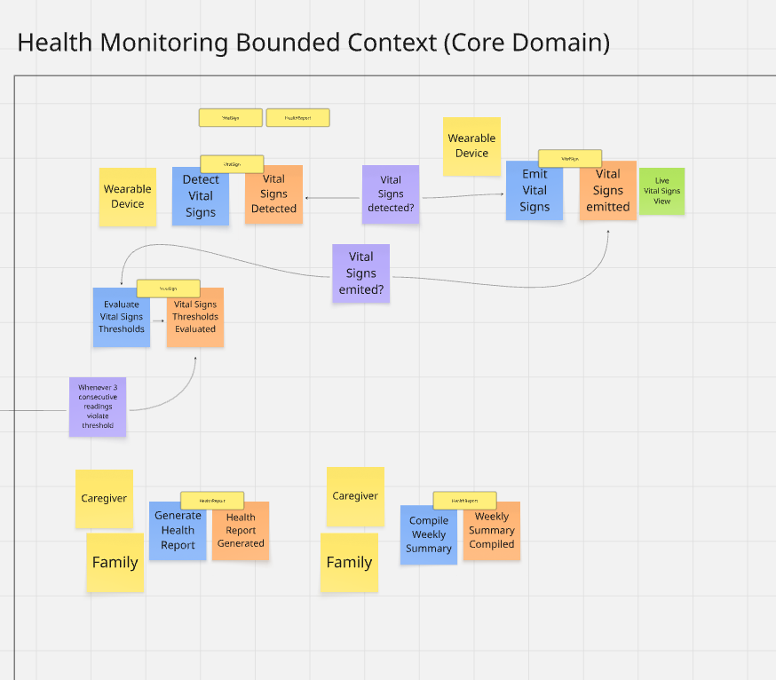

Este contexto candidato concentra las capacidades relacionadas con el monitoreo de bioseñales, la evaluación de umbrales biométricos, la visualización de información de salud y la generación de reportes y resúmenes periódicos.

Dentro de su Lenguaje Ubicuo se encuentran conceptos como bioseñales, telemetría, umbral biométrico, indicadores de salud, métricas en tiempo real, reportes de salud y resúmenes semanales.

Se clasificó como parte del **Core Domain** porque el monitoreo continuo del estado de la persona bajo cuidado constituye una de las funcionalidades centrales de Guardian+ y proporciona información fundamental para detectar posibles anomalías y alimentar posteriormente los procesos de prevención y emergencia.


##### Care Routines & Wellness Bounded Context (Supporting Domain)

La Figura 2.19 presenta el EventStorming del Bounded Context Care Routines & Wellness.

<a id="figura-2-19"></a>**Figura 2.19.** EventStorming del Bounded Context Care Routines & Wellness

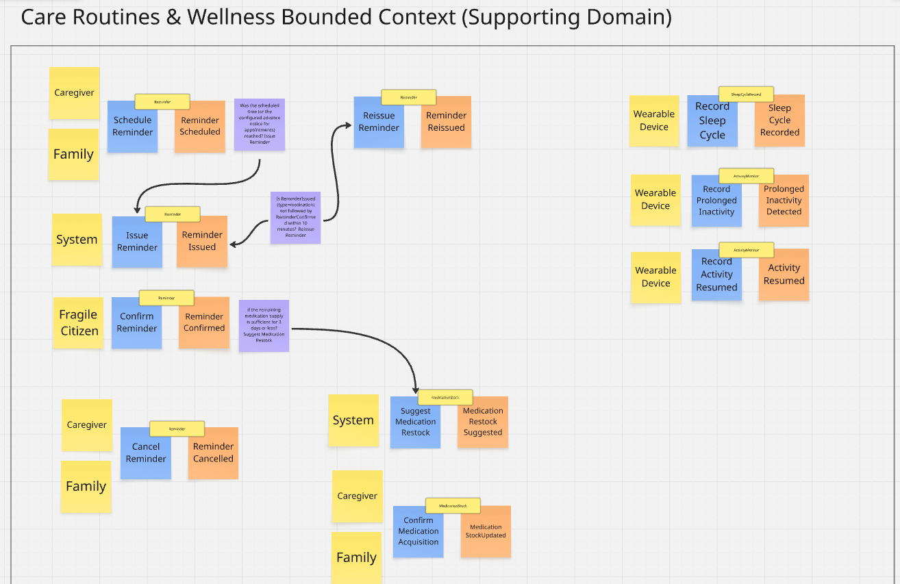

Este contexto candidato agrupa las capacidades destinadas a apoyar las actividades cotidianas de cuidado y bienestar. Entre ellas se encuentran la programación, emisión, confirmación, reemisión y cancelación de recordatorios, así como el seguimiento del stock de medicamentos, ciclos de sueño, periodos prolongados de inactividad y reanudación de actividad.

Su Lenguaje Ubicuo incluye conceptos como recordatorio, rutina, medicación, stock, sueño, actividad, inactividad y bienestar.

Fue clasificado como **Supporting Domain**, ya que complementa las capacidades principales de monitoreo y atención de emergencias, mejorando la continuidad del cuidado diario, pero sin constituir por sí mismo el principal diferenciador estratégico de Guardian+.


##### Mobility & Geofencing Bounded Context (Supporting Domain)

La Figura 2.20 presenta el EventStorming del Bounded Context Mobility & Geofencing.

<a id="figura-2-20"></a>**Figura 2.20.** EventStorming del Bounded Context Mobility & Geofencing

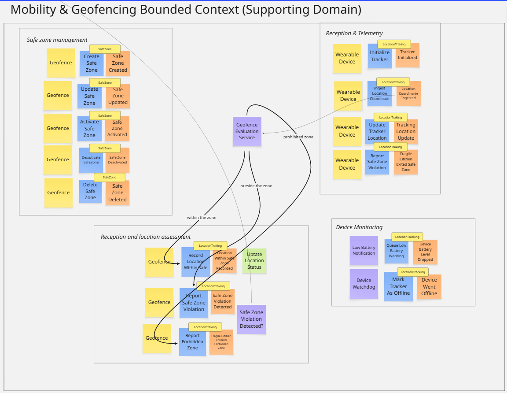

Este contexto candidato reúne las funcionalidades relacionadas con el seguimiento de ubicación y la definición de zonas seguras para la persona bajo cuidado. Incluye la creación y actualización de geocercas, la recepción de ubicaciones y la evaluación de si la persona permanece dentro o fuera de los límites configurados.

Su Lenguaje Ubicuo se encuentra compuesto por conceptos como geocerca, zona segura, ubicación, seguimiento, estado de ubicación y violación de zona segura.

Se clasificó como **Supporting Domain**, debido a que aporta información contextual importante para la seguridad de la persona bajo cuidado y puede originar situaciones que requieran atención, aunque su funcionamiento complementa a los contextos principales de monitoreo y alertamiento.


##### IAM Bounded Context (Generic Domain)

La Figura 2.21 presenta el EventStorming del Bounded Context IAM.

<a id="figura-2-21"></a>**Figura 2.21.** EventStorming del Bounded Context IAM

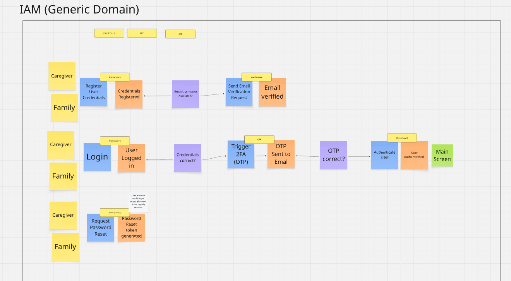

Este contexto candidato agrupa los procesos relacionados con la gestión de identidad y acceso a Guardian+. Incluye el registro de credenciales, verificación de correo electrónico, autenticación, uso de códigos OTP y recuperación de contraseña.

Su Lenguaje Ubicuo comprende conceptos como credenciales, autenticación, verificación, OTP, contraseña, inicio de sesión y usuario autenticado.

Se clasificó como **Generic Domain** porque representa una capacidad necesaria para garantizar el acceso seguro a la plataforma, pero corresponde a una problemática común en numerosos sistemas de software y no constituye un elemento diferenciador propio del negocio de Guardian+.


##### Profile Bounded Context (Generic Domain)

La Figura 2.22 presenta el EventStorming del Bounded Context Profile.

<a id="figura-2-22"></a>**Figura 2.22.** EventStorming del Bounded Context Profile

El Bounded Context **Profile** concentra las capacidades relacionadas con la administración de la información descriptiva de los usuarios de Guardian+, las personas bajo cuidado, las relaciones de cuidado y las preferencias de uso de la aplicación. Mediante la sesión de EventStorming se identificaron los principales actores, comandos y eventos de dominio involucrados en estos procesos, permitiendo delimitar las responsabilidades correspondientes a este contexto.

La siguiente figura presenta el EventStorming correspondiente al **Profile Bounded Context**, organizado de acuerdo con los principales procesos identificados dentro del dominio.

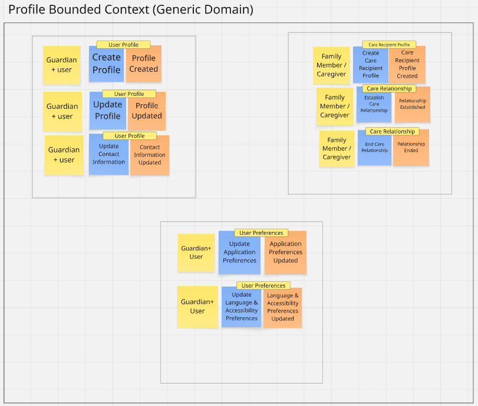

**Figura: EventStorming del Profile Bounded Context.**

En el diagrama, las notas amarillas representan los actores que interactúan con el contexto, las notas azules representan los comandos que expresan una intención o acción sobre el dominio y las notas naranjas representan los eventos de dominio producidos como resultado de dichas acciones. Esta organización permite visualizar los principales flujos bajo la secuencia **Actor → Command → Domain Event**.

En la parte superior izquierda de la figura se agrupan las operaciones relacionadas con el perfil del usuario. El actor `Guardian+ User` puede ejecutar los comandos `Create Profile`, `Update Profile` y `Update Contact Information`, generando respectivamente los eventos `Profile Created`, `Profile Updated` y `Contact Information Updated`. Estos flujos representan las acciones necesarias para crear y mantener actualizada la información descriptiva de una persona usuaria de Guardian+.

En la parte superior derecha se representan las operaciones relacionadas con las personas bajo cuidado y las relaciones de cuidado. Un `Family Member / Caregiver` puede ejecutar `Create Care Recipient Profile` para registrar a una persona bajo cuidado, generando `Care Recipient Profile Created`. Asimismo, puede establecer o finalizar una relación de cuidado mediante los comandos `Establish Care Relationship` y `End Care Relationship`, produciendo los eventos `Relationship Established` y `Relationship Ended`.

Finalmente, en la parte inferior se encuentran las operaciones asociadas a las preferencias del usuario. El actor `Guardian+ User` puede modificar las preferencias generales de la aplicación mediante `Update Application Preferences`, así como configurar aspectos de idioma y accesibilidad mediante `Update Language & Accessibility Preferences`. Como resultado se generan los eventos `Application Preferences Updated` y `Language & Accessibility Preferences Updated`.

A partir de estos flujos se identificó un Lenguaje Ubicuo compuesto por conceptos como **User Profile**, **Care Recipient Profile**, **Care Relationship**, **Contact Information**, **Application Preferences**, **Language** y **Accessibility Preferences**, los cuales permiten mantener una terminología consistente entre el modelado del dominio y su posterior implementación.

El contexto **Profile** se clasificó como **Generic Domain**, debido a que sus capacidades de administración de perfiles, relaciones y preferencias son necesarias para el funcionamiento de Guardian+, pero corresponden a funcionalidades comunes que no constituyen el principal elemento diferenciador de la propuesta de valor del producto.

##### Subscriptions Bounded Context (Generic Domain)

El Bounded Context **Subscriptions** concentra las capacidades relacionadas con el ciclo de vida comercial de las suscripciones de Guardian+. Mediante la sesión de EventStorming se identificaron los principales actores, comandos, eventos de dominio, reglas de decisión y sistemas externos involucrados en los procesos de solicitud, activación, cambio de plan, cancelación, expiración y renovación de una suscripción, así como en la actualización de los beneficios asociados a cada plan.

La Figura 2.23 presenta el EventStorming correspondiente al **Subscriptions Bounded Context**, organizado de acuerdo con los principales procesos identificados dentro de este dominio.

<a id="figura-2-23"></a>**Figura 2.23.** EventStorming del Bounded Context Subscriptions

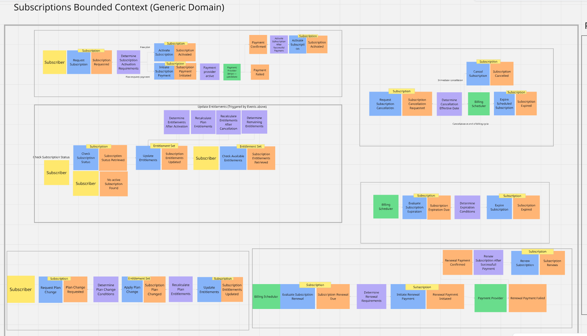

En el diagrama, las notas amarillas representan los actores que interactúan con el contexto, las notas azules representan los comandos ejecutados sobre el dominio, las notas naranjas corresponden a los eventos de dominio generados como resultado de dichas acciones, las notas moradas representan reglas o decisiones que determinan el comportamiento del proceso y las notas verdes representan sistemas externos o componentes de soporte, como `Billing Scheduler` y `Payment Provider`.

En la parte superior izquierda se representa el proceso de solicitud y activación de una suscripción. El actor `Subscriber` inicia el flujo mediante `Request Subscription`, generando `Subscription Requested`. A partir de `Determine Subscription Activation Requirements`, el proceso puede continuar directamente hacia la activación cuando corresponde a un plan gratuito o iniciar el flujo de pago mediante `Initiate Subscription Payment`. En este último caso, el resultado del proveedor de pagos determina si la suscripción puede activarse mediante `Activate Subscription After Successful Payment` o si el proceso finaliza con un pago fallido.

La parte central izquierda reúne los flujos relacionados con la consulta del estado de la suscripción y la administración de entitlements. El usuario puede consultar el estado de su suscripción mediante `Check Subscription Status` y revisar los beneficios disponibles mediante `Check Available Entitlements`. Asimismo, las reglas `Determine Entitlements After Activation`, `Recalculate Plan Entitlements`, `Recalculate Entitlements After Cancellation` y `Determine Remaining Entitlements` permiten actualizar los beneficios asociados a la suscripción mediante `Update Entitlements`.

En la parte superior derecha se presenta el proceso de cancelación. Luego de `Request Subscription Cancellation`, la regla `Determine Cancellation Effective Date` permite distinguir entre una cancelación inmediata y una cancelación efectiva al finalizar el ciclo de facturación. En el primer caso se ejecuta `Cancel Subscription`, mientras que en el segundo interviene `Billing Scheduler` para ejecutar `Expire Scheduled Subscription`.

En la parte inferior izquierda se representa el cambio de plan. El flujo inicia con `Request Plan Change`, continúa con `Determine Plan Change Conditions` y `Apply Plan Change`, y posteriormente recalcula y actualiza los entitlements correspondientes al nuevo plan.

Finalmente, la parte inferior derecha agrupa los procesos de expiración y renovación. `Billing Scheduler` evalúa periódicamente si una suscripción debe expirar o renovarse. En el proceso de expiración se utilizan `Evaluate Subscription Expiration`, `Determine Expiration Conditions` y `Expire Subscription`. En el proceso de renovación se ejecutan `Evaluate Subscription Renewal`, `Determine Renewal Requirements` e `Initiate Renewal Payment`, incorporando la interacción con `Payment Provider` y contemplando tanto la confirmación como el fallo del pago antes de renovar la suscripción.

A partir de estos flujos se identificó un Lenguaje Ubicuo compuesto por conceptos como **Subscription**, **Plan**, **Payment**, **Renewal**, **Cancellation**, **Expiration** y **Entitlement**, permitiendo mantener una terminología consistente entre el modelado del dominio y su posterior implementación.

El contexto **Subscriptions** se clasificó como **Generic Domain**, debido a que sus capacidades permiten implementar el modelo comercial de Guardian+ y controlar los beneficios disponibles para los usuarios, pero corresponden a funcionalidades comunes que no representan la principal fuente de innovación o diferenciación de la solución.

Como resultado del Candidate Context Discovery, el equipo estableció una primera descomposición estratégica del dominio de Guardian+. Los contextos **Emergency & Alerting** y **Health Monitoring** fueron reconocidos como parte del Core Domain debido a su relación directa con la propuesta de valor principal de la solución. **Care Routines & Wellness** y **Mobility & Geofencing** fueron clasificados como Supporting Domains debido a que complementan y fortalecen las capacidades centrales de cuidado. Finalmente, **IAM**, **Profile** y **Subscriptions** fueron identificados como Generic Domains al representar capacidades necesarias para el funcionamiento de la plataforma, pero comunes a otros tipos de sistemas.

Esta descomposición servirá como base para las siguientes actividades de Strategic-Level Domain-Driven Design, donde se analizarán los mensajes intercambiados entre contextos, sus responsabilidades y las relaciones de integración mediante Domain Message Flows, Bounded Context Canvases y Context Mapping.

#### 2.5.1.2. Domain Message Flows Modeling

En esta sección se documentan los principales flujos de mensajes (comandos, eventos y policies) del Bounded Context **Emergency & Alerting**, modelados como diagramas de secuencia a partir del Design-Level EventStorming. Se seleccionaron los tres flujos de mayor valor de negocio, que recorren los dos agregados centrales del contexto (ALERT e INCIDENT) y las policies de despacho y escalamiento que los conectan.

##### Bounded Context: Emergency & Alerting

Los diagramas siguen la notación de Domain Message Flow Modelling de DDD Crew. Los actores se representan con la figura de una persona, los Bounded Contexts con nubes y los sistemas externos con un engranaje. Cada mensaje es una nota numerada según el orden en que ocurre, con su nombre y los datos que transporta: en azul los comandos y en naranja los eventos. Las flechas punteadas indican la dirección del mensaje, desde el emisor hasta el receptor. Las notas amarillas con reloj marcan las condiciones de tiempo, las etiquetas grises indican la policy que emite el mensaje y las notas amarillas sin reloj aclaran una regla del escenario. Los mensajes que Emergency & Alerting procesa internamente se ubican sobre la línea punteada que sale de la nube del contexto y regresa a ella.

**Flujo 1 — Caída confirmada**

El escenario inicia cuando el Wearable Device detecta una caída y envía el comando Trigger Alert (1) a Emergency & Alerting, con el Care Recipient, el origen `FALL_DETECTED`, la referencia del dispositivo y la hora de disparo. El contexto registra Alert Triggered (2) con severidad `CRITICAL` y estado `PENDING_CONFIRMATION`, y abre la Ventana de Confirmación de Caída. Si el Fragile Citizen no cancela la alerta dentro de los 20 segundos, se emite Confirm Alert (3) y se registra Alert Confirmed (4); si la cancela, la alerta se descarta como falso positivo y el escenario termina.

Con la alerta confirmada, la policy Dispatch Strategy Selector emite Dispatch Alert (5). Como la severidad es `CRITICAL` y la configuración del Fragile Citizen tiene activada la difusión inmediata de alertas críticas (`broadcastCriticalImmediately`), la alerta se difunde a todos los contactos activos: Alert Broadcasted (6) llega al Family Member por sus canales habilitados más `SMS`. Con la configuración por defecto, en cambio, la alerta comenzaría en el contacto primario y escalaría por niveles, como en el Flujo 3b. El Family Member reconoce la alerta con Acknowledge Alert (7) y el contexto registra Alert Acknowledged (8). Luego, la policy Escalation Stopper detiene el escalamiento y emite Open Incident (9), que abre el incidente en estado `IN_ATTENTION` (Incident Opened, 10).

La Figura 2.24 presenta el domain message flow del flujo de caída confirmada.

<a id="figura-2-24"></a>**Figura 2.24.** Domain message flow del flujo de caída confirmada

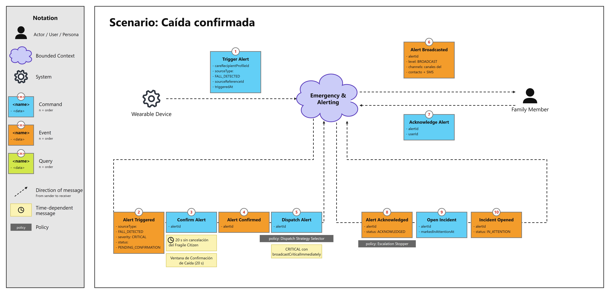

**Flujo 2 — SOS manual**

En este escenario es el propio Fragile Citizen quien dispara la alerta al presionar el botón SOS de la pulsera. El Wearable Device envía Trigger Alert (1) con el origen `SOS_TRIGGERED` y Emergency & Alerting registra Alert Triggered (2) con severidad `CRITICAL`. A diferencia de la caída, el SOS no requiere ventana de confirmación, por lo que el contexto emite Confirm Alert (3) de inmediato y registra Alert Confirmed (4).

Después, la policy Dispatch Strategy Selector emite Dispatch Alert (5) y, con la difusión inmediata de alertas críticas activada, Alert Broadcasted (6) llega a todos los contactos activos, entre ellos el Family Member, por sus canales habilitados más `SMS`. Desde este punto el escenario continúa igual que el Flujo 1: el reconocimiento de la alerta detiene el escalamiento y abre el incidente.

La Figura 2.25 presenta el domain message flow del flujo de SOS manual.

<a id="figura-2-25"></a>**Figura 2.25.** Domain message flow del flujo de SOS manual

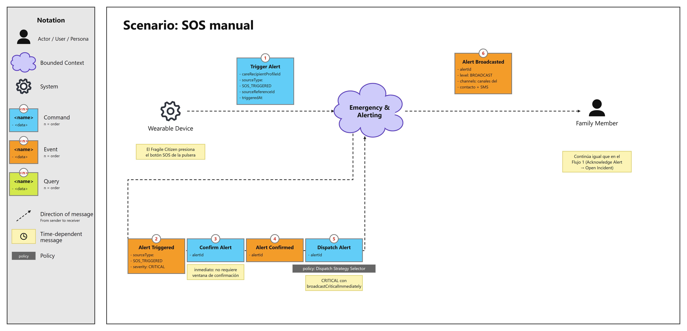

**Flujo 3 — Anomalía biométrica**

Este flujo se presenta en dos escenarios, porque su desenlace depende de si el contacto primario reconoce la alerta a tiempo. Los mensajes 1 al 8 son comunes a ambos.

El Wearable Device envía cada lectura a Health Monitoring con Detect Vital Signs (1). Cuando la policy Regla de Tolerancia confirma tres lecturas consecutivas fuera del umbral vigente, Health Monitoring publica el evento de integración Vital Sign Anomaly Detected (2), con el Care Recipient, el tipo de signo vital, el umbral transgredido, el valor y su clasificación. Emergency & Alerting consume ese evento y emite Trigger Alert (3) con el origen `VITAL_SIGN_ANOMALY`, y registra Alert Triggered (4) con severidad `HIGH`. Como este origen no requiere ventana de confirmación, emite Confirm Alert (5) y registra Alert Confirmed (6) de inmediato. La policy Dispatch Strategy Selector emite Dispatch Alert (7) y, por tratarse de una alerta `HIGH`, el despacho inicia en el contacto primario: Alert Dispatched (8) llega al Caregiver con el nivel `PRIMARY` y los identificadores de las entregas.

En el primer escenario, el Caregiver responde antes de que venza el Ack Timeout y envía Acknowledge Alert (9). El contexto registra Alert Acknowledged (10), la policy Escalation Stopper detiene el escalamiento y emite Open Incident (11), y el incidente queda abierto en estado `IN_ATTENTION` (Incident Opened, 12).

La Figura 2.26 presenta el domain message flow de la anomalía biométrica reconocida a tiempo.

<a id="figura-2-26"></a>**Figura 2.26.** Domain message flow del flujo de anomalía biométrica reconocida a tiempo

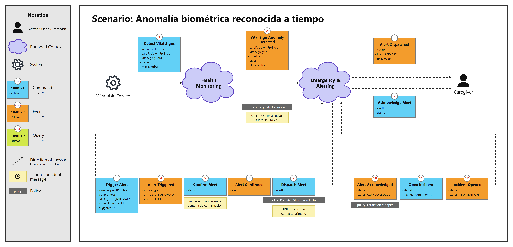

En el segundo escenario, el Caregiver no reconoce la alerta. Al vencer el Ack Timeout del contacto primario (60 segundos por defecto), Emergency & Alerting emite Escalate Alert (9) y registra Alert Escalated (10): la alerta pasa a estado `ESCALATED` y se entrega a los contactos del nivel `SECONDARY`. Si no existen contactos secundarios, el escalamiento pasa directamente al nivel `BROADCAST`. Si el Ack Timeout vence nuevamente sin reconocimiento, la policy Critical Broadcast Fallback emite Broadcast Alert (11) como último recurso, y Alert Broadcasted (12) difunde la alerta a todos los contactos activos, añadiendo `SMS` a sus canales habilitados. Cuando un contacto reconoce la alerta en cualquiera de estos niveles, el escenario continúa como en la Figura 2.26.

La Figura 2.27 presenta el domain message flow de la anomalía biométrica escalada.

<a id="figura-2-27"></a>**Figura 2.27.** Domain message flow del flujo de anomalía biométrica escalada

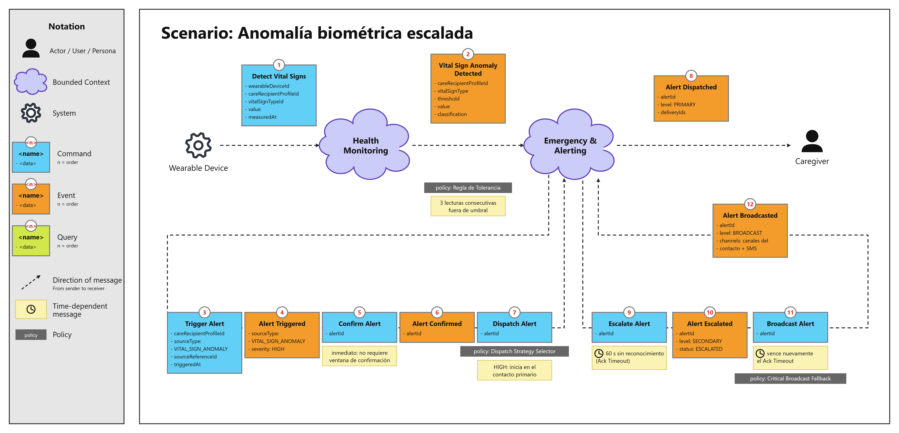

**Flujo 4 — Recordatorio de medicación reemitido**

Care Routines & Wellness emite Reminder Issued (1) cuando llega la hora programada de un recordatorio de medicación, y este llega al Fragile Citizen con el tipo `MEDICATION` y la hora programada. Si el Fragile Citizen no confirma la toma dentro de los 10 minutos de tolerancia, la policy Reminder Reissue Policy reemite el recordatorio: Reminder Reissued (2) vuelve a llegar al Fragile Citizen y, al mismo tiempo, el contexto publica el evento de integración Reminder Reissued (3) hacia Emergency & Alerting.

Emergency & Alerting traduce ese evento en Trigger Alert (4) con el origen `REMINDER_REISSUED` y registra Alert Triggered (5) con severidad `MEDIUM`. Como este origen no requiere ventana de confirmación, emite Confirm Alert (6) y registra Alert Confirmed (7) de inmediato. La policy Dispatch Strategy Selector emite Dispatch Alert (8) y, por tratarse de una alerta `MEDIUM`, notifica solo al contacto primario y nunca escala: Alert Dispatched (9) llega al Caregiver para que verifique que se cumpla la medicación.

La Figura 2.28 presenta el domain message flow del flujo de recordatorio de medicación reemitido.

<a id="figura-2-28"></a>**Figura 2.28.** Domain message flow del flujo de recordatorio de medicación reemitido

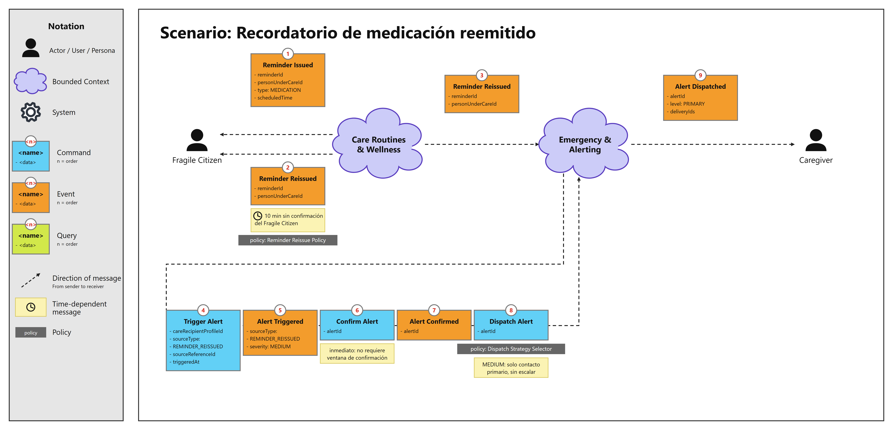

**Flujo 5 — Inactividad prolongada**

El Wearable Device reporta la telemetría de actividad del Fragile Citizen. Cuando este permanece más de 60 minutos sin movimiento en horario diurno, Care Routines & Wellness recibe Record Prolonged Inactivity (1) con la persona bajo cuidado y la hora de detección. El ActivityMonitor pasa de `NORMAL` a `INACTIVITY_DETECTED` y el contexto publica el evento de integración Prolonged Inactivity Detected (2) hacia Emergency & Alerting.

Emergency & Alerting emite Trigger Alert (3) con el origen `PROLONGED_INACTIVITY` y registra Alert Triggered (4) con severidad `HIGH`. Como este origen no requiere ventana de confirmación, emite Confirm Alert (5) y registra Alert Confirmed (6) de inmediato. La policy Dispatch Strategy Selector emite Dispatch Alert (7) y el despacho inicia en el contacto primario: Alert Dispatched (8) llega al Caregiver. Si el Caregiver no reconoce la alerta, el escalamiento sigue las mismas reglas del segundo escenario del Flujo 3.

La Figura 2.29 presenta el domain message flow del flujo de inactividad prolongada.

<a id="figura-2-29"></a>**Figura 2.29.** Domain message flow del flujo de inactividad prolongada

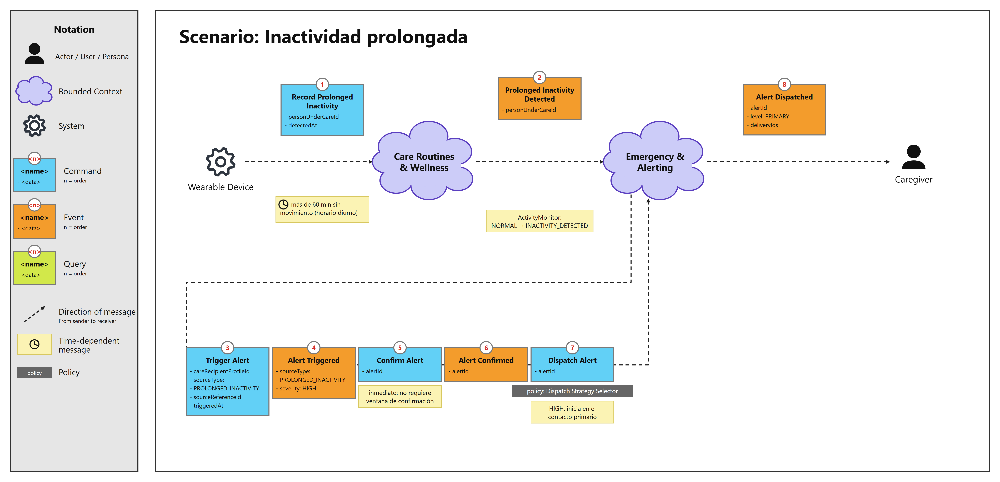

#### 2.5.1.3. Bounded Context Canvases

En esta sección se presentan los Bounded Context Canvases de los siete Bounded Contexts candidatos de Guardian+, elaborados con la plantilla **Bounded Context Canvas V5** de DDD Crew. Cada canvas reúne el nombre, el propósito, la clasificación estratégica, el rol de dominio, la comunicación entrante y saliente con sus colaboradores, el Ubiquitous Language, las decisiones de negocio, los supuestos, las métricas de verificación y las preguntas abiertas del contexto. Los mensajes se distinguen por color: queries en verde, commands en azul, eventos en amarillo y decisiones de negocio en morado.

##### Bounded Context: Emergency & Alerting (Core Domain)

En la Figura 2.30 se observa el Bounded Context Emergency & Alerting está clasificado como un Core Domain cuyo propósito es centralizar, gobernar y despachar de forma oportuna las alertas ante señales que comprometan la seguridad de la persona cuidada. Para garantizar una respuesta humana efectiva, el sistema consume asíncronamente eventos de riesgo de otros contextos (como anomalías biométricas de Health Monitoring o violaciones de geocercas de Mobility & Geofencing) y ejecuta complejas reglas de negocio como una ventana de confirmación de caídas, tiempos límite de reconocimiento (Ack Timeout) y una cadena de escalamiento progresivo que finaliza en el despacho de notificaciones push y SMS a través de proveedores externos.

<a id="figura-2-30"></a>**Figura 2.30.** Bounded Context Canvas de Emergency & Alerting

<table class="canvas" width="100%" style="border-collapse: collapse; border: 3px solid #212121; font-family: Arial, sans-serif; color: #212121;">
<tr><td style="padding: 0; border: none;">
<table width="100%" style="border-collapse: collapse; table-layout: fixed;">
<tr>
<td width="63%" valign="top" style="border: 2px solid #212121; padding: 8px 10px; vertical-align: top;">
<span style="font-size: 15pt; font-weight: bold; color: #212121;">Name: Emergency &amp; Alerting</span>
</td>
<td width="37%" valign="top" style="border: 2px solid #212121; padding: 8px 10px; vertical-align: top; background: #e0e0e0;">
<div style="font-size: 8pt; font-weight: bold; color: #757575;">V5</div><div style="font-size: 8pt; font-weight: bold; color: #757575;">github.com/ddd-crew/bounded-context-canvas</div>
</td>
</tr>
</table>
</td></tr>
<tr><td style="padding: 0; border: none;">
<table width="100%" style="border-collapse: collapse; table-layout: fixed;">
<tr>
<td width="36%" valign="top" style="border: 2px solid #212121; padding: 8px 10px; vertical-align: top;">
<div style="font-size: 11.5pt; font-weight: bold; color: #212121;">Purpose</div>
<div style="font-size: 8.5pt; line-height: 1.4; margin-top: 4px;">Dispara las Alerts ante señales que comprometen la seguridad del Fragile Citizen, las despacha a sus Emergency Contacts según la severidad, gobierna el escalamiento progresivo hasta obtener un reconocimiento efectivo y registra la atención del Incident hasta su cierre.</div>
</td>
<td width="41%" valign="top" style="border: 2px solid #212121; padding: 8px 10px; vertical-align: top;">
<div style="font-size: 11.5pt; font-weight: bold; color: #212121;">Strategic Classification</div>
<table width="100%" style="border-collapse: collapse; margin-top: 4px;"><tr>
<td valign="top" style="border: none; padding: 0 4px; vertical-align: top;"><div style="font-size: 8.5pt; font-weight: bold; color: #616161;">Domain</div>
<div style="font-size: 8pt; font-weight: bold; color: #212121; background: #e0e0e0; padding: 0 3px;"><strong>- core</strong></div>
<div style="font-size: 8pt; color: #9e9e9e; padding: 0 3px;">- supporting</div>
<div style="font-size: 8pt; color: #9e9e9e; padding: 0 3px;">- generic</div>
<div style="font-size: 8pt; color: #9e9e9e; padding: 0 3px;">- other?</div></td>
<td valign="top" style="border: none; padding: 0 4px; vertical-align: top;"><div style="font-size: 8.5pt; font-weight: bold; color: #616161;">Business Model</div>
<div style="font-size: 8pt; color: #9e9e9e; padding: 0 3px;">- revenue</div>
<div style="font-size: 8pt; font-weight: bold; color: #212121; background: #e0e0e0; padding: 0 3px;"><strong>- engagement</strong></div>
<div style="font-size: 8pt; color: #9e9e9e; padding: 0 3px;">- compliance</div>
<div style="font-size: 8pt; color: #9e9e9e; padding: 0 3px;">- cost reduction</div></td>
<td valign="top" style="border: none; padding: 0 4px; vertical-align: top;"><div style="font-size: 8.5pt; font-weight: bold; color: #616161;">Evolution</div>
<div style="font-size: 8pt; color: #9e9e9e; padding: 0 3px;">- genesis</div>
<div style="font-size: 8pt; font-weight: bold; color: #212121; background: #e0e0e0; padding: 0 3px;"><strong>- custom built</strong></div>
<div style="font-size: 8pt; color: #9e9e9e; padding: 0 3px;">- product</div>
<div style="font-size: 8pt; color: #9e9e9e; padding: 0 3px;">- commodity</div></td>
</tr></table>
<div style="font-size: 8pt; line-height: 1.4; margin-top: 6px;"><strong>Core - </strong>Principal diferenciador de Guardian+: garantiza una respuesta humana oportuna ante eventos que comprometen la seguridad del Fragile Citizen.</div>
</td>
<td width="23%" valign="top" style="border: 2px solid #212121; padding: 8px 10px; vertical-align: top;">
<div style="font-size: 11.5pt; font-weight: bold; color: #212121;">Domain Roles</div>
<div style="font-size: 8.5pt; font-weight: bold; color: #616161; margin-top: 4px;">Role Types</div>
<div style="font-size: 8pt; color: #9e9e9e; padding: 0 3px;">- draft context</div>
<div style="font-size: 8pt; font-weight: bold; color: #212121; background: #e0e0e0; padding: 0 3px;"><strong>- execution context</strong></div>
<div style="font-size: 8pt; color: #9e9e9e; padding: 0 3px;">- analysis context</div>
<div style="font-size: 8pt; color: #9e9e9e; padding: 0 3px;">- gateway context</div>
<div style="font-size: 8pt; color: #9e9e9e; padding: 0 3px;">- other</div>
</td>
</tr>
</table>
</td></tr>
<tr><td style="padding: 0; border: none;">
<table width="100%" style="border-collapse: collapse; table-layout: fixed;">
<tr>
<td width="37%" valign="top" style="border: 2px solid #212121; padding: 8px 10px; vertical-align: top;">
<div style="font-size: 11.5pt; font-weight: bold; color: #212121;">Inbound Communication</div>
<table width="100%" style="border-collapse: collapse;">
<tr><td width="34%" style="border: none; padding: 0 0 4px 0; font-size: 8.5pt; font-weight: bold; color: #9e9e9e;">Collaborator</td><td width="8%" style="border: none;"></td><td width="58%" style="border: none; padding: 0 0 4px 0; font-size: 8.5pt; font-weight: bold; color: #9e9e9e;">Messages</td></tr>
<tr><td colspan="3" style="border: none; padding: 2px 0; font-size: 8pt;"><strong>Consumers</strong> <span style="color: #757575;">(Services provided to consumers)</span></td></tr>
<tr><td colspan="3" style="border: none; padding: 2px 0 6px 0;"><div style="display: inline-block; background: #eef7c8; border: 2px solid #c5e17a; padding: 4px 6px; margin: 0 3px 4px 0; font-size: 7.5pt; color: #212121;">Get Active Alerts</div>
<div style="display: inline-block; background: #eef7c8; border: 2px solid #c5e17a; padding: 4px 6px; margin: 0 3px 4px 0; font-size: 7.5pt; color: #212121;">Get Alert History</div>
<div style="display: inline-block; background: #eef7c8; border: 2px solid #c5e17a; padding: 4px 6px; margin: 0 3px 4px 0; font-size: 7.5pt; color: #212121;">Get Pending Alerts</div>
<div style="display: inline-block; background: #eef7c8; border: 2px solid #c5e17a; padding: 4px 6px; margin: 0 3px 4px 0; font-size: 7.5pt; color: #212121;">Get Alert Settings</div>
<div style="display: inline-block; background: #d6e6f7; border: 2px solid #8fb8e6; padding: 4px 6px; margin: 0 3px 4px 0; font-size: 7.5pt; color: #212121;">Trigger Alert</div>
<div style="display: inline-block; background: #d6e6f7; border: 2px solid #8fb8e6; padding: 4px 6px; margin: 0 3px 4px 0; font-size: 7.5pt; color: #212121;">Confirm / Dismiss Alert</div>
<div style="display: inline-block; background: #d6e6f7; border: 2px solid #8fb8e6; padding: 4px 6px; margin: 0 3px 4px 0; font-size: 7.5pt; color: #212121;">Dispatch / Broadcast Alert</div>
<div style="display: inline-block; background: #d6e6f7; border: 2px solid #8fb8e6; padding: 4px 6px; margin: 0 3px 4px 0; font-size: 7.5pt; color: #212121;">Escalate Alert</div>
<div style="display: inline-block; background: #d6e6f7; border: 2px solid #8fb8e6; padding: 4px 6px; margin: 0 3px 4px 0; font-size: 7.5pt; color: #212121;">Acknowledge Alert / Close Incident</div>
<div style="display: inline-block; background: #d6e6f7; border: 2px solid #8fb8e6; padding: 4px 6px; margin: 0 3px 4px 0; font-size: 7.5pt; color: #212121;">Manage Settings &amp; Emergency Contacts</div></td></tr>
<tr><td width="34%" valign="top" style="border: none; border-top: 1px solid #eeeeee; padding: 4px 4px 4px 0; vertical-align: top; font-size: 8pt;"><strong>Health Monitoring</strong><br><span style="color: #757575;">Internal</span><br><span style="color: #757575;">Customer/Supplier</span></td><td width="8%" valign="middle" style="border: none; padding: 4px 0; text-align: center; color: #bdbdbd; font-size: 14pt;">&#10140;</td><td width="58%" valign="top" style="border: none; border-top: 1px solid #eeeeee; padding: 4px 0; vertical-align: top;"><div style="display: inline-block; background: #fbf3cc; border: 2px solid #f0d36b; padding: 4px 6px; margin: 0 3px 4px 0; font-size: 7.5pt; color: #212121;">Consume anomalías biométricas confirmadas</div></td></tr>
<tr><td width="34%" valign="top" style="border: none; border-top: 1px solid #eeeeee; padding: 4px 4px 4px 0; vertical-align: top; font-size: 8pt;"><strong>Mobility &amp; Geofencing</strong><br><span style="color: #757575;">Internal</span><br><span style="color: #757575;">Customer/Supplier</span></td><td width="8%" valign="middle" style="border: none; padding: 4px 0; text-align: center; color: #bdbdbd; font-size: 14pt;">&#10140;</td><td width="58%" valign="top" style="border: none; border-top: 1px solid #eeeeee; padding: 4px 0; vertical-align: top;"><div style="display: inline-block; background: #fbf3cc; border: 2px solid #f0d36b; padding: 4px 6px; margin: 0 3px 4px 0; font-size: 7.5pt; color: #212121;">Consume violaciones de zona segura y consulta la última ubicación para la notificación</div></td></tr>
<tr><td width="34%" valign="top" style="border: none; border-top: 1px solid #eeeeee; padding: 4px 4px 4px 0; vertical-align: top; font-size: 8pt;"><strong>Care Routines &amp; Wellness</strong><br><span style="color: #757575;">Internal</span><br><span style="color: #757575;">Customer/Supplier</span></td><td width="8%" valign="middle" style="border: none; padding: 4px 0; text-align: center; color: #bdbdbd; font-size: 14pt;">&#10140;</td><td width="58%" valign="top" style="border: none; border-top: 1px solid #eeeeee; padding: 4px 0; vertical-align: top;"><div style="display: inline-block; background: #fbf3cc; border: 2px solid #f0d36b; padding: 4px 6px; margin: 0 3px 4px 0; font-size: 7.5pt; color: #212121;">Consume inactividad prolongada, recordatorios reemitidos y sugerencias de reabastecimiento</div></td></tr>
<tr><td width="34%" valign="top" style="border: none; border-top: 1px solid #eeeeee; padding: 4px 4px 4px 0; vertical-align: top; font-size: 8pt;"><strong>Profile</strong><br><span style="color: #757575;">Internal</span><br><span style="color: #757575;">ECST</span></td><td width="8%" valign="middle" style="border: none; padding: 4px 0; text-align: center; color: #bdbdbd; font-size: 14pt;">&#10140;</td><td width="58%" valign="top" style="border: none; border-top: 1px solid #eeeeee; padding: 4px 0; vertical-align: top;"><div style="display: inline-block; background: #fbf3cc; border: 2px solid #f0d36b; padding: 4px 6px; margin: 0 3px 4px 0; font-size: 7.5pt; color: #212121;">Sincroniza los Emergency Contacts con las relaciones de cuidado</div></td></tr>
<tr><td width="34%" valign="top" style="border: none; border-top: 1px solid #eeeeee; padding: 4px 4px 4px 0; vertical-align: top; font-size: 8pt;"><strong>IAM</strong><br><span style="color: #757575;">Internal</span><br><span style="color: #757575;">OHS</span></td><td width="8%" valign="middle" style="border: none; padding: 4px 0; text-align: center; color: #bdbdbd; font-size: 14pt;">&#10140;</td><td width="58%" valign="top" style="border: none; border-top: 1px solid #eeeeee; padding: 4px 0; vertical-align: top;"><div style="display: inline-block; background: #fbf3cc; border: 2px solid #f0d36b; padding: 4px 6px; margin: 0 3px 4px 0; font-size: 7.5pt; color: #212121;">Valida identidad y autorización de cada comando</div></td></tr>
</table>
</td>
<td width="26%" valign="top" style="border: 2px solid #212121; padding: 8px 10px; vertical-align: top; border: 2px solid #9e9e9e; background: #ffffff;">
<div style="text-align: center; margin-bottom: 6px;"><span style="background: #424242; color: #ffffff; font-size: 6.5pt; padding: 2px 6px; border-radius: 4px; white-space: nowrap;">The Bounded Context Canvas V5</span></div>
<div style="font-size: 11.5pt; font-weight: bold; color: #212121; text-align: center;">Ubiquitous Language</div>
<div style="font-size: 7.5pt; color: #9e9e9e; text-align: center; font-weight: bold; margin-bottom: 6px;">Context-specific domain terminology</div>
<div style="text-align: center;">
<div style="display: inline-block; background: #f5f5f5; border: 1px dashed #9e9e9e; padding: 3px 6px; margin: 0 3px 4px 0; font-size: 7.5pt; font-weight: bold; color: #212121;">Alert</div>
<div style="display: inline-block; background: #f5f5f5; border: 1px dashed #9e9e9e; padding: 3px 6px; margin: 0 3px 4px 0; font-size: 7.5pt; font-weight: bold; color: #212121;">Incident</div>
<div style="display: inline-block; background: #f5f5f5; border: 1px dashed #9e9e9e; padding: 3px 6px; margin: 0 3px 4px 0; font-size: 7.5pt; font-weight: bold; color: #212121;">Emergency Contact</div>
<div style="display: inline-block; background: #f5f5f5; border: 1px dashed #9e9e9e; padding: 3px 6px; margin: 0 3px 4px 0; font-size: 7.5pt; font-weight: bold; color: #212121;">Escalation Chain</div>
<div style="display: inline-block; background: #f5f5f5; border: 1px dashed #9e9e9e; padding: 3px 6px; margin: 0 3px 4px 0; font-size: 7.5pt; font-weight: bold; color: #212121;">Alert Settings</div>
<div style="display: inline-block; background: #f5f5f5; border: 1px dashed #9e9e9e; padding: 3px 6px; margin: 0 3px 4px 0; font-size: 7.5pt; font-weight: bold; color: #212121;">Severity</div>
<div style="display: inline-block; background: #f5f5f5; border: 1px dashed #9e9e9e; padding: 3px 6px; margin: 0 3px 4px 0; font-size: 7.5pt; font-weight: bold; color: #212121;">Acknowledgment</div>
<div style="display: inline-block; background: #f5f5f5; border: 1px dashed #9e9e9e; padding: 3px 6px; margin: 0 3px 4px 0; font-size: 7.5pt; font-weight: bold; color: #212121;">Silent Mode</div>
</div>
<div style="font-size: 11.5pt; font-weight: bold; color: #212121; text-align: center; margin-top: 12px;">Business Decisions</div>
<div style="font-size: 7.5pt; color: #9e9e9e; text-align: center; font-weight: bold; margin-bottom: 6px;">Key business rules, policies, and decisions</div>
<div style="text-align: center;">
<div style="display: inline-block; background: #e4d7ee; border: 2px solid #a481c9; padding: 4px 6px; margin: 0 3px 4px 0; font-size: 7.5pt; color: #212121;">Dispatch Strategy Selector (escalamiento por niveles; difusión inmediata de CRITICAL configurable)</div>
<div style="display: inline-block; background: #e4d7ee; border: 2px solid #a481c9; padding: 4px 6px; margin: 0 3px 4px 0; font-size: 7.5pt; color: #212121;">Ventana de Confirmación de Caída (20 s)</div>
<div style="display: inline-block; background: #e4d7ee; border: 2px solid #a481c9; padding: 4px 6px; margin: 0 3px 4px 0; font-size: 7.5pt; color: #212121;">Ack Timeout del contacto primario (60 s por defecto)</div>
<div style="display: inline-block; background: #e4d7ee; border: 2px solid #a481c9; padding: 4px 6px; margin: 0 3px 4px 0; font-size: 7.5pt; color: #212121;">Escalation Stopper (el reconocimiento abre el Incident)</div>
<div style="display: inline-block; background: #e4d7ee; border: 2px solid #a481c9; padding: 4px 6px; margin: 0 3px 4px 0; font-size: 7.5pt; color: #212121;">Critical Broadcast Fallback ante cadena agotada</div>
<div style="display: inline-block; background: #e4d7ee; border: 2px solid #a481c9; padding: 4px 6px; margin: 0 3px 4px 0; font-size: 7.5pt; color: #212121;">Override de Silent Mode solo en severidad CRITICAL</div>
</div>
</td>
<td width="37%" valign="top" style="border: 2px solid #212121; padding: 8px 10px; vertical-align: top;">
<div style="font-size: 11.5pt; font-weight: bold; color: #212121;">Outbound Communication</div>
<table width="100%" style="border-collapse: collapse;">
<tr><td width="58%" style="border: none; padding: 0 0 4px 0; font-size: 8.5pt; font-weight: bold; color: #9e9e9e;">Messages</td><td width="8%" style="border: none;"></td><td width="34%" style="border: none; padding: 0 0 4px 0; font-size: 8.5pt; font-weight: bold; color: #9e9e9e;">Collaborator</td></tr>
<tr><td width="58%" valign="top" style="border: none; border-top: 1px solid #eeeeee; padding: 4px 0; vertical-align: top;"><div style="display: inline-block; background: #fbf3cc; border: 2px solid #f0d36b; padding: 4px 6px; margin: 0 3px 4px 0; font-size: 7.5pt; color: #212121;">Despacha las notificaciones push y SMS al Care Circle</div></td><td width="8%" valign="middle" style="border: none; padding: 4px 0; text-align: center; color: #bdbdbd; font-size: 14pt;">&#10140;</td><td width="34%" valign="top" style="border: none; border-top: 1px solid #eeeeee; padding: 4px 4px 4px 0; vertical-align: top; font-size: 8pt;"><strong>Notification Providers</strong><br><span style="color: #757575;">External</span><br><span style="color: #757575;">ACL</span></td></tr>
</table>
</td>
</tr>
</table>
</td></tr>
<tr><td style="padding: 0; border: none;">
<table width="100%" style="border-collapse: collapse; table-layout: fixed;">
<tr>
<td width="40%" valign="top" style="border: 2px solid #212121; padding: 8px 10px; vertical-align: top;">
<div style="font-size: 11.5pt; font-weight: bold; color: #212121;">Assumptions</div>
<div style="font-size: 8pt; margin-bottom: 3px;">- Los Emergency Contacts del Care Circle reconocen la mayoría de las alertas dentro del Ack Timeout de 60 s.</div>
<div style="font-size: 8pt; margin-bottom: 3px;">- Los Notification Providers entregan las notificaciones push y SMS con una latencia compatible con el despacho de emergencias en menos de 5 segundos.</div>
<div style="font-size: 8pt; margin-bottom: 3px;">- La proyección local del Care Circle sincronizada desde Profile basta para despachar alertas sin consultar a Profile durante un incidente.</div>
</td>
<td width="36%" valign="top" style="border: 2px solid #212121; padding: 8px 10px; vertical-align: top;">
<div style="font-size: 11.5pt; font-weight: bold; color: #212121;">Verification Metrics</div>
<div style="font-size: 8pt; margin-bottom: 3px;">- Tiempo promedio entre el evento detectado y la primera acción del responsable.</div>
<div style="font-size: 8pt; margin-bottom: 3px;">- Tasa de respuesta a las alertas y tiempo hasta el primer contacto.</div>
<div style="font-size: 8pt; margin-bottom: 3px;">- Porcentaje de alertas que requieren escalamiento o Critical Broadcast Fallback.</div>
</td>
<td width="24%" valign="top" style="border: 2px solid #212121; padding: 8px 10px; vertical-align: top;">
<div style="font-size: 11.5pt; font-weight: bold; color: #212121;">Open Questions</div>
<div style="font-size: 8pt; margin-bottom: 3px;">- ¿El Ack Timeout debe configurarse por Emergency Contact o por severidad?</div>
<div style="font-size: 8pt; margin-bottom: 3px;">- ¿Qué canal se utiliza cuando fallan a la vez la notificación push y el SMS?</div>
</td>
</tr>
</table>
</td></tr>
</table>

##### Bounded Context: Health Monitoring (Core Domain)

Tal como se observa en la Figura 2.31, el Bounded Context Health Monitoring está catalogado como un Core Domain esencial, cuyo propósito es administrar los dispositivos wearables, ingerir datos biométricos en vivo y consolidar reportes de salud preventivos. El sistema recibe la telemetría del hardware externo a través de una capa de anticorrupción (ACL), valida la integridad de los signos vitales y evalúa cada lectura contra un umbral configurable (Vital Sign Threshold) por paciente; al aplicar reglas de negocio clave como la regla de tolerancia de tres lecturas consecutivas fuera de rango para filtrar falsos positivos, este contexto aísla las anomalías confirmadas y las emite asíncronamente para que sean consumidas por el contexto de Emergency & Alerting.

<a id="figura-2-31"></a>**Figura 2.31.** Bounded Context Canvas de Health Monitoring

<table class="canvas" width="100%" style="border-collapse: collapse; border: 3px solid #212121; font-family: Arial, sans-serif; color: #212121;">
<tr><td style="padding: 0; border: none;">
<table width="100%" style="border-collapse: collapse; table-layout: fixed;">
<tr>
<td width="63%" valign="top" style="border: 2px solid #212121; padding: 8px 10px; vertical-align: top;">
<span style="font-size: 15pt; font-weight: bold; color: #212121;">Name: Health Monitoring</span>
</td>
<td width="37%" valign="top" style="border: 2px solid #212121; padding: 8px 10px; vertical-align: top; background: #e0e0e0;">
<div style="font-size: 8pt; font-weight: bold; color: #757575;">V5</div><div style="font-size: 8pt; font-weight: bold; color: #757575;">github.com/ddd-crew/bounded-context-canvas</div>
</td>
</tr>
</table>
</td></tr>
<tr><td style="padding: 0; border: none;">
<table width="100%" style="border-collapse: collapse; table-layout: fixed;">
<tr>
<td width="36%" valign="top" style="border: 2px solid #212121; padding: 8px 10px; vertical-align: top;">
<div style="font-size: 11.5pt; font-weight: bold; color: #212121;">Purpose</div>
<div style="font-size: 8.5pt; line-height: 1.4; margin-top: 4px;">Administra los Wearable Devices asignados a un Care Recipient, ingesta y emite en vivo cada Vital Sign detectado, lo evalúa contra un Vital Sign Threshold configurable por paciente y tipo, y consolida Health Reports preventivos.</div>
</td>
<td width="41%" valign="top" style="border: 2px solid #212121; padding: 8px 10px; vertical-align: top;">
<div style="font-size: 11.5pt; font-weight: bold; color: #212121;">Strategic Classification</div>
<table width="100%" style="border-collapse: collapse; margin-top: 4px;"><tr>
<td valign="top" style="border: none; padding: 0 4px; vertical-align: top;"><div style="font-size: 8.5pt; font-weight: bold; color: #616161;">Domain</div>
<div style="font-size: 8pt; font-weight: bold; color: #212121; background: #e0e0e0; padding: 0 3px;"><strong>- core</strong></div>
<div style="font-size: 8pt; color: #9e9e9e; padding: 0 3px;">- supporting</div>
<div style="font-size: 8pt; color: #9e9e9e; padding: 0 3px;">- generic</div>
<div style="font-size: 8pt; color: #9e9e9e; padding: 0 3px;">- other?</div></td>
<td valign="top" style="border: none; padding: 0 4px; vertical-align: top;"><div style="font-size: 8.5pt; font-weight: bold; color: #616161;">Business Model</div>
<div style="font-size: 8pt; color: #9e9e9e; padding: 0 3px;">- revenue</div>
<div style="font-size: 8pt; font-weight: bold; color: #212121; background: #e0e0e0; padding: 0 3px;"><strong>- engagement</strong></div>
<div style="font-size: 8pt; color: #9e9e9e; padding: 0 3px;">- compliance</div>
<div style="font-size: 8pt; color: #9e9e9e; padding: 0 3px;">- cost reduction</div></td>
<td valign="top" style="border: none; padding: 0 4px; vertical-align: top;"><div style="font-size: 8.5pt; font-weight: bold; color: #616161;">Evolution</div>
<div style="font-size: 8pt; color: #9e9e9e; padding: 0 3px;">- genesis</div>
<div style="font-size: 8pt; font-weight: bold; color: #212121; background: #e0e0e0; padding: 0 3px;"><strong>- custom built</strong></div>
<div style="font-size: 8pt; color: #9e9e9e; padding: 0 3px;">- product</div>
<div style="font-size: 8pt; color: #9e9e9e; padding: 0 3px;">- commodity</div></td>
</tr></table>
<div style="font-size: 8pt; line-height: 1.4; margin-top: 6px;"><strong>Core - </strong>Esencial para habilitar el monitoreo clínico continuo y la prevención de crisis.</div>
</td>
<td width="23%" valign="top" style="border: 2px solid #212121; padding: 8px 10px; vertical-align: top;">
<div style="font-size: 11.5pt; font-weight: bold; color: #212121;">Domain Roles</div>
<div style="font-size: 8.5pt; font-weight: bold; color: #616161; margin-top: 4px;">Role Types</div>
<div style="font-size: 8pt; color: #9e9e9e; padding: 0 3px;">- draft context</div>
<div style="font-size: 8pt; color: #9e9e9e; padding: 0 3px;">- execution context</div>
<div style="font-size: 8pt; font-weight: bold; color: #212121; background: #e0e0e0; padding: 0 3px;"><strong>- analysis context</strong></div>
<div style="font-size: 8pt; color: #9e9e9e; padding: 0 3px;">- gateway context</div>
<div style="font-size: 8pt; color: #9e9e9e; padding: 0 3px;">- other</div>
</td>
</tr>
</table>
</td></tr>
<tr><td style="padding: 0; border: none;">
<table width="100%" style="border-collapse: collapse; table-layout: fixed;">
<tr>
<td width="37%" valign="top" style="border: 2px solid #212121; padding: 8px 10px; vertical-align: top;">
<div style="font-size: 11.5pt; font-weight: bold; color: #212121;">Inbound Communication</div>
<table width="100%" style="border-collapse: collapse;">
<tr><td width="34%" style="border: none; padding: 0 0 4px 0; font-size: 8.5pt; font-weight: bold; color: #9e9e9e;">Collaborator</td><td width="8%" style="border: none;"></td><td width="58%" style="border: none; padding: 0 0 4px 0; font-size: 8.5pt; font-weight: bold; color: #9e9e9e;">Messages</td></tr>
<tr><td colspan="3" style="border: none; padding: 2px 0; font-size: 8pt;"><strong>Consumers</strong> <span style="color: #757575;">(Services provided to consumers)</span></td></tr>
<tr><td colspan="3" style="border: none; padding: 2px 0 6px 0;"><div style="display: inline-block; background: #eef7c8; border: 2px solid #c5e17a; padding: 4px 6px; margin: 0 3px 4px 0; font-size: 7.5pt; color: #212121;">Get Live Vital Signs</div>
<div style="display: inline-block; background: #eef7c8; border: 2px solid #c5e17a; padding: 4px 6px; margin: 0 3px 4px 0; font-size: 7.5pt; color: #212121;">Get Vital Sign Thresholds</div>
<div style="display: inline-block; background: #eef7c8; border: 2px solid #c5e17a; padding: 4px 6px; margin: 0 3px 4px 0; font-size: 7.5pt; color: #212121;">Get Historical Health Report</div>
<div style="display: inline-block; background: #d6e6f7; border: 2px solid #8fb8e6; padding: 4px 6px; margin: 0 3px 4px 0; font-size: 7.5pt; color: #212121;">Detect / Emit Vital Signs</div>
<div style="display: inline-block; background: #d6e6f7; border: 2px solid #8fb8e6; padding: 4px 6px; margin: 0 3px 4px 0; font-size: 7.5pt; color: #212121;">Evaluate Vital Signs Thresholds</div>
<div style="display: inline-block; background: #d6e6f7; border: 2px solid #8fb8e6; padding: 4px 6px; margin: 0 3px 4px 0; font-size: 7.5pt; color: #212121;">Assign Wearable Device</div>
<div style="display: inline-block; background: #d6e6f7; border: 2px solid #8fb8e6; padding: 4px 6px; margin: 0 3px 4px 0; font-size: 7.5pt; color: #212121;">Define Vital Sign Threshold</div>
<div style="display: inline-block; background: #d6e6f7; border: 2px solid #8fb8e6; padding: 4px 6px; margin: 0 3px 4px 0; font-size: 7.5pt; color: #212121;">Compile Weekly Summary</div></td></tr>
<tr><td width="34%" valign="top" style="border: none; border-top: 1px solid #eeeeee; padding: 4px 4px 4px 0; vertical-align: top; font-size: 8pt;"><strong>Wearable Device</strong><br><span style="color: #757575;">External</span><br><span style="color: #757575;">ACL</span></td><td width="8%" valign="middle" style="border: none; padding: 4px 0; text-align: center; color: #bdbdbd; font-size: 14pt;">&#10140;</td><td width="58%" valign="top" style="border: none; border-top: 1px solid #eeeeee; padding: 4px 0; vertical-align: top;"><div style="display: inline-block; background: #fbf3cc; border: 2px solid #f0d36b; padding: 4px 6px; margin: 0 3px 4px 0; font-size: 7.5pt; color: #212121;">Dispositivo físico externo que provee los datos biométricos crudos ingeridos como Vital Sign (distinto del registro interno WearableDevice, que solo administra la asignación del dispositivo al Care Recipient)</div></td></tr>
<tr><td width="34%" valign="top" style="border: none; border-top: 1px solid #eeeeee; padding: 4px 4px 4px 0; vertical-align: top; font-size: 8pt;"><strong>Profile / IAM</strong><br><span style="color: #757575;">Internal</span><br><span style="color: #757575;">OHS</span></td><td width="8%" valign="middle" style="border: none; padding: 4px 0; text-align: center; color: #bdbdbd; font-size: 14pt;">&#10140;</td><td width="58%" valign="top" style="border: none; border-top: 1px solid #eeeeee; padding: 4px 0; vertical-align: top;"><div style="display: inline-block; background: #fbf3cc; border: 2px solid #f0d36b; padding: 4px 6px; margin: 0 3px 4px 0; font-size: 7.5pt; color: #212121;">Resuelve el Care Recipient Profile y el usuario autenticado que solicita un Health Report</div></td></tr>
</table>
</td>
<td width="26%" valign="top" style="border: 2px solid #212121; padding: 8px 10px; vertical-align: top; border: 2px solid #9e9e9e; background: #ffffff;">
<div style="text-align: center; margin-bottom: 6px;"><span style="background: #424242; color: #ffffff; font-size: 6.5pt; padding: 2px 6px; border-radius: 4px; white-space: nowrap;">The Bounded Context Canvas V5</span></div>
<div style="font-size: 11.5pt; font-weight: bold; color: #212121; text-align: center;">Ubiquitous Language</div>
<div style="font-size: 7.5pt; color: #9e9e9e; text-align: center; font-weight: bold; margin-bottom: 6px;">Context-specific domain terminology</div>
<div style="text-align: center;">
<div style="display: inline-block; background: #f5f5f5; border: 1px dashed #9e9e9e; padding: 3px 6px; margin: 0 3px 4px 0; font-size: 7.5pt; font-weight: bold; color: #212121;">Vital Sign</div>
<div style="display: inline-block; background: #f5f5f5; border: 1px dashed #9e9e9e; padding: 3px 6px; margin: 0 3px 4px 0; font-size: 7.5pt; font-weight: bold; color: #212121;">Vital Sign Type</div>
<div style="display: inline-block; background: #f5f5f5; border: 1px dashed #9e9e9e; padding: 3px 6px; margin: 0 3px 4px 0; font-size: 7.5pt; font-weight: bold; color: #212121;">Vital Sign Threshold</div>
<div style="display: inline-block; background: #f5f5f5; border: 1px dashed #9e9e9e; padding: 3px 6px; margin: 0 3px 4px 0; font-size: 7.5pt; font-weight: bold; color: #212121;">Wearable Device</div>
<div style="display: inline-block; background: #f5f5f5; border: 1px dashed #9e9e9e; padding: 3px 6px; margin: 0 3px 4px 0; font-size: 7.5pt; font-weight: bold; color: #212121;">Care Recipient</div>
<div style="display: inline-block; background: #f5f5f5; border: 1px dashed #9e9e9e; padding: 3px 6px; margin: 0 3px 4px 0; font-size: 7.5pt; font-weight: bold; color: #212121;">Health Report</div>
</div>
<div style="font-size: 11.5pt; font-weight: bold; color: #212121; text-align: center; margin-top: 12px;">Business Decisions</div>
<div style="font-size: 7.5pt; color: #9e9e9e; text-align: center; font-weight: bold; margin-bottom: 6px;">Key business rules, policies, and decisions</div>
<div style="text-align: center;">
<div style="display: inline-block; background: #e4d7ee; border: 2px solid #a481c9; padding: 4px 6px; margin: 0 3px 4px 0; font-size: 7.5pt; color: #212121;">Validación de Integridad de Vital Signs</div>
<div style="display: inline-block; background: #e4d7ee; border: 2px solid #a481c9; padding: 4px 6px; margin: 0 3px 4px 0; font-size: 7.5pt; color: #212121;">Regla de Tolerancia (3 lecturas consecutivas)</div>
<div style="display: inline-block; background: #e4d7ee; border: 2px solid #a481c9; padding: 4px 6px; margin: 0 3px 4px 0; font-size: 7.5pt; color: #212121;">Política de Compilación Semanal</div>
</div>
</td>
<td width="37%" valign="top" style="border: 2px solid #212121; padding: 8px 10px; vertical-align: top;">
<div style="font-size: 11.5pt; font-weight: bold; color: #212121;">Outbound Communication</div>
<table width="100%" style="border-collapse: collapse;">
<tr><td width="58%" style="border: none; padding: 0 0 4px 0; font-size: 8.5pt; font-weight: bold; color: #9e9e9e;">Messages</td><td width="8%" style="border: none;"></td><td width="34%" style="border: none; padding: 0 0 4px 0; font-size: 8.5pt; font-weight: bold; color: #9e9e9e;">Collaborator</td></tr>
<tr><td width="58%" valign="top" style="border: none; border-top: 1px solid #eeeeee; padding: 4px 0; vertical-align: top;"><div style="display: inline-block; background: #fbf3cc; border: 2px solid #f0d36b; padding: 4px 6px; margin: 0 3px 4px 0; font-size: 7.5pt; color: #212121;">Consume anomalías de signos vitales (eventos)</div></td><td width="8%" valign="middle" style="border: none; padding: 4px 0; text-align: center; color: #bdbdbd; font-size: 14pt;">&#10140;</td><td width="34%" valign="top" style="border: none; border-top: 1px solid #eeeeee; padding: 4px 4px 4px 0; vertical-align: top; font-size: 8pt;"><strong>Emergency &amp; Alerting</strong><br><span style="color: #757575;">Internal</span><br><span style="color: #757575;">Supplier</span></td></tr>
</table>
</td>
</tr>
</table>
</td></tr>
<tr><td style="padding: 0; border: none;">
<table width="100%" style="border-collapse: collapse; table-layout: fixed;">
<tr>
<td width="40%" valign="top" style="border: 2px solid #212121; padding: 8px 10px; vertical-align: top;">
<div style="font-size: 11.5pt; font-weight: bold; color: #212121;">Assumptions</div>
<div style="font-size: 8pt; margin-bottom: 3px;">- El Wearable Device entrega lecturas con la frecuencia y precisión necesarias para evaluar los Vital Sign Thresholds.</div>
<div style="font-size: 8pt; margin-bottom: 3px;">- Tres lecturas consecutivas fuera de umbral filtran el ruido del sensor sin retrasar la detección de una anomalía real.</div>
<div style="font-size: 8pt; margin-bottom: 3px;">- Emergency &amp; Alerting solo necesita recibir anomalías confirmadas y no la telemetría completa.</div>
</td>
<td width="36%" valign="top" style="border: 2px solid #212121; padding: 8px 10px; vertical-align: top;">
<div style="font-size: 11.5pt; font-weight: bold; color: #212121;">Verification Metrics</div>
<div style="font-size: 8pt; margin-bottom: 3px;">- Porcentaje de anomalías emitidas que los Emergency Contacts descartan como falsas.</div>
<div style="font-size: 8pt; margin-bottom: 3px;">- Número de Health Reports revisados y tasa de retención semanal.</div>
<div style="font-size: 8pt; margin-bottom: 3px;">- Frecuencia de consultas a los signos vitales en vivo.</div>
</td>
<td width="24%" valign="top" style="border: 2px solid #212121; padding: 8px 10px; vertical-align: top;">
<div style="font-size: 11.5pt; font-weight: bold; color: #212121;">Open Questions</div>
<div style="font-size: 8pt; margin-bottom: 3px;">- ¿Quién define los Vital Sign Thresholds iniciales de un nuevo Care Recipient?</div>
<div style="font-size: 8pt; margin-bottom: 3px;">- ¿Cómo se gestiona la pérdida temporal de conexión del Wearable Device?</div>
</td>
</tr>
</table>
</td></tr>
</table>

##### Bounded Context: Care Routines & Wellness (Supporting Domain)

En la Figura 2.32 se detalla el Bounded Context Care Routines & Wellness está clasificado como un Supporting Domain encargado de gestionar las rutinas diarias (medicación, citas, actividad física e hidratación), clasificar los ciclos de sueño y controlar el inventario de medicamentos. El sistema absorbe datos de actividad e inactividad desde el hardware del Wearable Device, aplicando reglas esenciales como la política de emisión de recordatorios (ventanas de sueño) y un umbral mínimo de 3 días para sugerir el reabastecimiento de fármacos; ante desvíos críticos, como un estado de inactividad prolongada no justificado o el incumplimiento reiterado de una tarea, este contexto genera y expone los eventos correspondientes para ser consumidos por el dominio de Emergency & Alerting.

<a id="figura-2-32"></a>**Figura 2.32.** Bounded Context Canvas de Care Routines & Wellness

<table class="canvas" width="100%" style="border-collapse: collapse; border: 3px solid #212121; font-family: Arial, sans-serif; color: #212121;">
<tr><td style="padding: 0; border: none;">
<table width="100%" style="border-collapse: collapse; table-layout: fixed;">
<tr>
<td width="63%" valign="top" style="border: 2px solid #212121; padding: 8px 10px; vertical-align: top;">
<span style="font-size: 15pt; font-weight: bold; color: #212121;">Name: Care Routines &amp; Wellness</span>
</td>
<td width="37%" valign="top" style="border: 2px solid #212121; padding: 8px 10px; vertical-align: top; background: #e0e0e0;">
<div style="font-size: 8pt; font-weight: bold; color: #757575;">V5</div><div style="font-size: 8pt; font-weight: bold; color: #757575;">github.com/ddd-crew/bounded-context-canvas</div>
</td>
</tr>
</table>
</td></tr>
<tr><td style="padding: 0; border: none;">
<table width="100%" style="border-collapse: collapse; table-layout: fixed;">
<tr>
<td width="36%" valign="top" style="border: 2px solid #212121; padding: 8px 10px; vertical-align: top;">
<div style="font-size: 11.5pt; font-weight: bold; color: #212121;">Purpose</div>
<div style="font-size: 8.5pt; line-height: 1.4; margin-top: 4px;">Gestiona el ciclo de vida de los Reminders de rutina (medicación, citas, actividad física e hidratación), registra y clasifica los Sleep Cycles, detecta Prolonged Inactivity mediante el Activity Monitor, y controla el Medication Stock sugiriendo su reabastecimiento.</div>
</td>
<td width="41%" valign="top" style="border: 2px solid #212121; padding: 8px 10px; vertical-align: top;">
<div style="font-size: 11.5pt; font-weight: bold; color: #212121;">Strategic Classification</div>
<table width="100%" style="border-collapse: collapse; margin-top: 4px;"><tr>
<td valign="top" style="border: none; padding: 0 4px; vertical-align: top;"><div style="font-size: 8.5pt; font-weight: bold; color: #616161;">Domain</div>
<div style="font-size: 8pt; color: #9e9e9e; padding: 0 3px;">- core</div>
<div style="font-size: 8pt; font-weight: bold; color: #212121; background: #e0e0e0; padding: 0 3px;"><strong>- supporting</strong></div>
<div style="font-size: 8pt; color: #9e9e9e; padding: 0 3px;">- generic</div>
<div style="font-size: 8pt; color: #9e9e9e; padding: 0 3px;">- other?</div></td>
<td valign="top" style="border: none; padding: 0 4px; vertical-align: top;"><div style="font-size: 8.5pt; font-weight: bold; color: #616161;">Business Model</div>
<div style="font-size: 8pt; color: #9e9e9e; padding: 0 3px;">- revenue</div>
<div style="font-size: 8pt; font-weight: bold; color: #212121; background: #e0e0e0; padding: 0 3px;"><strong>- engagement</strong></div>
<div style="font-size: 8pt; color: #9e9e9e; padding: 0 3px;">- compliance</div>
<div style="font-size: 8pt; color: #9e9e9e; padding: 0 3px;">- cost reduction</div></td>
<td valign="top" style="border: none; padding: 0 4px; vertical-align: top;"><div style="font-size: 8.5pt; font-weight: bold; color: #616161;">Evolution</div>
<div style="font-size: 8pt; color: #9e9e9e; padding: 0 3px;">- genesis</div>
<div style="font-size: 8pt; font-weight: bold; color: #212121; background: #e0e0e0; padding: 0 3px;"><strong>- custom built</strong></div>
<div style="font-size: 8pt; color: #9e9e9e; padding: 0 3px;">- product</div>
<div style="font-size: 8pt; color: #9e9e9e; padding: 0 3px;">- commodity</div></td>
</tr></table>
<div style="font-size: 8pt; line-height: 1.4; margin-top: 6px;"><strong>Supporting - </strong>Da soporte al valor central de Guardian+ asegurando que las rutinas de bienestar del Fragile Citizen se cumplan.</div>
</td>
<td width="23%" valign="top" style="border: 2px solid #212121; padding: 8px 10px; vertical-align: top;">
<div style="font-size: 11.5pt; font-weight: bold; color: #212121;">Domain Roles</div>
<div style="font-size: 8.5pt; font-weight: bold; color: #616161; margin-top: 4px;">Role Types</div>
<div style="font-size: 8pt; color: #9e9e9e; padding: 0 3px;">- draft context</div>
<div style="font-size: 8pt; font-weight: bold; color: #212121; background: #e0e0e0; padding: 0 3px;"><strong>- execution context</strong></div>
<div style="font-size: 8pt; color: #9e9e9e; padding: 0 3px;">- analysis context</div>
<div style="font-size: 8pt; color: #9e9e9e; padding: 0 3px;">- gateway context</div>
<div style="font-size: 8pt; color: #9e9e9e; padding: 0 3px;">- other</div>
</td>
</tr>
</table>
</td></tr>
<tr><td style="padding: 0; border: none;">
<table width="100%" style="border-collapse: collapse; table-layout: fixed;">
<tr>
<td width="37%" valign="top" style="border: 2px solid #212121; padding: 8px 10px; vertical-align: top;">
<div style="font-size: 11.5pt; font-weight: bold; color: #212121;">Inbound Communication</div>
<table width="100%" style="border-collapse: collapse;">
<tr><td width="34%" style="border: none; padding: 0 0 4px 0; font-size: 8.5pt; font-weight: bold; color: #9e9e9e;">Collaborator</td><td width="8%" style="border: none;"></td><td width="58%" style="border: none; padding: 0 0 4px 0; font-size: 8.5pt; font-weight: bold; color: #9e9e9e;">Messages</td></tr>
<tr><td colspan="3" style="border: none; padding: 2px 0; font-size: 8pt;"><strong>Consumers</strong> <span style="color: #757575;">(Services provided to consumers)</span></td></tr>
<tr><td colspan="3" style="border: none; padding: 2px 0 6px 0;"><div style="display: inline-block; background: #eef7c8; border: 2px solid #c5e17a; padding: 4px 6px; margin: 0 3px 4px 0; font-size: 7.5pt; color: #212121;">Get Reminder Status</div>
<div style="display: inline-block; background: #eef7c8; border: 2px solid #c5e17a; padding: 4px 6px; margin: 0 3px 4px 0; font-size: 7.5pt; color: #212121;">Get Medication Stock Status</div>
<div style="display: inline-block; background: #d6e6f7; border: 2px solid #8fb8e6; padding: 4px 6px; margin: 0 3px 4px 0; font-size: 7.5pt; color: #212121;">Schedule / Issue / Reissue Reminder</div>
<div style="display: inline-block; background: #d6e6f7; border: 2px solid #8fb8e6; padding: 4px 6px; margin: 0 3px 4px 0; font-size: 7.5pt; color: #212121;">Confirm / Cancel Reminder</div>
<div style="display: inline-block; background: #d6e6f7; border: 2px solid #8fb8e6; padding: 4px 6px; margin: 0 3px 4px 0; font-size: 7.5pt; color: #212121;">Record Activity &amp; Sleep Telemetry</div>
<div style="display: inline-block; background: #d6e6f7; border: 2px solid #8fb8e6; padding: 4px 6px; margin: 0 3px 4px 0; font-size: 7.5pt; color: #212121;">Confirm Medication Acquisition</div></td></tr>
<tr><td width="34%" valign="top" style="border: none; border-top: 1px solid #eeeeee; padding: 4px 4px 4px 0; vertical-align: top; font-size: 8pt;"><strong>Wearable Device</strong><br><span style="color: #757575;">External</span><br><span style="color: #757575;">ACL</span></td><td width="8%" valign="middle" style="border: none; padding: 4px 0; text-align: center; color: #bdbdbd; font-size: 14pt;">&#10140;</td><td width="58%" valign="top" style="border: none; border-top: 1px solid #eeeeee; padding: 4px 0; vertical-align: top;"><div style="display: inline-block; background: #fbf3cc; border: 2px solid #f0d36b; padding: 4px 6px; margin: 0 3px 4px 0; font-size: 7.5pt; color: #212121;">Provee telemetría de actividad, inactividad y sueño</div></td></tr>
<tr><td width="34%" valign="top" style="border: none; border-top: 1px solid #eeeeee; padding: 4px 4px 4px 0; vertical-align: top; font-size: 8pt;"><strong>Profile / IAM</strong><br><span style="color: #757575;">Internal</span><br><span style="color: #757575;">OHS</span></td><td width="8%" valign="middle" style="border: none; padding: 4px 0; text-align: center; color: #bdbdbd; font-size: 14pt;">&#10140;</td><td width="58%" valign="top" style="border: none; border-top: 1px solid #eeeeee; padding: 4px 0; vertical-align: top;"><div style="display: inline-block; background: #fbf3cc; border: 2px solid #f0d36b; padding: 4px 6px; margin: 0 3px 4px 0; font-size: 7.5pt; color: #212121;">Resuelve identidad y perfil de la persona bajo cuidado</div></td></tr>
</table>
</td>
<td width="26%" valign="top" style="border: 2px solid #212121; padding: 8px 10px; vertical-align: top; border: 2px solid #9e9e9e; background: #ffffff;">
<div style="text-align: center; margin-bottom: 6px;"><span style="background: #424242; color: #ffffff; font-size: 6.5pt; padding: 2px 6px; border-radius: 4px; white-space: nowrap;">The Bounded Context Canvas V5</span></div>
<div style="font-size: 11.5pt; font-weight: bold; color: #212121; text-align: center;">Ubiquitous Language</div>
<div style="font-size: 7.5pt; color: #9e9e9e; text-align: center; font-weight: bold; margin-bottom: 6px;">Context-specific domain terminology</div>
<div style="text-align: center;">
<div style="display: inline-block; background: #f5f5f5; border: 1px dashed #9e9e9e; padding: 3px 6px; margin: 0 3px 4px 0; font-size: 7.5pt; font-weight: bold; color: #212121;">Reminder</div>
<div style="display: inline-block; background: #f5f5f5; border: 1px dashed #9e9e9e; padding: 3px 6px; margin: 0 3px 4px 0; font-size: 7.5pt; font-weight: bold; color: #212121;">Sleep Cycle</div>
<div style="display: inline-block; background: #f5f5f5; border: 1px dashed #9e9e9e; padding: 3px 6px; margin: 0 3px 4px 0; font-size: 7.5pt; font-weight: bold; color: #212121;">Activity Monitor</div>
<div style="display: inline-block; background: #f5f5f5; border: 1px dashed #9e9e9e; padding: 3px 6px; margin: 0 3px 4px 0; font-size: 7.5pt; font-weight: bold; color: #212121;">Medication Stock</div>
</div>
<div style="font-size: 11.5pt; font-weight: bold; color: #212121; text-align: center; margin-top: 12px;">Business Decisions</div>
<div style="font-size: 7.5pt; color: #9e9e9e; text-align: center; font-weight: bold; margin-bottom: 6px;">Key business rules, policies, and decisions</div>
<div style="text-align: center;">
<div style="display: inline-block; background: #e4d7ee; border: 2px solid #a481c9; padding: 4px 6px; margin: 0 3px 4px 0; font-size: 7.5pt; color: #212121;">Reminder Issuance Policy (Sleep Window)</div>
<div style="display: inline-block; background: #e4d7ee; border: 2px solid #a481c9; padding: 4px 6px; margin: 0 3px 4px 0; font-size: 7.5pt; color: #212121;">Reminder Reissue Policy (10 min)</div>
<div style="display: inline-block; background: #e4d7ee; border: 2px solid #a481c9; padding: 4px 6px; margin: 0 3px 4px 0; font-size: 7.5pt; color: #212121;">Medication Stock Policy (umbral 3 días)</div>
</div>
</td>
<td width="37%" valign="top" style="border: 2px solid #212121; padding: 8px 10px; vertical-align: top;">
<div style="font-size: 11.5pt; font-weight: bold; color: #212121;">Outbound Communication</div>
<table width="100%" style="border-collapse: collapse;">
<tr><td width="58%" style="border: none; padding: 0 0 4px 0; font-size: 8.5pt; font-weight: bold; color: #9e9e9e;">Messages</td><td width="8%" style="border: none;"></td><td width="34%" style="border: none; padding: 0 0 4px 0; font-size: 8.5pt; font-weight: bold; color: #9e9e9e;">Collaborator</td></tr>
<tr><td width="58%" valign="top" style="border: none; border-top: 1px solid #eeeeee; padding: 4px 0; vertical-align: top;"><div style="display: inline-block; background: #fbf3cc; border: 2px solid #f0d36b; padding: 4px 6px; margin: 0 3px 4px 0; font-size: 7.5pt; color: #212121;">Consume inactividad prolongada, reemisión y reabastecimiento</div></td><td width="8%" valign="middle" style="border: none; padding: 4px 0; text-align: center; color: #bdbdbd; font-size: 14pt;">&#10140;</td><td width="34%" valign="top" style="border: none; border-top: 1px solid #eeeeee; padding: 4px 4px 4px 0; vertical-align: top; font-size: 8pt;"><strong>Emergency &amp; Alerting</strong><br><span style="color: #757575;">Internal</span><br><span style="color: #757575;">Supplier</span></td></tr>
</table>
</td>
</tr>
</table>
</td></tr>
<tr><td style="padding: 0; border: none;">
<table width="100%" style="border-collapse: collapse; table-layout: fixed;">
<tr>
<td width="40%" valign="top" style="border: 2px solid #212121; padding: 8px 10px; vertical-align: top;">
<div style="font-size: 11.5pt; font-weight: bold; color: #212121;">Assumptions</div>
<div style="font-size: 8pt; margin-bottom: 3px;">- Las rutinas de cuidado toleran reintentos y no requieren el mismo nivel de servicio que las alertas de emergencia.</div>
<div style="font-size: 8pt; margin-bottom: 3px;">- La telemetría de actividad y sueño del Wearable Device permite distinguir el descanso de la Prolonged Inactivity.</div>
<div style="font-size: 8pt; margin-bottom: 3px;">- Un umbral de 3 días de Medication Stock da margen suficiente para reabastecer la medicación.</div>
</td>
<td width="36%" valign="top" style="border: 2px solid #212121; padding: 8px 10px; vertical-align: top;">
<div style="font-size: 11.5pt; font-weight: bold; color: #212121;">Verification Metrics</div>
<div style="font-size: 8pt; margin-bottom: 3px;">- Porcentaje de Reminders confirmados sin necesidad de reemisión.</div>
<div style="font-size: 8pt; margin-bottom: 3px;">- Número de avisos de Prolonged Inactivity descartados por los Emergency Contacts.</div>
<div style="font-size: 8pt; margin-bottom: 3px;">- Porcentaje de sugerencias de reabastecimiento atendidas antes de agotar el stock.</div>
</td>
<td width="24%" valign="top" style="border: 2px solid #212121; padding: 8px 10px; vertical-align: top;">
<div style="font-size: 11.5pt; font-weight: bold; color: #212121;">Open Questions</div>
<div style="font-size: 8pt; margin-bottom: 3px;">- ¿Cuántas reemisiones de un Reminder se permiten antes de notificar a Emergency &amp; Alerting?</div>
<div style="font-size: 8pt; margin-bottom: 3px;">- ¿La Sleep Window se configura por persona o se infiere de los Sleep Cycles registrados?</div>
</td>
</tr>
</table>
</td></tr>
</table>

##### Bounded Context: Subscriptions (Generic Domain)

Según se observa en la Figura 2.33, el Bounded Context Subscriptions está clasificado como un Generic Domain diseñado para gestionar de forma integral el ciclo de vida de los planes comerciales, las solicitudes de activación, las renovaciones y las cancelaciones. Este contexto se comunica con la pasarela de pagos externa Stripe mediante una capa de anticorrupción (ACL) para procesar transacciones mediante webhooks y, bajo un conjunto de reglas de negocio que incluyen políticas de verificación de pago y de sincronización de derechos (Entitlements), expone de forma saliente el estado de las capacidades activas para que los demás contextos de la aplicación puedan habilitar o restringir las funcionalidades correspondientes a cada usuario.

<a id="figura-2-33"></a>**Figura 2.33.** Bounded Context Canvas de Subscriptions

<table class="canvas" width="100%" style="border-collapse: collapse; border: 3px solid #212121; font-family: Arial, sans-serif; color: #212121;">
<tr><td style="padding: 0; border: none;">
<table width="100%" style="border-collapse: collapse; table-layout: fixed;">
<tr>
<td width="63%" valign="top" style="border: 2px solid #212121; padding: 8px 10px; vertical-align: top;">
<span style="font-size: 15pt; font-weight: bold; color: #212121;">Name: Subscriptions</span>
</td>
<td width="37%" valign="top" style="border: 2px solid #212121; padding: 8px 10px; vertical-align: top; background: #e0e0e0;">
<div style="font-size: 8pt; font-weight: bold; color: #757575;">V5</div><div style="font-size: 8pt; font-weight: bold; color: #757575;">github.com/ddd-crew/bounded-context-canvas</div>
</td>
</tr>
</table>
</td></tr>
<tr><td style="padding: 0; border: none;">
<table width="100%" style="border-collapse: collapse; table-layout: fixed;">
<tr>
<td width="36%" valign="top" style="border: 2px solid #212121; padding: 8px 10px; vertical-align: top;">
<div style="font-size: 11.5pt; font-weight: bold; color: #212121;">Purpose</div>
<div style="font-size: 8.5pt; line-height: 1.4; margin-top: 4px;">Gestiona el ciclo de vida de una Subscription desde su solicitud y activación hasta su renovación, cambio de Plan, cancelación y expiración. Coordina los pagos requeridos con el Payment Provider y mantiene sincronizados los Entitlements que determinan las capacidades disponibles para el Subscriber.</div>
</td>
<td width="41%" valign="top" style="border: 2px solid #212121; padding: 8px 10px; vertical-align: top;">
<div style="font-size: 11.5pt; font-weight: bold; color: #212121;">Strategic Classification</div>
<table width="100%" style="border-collapse: collapse; margin-top: 4px;"><tr>
<td valign="top" style="border: none; padding: 0 4px; vertical-align: top;"><div style="font-size: 8.5pt; font-weight: bold; color: #616161;">Domain</div>
<div style="font-size: 8pt; color: #9e9e9e; padding: 0 3px;">- core</div>
<div style="font-size: 8pt; color: #9e9e9e; padding: 0 3px;">- supporting</div>
<div style="font-size: 8pt; font-weight: bold; color: #212121; background: #e0e0e0; padding: 0 3px;"><strong>- generic</strong></div>
<div style="font-size: 8pt; color: #9e9e9e; padding: 0 3px;">- other?</div></td>
<td valign="top" style="border: none; padding: 0 4px; vertical-align: top;"><div style="font-size: 8.5pt; font-weight: bold; color: #616161;">Business Model</div>
<div style="font-size: 8pt; font-weight: bold; color: #212121; background: #e0e0e0; padding: 0 3px;"><strong>- revenue</strong></div>
<div style="font-size: 8pt; color: #9e9e9e; padding: 0 3px;">- engagement</div>
<div style="font-size: 8pt; color: #9e9e9e; padding: 0 3px;">- compliance</div>
<div style="font-size: 8pt; color: #9e9e9e; padding: 0 3px;">- cost reduction</div></td>
<td valign="top" style="border: none; padding: 0 4px; vertical-align: top;"><div style="font-size: 8.5pt; font-weight: bold; color: #616161;">Evolution</div>
<div style="font-size: 8pt; color: #9e9e9e; padding: 0 3px;">- genesis</div>
<div style="font-size: 8pt; color: #9e9e9e; padding: 0 3px;">- custom built</div>
<div style="font-size: 8pt; font-weight: bold; color: #212121; background: #e0e0e0; padding: 0 3px;"><strong>- product</strong></div>
<div style="font-size: 8pt; color: #9e9e9e; padding: 0 3px;">- commodity</div></td>
</tr></table>
<div style="font-size: 8pt; line-height: 1.4; margin-top: 6px;"><strong>Generic - </strong>Gestiona el modelo comercial de Guardian+, controlando el ciclo de vida de las suscripciones, planes y beneficios disponibles para cada usuario.</div>
</td>
<td width="23%" valign="top" style="border: 2px solid #212121; padding: 8px 10px; vertical-align: top;">
<div style="font-size: 11.5pt; font-weight: bold; color: #212121;">Domain Roles</div>
<div style="font-size: 8.5pt; font-weight: bold; color: #616161; margin-top: 4px;">Role Types</div>
<div style="font-size: 8pt; color: #9e9e9e; padding: 0 3px;">- draft context</div>
<div style="font-size: 8pt; font-weight: bold; color: #212121; background: #e0e0e0; padding: 0 3px;"><strong>- execution context</strong></div>
<div style="font-size: 8pt; color: #9e9e9e; padding: 0 3px;">- analysis context</div>
<div style="font-size: 8pt; color: #9e9e9e; padding: 0 3px;">- gateway context</div>
<div style="font-size: 8pt; color: #9e9e9e; padding: 0 3px;">- other</div>
</td>
</tr>
</table>
</td></tr>
<tr><td style="padding: 0; border: none;">
<table width="100%" style="border-collapse: collapse; table-layout: fixed;">
<tr>
<td width="37%" valign="top" style="border: 2px solid #212121; padding: 8px 10px; vertical-align: top;">
<div style="font-size: 11.5pt; font-weight: bold; color: #212121;">Inbound Communication</div>
<table width="100%" style="border-collapse: collapse;">
<tr><td width="34%" style="border: none; padding: 0 0 4px 0; font-size: 8.5pt; font-weight: bold; color: #9e9e9e;">Collaborator</td><td width="8%" style="border: none;"></td><td width="58%" style="border: none; padding: 0 0 4px 0; font-size: 8.5pt; font-weight: bold; color: #9e9e9e;">Messages</td></tr>
<tr><td colspan="3" style="border: none; padding: 2px 0; font-size: 8pt;"><strong>Consumers</strong> <span style="color: #757575;">(Services provided to consumers)</span></td></tr>
<tr><td colspan="3" style="border: none; padding: 2px 0 6px 0;"><div style="display: inline-block; background: #eef7c8; border: 2px solid #c5e17a; padding: 4px 6px; margin: 0 3px 4px 0; font-size: 7.5pt; color: #212121;">Get Subscription Status</div>
<div style="display: inline-block; background: #eef7c8; border: 2px solid #c5e17a; padding: 4px 6px; margin: 0 3px 4px 0; font-size: 7.5pt; color: #212121;">Get Current Plan</div>
<div style="display: inline-block; background: #eef7c8; border: 2px solid #c5e17a; padding: 4px 6px; margin: 0 3px 4px 0; font-size: 7.5pt; color: #212121;">Check Available Entitlements</div>
<div style="display: inline-block; background: #d6e6f7; border: 2px solid #8fb8e6; padding: 4px 6px; margin: 0 3px 4px 0; font-size: 7.5pt; color: #212121;">Request / Activate Subscription</div>
<div style="display: inline-block; background: #d6e6f7; border: 2px solid #8fb8e6; padding: 4px 6px; margin: 0 3px 4px 0; font-size: 7.5pt; color: #212121;">Renew Subscription</div>
<div style="display: inline-block; background: #d6e6f7; border: 2px solid #8fb8e6; padding: 4px 6px; margin: 0 3px 4px 0; font-size: 7.5pt; color: #212121;">Request / Apply Plan Change</div>
<div style="display: inline-block; background: #d6e6f7; border: 2px solid #8fb8e6; padding: 4px 6px; margin: 0 3px 4px 0; font-size: 7.5pt; color: #212121;">Request / Execute Cancellation</div>
<div style="display: inline-block; background: #d6e6f7; border: 2px solid #8fb8e6; padding: 4px 6px; margin: 0 3px 4px 0; font-size: 7.5pt; color: #212121;">Process Payment Result</div>
<div style="display: inline-block; background: #d6e6f7; border: 2px solid #8fb8e6; padding: 4px 6px; margin: 0 3px 4px 0; font-size: 7.5pt; color: #212121;">Update Entitlements</div></td></tr>
<tr><td width="34%" valign="top" style="border: none; border-top: 1px solid #eeeeee; padding: 4px 4px 4px 0; vertical-align: top; font-size: 8pt;"><strong>IAM</strong><br><span style="color: #757575;">Internal</span><br><span style="color: #757575;">OHS / PL</span></td><td width="8%" valign="middle" style="border: none; padding: 4px 0; text-align: center; color: #bdbdbd; font-size: 14pt;">&#10140;</td><td width="58%" valign="top" style="border: none; border-top: 1px solid #eeeeee; padding: 4px 0; vertical-align: top;"><div style="display: inline-block; background: #fbf3cc; border: 2px solid #f0d36b; padding: 4px 6px; margin: 0 3px 4px 0; font-size: 7.5pt; color: #212121;">Provee la identidad autenticada y el UserId del Subscriber</div></td></tr>
<tr><td width="34%" valign="top" style="border: none; border-top: 1px solid #eeeeee; padding: 4px 4px 4px 0; vertical-align: top; font-size: 8pt;"><strong>Stripe</strong><br><span style="color: #757575;">External</span><br><span style="color: #757575;">In / Out (ACL)</span></td><td width="8%" valign="middle" style="border: none; padding: 4px 0; text-align: center; color: #bdbdbd; font-size: 14pt;">&#10140;</td><td width="58%" valign="top" style="border: none; border-top: 1px solid #eeeeee; padding: 4px 0; vertical-align: top;"><div style="display: inline-block; background: #fbf3cc; border: 2px solid #f0d36b; padding: 4px 6px; margin: 0 3px 4px 0; font-size: 7.5pt; color: #212121;">Procesa pagos de activación y renovación y devuelve confirmaciones o fallos mediante webhooks</div></td></tr>
</table>
</td>
<td width="26%" valign="top" style="border: 2px solid #212121; padding: 8px 10px; vertical-align: top; border: 2px solid #9e9e9e; background: #ffffff;">
<div style="text-align: center; margin-bottom: 6px;"><span style="background: #424242; color: #ffffff; font-size: 6.5pt; padding: 2px 6px; border-radius: 4px; white-space: nowrap;">The Bounded Context Canvas V5</span></div>
<div style="font-size: 11.5pt; font-weight: bold; color: #212121; text-align: center;">Ubiquitous Language</div>
<div style="font-size: 7.5pt; color: #9e9e9e; text-align: center; font-weight: bold; margin-bottom: 6px;">Context-specific domain terminology</div>
<div style="text-align: center;">
<div style="display: inline-block; background: #f5f5f5; border: 1px dashed #9e9e9e; padding: 3px 6px; margin: 0 3px 4px 0; font-size: 7.5pt; font-weight: bold; color: #212121;">Subscription</div>
<div style="display: inline-block; background: #f5f5f5; border: 1px dashed #9e9e9e; padding: 3px 6px; margin: 0 3px 4px 0; font-size: 7.5pt; font-weight: bold; color: #212121;">Plan</div>
<div style="display: inline-block; background: #f5f5f5; border: 1px dashed #9e9e9e; padding: 3px 6px; margin: 0 3px 4px 0; font-size: 7.5pt; font-weight: bold; color: #212121;">Subscriber</div>
<div style="display: inline-block; background: #f5f5f5; border: 1px dashed #9e9e9e; padding: 3px 6px; margin: 0 3px 4px 0; font-size: 7.5pt; font-weight: bold; color: #212121;">Renewal</div>
<div style="display: inline-block; background: #f5f5f5; border: 1px dashed #9e9e9e; padding: 3px 6px; margin: 0 3px 4px 0; font-size: 7.5pt; font-weight: bold; color: #212121;">Entitlement</div>
<div style="display: inline-block; background: #f5f5f5; border: 1px dashed #9e9e9e; padding: 3px 6px; margin: 0 3px 4px 0; font-size: 7.5pt; font-weight: bold; color: #212121;">Payment Attempt</div>
<div style="display: inline-block; background: #f5f5f5; border: 1px dashed #9e9e9e; padding: 3px 6px; margin: 0 3px 4px 0; font-size: 7.5pt; font-weight: bold; color: #212121;">Cancellation</div>
<div style="display: inline-block; background: #f5f5f5; border: 1px dashed #9e9e9e; padding: 3px 6px; margin: 0 3px 4px 0; font-size: 7.5pt; font-weight: bold; color: #212121;">Expiration</div>
</div>
<div style="font-size: 11.5pt; font-weight: bold; color: #212121; text-align: center; margin-top: 12px;">Business Decisions</div>
<div style="font-size: 7.5pt; color: #9e9e9e; text-align: center; font-weight: bold; margin-bottom: 6px;">Key business rules, policies, and decisions</div>
<div style="text-align: center;">
<div style="display: inline-block; background: #e4d7ee; border: 2px solid #a481c9; padding: 4px 6px; margin: 0 3px 4px 0; font-size: 7.5pt; color: #212121;">Payment Verification Policy</div>
<div style="display: inline-block; background: #e4d7ee; border: 2px solid #a481c9; padding: 4px 6px; margin: 0 3px 4px 0; font-size: 7.5pt; color: #212121;">Renewal Scheduler Policy</div>
<div style="display: inline-block; background: #e4d7ee; border: 2px solid #a481c9; padding: 4px 6px; margin: 0 3px 4px 0; font-size: 7.5pt; color: #212121;">Entitlement Synchronization Policy</div>
<div style="display: inline-block; background: #e4d7ee; border: 2px solid #a481c9; padding: 4px 6px; margin: 0 3px 4px 0; font-size: 7.5pt; color: #212121;">Subscription Activation Requirements</div>
<div style="display: inline-block; background: #e4d7ee; border: 2px solid #a481c9; padding: 4px 6px; margin: 0 3px 4px 0; font-size: 7.5pt; color: #212121;">Cancellation Effective Date Policy</div>
<div style="display: inline-block; background: #e4d7ee; border: 2px solid #a481c9; padding: 4px 6px; margin: 0 3px 4px 0; font-size: 7.5pt; color: #212121;">Plan Change Conditions Policy</div>
</div>
</td>
<td width="37%" valign="top" style="border: 2px solid #212121; padding: 8px 10px; vertical-align: top;">
<div style="font-size: 11.5pt; font-weight: bold; color: #212121;">Outbound Communication</div>
<table width="100%" style="border-collapse: collapse;">
<tr><td width="58%" style="border: none; padding: 0 0 4px 0; font-size: 8.5pt; font-weight: bold; color: #9e9e9e;">Messages</td><td width="8%" style="border: none;"></td><td width="34%" style="border: none; padding: 0 0 4px 0; font-size: 8.5pt; font-weight: bold; color: #9e9e9e;">Collaborator</td></tr>
<tr><td width="58%" valign="top" style="border: none; border-top: 1px solid #eeeeee; padding: 4px 0; vertical-align: top;"><div style="display: inline-block; background: #fbf3cc; border: 2px solid #f0d36b; padding: 4px 6px; margin: 0 3px 4px 0; font-size: 7.5pt; color: #212121;">Procesa pagos de activación y renovación y devuelve confirmaciones o fallos mediante webhooks</div></td><td width="8%" valign="middle" style="border: none; padding: 4px 0; text-align: center; color: #bdbdbd; font-size: 14pt;">&#10140;</td><td width="34%" valign="top" style="border: none; border-top: 1px solid #eeeeee; padding: 4px 4px 4px 0; vertical-align: top; font-size: 8pt;"><strong>Stripe</strong><br><span style="color: #757575;">External</span><br><span style="color: #757575;">In / Out (ACL)</span></td></tr>
<tr><td width="58%" valign="top" style="border: none; border-top: 1px solid #eeeeee; padding: 4px 0; vertical-align: top;"><div style="display: inline-block; background: #fbf3cc; border: 2px solid #f0d36b; padding: 4px 6px; margin: 0 3px 4px 0; font-size: 7.5pt; color: #212121;">Consumen el estado de los Entitlements para habilitar capacidades asociadas al plan activo</div></td><td width="8%" valign="middle" style="border: none; padding: 4px 0; text-align: center; color: #bdbdbd; font-size: 14pt;">&#10140;</td><td width="34%" valign="top" style="border: none; border-top: 1px solid #eeeeee; padding: 4px 4px 4px 0; vertical-align: top; font-size: 8pt;"><strong>Guardian+ Feature Contexts</strong><br><span style="color: #757575;">Internal</span><br><span style="color: #757575;">OHS / PL</span></td></tr>
</table>
</td>
</tr>
</table>
</td></tr>
<tr><td style="padding: 0; border: none;">
<table width="100%" style="border-collapse: collapse; table-layout: fixed;">
<tr>
<td width="40%" valign="top" style="border: 2px solid #212121; padding: 8px 10px; vertical-align: top;">
<div style="font-size: 11.5pt; font-weight: bold; color: #212121;">Assumptions</div>
<div style="font-size: 8pt; margin-bottom: 3px;">- Los usuarios aceptan un modelo freemium con un plan básico gratuito y un plan premium con reportes e historial detallado.</div>
<div style="font-size: 8pt; margin-bottom: 3px;">- Stripe confirma o rechaza cada pago de forma confiable mediante webhooks.</div>
<div style="font-size: 8pt; margin-bottom: 3px;">- Los demás contextos habilitan sus capacidades consultando únicamente el estado de los Entitlements.</div>
</td>
<td width="36%" valign="top" style="border: 2px solid #212121; padding: 8px 10px; vertical-align: top;">
<div style="font-size: 11.5pt; font-weight: bold; color: #212121;">Verification Metrics</div>
<div style="font-size: 8pt; margin-bottom: 3px;">- Tasa de conversión del plan gratuito al plan premium.</div>
<div style="font-size: 8pt; margin-bottom: 3px;">- Proporción de renovaciones exitosas frente a pagos fallidos.</div>
<div style="font-size: 8pt; margin-bottom: 3px;">- Tiempo entre la confirmación del pago y la actualización de los Entitlements.</div>
</td>
<td width="24%" valign="top" style="border: 2px solid #212121; padding: 8px 10px; vertical-align: top;">
<div style="font-size: 11.5pt; font-weight: bold; color: #212121;">Open Questions</div>
<div style="font-size: 8pt; margin-bottom: 3px;">- ¿Qué ocurre con los Entitlements mientras se reintenta un pago fallido?</div>
<div style="font-size: 8pt; margin-bottom: 3px;">- ¿Un cambio de Plan se aplica de inmediato o al cierre del periodo vigente?</div>
</td>
</tr>
</table>
</td></tr>
</table>

##### Bounded Context: Profile (Generic Domain)

En la Figura 2.34, el Bounded Context Profile está catalogado como un Generic Domain encargado de gestionar la identidad descriptiva, la información personal de contacto y las relaciones de cuidado (Care Relationships) entre los usuarios y las personas protegidas. Este contexto recibe la identidad autenticada desde IAM resguardando la propiedad de las credenciales, valida la integridad de los datos mediante una política de completitud del perfil y administra las preferencias de idioma y accesibilidad de la aplicación; de manera saliente, distribuye asíncronamente estos datos descriptivos hacia múltiples contextos dependientes (como Emergency & Alerting, Health Monitoring, Care Routines & Wellness y Mobility & Geofencing) para permitir la correcta asignación de rutinas, zonas seguras y el mantenimiento actualizado del círculo de cuidado.

<a id="figura-2-34"></a>**Figura 2.34.** Bounded Context Canvas de Profile

<table class="canvas" width="100%" style="border-collapse: collapse; border: 3px solid #212121; font-family: Arial, sans-serif; color: #212121;">
<tr><td style="padding: 0; border: none;">
<table width="100%" style="border-collapse: collapse; table-layout: fixed;">
<tr>
<td width="63%" valign="top" style="border: 2px solid #212121; padding: 8px 10px; vertical-align: top;">
<span style="font-size: 15pt; font-weight: bold; color: #212121;">Name: Profile</span>
</td>
<td width="37%" valign="top" style="border: 2px solid #212121; padding: 8px 10px; vertical-align: top; background: #e0e0e0;">
<div style="font-size: 8pt; font-weight: bold; color: #757575;">V5</div><div style="font-size: 8pt; font-weight: bold; color: #757575;">github.com/ddd-crew/bounded-context-canvas</div>
</td>
</tr>
</table>
</td></tr>
<tr><td style="padding: 0; border: none;">
<table width="100%" style="border-collapse: collapse; table-layout: fixed;">
<tr>
<td width="36%" valign="top" style="border: 2px solid #212121; padding: 8px 10px; vertical-align: top;">
<div style="font-size: 11.5pt; font-weight: bold; color: #212121;">Purpose</div>
<div style="font-size: 8.5pt; line-height: 1.4; margin-top: 4px;">Gestiona los User Profiles y Care Recipient Profiles de Guardian+, mantiene la información personal y de contacto, establece y finaliza Care Relationships entre usuarios y personas bajo cuidado, y administra las preferencias de idioma, accesibilidad y experiencia de uso.</div>
</td>
<td width="41%" valign="top" style="border: 2px solid #212121; padding: 8px 10px; vertical-align: top;">
<div style="font-size: 11.5pt; font-weight: bold; color: #212121;">Strategic Classification</div>
<table width="100%" style="border-collapse: collapse; margin-top: 4px;"><tr>
<td valign="top" style="border: none; padding: 0 4px; vertical-align: top;"><div style="font-size: 8.5pt; font-weight: bold; color: #616161;">Domain</div>
<div style="font-size: 8pt; color: #9e9e9e; padding: 0 3px;">- core</div>
<div style="font-size: 8pt; color: #9e9e9e; padding: 0 3px;">- supporting</div>
<div style="font-size: 8pt; font-weight: bold; color: #212121; background: #e0e0e0; padding: 0 3px;"><strong>- generic</strong></div>
<div style="font-size: 8pt; color: #9e9e9e; padding: 0 3px;">- other?</div></td>
<td valign="top" style="border: none; padding: 0 4px; vertical-align: top;"><div style="font-size: 8.5pt; font-weight: bold; color: #616161;">Business Model</div>
<div style="font-size: 8pt; color: #9e9e9e; padding: 0 3px;">- revenue</div>
<div style="font-size: 8pt; font-weight: bold; color: #212121; background: #e0e0e0; padding: 0 3px;"><strong>- engagement</strong></div>
<div style="font-size: 8pt; color: #9e9e9e; padding: 0 3px;">- compliance</div>
<div style="font-size: 8pt; color: #9e9e9e; padding: 0 3px;">- cost reduction</div></td>
<td valign="top" style="border: none; padding: 0 4px; vertical-align: top;"><div style="font-size: 8.5pt; font-weight: bold; color: #616161;">Evolution</div>
<div style="font-size: 8pt; color: #9e9e9e; padding: 0 3px;">- genesis</div>
<div style="font-size: 8pt; color: #9e9e9e; padding: 0 3px;">- custom built</div>
<div style="font-size: 8pt; color: #9e9e9e; padding: 0 3px;">- product</div>
<div style="font-size: 8pt; font-weight: bold; color: #212121; background: #e0e0e0; padding: 0 3px;"><strong>- commodity</strong></div></td>
</tr></table>
<div style="font-size: 8pt; line-height: 1.4; margin-top: 6px;"><strong>Generic - </strong>Proporciona la identidad descriptiva, las relaciones de cuidado y las preferencias necesarias para que los demás contextos de Guardian+ operen sobre usuarios y personas bajo cuidado.</div>
</td>
<td width="23%" valign="top" style="border: 2px solid #212121; padding: 8px 10px; vertical-align: top;">
<div style="font-size: 11.5pt; font-weight: bold; color: #212121;">Domain Roles</div>
<div style="font-size: 8.5pt; font-weight: bold; color: #616161; margin-top: 4px;">Role Types</div>
<div style="font-size: 8pt; color: #9e9e9e; padding: 0 3px;">- draft context</div>
<div style="font-size: 8pt; color: #9e9e9e; padding: 0 3px;">- execution context</div>
<div style="font-size: 8pt; color: #9e9e9e; padding: 0 3px;">- analysis context</div>
<div style="font-size: 8pt; color: #9e9e9e; padding: 0 3px;">- gateway context</div>
<div style="font-size: 8pt; font-weight: bold; color: #212121; background: #e0e0e0; padding: 0 3px;"><strong>- other: specification context</strong></div>
</td>
</tr>
</table>
</td></tr>
<tr><td style="padding: 0; border: none;">
<table width="100%" style="border-collapse: collapse; table-layout: fixed;">
<tr>
<td width="37%" valign="top" style="border: 2px solid #212121; padding: 8px 10px; vertical-align: top;">
<div style="font-size: 11.5pt; font-weight: bold; color: #212121;">Inbound Communication</div>
<table width="100%" style="border-collapse: collapse;">
<tr><td width="34%" style="border: none; padding: 0 0 4px 0; font-size: 8.5pt; font-weight: bold; color: #9e9e9e;">Collaborator</td><td width="8%" style="border: none;"></td><td width="58%" style="border: none; padding: 0 0 4px 0; font-size: 8.5pt; font-weight: bold; color: #9e9e9e;">Messages</td></tr>
<tr><td colspan="3" style="border: none; padding: 2px 0; font-size: 8pt;"><strong>Consumers</strong> <span style="color: #757575;">(Services provided to consumers)</span></td></tr>
<tr><td colspan="3" style="border: none; padding: 2px 0 6px 0;"><div style="display: inline-block; background: #eef7c8; border: 2px solid #c5e17a; padding: 4px 6px; margin: 0 3px 4px 0; font-size: 7.5pt; color: #212121;">Get User Profile</div>
<div style="display: inline-block; background: #eef7c8; border: 2px solid #c5e17a; padding: 4px 6px; margin: 0 3px 4px 0; font-size: 7.5pt; color: #212121;">Get Care Recipient Profile</div>
<div style="display: inline-block; background: #eef7c8; border: 2px solid #c5e17a; padding: 4px 6px; margin: 0 3px 4px 0; font-size: 7.5pt; color: #212121;">Get Care Relationships</div>
<div style="display: inline-block; background: #eef7c8; border: 2px solid #c5e17a; padding: 4px 6px; margin: 0 3px 4px 0; font-size: 7.5pt; color: #212121;">Get User Preferences</div>
<div style="display: inline-block; background: #d6e6f7; border: 2px solid #8fb8e6; padding: 4px 6px; margin: 0 3px 4px 0; font-size: 7.5pt; color: #212121;">Create / Update Profile</div>
<div style="display: inline-block; background: #d6e6f7; border: 2px solid #8fb8e6; padding: 4px 6px; margin: 0 3px 4px 0; font-size: 7.5pt; color: #212121;">Update Contact Information</div>
<div style="display: inline-block; background: #d6e6f7; border: 2px solid #8fb8e6; padding: 4px 6px; margin: 0 3px 4px 0; font-size: 7.5pt; color: #212121;">Create Care Recipient Profile</div>
<div style="display: inline-block; background: #d6e6f7; border: 2px solid #8fb8e6; padding: 4px 6px; margin: 0 3px 4px 0; font-size: 7.5pt; color: #212121;">Establish / End Care Relationship</div>
<div style="display: inline-block; background: #d6e6f7; border: 2px solid #8fb8e6; padding: 4px 6px; margin: 0 3px 4px 0; font-size: 7.5pt; color: #212121;">Update Language &amp; Accessibility</div>
<div style="display: inline-block; background: #d6e6f7; border: 2px solid #8fb8e6; padding: 4px 6px; margin: 0 3px 4px 0; font-size: 7.5pt; color: #212121;">Update Application Preferences</div></td></tr>
<tr><td width="34%" valign="top" style="border: none; border-top: 1px solid #eeeeee; padding: 4px 4px 4px 0; vertical-align: top; font-size: 8pt;"><strong>IAM</strong><br><span style="color: #757575;">Internal</span><br><span style="color: #757575;">OHS / PL</span></td><td width="8%" valign="middle" style="border: none; padding: 4px 0; text-align: center; color: #bdbdbd; font-size: 14pt;">&#10140;</td><td width="58%" valign="top" style="border: none; border-top: 1px solid #eeeeee; padding: 4px 0; vertical-align: top;"><div style="display: inline-block; background: #fbf3cc; border: 2px solid #f0d36b; padding: 4px 6px; margin: 0 3px 4px 0; font-size: 7.5pt; color: #212121;">Provee la identidad autenticada y el UserId asociado al Profile sin transferir la propiedad de credenciales</div></td></tr>
</table>
</td>
<td width="26%" valign="top" style="border: 2px solid #212121; padding: 8px 10px; vertical-align: top; border: 2px solid #9e9e9e; background: #ffffff;">
<div style="text-align: center; margin-bottom: 6px;"><span style="background: #424242; color: #ffffff; font-size: 6.5pt; padding: 2px 6px; border-radius: 4px; white-space: nowrap;">The Bounded Context Canvas V5</span></div>
<div style="font-size: 11.5pt; font-weight: bold; color: #212121; text-align: center;">Ubiquitous Language</div>
<div style="font-size: 7.5pt; color: #9e9e9e; text-align: center; font-weight: bold; margin-bottom: 6px;">Context-specific domain terminology</div>
<div style="text-align: center;">
<div style="display: inline-block; background: #f5f5f5; border: 1px dashed #9e9e9e; padding: 3px 6px; margin: 0 3px 4px 0; font-size: 7.5pt; font-weight: bold; color: #212121;">User Profile</div>
<div style="display: inline-block; background: #f5f5f5; border: 1px dashed #9e9e9e; padding: 3px 6px; margin: 0 3px 4px 0; font-size: 7.5pt; font-weight: bold; color: #212121;">Care Recipient Profile</div>
<div style="display: inline-block; background: #f5f5f5; border: 1px dashed #9e9e9e; padding: 3px 6px; margin: 0 3px 4px 0; font-size: 7.5pt; font-weight: bold; color: #212121;">Care Relationship</div>
<div style="display: inline-block; background: #f5f5f5; border: 1px dashed #9e9e9e; padding: 3px 6px; margin: 0 3px 4px 0; font-size: 7.5pt; font-weight: bold; color: #212121;">Profile Completeness</div>
<div style="display: inline-block; background: #f5f5f5; border: 1px dashed #9e9e9e; padding: 3px 6px; margin: 0 3px 4px 0; font-size: 7.5pt; font-weight: bold; color: #212121;">User Preferences</div>
<div style="display: inline-block; background: #f5f5f5; border: 1px dashed #9e9e9e; padding: 3px 6px; margin: 0 3px 4px 0; font-size: 7.5pt; font-weight: bold; color: #212121;">Contact Information</div>
<div style="display: inline-block; background: #f5f5f5; border: 1px dashed #9e9e9e; padding: 3px 6px; margin: 0 3px 4px 0; font-size: 7.5pt; font-weight: bold; color: #212121;">Language Preference</div>
<div style="display: inline-block; background: #f5f5f5; border: 1px dashed #9e9e9e; padding: 3px 6px; margin: 0 3px 4px 0; font-size: 7.5pt; font-weight: bold; color: #212121;">Accessibility Preference</div>
</div>
<div style="font-size: 11.5pt; font-weight: bold; color: #212121; text-align: center; margin-top: 12px;">Business Decisions</div>
<div style="font-size: 7.5pt; color: #9e9e9e; text-align: center; font-weight: bold; margin-bottom: 6px;">Key business rules, policies, and decisions</div>
<div style="text-align: center;">
<div style="display: inline-block; background: #e4d7ee; border: 2px solid #a481c9; padding: 4px 6px; margin: 0 3px 4px 0; font-size: 7.5pt; color: #212121;">Profile Completeness Policy</div>
<div style="display: inline-block; background: #e4d7ee; border: 2px solid #a481c9; padding: 4px 6px; margin: 0 3px 4px 0; font-size: 7.5pt; color: #212121;">Care Relationship Lifecycle Policy</div>
<div style="display: inline-block; background: #e4d7ee; border: 2px solid #a481c9; padding: 4px 6px; margin: 0 3px 4px 0; font-size: 7.5pt; color: #212121;">IAM Identity Ownership Boundary</div>
<div style="display: inline-block; background: #e4d7ee; border: 2px solid #a481c9; padding: 4px 6px; margin: 0 3px 4px 0; font-size: 7.5pt; color: #212121;">Care Recipient Linking Policy</div>
<div style="display: inline-block; background: #e4d7ee; border: 2px solid #a481c9; padding: 4px 6px; margin: 0 3px 4px 0; font-size: 7.5pt; color: #212121;">Preference Validation Policy</div>
</div>
</td>
<td width="37%" valign="top" style="border: 2px solid #212121; padding: 8px 10px; vertical-align: top;">
<div style="font-size: 11.5pt; font-weight: bold; color: #212121;">Outbound Communication</div>
<table width="100%" style="border-collapse: collapse;">
<tr><td width="58%" style="border: none; padding: 0 0 4px 0; font-size: 8.5pt; font-weight: bold; color: #9e9e9e;">Messages</td><td width="8%" style="border: none;"></td><td width="34%" style="border: none; padding: 0 0 4px 0; font-size: 8.5pt; font-weight: bold; color: #9e9e9e;">Collaborator</td></tr>
<tr><td width="58%" valign="top" style="border: none; border-top: 1px solid #eeeeee; padding: 4px 0; vertical-align: top;"><div style="display: inline-block; background: #fbf3cc; border: 2px solid #f0d36b; padding: 4px 6px; margin: 0 3px 4px 0; font-size: 7.5pt; color: #212121;">Consume cambios en Care Relationships y contactos para mantener una proyección local del Care Circle</div></td><td width="8%" valign="middle" style="border: none; padding: 4px 0; text-align: center; color: #bdbdbd; font-size: 14pt;">&#10140;</td><td width="34%" valign="top" style="border: none; border-top: 1px solid #eeeeee; padding: 4px 4px 4px 0; vertical-align: top; font-size: 8pt;"><strong>Emergency &amp; Alerting</strong><br><span style="color: #757575;">Internal</span><br><span style="color: #757575;">Customer / Supplier + ECST</span></td></tr>
<tr><td width="58%" valign="top" style="border: none; border-top: 1px solid #eeeeee; padding: 4px 0; vertical-align: top;"><div style="display: inline-block; background: #fbf3cc; border: 2px solid #f0d36b; padding: 4px 6px; margin: 0 3px 4px 0; font-size: 7.5pt; color: #212121;">Consume la identidad del Care Recipient necesaria para asociar información de monitoreo</div></td><td width="8%" valign="middle" style="border: none; padding: 4px 0; text-align: center; color: #bdbdbd; font-size: 14pt;">&#10140;</td><td width="34%" valign="top" style="border: none; border-top: 1px solid #eeeeee; padding: 4px 4px 4px 0; vertical-align: top; font-size: 8pt;"><strong>Health Monitoring</strong><br><span style="color: #757575;">Internal</span><br><span style="color: #757575;">Supplier</span></td></tr>
<tr><td width="58%" valign="top" style="border: none; border-top: 1px solid #eeeeee; padding: 4px 0; vertical-align: top;"><div style="display: inline-block; background: #fbf3cc; border: 2px solid #f0d36b; padding: 4px 6px; margin: 0 3px 4px 0; font-size: 7.5pt; color: #212121;">Consume la identidad del Care Recipient y sus relaciones de cuidado para asignar rutinas</div></td><td width="8%" valign="middle" style="border: none; padding: 4px 0; text-align: center; color: #bdbdbd; font-size: 14pt;">&#10140;</td><td width="34%" valign="top" style="border: none; border-top: 1px solid #eeeeee; padding: 4px 4px 4px 0; vertical-align: top; font-size: 8pt;"><strong>Care Routines &amp; Wellness</strong><br><span style="color: #757575;">Internal</span><br><span style="color: #757575;">Supplier</span></td></tr>
<tr><td width="58%" valign="top" style="border: none; border-top: 1px solid #eeeeee; padding: 4px 0; vertical-align: top;"><div style="display: inline-block; background: #fbf3cc; border: 2px solid #f0d36b; padding: 4px 6px; margin: 0 3px 4px 0; font-size: 7.5pt; color: #212121;">Consume la identidad de la persona bajo cuidado para asociar zonas seguras y seguimiento</div></td><td width="8%" valign="middle" style="border: none; padding: 4px 0; text-align: center; color: #bdbdbd; font-size: 14pt;">&#10140;</td><td width="34%" valign="top" style="border: none; border-top: 1px solid #eeeeee; padding: 4px 4px 4px 0; vertical-align: top; font-size: 8pt;"><strong>Mobility &amp; Geofencing</strong><br><span style="color: #757575;">Internal</span><br><span style="color: #757575;">Supplier</span></td></tr>
</table>
</td>
</tr>
</table>
</td></tr>
<tr><td style="padding: 0; border: none;">
<table width="100%" style="border-collapse: collapse; table-layout: fixed;">
<tr>
<td width="40%" valign="top" style="border: 2px solid #212121; padding: 8px 10px; vertical-align: top;">
<div style="font-size: 11.5pt; font-weight: bold; color: #212121;">Assumptions</div>
<div style="font-size: 8pt; margin-bottom: 3px;">- Un cuidador puede mantener varias Care Relationships activas con distintos Care Recipients.</div>
<div style="font-size: 8pt; margin-bottom: 3px;">- Los usuarios tienen niveles variados de familiaridad tecnológica, por lo que las preferencias de idioma y accesibilidad influyen en su experiencia.</div>
<div style="font-size: 8pt; margin-bottom: 3px;">- Los eventos CareRelationshipEstablished y CareRelationshipEnded bastan para mantener sincronizado el Care Circle de Emergency &amp; Alerting.</div>
</td>
<td width="36%" valign="top" style="border: 2px solid #212121; padding: 8px 10px; vertical-align: top;">
<div style="font-size: 11.5pt; font-weight: bold; color: #212121;">Verification Metrics</div>
<div style="font-size: 8pt; margin-bottom: 3px;">- Porcentaje de perfiles que cumplen la Profile Completeness Policy.</div>
<div style="font-size: 8pt; margin-bottom: 3px;">- Tiempo de propagación de un cambio de Care Relationship hacia Emergency &amp; Alerting.</div>
<div style="font-size: 8pt; margin-bottom: 3px;">- Porcentaje de usuarios que configuran sus preferencias de idioma y accesibilidad.</div>
</td>
<td width="24%" valign="top" style="border: 2px solid #212121; padding: 8px 10px; vertical-align: top;">
<div style="font-size: 11.5pt; font-weight: bold; color: #212121;">Open Questions</div>
<div style="font-size: 8pt; margin-bottom: 3px;">- ¿Qué ocurre con los Emergency Contacts si se finaliza una Care Relationship durante un incidente abierto?</div>
<div style="font-size: 8pt; margin-bottom: 3px;">- ¿El Care Recipient puede gestionar su propio perfil o solo sus cuidadores?</div>
</td>
</tr>
</table>
</td></tr>
</table>

##### Bounded Context: Mobility & Geofencing (Supporting Domain)

Como se aprecia en la Figura 2.35, el Bounded Context Mobility & Geofencing está catalogado como un Supporting Domain cuyo propósito es gestionar el seguimiento de ubicación en tiempo real de la persona cuidada y administrar las geocercas configuradas para detectar cualquier violación de zona. El contexto procesa de manera entrante la telemetría del hardware externo (Wearable Device) mediante una capa de anticorrupción (ACL), y asocia estas coordenadas con los datos contextuales provistos por el dominio de Profile; aplicando rigurosas reglas de negocio como una política de validación de ubicación (coordenadas válidas y marca temporal correcta) y una política de límites de zona segura, este componente evalúa la posición y emite de forma saliente el evento de integración SafeZoneViolation hacia el contexto de Emergency & Alerting para iniciar el flujo de atención ante emergencias.

<a id="figura-2-35"></a>**Figura 2.35.** Bounded Context Canvas de Mobility & Geofencing

<table class="canvas" width="100%" style="border-collapse: collapse; border: 3px solid #212121; font-family: Arial, sans-serif; color: #212121;">
<tr><td style="padding: 0; border: none;">
<table width="100%" style="border-collapse: collapse; table-layout: fixed;">
<tr>
<td width="63%" valign="top" style="border: 2px solid #212121; padding: 8px 10px; vertical-align: top;">
<span style="font-size: 15pt; font-weight: bold; color: #212121;">Name: Mobility &amp; Geofencing</span>
</td>
<td width="37%" valign="top" style="border: 2px solid #212121; padding: 8px 10px; vertical-align: top; background: #e0e0e0;">
<div style="font-size: 8pt; font-weight: bold; color: #757575;">V5</div><div style="font-size: 8pt; font-weight: bold; color: #757575;">github.com/ddd-crew/bounded-context-canvas</div>
</td>
</tr>
</table>
</td></tr>
<tr><td style="padding: 0; border: none;">
<table width="100%" style="border-collapse: collapse; table-layout: fixed;">
<tr>
<td width="36%" valign="top" style="border: 2px solid #212121; padding: 8px 10px; vertical-align: top;">
<div style="font-size: 11.5pt; font-weight: bold; color: #212121;">Purpose</div>
<div style="font-size: 8.5pt; line-height: 1.4; margin-top: 4px;">Gestiona el seguimiento de ubicación de la persona bajo cuidado, administra las Safe Zones configuradas y evalúa las ubicaciones recibidas para determinar si la persona permanece dentro de una zona segura o si se ha producido una violación de dicha zona.</div>
</td>
<td width="41%" valign="top" style="border: 2px solid #212121; padding: 8px 10px; vertical-align: top;">
<div style="font-size: 11.5pt; font-weight: bold; color: #212121;">Strategic Classification</div>
<table width="100%" style="border-collapse: collapse; margin-top: 4px;"><tr>
<td valign="top" style="border: none; padding: 0 4px; vertical-align: top;"><div style="font-size: 8.5pt; font-weight: bold; color: #616161;">Domain</div>
<div style="font-size: 8pt; color: #9e9e9e; padding: 0 3px;">- core</div>
<div style="font-size: 8pt; font-weight: bold; color: #212121; background: #e0e0e0; padding: 0 3px;"><strong>- supporting</strong></div>
<div style="font-size: 8pt; color: #9e9e9e; padding: 0 3px;">- generic</div>
<div style="font-size: 8pt; color: #9e9e9e; padding: 0 3px;">- other?</div></td>
<td valign="top" style="border: none; padding: 0 4px; vertical-align: top;"><div style="font-size: 8.5pt; font-weight: bold; color: #616161;">Business Model</div>
<div style="font-size: 8pt; color: #9e9e9e; padding: 0 3px;">- revenue</div>
<div style="font-size: 8pt; font-weight: bold; color: #212121; background: #e0e0e0; padding: 0 3px;"><strong>- engagement</strong></div>
<div style="font-size: 8pt; color: #9e9e9e; padding: 0 3px;">- compliance</div>
<div style="font-size: 8pt; color: #9e9e9e; padding: 0 3px;">- cost reduction</div></td>
<td valign="top" style="border: none; padding: 0 4px; vertical-align: top;"><div style="font-size: 8.5pt; font-weight: bold; color: #616161;">Evolution</div>
<div style="font-size: 8pt; color: #9e9e9e; padding: 0 3px;">- genesis</div>
<div style="font-size: 8pt; font-weight: bold; color: #212121; background: #e0e0e0; padding: 0 3px;"><strong>- custom built</strong></div>
<div style="font-size: 8pt; color: #9e9e9e; padding: 0 3px;">- product</div>
<div style="font-size: 8pt; color: #9e9e9e; padding: 0 3px;">- commodity</div></td>
</tr></table>
<div style="font-size: 8pt; line-height: 1.4; margin-top: 6px;"><strong>Supporting - </strong>Proporciona capacidades de seguimiento de ubicación y control de zonas seguras que complementan las funciones principales de monitoreo y respuesta ante emergencias de Guardian+.</div>
</td>
<td width="23%" valign="top" style="border: 2px solid #212121; padding: 8px 10px; vertical-align: top;">
<div style="font-size: 11.5pt; font-weight: bold; color: #212121;">Domain Roles</div>
<div style="font-size: 8.5pt; font-weight: bold; color: #616161; margin-top: 4px;">Role Types</div>
<div style="font-size: 8pt; color: #9e9e9e; padding: 0 3px;">- draft context</div>
<div style="font-size: 8pt; color: #9e9e9e; padding: 0 3px;">- execution context</div>
<div style="font-size: 8pt; font-weight: bold; color: #212121; background: #e0e0e0; padding: 0 3px;"><strong>- analysis context</strong></div>
<div style="font-size: 8pt; color: #9e9e9e; padding: 0 3px;">- gateway context</div>
<div style="font-size: 8pt; color: #9e9e9e; padding: 0 3px;">- other</div>
</td>
</tr>
</table>
</td></tr>
<tr><td style="padding: 0; border: none;">
<table width="100%" style="border-collapse: collapse; table-layout: fixed;">
<tr>
<td width="37%" valign="top" style="border: 2px solid #212121; padding: 8px 10px; vertical-align: top;">
<div style="font-size: 11.5pt; font-weight: bold; color: #212121;">Inbound Communication</div>
<table width="100%" style="border-collapse: collapse;">
<tr><td width="34%" style="border: none; padding: 0 0 4px 0; font-size: 8.5pt; font-weight: bold; color: #9e9e9e;">Collaborator</td><td width="8%" style="border: none;"></td><td width="58%" style="border: none; padding: 0 0 4px 0; font-size: 8.5pt; font-weight: bold; color: #9e9e9e;">Messages</td></tr>
<tr><td colspan="3" style="border: none; padding: 2px 0; font-size: 8pt;"><strong>Consumers</strong> <span style="color: #757575;">(Services provided to consumers)</span></td></tr>
<tr><td colspan="3" style="border: none; padding: 2px 0 6px 0;"><div style="display: inline-block; background: #eef7c8; border: 2px solid #c5e17a; padding: 4px 6px; margin: 0 3px 4px 0; font-size: 7.5pt; color: #212121;">Get Current Location</div>
<div style="display: inline-block; background: #eef7c8; border: 2px solid #c5e17a; padding: 4px 6px; margin: 0 3px 4px 0; font-size: 7.5pt; color: #212121;">Get Location History</div>
<div style="display: inline-block; background: #eef7c8; border: 2px solid #c5e17a; padding: 4px 6px; margin: 0 3px 4px 0; font-size: 7.5pt; color: #212121;">Get Active Safe Zone</div>
<div style="display: inline-block; background: #eef7c8; border: 2px solid #c5e17a; padding: 4px 6px; margin: 0 3px 4px 0; font-size: 7.5pt; color: #212121;">Get Location Status</div>
<div style="display: inline-block; background: #d6e6f7; border: 2px solid #8fb8e6; padding: 4px 6px; margin: 0 3px 4px 0; font-size: 7.5pt; color: #212121;">Create Safe Zone</div>
<div style="display: inline-block; background: #d6e6f7; border: 2px solid #8fb8e6; padding: 4px 6px; margin: 0 3px 4px 0; font-size: 7.5pt; color: #212121;">Update Safe Zone</div>
<div style="display: inline-block; background: #d6e6f7; border: 2px solid #8fb8e6; padding: 4px 6px; margin: 0 3px 4px 0; font-size: 7.5pt; color: #212121;">Receive Location</div>
<div style="display: inline-block; background: #d6e6f7; border: 2px solid #8fb8e6; padding: 4px 6px; margin: 0 3px 4px 0; font-size: 7.5pt; color: #212121;">Evaluate Location</div>
<div style="display: inline-block; background: #d6e6f7; border: 2px solid #8fb8e6; padding: 4px 6px; margin: 0 3px 4px 0; font-size: 7.5pt; color: #212121;">Record Location Status</div>
<div style="display: inline-block; background: #d6e6f7; border: 2px solid #8fb8e6; padding: 4px 6px; margin: 0 3px 4px 0; font-size: 7.5pt; color: #212121;">Record Safe Zone Violation</div></td></tr>
<tr><td width="34%" valign="top" style="border: none; border-top: 1px solid #eeeeee; padding: 4px 4px 4px 0; vertical-align: top; font-size: 8pt;"><strong>Wearable Device / Location Provider</strong><br><span style="color: #757575;">External</span><br><span style="color: #757575;">ACL</span></td><td width="8%" valign="middle" style="border: none; padding: 4px 0; text-align: center; color: #bdbdbd; font-size: 14pt;">&#10140;</td><td width="58%" valign="top" style="border: none; border-top: 1px solid #eeeeee; padding: 4px 0; vertical-align: top;"><div style="display: inline-block; background: #fbf3cc; border: 2px solid #f0d36b; padding: 4px 6px; margin: 0 3px 4px 0; font-size: 7.5pt; color: #212121;">Proporciona las coordenadas de ubicación utilizadas para evaluar la posición del adulto mayor respecto a las zonas seguras configuradas.</div></td></tr>
<tr><td width="34%" valign="top" style="border: none; border-top: 1px solid #eeeeee; padding: 4px 4px 4px 0; vertical-align: top; font-size: 8pt;"><strong>Profile</strong><br><span style="color: #757575;">Internal</span><br><span style="color: #757575;">Customer/Supplier</span></td><td width="8%" valign="middle" style="border: none; padding: 4px 0; text-align: center; color: #bdbdbd; font-size: 14pt;">&#10140;</td><td width="58%" valign="top" style="border: none; border-top: 1px solid #eeeeee; padding: 4px 0; vertical-align: top;"><div style="display: inline-block; background: #fbf3cc; border: 2px solid #f0d36b; padding: 4px 6px; margin: 0 3px 4px 0; font-size: 7.5pt; color: #212121;">Permite asociar las geocercas con el adulto mayor y resolver la información contextual necesaria para su configuración.</div></td></tr>
<tr><td width="34%" valign="top" style="border: none; border-top: 1px solid #eeeeee; padding: 4px 4px 4px 0; vertical-align: top; font-size: 8pt;"><strong>IAM</strong><br><span style="color: #757575;">Internal</span><br><span style="color: #757575;">OHS</span></td><td width="8%" valign="middle" style="border: none; padding: 4px 0; text-align: center; color: #bdbdbd; font-size: 14pt;">&#10140;</td><td width="58%" valign="top" style="border: none; border-top: 1px solid #eeeeee; padding: 4px 0; vertical-align: top;"><div style="display: inline-block; background: #fbf3cc; border: 2px solid #f0d36b; padding: 4px 6px; margin: 0 3px 4px 0; font-size: 7.5pt; color: #212121;">Valida la autenticación y autorización de las operaciones de creación, actualización y gestión de geocercas.</div></td></tr>
</table>
</td>
<td width="26%" valign="top" style="border: 2px solid #212121; padding: 8px 10px; vertical-align: top; border: 2px solid #9e9e9e; background: #ffffff;">
<div style="text-align: center; margin-bottom: 6px;"><span style="background: #424242; color: #ffffff; font-size: 6.5pt; padding: 2px 6px; border-radius: 4px; white-space: nowrap;">The Bounded Context Canvas V5</span></div>
<div style="font-size: 11.5pt; font-weight: bold; color: #212121; text-align: center;">Ubiquitous Language</div>
<div style="font-size: 7.5pt; color: #9e9e9e; text-align: center; font-weight: bold; margin-bottom: 6px;">Context-specific domain terminology</div>
<div style="text-align: center;">
<div style="display: inline-block; background: #f5f5f5; border: 1px dashed #9e9e9e; padding: 3px 6px; margin: 0 3px 4px 0; font-size: 7.5pt; font-weight: bold; color: #212121;">Geofence</div>
<div style="display: inline-block; background: #f5f5f5; border: 1px dashed #9e9e9e; padding: 3px 6px; margin: 0 3px 4px 0; font-size: 7.5pt; font-weight: bold; color: #212121;">Safe Zone</div>
<div style="display: inline-block; background: #f5f5f5; border: 1px dashed #9e9e9e; padding: 3px 6px; margin: 0 3px 4px 0; font-size: 7.5pt; font-weight: bold; color: #212121;">Location</div>
<div style="display: inline-block; background: #f5f5f5; border: 1px dashed #9e9e9e; padding: 3px 6px; margin: 0 3px 4px 0; font-size: 7.5pt; font-weight: bold; color: #212121;">Location Tracking</div>
<div style="display: inline-block; background: #f5f5f5; border: 1px dashed #9e9e9e; padding: 3px 6px; margin: 0 3px 4px 0; font-size: 7.5pt; font-weight: bold; color: #212121;">Location Status</div>
<div style="display: inline-block; background: #f5f5f5; border: 1px dashed #9e9e9e; padding: 3px 6px; margin: 0 3px 4px 0; font-size: 7.5pt; font-weight: bold; color: #212121;">Zone Violation</div>
<div style="display: inline-block; background: #f5f5f5; border: 1px dashed #9e9e9e; padding: 3px 6px; margin: 0 3px 4px 0; font-size: 7.5pt; font-weight: bold; color: #212121;">Coordinates</div>
<div style="display: inline-block; background: #f5f5f5; border: 1px dashed #9e9e9e; padding: 3px 6px; margin: 0 3px 4px 0; font-size: 7.5pt; font-weight: bold; color: #212121;">Safe Zone Boundary</div>
</div>
<div style="font-size: 11.5pt; font-weight: bold; color: #212121; text-align: center; margin-top: 12px;">Business Decisions</div>
<div style="font-size: 7.5pt; color: #9e9e9e; text-align: center; font-weight: bold; margin-bottom: 6px;">Key business rules, policies, and decisions</div>
<div style="text-align: center;">
<div style="display: inline-block; background: #e4d7ee; border: 2px solid #a481c9; padding: 4px 6px; margin: 0 3px 4px 0; font-size: 7.5pt; color: #212121;">Safe Zone Boundary Policy</div>
<div style="display: inline-block; background: #e4d7ee; border: 2px solid #a481c9; padding: 4px 6px; margin: 0 3px 4px 0; font-size: 7.5pt; color: #212121;">Location Validation Policy</div>
<div style="display: inline-block; background: #e4d7ee; border: 2px solid #a481c9; padding: 4px 6px; margin: 0 3px 4px 0; font-size: 7.5pt; color: #212121;">Zone Violation Detection Policy</div>
<div style="display: inline-block; background: #e4d7ee; border: 2px solid #a481c9; padding: 4px 6px; margin: 0 3px 4px 0; font-size: 7.5pt; color: #212121;">La ubicación se evalúa respecto a la zona segura activa configurada.</div>
<div style="display: inline-block; background: #e4d7ee; border: 2px solid #a481c9; padding: 4px 6px; margin: 0 3px 4px 0; font-size: 7.5pt; color: #212121;">Solo se procesan ubicaciones que contengan coordenadas válidas y una marca temporal válida.</div>
<div style="display: inline-block; background: #e4d7ee; border: 2px solid #a481c9; padding: 4px 6px; margin: 0 3px 4px 0; font-size: 7.5pt; color: #212121;">Una salida de la zona segura genera un evento de violación para iniciar el flujo de atención correspondiente.</div>
</div>
</td>
<td width="37%" valign="top" style="border: 2px solid #212121; padding: 8px 10px; vertical-align: top;">
<div style="font-size: 11.5pt; font-weight: bold; color: #212121;">Outbound Communication</div>
<table width="100%" style="border-collapse: collapse;">
<tr><td width="58%" style="border: none; padding: 0 0 4px 0; font-size: 8.5pt; font-weight: bold; color: #9e9e9e;">Messages</td><td width="8%" style="border: none;"></td><td width="34%" style="border: none; padding: 0 0 4px 0; font-size: 8.5pt; font-weight: bold; color: #9e9e9e;">Collaborator</td></tr>
<tr><td width="58%" valign="top" style="border: none; border-top: 1px solid #eeeeee; padding: 4px 0; vertical-align: top;"><div style="display: inline-block; background: #fbf3cc; border: 2px solid #f0d36b; padding: 4px 6px; margin: 0 3px 4px 0; font-size: 7.5pt; color: #212121;">Consume el evento SafeZoneViolation generado cuando la ubicación del adulto mayor se encuentra fuera de los límites de una zona segura.</div></td><td width="8%" valign="middle" style="border: none; padding: 4px 0; text-align: center; color: #bdbdbd; font-size: 14pt;">&#10140;</td><td width="34%" valign="top" style="border: none; border-top: 1px solid #eeeeee; padding: 4px 4px 4px 0; vertical-align: top; font-size: 8pt;"><strong>Emergency &amp; Alerting</strong><br><span style="color: #757575;">Internal</span><br><span style="color: #757575;">Published Language</span></td></tr>
</table>
</td>
</tr>
</table>
</td></tr>
<tr><td style="padding: 0; border: none;">
<table width="100%" style="border-collapse: collapse; table-layout: fixed;">
<tr>
<td width="40%" valign="top" style="border: 2px solid #212121; padding: 8px 10px; vertical-align: top;">
<div style="font-size: 11.5pt; font-weight: bold; color: #212121;">Assumptions</div>
<div style="font-size: 8pt; margin-bottom: 3px;">- La ubicación reportada por el Wearable Device o Location Provider es lo bastante precisa para evaluar los límites de una Safe Zone.</div>
<div style="font-size: 8pt; margin-bottom: 3px;">- Emergency &amp; Alerting solo necesita el evento SafeZoneViolation y no el historial completo de coordenadas.</div>
<div style="font-size: 8pt; margin-bottom: 3px;">- Una única Safe Zone activa por persona cubre los escenarios de cuidado iniciales.</div>
</td>
<td width="36%" valign="top" style="border: 2px solid #212121; padding: 8px 10px; vertical-align: top;">
<div style="font-size: 11.5pt; font-weight: bold; color: #212121;">Verification Metrics</div>
<div style="font-size: 8pt; margin-bottom: 3px;">- Porcentaje de violaciones de zona segura descartadas como falsas alarmas.</div>
<div style="font-size: 8pt; margin-bottom: 3px;">- Tiempo entre la recepción de una ubicación fuera de zona y la emisión de SafeZoneViolation.</div>
<div style="font-size: 8pt; margin-bottom: 3px;">- Porcentaje de ubicaciones rechazadas por la Location Validation Policy.</div>
</td>
<td width="24%" valign="top" style="border: 2px solid #212121; padding: 8px 10px; vertical-align: top;">
<div style="font-size: 11.5pt; font-weight: bold; color: #212121;">Open Questions</div>
<div style="font-size: 8pt; margin-bottom: 3px;">- ¿Se requiere un margen de tolerancia en el límite de la Safe Zone para compensar la imprecisión del GPS?</div>
<div style="font-size: 8pt; margin-bottom: 3px;">- ¿Las Safe Zones deben admitir horarios distintos según el día?</div>
</td>
</tr>
</table>
</td></tr>
</table>

##### Bounded Context: IAM (Generic Domain)

En la Figura 2.36, el Bounded Context IAM (Identity & Access Management) está clasificado como un Generic Domain encargado de gestionar el ciclo de vida completo de la identidad digital de los usuarios, incluyendo el registro de credenciales, el restablecimiento seguro de contraseñas y la autenticación reforzada mediante segundo factor (2FA/OTP). Este contexto actúa bajo el patrón de arquitectura Open Host Service (OHS), aplicando reglas de negocio estrictas como una política de unicidad de correo electrónico y una política de autenticación obligatoria por OTP; de forma saliente, despacha notificaciones transaccionales a través de un proveedor externo de correo utilizando una capa de anticorrupción (ACL), y provee la identidad autenticada (UserId) para validar de manera centralizada la autorización de cada comando en los contextos dependientes de Profile, Subscriptions, Health Monitoring, Emergency & Alerting y Mobility & Geofencing.

<a id="figura-2-36"></a>**Figura 2.36.** Bounded Context Canvas de IAM

<table class="canvas" width="100%" style="border-collapse: collapse; border: 3px solid #212121; font-family: Arial, sans-serif; color: #212121;">
<tr><td style="padding: 0; border: none;">
<table width="100%" style="border-collapse: collapse; table-layout: fixed;">
<tr>
<td width="63%" valign="top" style="border: 2px solid #212121; padding: 8px 10px; vertical-align: top;">
<span style="font-size: 15pt; font-weight: bold; color: #212121;">Name: IAM</span>
</td>
<td width="37%" valign="top" style="border: 2px solid #212121; padding: 8px 10px; vertical-align: top; background: #e0e0e0;">
<div style="font-size: 8pt; font-weight: bold; color: #757575;">V5</div><div style="font-size: 8pt; font-weight: bold; color: #757575;">github.com/ddd-crew/bounded-context-canvas</div>
</td>
</tr>
</table>
</td></tr>
<tr><td style="padding: 0; border: none;">
<table width="100%" style="border-collapse: collapse; table-layout: fixed;">
<tr>
<td width="36%" valign="top" style="border: 2px solid #212121; padding: 8px 10px; vertical-align: top;">
<div style="font-size: 11.5pt; font-weight: bold; color: #212121;">Purpose</div>
<div style="font-size: 8.5pt; line-height: 1.4; margin-top: 4px;">Gestiona el ciclo de vida completo de la identidad digital de cuidadores y familiares registrados en Guardian+: registro y verificación de credenciales, autenticación reforzada mediante un segundo factor (OTP) y recuperación segura de contraseña. Actúa como el Open Host Service que emite y valida la identidad autenticada consumida por el resto de los Bounded Contexts.</div>
</td>
<td width="41%" valign="top" style="border: 2px solid #212121; padding: 8px 10px; vertical-align: top;">
<div style="font-size: 11.5pt; font-weight: bold; color: #212121;">Strategic Classification</div>
<table width="100%" style="border-collapse: collapse; margin-top: 4px;"><tr>
<td valign="top" style="border: none; padding: 0 4px; vertical-align: top;"><div style="font-size: 8.5pt; font-weight: bold; color: #616161;">Domain</div>
<div style="font-size: 8pt; color: #9e9e9e; padding: 0 3px;">- core</div>
<div style="font-size: 8pt; color: #9e9e9e; padding: 0 3px;">- supporting</div>
<div style="font-size: 8pt; font-weight: bold; color: #212121; background: #e0e0e0; padding: 0 3px;"><strong>- generic</strong></div>
<div style="font-size: 8pt; color: #9e9e9e; padding: 0 3px;">- other?</div></td>
<td valign="top" style="border: none; padding: 0 4px; vertical-align: top;"><div style="font-size: 8.5pt; font-weight: bold; color: #616161;">Business Model</div>
<div style="font-size: 8pt; color: #9e9e9e; padding: 0 3px;">- revenue</div>
<div style="font-size: 8pt; color: #9e9e9e; padding: 0 3px;">- engagement</div>
<div style="font-size: 8pt; font-weight: bold; color: #212121; background: #e0e0e0; padding: 0 3px;"><strong>- compliance</strong></div>
<div style="font-size: 8pt; color: #9e9e9e; padding: 0 3px;">- cost reduction</div></td>
<td valign="top" style="border: none; padding: 0 4px; vertical-align: top;"><div style="font-size: 8.5pt; font-weight: bold; color: #616161;">Evolution</div>
<div style="font-size: 8pt; color: #9e9e9e; padding: 0 3px;">- genesis</div>
<div style="font-size: 8pt; color: #9e9e9e; padding: 0 3px;">- custom built</div>
<div style="font-size: 8pt; color: #9e9e9e; padding: 0 3px;">- product</div>
<div style="font-size: 8pt; font-weight: bold; color: #212121; background: #e0e0e0; padding: 0 3px;"><strong>- commodity</strong></div></td>
</tr></table>
<div style="font-size: 8pt; line-height: 1.4; margin-top: 6px;"><strong>Generic - </strong>Provee acceso seguro a la plataforma mediante un problema común a cualquier sistema de software (identidad y autenticación), sin constituir un diferenciador propio de Guardian+.</div>
</td>
<td width="23%" valign="top" style="border: 2px solid #212121; padding: 8px 10px; vertical-align: top;">
<div style="font-size: 11.5pt; font-weight: bold; color: #212121;">Domain Roles</div>
<div style="font-size: 8.5pt; font-weight: bold; color: #616161; margin-top: 4px;">Role Types</div>
<div style="font-size: 8pt; color: #9e9e9e; padding: 0 3px;">- draft context</div>
<div style="font-size: 8pt; color: #9e9e9e; padding: 0 3px;">- execution context</div>
<div style="font-size: 8pt; color: #9e9e9e; padding: 0 3px;">- analysis context</div>
<div style="font-size: 8pt; color: #9e9e9e; padding: 0 3px;">- gateway context</div>
<div style="font-size: 8pt; font-weight: bold; color: #212121; background: #e0e0e0; padding: 0 3px;"><strong>- other: enforcer context</strong></div>
</td>
</tr>
</table>
</td></tr>
<tr><td style="padding: 0; border: none;">
<table width="100%" style="border-collapse: collapse; table-layout: fixed;">
<tr>
<td width="37%" valign="top" style="border: 2px solid #212121; padding: 8px 10px; vertical-align: top;">
<div style="font-size: 11.5pt; font-weight: bold; color: #212121;">Inbound Communication</div>
<table width="100%" style="border-collapse: collapse;">
<tr><td width="34%" style="border: none; padding: 0 0 4px 0; font-size: 8.5pt; font-weight: bold; color: #9e9e9e;">Collaborator</td><td width="8%" style="border: none;"></td><td width="58%" style="border: none; padding: 0 0 4px 0; font-size: 8.5pt; font-weight: bold; color: #9e9e9e;">Messages</td></tr>
<tr><td colspan="3" style="border: none; padding: 2px 0; font-size: 8pt;"><strong>Consumers</strong> <span style="color: #757575;">(Services provided to consumers)</span></td></tr>
<tr><td colspan="3" style="border: none; padding: 2px 0 6px 0;"><div style="display: inline-block; background: #eef7c8; border: 2px solid #c5e17a; padding: 4px 6px; margin: 0 3px 4px 0; font-size: 7.5pt; color: #212121;">Get User Account By Id</div>
<div style="display: inline-block; background: #eef7c8; border: 2px solid #c5e17a; padding: 4px 6px; margin: 0 3px 4px 0; font-size: 7.5pt; color: #212121;">Get User Account By Email</div>
<div style="display: inline-block; background: #eef7c8; border: 2px solid #c5e17a; padding: 4px 6px; margin: 0 3px 4px 0; font-size: 7.5pt; color: #212121;">Check Email Availability</div>
<div style="display: inline-block; background: #d6e6f7; border: 2px solid #8fb8e6; padding: 4px 6px; margin: 0 3px 4px 0; font-size: 7.5pt; color: #212121;">Register User Credentials</div>
<div style="display: inline-block; background: #d6e6f7; border: 2px solid #8fb8e6; padding: 4px 6px; margin: 0 3px 4px 0; font-size: 7.5pt; color: #212121;">Issue Email Verification Code</div>
<div style="display: inline-block; background: #d6e6f7; border: 2px solid #8fb8e6; padding: 4px 6px; margin: 0 3px 4px 0; font-size: 7.5pt; color: #212121;">Verify Email</div>
<div style="display: inline-block; background: #d6e6f7; border: 2px solid #8fb8e6; padding: 4px 6px; margin: 0 3px 4px 0; font-size: 7.5pt; color: #212121;">Login (Validate Credentials)</div>
<div style="display: inline-block; background: #d6e6f7; border: 2px solid #8fb8e6; padding: 4px 6px; margin: 0 3px 4px 0; font-size: 7.5pt; color: #212121;">Trigger / Verify OTP (2FA)</div>
<div style="display: inline-block; background: #d6e6f7; border: 2px solid #8fb8e6; padding: 4px 6px; margin: 0 3px 4px 0; font-size: 7.5pt; color: #212121;">Request Password Reset</div>
<div style="display: inline-block; background: #d6e6f7; border: 2px solid #8fb8e6; padding: 4px 6px; margin: 0 3px 4px 0; font-size: 7.5pt; color: #212121;">Reset Password</div></td></tr>
</table>
</td>
<td width="26%" valign="top" style="border: 2px solid #212121; padding: 8px 10px; vertical-align: top; border: 2px solid #9e9e9e; background: #ffffff;">
<div style="text-align: center; margin-bottom: 6px;"><span style="background: #424242; color: #ffffff; font-size: 6.5pt; padding: 2px 6px; border-radius: 4px; white-space: nowrap;">The Bounded Context Canvas V5</span></div>
<div style="font-size: 11.5pt; font-weight: bold; color: #212121; text-align: center;">Ubiquitous Language</div>
<div style="font-size: 7.5pt; color: #9e9e9e; text-align: center; font-weight: bold; margin-bottom: 6px;">Context-specific domain terminology</div>
<div style="text-align: center;">
<div style="display: inline-block; background: #f5f5f5; border: 1px dashed #9e9e9e; padding: 3px 6px; margin: 0 3px 4px 0; font-size: 7.5pt; font-weight: bold; color: #212121;">UserAccount</div>
<div style="display: inline-block; background: #f5f5f5; border: 1px dashed #9e9e9e; padding: 3px 6px; margin: 0 3px 4px 0; font-size: 7.5pt; font-weight: bold; color: #212121;">Credentials</div>
<div style="display: inline-block; background: #f5f5f5; border: 1px dashed #9e9e9e; padding: 3px 6px; margin: 0 3px 4px 0; font-size: 7.5pt; font-weight: bold; color: #212121;">Email Verification</div>
<div style="display: inline-block; background: #f5f5f5; border: 1px dashed #9e9e9e; padding: 3px 6px; margin: 0 3px 4px 0; font-size: 7.5pt; font-weight: bold; color: #212121;">One-Time Password (OTP)</div>
<div style="display: inline-block; background: #f5f5f5; border: 1px dashed #9e9e9e; padding: 3px 6px; margin: 0 3px 4px 0; font-size: 7.5pt; font-weight: bold; color: #212121;">Password Reset Token</div>
<div style="display: inline-block; background: #f5f5f5; border: 1px dashed #9e9e9e; padding: 3px 6px; margin: 0 3px 4px 0; font-size: 7.5pt; font-weight: bold; color: #212121;">Authenticated User</div>
<div style="display: inline-block; background: #f5f5f5; border: 1px dashed #9e9e9e; padding: 3px 6px; margin: 0 3px 4px 0; font-size: 7.5pt; font-weight: bold; color: #212121;">Login Session</div>
<div style="display: inline-block; background: #f5f5f5; border: 1px dashed #9e9e9e; padding: 3px 6px; margin: 0 3px 4px 0; font-size: 7.5pt; font-weight: bold; color: #212121;">Two-Factor Authentication (2FA)</div>
</div>
<div style="font-size: 11.5pt; font-weight: bold; color: #212121; text-align: center; margin-top: 12px;">Business Decisions</div>
<div style="font-size: 7.5pt; color: #9e9e9e; text-align: center; font-weight: bold; margin-bottom: 6px;">Key business rules, policies, and decisions</div>
<div style="text-align: center;">
<div style="display: inline-block; background: #e4d7ee; border: 2px solid #a481c9; padding: 4px 6px; margin: 0 3px 4px 0; font-size: 7.5pt; color: #212121;">Email Uniqueness Policy</div>
<div style="display: inline-block; background: #e4d7ee; border: 2px solid #a481c9; padding: 4px 6px; margin: 0 3px 4px 0; font-size: 7.5pt; color: #212121;">Mandatory Email Verification Policy</div>
<div style="display: inline-block; background: #e4d7ee; border: 2px solid #a481c9; padding: 4px 6px; margin: 0 3px 4px 0; font-size: 7.5pt; color: #212121;">Two-Factor OTP Authentication Policy</div>
</div>
</td>
<td width="37%" valign="top" style="border: 2px solid #212121; padding: 8px 10px; vertical-align: top;">
<div style="font-size: 11.5pt; font-weight: bold; color: #212121;">Outbound Communication</div>
<table width="100%" style="border-collapse: collapse;">
<tr><td width="58%" style="border: none; padding: 0 0 4px 0; font-size: 8.5pt; font-weight: bold; color: #9e9e9e;">Messages</td><td width="8%" style="border: none;"></td><td width="34%" style="border: none; padding: 0 0 4px 0; font-size: 8.5pt; font-weight: bold; color: #9e9e9e;">Collaborator</td></tr>
<tr><td width="58%" valign="top" style="border: none; border-top: 1px solid #eeeeee; padding: 4px 0; vertical-align: top;"><div style="display: inline-block; background: #fbf3cc; border: 2px solid #f0d36b; padding: 4px 6px; margin: 0 3px 4px 0; font-size: 7.5pt; color: #212121;">Envía los correos de verificación de cuenta, códigos OTP y enlaces de recuperación de contraseña</div></td><td width="8%" valign="middle" style="border: none; padding: 4px 0; text-align: center; color: #bdbdbd; font-size: 14pt;">&#10140;</td><td width="34%" valign="top" style="border: none; border-top: 1px solid #eeeeee; padding: 4px 4px 4px 0; vertical-align: top; font-size: 8pt;"><strong>Email Provider</strong><br><span style="color: #757575;">External</span><br><span style="color: #757575;">ACL</span></td></tr>
<tr><td width="58%" valign="top" style="border: none; border-top: 1px solid #eeeeee; padding: 4px 0; vertical-align: top;"><div style="display: inline-block; background: #fbf3cc; border: 2px solid #f0d36b; padding: 4px 6px; margin: 0 3px 4px 0; font-size: 7.5pt; color: #212121;">Provee identidad autenticada (UserId) para que Profile asocie la información descriptiva del usuario</div></td><td width="8%" valign="middle" style="border: none; padding: 4px 0; text-align: center; color: #bdbdbd; font-size: 14pt;">&#10140;</td><td width="34%" valign="top" style="border: none; border-top: 1px solid #eeeeee; padding: 4px 4px 4px 0; vertical-align: top; font-size: 8pt;"><strong>Profile</strong><br><span style="color: #757575;">Internal</span><br><span style="color: #757575;">OHS/PL</span></td></tr>
<tr><td width="58%" valign="top" style="border: none; border-top: 1px solid #eeeeee; padding: 4px 0; vertical-align: top;"><div style="display: inline-block; background: #fbf3cc; border: 2px solid #f0d36b; padding: 4px 6px; margin: 0 3px 4px 0; font-size: 7.5pt; color: #212121;">Provee identidad autenticada (UserId) para resolver el titular de la suscripción</div></td><td width="8%" valign="middle" style="border: none; padding: 4px 0; text-align: center; color: #bdbdbd; font-size: 14pt;">&#10140;</td><td width="34%" valign="top" style="border: none; border-top: 1px solid #eeeeee; padding: 4px 4px 4px 0; vertical-align: top; font-size: 8pt;"><strong>Subscriptions</strong><br><span style="color: #757575;">Internal</span><br><span style="color: #757575;">OHS/PL</span></td></tr>
<tr><td width="58%" valign="top" style="border: none; border-top: 1px solid #eeeeee; padding: 4px 0; vertical-align: top;"><div style="display: inline-block; background: #fbf3cc; border: 2px solid #f0d36b; padding: 4px 6px; margin: 0 3px 4px 0; font-size: 7.5pt; color: #212121;">Provee identidad autenticada (UserId) para autorizar el acceso a la telemetría del Fragile Citizen</div></td><td width="8%" valign="middle" style="border: none; padding: 4px 0; text-align: center; color: #bdbdbd; font-size: 14pt;">&#10140;</td><td width="34%" valign="top" style="border: none; border-top: 1px solid #eeeeee; padding: 4px 4px 4px 0; vertical-align: top; font-size: 8pt;"><strong>Health Monitoring</strong><br><span style="color: #757575;">Internal</span><br><span style="color: #757575;">OHS/PL</span></td></tr>
<tr><td width="58%" valign="top" style="border: none; border-top: 1px solid #eeeeee; padding: 4px 0; vertical-align: top;"><div style="display: inline-block; background: #fbf3cc; border: 2px solid #f0d36b; padding: 4px 6px; margin: 0 3px 4px 0; font-size: 7.5pt; color: #212121;">Valida identidad y autorización de cada comando de incidentes, alertas y escalamiento</div></td><td width="8%" valign="middle" style="border: none; padding: 4px 0; text-align: center; color: #bdbdbd; font-size: 14pt;">&#10140;</td><td width="34%" valign="top" style="border: none; border-top: 1px solid #eeeeee; padding: 4px 4px 4px 0; vertical-align: top; font-size: 8pt;"><strong>Emergency &amp; Alerting</strong><br><span style="color: #757575;">Internal</span><br><span style="color: #757575;">OHS/PL</span></td></tr>
<tr><td width="58%" valign="top" style="border: none; border-top: 1px solid #eeeeee; padding: 4px 0; vertical-align: top;"><div style="display: inline-block; background: #fbf3cc; border: 2px solid #f0d36b; padding: 4px 6px; margin: 0 3px 4px 0; font-size: 7.5pt; color: #212121;">Valida la autenticación y autorización de las operaciones de creación y gestión de geocercas</div></td><td width="8%" valign="middle" style="border: none; padding: 4px 0; text-align: center; color: #bdbdbd; font-size: 14pt;">&#10140;</td><td width="34%" valign="top" style="border: none; border-top: 1px solid #eeeeee; padding: 4px 4px 4px 0; vertical-align: top; font-size: 8pt;"><strong>Mobility &amp; Geofencing</strong><br><span style="color: #757575;">Internal</span><br><span style="color: #757575;">OHS/PL</span></td></tr>
</table>
</td>
</tr>
</table>
</td></tr>
<tr><td style="padding: 0; border: none;">
<table width="100%" style="border-collapse: collapse; table-layout: fixed;">
<tr>
<td width="40%" valign="top" style="border: 2px solid #212121; padding: 8px 10px; vertical-align: top;">
<div style="font-size: 11.5pt; font-weight: bold; color: #212121;">Assumptions</div>
<div style="font-size: 8pt; margin-bottom: 3px;">- Los cuidadores y familiares aceptan un segundo factor OTP al iniciar sesión sin abandonar la aplicación.</div>
<div style="font-size: 8pt; margin-bottom: 3px;">- El Email Provider entrega los códigos OTP y los enlaces de recuperación en pocos segundos.</div>
<div style="font-size: 8pt; margin-bottom: 3px;">- Los demás contextos solo requieren el UserId autenticado y nunca los datos de credenciales.</div>
</td>
<td width="36%" valign="top" style="border: 2px solid #212121; padding: 8px 10px; vertical-align: top;">
<div style="font-size: 11.5pt; font-weight: bold; color: #212121;">Verification Metrics</div>
<div style="font-size: 8pt; margin-bottom: 3px;">- Tasa de registros que completan la verificación de correo.</div>
<div style="font-size: 8pt; margin-bottom: 3px;">- Porcentaje de inicios de sesión que fallan en la verificación OTP.</div>
<div style="font-size: 8pt; margin-bottom: 3px;">- Tiempo promedio de entrega de los correos de verificación y OTP.</div>
</td>
<td width="24%" valign="top" style="border: 2px solid #212121; padding: 8px 10px; vertical-align: top;">
<div style="font-size: 11.5pt; font-weight: bold; color: #212121;">Open Questions</div>
<div style="font-size: 8pt; margin-bottom: 3px;">- ¿Cuál es la vigencia de un OTP y de un Password Reset Token?</div>
<div style="font-size: 8pt; margin-bottom: 3px;">- ¿Se bloquea la cuenta tras varios intentos fallidos de inicio de sesión?</div>
</td>
</tr>
</table>
</td></tr>
</table>

### 2.5.2. Context Mapping

En esta sección se definen las relaciones entre los siete Bounded Contexts de Guardian+ y los sistemas externos. Se evalúan alternativas mediante preguntas heurísticas, se comparan las topologías posibles y se presentan el Context Map global, dos mapas enfocados y el catálogo de patrones de integración.

#### 2.5.2.1. Heurísticas de Diseño y Exploración de Alternativas (What-If Analysis Global)

El equipo sometió la totalidad de los siete Bounded Contexts candidatos al proceso de cuestionamiento heurístico recomendado por Domain-Driven Design (DDD Crew y Nick Tune) para validar la ubicación de cada capability y evitar dependencias cíclicas o acoplamiento innecesario:

*   **¿Qué pasaría si movemos el capability de evaluación de umbrales clínicos (`EvaluateVitalSignsThresholds`) de *Health Monitoring* a *Emergency & Alerting*?**
    *   *Evaluación:* Si la evaluación clínica se traslada a Emergencias, *Health Monitoring* se degradaría a un almacén pasivo de telemetría (CRUD). Además, obligaría a *Emergency & Alerting* a conocer la semántica médica de rangos basales, tolerancias fisiológicas y filtros de ruido. Se descarta: la evaluación médica permanece en *Health Monitoring*, y este solo notifica a emergencias cuando una anomalía clínica ha sido confirmada.
*   **¿Qué pasaría si descomponemos el capability de alertas en *Emergency & Alerting* y movemos el despacho de recordatorios de medicación desde *Care Routines & Wellness* hacia este?**
    *   *Evaluación:* Aunque ambos implican notificar al usuario, sus invariantes y acuerdos de nivel de servicio (SLA) son divergentes. Una alerta de emergencia exige despacho de máxima prioridad en menos de 5 segundos con escalamiento jerárquico no bloqueante, mientras que un recordatorio de medicación es un aviso programado con tolerancia a reintentos lentos. Mezclarlos en el mismo contexto generaría contención y riesgo de saturación en el bus de emergencias críticas. Se mantiene la separación.
*   **¿Qué pasaría si tomamos el capability de despacho de notificaciones (Push/SMS) de *Emergency & Alerting*, *Care Routines & Wellness* y *Health Monitoring* para formar un nuevo Bounded Context (*Notification Service*)?**
    *   *Evaluación:* Crear un contexto de dominio para enviar notificaciones introduce una sobrecarga transaccional y de red innecesaria para una función que es netamente técnica y de infraestructura. En su lugar, cada contexto interactúa de manera aislada con pasarelas de mensajería externas a través de puertos y adaptadores (`Infrastructure Layer`).
*   **¿Qué pasaría si duplicamos la información de relaciones de cuidado (`CareCircle`) en *Emergency & Alerting* para romper la dependencia en tiempo real con *Profile*?**
    *   *Evaluación:* Durante un incidente crítico (como una caída con pérdida de conocimiento), una falla de red o una consulta lenta hacia *Profile* bloquearía el auxilio al paciente. Se decidió que *Emergency & Alerting* almacene su propia agenda y jerarquía de contactos del *Care Circle* y consulte a *Profile* solo mediante una Anti-Corruption Layer al registrar un contacto. Los eventos de integración emitidos por *Profile* (`CareRelationshipEstablished`, `CareRelationshipEnded`) son el contrato previsto para mantener esa agenda sincronizada.
*   **¿Qué pasaría si unificamos *IAM*, *Profile* y *Subscriptions* en un único gran Bounded Context genérico?**
    *   *Evaluación:* Aunque los tres pertenecen al Generic Domain, operan con ciclos de vida y razones de cambio dispares. *IAM* maneja autenticación, credenciales efímeras y seguridad criptográfica; *Profile* gestiona la semántica de lazos familiares y preferencias de accesibilidad; y *Subscriptions* gobierna la facturación recurrente, planes comerciales y pasarelas de pago. Mantenerlos como tres contextos genéricos separados protege la pureza de sus modelos y minimiza el radio de impacto ante auditorías de seguridad o cambios en proveedores comerciales.
*   **¿Qué pasaría si aislamos el cálculo de transgresión de zonas seguras en *Mobility & Geofencing* y emitimos solo eventos de brecha a *Emergency & Alerting*?**
    *   *Evaluación:* Es la decisión óptima. *Mobility & Geofencing* ingesta la señal de posicionamiento GPS y calcula polígonos/radios geográficos de manera continua. *Emergency & Alerting* no necesita conocer latitud ni longitud en cada segundo, únicamente consume el evento de negocio `SafeZoneViolation` cuando la persona abandona su perímetro seguro autorizado.

---

#### 2.5.2.2. Discusión de Alternativas de Context Mapping Global

La Tabla 2.51 compara las alternativas de Context Mapping evaluadas por el equipo, con sus ventajas, desventajas y el veredicto sobre cada una.

<a id="tabla-2-51"></a>**Tabla 2.51.** Alternativas de Context Mapping evaluadas

| Alternativa | Topología y Patrones Evaluados | Ventajas | Desventajas | Veredicto |
| :--- | :--- | :--- | :--- | :--- |
| **Alternativa 1:** Modelo Monolítico con *Shared Kernel* | Todos los contextos de negocio comparten un núcleo común de librerías (`Shared Kernel`) que contiene los modelos de `User`, `Patient` y `Biometrics`. | Reduce el código duplicado y  evita la necesidad de mappers entre módulos en etapas tempranas. | Fuerte acoplamiento bidireccional; cualquier cambio en el modelo del paciente obliga a recompilar y desplegar todos los módulos. Alto riesgo de corrupción conceptual. | **Rechazada:** Destruye la autonomía de los Bounded Contexts y viola los principios del diseño táctico de DDD. |
| **Alternativa 2:** Orquestación Centralizada y *Conformist* | *Emergency & Alerting* actúa como orquestador síncrono mediante llamadas directas REST, conformándose con los esquemas de *Health Monitoring*, *Mobility* y *Profile*. | Trazabilidad directa y centralizada de flujos de control en un único punto. | Efecto dominó: si *Health Monitoring* se congestiona por ráfagas de telemetría IoT, bloquea el hilo de ejecución de *Emergency & Alerting*. Viola los SLAs de tiempo real. | **Rechazada:** Compromete la seguridad física del Fragile Citizen ante contingencias de infraestructura. |
| **Alternativa 3:** Desacoplamiento Basado en Eventos con OHS/PL y ACL | Core Domains consumen eventos de dominio asíncronos vía *Customer/Supplier*; Generic Domains ofrecen contratos abiertos (*Open Host Service*); se usan *Anti-Corruption Layers* para hardware IoT y pasarelas externas. | Aislamiento frente a fallos, procesamiento no bloqueante de telemetría en tiempo real, independencia evolutiva de esquemas y resiliencia ante cortes de servicios externos. | Requiere diseñar y versionar contratos de eventos de integración (*Published Language*) y adaptadores de traducción para cada contexto. | **Aprobada:** Proporciona la resiliencia y el aislamiento de dominio requeridos por la plataforma Guardian+. |

---

#### 2.5.2.3. Context Map Global de Guardian+

Siguiendo las recomendaciones de DDD Crew, el Context Map se presenta en un mapa global y en dos mapas enfocados en preguntas concretas. Los diagramas se generan con Context Mapper a partir de archivos CML: cada relación marca el extremo upstream (U) y downstream (D), y junto a cada contexto se indica el patrón que aplica.

La Tabla 2.52 presenta la leyenda de los patrones usados en los diagramas.

<a id="tabla-2-52"></a>**Tabla 2.52.** Leyenda de patrones del Context Map

| Notación | Patrón | Significado en Guardian+ |
| :--- | :--- | :--- |
| **U / D** | Upstream / Downstream | Los cambios del contexto upstream afectan al downstream, pero no a la inversa. |
| **Customer/Supplier** | Customer / Supplier | El downstream (customer) consume los eventos del upstream (supplier), y sus necesidades se consideran en la planificación del upstream. |
| **OHS** | Open Host Service | El upstream expone un protocolo abierto que cualquier contexto puede usar sin integraciones a medida. |
| **PL** | Published Language | El upstream publica un contrato documentado (eventos de integración o tokens) independiente de su modelo interno. |
| **ACL** | Anticorruption Layer | El downstream traduce el modelo del upstream a su propio Ubiquitous Language para que no contamine su dominio. |
| Borde punteado | Sistema externo | Sistema fuera de Guardian+ con el que se integra un Bounded Context. |

La Figura 2.37 presenta el Context Map global con todas las relaciones entre los Bounded Contexts y los sistemas externos.

<a id="figura-2-37"></a>**Figura 2.37.** Context Map global de Guardian+

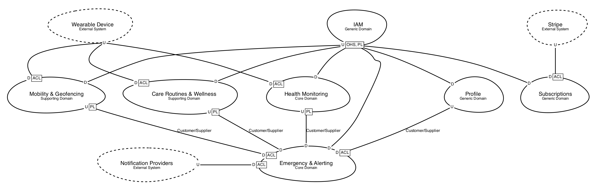

La Figura 2.38 responde qué señales disparan alertas en Emergency & Alerting.

<a id="figura-2-38"></a>**Figura 2.38.** Context Map de las señales que disparan alertas

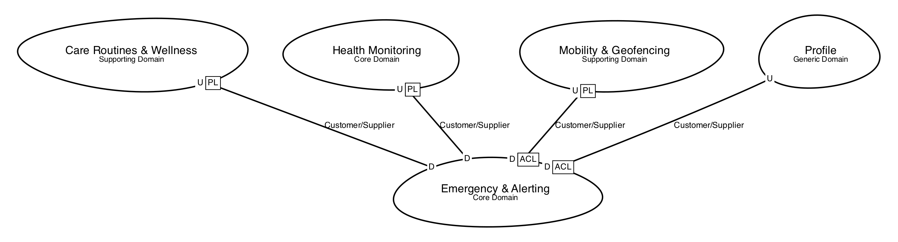

La Figura 2.39 muestra cómo se integran con Guardian+ la identidad provista por IAM y los sistemas externos.

<a id="figura-2-39"></a>**Figura 2.39.** Context Map de identidad y sistemas externos

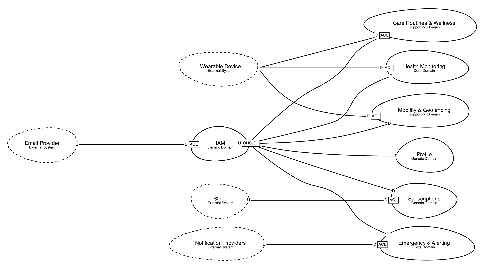

#### 2.5.2.4. Catálogo de Relaciones y Patrones de Integración Global

La Tabla 2.53 detalla cada relación del Context Map, con sus extremos, el patrón de integración aplicado y la justificación de su elección.

<a id="tabla-2-53"></a>**Tabla 2.53.** Catálogo de relaciones del Context Map

| Relación | Upstream | Downstream | Patrón | Justificación |
| :--- | :--- | :--- | :--- | :--- |
| Wearable Device → Health Monitoring | Wearable Device (sistema externo) | Health Monitoring | **ACL** | El wearable físico emite tramas crudas serializadas y optimizadas para las restricciones energéticas del microcontrolador (ESP32-S3). Aunque el canal de transporte es un bus Pub/Sub (MQTT), Health Monitoring implementa una Anti-Corruption Layer en su capa de infraestructura (`VitalSignTelemetryMqttSubscriber` y `VitalSignTelemetryMessageHandler`) que valida cada trama y la traduce a los comandos y Value Objects del dominio (`DetectVitalSignsCommand`, `VitalSignValue`), de modo que las particularidades del firmware no acoplen el modelo clínico. |
| Wearable Device → Mobility & Geofencing | Wearable Device (sistema externo) | Mobility & Geofencing | **ACL** | El wearable emite la posición como coordenadas crudas (latitud, longitud y precisión). La ACL (`WearableLocationConsumer` y `WearableLocationTransformer`) transforma cada mensaje en el Value Object `Coordinates` y en el comando `ReceiveLocationCommand`. |
| Wearable Device → Care Routines & Wellness | Wearable Device (sistema externo) | Care Routines & Wellness | **ACL** | `WearableTelemetryBrokerAdapter` recibe la telemetría de actividad, inactividad y sueño, la deserializa en registros propios del contexto y la entrega a `ActivityTelemetryConsumer` y `SleepTelemetryConsumer`, de modo que el formato del dispositivo no alcance al modelo de rutinas. |
| Health Monitoring → Emergency & Alerting | Health Monitoring (supplier) | Emergency & Alerting (customer) | **Customer/Supplier** con **PL** | Health Monitoring actúa como proveedor notificando desviaciones clínicas. Para evitar acoplamiento, expone el evento de integración `VitalSignAnomalyDetected` con el payload necesario (Care Recipient, tipo de signo vital, umbral transgredido, valor y clasificación), de modo que Emergency & Alerting opere como cliente sin conocer cómo se calcularon los umbrales basales. |
| Mobility & Geofencing → Emergency & Alerting | Mobility & Geofencing (supplier) | Emergency & Alerting (customer) | **Customer/Supplier** con **PL**; **ACL** en Emergency & Alerting | Cuando una ubicación del Fragile Citizen queda fuera de su zona segura activa, Mobility & Geofencing emite de forma asíncrona el evento `SafeZoneViolation`, que Emergency & Alerting consume para disparar una alerta de severidad alta y activar el despacho a los contactos de emergencia. Para incluir la ubicación en la notificación, Emergency & Alerting consulta la última ubicación conocida mediante su ACL `MobilityContextAcl`, sin persistirla. |
| Care Routines & Wellness → Emergency & Alerting | Care Routines & Wellness (supplier) | Emergency & Alerting (customer) | **Customer/Supplier** con **PL** | El contexto de rutinas monitorea la actividad diaria del paciente. Si se registra una inactividad prolongada no justificada en horas diurnas (US27), emite el evento `ProlongedInactivityDetected`, consumido por Emergency & Alerting para ejecutar la verificación de bienestar. Del mismo modo, `ReminderReissued` y `MedicationRestockSuggested` se consumen como alertas de severidad media dirigidas al contacto primario. |
| Profile → Emergency & Alerting | Profile (supplier) | Emergency & Alerting (customer) | **Customer/Supplier**; **ACL** en Emergency & Alerting | Emergency & Alerting requiere conocer qué integrantes del Care Circle pueden recibir alertas para el escalamiento a 60 segundos. Para no depender de Profile durante el despacho, mantiene su propia tabla `emergency_contacts` y consulta a Profile solo mediante su ACL `ProfileContextAcl`: al registrar un contacto verifica que exista una relación de cuidado activa y, al componer la notificación, obtiene el nombre del Fragile Citizen. Los eventos `CareRelationshipEstablished` y `CareRelationshipEnded` de Profile son el contrato previsto para activar o desactivar los contactos (sección 2.6.4). |
| Profile → Mobility & Geofencing | Profile | Mobility & Geofencing | **ACL** en Mobility & Geofencing | Mobility & Geofencing verifica los datos del Fragile Citizen mediante su componente Profile ACL, el adaptador anticorrupción que consume la información de identidad del contexto Profile (Figura 2.59). La columna `fragile_citizen_id` de sus tablas referencia los perfiles gobernados por Profile. |
| IAM → Emergency & Alerting, Health Monitoring, Care Routines & Wellness, Mobility & Geofencing, Profile, Subscriptions | IAM | Los seis Bounded Contexts de negocio | **OHS** con **PL** | IAM provee autenticación y autorización mediante tokens de acceso estándar (JSON Web Tokens firmados) con un Published Language documentado. Los contextos descendentes validan la firma de los tokens y extraen el `UserId` y los roles sin consultar la base de datos de identidad en cada petición. |
| Stripe → Subscriptions | Stripe (sistema externo) | Subscriptions | **ACL** | La gestión de pagos depende de las librerías oficiales del proveedor externo. Subscriptions implementa adaptadores (`PaymentWebhookController` y `PaymentProviderAdapter`) que traducen los eventos de facturación de Stripe (`invoice.paid`, `customer.subscription.deleted`) a las transiciones de estado del agregado `Subscription` (`ACTIVE`, `CANCELLED`, `EXPIRED`). |
| Notification Providers → Emergency & Alerting | Notification Providers (sistema externo) | Emergency & Alerting | **ACL** | Emergency & Alerting despacha las notificaciones mediante adaptadores por canal (`PushNotificationProviderAdapter` y `SmsProviderAdapter`) y recibe el resultado de cada entrega en `NotificationDeliveryWebhookController`, de modo que los formatos de los proveedores de push y SMS no alcancen al modelo de alertas. |
| Email Provider → IAM | Email Provider (sistema externo) | IAM | **ACL** | IAM envía los correos de verificación de cuenta, los códigos OTP y los enlaces de recuperación de contraseña mediante `EmailProviderAdapter`, ubicado en el paquete `infrastructure/notifications/adapters` (Figura 2.62), de modo que el proveedor de correo no alcance al modelo de identidad. |

### 2.5.3. Software Architecture

En esta sección se presenta la arquitectura de software de Guardian+ con el C4 Model en sus vistas de contexto, contenedores, componentes y despliegue.

#### 2.5.3.1. Software Architecture Context Level Diagrams

En esta sección se presenta la vista de contexto de Guardian+ aplicando el C4 Model, elaborada con Structurizr. Este diagrama posiciona a Guardian+ como un único sistema de software en el centro, y muestra alrededor a los actores que lo utilizan y a los sistemas externos con los que se integra, sin entrar todavía en detalles internos de implementación.

Guardian+ es utilizado por tres tipos de actores: el Familiar, quien supervisa remotamente el bienestar de la persona bajo cuidado sin estar presente de forma permanente; el Cuidador, encargado del cuidado frecuente o permanente de dicha persona, ya sea de forma particular o institucional; y la Persona bajo cuidado (adulto mayor, persona con discapacidad o en situación de dependencia), quien interactúa con el sistema físicamente a través de la pulsera IoT.

El sistema se integra con cuatro servicios externos, cada uno resolviendo una necesidad específica que Guardian+ no implementa por sí mismo: Stripe, para el procesamiento de pagos y suscripciones; un servicio de notificaciones push/SMS, para el despacho de alertas y recordatorios; un servicio de videollamada, que habilita la comunicación directa en tiempo real entre familiar/cuidador y la persona bajo cuidado; y Google Maps, utilizado tanto para la geocodificación y el cálculo de geocercas en el backend como para la visualización del mapa y la ubicación en tiempo real dentro de la aplicación móvil. La Figura 2.40 presenta el diagrama de contexto.

<a id="figura-2-40"></a>**Figura 2.40.** Diagrama de contexto de Guardian+

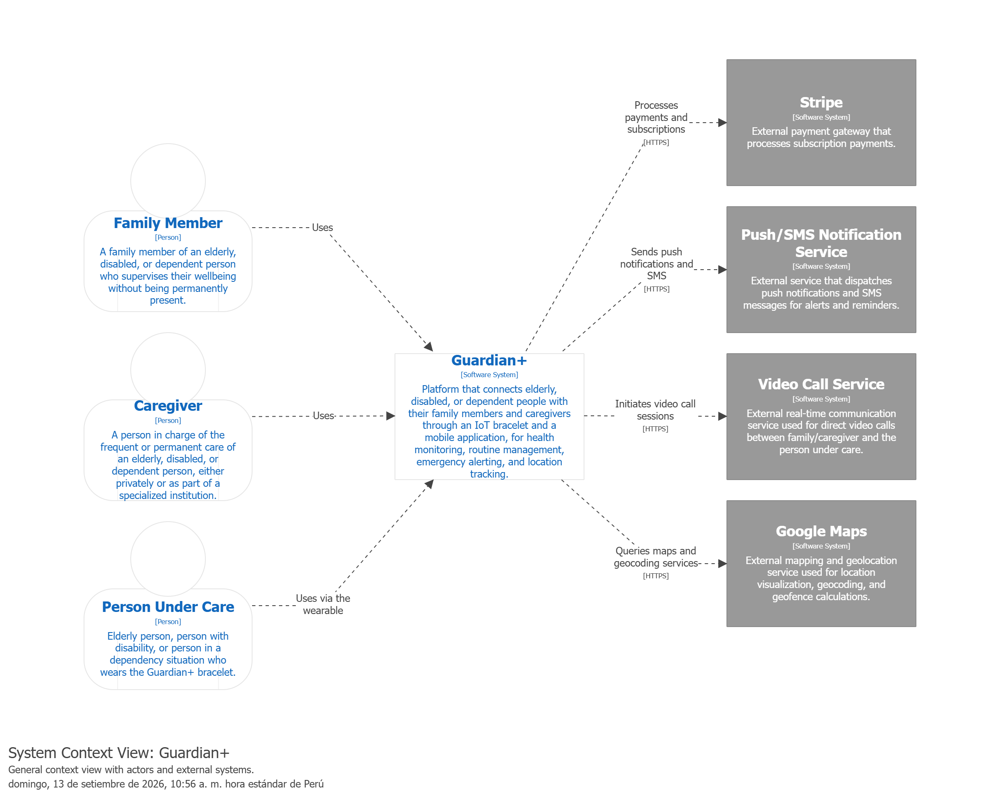

#### 2.5.3.2. Software Architecture Container Level Diagrams

Esta sección descompone a Guardian+ en sus contenedores de alto nivel — las unidades desplegables independientes que conforman la solución — y muestra cómo se distribuyen las responsabilidades entre ellos, las decisiones tecnológicas adoptadas y los protocolos de comunicación entre contenedores.

La plataforma está compuesta por cinco contenedores. La Guardian+ Landing Page (React, HTML, CSS, JavaScript) es el sitio público de marketing donde familiares y cuidadores conocen la propuesta de valor, los planes de suscripción y los canales de contacto de Guardian+; funciona como página informativa independiente, sin comunicación directa con el backend. La Guardian+ Mobile Application (Android nativo, Kotlin) es la interfaz que usan diariamente familiares y cuidadores para todo el monitoreo, gestión de rutinas, alertas y localización — es el único cliente que consume la API. El Guardian+ Wearable Firmware (embebido en C/C++ sobre ESP32-S3) es el software que corre dentro de la pulsera IoT, responsable de capturar signos vitales, detectar caídas, obtener ubicación GPS y permitir la activación del botón SOS. La pulsera IoT se proporciona al suscriptor como parte de la afiliación a Guardian+, de modo que la plataforma opera sobre un dispositivo de características conocidas y el usuario aprovecha la totalidad de las funciones de la aplicación. Las capacidades de telemetría, detección de caídas, geolocalización, avisos hápticos y botón SOS están presentes en todos los modelos contemplados; en cambio, la comunicación bidireccional depende del modelo entregado: los modelos con cámara y pantalla admiten videollamada, los modelos con audio bidireccional se limitan a la llamada de voz y los modelos básicos no ofrecen este canal, caso en el que la aplicación recurre a la marcación telefónica convencional (US23).

Ambos clientes activos (Mobile Application y Wearable Firmware) se comunican con la Guardian+ REST API (Java y Spring Boot), que centraliza toda la lógica de negocio del sistema y persiste su información en la Guardian+ Database (PostgreSQL Server) vía JDBC. La comunicación del wearable con el backend utiliza MQTT sobre HTTPS — un protocolo liviano, adecuado para telemetría IoT de bajo consumo — mientras que la aplicación móvil consume la API mediante peticiones RESTful en JSON sobre HTTPS. Adicionalmente, el backend se comunica directamente con Stripe, el servicio de notificaciones y Google Maps para resolver pagos, alertas y geolocalización respectivamente, mientras que la videollamada se establece directamente entre la aplicación móvil y el servicio externo correspondiente, una vez que el backend orquesta el inicio de la sesión. La Figura 2.41 presenta el diagrama de contenedores.


<a id="figura-2-41"></a>**Figura 2.41.** Diagrama de contenedores de Guardian+

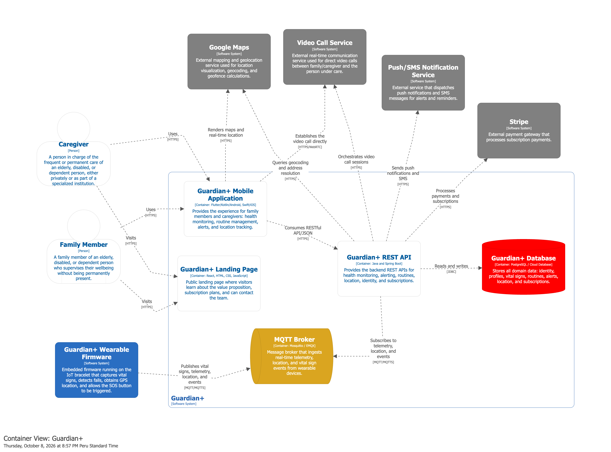

#### 2.5.3.3. Software Architecture Components Level Diagrams

Esta sección presenta la vista de componentes de la Guardian+ REST API, ilustrando los módulos funcionales internos del backend y cómo interactúan entre sí para resolver las distintas capacidades del sistema, con la API como elemento centralizado y sus componentes circundantes.

El backend se organiza en siete componentes, correspondientes uno a uno con los Bounded Contexts definidos en el diseño estratégico de Domain-Driven Design del equipo: Emergency & Alerting y Health Monitoring como Core Domains, encargados respectivamente de la detección/escalamiento de emergencias y del monitoreo de signos vitales — los diferenciadores centrales de la propuesta de valor de Guardian+; Care Routines & Wellness y Mobility & Geofencing como Supporting Domains, que dan soporte a la gestión de rutinas de bienestar y a la localización/geocercas; y IAM, Profile y Subscriptions como Generic Domains, que resuelven capacidades transversales reutilizables (identidad y autorización, gestión de perfiles, y planes de suscripción).

Todos los componentes de negocio dependen de IAM para validar identidad y autorización mediante una capa anticorrupción (ACL), asegurando que cada comando solo pueda ser ejecutado por el actor correspondiente (por ejemplo, solo el Cuidador puede cancelar un recordatorio, o solo la persona bajo cuidado puede confirmarlo). Asimismo, Emergency & Alerting escucha eventos de integración emitidos por Health Monitoring, Care Routines & Wellness y Mobility & Geofencing — anomalías en signos vitales, inactividad prolongada y salida de zona segura respectivamente — reaccionando automáticamente para generar y escalar alertas; esta relación es la traducción directa de las políticas ya definidas en el Event Storming del equipo. Finalmente, Emergency & Alerting es también responsable de despachar las notificaciones push/SMS y de orquestar las sesiones de videollamada hacia los servicios externos correspondientes, mientras que Subscriptions se comunica con Stripe para el procesamiento de pagos. La Figura 2.42 presenta el diagrama de componentes.

<a id="figura-2-42"></a>**Figura 2.42.** Diagrama de componentes de la Guardian+ REST API

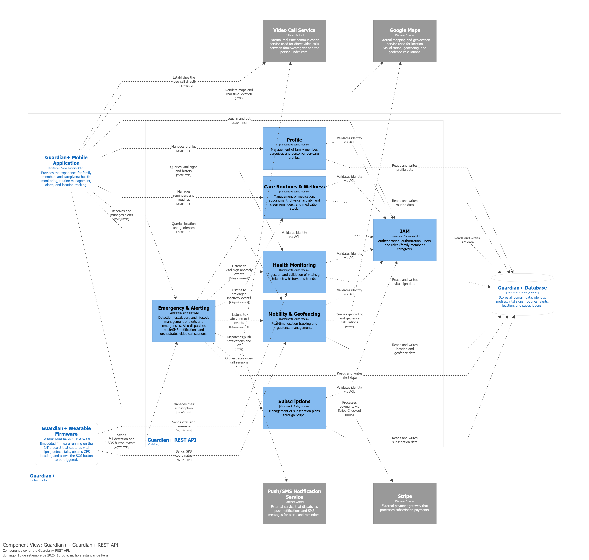

#### 2.5.3.4. Software Architecture Deployment Diagrams

En esta sección se presenta la vista de despliegue de Guardian+ aplicando el C4 Model, elaborada con Structurizr. El diagrama muestra la distribución física de la solución en el entorno de producción: los nodos de infraestructura y plataformas en la nube que alojan cada contenedor, los dispositivos sobre los que se ejecutan los clientes y los servicios externos con los que se integra el backend.

La Guardian+ Landing Page se publica en Cloudflare Pages, que la distribuye a través de la red global de entrega de contenido de Cloudflare. La Guardian+ REST API se ejecuta como un contenedor Docker con JRE 26 dentro de una máquina virtual de Microsoft Azure con Ubuntu 24.04, detrás del proxy inverso Caddy, que la publica por HTTPS, y persiste su información en la Guardian+ Database, alojada en el servicio gestionado Azure Database for PostgreSQL. Ambos servicios se ubican en la región Chile Central para reducir la latencia entre el backend y la base de datos.

La Guardian+ Mobile Application se ejecuta en los smartphones Android de familiares y cuidadores, desde Android 7.0 (API 24), y sus versiones de prueba se distribuyen mediante Firebase App Distribution. El Guardian+ Wearable Firmware se ejecuta en la pulsera basada en ESP32-S3; durante el desarrollo, este nodo es reemplazado por el IoT Simulator, que genera la telemetría y los eventos del dispositivo y los envía directamente a la REST API. Finalmente, el backend se integra con los servicios externos de notificaciones (Firebase), pagos (Stripe en modo de prueba), mapas y geolocalización (Google Maps Platform) y videollamadas. La Figura 2.43 presenta el diagrama de despliegue.

<a id="figura-2-43"></a>**Figura 2.43.** Diagrama de despliegue de Guardian+

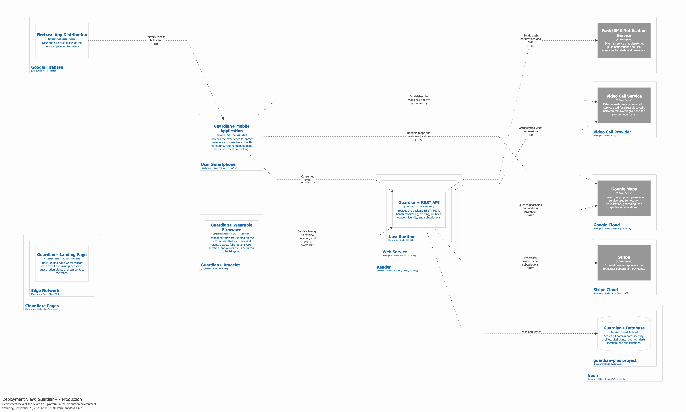

## 2.6. Tactical-Level Domain-Driven Design

En esta sección se detalla el diseño táctico de cada Bounded Context de Guardian+. Para cada uno se describen sus capas Domain, Interface, Application e Infrastructure y se presentan sus diagramas de componentes, de clases y de base de datos. Al final se incluye el esquema físico consolidado de la base de datos.

### 2.6.1. Bounded Context: Emergency & Alerting

El Bounded Context **Emergency & Alerting** pertenece al Core Domain de Guardian+ y es el contexto central de la solución. Su responsabilidad consiste en disparar las alertas ante señales que comprometen la seguridad de un Fragile Citizen (caídas, activaciones de SOS, anomalías biométricas, violaciones de zona segura, inactividad prolongada y avisos de rutina), despacharlas hacia sus contactos de emergencia según la severidad, gobernar el escalamiento hasta obtener un reconocimiento efectivo y registrar la atención del incidente hasta su cierre.

A diferencia de los contextos que producen señales (Health Monitoring, Mobility & Geofencing y Care Routines & Wellness), este contexto no observa telemetría: consume eventos de integración ya interpretados y concentra las reglas de reacción, temporización y escalamiento que traducen una señal en una respuesta humana oportuna. El Fragile Citizen se referencia mediante `CareRecipientProfileId` y los integrantes del Care Circle mediante `UserId`, ambos gobernados por otros contextos.

La arquitectura táctica se implementa sobre Java y Spring Boot con una estructura de paquetes dividida en cuatro capas: domain, interfaces, application e infrastructure. Su código se organiza en el paquete `com.healthify.guardian.platform.emergencyalerting` del repositorio `guardian-plus-platform`, con la siguiente estructura:

```
com.healthify.guardian.platform.emergencyalerting/
├── domain/
│   ├── model/
│   │   ├── aggregates/
│   │   ├── commands/
│   │   ├── entities/
│   │   ├── events/
│   │   ├── queries/
│   │   └── valueobjects/
│   ├── repositories/
│   └── services/
├── interfaces/
│   ├── acl/
│   ├── events/
│   └── rest/
│       ├── resources/
│       └── transform/
├── application/
│   ├── acl/
│   ├── commandservices/
│   ├── internal/
│   │   ├── commandservices/
│   │   ├── eventhandlers/
│   │   ├── outboundservices/
│   │   └── queryservices/
│   ├── outboundservices/
│   └── queryservices/
└── infrastructure/
    ├── acl/
    ├── configuration/
    ├── notifications/
    │   └── adapters/
    ├── persistence/
    │   └── jpa/
    │       ├── adapters/
    │       ├── assemblers/
    │       ├── converters/
    │       ├── embeddables/
    │       ├── entities/
    │       └── repositories/
    └── scheduling/
```

#### 2.6.1.1. Domain Layer

Encapsula las reglas de reacción ante emergencias, las invariantes del ciclo de vida de alertas e incidentes y las políticas de despacho y escalamiento. La decisión de modelado central del contexto es la separación entre `Alert` e `Incident`: `Alert` es el agregado raíz que nace de una señal, se entrega a los contactos de emergencia (`AlertDelivery`) y recoge sus respuestas (`AlertResponse`); `Incident` solo existe cuando un integrante del Care Circle reconoce la alerta y asume la atención, registrando su estabilización y cierre. Por ello, una alerta origina como máximo un incidente, mientras que las alertas descartadas como falso positivo nunca llegan a generar uno.

El escalamiento no se modela como un agregado independiente: se expresa mediante el nivel de destinatario (`RecipientLevel`) de cada entrega, el orden de prioridad de los `EmergencyContact` y el tiempo de espera configurado en `AlertSettings`. Toda operación sujeta a tiempo recibe el instante actual como parámetro (`Instant`) en lugar de leer el reloj, de modo que las ventanas de 20 s y 60 s se verifican de forma determinista.

##### Aggregates

*   **Alert**
    *   Agregado raíz que representa la alerta disparada por una señal de riesgo sobre un Fragile Citizen, junto con sus entregas a los contactos de emergencia y las respuestas del Care Circle.
    *   Hereda de `AbstractDomainAggregateRoot<Alert>` para registrar y publicar eventos de dominio.
    *   Gobierna de forma autónoma su ciclo de vida (`PENDING_CONFIRMATION → TRIGGERED → ESCALATED → ACKNOWLEDGED → RESOLVED`, con `DISMISSED` como salida de un falso positivo), rechazando transiciones inválidas sin depender de servicios externos. La severidad se deriva del tipo de origen (`AlertSourceType.defaultSeverity()`), nunca del emisor de la señal.
    *   *Atributos:*
        *   `id: AlertId`
        *   `careRecipientProfileId: CareRecipientProfileId`
        *   `source: AlertSource`
        *   `severity: Severity`
        *   `status: AlertStatus`
        *   `deliveries: List<AlertDelivery>`
        *   `responses: List<AlertResponse>`
        *   `triggeredAt: Instant`
        *   `confirmedAt: Instant`: inicio de la medición de la latencia de despacho (US08).
        *   `lastDispatchedAt: Instant`: base del cálculo del `AckTimeout` de cada nivel.
        *   `acknowledgedAt: Instant`
        *   `acknowledgedByUserId: UserId`
        *   `resolvedAt: Instant`
        *   `version: Long`: marca de bloqueo optimista restaurada desde persistencia.
    *   *Métodos:*
        *   `Alert(TriggerAlertCommand command)`
        *   `confirm(Instant confirmedAt): void`
        *   `dismissAsFalsePositive(Instant now): void`
        *   `dispatch(RecipientLevel level, List<DeliveryTarget> targets, Instant now): List<AlertDelivery>`
        *   `escalate(List<DeliveryTarget> targets, Instant now): List<AlertDelivery>`
        *   `broadcast(List<DeliveryTarget> targets, Instant now): List<AlertDelivery>`
        *   `registerDeliveryResult(AlertDeliveryId deliveryId, DeliveryStatus status, Instant occurredAt): void`: ignora callbacks repetidos o tardíos del proveedor.
        *   `acknowledge(UserId userId, Instant now): void`: solo un destinatario notificado puede reconocer.
        *   `claimResponse(UserId responderUserId, Instant now): AlertResponse`: solo una respuesta en curso a la vez; si la alerta no estaba reconocida, también la reconoce para detener el escalamiento.
        *   `completeResponse(AlertResponseId responseId, String notes, Instant now): void`
        *   `resolve(Instant now): void`
        *   `currentRecipientLevel(): RecipientLevel`
        *   `isAwaitingAcknowledgement(): boolean`
        *   `isAckTimeoutExpired(AckTimeout ackTimeout, Instant now): boolean`
        *   `isConfirmationWindowExpired(Instant now): boolean`

*   **Incident**
    *   Agregado raíz que representa la atención humana de una alerta reconocida. Referencia a su alerta por identidad (`AlertId`), con una relación de uno a cero o uno.
    *   Ciclo de vida: `IN_ATTENTION → STABILIZED → CLOSED`. Puede cerrarse directamente desde `IN_ATTENTION` cuando no hubo nada que estabilizar; las notas de cada etapa se acumulan.
    *   *Atributos:*
        *   `id: IncidentId`
        *   `alertId: AlertId`
        *   `status: IncidentStatus`
        *   `markedInAttentionAt: Instant`
        *   `stabilizedAt: Instant`
        *   `closedAt: Instant`
        *   `notes: String`
    *   *Métodos:*
        *   `Incident(OpenIncidentCommand command)`
        *   `stabilize(String notes, Instant now): void`
        *   `close(String notes, Instant now): void`
        *   `isClosed(): boolean`

*   **AlertSettings**
    *   Agregado raíz que concentra la configuración de alertamiento por Fragile Citizen: tiempo de espera del reconocimiento, habilitación del escalamiento, difusión inmediata de alertas críticas y modo silencioso. Existe como máximo una configuración por `CareRecipientProfileId`; mientras no se modifique, se aplican los valores por defecto sin persistirlos.
    *   *Atributos:*
        *   `id: AlertSettingsId`
        *   `careRecipientProfileId: CareRecipientProfileId`
        *   `primaryAckTimeout: AckTimeout`
        *   `escalationEnabled: boolean`
        *   `silentModeEnabled: boolean`
        *   `broadcastCriticalImmediately: boolean`
    *   *Métodos:*
        *   `AlertSettings(CareRecipientProfileId careRecipientProfileId)`: crea la configuración con valores por defecto (60 s, escalamiento habilitado, alertas críticas escalan como las demás, modo silencioso desactivado).
        *   `update(AckTimeout primaryAckTimeout, Boolean escalationEnabled, Boolean broadcastCriticalImmediately): void`
        *   `activateSilentMode(): void`
        *   `deactivateSilentMode(): void`
        *   `allowsAudibleNotificationFor(Severity severity): boolean`

*   **EmergencyContact**
    *   Agregado raíz que registra a un integrante del Care Circle como contacto de auxilio de un Fragile Citizen, con su prioridad dentro del escalamiento. Conserva una copia local de los datos del contacto (Event-Carried State Transfer desde Profile) para que un Profile lento o no disponible nunca bloquee un despacho. El contacto activo con `priorityOrder = 1` es el contacto primario.
    *   *Atributos:*
        *   `id: EmergencyContactId`
        *   `careRecipientProfileId: CareRecipientProfileId`
        *   `userId: UserId`
        *   `displayName: String`
        *   `relationship: String`
        *   `phoneNumber: PhoneNumber`
        *   `priorityOrder: PriorityOrder`
        *   `active: boolean`
    *   *Métodos:*
        *   `EmergencyContact(AddEmergencyContactCommand command)`
        *   `updateContactDetails(String displayName, String relationship, PhoneNumber phoneNumber): void`
        *   `changePriority(PriorityOrder priorityOrder): void`
        *   `activate(): void`
        *   `deactivate(): void`
        *   `isPrimary(): boolean`

*   **AlertChannelSetting**
    *   Agregado raíz que registra si un canal de notificación está habilitado para un integrante del Care Circle y, para `PUSH`, el token del dispositivo. Existe un registro por combinación de `UserId` y `NotificationChannel`.
    *   *Atributos:*
        *   `id: AlertChannelSettingId`
        *   `userId: UserId`
        *   `channel: NotificationChannel`
        *   `enabled: boolean`
        *   `deviceToken: String`
    *   *Métodos:*
        *   `AlertChannelSetting(ConfigureAlertChannelCommand command)`
        *   `enable(): void`
        *   `disable(): void`
        *   `registerDeviceToken(String deviceToken): void`

##### Entities

*   **AlertDelivery**
    *   Entidad interna de `Alert` que representa la entrega de la alerta a un destinatario concreto, por un canal y en un nivel de escalamiento determinado.
    *   *Atributos:*
        *   `id: AlertDeliveryId`
        *   `recipientUserId: UserId`
        *   `recipientLevel: RecipientLevel`
        *   `channel: NotificationChannel`
        *   `deliveryStatus: DeliveryStatus`
        *   `sentAt: Instant`
        *   `deliveredAt: Instant`
    *   *Métodos:* `markAsSent(Instant sentAt)`, `markAsDelivered(Instant deliveredAt)`, `markAsFailed()`.
*   **AlertResponse**
    *   Entidad interna de `Alert` que registra que un integrante del Care Circle asumió la respuesta a la alerta y el resultado de su intervención.
    *   *Atributos:*
        *   `id: AlertResponseId`
        *   `responderUserId: UserId`
        *   `responseStatus: ResponseStatus`
        *   `claimedAt: Instant`
        *   `completedAt: Instant`
        *   `notes: String`
    *   *Métodos:* `complete(String notes, Instant completedAt)`, `cancel()`, `isActive()`.

##### Value Objects

*   **AlertSource:** Origen de la alerta (`sourceType: AlertSourceType`, `sourceReferenceId: UUID`). `sourceReferenceId` identifica el registro del contexto proveedor que originó la señal (lectura biométrica, zona segura, monitor de actividad, recordatorio, stock de medicación o dispositivo wearable). Método: `requiresConfirmationWindow()`, verdadero únicamente para `FALL_DETECTED`.
*   **AlertSourceType:** Enum (`FALL_DETECTED`, `SOS_TRIGGERED`, `VITAL_SIGN_ANOMALY`, `SAFE_ZONE_VIOLATION`, `PROLONGED_INACTIVITY`, `REMINDER_REISSUED`, `MEDICATION_RESTOCK_SUGGESTED`). Métodos: `defaultSeverity()` (caída y SOS: `CRITICAL`; anomalía biométrica, zona segura e inactividad: `HIGH`; recordatorio y reabastecimiento: `MEDIUM`) e `isWearableReported()`.
*   **Severity:** Enum (`CRITICAL`, `HIGH`, `MEDIUM`) que gobierna la estrategia de despacho. Métodos: `allowsImmediateBroadcast()`, `allowsEscalation()`, `overridesSilentMode()` y `requiresSmsBackup()`.
*   **AlertStatus:** Enum (`PENDING_CONFIRMATION`, `TRIGGERED`, `ESCALATED`, `ACKNOWLEDGED`, `DISMISSED`, `RESOLVED`). Métodos: `canTransitionTo(AlertStatus target)`, `isTerminal()` e `isAwaitingAcknowledgement()`.
*   **IncidentStatus:** Enum (`IN_ATTENTION`, `STABILIZED`, `CLOSED`).
*   **RecipientLevel:** Enum (`PRIMARY`, `SECONDARY`, `BROADCAST`) que indica en qué nivel del escalamiento se entregó la alerta. Método: `next()`.
*   **NotificationChannel:** Enum (`PUSH`, `SMS`, `IN_APP`).
*   **DeliveryStatus:** Enum (`PENDING`, `SENT`, `DELIVERED`, `FAILED`). Método: `isFinal()`.
*   **ResponseStatus:** Enum (`CLAIMED`, `COMPLETED`, `CANCELLED`).
*   **EmergencyContactChange:** Enum (`ADDED`, `DETAILS_UPDATED`, `REPRIORITIZED`, `ACTIVATED`, `DEACTIVATED`) transportado por `EmergencyContactsChangedEvent`.
*   **AckTimeout:** Encapsula el tiempo de espera del reconocimiento antes de escalar (`seconds: Integer`). Invariante: valor entre $15$ y $300\text{ s}$; valor por defecto $60\text{ s}$. Método: `hasExpired(Instant since, Instant now)`.
*   **FallConfirmationWindow:** Ventana de cancelación local del Fragile Citizen ante una caída detectada. Valor fijo de política de $20\text{ s}$, no persistido. Métodos: `hasExpired(Instant triggeredAt, Instant now)` y `expiredIfTriggeredBefore(Instant now)`.
*   **PriorityOrder:** Posición del contacto dentro del escalamiento (`value: Integer`). Invariante: valor mayor o igual a 1. Método: `isPrimary()`.
*   **PhoneNumber:** Teléfono del contacto para el canal `SMS` (`value: String`). Invariante: formato internacional E.164 (p. ej. `+51987654321`).
*   **DeliveryTarget:** Destinatario y canal resueltos por `EscalationPolicy` (`recipientUserId: UserId`, `channel: NotificationChannel`).
*   **DateRange:** Periodo opcional para filtrar el historial (`from`, `to`). Invariante: `from` no posterior a `to`.
*   **AlertId / AlertDeliveryId / AlertResponseId / IncidentId / AlertSettingsId / EmergencyContactId / AlertChannelSettingId:** Identificadores inmutables tipo UUID, generados por el propio agregado o entidad.
*   **CareRecipientProfileId:** Identificador de referencia inmutable al Fragile Citizen, gobernado por el Bounded Context Profile.
*   **UserId:** Identificador de referencia inmutable a un integrante del Care Circle, gobernado por el Bounded Context IAM.

##### Domain Services

*   **DispatchStrategyPolicy:** Determina el nivel inicial de despacho de una alerta confirmada a partir de su `Severity` y de `AlertSettings`. Por defecto toda alerta comienza en el contacto primario (`PRIMARY`) y escala por niveles, que es el comportamiento comprometido en US08 y US11. `CRITICAL` difunde de inmediato a todos los contactos activos (`BROADCAST`, US25) cuando la configuración del Fragile Citizen lo solicita (`broadcastCriticalImmediately`). `CRITICAL` y `HIGH` también difunden de inmediato si el escalamiento está deshabilitado. `MEDIUM` notifica únicamente al contacto primario. Método: `resolveInitialLevel(Severity severity, AlertSettings settings): RecipientLevel`.
*   **EscalationPolicy:** Resuelve los destinatarios de cada nivel a partir de los `EmergencyContact` activos ordenados por prioridad (`PRIMARY`: primer contacto activo; `SECONDARY`: los siguientes; `BROADCAST`: todos), de modo que los huecos dejados por contactos desactivados no afectan. Los canales salen de `AlertChannelSetting`, con `IN_APP` como respaldo si el contacto no tiene ninguno habilitado, y se añade `SMS` en severidad `CRITICAL` y en el nivel `BROADCAST`. También decide el siguiente nivel cuando vence el `AckTimeout`: `PRIMARY → SECONDARY` (o `BROADCAST` si no hay contactos secundarios o el escalamiento está deshabilitado) y `SECONDARY → BROADCAST`; las alertas `MEDIUM` nunca escalan. Métodos: `resolveRecipients(RecipientLevel level, Severity severity, List<EmergencyContact> contacts, List<AlertChannelSetting> channelSettings): List<DeliveryTarget>` y `resolveNextLevel(Alert alert, AlertSettings settings, List<EmergencyContact> activeContacts): Optional<RecipientLevel>`.

##### Commands & Queries (Domain Model)

*   `TriggerAlertCommand(UUID careRecipientProfileId, AlertSourceType sourceType, UUID sourceReferenceId, Instant triggeredAt)`
*   `ConfirmAlertCommand(UUID alertId)`
*   `DismissAlertCommand(UUID alertId)`
*   `DispatchAlertCommand(UUID alertId)`
*   `EscalateAlertCommand(UUID alertId)`
*   `BroadcastAlertCommand(UUID alertId)`
*   `RegisterDeliveryResultCommand(UUID alertId, UUID deliveryId, DeliveryStatus deliveryStatus, Instant occurredAt)`
*   `AcknowledgeAlertCommand(UUID alertId, UUID userId)`
*   `ClaimAlertResponseCommand(UUID alertId, UUID responderUserId)`
*   `CompleteAlertResponseCommand(UUID alertId, UUID responseId, String notes)`
*   `ResolveAlertCommand(UUID alertId)`
*   `OpenIncidentCommand(UUID alertId, Instant markedInAttentionAt)`
*   `StabilizeIncidentCommand(UUID incidentId, String notes)`
*   `CloseIncidentCommand(UUID incidentId, String notes)`
*   `UpdateAlertSettingsCommand(UUID careRecipientProfileId, Integer primaryAckTimeoutSec, Boolean escalationEnabled, Boolean broadcastCriticalImmediately)`
*   `ActivateSilentModeCommand(UUID careRecipientProfileId)`
*   `DeactivateSilentModeCommand(UUID careRecipientProfileId)`
*   `AddEmergencyContactCommand(UUID careRecipientProfileId, UUID userId, String displayName, String relationship, String phoneNumber, Integer priorityOrder)`
*   `ReorderEmergencyContactsCommand(UUID careRecipientProfileId, List<UUID> orderedEmergencyContactIds)`
*   `DeactivateEmergencyContactCommand(UUID emergencyContactId)`
*   `ConfigureAlertChannelCommand(UUID userId, NotificationChannel channel, Boolean enabled, String deviceToken)`
*   `GetAlertByIdQuery(AlertId alertId)`
*   `GetActiveAlertsByCareRecipientProfileIdQuery(CareRecipientProfileId careRecipientProfileId)`
*   `GetAlertHistoryByCareRecipientProfileIdQuery(CareRecipientProfileId careRecipientProfileId, DateRange dateRange, Severity severityFilter, int page, int size)`
*   `GetPendingAlertsByRecipientUserIdQuery(UserId recipientUserId)`
*   `GetIncidentByIdQuery(IncidentId incidentId)`
*   `GetIncidentByAlertIdQuery(AlertId alertId)`
*   `GetAlertSettingsByCareRecipientProfileIdQuery(CareRecipientProfileId careRecipientProfileId)`
*   `GetEmergencyContactsByCareRecipientProfileIdQuery(CareRecipientProfileId careRecipientProfileId)`
*   `GetAlertChannelSettingsByUserIdQuery(UserId userId)`

##### Domain Events

*   `AlertTriggeredEvent`: Emitido al disparar una alerta, portando su origen, severidad y estado inicial.
*   `AlertConfirmedEvent`: Emitido cuando vence la `FallConfirmationWindow` sin cancelación del Fragile Citizen, o de inmediato cuando el origen no requiere confirmación.
*   `AlertDismissedEvent`: Emitido cuando el Fragile Citizen cancela dentro de la ventana, clasificando la alerta como falso positivo.
*   `AlertDispatchedEvent`: Emitido al generar las entregas de un nivel (`PRIMARY`, `SECONDARY` o `BROADCAST`), con los identificadores de las entregas a enviar.
*   `AlertEscalatedEvent`: Emitido al avanzar al nivel `SECONDARY` por vencimiento del `AckTimeout`.
*   `AlertBroadcastedEvent`: Emitido al difundir la alerta a todos los contactos activos, ya sea de inmediato o como último recurso.
*   `AlertDeliveryFailedEvent`: Emitido cuando el proveedor informa que una entrega no pudo completarse.
*   `AlertAcknowledgedEvent`: Emitido cuando un destinatario reconoce la alerta, deteniendo el escalamiento.
*   `AlertResponseClaimedEvent`: Emitido cuando un destinatario declara que asumirá la respuesta, habilitando la notificación al resto del Care Circle.
*   `AlertResponseCompletedEvent`: Emitido cuando el responsable registra el resultado de su intervención.
*   `AlertResolvedEvent`: Emitido al cerrar definitivamente la alerta tras el cierre de su incidente.
*   `IncidentOpenedEvent`: Emitido al registrar la atención de una alerta reconocida (`IN_ATTENTION`).
*   `IncidentStabilizedEvent`: Emitido cuando el responsable declara estabilizada la situación del Fragile Citizen.
*   `IncidentClosedEvent`: Emitido al cierre definitivo del incidente.
*   `AlertSettingsUpdatedEvent`: Emitido ante cualquier modificación del tiempo de espera, del escalamiento, de la difusión crítica o del modo silencioso.
*   `EmergencyContactsChangedEvent`: Emitido al añadir, actualizar, reordenar, activar o desactivar un contacto de emergencia, indicando el tipo de cambio (`EmergencyContactChange`).
*   `AlertChannelSettingChangedEvent`: Emitido al habilitar o deshabilitar un canal de notificación.

##### Repositories (Domain Interfaces)

*   **AlertRepository:**
    *   `save(Alert alert): Alert`
    *   `findById(AlertId id): Optional<Alert>`
    *   `findActiveBySource(CareRecipientProfileId careRecipientProfileId, AlertSource source): Optional<Alert>`: evita disparar dos veces la misma señal reintentada.
    *   `findActiveByCareRecipientProfileId(CareRecipientProfileId careRecipientProfileId): List<Alert>`
    *   `findHistory(CareRecipientProfileId careRecipientProfileId, DateRange period, Severity severity, Pageable pageable): Page<Alert>`
    *   `findPendingByRecipientUserId(UserId recipientUserId): List<Alert>`
    *   `findPendingConfirmationTriggeredBefore(Instant threshold): List<Alert>`
    *   `findAwaitingAcknowledgement(): List<Alert>`
*   **IncidentRepository:**
    *   `save(Incident incident): Incident`
    *   `findById(IncidentId id): Optional<Incident>`
    *   `findByAlertId(AlertId alertId): Optional<Incident>`
    *   `existsByAlertId(AlertId alertId): boolean`
*   **AlertSettingsRepository:**
    *   `save(AlertSettings settings): AlertSettings`
    *   `findByCareRecipientProfileId(CareRecipientProfileId careRecipientProfileId): Optional<AlertSettings>`
*   **EmergencyContactRepository:**
    *   `save(EmergencyContact contact): EmergencyContact`
    *   `saveAll(List<EmergencyContact> contacts): List<EmergencyContact>`
    *   `findById(EmergencyContactId id): Optional<EmergencyContact>`
    *   `findActiveByCareRecipientProfileIdOrderByPriority(CareRecipientProfileId careRecipientProfileId): List<EmergencyContact>`
    *   `findByCareRecipientProfileIdAndUserId(CareRecipientProfileId careRecipientProfileId, UserId userId): Optional<EmergencyContact>`
*   **AlertChannelSettingRepository:**
    *   `save(AlertChannelSetting setting): AlertChannelSetting`
    *   `findByUserId(UserId userId): List<AlertChannelSetting>`
    *   `findByUserIdIn(Collection<UserId> userIds): List<AlertChannelSetting>`
    *   `findByUserIdAndChannel(UserId userId, NotificationChannel channel): Optional<AlertChannelSetting>`

#### 2.6.1.2. Interface Layer

Traduce estímulos externos hacia comandos y consultas de aplicación, expone contratos HTTP RESTful para la app móvil y canaliza los eventos de integración provenientes de los contextos proveedores de señales. Los errores se devuelven con el formato común de la plataforma: `400` (validación), `404`, `409` (conflicto) y `422` (regla de negocio).

##### REST Controllers

*   **AlertsController** (`/api/v1/alerts`):
    *   `POST /`: Dispara una alerta reportada por el gateway del dispositivo wearable. Fuera del perfil de desarrollo solo acepta `FALL_DETECTED` y `SOS_TRIGGERED`; la hora de disparo la asigna el servidor y reintentar la misma señal devuelve la alerta activa existente.
    *   `GET /`: Historial paginado y filtrable por `careRecipientProfileId`, `severity`, `from`, `to`, `page` y `size`.
    *   `GET /active/care-recipient/{careRecipientProfileId}`: Lista las alertas activas de un Fragile Citizen.
    *   `GET /pending/recipient/{userId}`: Lista las alertas pendientes de reconocimiento de un destinatario; la app móvil la consulta para mostrar las alertas del canal `IN_APP`.
    *   `GET /{alertId}`: Recupera el detalle de una alerta con sus entregas (en orden de despacho) y respuestas.
    *   `POST /{alertId}/dismiss`: Cancela la alerta dentro de la ventana de confirmación (falso positivo).
    *   `POST /{alertId}/acknowledge`: Registra el reconocimiento de la alerta por parte del destinatario.
    *   `POST /{alertId}/responses`: Declara que el destinatario asumirá la respuesta.
    *   `POST /{alertId}/responses/{responseId}/complete`: Registra el resultado de la intervención.
*   **IncidentsController** (`/api/v1/incidents`):
    *   `GET /{incidentId}`: Recupera el detalle de un incidente.
    *   `GET /alert/{alertId}`: Recupera el incidente asociado a una alerta.
    *   `POST /{incidentId}/stabilize`: Declara estabilizada la situación.
    *   `POST /{incidentId}/close`: Cierra definitivamente el incidente.
*   **AlertSettingsController** (`/api/v1/alert-settings`):
    *   `GET /care-recipient/{careRecipientProfileId}`: Recupera la configuración vigente, o los valores por defecto.
    *   `PUT /care-recipient/{careRecipientProfileId}`: Actualiza el tiempo de espera, el escalamiento y la difusión inmediata de alertas críticas.
    *   `POST /care-recipient/{careRecipientProfileId}/silent-mode`: Activa el modo silencioso.
    *   `DELETE /care-recipient/{careRecipientProfileId}/silent-mode`: Desactiva el modo silencioso.
*   **EmergencyContactsController** (`/api/v1/emergency-contacts`):
    *   `GET /care-recipient/{careRecipientProfileId}`: Lista los contactos de emergencia activos ordenados por prioridad.
    *   `POST /`: Incorpora un contacto en la prioridad indicada (o al final), desplazando a los siguientes; reactiva un contacto dado de baja.
    *   `PUT /care-recipient/{careRecipientProfileId}/order`: Reordena la prioridad de los contactos.
    *   `DELETE /{emergencyContactId}`: Desactiva un contacto, validando que permanezca al menos un contacto activo.
*   **AlertChannelSettingsController** (`/api/v1/alert-channel-settings`):
    *   `GET /user/{userId}`: Lista los canales de notificación de un integrante del Care Circle (sin exponer el token del dispositivo).
    *   `PUT /user/{userId}/channels/{channel}`: Habilita o deshabilita un canal y, para `PUSH`, registra el token del dispositivo.
*   **NotificationDeliveryWebhookController** (`/api/v1/webhooks/notification-deliveries`):
    *   `POST /`: Recibe la confirmación de entrega o fallo informada por el proveedor de notificaciones y responde `204`.

##### Resources & Assemblers

*   *Resources (DTOs):* `TriggerAlertResource`, `AlertResource`, `AlertSummaryResource`, `AlertDeliveryResource`, `AlertResponseResource`, `AcknowledgeAlertResource`, `ClaimAlertResponseResource`, `CompleteAlertResponseResource`, `IncidentResource`, `StabilizeIncidentResource`, `CloseIncidentResource`, `AlertSettingsResource`, `UpdateAlertSettingsResource`, `EmergencyContactResource`, `AddEmergencyContactResource`, `ReorderEmergencyContactsResource`, `AlertChannelSettingResource`, `ConfigureAlertChannelResource`, `DeliveryStatusCallbackResource` y `PageResource` (compartido).
*   *Assemblers (Mappers):* `TriggerAlertCommandFromResourceAssembler`, `AlertResourceFromEntityAssembler`, `AcknowledgeAlertCommandFromResourceAssembler`, `IncidentResourceFromEntityAssembler`, `AlertSettingsResourceFromEntityAssembler`, `UpdateAlertSettingsCommandFromResourceAssembler`, `EmergencyContactResourceFromEntityAssembler`, `AddEmergencyContactCommandFromResourceAssembler`, `AlertChannelSettingResourceFromEntityAssembler`, `ConfigureAlertChannelCommandFromResourceAssembler` y `RegisterDeliveryResultCommandFromResourceAssembler`.

##### Integration Events & ACL Facade

*   *Eventos consumidos (inbound):*
    *   `ProlongedInactivityDetectedIntegrationEvent`: Proveniente de `Care Routines & Wellness`; dispara una alerta `PROLONGED_INACTIVITY` con severidad `HIGH`. Mientras el evento no incluya el monitor de actividad, la referencia de origen es el propio Fragile Citizen, por lo que existe como máximo una alerta de inactividad activa por persona.
    *   `ReminderReissuedIntegrationEvent`: Proveniente de `Care Routines & Wellness`; dispara una alerta `REMINDER_REISSUED` con severidad `MEDIUM` dirigida al contacto primario.
    *   `MedicationRestockSuggestedIntegrationEvent`: Proveniente de `Care Routines & Wellness`; dispara una alerta `MEDICATION_RESTOCK_SUGGESTED` con severidad `MEDIUM` dirigida al contacto primario.
    *   `VitalSignAnomalyDetectedIntegrationEvent` (`Health Monitoring`), `SafeZoneViolationIntegrationEvent` (`Mobility & Geofencing`) y `CareRelationshipEstablishedIntegrationEvent` / `CareRelationshipEndedIntegrationEvent` (`Profile`): contratos acordados que se incorporarán cuando esos contextos los publiquen. Mientras tanto, en el perfil de desarrollo las alertas biométricas y de zona segura pueden dispararse mediante `POST /api/v1/alerts`, y los contactos se registran con `POST /api/v1/emergency-contacts`.
*   *Eventos publicados (outbound):*
    *   `EmergencyDispatchedIntegrationEvent(alertId, careRecipientProfileId, sourceType, severity, dispatchedAt)`: Notifica que una alerta confirmada de severidad `CRITICAL` o `HIGH` entró en despacho.
    *   `IncidentClosedIntegrationEvent(incidentId, alertId, careRecipientProfileId, sourceType, notes, closedAt)`: Notifica el cierre de un incidente para su incorporación al historial de salud.
*   `EmergencyAlertingContextFacade`: Interfaz expuesta para consultas sincrónicas de lectura segura entre contextos (`hasActiveAlerts(UUID careRecipientProfileId)`).

#### 2.6.1.3. Application Layer

Orquesta los flujos de casos de uso delegando las reglas de negocio en los agregados y servicios de dominio. Los Event Handlers y Schedulers son la materialización directa de las policies identificadas en el Design-Level EventStorming. Los servicios devuelven `Result<T, ApplicationError>` y obtienen la hora de un `Clock` inyectable.

##### Command Services

*   **AlertCommandService & AlertCommandServiceImpl:** Resuelve `TriggerAlertCommand` (o devuelve la alerta activa de la misma señal), `ConfirmAlertCommand`, `DismissAlertCommand`, `DispatchAlertCommand` (aplica `DispatchStrategyPolicy` y `EscalationPolicy`), `EscalateAlertCommand`, `BroadcastAlertCommand`, `RegisterDeliveryResultCommand`, `AcknowledgeAlertCommand`, `ClaimAlertResponseCommand`, `CompleteAlertResponseCommand` y `ResolveAlertCommand`. Cuando una operación pierde una carrera de concurrencia sobre la misma alerta (p. ej. un reconocimiento mientras se registra el resultado de una entrega o se escala), recarga la alerta y reevalúa la transición sobre el estado actualizado, de modo que deciden las reglas de negocio y no el orden de llegada. Tras guardar, devuelve el estado más reciente, ya que los handlers síncronos pueden haber avanzado la alerta (un SOS queda confirmado y despachado antes de responder).
*   **IncidentCommandService & IncidentCommandServiceImpl:** `OpenIncidentCommand` (valida que la alerta esté reconocida y no tenga ya un incidente), `StabilizeIncidentCommand` y `CloseIncidentCommand`.
*   **AlertSettingsCommandService & AlertSettingsCommandServiceImpl:** `UpdateAlertSettingsCommand`, `ActivateSilentModeCommand` y `DeactivateSilentModeCommand`; la configuración se crea con sus valores por defecto la primera vez que se modifica.
*   **EmergencyContactCommandService & EmergencyContactCommandServiceImpl:** `AddEmergencyContactCommand` (valida la relación de cuidado mediante `ProfileContextAcl` e inserta en la prioridad solicitada), `ReorderEmergencyContactsCommand` y `DeactivateEmergencyContactCommand` (rechaza dejar al Fragile Citizen sin contactos activos). Todas mantienen prioridades consecutivas desde 1.
*   **AlertChannelSettingCommandService & AlertChannelSettingCommandServiceImpl:** `ConfigureAlertChannelCommand`, que rechaza dejar al usuario sin canales habilitados.

##### Query Services

*   **AlertQueryService & AlertQueryServiceImpl:** Resuelve `GetAlertByIdQuery`, `GetActiveAlertsByCareRecipientProfileIdQuery`, `GetAlertHistoryByCareRecipientProfileIdQuery` y `GetPendingAlertsByRecipientUserIdQuery`.
*   **IncidentQueryService & IncidentQueryServiceImpl:** Resuelve `GetIncidentByIdQuery` y `GetIncidentByAlertIdQuery`.
*   **AlertSettingsQueryService & AlertSettingsQueryServiceImpl:** Resuelve `GetAlertSettingsByCareRecipientProfileIdQuery`, devolviendo los valores por defecto si no existe configuración.
*   **EmergencyContactQueryService & EmergencyContactQueryServiceImpl:** Resuelve `GetEmergencyContactsByCareRecipientProfileIdQuery`.
*   **AlertChannelSettingQueryService & AlertChannelSettingQueryServiceImpl:** Resuelve `GetAlertChannelSettingsByUserIdQuery`.

##### Event Handlers

*   `AlertTriggeredEventHandler`: Si la alerta no requiere ventana de confirmación, despacha `ConfirmAlertCommand` de inmediato; en caso de caída, delega la espera en `FallConfirmationTimeoutScheduler`.
*   `AlertConfirmedEventHandler`: Implementa la policy **Dispatch Strategy Selector** despachando `DispatchAlertCommand`.
*   `AlertDispatchedEventHandler`: Envía las entregas de cada nivel mediante `AlertNotificationSender` y publica `EmergencyDispatchedIntegrationEvent` en el primer despacho de una alerta `CRITICAL` o `HIGH`.
*   `AlertAcknowledgedEventHandler`: Implementa la policy **Escalation Stopper**: la alerta reconocida deja de ser candidata al escalamiento y se despacha `OpenIncidentCommand`.
*   `AlertResponseClaimedEventHandler`: Notifica al resto de destinatarios que un integrante del Care Circle ya asumió la respuesta (US25).
*   `IncidentClosedEventHandler`: Despacha `ResolveAlertCommand` y publica `IncidentClosedIntegrationEvent`.
*   `ProlongedInactivityDetectedEventHandler`, `ReminderReissuedEventHandler` y `MedicationRestockSuggestedEventHandler`: Traducen los eventos de integración de `Care Routines & Wellness` en alertas del tipo y severidad correspondientes.
*   Ningún handler propaga errores hacia quien publicó el evento: los fallos se registran y la alerta permanece activa y visible.
*   No se implementa un handler de reintento por fallo de entrega: toda entrega `CRITICAL` ya incluye `SMS` como respaldo, por lo que un reintento la duplicaría. El fallo queda registrado en la entrega (`FAILED`).

##### Outbound Services

*   `NotificationDispatcher`: Puerto de salida para el envío efectivo de las notificaciones, independiente del proveedor.
*   `AlertNotificationSender`: Envía de forma asíncrona (executor dedicado) las entregas pendientes de un nivel, componiendo cada notificación con el canal, la dirección (teléfono o token), si puede ser audible según el modo silencioso y, en alertas `CRITICAL` y `SAFE_ZONE_VIOLATION`, la última ubicación conocida. Registra el resultado de cada entrega con `RegisterDeliveryResultCommand`.

##### Application ACL Implementation

*   `EmergencyAlertingContextFacadeImpl`: Implementa la fachada de acceso público del contexto.
*   `ProfileContextAcl`: Verifica que un `UserId` mantenga una relación de cuidado activa con un `CareRecipientProfileId` y obtiene el nombre del Fragile Citizen para el contenido de la notificación.
*   `MobilityContextAcl`: Consulta la última ubicación conocida del Fragile Citizen para incluirla en el contenido de la notificación; la ubicación no se persiste en este contexto.
*   Mientras Profile y Mobility & Geofencing no estén implementados, ambos puertos se resuelven con implementaciones provisionales en infraestructura (`ProfileContextAclStub`, `MobilityContextAclStub`).

#### 2.6.1.4. Infrastructure Layer

Implementa la persistencia técnica en PostgreSQL, la integración con los proveedores de notificación y los componentes de programación temporal que sostienen las políticas de temporización del contexto.

##### Persistence JPA Entities

*   `AlertPersistenceEntity`: Mapea la tabla `alerts`. Columnas: `id`, `care_recipient_profile_id`, `source_type`, `source_reference_id`, `severity`, `status`, `triggered_at`, `confirmed_at`, `last_dispatched_at`, `acknowledged_at`, `acknowledged_by_user_id`, `resolved_at`, `version`, `created_at`, `updated_at`. `version` aplica bloqueo optimista. Mantiene relaciones `@OneToMany` hacia entregas y respuestas, cargadas junto con la alerta y ordenadas por su posición.
*   `AlertDeliveryPersistenceEntity`: Mapea la tabla `alert_deliveries`. Columnas: `id`, `alert_id`, `dispatch_order`, `recipient_user_id`, `recipient_level`, `channel`, `delivery_status`, `sent_at`, `delivered_at`. `dispatch_order` se escribe una sola vez al insertar.
*   `AlertResponsePersistenceEntity`: Mapea la tabla `alert_responses`. Columnas: `id`, `alert_id`, `claim_order`, `responder_user_id`, `response_status`, `claimed_at`, `completed_at`, `notes`.
*   `IncidentPersistenceEntity`: Mapea la tabla `incidents`. Columnas: `id`, `alert_id` (única), `status`, `marked_in_attention_at`, `stabilized_at`, `closed_at`, `notes`, `created_at`, `updated_at`.
*   `AlertSettingsPersistenceEntity`: Mapea la tabla `alert_settings`. Columnas: `id`, `care_recipient_profile_id` (única), `primary_ack_timeout_sec`, `escalation_enabled`, `silent_mode_enabled`, `broadcast_critical_immediately`, `created_at`, `updated_at`.
*   `EmergencyContactPersistenceEntity`: Mapea la tabla `emergency_contacts`. Columnas: `id`, `care_recipient_profile_id`, `user_id`, `display_name`, `relationship`, `phone_number`, `priority_order`, `active`, `created_at`, `updated_at`. Restricción única sobre (`care_recipient_profile_id`, `user_id`).
*   `AlertChannelSettingPersistenceEntity`: Mapea la tabla `alert_channel_settings`. Columnas: `id`, `user_id`, `channel`, `enabled`, `device_token`, `created_at`, `updated_at`. Restricción única sobre (`user_id`, `channel`).
*   `AlertSourceEmbeddable`: Agrupa `source_type` y `source_reference_id` dentro de `AlertPersistenceEntity`.
*   *Converters:* `CareRecipientProfileIdPersistenceConverter` y `UserIdPersistenceConverter` traducen los identificadores de referencia hacia columnas `UUID`; los enums de dominio se almacenan como texto (`@Enumerated(EnumType.STRING)`), siguiendo la convención de la plataforma.

##### Spring Data Repositories & Adapters

*   `AlertPersistenceRepository` (con `JpaSpecificationExecutor` para combinar los filtros opcionales del historial), `IncidentPersistenceRepository`, `AlertSettingsPersistenceRepository`, `EmergencyContactPersistenceRepository` y `AlertChannelSettingPersistenceRepository`: Extienden `JpaRepository<..., UUID>`.
*   `AlertRepositoryImpl`, `IncidentRepositoryImpl`, `AlertSettingsRepositoryImpl`, `EmergencyContactRepositoryImpl` y `AlertChannelSettingRepositoryImpl`: Implementan las interfaces de dominio usando los assemblers de persistencia y publican los eventos de dominio una vez persistido el agregado.

##### Persistence Assemblers

*   `AlertPersistenceAssembler`: Traduce `AlertPersistenceEntity` y sus entregas y respuestas hacia los Value Objects (`AlertSource`, `Severity`, `AlertStatus`, `RecipientLevel`) y recompone el agregado `Alert`, conservando su versión y el orden de sus entregas.
*   `IncidentPersistenceAssembler`, `AlertSettingsPersistenceAssembler`, `EmergencyContactPersistenceAssembler` y `AlertChannelSettingPersistenceAssembler`: Traducen entre sus respectivas entidades JPA y agregados de dominio.

##### Notification Adapters

*   `RoutingNotificationDispatcher`: Implementa `NotificationDispatcher` delegando cada notificación en el adaptador de su canal (`ChannelNotificationAdapter`).
*   `InAppNotificationAdapter`: Marca como enviadas las entregas del canal `IN_APP`, que la app móvil recupera mediante la consulta de alertas pendientes.
*   `PushNotificationProviderAdapter`: Canal `PUSH`. Simulado hasta integrar Firebase Cloud Messaging; falla, igual que el proveedor real, si el usuario no registró un token.
*   `SmsProviderAdapter`: Canal `SMS`, respaldo obligatorio en severidad `CRITICAL` y en el nivel `BROADCAST`. Simulado hasta integrar un proveedor SMS; falla si el contacto no tiene teléfono.

##### Configuration

*   `EmergencyAlertingConfiguration`: Expone el `Clock` del contexto y el executor dedicado al envío de notificaciones (`emergency-alerting.notifications.executor.pool-size`).

##### Scheduling

*   `FallConfirmationTimeoutScheduler`: Cada segundo recupera las alertas en `PENDING_CONFIRMATION` cuya `FallConfirmationWindow` venció y despacha `ConfirmAlertCommand`, de modo que una caída confirmada llega al contacto primario dentro del presupuesto de 5 s de US08.
*   `AckTimeoutEscalationScheduler`: Cada cinco segundos recupera las alertas en `TRIGGERED` o `ESCALATED` cuyo `primaryAckTimeout` venció desde el último despacho y aplica `EscalationPolicy.resolveNextLevel`: despacha `EscalateAlertCommand` hacia el nivel `SECONDARY` o `BroadcastAlertCommand` como último recurso (**Critical Broadcast Fallback**).

#### 2.6.1.5. Bounded Context Software Architecture Component Level Diagrams

La Figura 2.44 presenta los componentes del Bounded Context **Emergency & Alerting** organizados por capa: los controladores REST, el consumidor de eventos de integración y el webhook de entrega en la Interface Layer; los servicios, event handlers y schedulers en la Application Layer; los agregados y servicios de dominio en la Domain Layer; y los adaptadores de persistencia y notificación en la Infrastructure Layer.

<a id="figura-2-44"></a>**Figura 2.44.** Diagrama de componentes del Bounded Context Emergency & Alerting

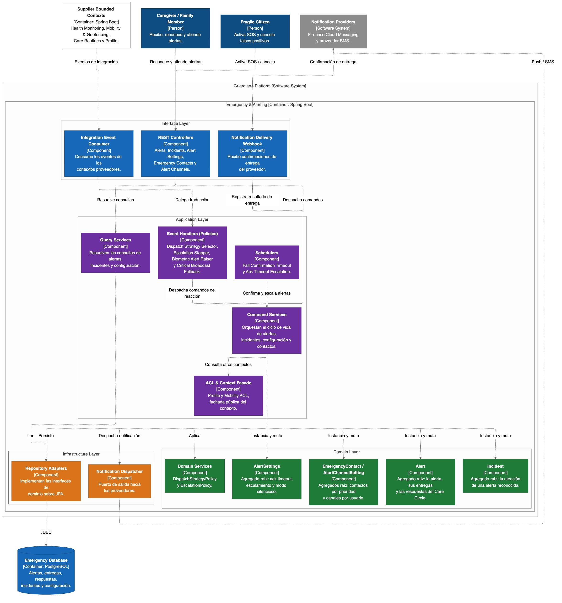

#### 2.6.1.6. Bounded Context Software Architecture Code Level Diagrams

En esta sección se presenta la estructura interna del Bounded Context **Emergency & Alerting** a nivel de código, mediante el diagrama de clases de su Domain Layer y el diseño de su base de datos.

##### 2.6.1.6.1. Bounded Context Domain Layer Class Diagrams

El diagrama UML de la Figura 2.45 presenta la Domain Layer de **Emergency & Alerting**, organizada alrededor de los agregados `Alert`, `Incident`, `AlertSettings`, `EmergencyContact` y `AlertChannelSetting`, junto con sus entidades, Value Objects, servicios de dominio y repositorios.

<a id="figura-2-45"></a>**Figura 2.45.** Diagrama de clases de la Domain Layer de Emergency & Alerting

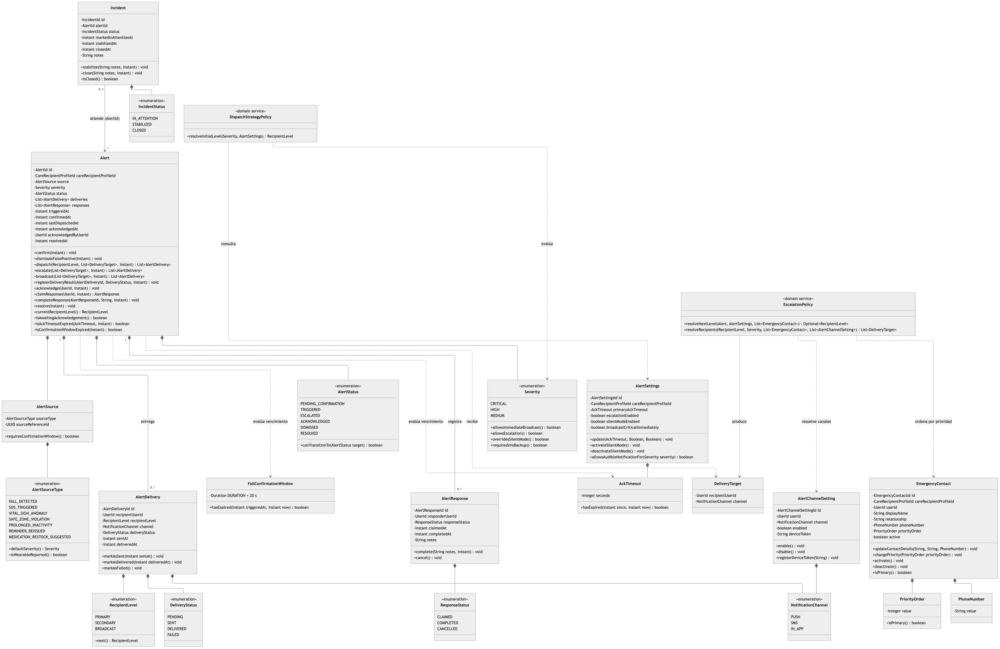

##### 2.6.1.6.2. Bounded Context Database Design Diagram

La Figura 2.46 presenta el diseño de persistencia de **Emergency & Alerting**. La tabla `alerts` concentra el ciclo de vida de cada alerta y se relaciona con `alert_deliveries`, `alert_responses` e `incidents`, mientras que `alert_settings`, `emergency_contacts` y `alert_channel_settings` guardan la configuración del Care Circle. Las tablas `user_accounts` y `care_recipient_profiles` se muestran como referencias externas.

<a id="figura-2-46"></a>**Figura 2.46.** Diagrama de base de datos de Emergency & Alerting

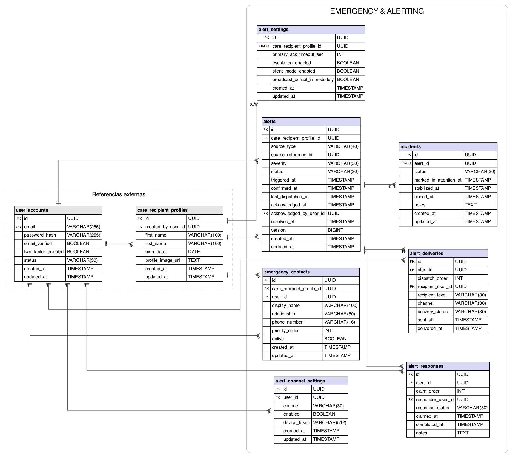


### 2.6.2. Bounded Context: Health Monitoring

El Bounded Context **Health Monitoring** pertenece al Core Domain de Guardian+. Su responsabilidad consiste en administrar los dispositivos wearables (`WearableDevice`) asignados a un Care Recipient, capturar cada signo vital (`VitalSign`) contra un catálogo de tipos soportados (`VitalSignType`: frecuencia cardíaca, presión arterial, saturación de oxígeno, temperatura y frecuencia respiratoria), evaluarlo frente a un umbral clínico configurable por paciente y tipo (`VitalSignThreshold`) y compilar Health Reports periódicos.

Este contexto recibe la telemetría del wearable por MQTT y la traduce al lenguaje del dominio mediante una Anti-Corruption Layer, de modo que el formato del firmware no afecte al modelo clínico. Cuando un signo vital supera su umbral, publica el evento de integración `VitalSignAnomalyDetected`, que Emergency & Alerting consume para generar la alerta correspondiente. Health Monitoring no despacha alertas ni gestiona su escalamiento.

La arquitectura táctica se implementa sobre Java y Spring Boot con una estructura de paquetes dividida en cuatro capas: domain, interfaces, application e infrastructure. Su código se organiza en el paquete `com.healthify.guardian.platform.healthmonitoring` del repositorio `guardian-plus-platform`, con la siguiente estructura:

```
com.healthify.guardian.platform.healthmonitoring/
├── domain/
│   ├── model/
│   │   ├── aggregates/
│   │   ├── commands/
│   │   ├── entities/
│   │   ├── events/
│   │   ├── queries/
│   │   └── valueobjects/
│   └── repositories/
├── interfaces/
│   ├── acl/
│   ├── events/
│   └── rest/
│       ├── resources/
│       └── transform/
├── application/
│   ├── acl/
│   ├── commandservices/
│   ├── internal/
│   │   ├── commandservices/
│   │   ├── eventhandlers/
│   │   └── queryservices/
│   └── queryservices/
└── infrastructure/
    ├── messaging/
    │   └── mqtt/
    ├── persistence/
    │   └── jpa/
    │       ├── adapters/
    │       ├── assemblers/
    │       ├── converters/
    │       ├── entities/
    │       └── repositories/
    └── scheduling/
```

#### 2.6.2.1. Domain Layer

Encapsula la lógica pura del dominio médico, las invariantes fisiológicas y las reglas de evaluación clínica embebidas en los propios agregados y Value Objects. Se distinguen cinco agregados en lugar de dos: el Design-Level EventStorming separa explícitamente tres comandos sobre el mismo sticky de agregado (`Detect Vital Signs`, `Emit Vital Signs`, `Evaluate Vital Signs Thresholds`, todos etiquetados **VitalSign**), y el Database Design Diagram revela tres tablas propias del contexto (`wearable_devices`, `vital_sign_types`, `vital_sign_thresholds`) sin ningún agregado equivalente en el modelo original.

##### Aggregates

*   **VitalSign**
    *   Agregado raíz que representa la captura de un único tipo de signo vital de un Care Recipient en un instante dado (una fila = una métrica, no un conjunto fijo de cinco).
    *   Hereda de `AbstractDomainAggregateRoot<VitalSign>` para registrar y publicar eventos de dominio.
    *   *Atributos:*
        *   `id: VitalSignId`
        *   `wearableDeviceId: WearableDeviceId`
        *   `careRecipientProfileId: CareRecipientProfileId`
        *   `vitalSignTypeId: VitalSignTypeId`
        *   `value: VitalSignValue`
        *   `measuredAt: Instant`
        *   `receivedAt: Instant`
        *   `emittedAt: Instant`
    *   *Métodos:*
        *   `VitalSign(DetectVitalSignsCommand command)`
        *   `emit(): void`
        *   `evaluateThresholds(VitalSignThreshold threshold): boolean`
        *   `isEmitted(): boolean`

*   **VitalSignThreshold**
    *   Agregado raíz que configura, por Care Recipient y tipo de signo vital, el rango clínico válido y la cantidad de lecturas consecutivas requeridas para confirmar una anomalía. Reemplaza los invariantes fijos que antes vivían embebidos en Value Objects específicos (p. ej. "20-300 BPM" hardcodeado) por un umbral configurable por paciente.
    *   *Atributos:*
        *   `id: VitalSignThresholdId`
        *   `careRecipientProfileId: CareRecipientProfileId`
        *   `vitalSignTypeId: VitalSignTypeId`
        *   `minimumValue: BigDecimal`
        *   `maximumValue: BigDecimal`
        *   `requiredConsecutiveHits: Integer`
        *   `active: Boolean`
        *   `createdAt: Instant`
        *   `updatedAt: Instant`
    *   *Métodos:*
        *   `VitalSignThreshold(DefineVitalSignThresholdCommand command)`
        *   `isExceededBy(VitalSignValue value): boolean`
        *   `activate(): void`
        *   `deactivate(): void`

*   **WearableDevice**
    *   Agregado raíz que registra el dispositivo físico asignado a un Care Recipient y gobierna su ciclo de vida de asignación.
    *   *Atributos:*
        *   `id: WearableDeviceId`
        *   `careRecipientProfileId: CareRecipientProfileId`
        *   `serialNumber: SerialNumber`
        *   `deviceType: DeviceType`
        *   `status: DeviceStatus`
        *   `assignedAt: Instant`
        *   `createdAt: Instant`
        *   `updatedAt: Instant`
    *   *Métodos:*
        *   `WearableDevice(AssignWearableDeviceCommand command)`
        *   `deactivate(): void`

*   **VitalSignType**
    *   Agregado raíz que actúa como catálogo de los tipos de signo vital soportados por la plataforma (frecuencia cardíaca, presión sistólica/diastólica, saturación de oxígeno, temperatura, frecuencia respiratoria), cada uno con su código único y unidad de medida.
    *   *Atributos:*
        *   `id: VitalSignTypeId`
        *   `code: VitalSignTypeCode`
        *   `name: String`
        *   `unit: String`
    *   *Métodos:*
        *   `VitalSignType(RegisterVitalSignTypeCommand command)`

*   **HealthReport**
    *   Agregado raíz que consolida y sintetiza series temporales de `VitalSign` dentro de un rango temporal.
    *   *Atributos:*
        *   `id: HealthReportId`
        *   `careRecipientProfileId: CareRecipientProfileId`
        *   `generatedByUserId: UserId`
        *   `reportType: HealthReportType`
        *   `period: DateRange`
        *   `summaries: List<VitalSignSummary>`
        *   `recurrentAnomaliesCount: Integer`
        *   `generatedAt: Instant`
    *   *Métodos:*
        *   `HealthReport(GenerateHealthReportCommand command, List<VitalSign> vitalSigns)`
        *   `isClinicallyStable(): boolean`

##### Entities

*   **VitalSignSummary**
    *   Entidad interna que compone el reporte médico agregado (`HealthReport`). No tiene columna propia en `health_reports`: se serializa hacia el campo `summary` (TEXT) al persistir, junto con `recurrentAnomaliesCount`.
    *   *Atributos:*
        *   `id: Long`
        *   `metricType: String`
        *   `averageValue: Double`
        *   `minValue: Double`
        *   `maxValue: Double`
        *   `stabilityIndex: String`

##### Value Objects

*   **VitalSignValue:** Encapsula el valor numérico crudo de una lectura (`value: BigDecimal`), sin acoplarse a una unidad o rango fijo; su interpretación clínica depende del `VitalSignType` y del `VitalSignThreshold` vigente.
*   **VitalSignTypeCode:** Código único del catálogo (`value: String`, p. ej. `HR`, `BP_SYS`, `BP_DIA`, `SPO2`, `TEMP`, `RESP_RATE`).
*   **SerialNumber:** Identificador de fábrica único del dispositivo (`value: String`).
*   **DeviceType:** Enum (`SMARTWATCH`, `WRISTBAND`, `PATCH`).
*   **DeviceStatus:** Enum (`ASSIGNED`, `INACTIVE`, `DECOMMISSIONED`).
*   **HealthReportType:** Enum (`ON_DEMAND`, `WEEKLY_AUTOMATIC`).
*   **DateRange:** Intervalo temporal inmutable (`startDate: LocalDate`, `endDate: LocalDate`). Método: `contains(LocalDate date)`.
*   **VitalSignId / VitalSignThresholdId / WearableDeviceId / VitalSignTypeId / HealthReportId:** Identificadores inmutables tipo UUID.
*   **CareRecipientProfileId:** Identificador de referencia inmutable al paciente monitoreado, gobernado por el Bounded Context Profile.
*   **UserId:** Identificador de referencia inmutable al usuario autenticado (IAM) que solicitó un `HealthReport`.

##### Commands & Queries (Domain Model)

*   `DetectVitalSignsCommand(UUID wearableDeviceId, UUID careRecipientProfileId, UUID vitalSignTypeId, BigDecimal value, Instant measuredAt, Instant receivedAt)`
*   `EmitVitalSignsCommand(UUID vitalSignId)`
*   `EvaluateVitalSignsThresholdsCommand(UUID vitalSignId)`
*   `DefineVitalSignThresholdCommand(UUID careRecipientProfileId, UUID vitalSignTypeId, BigDecimal minimumValue, BigDecimal maximumValue, Integer requiredConsecutiveHits)`
*   `AssignWearableDeviceCommand(UUID careRecipientProfileId, String serialNumber, String deviceType)`
*   `RegisterVitalSignTypeCommand(String code, String name, String unit)`
*   `GenerateHealthReportCommand(UUID careRecipientProfileId, UUID generatedByUserId, String reportType, LocalDate periodStart, LocalDate periodEnd)`
*   `CompileWeeklySummaryCommand(UUID careRecipientProfileId)`
*   `GetLiveVitalSignsByCareRecipientProfileIdQuery(CareRecipientProfileId careRecipientProfileId)`
*   `GetVitalSignsByCareRecipientProfileIdAndPeriodQuery(CareRecipientProfileId careRecipientProfileId, DateRange dateRange)`
*   `GetHealthReportByIdQuery(HealthReportId healthReportId)`
*   `GetAllHealthReportsByCareRecipientProfileIdQuery(CareRecipientProfileId careRecipientProfileId)`

##### Domain Events

*   `VitalSignsDetectedEvent`: Emitido tras validar e instanciar la captura de un signo vital (`Detect Vital Signs`).
*   `VitalSignsEmittedEvent`: Emitido al publicar el signo vital para su consumo en vivo (`Emit Vital Signs`), habilitando la vista `Live Vital Signs View`.
*   `VitalSignsThresholdsEvaluatedEvent`: Emitido al concluir la evaluación contra el `VitalSignThreshold` vigente (`Evaluate Vital Signs Thresholds`), portando el estado de desviación (`hasDeviation: boolean`).
*   `HealthReportGeneratedEvent`: Emitido tras la compilación de un reporte longitudinal.
*   `WeeklySummaryCompiledEvent`: Emitido por la tarea programada dominical.

##### Repositories (Domain Interfaces)

*   **VitalSignRepository:**
    *   `save(VitalSign vitalSign): VitalSign`
    *   `saveAll(List<VitalSign> vitalSigns): List<VitalSign>`
    *   `findLatestByCareRecipientProfileIdAndVitalSignTypeId(CareRecipientProfileId careRecipientProfileId, VitalSignTypeId vitalSignTypeId): Optional<VitalSign>`
    *   `findRecentByCareRecipientProfileIdAndVitalSignTypeId(CareRecipientProfileId careRecipientProfileId, VitalSignTypeId vitalSignTypeId, int count): List<VitalSign>`
    *   `findByCareRecipientProfileIdAndPeriod(CareRecipientProfileId careRecipientProfileId, DateRange period): List<VitalSign>`
*   **VitalSignThresholdRepository:**
    *   `save(VitalSignThreshold threshold): VitalSignThreshold`
    *   `findByCareRecipientProfileIdAndVitalSignTypeId(CareRecipientProfileId careRecipientProfileId, VitalSignTypeId vitalSignTypeId): Optional<VitalSignThreshold>`
    *   `findAllActiveByCareRecipientProfileId(CareRecipientProfileId careRecipientProfileId): List<VitalSignThreshold>`
*   **WearableDeviceRepository:**
    *   `save(WearableDevice device): WearableDevice`
    *   `findById(WearableDeviceId id): Optional<WearableDevice>`
    *   `findByCareRecipientProfileId(CareRecipientProfileId careRecipientProfileId): List<WearableDevice>`
    *   `findBySerialNumber(SerialNumber serialNumber): Optional<WearableDevice>`
*   **VitalSignTypeRepository:**
    *   `save(VitalSignType vitalSignType): VitalSignType`
    *   `findById(VitalSignTypeId id): Optional<VitalSignType>`
    *   `findByCode(VitalSignTypeCode code): Optional<VitalSignType>`
*   **HealthReportRepository:**
    *   `save(HealthReport report): HealthReport`
    *   `findById(HealthReportId id): Optional<HealthReport>`
    *   `findByCareRecipientProfileId(CareRecipientProfileId careRecipientProfileId): List<HealthReport>`

#### 2.6.2.2. Interface Layer

Traduce estímulos externos hacia comandos y consultas de aplicación, expone contratos HTTP RESTful y canaliza eventos de integración.

##### REST Controllers

*   **VitalSignsController** (`/api/v1/vital-signs`):
    *   `POST /`: Registra la detección de un signo vital (`DetectVitalSignsCommand`).
    *   `POST /batches`: Ingesta por lotes para sincronización offline.
    *   `POST /{vitalSignId}/emit`: Publica el signo vital detectado para su visualización en vivo.
    *   `GET /live/{careRecipientProfileId}`: Consulta el último estado biométrico emitido por tipo de signo vital.
    *   `GET /history/{careRecipientProfileId}`: Retorna lecturas históricas filtradas por rango temporal.
*   **VitalSignThresholdsController** (`/api/v1/vital-sign-thresholds`):
    *   `GET /care-recipient/{careRecipientProfileId}`: Lista los umbrales activos configurados.
    *   `PUT /`: Define o actualiza un umbral (mínimo, máximo, lecturas consecutivas requeridas).
    *   `POST /{thresholdId}/activate` / `DELETE /{thresholdId}`: Activa o desactiva un umbral.
*   **WearableDevicesController** (`/api/v1/wearable-devices`):
    *   `POST /`: Asigna un nuevo dispositivo a un Care Recipient.
    *   `GET /care-recipient/{careRecipientProfileId}`: Lista los dispositivos asignados.
    *   `DELETE /{deviceId}`: Desactiva un dispositivo.
*   **VitalSignTypesController** (`/api/v1/vital-sign-types`):
    *   `GET /`: Lista el catálogo de tipos de signo vital soportados.
    *   `POST /`: Registra un nuevo tipo (uso administrativo).
*   **HealthReportsController** (`/api/v1/health-reports`):
    *   `POST /`: Dispara la generación bajo demanda de un reporte de salud.
    *   `GET /{reportId}`: Recupera un reporte específico compilado.
    *   `GET /care-recipient/{careRecipientProfileId}`: Lista los reportes emitidos de un Care Recipient.

##### Resources & Assemblers

*   *Resources (DTOs):* `DetectVitalSignsResource`, `VitalSignResource`, `LiveVitalSignsResource`, `DefineVitalSignThresholdResource`, `AssignWearableDeviceResource`, `WearableDeviceResource`, `VitalSignTypeResource`, `GenerateHealthReportResource`, `HealthReportResource`.
*   *Assemblers (Mappers):* `DetectVitalSignsCommandFromResourceAssembler`, `VitalSignResourceFromEntityAssembler`, `LiveVitalSignsResourceFromEntityAssembler`, `DefineVitalSignThresholdCommandFromResourceAssembler`, `WearableDeviceResourceFromEntityAssembler`, `GenerateHealthReportCommandFromResourceAssembler`, `HealthReportResourceFromEntityAssembler`.

##### Integration Events & ACL Facade

*   `VitalSignAnomalyDetectedIntegrationEvent`: Evento publicado hacia el bus de mensajería cuando se confirman `requiredConsecutiveHits` transgresiones consecutivas del umbral vigente, consumido por `Emergency & Alerting`.
*   `HealthReportCompiledIntegrationEvent`: Notifica a contextos de soporte la disponibilidad de un nuevo reporte estructurado.
*   `HealthMonitoringContextFacade`: Interfaz expuesta para consultas sincrónicas de lectura segura entre contextos.

#### 2.6.2.3. Application Layer

Orquesta los flujos de casos de uso delegando las reglas clínicas en los agregados correspondientes. Los Event Handlers materializan el encadenamiento Detect → Emit → Evaluate distinguido en el Design-Level EventStorming.

##### Command Services

*   **VitalSignCommandService & VitalSignCommandServiceImpl:**
    *   `handle(DetectVitalSignsCommand command): Optional<VitalSign>`: Construye y persiste `VitalSign`.
    *   `handle(EmitVitalSignsCommand command): void`: Marca el signo vital como emitido, habilitando su lectura en vivo.
    *   `handle(EvaluateVitalSignsThresholdsCommand command): void`: Recupera el `VitalSignThreshold` activo para el Care Recipient y tipo correspondientes, y evalúa el signo vital contra él.
*   **VitalSignThresholdCommandService & VitalSignThresholdCommandServiceImpl:**
    *   `handle(DefineVitalSignThresholdCommand command): Optional<VitalSignThreshold>`
*   **WearableDeviceCommandService & WearableDeviceCommandServiceImpl:**
    *   `handle(AssignWearableDeviceCommand command): Optional<WearableDevice>`
*   **VitalSignTypeCommandService & VitalSignTypeCommandServiceImpl:**
    *   `handle(RegisterVitalSignTypeCommand command): Optional<VitalSignType>`
*   **HealthReportCommandService & HealthReportCommandServiceImpl:**
    *   `handle(GenerateHealthReportCommand command): Optional<HealthReport>`: Extrae los `VitalSign` del período y construye y persiste el aggregate `HealthReport`.
    *   `handle(CompileWeeklySummaryCommand command): void`: Orquesta la síntesis semanal programada.

##### Query Services

*   **VitalSignQueryService & VitalSignQueryServiceImpl:** Resuelve `GetLiveVitalSignsByCareRecipientProfileIdQuery` y `GetVitalSignsByCareRecipientProfileIdAndPeriodQuery`.
*   **HealthReportQueryService & HealthReportQueryServiceImpl:** Resuelve `GetHealthReportByIdQuery` y `GetAllHealthReportsByCareRecipientProfileIdQuery`.

##### Event Handlers

*   `VitalSignsDetectedEventHandler`: Reacciona a `VitalSignsDetectedEvent` y despacha `EmitVitalSignsCommand`.
*   `VitalSignsEmittedEventHandler`: Reacciona a `VitalSignsEmittedEvent` y despacha `EvaluateVitalSignsThresholdsCommand`.
*   `VitalSignsThresholdsEvaluatedEventHandler`: Implementa la policy **Regla de Tolerancia**. Si hubo desviación, consulta las `requiredConsecutiveHits - 1` lecturas inmediatamente anteriores del mismo Care Recipient y tipo en `VitalSignRepository`; si todas violan el umbral, despacha `VitalSignAnomalyDetectedIntegrationEvent`.
*   `WeeklySummaryCompiledEventHandler`: Gestiona la indexación y caché de los resúmenes médicos compilados.

##### Application ACL Implementation

*   `HealthMonitoringContextFacadeImpl`: Implementa la fachada de acceso público del contexto.

#### 2.6.2.4. Infrastructure Layer

Implementa la persistencia técnica en PostgreSQL, la comunicación con el broker MQTT y los componentes de programación temporal.

##### Persistence JPA Entities

*   `VitalSignPersistenceEntity`: Mapea la tabla `vital_sign_readings`. Columnas: `id`, `wearable_device_id`, `care_recipient_profile_id`, `vital_sign_type_id`, `value`, `measured_at`, `received_at`.
*   `VitalSignThresholdPersistenceEntity`: Mapea la tabla `vital_sign_thresholds`. Columnas: `id`, `care_recipient_profile_id`, `vital_sign_type_id`, `minimum_value`, `maximum_value`, `required_consecutive_hits`, `active`, `created_at`, `updated_at`.
*   `WearableDevicePersistenceEntity`: Mapea la tabla `wearable_devices`. Columnas: `id`, `care_recipient_profile_id`, `serial_number`, `device_type`, `status`, `assigned_at`, `created_at`, `updated_at`.
*   `VitalSignTypePersistenceEntity`: Mapea la tabla `vital_sign_types`. Columnas: `id`, `code`, `name`, `unit`.
*   `HealthReportPersistenceEntity`: Mapea la tabla `health_reports`. Columnas: `id`, `care_recipient_profile_id`, `generated_by_user_id`, `report_type`, `period_start`, `period_end`, `summary`, `generated_at`. El campo `summary` (TEXT) persiste la serialización de `summaries` y `recurrentAnomaliesCount`; no existe una tabla `report_summaries` separada.

##### Spring Data Repositories & Adapters

*   `VitalSignPersistenceRepository`, `VitalSignThresholdPersistenceRepository`, `WearableDevicePersistenceRepository`, `VitalSignTypePersistenceRepository` y `HealthReportPersistenceRepository`: Extienden `JpaRepository<..., UUID>`.
*   `VitalSignRepositoryImpl`, `VitalSignThresholdRepositoryImpl`, `WearableDeviceRepositoryImpl`, `VitalSignTypeRepositoryImpl` y `HealthReportRepositoryImpl`: Implementan las interfaces de dominio usando los assemblers de persistencia para traducir bidireccionalmente entre entidades JPA y agregados.

##### Persistence Assemblers

*   `VitalSignPersistenceAssembler`: Traduce los tipos primitivos de `VitalSignPersistenceEntity` hacia los Value Objects (`VitalSignValue`, `WearableDeviceId`, `VitalSignTypeId`) y recompone el agregado `VitalSign`.
*   `VitalSignThresholdPersistenceAssembler`, `WearableDevicePersistenceAssembler`, `VitalSignTypePersistenceAssembler` y `HealthReportPersistenceAssembler`: Traducen entre sus respectivas entidades JPA y agregados de dominio; `HealthReportPersistenceAssembler` serializa/deserializa `summaries` y `recurrentAnomaliesCount` hacia y desde el campo `summary`.

##### Scheduling

*   `WeeklyHealthSummaryScheduler`: Tarea periódica anotada con `@Scheduled(cron = "0 0 0 * * SUN")` que invoca `CompileWeeklySummaryCommand` para los pacientes activos.

#### 2.6.2.5. Bounded Context Software Architecture Component Level Diagrams

La Figura 2.47 presenta las cuatro capas del Bounded Context **Health Monitoring**, su comunicación con la aplicación móvil y con el broker MQTT que entrega la telemetría del wearable, y la publicación de eventos de integración hacia Emergency & Alerting.

<a id="figura-2-47"></a>**Figura 2.47.** Diagrama de componentes del Bounded Context Health Monitoring

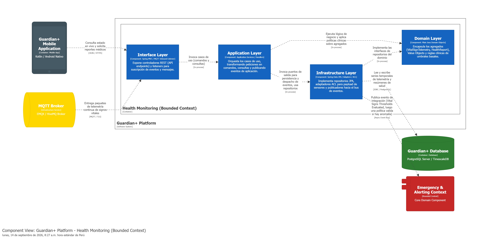

#### 2.6.2.6. Bounded Context Software Architecture Code Level Diagrams

En esta sección se presenta la estructura interna del Bounded Context **Health Monitoring** a nivel de código, mediante el diagrama de clases de su Domain Layer y el diseño de su base de datos.

##### 2.6.2.6.1. Bounded Context Domain Layer Class Diagrams

El diagrama UML de la Figura 2.48 presenta la Domain Layer de **Health Monitoring**, con los agregados `VitalSignType`, `VitalSignThreshold`, `VitalSign`, `WearableDevice` y `HealthReport`, sus Value Objects y las interfaces de repositorio que los gestionan.

<a id="figura-2-48"></a>**Figura 2.48.** Diagrama de clases de la Domain Layer de Health Monitoring

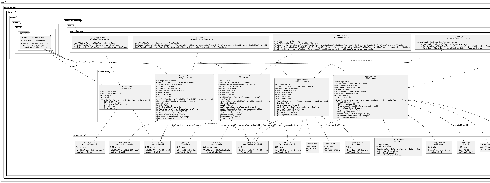


##### 2.6.2.6.2. Bounded Context Database Design Diagram

La Figura 2.49 presenta el diseño de persistencia de **Health Monitoring**: `wearable_devices` registra los dispositivos asignados a cada persona bajo cuidado, `vital_sign_types` y `vital_sign_thresholds` definen el catálogo de signos vitales y sus umbrales, `vital_sign_readings` almacena cada lectura recibida y `health_reports` guarda los reportes generados.

<a id="figura-2-49"></a>**Figura 2.49.** Diagrama de base de datos de Health Monitoring

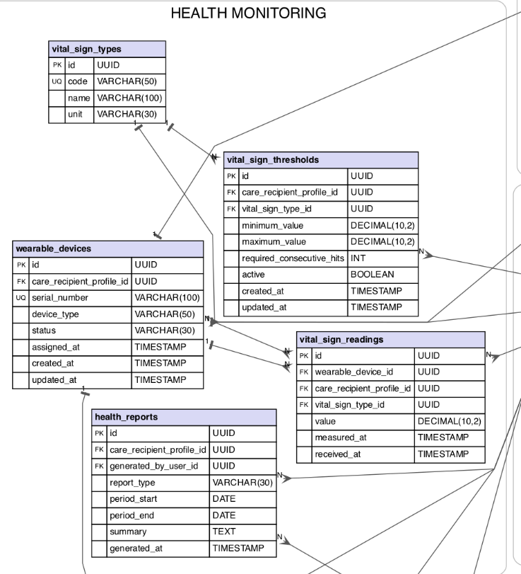

### 2.6.3. Bounded Context: Subscriptions

El Bounded Context **Subscriptions** pertenece al Generic Domain de Guardian+. Su responsabilidad consiste en gestionar el ciclo de vida comercial de las suscripciones de la plataforma: la solicitud y activación de una suscripción, los cambios de plan, la renovación, la cancelación, la expiración y la determinación de los beneficios (entitlements) asociados al plan vigente.

Este contexto mantiene aisladas las reglas comerciales de Guardian+ respecto de la identidad, los perfiles, el monitoreo de salud y la gestión de emergencias. La integración con Stripe se realiza mediante adaptadores que traducen sus notificaciones de pago a las transiciones de estado del agregado `Subscription`, y la evaluación periódica de renovaciones y expiraciones se delega a un mecanismo de programación temporal, de modo que ninguna de estas dependencias forme parte del modelo de dominio.

La arquitectura táctica se diseñó sobre Java y Spring Boot con la misma estructura de paquetes de cuatro capas que el resto de Bounded Contexts: domain, interfaces, application e infrastructure. Su código se organizará en el paquete `com.healthify.guardian.platform.subscriptions` del repositorio `guardian-plus-platform`, con la siguiente estructura:

```
com.healthify.guardian.platform.subscriptions/
├── domain/
│   ├── model/
│   │   ├── aggregates/
│   │   ├── commands/
│   │   ├── entities/
│   │   ├── events/
│   │   ├── queries/
│   │   └── valueobjects/
│   ├── repositories/
│   └── services/
├── interfaces/
│   ├── events/
│   └── rest/
│       ├── resources/
│       └── transform/
├── application/
│   ├── commandservices/
│   ├── internal/
│   │   ├── commandservices/
│   │   ├── eventhandlers/
│   │   └── queryservices/
│   └── queryservices/
└── infrastructure/
    ├── payments/
    │   └── adapters/
    ├── persistence/
    │   └── jpa/
    │       ├── adapters/
    │       ├── assemblers/
    │       ├── entities/
    │       └── repositories/
    └── scheduling/
```

#### 2.6.3.1. Domain Layer

La Domain Layer concentra las reglas de negocio relacionadas con el ciclo de vida de las suscripciones, la definición de planes comerciales, el procesamiento de pagos y la determinación de los entitlements habilitados para cada suscripción. Esta capa se mantiene independiente de proveedores de pago, tecnologías de persistencia y mecanismos externos de programación.

##### Aggregates

**`Subscription`**

Representa una suscripción de Guardian+ y constituye el Aggregate Root principal del ciclo de vida comercial. Controla su activación, renovación, cambio de plan, cancelación y expiración.

**Atributos principales:**

- `id: SubscriptionId`
- `subscriberUserId: UserId`
- `planId: PlanId`
- `status: SubscriptionStatus`
- `currentPeriod: Period`
- `cancelAtPeriodEnd: Boolean`
- `cancelledAt: Instant`
- `createdAt: Instant`
- `updatedAt: Instant`

**Métodos principales:**

- `activate(): void`
- `renew(period: Period): void`
- `changePlan(planId: PlanId): void`
- `requestCancellation(): void`
- `cancel(): void`
- `expire(): void`
- `isActive(): Boolean`

**Relaciones principales:**

- Una `Subscription` se encuentra asociada a un `Plan`.
- Una `Subscription` puede registrar múltiples `PaymentAttempt`.
- Una `Subscription` puede disponer de un `EntitlementSet` con los beneficios efectivos habilitados.

**`Plan`**

Representa una alternativa comercial disponible en Guardian+. Mantiene la configuración utilizada para determinar el precio, ciclo de facturación y beneficios asociados a una suscripción.

**Atributos principales:**

- `id: PlanId`
- `name: String`
- `description: String`
- `price: Money`
- `billingCycle: BillingCycle`
- `active: Boolean`
- `createdAt: Instant`
- `updatedAt: Instant`

**Métodos principales:**

- `activate(): void`
- `deactivate(): void`
- `changePrice(price: Money): void`

**Relaciones principales:**

- Un `Plan` puede estar asociado a múltiples suscripciones.
- Un `Plan` puede habilitar múltiples `Entitlement`.
- Un mismo `Entitlement` puede formar parte de distintos planes.

**`EntitlementSet`**

Representa el conjunto efectivo de beneficios habilitados para una suscripción. Permite mantener sincronizados los entitlements que corresponden según el plan contratado y el estado vigente de la suscripción. Cada beneficio efectivo se representa mediante un `SubscriptionEntitlement`, que conserva su estado y su periodo de vigencia en lugar de una simple pertenencia al conjunto.

**Atributos principales:**

- `subscriptionId: SubscriptionId`
- `items: List<SubscriptionEntitlement>`
- `updatedAt: Instant`

**Métodos principales:**

- `replaceWith(entitlementIds: Set<EntitlementId>, effectiveFrom: Instant): void`
- `revoke(entitlementId: EntitlementId, effectiveTo: Instant): void`
- `revokeAll(effectiveTo: Instant): void`
- `contains(entitlementId: EntitlementId): Boolean`
- `activeItems(): List<SubscriptionEntitlement>`

**Relaciones principales:**

- Un `EntitlementSet` pertenece a una suscripción.
- Un `EntitlementSet` puede contener múltiples `SubscriptionEntitlement`.
- Cada `SubscriptionEntitlement` referencia por identidad a un `Entitlement` del catálogo.

**`Entitlement`**

Representa un beneficio o capacidad comercial del catálogo de Guardian+, que puede estar habilitado por uno o más planes de suscripción. Constituye un Aggregate Root propio porque es un catálogo compartido entre planes y suscripciones, con identidad y ciclo de vida independientes de ambos.

**Atributos principales:**

- `id: EntitlementId`
- `code: String`
- `name: String`
- `description: String`

**Métodos principales:**

- `matches(code: String): Boolean`

**Relaciones principales:**

- Un `Entitlement` puede formar parte de múltiples `Plan`, mediante la relación `plan_entitlements`.
- Un `Entitlement` puede encontrarse habilitado dentro de distintos `EntitlementSet`, mediante `SubscriptionEntitlement`.

##### Entities

**`PaymentAttempt`**

Representa un intento de pago asociado a una suscripción, ya sea para su activación inicial o para una renovación.

**Atributos principales:**

- `id: UUID`
- `subscriptionId: SubscriptionId`
- `paymentType: PaymentType`
- `amount: Money`
- `provider: String`
- `status: PaymentStatus`
- `providerReference: String`
- `createdAt: Instant`
- `paidAt: Instant`

**Métodos principales:**

- `markConfirmed(reference: String): void`
- `markFailed(): void`
- `isSuccessful(): Boolean`

**Relaciones principales:**

- Cada `PaymentAttempt` se encuentra asociado a una `Subscription`.

**`SubscriptionEntitlement`**

Representa un beneficio efectivo habilitado para una suscripción durante un periodo determinado. Es la entidad interna de `EntitlementSet` y conserva el estado y la vigencia que no pueden expresarse mediante la simple pertenencia a un conjunto.

**Atributos principales:**

- `id: UUID`
- `entitlementId: EntitlementId`
- `status: SubscriptionEntitlementStatus`
- `effectivePeriod: Period`

**Métodos principales:**

- `revoke(effectiveTo: Instant): void`
- `isEffectiveAt(date: Instant): Boolean`

**Relaciones principales:**

- Cada `SubscriptionEntitlement` pertenece a un `EntitlementSet`.
- Cada `SubscriptionEntitlement` referencia un `Entitlement` del catálogo mediante `EntitlementId`.

##### Value Objects

**`SubscriptionId`**

Identificador inmutable utilizado para distinguir una suscripción.

**Atributos:**

- `value: UUID`

**`PlanId`**

Identificador inmutable utilizado para distinguir un plan comercial.

**Atributos:**

- `value: UUID`

**`UserId`**

Identificador externo utilizado para referenciar al usuario propietario de una suscripción sin incorporar el modelo interno del Bounded Context IAM.

**Atributos:**

- `value: UUID`

**`EntitlementId`**

Identificador inmutable utilizado para distinguir un entitlement.

**Atributos:**

- `value: UUID`

**`Money`**

Representa un monto monetario junto con su moneda.

**Atributos:**

- `amount: Decimal`
- `currency: String`

**Métodos principales:**

- `isPositive(): Boolean`

**`Period`**

Representa el intervalo temporal vigente de una suscripción.

**Atributos:**

- `start: Instant`
- `end: Instant`

**Métodos principales:**

- `contains(date: Instant): Boolean`
- `durationInDays(): Long`

##### Enumerations

**`SubscriptionStatus`**

Representa el estado vigente de una suscripción.

- `PENDING`
- `ACTIVE`
- `CANCELLED`
- `EXPIRED`

**`PaymentStatus`**

Representa el resultado o estado de un intento de pago.

- `PENDING`
- `CONFIRMED`
- `FAILED`

**`PaymentType`**

Permite distinguir el propósito de una operación de pago.

- `INITIAL`
- `RENEWAL`

**`BillingCycle`**

Representa la periodicidad comercial configurada para un plan.

- `MONTHLY`
- `YEARLY`

**`SubscriptionEntitlementStatus`**

Representa el estado de un beneficio efectivo dentro de una suscripción.

- `ACTIVE`
- `REVOKED`

##### Domain Policies

**`SubscriptionActivationPolicy`**

Evalúa las condiciones necesarias para iniciar y activar una suscripción de acuerdo con el plan seleccionado.

**Operaciones principales:**

- `requiresPayment(plan: Plan): Boolean`
- `canActivate(plan: Plan): Boolean`

**`SubscriptionLifecyclePolicy`**

Agrupa las reglas de negocio relacionadas con los cambios de plan, cancelación, renovación y expiración de una suscripción.

**Operaciones principales:**

- `canChangePlan(subscription: Subscription, newPlan: Plan): Boolean`
- `determineCancellationEffectiveDate(subscription: Subscription): Instant`
- `canRenew(subscription: Subscription, plan: Plan): Boolean`
- `canExpire(subscription: Subscription): Boolean`

**`EntitlementPolicy`**

Determina los beneficios efectivos que deben mantenerse habilitados como consecuencia de los cambios producidos durante el ciclo de vida de una suscripción.

**Operaciones principales:**

- `afterActivation(subscription: Subscription, plan: Plan): Set<EntitlementId>`
- `afterPlanChange(subscription: Subscription, plan: Plan): Set<EntitlementId>`
- `afterCancellation(subscription: Subscription): Set<EntitlementId>`
- `afterExpiration(subscription: Subscription): Set<EntitlementId>`

##### Commands & Queries (Domain Model)

- `RequestSubscriptionCommand(UUID subscriberUserId, UUID planId)`
- `ActivateSubscriptionCommand(UUID subscriptionId)`
- `InitiateSubscriptionPaymentCommand(UUID subscriptionId)`
- `RequestPlanChangeCommand(UUID subscriptionId, UUID newPlanId)`
- `ApplyPlanChangeCommand(UUID subscriptionId, UUID newPlanId)`
- `RequestSubscriptionCancellationCommand(UUID subscriptionId)`
- `CancelSubscriptionCommand(UUID subscriptionId)`
- `EvaluateSubscriptionRenewalCommand(UUID subscriptionId)`
- `InitiateRenewalPaymentCommand(UUID subscriptionId)`
- `RenewSubscriptionCommand(UUID subscriptionId, Period newPeriod)`
- `EvaluateSubscriptionExpirationCommand(UUID subscriptionId)`
- `ExpireSubscriptionCommand(UUID subscriptionId)`
- `UpdateEntitlementsCommand(UUID subscriptionId)`
- `GetSubscriptionStatusQuery(SubscriptionId subscriptionId)`
- `GetCurrentPlanQuery(SubscriptionId subscriptionId)`
- `GetAvailableEntitlementsQuery(SubscriptionId subscriptionId)`

##### Domain Events

- `SubscriptionActivated`: Emitido cuando una suscripción cumple las condiciones de activación definidas por `SubscriptionActivationPolicy`.
- `SubscriptionPlanChanged`: Emitido al aplicarse efectivamente un cambio de plan sobre una suscripción vigente.
- `SubscriptionCancelled`: Emitido cuando la cancelación se hace efectiva según la fecha determinada por `SubscriptionLifecyclePolicy`.
- `SubscriptionRenewed`: Emitido al establecerse el nuevo periodo de vigencia de una suscripción renovada.
- `SubscriptionExpired`: Emitido cuando una suscripción finaliza su vigencia sin renovación.
- `PaymentConfirmed`: Emitido al confirmarse el pago inicial requerido para la activación.
- `PaymentFailed`: Emitido cuando el pago inicial no pudo completarse, sin activar la suscripción.
- `RenewalPaymentConfirmed`: Emitido al confirmarse el pago de una renovación.
- `RenewalPaymentFailed`: Emitido cuando el pago de renovación falla, sin extender el periodo vigente.
- `EntitlementsUpdated`: Emitido cuando `EntitlementPolicy` determina un nuevo conjunto de beneficios efectivos y el `EntitlementSet` se sincroniza.

##### Repositories (Domain Interfaces)

**`SubscriptionRepository`**

Abstracción utilizada para recuperar y persistir el Aggregate Root `Subscription`.

**Operaciones principales:**

- `findById(id: SubscriptionId): Optional<Subscription>`
- `findActiveBySubscriberUserId(userId: UserId): Optional<Subscription>`
- `save(subscription: Subscription): Subscription`

**`PlanRepository`**

Abstracción utilizada para consultar y persistir los planes comerciales administrados por Subscriptions.

**Operaciones principales:**

- `findById(id: PlanId): Optional<Plan>`
- `findActivePlans(): List<Plan>`

**`EntitlementRepository`**

Abstracción utilizada para consultar el catálogo de beneficios comerciales de Guardian+.

**Operaciones principales:**

- `findById(id: EntitlementId): Optional<Entitlement>`
- `findByCode(code: String): Optional<Entitlement>`
- `findAll(): List<Entitlement>`
- `findByPlanId(planId: PlanId): List<Entitlement>`

**`EntitlementSetRepository`**

Abstracción utilizada para recuperar y persistir los beneficios efectivos asociados a una suscripción.

**Operaciones principales:**

- `findBySubscriptionId(subscriptionId: SubscriptionId): Optional<EntitlementSet>`
- `save(entitlementSet: EntitlementSet): EntitlementSet`

El modelo de persistencia no replica de manera uno a uno todos los objetos del dominio. Los Value Objects se almacenan como parte de las entidades correspondientes, mientras que las asociaciones entre planes y entitlements y los beneficios efectivos de una suscripción se representan mediante las relaciones definidas en el modelo de base de datos.

#### 2.6.3.2. Interface Layer

La Interface Layer expone las capacidades del Bounded Context **Subscriptions** hacia los clientes de Guardian+ y recibe mensajes provenientes de integraciones externas. Su responsabilidad es transformar solicitudes HTTP, notificaciones externas y señales temporales en comandos o consultas que serán procesados por la Application Layer, sin incorporar reglas de negocio ni acceder directamente a la persistencia.

##### REST Controllers

**`SubscriptionController`**

Expone las operaciones relacionadas con el ciclo de vida y consulta de las suscripciones.

**Operaciones principales:**

- `requestSubscription()`
- `requestPlanChange()`
- `requestCancellation()`
- `getSubscriptionStatus()`
- `getAvailableEntitlements()`

**Relaciones principales:**

- recibe solicitudes de los clientes de Guardian+;
- delega comandos y consultas a los handlers correspondientes de la Application Layer;
- no accede directamente a los repositories ni a la base de datos.

**`PaymentWebhookController`**

Recibe las notificaciones enviadas por el proveedor externo de pagos y las transforma en acciones de aplicación relacionadas con la confirmación o fallo de pagos de activación y renovación.

**Operaciones principales:**

- `handlePaymentConfirmed()`
- `handlePaymentFailed()`

**Relaciones principales:**

- recibe notificaciones del Payment Provider;
- delega el procesamiento de los resultados de pago a la Application Layer;
- no modifica directamente el estado de `Subscription` ni de `PaymentAttempt`.

##### Message Consumers

**`BillingSchedulerConsumer`**

Recibe las señales temporales utilizadas para iniciar la evaluación de renovaciones y expiraciones de suscripciones.

**Operaciones principales:**

- `handleRenewalEvaluation()`
- `handleExpirationEvaluation()`

**Relaciones principales:**

- recibe señales generadas por el mecanismo de scheduling;
- delega las evaluaciones correspondientes a la Application Layer;
- no contiene reglas para decidir si una suscripción debe renovarse o expirar.

#### 2.6.3.3. Application Layer

La Application Layer coordina los casos de uso del Bounded Context **Subscriptions** utilizando los Aggregate Roots, Domain Policies y Repository Interfaces definidos en la Domain Layer. Esta capa organiza el flujo de cada operación, pero delega las reglas de negocio al modelo de dominio.

Los handlers no mantienen estado de negocio propio. Sus principales dependencias corresponden a los repositories y políticas necesarias para recuperar los aggregates, ejecutar las reglas del dominio y persistir los cambios resultantes.

##### Command Handlers

La Tabla 2.54 describe los command handlers del contexto y la operación principal de cada uno.

<a id="tabla-2-54"></a>**Tabla 2.54.** Command Handlers de Subscriptions

| Class | Purpose | Main Operation |
|---|---|---|
| `RequestSubscriptionHandler` | Procesa una nueva solicitud de suscripción y determina las condiciones iniciales según el plan seleccionado. | `handle(RequestSubscriptionCommand)` |
| `ActivateSubscriptionHandler` | Activa una suscripción cuando se cumplen las condiciones definidas por el dominio. | `handle(ActivateSubscriptionCommand)` |
| `InitiateSubscriptionPaymentHandler` | Coordina el inicio del pago requerido para activar una suscripción de pago. | `handle(InitiateSubscriptionPaymentCommand)` |
| `RequestPlanChangeHandler` | Recibe la solicitud de cambio de plan y evalúa si el cambio puede realizarse. | `handle(RequestPlanChangeCommand)` |
| `ApplyPlanChangeHandler` | Aplica el nuevo plan sobre una suscripción luego de cumplir las condiciones correspondientes. | `handle(ApplyPlanChangeCommand)` |
| `RequestSubscriptionCancellationHandler` | Procesa una solicitud de cancelación y determina cuándo debe hacerse efectiva. | `handle(RequestSubscriptionCancellationCommand)` |
| `CancelSubscriptionHandler` | Ejecuta la cancelación efectiva de una suscripción. | `handle(CancelSubscriptionCommand)` |
| `EvaluateSubscriptionRenewalHandler` | Evalúa una suscripción próxima al final de su periodo para determinar si corresponde iniciar su renovación. | `handle(EvaluateSubscriptionRenewalCommand)` |
| `InitiateRenewalPaymentHandler` | Coordina el pago requerido para renovar una suscripción de pago. | `handle(InitiateRenewalPaymentCommand)` |
| `RenewSubscriptionHandler` | Renueva una suscripción y establece su nuevo periodo de vigencia. | `handle(RenewSubscriptionCommand)` |
| `EvaluateSubscriptionExpirationHandler` | Evalúa si una suscripción debe finalizar su vigencia. | `handle(EvaluateSubscriptionExpirationCommand)` |
| `ExpireSubscriptionHandler` | Cambia una suscripción al estado expirado cuando se cumplen las condiciones del dominio. | `handle(ExpireSubscriptionCommand)` |
| `UpdateEntitlementsHandler` | Actualiza los beneficios efectivos de una suscripción después de cambios relevantes en su ciclo de vida. | `handle(UpdateEntitlementsCommand)` |

##### Query Handlers

La Tabla 2.55 describe los query handlers del contexto.

<a id="tabla-2-55"></a>**Tabla 2.55.** Query Handlers de Subscriptions

| Class | Purpose | Main Operation |
|---|---|---|
| `GetSubscriptionStatusHandler` | Recupera el estado vigente de una suscripción. | `handle(GetSubscriptionStatusQuery)` |
| `GetCurrentPlanHandler` | Recupera el plan actualmente asociado a una suscripción. | `handle(GetCurrentPlanQuery)` |
| `GetAvailableEntitlementsHandler` | Recupera los entitlements efectivos habilitados para una suscripción. | `handle(GetAvailableEntitlementsQuery)` |

##### Event Handlers

La Tabla 2.56 describe los event handlers del contexto y el evento al que reacciona cada uno.

<a id="tabla-2-56"></a>**Tabla 2.56.** Event Handlers de Subscriptions

| Class | Purpose | Main Operation |
|---|---|---|
| `SubscriptionActivatedHandler` | Reacciona a la activación de una suscripción para sincronizar sus entitlements. | `handle(SubscriptionActivated)` |
| `SubscriptionPlanChangedHandler` | Recalcula los entitlements luego de un cambio de plan. | `handle(SubscriptionPlanChanged)` |
| `SubscriptionCancelledHandler` | Actualiza los beneficios efectivos cuando una suscripción es cancelada. | `handle(SubscriptionCancelled)` |
| `SubscriptionExpiredHandler` | Revoca o actualiza los entitlements cuando una suscripción expira. | `handle(SubscriptionExpired)` |
| `PaymentConfirmedHandler` | Procesa la confirmación del pago inicial y permite continuar con la activación de la suscripción. | `handle(PaymentConfirmed)` |
| `PaymentFailedHandler` | Procesa el fallo del pago inicial sin activar la suscripción. | `handle(PaymentFailed)` |
| `RenewalPaymentConfirmedHandler` | Procesa la confirmación de un pago de renovación y permite continuar con la renovación de la suscripción. | `handle(RenewalPaymentConfirmed)` |
| `RenewalPaymentFailedHandler` | Procesa el fallo de un pago de renovación sin extender el periodo de la suscripción. | `handle(RenewalPaymentFailed)` |


#### 2.6.3.4. Infrastructure Layer

La Infrastructure Layer contiene las implementaciones técnicas necesarias para persistir el estado del Bounded Context **Subscriptions** y comunicarse con servicios externos. Esta capa implementa las abstracciones utilizadas por las capas internas sin incorporar reglas propias del dominio.

##### Persistence JPA Entities

*   `SubscriptionPersistenceEntity`: Mapea la tabla `subscriptions`. Columnas: `id`, `subscriber_user_id`, `plan_id`, `status`, `current_period_start`, `current_period_end`, `cancel_at_period_end`, `cancelled_at`, `created_at`, `updated_at`. Mantiene una relación `@OneToMany` hacia `PaymentPersistenceEntity`.
*   `PaymentPersistenceEntity`: Mapea la tabla `payments`. Columnas: `id`, `subscription_id`, `payment_type`, `amount`, `currency`, `provider`, `provider_reference`, `status`, `paid_at`, `created_at`. Las columnas `amount` y `currency` componen el Value Object `Money`.
*   `SubscriptionPlanPersistenceEntity`: Mapea la tabla `subscription_plans`. Columnas: `id`, `name`, `description`, `price`, `currency`, `billing_cycle`, `active`, `created_at`, `updated_at`.
*   `EntitlementPersistenceEntity`: Mapea la tabla `entitlements`. Columnas: `id`, `code`, `name`, `description`.
*   `PlanEntitlementPersistenceEntity`: Mapea la tabla de relación `plan_entitlements`. Columnas: `id`, `plan_id`, `entitlement_id`. Resuelve la asociación muchos a muchos entre planes y beneficios del catálogo.
*   `SubscriptionEntitlementPersistenceEntity`: Mapea la tabla `subscription_entitlements`. Columnas: `id`, `subscription_id`, `entitlement_id`, `status`, `effective_from`, `effective_to`. Las columnas `effective_from` y `effective_to` componen el Value Object `Period`.
*   *Converters:* `SubscriptionStatusConverter`, `PaymentStatusConverter`, `PaymentTypeConverter`, `BillingCycleConverter` y `SubscriptionEntitlementStatusConverter` traducen los enums de dominio hacia columnas `VARCHAR(30)`.

##### Repository Implementations

**`SubscriptionRepositoryImpl`**

Implementa `SubscriptionRepository` y gestiona la persistencia del Aggregate Root `Subscription`.

**Responsabilidades principales:**

- recuperar una suscripción por su identificador;
- recuperar la suscripción activa asociada a un usuario;
- persistir los cambios de estado, periodo, plan y cancelación de una suscripción;
- persistir los `PaymentAttempt` asociados al ciclo de vida de la suscripción.

**Relaciones principales:**

- implementa `SubscriptionRepository`;
- persiste información mediante las tablas `subscriptions` y `payments`.

**`PlanRepositoryImpl`**

Implementa `PlanRepository` y permite consultar la configuración comercial de los planes disponibles.

**Responsabilidades principales:**

- recuperar un plan mediante su identificador;
- recuperar los planes activos disponibles.

**Relaciones principales:**

- implementa `PlanRepository`;
- utiliza la información almacenada en `subscription_plans` y su asociación con `plan_entitlements`.

**`EntitlementSetRepositoryImpl`**

Implementa `EntitlementSetRepository` y gestiona la persistencia de los beneficios efectivos asociados a cada suscripción.

**Responsabilidades principales:**

- recuperar el `EntitlementSet` asociado a una suscripción, con el estado y la vigencia de cada `SubscriptionEntitlement`;
- persistir los beneficios efectivos habilitados para una suscripción, registrando su revocación sin eliminar el historial.

**Relaciones principales:**

- implementa `EntitlementSetRepository` y `EntitlementRepository`;
- utiliza `entitlements` como catálogo y `subscription_entitlements` para reconstruir y persistir el conjunto efectivo de beneficios.

##### External Service Adapters

**`PaymentProviderAdapter`**

Encapsula la comunicación con el proveedor externo encargado de procesar los pagos requeridos para activaciones y renovaciones.

**Operaciones principales:**

- `initiatePayment()`
- `validatePaymentNotification()`

**Relaciones principales:**

- es utilizado por la Application Layer para iniciar operaciones de pago;
- traduce las respuestas del proveedor externo al modelo utilizado por Guardian+;
- trabaja junto con `PaymentWebhookController` para procesar confirmaciones y fallos de pago.

La selección del proveedor permanece desacoplada del dominio. Stripe se mantiene como candidato de implementación mientras no se haya definido de manera definitiva el proveedor externo.

**`BillingSchedulerAdapter`**

Implementa el mecanismo técnico utilizado para generar las señales temporales necesarias para evaluar renovaciones y expiraciones.

**Operaciones principales:**

- `scheduleRenewalEvaluation()`
- `scheduleExpirationEvaluation()`

**Relaciones principales:**

- genera las señales consumidas por `BillingSchedulerConsumer`;
- no contiene las reglas que determinan si una suscripción debe renovarse o expirar.

##### Event Publishing

**`EventPublisher`**

Publica los eventos producidos por el ciclo de vida de las suscripciones para que puedan ser consumidos por otros Bounded Contexts de Guardian+.

**Operaciones principales:**

- `publish(event)`

**Relaciones principales:**

- recibe desde la Application Layer los eventos que deben comunicarse externamente;
- publica cambios relevantes como activación, cambio de plan, cancelación, expiración y actualización de entitlements;
- no modifica directamente el estado de los aggregates.

#### 2.6.3.5. Bounded Context Software Architecture Component Level Diagrams

La Figura 2.50 presenta la arquitectura a nivel de componentes del Bounded Context **Subscriptions**. La vista descompone el backend de Guardian+ en los componentes responsables de exponer las operaciones de suscripción, orquestar los casos de uso, aplicar las reglas del dominio y resolver las dependencias técnicas relacionadas con persistencia, publicación de eventos e integración con el proveedor de pagos.

La **Interface Layer** se encuentra representada por los controladores REST de suscripciones y el controlador de webhooks de pagos. La **Application Layer** coordina los casos de uso mediante `Subscription Application Service` y `Payment Application Service`. La lógica central del dominio se concentra en los aggregates `Subscription` y `Entitlement Set`, junto con las políticas de suscripción. Finalmente, la **Infrastructure Layer** implementa los adaptadores de repositorio, publicación de eventos e integración con Stripe.

<a id="figura-2-50"></a>**Figura 2.50.** Diagrama de componentes del Bounded Context Subscriptions

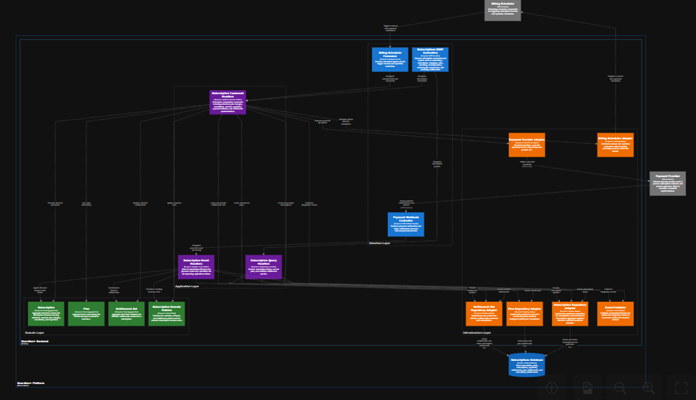

El componente `Subscriptions REST Controllers` recibe las solicitudes relacionadas con activación, renovación, cambio de plan, cancelación y consulta del estado de la suscripción, delegando su procesamiento a la capa de aplicación.

`Subscription Application Service` coordina las operaciones sobre el ciclo de vida de las suscripciones y utiliza los aggregates y políticas del dominio para mantener las reglas de negocio. Asimismo, utiliza los adaptadores de persistencia y el publicador de eventos para almacenar los cambios producidos y comunicar eventos relevantes hacia otros bounded contexts.

Para las operaciones que requieren pagos, `Payment Application Service` utiliza `Stripe Adapter`, que encapsula la comunicación con el proveedor externo Stripe. Las confirmaciones o fallos de pago regresan hacia Guardian+ mediante el `Payment Webhook Controller`.

#### 2.6.3.6. Bounded Context Software Architecture Code Level Diagrams

En esta sección se presenta la estructura interna del Bounded Context **Subscriptions** a nivel de código. Se incluyen el modelo de clases correspondiente a la Domain Layer y el diseño de persistencia utilizado como referencia para la implementación del contexto.

##### 2.6.3.6.1. Bounded Context Domain Layer Class Diagrams

El diagrama UML de la Figura 2.51 representa los principales elementos que conforman la Domain Layer de **Subscriptions**. El modelo se organiza alrededor del Aggregate Root `Subscription`, encargado de controlar el ciclo de vida de una suscripción, y del Aggregate Root `EntitlementSet`, responsable de administrar los beneficios disponibles de acuerdo con el plan vigente.

<a id="figura-2-51"></a>**Figura 2.51.** Diagrama de clases de la Domain Layer de Subscriptions

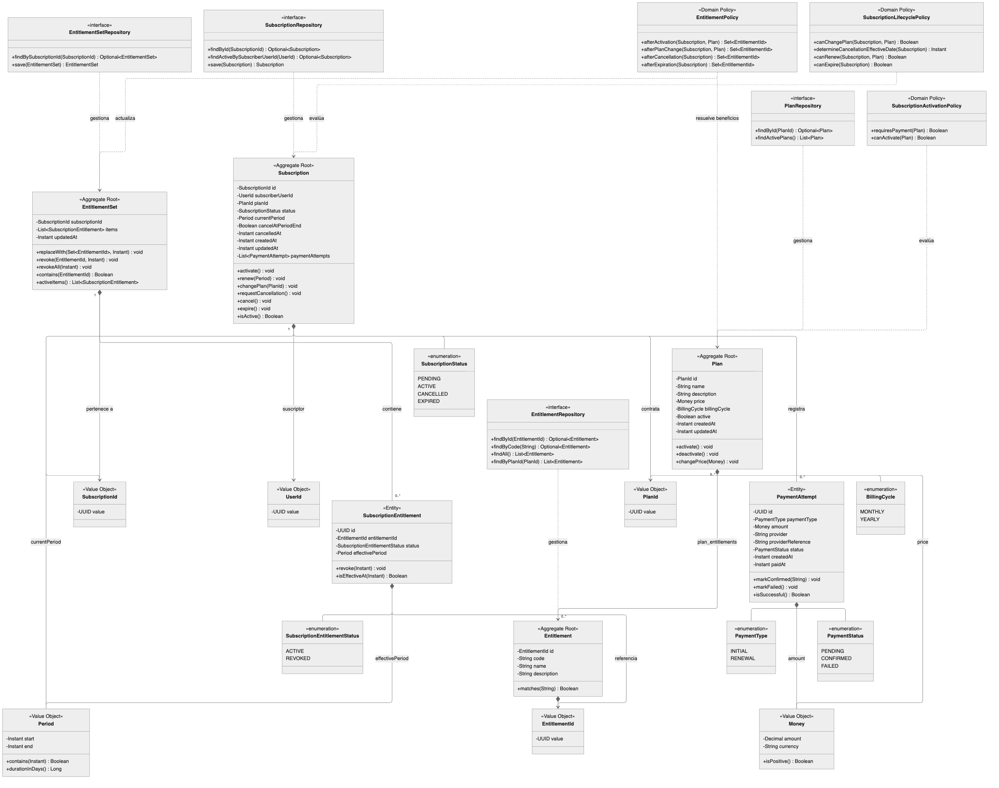

`Subscription` mantiene las reglas relacionadas con activación, renovación, cambio de plan, cancelación y expiración, y contiene la entidad `PaymentAttempt`, que registra cada intento de pago de su ciclo de vida. `Plan` y `Entitlement` son Aggregate Roots propios: el primero concentra la configuración comercial y el segundo actúa como catálogo de beneficios compartido entre planes y suscripciones.

`EntitlementSet` administra los `SubscriptionEntitlement` habilitados para una suscripción, cada uno con su estado y su periodo de vigencia. El dominio utiliza Value Objects como `SubscriptionId`, `PlanId`, `EntitlementId`, `Money` y `Period` para representar conceptos con semántica propia y evitar el uso de valores primitivos sin significado de negocio.

Los estados principales de las suscripciones, los pagos y los beneficios efectivos se representan mediante las enumeraciones `SubscriptionStatus`, `PaymentStatus` y `SubscriptionEntitlementStatus`, permitiendo controlar explícitamente las transiciones válidas dentro del dominio.

##### 2.6.3.6.2. Bounded Context Database Design Diagram

La Figura 2.52 presenta el diseño de persistencia correspondiente al Bounded Context **Subscriptions**. Las tablas reflejan las entidades y aggregates que requieren almacenamiento persistente en el backend, manteniendo las relaciones necesarias para administrar planes, suscripciones, pagos y entitlements.

<a id="figura-2-52"></a>**Figura 2.52.** Diagrama de base de datos de Subscriptions

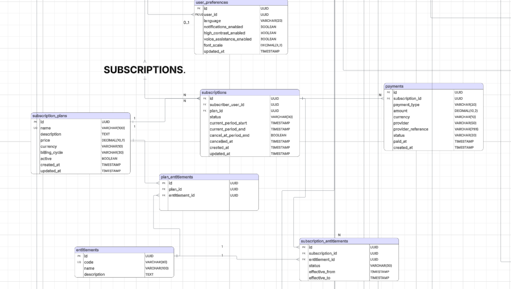

La tabla `subscriptions` constituye el elemento central del modelo de persistencia y relaciona al usuario suscriptor con el plan contratado. `subscription_plans` almacena la configuración comercial de los planes disponibles, mientras que `payments` registra las operaciones de pago asociadas al ciclo de vida de cada suscripción.

Los beneficios disponibles se representan mediante `entitlements`. La relación entre planes y beneficios se mantiene mediante `plan_entitlements`, mientras que `subscription_entitlements` permite registrar los beneficios efectivos asociados a una suscripción durante un determinado periodo.

### 2.6.4. Bounded Context: Profile

El Bounded Context **Profile** pertenece al Generic Domain de Guardian+. Su responsabilidad consiste en gestionar la información descriptiva de los usuarios, los perfiles de las personas bajo cuidado, las relaciones de cuidado entre familiares o cuidadores y la persona a su cargo, y las preferencias de idioma, accesibilidad y notificaciones de la aplicación.

Este contexto separa la información personal de la identidad y la autenticación: utiliza `UserId` únicamente como referencia externa al Bounded Context IAM y no almacena contraseñas, tokens ni credenciales. Al establecer o finalizar una relación de cuidado publica los eventos `CareRelationshipEstablished` y `CareRelationshipEnded`, que Emergency & Alerting utiliza para mantener actualizados los contactos de emergencia. La integración directa con IAM queda pendiente hasta que dicho contexto se implemente en el backend.

La arquitectura táctica se implementa sobre Java y Spring Boot con una estructura de paquetes dividida en cuatro capas: domain, interfaces, application e infrastructure. Su código se organiza en el paquete `com.healthify.guardian.platform.profile` del repositorio `guardian-plus-platform`, con la siguiente estructura:

```
com.healthify.guardian.platform.profile/
├── domain/
│   ├── model/
│   │   ├── aggregates/
│   │   ├── commands/
│   │   ├── events/
│   │   ├── queries/
│   │   └── valueobjects/
│   ├── repositories/
│   └── services/
├── interfaces/
│   └── rest/
│       ├── resources/
│       └── transform/
├── application/
│   ├── commandservices/
│   ├── internal/
│   │   ├── commandservices/
│   │   └── queryservices/
│   └── queryservices/
└── infrastructure/
    ├── configuration/
    └── persistence/
        └── jpa/
            ├── adapters/
            ├── assemblers/
            ├── converters/
            ├── entities/
            └── repositories/
```

#### 2.6.4.1. Domain Layer

La Domain Layer concentra las reglas de negocio relacionadas con la gestión de perfiles de usuario, personas bajo cuidado, relaciones de cuidado y preferencias de aplicación. Esta capa mantiene las invariantes del contexto Profile y permanece independiente de los mecanismos de persistencia y de autenticación externos.

##### Aggregates

**`UserProfile`**

Representa la información descriptiva asociada a un usuario de Guardian+. El aggregate mantiene los datos personales, información de contacto e imagen de perfil utilizados por la aplicación.

**Atributos principales:**

- `id: UserProfileId`
- `userId: UserId`
- `firstName: String`
- `lastName: String`
- `phoneNumber: String`
- `profileImageUrl: String`
- `createdAt: Instant`
- `updatedAt: Instant`

**Métodos principales:**

- `updatePersonalInformation(firstName: String, lastName: String, updatedAt: Instant): void`
- `updateContactInformation(phoneNumber: String, updatedAt: Instant): void`
- `updateProfileImage(profileImageUrl: String, updatedAt: Instant): void`

El aggregate garantiza que cada perfil permanezca asociado a un identificador de usuario mediante `UserId`, sin asumir responsabilidades relacionadas con autenticación.

**`CareRecipientProfile`**

Representa el perfil de una persona bajo cuidado dentro de Guardian+. Mantiene la información descriptiva necesaria para identificar y administrar a la persona vinculada con familiares o cuidadores.

**Atributos principales:**

- `id: CareRecipientProfileId`
- `createdByUserId: UserId`
- `firstName: String`
- `lastName: String`
- `birthDate: LocalDate`
- `profileImageUrl: String`
- `createdAt: Instant`
- `updatedAt: Instant`

**Métodos principales:**

- `updatePersonalInformation(firstName: String, lastName: String, birthDate: LocalDate, updatedAt: Instant): void`
- `updateProfileImage(profileImageUrl: String, updatedAt: Instant): void`

El aggregate permite actualizar tanto la información personal como la imagen de la persona bajo cuidado, conservando el usuario que creó originalmente el perfil mediante `createdByUserId`.

**`CareRelationship`**

Representa la relación de responsabilidad entre un usuario de Guardian+ y una persona bajo cuidado. Permite distinguir si el usuario participa como familiar o cuidador y controlar el ciclo de vida de dicha relación.

**Atributos principales:**

- `id: CareRelationshipId`
- `userId: UserId`
- `careRecipientProfileId: CareRecipientProfileId`
- `relationshipType: RelationshipType`
- `status: CareRelationshipStatus`
- `startedAt: Instant`
- `endedAt: Instant`

**Métodos principales:**

- `establish(startedAt: Instant): void`
- `end(endedAt: Instant): void`
- `isActive(): Boolean`

La relación inicia con estado `ACTIVE` y puede finalizar pasando a estado `ENDED`. Una relación finalizada deja de considerarse activa, manteniéndose su información para conservar el historial de cuidado.

**`UserPreferences`**

Representa las preferencias de aplicación, idioma y accesibilidad configuradas por un usuario de Guardian+.

**Atributos principales:**

- `userId: UserId`
- `language: Language`
- `notificationsEnabled: Boolean`
- `highContrastEnabled: Boolean`
- `reduceMotionEnabled: Boolean`
- `fontScale: FontScale`
- `updatedAt: Instant`

Las preferencias visuales iniciales utilizan español de Latinoamérica (`es-419`), tamaño de fuente predeterminado, alto contraste desactivado y reducción de movimiento desactivada. El estado inicial de las notificaciones es proporcionado por la solicitud del usuario.

**Métodos principales:**

- `updateApplicationPreferences(notificationsEnabled: Boolean, updatedAt: Instant): void`
- `updateLanguageAndAccessibilityPreferences(language: Language, highContrastEnabled: Boolean, reduceMotionEnabled: Boolean, fontScale: FontScale, updatedAt: Instant): void`

La actualización de idioma y accesibilidad se realiza como una única operación de dominio para mantener de forma consistente las preferencias asociadas a la experiencia de uso.

##### Value Objects

**`UserProfileId`**

Identificador inmutable utilizado para distinguir un perfil de usuario dentro del Bounded Context Profile.

**Atributos:**

- `value: UUID`

El identificador es generado por el propio dominio al crear un nuevo `UserProfile`.

**`CareRecipientProfileId`**

Identificador inmutable utilizado para distinguir el perfil de una persona bajo cuidado.

**Atributos:**

- `value: UUID`

El identificador es generado por el dominio al registrar un nuevo `CareRecipientProfile`.

**`CareRelationshipId`**

Identificador inmutable utilizado para distinguir una relación de cuidado.

**Atributos:**

- `value: UUID`

El identificador es generado por el dominio cuando se establece una nueva relación de cuidado.

**`UserId`**

Referencia inmutable al identificador de un usuario externo al Bounded Context Profile.

**Atributos:**

- `value: UUID`

A diferencia de los identificadores pertenecientes al propio contexto, `UserId` no es generado por Profile. Se utiliza únicamente como referencia externa hacia el usuario que posteriormente será administrado por el Bounded Context IAM.

`UserPreferences` no posee un Value Object `UserPreferencesId`; su identidad dentro del dominio se encuentra asociada directamente a `UserId`.

##### Enumerations

**`RelationshipType`**

Representa el tipo de responsabilidad existente entre un usuario y una persona bajo cuidado.

- `FAMILY`
- `CAREGIVER`

**`CareRelationshipStatus`**

Representa el estado actual del ciclo de vida de una relación de cuidado.

- `ACTIVE`
- `ENDED`

Una relación se crea inicialmente con estado `ACTIVE` y cambia a `ENDED` cuando finaliza.

**`Language`**

Representa los idiomas soportados actualmente por Guardian+.

- `SPANISH_LATIN_AMERICA` — código `es-419`
- `ENGLISH_UNITED_STATES` — código `en-US`

**`FontScale`**

Representa las opciones de tamaño de texto disponibles en las preferencias de accesibilidad.

- `SMALL`
- `DEFAULT`
- `LARGE`

El tamaño de fuente se maneja como una enumeración de opciones soportadas y no como un valor decimal arbitrario.

##### Domain Policies

**`CareRelationshipPolicy`**

Evalúa las condiciones necesarias para establecer una nueva relación de cuidado entre un usuario y una persona bajo cuidado.

La policy utiliza `CareRelationshipRepository` para comprobar que no exista previamente una relación activa entre el mismo usuario y el mismo `CareRecipientProfile`.

**Operaciones principales:**

- `canEstablishRelationship(userId: UserId, careRecipientProfileId: CareRecipientProfileId): Boolean`
- `validateRelationshipType(type: RelationshipType): void`

`canEstablishRelationship(...)` retorna `false` cuando alguno de los identificadores es inválido o cuando ya existe una relación activa entre ambos participantes.

`validateRelationshipType(...)` garantiza que el tipo de relación proporcionado sea válido dentro del dominio.

##### Commands & Queries (Domain Model)

Los comandos representan intenciones de modificación del estado del dominio, mientras que las queries permiten recuperar información sin modificar los Aggregate Roots.

**Commands:**

- `CreateUserProfileCommand(UUID userId, String firstName, String lastName, String phoneNumber, String profileImageUrl)`

- `UpdateUserProfileCommand(UUID userProfileId, String firstName, String lastName)`

- `UpdateContactInformationCommand(UUID userProfileId, String phoneNumber)`

- `UpdateUserProfileImageCommand(UUID userProfileId, String profileImageUrl)`

- `CreateCareRecipientProfileCommand(UUID createdByUserId, String firstName, String lastName, LocalDate birthDate, String profileImageUrl)`

- `UpdateCareRecipientProfileCommand(UUID careRecipientProfileId, String firstName, String lastName, LocalDate birthDate)`

- `UpdateCareRecipientProfileImageCommand(UUID careRecipientProfileId, String profileImageUrl)`

- `EstablishCareRelationshipCommand(UUID userId, UUID careRecipientProfileId, RelationshipType relationshipType)`

- `EndCareRelationshipCommand(UUID careRelationshipId)`

- `UpdateApplicationPreferencesCommand(UUID userId, boolean notificationsEnabled)`

- `UpdateLanguageAndAccessibilityPreferencesCommand(UUID userId, Language language, boolean highContrastEnabled, boolean reduceMotionEnabled, FontScale fontScale)`

**Queries:**

- `GetUserProfileByUserIdQuery(UserId userId)`

- `GetCareRecipientProfileQuery(CareRecipientProfileId careRecipientProfileId)`

- `GetCareRecipientProfilesByCreatedByUserIdQuery(UserId createdByUserId)`

- `GetCareRelationshipsByUserIdQuery(UserId userId)`

- `GetCareRelationshipsByCareRecipientProfileIdQuery(CareRecipientProfileId careRecipientProfileId)`

- `GetUserPreferencesQuery(UserId userId)`

La separación entre commands y queries permite que la Application Layer coordine las operaciones del contexto manteniendo las reglas de negocio dentro de los Aggregate Roots y Domain Services.

##### Domain Events

El Bounded Context Profile registra eventos de dominio cuando ocurren cambios relevantes sobre sus aggregates.

- `ProfileCreatedEvent`: registrado cuando se crea el perfil descriptivo asociado a un usuario.

- `ProfileUpdatedEvent`: registrado cuando se actualiza la información personal de un perfil de usuario.

- `ContactInformationUpdatedEvent`: registrado cuando cambia la información de contacto de un usuario.

- `CareRecipientProfileCreatedEvent`: registrado cuando se crea el perfil de una nueva persona bajo cuidado.

- `CareRelationshipEstablishedEvent`: registrado cuando se establece una nueva relación de cuidado.

- `CareRelationshipEndedEvent`: registrado cuando una relación activa pasa al estado `ENDED`.

- `ApplicationPreferencesUpdatedEvent`: registrado cuando se crean o modifican las preferencias generales de aplicación, como el estado de las notificaciones.

- `LanguageAndAccessibilityPreferencesUpdatedEvent`: registrado cuando cambian el idioma, alto contraste, reducción de movimiento o tamaño de fuente.

Los repositorios JPA recuperan los eventos registrados por los Aggregate Roots después de persistir su estado y utilizan el mecanismo de publicación de eventos de Spring para comunicarlos dentro de la aplicación.

La implementación actual no define Event Handler classes específicas dentro del Bounded Context Profile; la publicación de los eventos queda preparada para futuras integraciones con otros contextos.

##### Repositories (Domain Interfaces)

**`UserProfileRepository`**

Abstracción utilizada para recuperar y persistir perfiles de usuario.

**Operaciones principales:**

- `save(profile: UserProfile): UserProfile`

- `findById(id: UserProfileId): Optional<UserProfile>`

- `findByUserId(userId: UserId): Optional<UserProfile>`

**`CareRecipientProfileRepository`**

Abstracción utilizada para recuperar y persistir perfiles de personas bajo cuidado.

**Operaciones principales:**

- `save(profile: CareRecipientProfile): CareRecipientProfile`

- `findById(id: CareRecipientProfileId): Optional<CareRecipientProfile>`

- `findByCreatedByUserId(userId: UserId): List<CareRecipientProfile>`

**`CareRelationshipRepository`**

Abstracción utilizada para recuperar y persistir las relaciones de cuidado.

**Operaciones principales:**

- `save(relationship: CareRelationship): CareRelationship`

- `findById(id: CareRelationshipId): Optional<CareRelationship>`

- `findActiveByUserId(userId: UserId): List<CareRelationship>`

- `findActiveByCareRecipientId(careRecipientProfileId: CareRecipientProfileId): List<CareRelationship>`

**`UserPreferencesRepository`**

Abstracción utilizada para recuperar y persistir las preferencias asociadas a cada usuario.

**Operaciones principales:**

- `save(preferences: UserPreferences): UserPreferences`

- `findByUserId(userId: UserId): Optional<UserPreferences>`

El modelo de dominio utiliza identificadores tipados para los elementos que pertenecen a Profile y mantiene `UserId` como referencia externa. En la implementación actual no existe `UserPreferencesId`, ya que las preferencias se encuentran asociadas directamente al usuario.

#### 2.6.4.2. Interface Layer

La Interface Layer expone las capacidades del Bounded Context **Profile** mediante una API REST. Esta capa recibe las solicitudes HTTP, valida los recursos de entrada y los transforma en comandos o consultas que son delegados a la Application Layer.

Los controllers no contienen reglas de negocio ni acceden directamente a la persistencia. Su responsabilidad consiste en actuar como punto de entrada hacia los casos de uso del contexto.

##### REST Controllers

**`UserProfilesController`**

Expone las operaciones relacionadas con la creación, consulta y actualización del perfil descriptivo de un usuario.

**Operaciones principales:**

- `POST /api/v1/user-profiles`

Crea un nuevo perfil de usuario utilizando la información personal, de contacto e imagen proporcionada.

- `GET /api/v1/user-profiles/user/{userId}`

Obtiene el perfil asociado a un determinado `UserId`.

- `PUT /api/v1/user-profiles/{userProfileId}`

Actualiza el nombre y apellido de un perfil existente.

- `PUT /api/v1/user-profiles/{userProfileId}/contact-information`

Actualiza la información de contacto asociada al perfil.

- `PUT /api/v1/user-profiles/{userProfileId}/profile-image`

Actualiza la imagen de perfil del usuario.

**Relaciones principales:**

- recibe recursos HTTP desde los clientes de Guardian+;

- transforma las solicitudes en commands y queries del Bounded Context Profile;

- delega las operaciones a `UserProfileCommandService` y `UserProfileQueryService`;

- utiliza `UserId` como referencia externa sin administrar credenciales ni mecanismos de autenticación;

- transforma los resultados del dominio en recursos REST antes de devolver la respuesta al cliente.


**`CareRecipientProfilesController`**

Expone las operaciones relacionadas con las personas bajo cuidado registradas dentro de Guardian+.

**Operaciones principales:**

- `POST /api/v1/care-recipient-profiles`

Registra un nuevo perfil de persona bajo cuidado.

- `GET /api/v1/care-recipient-profiles/{careRecipientProfileId}`

Obtiene un `CareRecipientProfile` mediante su identificador.

- `GET /api/v1/care-recipient-profiles/created-by/{userId}`

Obtiene la lista de perfiles de personas bajo cuidado registrados por un determinado usuario.

- `PUT /api/v1/care-recipient-profiles/{careRecipientProfileId}`

Actualiza la información personal de una persona bajo cuidado, incluyendo nombres y fecha de nacimiento.

- `PUT /api/v1/care-recipient-profiles/{careRecipientProfileId}/profile-image`

Actualiza la imagen de perfil de una persona bajo cuidado.

**Relaciones principales:**

- delega las operaciones de modificación a `CareRecipientProfileCommandService`;

- utiliza `CareRecipientProfileQueryService` para recuperar uno o varios perfiles;

- utiliza `CareRecipientProfileId` como identificador propio del contexto;

- mantiene `createdByUserId` como referencia al usuario que registró originalmente a la persona bajo cuidado;

- no accede directamente a la tabla `care_recipient_profiles`.


**`CareRelationshipsController`**

Expone las operaciones utilizadas para administrar las relaciones de cuidado existentes entre usuarios y personas bajo cuidado.

**Operaciones principales:**

- `POST /api/v1/care-relationships`

Establece una nueva relación de cuidado entre un usuario y un `CareRecipientProfile`.

- `GET /api/v1/care-relationships/user/{userId}`

Obtiene las relaciones activas asociadas a un determinado usuario.

- `GET /api/v1/care-relationships/care-recipient/{careRecipientProfileId}`

Obtiene las relaciones activas asociadas a una determinada persona bajo cuidado.

- `DELETE /api/v1/care-relationships/{careRelationshipId}`

Finaliza una relación de cuidado existente.

La operación de finalización no elimina físicamente la relación. El Aggregate Root cambia su estado de `ACTIVE` a `ENDED`, permitiendo conservar el historial de la relación.

**Relaciones principales:**

- delega el establecimiento y finalización de relaciones a `CareRelationshipCommandService`;

- utiliza `CareRelationshipQueryService` para consultar las relaciones activas;

- las reglas necesarias para evitar relaciones activas duplicadas son evaluadas por la Domain Layer;

- no modifica directamente la tabla `care_relationships`.


**`UserPreferencesController`**

Expone las operaciones necesarias para consultar y modificar las preferencias de aplicación, idioma y accesibilidad de cada usuario.

**Operaciones principales:**

- `GET /api/v1/user-preferences/user/{userId}`

Obtiene las preferencias configuradas para un determinado usuario.

- `PUT /api/v1/user-preferences/user/{userId}/application`

Actualiza las preferencias generales de aplicación, actualmente representadas por el estado de las notificaciones.

- `PUT /api/v1/user-preferences/user/{userId}/language-accessibility`

Actualiza conjuntamente el idioma y las preferencias de accesibilidad: alto contraste, reducción de movimiento y tamaño de fuente.

**Relaciones principales:**

- delega las operaciones de modificación a `UserPreferencesCommandService`;

- utiliza `UserPreferencesQueryService` para recuperar las preferencias existentes;

- mantiene las preferencias asociadas directamente a `UserId`;

- no modifica directamente la tabla `user_preferences`.


##### Resources & Assemblers

La Interface Layer utiliza recursos REST para representar la información recibida y enviada por la API.

Entre los principales recursos de entrada se encuentran:

- `CreateUserProfileResource`
- `UpdateUserProfileResource`
- `UpdateContactInformationResource`
- `UpdateProfileImageResource`
- `CreateCareRecipientProfileResource`
- `UpdateCareRecipientProfileResource`
- `EstablishCareRelationshipResource`
- `UpdateApplicationPreferencesResource`
- `UpdateLanguageAndAccessibilityPreferencesResource`

Los recursos de salida principales son:

- `UserProfileResource`
- `CareRecipientProfileResource`
- `CareRelationshipResource`
- `UserPreferencesResource`

Los Transform Assemblers convierten estos recursos en los Commands correspondientes y transforman los Aggregate Roots recuperados por la Application Layer en los recursos devueltos por la API.

Esta separación evita que las clases propias del dominio sean expuestas directamente a través de la interfaz HTTP.

#### 2.6.4.3. Application Layer

La Application Layer coordina los casos de uso del Bounded Context **Profile** y actúa como intermediaria entre la Interface Layer y el modelo de dominio.

Esta capa recibe Commands y Queries provenientes de los controllers, recupera los Aggregate Roots requeridos mediante Repository Interfaces y delega las reglas de negocio a los propios aggregates y Domain Services.

La implementación se organiza mediante Command Services para operaciones que modifican el estado del dominio y Query Services para operaciones de consulta.

##### Command Services

**`UserProfileCommandService`**

Define las operaciones de aplicación relacionadas con la creación y modificación de perfiles de usuario.

Su implementación concreta, `UserProfileCommandServiceImpl`, coordina los siguientes casos de uso:

- creación de un nuevo `UserProfile`;

- actualización de información personal;

- actualización de información de contacto;

- actualización de la imagen de perfil.

Durante la creación, el servicio verifica que no exista previamente un perfil asociado al mismo `UserId`.

Las validaciones propias del perfil permanecen dentro del Aggregate Root `UserProfile`, mientras que el servicio coordina la búsqueda y persistencia mediante `UserProfileRepository`.


**`CareRecipientProfileCommandService`**

Define las operaciones relacionadas con la creación y actualización de perfiles de personas bajo cuidado.

Su implementación `CareRecipientProfileCommandServiceImpl` coordina:

- creación de un nuevo `CareRecipientProfile`;

- actualización de nombres y fecha de nacimiento;

- actualización de la imagen del perfil.

El servicio recupera el Aggregate Root correspondiente mediante `CareRecipientProfileRepository`, ejecuta la operación de dominio requerida y persiste posteriormente su nuevo estado.


**`CareRelationshipCommandService`**

Coordina los casos de uso relacionados con el ciclo de vida de una relación de cuidado.

Su implementación `CareRelationshipCommandServiceImpl` permite:

- establecer una nueva relación entre un usuario y una persona bajo cuidado;

- finalizar una relación de cuidado existente.

Antes de establecer una nueva relación utiliza `CareRelationshipPolicy` para comprobar que no exista ya una relación activa entre el mismo usuario y el mismo `CareRecipientProfile`.

La finalización de una relación no elimina el aggregate. Se ejecuta la operación `end(...)`, que modifica su estado de `ACTIVE` a `ENDED`.


**`UserPreferencesCommandService`**

Coordina las operaciones de modificación de las preferencias asociadas a un usuario.

Su implementación `UserPreferencesCommandServiceImpl` permite:

- crear o actualizar las preferencias generales de aplicación mediante `UpdateApplicationPreferencesCommand`;

- actualizar conjuntamente idioma y accesibilidad mediante `UpdateLanguageAndAccessibilityPreferencesCommand`.

Cuando todavía no existen preferencias para un usuario, la actualización de preferencias generales puede originar la creación inicial del Aggregate Root `UserPreferences`.

La operación de idioma y accesibilidad actúa sobre preferencias previamente existentes.


##### Query Services

Los Query Services recuperan información del dominio sin modificar el estado de los Aggregate Roots.

**`UserProfileQueryService`**

Su implementación `UserProfileQueryServiceImpl` recupera el perfil asociado a un usuario mediante `UserId`.

Utiliza `UserProfileRepository` como abstracción de persistencia.


**`CareRecipientProfileQueryService`**

Su implementación `CareRecipientProfileQueryServiceImpl` permite:

- recuperar un `CareRecipientProfile` mediante su identificador;

- recuperar la colección de perfiles registrados por un determinado usuario mediante `createdByUserId`.


**`CareRelationshipQueryService`**

Su implementación `CareRelationshipQueryServiceImpl` permite consultar:

- las relaciones activas asociadas a un usuario;

- las relaciones activas asociadas a una persona bajo cuidado.

Estas operaciones utilizan `CareRelationshipRepository` para recuperar las relaciones que permanecen en estado `ACTIVE`.


**`UserPreferencesQueryService`**

Su implementación `UserPreferencesQueryServiceImpl` recupera las preferencias asociadas a un determinado `UserId`.

La consulta se realiza mediante `UserPreferencesRepository`.


##### Application Error Handling

Los Command Services utilizan la abstracción compartida `Result` para representar el resultado de las operaciones de aplicación.

Cuando una operación finaliza correctamente se devuelve un resultado exitoso. En situaciones de error se utilizan objetos `ApplicationError`, permitiendo representar de forma consistente casos como:

- errores de validación;

- recursos no encontrados;

- conflictos de negocio;

- violaciones de reglas del dominio.

Los mensajes de error son resueltos mediante `MessageResolver`, permitiendo mantener soporte de internacionalización para los mensajes definidos por Profile.


##### Domain Events in the Application Flow

Los Aggregate Roots de Profile registran Domain Events cuando ocurre un cambio relevante en su estado.

Después de persistir un aggregate, las implementaciones de los repositorios pueden recuperar los eventos registrados y publicarlos utilizando el mecanismo de eventos de Spring.

En el estado actual del backend no existen clases específicas de tipo `EventHandler` dentro del Bounded Context Profile. Por ello, dichos handlers no se presentan como componentes implementados en esta capa.

La publicación de eventos queda disponible para permitir futuras integraciones con otros Bounded Contexts conforme avance la implementación del backend.


#### 2.6.4.4. Infrastructure Layer

La Infrastructure Layer contiene las implementaciones técnicas necesarias para persistir y recuperar la información administrada por el Bounded Context **Profile**.

Esta capa implementa las Repository Interfaces definidas por el dominio utilizando Spring Data JPA, entidades de persistencia, assemblers y converters. También contiene la configuración necesaria para proporcionar dependencias técnicas utilizadas por la Application y Domain Layer.

La implementación mantiene separados los Aggregate Roots del modelo de dominio de las entidades utilizadas para representar la información en la base de datos.

##### Persistence JPA Entities

La persistencia del contexto se organiza alrededor de cuatro entidades principales, correspondientes a los cuatro Aggregate Roots implementados.

**`UserProfilePersistenceEntity`**

Representa la persistencia de `UserProfile` en la tabla `user_profiles`.

Entre sus principales datos se encuentran:

- `id`

- `user_id`

- `first_name`

- `last_name`

- `phone_number`

- `profile_image_url`

- `created_at`

- `updated_at`

La entidad almacena únicamente información descriptiva del usuario y utiliza `user_id` como referencia externa.


**`CareRecipientProfilePersistenceEntity`**

Representa la persistencia de `CareRecipientProfile` en la tabla `care_recipient_profiles`.

Entre sus principales datos se encuentran:

- `id`

- `created_by_user_id`

- `first_name`

- `last_name`

- `birth_date`

- `profile_image_url`

- `created_at`

- `updated_at`

`created_by_user_id` permite conservar la referencia hacia el usuario que registró originalmente a la persona bajo cuidado.


**`CareRelationshipPersistenceEntity`**

Representa las relaciones de cuidado almacenadas en la tabla `care_relationships`.

Entre sus principales datos se encuentran:

- `id`

- `user_id`

- `care_recipient_profile_id`

- `relationship_type`

- `status`

- `started_at`

- `ended_at`

Los valores de `relationship_type` representan los tipos `FAMILY` y `CAREGIVER`, mientras que `status` representa los estados `ACTIVE` y `ENDED`.

La finalización de una relación actualiza su estado y `ended_at` en lugar de eliminar físicamente el registro.


**`UserPreferencesPersistenceEntity`**

Representa las preferencias de un usuario mediante la tabla `user_preferences`.

La identidad persistente de estas preferencias corresponde al mismo UUID del `UserId`, por lo que no se utiliza un `UserPreferencesId` independiente.

Entre los datos persistidos se encuentran:

- `user_id`

- `language`

- `notifications_enabled`

- `high_contrast_enabled`

- `reduce_motion_enabled`

- `font_scale`

- `updated_at`

La propiedad `reduce_motion_enabled` corresponde a la preferencia de accesibilidad utilizada actualmente por Guardian+, reemplazando la referencia anterior a `voice_assistance_enabled`.

Los valores de `language` y `font_scale` se corresponden con las enumeraciones definidas por el dominio.


##### Persistence Converters

La implementación actual utiliza converters específicos cuando es necesario traducir Value Objects del dominio hacia representaciones compatibles con JPA.

Los converters implementados son:

- `UserIdPersistenceConverter`

Convierte entre `UserId` y su representación `UUID` utilizada por la persistencia.

- `CareRecipientProfileIdPersistenceConverter`

Convierte entre `CareRecipientProfileId` y su representación `UUID`.

Las enumeraciones como `RelationshipType`, `CareRelationshipStatus`, `Language` y `FontScale` no poseen clases converter independientes dentro de la implementación actual.


##### Persistence Assemblers

Los Persistence Assemblers mantienen separadas las estructuras del dominio y las estructuras utilizadas por JPA.

Se implementan los siguientes assemblers:

- `UserProfilePersistenceAssembler`

- `CareRecipientProfilePersistenceAssembler`

- `CareRelationshipPersistenceAssembler`

- `UserPreferencesPersistenceAssembler`

Cada assembler proporciona las transformaciones necesarias entre el Aggregate Root correspondiente y su Persistence Entity.

De esta manera, las clases del dominio no dependen directamente de las anotaciones ni de las entidades utilizadas por JPA.


##### Repository Implementations

**`UserProfileRepositoryImpl`**

Implementa `UserProfileRepository` y administra la persistencia de `UserProfile`.

**Responsabilidades principales:**

- persistir perfiles de usuario;

- recuperar perfiles mediante `UserProfileId`;

- recuperar el perfil asociado a un determinado `UserId`;

- transformar entre dominio y persistencia mediante `UserProfilePersistenceAssembler`.


**`CareRecipientProfileRepositoryImpl`**

Implementa `CareRecipientProfileRepository` y administra la persistencia de perfiles de personas bajo cuidado.

**Responsabilidades principales:**

- persistir la creación y actualización de un `CareRecipientProfile`;

- recuperar un perfil mediante `CareRecipientProfileId`;

- recuperar los perfiles registrados por un determinado `UserId`;

- utilizar `CareRecipientProfilePersistenceAssembler` para mantener separados dominio y persistencia.


**`CareRelationshipRepositoryImpl`**

Implementa `CareRelationshipRepository` y administra la persistencia del ciclo de vida de las relaciones de cuidado.

**Responsabilidades principales:**

- persistir nuevas relaciones;

- persistir el cambio de estado de `ACTIVE` a `ENDED`;

- recuperar relaciones mediante `CareRelationshipId`;

- recuperar relaciones activas asociadas a un usuario;

- recuperar relaciones activas asociadas a una persona bajo cuidado;

- transformar los modelos mediante `CareRelationshipPersistenceAssembler`.


**`UserPreferencesRepositoryImpl`**

Implementa `UserPreferencesRepository` y administra las preferencias asociadas a cada usuario.

**Responsabilidades principales:**

- persistir la creación o modificación de preferencias;

- recuperar preferencias mediante `UserId`;

- persistir idioma, notificaciones, alto contraste, reducción de movimiento y tamaño de fuente;

- transformar entre `UserPreferences` y `UserPreferencesPersistenceEntity` mediante `UserPreferencesPersistenceAssembler`.


##### Spring Data JPA Repositories

Las Repository Implementations utilizan interfaces de Spring Data JPA para realizar las operaciones sobre la base de datos.

Se encuentran implementadas:

- `UserProfilePersistenceRepository`

- `CareRecipientProfilePersistenceRepository`

- `CareRelationshipPersistenceRepository`

- `UserPreferencesPersistenceRepository`

Estas interfaces contienen las consultas necesarias para localizar los registros utilizados por las Repository Implementations sin exponer directamente detalles de persistencia hacia la Domain Layer.


##### Domain Event Publishing

Los Aggregate Roots registran Domain Events cuando ocurre una modificación relevante de su estado.

Al persistir un aggregate, las implementaciones de repositorio recuperan los eventos registrados antes de limpiarlos del Aggregate Root y utilizan el mecanismo de publicación de eventos proporcionado por Spring para publicarlos dentro de la aplicación.

Este mecanismo permite mantener desacoplada la generación de eventos del modelo de dominio respecto de su publicación técnica.

Actualmente no existe una clase independiente denominada `ProfileEventPublisher`; la publicación se realiza desde las implementaciones de los repositorios mediante la infraestructura de eventos de Spring.


##### Profile Configuration

`ProfileConfiguration` centraliza la configuración técnica necesaria para algunos componentes del Bounded Context.

Entre sus responsabilidades se encuentran:

- proporcionar un `Clock` mediante `Clock.systemUTC()` para que los servicios de aplicación puedan trabajar con timestamps de manera consistente;

- registrar `CareRelationshipPolicy` proporcionando su dependencia `CareRelationshipRepository`.

Esto permite utilizar dichas dependencias mediante inyección sin introducir componentes de infraestructura directamente dentro del modelo de dominio.


##### Integration with IAM

Profile mantiene `UserId` como referencia externa hacia la identidad del usuario, pero no almacena contraseñas, tokens ni información de autenticación.

En el estado actual del backend no existe todavía un Bounded Context IAM implementado en la rama `develop`. Por esta razón, tampoco se encuentra implementado un `IAMQueryAdapter`, `IdentityReferenceAdapter` o componente equivalente dentro de Profile.

La validación directa de referencias contra IAM queda pendiente para una etapa posterior de implementación, una vez que dicho Bounded Context proporcione una interfaz pública que pueda ser consumida sin generar acoplamiento directo entre los modelos internos de ambos contextos.

Esta decisión mantiene preparado el diseño para una futura integración sin incorporar actualmente dependencias hacia componentes inexistentes.

#### 2.6.4.5. Bounded Context Software Architecture Component Level Diagrams

La Figura 2.53 presenta la arquitectura a nivel de componentes propuesta para el Bounded Context **Profile**. La vista representa la organización general necesaria para administrar perfiles de usuario, perfiles de personas bajo cuidado, relaciones de cuidado y preferencias de aplicación.

<a id="figura-2-53"></a>**Figura 2.53.** Diagrama de componentes del Bounded Context Profile

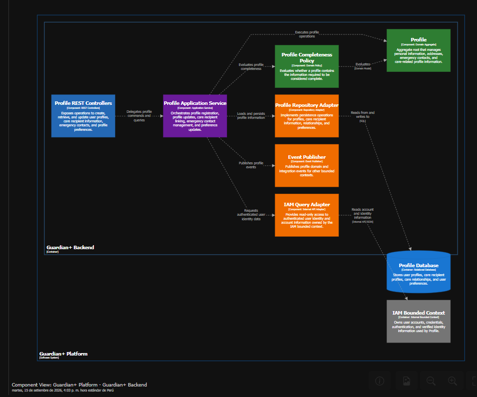

La **Interface Layer** se representa mediante los componentes REST responsables de exponer las operaciones del contexto hacia los clientes de Guardian+. En la implementación actual estas responsabilidades se encuentran distribuidas entre `UserProfilesController`, `CareRecipientProfilesController`, `CareRelationshipsController` y `UserPreferencesController`.

Las solicitudes recibidas son delegadas hacia la Application Layer, implementada mediante Command Services y Query Services específicos para cada Aggregate Root. Esta capa coordina los casos de uso sin incorporar directamente las reglas propias del dominio.

La lógica principal del dominio se concentra en cuatro Aggregate Roots: `UserProfile`, `CareRecipientProfile`, `CareRelationship` y `UserPreferences`. Adicionalmente, `CareRelationshipPolicy` encapsula la regla que evita establecer relaciones activas duplicadas entre un mismo usuario y una misma persona bajo cuidado.

El diagrama conserva algunos elementos correspondientes al diseño arquitectónico planteado para etapas posteriores del proyecto. En particular, la integración directa mediante un adaptador hacia IAM permanece pendiente debido a que dicho Bounded Context todavía no se encuentra implementado en el backend actual. Profile mantiene por el momento `UserId` únicamente como referencia externa.

La **Infrastructure Layer** implementada actualmente incluye los Repository Adapters, entidades JPA, Persistence Repositories, Persistence Assemblers, converters requeridos y la configuración técnica del contexto. La persistencia se realiza sobre las tablas propias de Profile y los Domain Events registrados por los Aggregate Roots son publicados utilizando la infraestructura de eventos proporcionada por Spring.

De esta manera, el diagrama se mantiene como representación arquitectónica del contexto, mientras que la implementación desarrollada para el presente avance cubre las capacidades principales de Profile y deja las integraciones dependientes de otros Bounded Contexts para los siguientes incrementos.

#### 2.6.4.6. Bounded Context Software Architecture Code Level Diagrams

En esta sección se documenta la estructura interna del Bounded Context **Profile** a nivel de código. Los diagramas se mantienen como referencia del diseño planteado para el contexto y se complementan con la descripción de los elementos efectivamente implementados durante el presente Sprint.

##### 2.6.4.6.1. Bounded Context Domain Layer Class Diagrams

El diagrama UML de la Figura 2.54 presenta la organización general de la Domain Layer de **Profile**.

<a id="figura-2-54"></a>**Figura 2.54.** Diagrama de clases de la Domain Layer de Profile

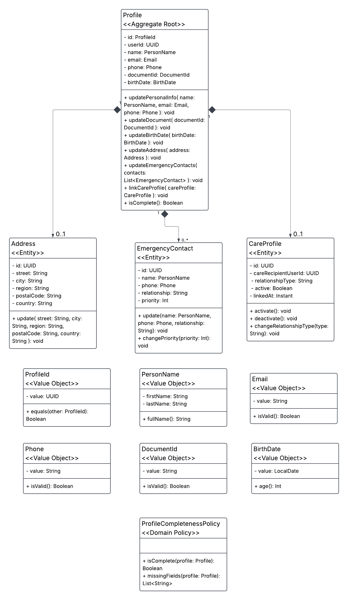

`UserProfile` mantiene la información descriptiva de un usuario de Guardian+ y `CareRecipientProfile` la de una persona bajo cuidado. `CareRelationship` vincula a ambos indicando el tipo de relación y su vigencia, mientras que `UserPreferences` concentra las preferencias de idioma y accesibilidad de cada usuario. Los contactos de emergencia no pertenecen a este contexto: son gobernados por `Emergency & Alerting`, que los mantiene sincronizados a partir de los eventos de relación de cuidado.

El dominio utiliza los Value Objects `UserProfileId`, `CareRecipientProfileId`, `CareRelationshipId`, `UserPreferencesId`, `FontScale` y `UserId` —este último como referencia a la identidad administrada por IAM— para representar conceptos que poseen validaciones y comportamiento propios.


##### 2.6.4.6.2. Bounded Context Database Design Diagram

La Figura 2.55 representa el diseño de persistencia correspondiente al Bounded Context **Profile**. Las tablas reflejan la información que debe almacenarse en el backend para administrar perfiles, personas bajo cuidado, relaciones de cuidado y preferencias.

<a id="figura-2-55"></a>**Figura 2.55.** Diagrama de base de datos de Profile

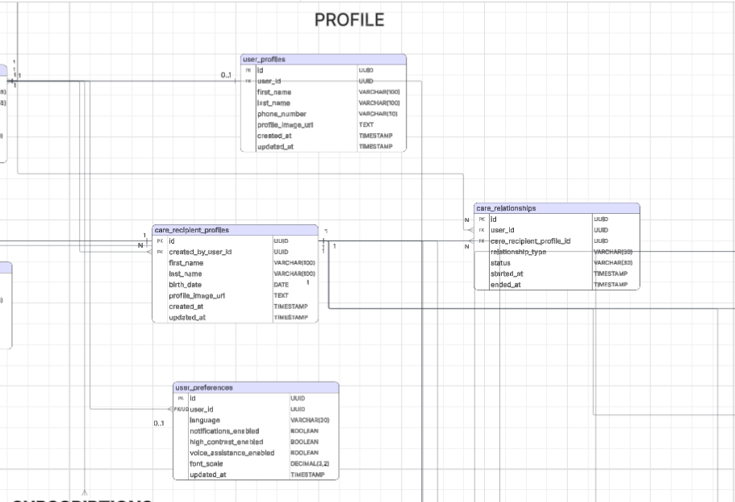

`user_profiles` almacena la información descriptiva asociada a las cuentas administradas por IAM, mientras que `care_recipient_profiles` representa las personas bajo cuidado registradas en Guardian+.

La relación entre usuarios y personas bajo cuidado se representa mediante `care_relationships`, permitiendo establecer asociaciones entre familiares o cuidadores y los perfiles correspondientes. Finalmente, `user_preferences` mantiene las configuraciones de idioma, accesibilidad y experiencia de uso asociadas a cada usuario.

### 2.6.5. Bounded Context: Care Routines & Wellness

El Bounded Context **Care Routines & Wellness** pertenece al Supporting Domain de Guardian+. Su responsabilidad consiste en asegurar que las rutinas de bienestar de la persona bajo cuidado se cumplan: recordatorios de medicación, citas médicas, actividad física e hidratación; registro y clasificación de ciclos de sueño; detección de inactividad física prolongada; y control del stock de medicamentos con sugerencia de reabastecimiento.

Este contexto recibe la telemetría de actividad y de sueño del wearable mediante sus consumidores de mensajes y publica los eventos de integración `ProlongedInactivityDetected`, `ReminderReissued` y `MedicationRestockSuggested`, que Emergency & Alerting consume para notificar al cuidador o al familiar. Care Routines & Wellness no evalúa signos vitales ni gestiona el escalamiento de las alertas.

La arquitectura táctica se implementa sobre Java y Spring Boot con una estructura de paquetes dividida en cuatro capas: domain, interfaces, application e infrastructure. Su código se organiza en el paquete `com.healthify.guardian.platform.careroutineswellness` del repositorio `guardian-plus-platform`, con la siguiente estructura:

```
com.healthify.guardian.platform.careroutineswellness/
├── domain/
│   ├── model/
│   │   ├── aggregates/
│   │   ├── commands/
│   │   ├── events/
│   │   ├── queries/
│   │   └── valueobjects/
│   ├── repositories/
│   └── services/
├── interfaces/
│   ├── events/
│   ├── messaging/
│   └── rest/
│       ├── resources/
│       └── transform/
├── application/
│   ├── commandservices/
│   ├── internal/
│   │   ├── commandservices/
│   │   ├── eventhandlers/
│   │   └── queryservices/
│   └── queryservices/
└── infrastructure/
    ├── configuration/
    ├── messaging/
    ├── persistence/
    │   └── jpa/
    │       ├── adapters/
    │       ├── assemblers/
    │       ├── converters/
    │       ├── entities/
    │       └── repositories/
    └── scheduling/
```

#### 2.6.5.1. Domain Layer

Encapsula la lógica pura de rutina y bienestar, las invariantes de ciclo de vida de cada recordatorio y las decisiones de programación temporal embebidas en los propios agregados, Value Objects y Domain Services.

##### Aggregates

*   **Reminder**
    *   Agregado raíz principal que representa un recordatorio individual de rutina (medicación, cita médica, actividad física o hidratación) y su ciclo de vida completo.
    *   Hereda de `AbstractDomainAggregateRoot<Reminder>` para registrar y publicar eventos de dominio.
    *   Protege las transiciones válidas de estado; delega en `ReminderIssuancePolicy` y `ReminderReissuePolicy` la decisión de cuándo emitir, suprimir o reemitir, sin evaluar dichas condiciones por sí mismo.
    *   *Atributos:*
        *   `id: ReminderId`
        *   `personUnderCareId: PersonUnderCareId`
        *   `type: ReminderType`
        *   `scheduledTime: Instant`
        *   `issuedAt: Instant`
        *   `status: ReminderStatus`
        *   `reissueCount: Integer`
    *   *Métodos:*
        *   `Reminder(ScheduleReminderCommand command)`
        *   `issue(IssuanceOutcome outcome, Instant currentTime): void`
        *   `confirm(): void`
        *   `cancel(): void`
        *   `reissue(): void`
        *   `isActive(): Boolean`

*   **SleepCycleRecord**
    *   Agregado raíz que representa un ciclo de sueño cerrado del adulto mayor, persona con discapacidad o en situación de dependencia.
    *   *Atributos:*
        *   `id: SleepCycleRecordId`
        *   `personUnderCareId: PersonUnderCareId`
        *   `startTime: Instant`
        *   `endTime: Instant`
        *   `interruptionCount: Integer`
        *   `classification: SleepClassification`
    *   *Métodos:*
        *   `SleepCycleRecord(RecordSleepCycleCommand command)`
        *   `classify(): SleepClassification`

*   **ActivityMonitor**
    *   Agregado raíz que representa el estado de actividad física de una persona bajo cuidado a lo largo del día.
    *   *Atributos:*
        *   `id: ActivityMonitorId`
        *   `personUnderCareId: PersonUnderCareId`
        *   `status: ActivityStatus`
        *   `inactivitySince: Instant`
    *   *Métodos:*
        *   `recordProlongedInactivity(Instant detectedAt): void`
        *   `recordActivityResumed(Instant resumedAt): void`
        *   `isInactive(): Boolean`

*   **MedicationStock**
    *   Agregado raíz que representa el balance de dosis restantes de un tratamiento de medicación y determina, junto a `MedicationStockPolicy`, cuándo corresponde sugerir su reabastecimiento.
    *   *Atributos:*
        *   `id: MedicationStockId`
        *   `personUnderCareId: PersonUnderCareId`
        *   `remainingDoses: Integer`
        *   `dailyConsumption: Decimal`
        *   `lastAcquisitionDate: Instant`
    *   *Métodos:*
        *   `registerConsumption(Integer dosesConsumed): void`
        *   `confirmAcquisition(Integer dosesAdded): void`
        *   `remainingDaysOfSupply(): Decimal`

##### Value Objects

*   **ReminderId:** Identificador inmutable de un recordatorio.
*   **SleepCycleRecordId:** Identificador inmutable de un ciclo de sueño registrado.
*   **ActivityMonitorId:** Identificador inmutable de un monitor de actividad.
*   **MedicationStockId:** Identificador inmutable de un control de stock de medicación.
*   **PersonUnderCareId:** Identificador de referencia inmutable a la persona bajo cuidado; evita incorporar directamente el modelo del contexto Profile dentro de Care Routines & Wellness.
*   **ReminderType:** Enum (`MEDICATION`, `APPOINTMENT`, `PHYSICAL_ACTIVITY`, `HYDRATION`).
*   **ReminderStatus:** Enum (`SCHEDULED`, `ISSUED`, `CONFIRMED`, `CANCELLED`, `REISSUED`, `SUPPRESSED`).
*   **ActivityStatus:** Enum (`NORMAL`, `INACTIVITY_DETECTED`).
*   **SleepClassification:** Enum (`REGULAR`, `FRAGMENTED`).
*   **IssuanceOutcome:** Enum (`ISSUE`, `SUPPRESS`). Resultado de `ReminderIssuancePolicy` que el aggregate `Reminder` aplica en `issue()`.
*   **SleepWindow:** Intervalo horario inmutable configurado para la persona bajo cuidado, utilizado por `ReminderIssuancePolicy` para determinar la supresión de recordatorios de hidratación.

##### Domain Services

*   **ReminderIssuancePolicy:** Evalúa si un recordatorio debe emitirse normalmente o suprimirse al cumplirse su horario programado, considerando el tipo de recordatorio y la ventana de sueño configurada.
    *   `determineIssuanceOutcome(Reminder reminder, Instant currentTime, SleepWindow sleepWindow): IssuanceOutcome`
*   **ReminderReissuePolicy:** Determina si un recordatorio de medicación emitido requiere reemisión por falta de confirmación dentro del tiempo de tolerancia definido (10 minutos).
    *   `requiresReissue(Reminder reminder, Instant currentTime): Boolean`
*   **MedicationStockPolicy:** Determina si el balance vigente de un control de stock amerita sugerir reabastecimiento.
    *   `requiresRestockSuggestion(MedicationStock stock): Boolean`

##### Commands & Queries (Domain Model)

*   `ScheduleReminderCommand(UUID personUnderCareId, ReminderType type, Instant scheduledTime)`
*   `IssueReminderCommand(UUID reminderId)`
*   `ConfirmReminderCommand(UUID reminderId)`
*   `CancelReminderCommand(UUID reminderId)`
*   `ReissueReminderCommand(UUID reminderId)`
*   `RecordSleepCycleCommand(UUID personUnderCareId, Instant startTime, Instant endTime, Integer interruptionCount)`
*   `RecordProlongedInactivityCommand(UUID personUnderCareId, Instant detectedAt)`
*   `RecordActivityResumedCommand(UUID personUnderCareId, Instant resumedAt)`
*   `SuggestMedicationRestockCommand(UUID personUnderCareId)`
*   `ConfirmMedicationAcquisitionCommand(UUID personUnderCareId, Integer dosesAdded)`
*   `GetReminderStatusByIdQuery(ReminderId reminderId)`
*   `GetRemindersByPersonUnderCareIdQuery(PersonUnderCareId personUnderCareId)`
*   `GetMedicationStockStatusQuery(PersonUnderCareId personUnderCareId)`

##### Domain Events

*   `ReminderScheduledEvent`: Emitido al programarse un nuevo recordatorio.
*   `ReminderIssuedEvent`: Emitido cuando `ReminderIssuancePolicy` determina que el recordatorio debe emitirse.
*   `ReminderConfirmedEvent`: Emitido cuando la persona bajo cuidado confirma el recordatorio.
*   `ReminderCancelledEvent`: Emitido al cancelarse un recordatorio.
*   `ReminderReissuedEvent`: Emitido cuando `ReminderReissuePolicy` determina que corresponde una reemisión.
*   `ReminderSuppressedEvent`: Emitido cuando `ReminderIssuancePolicy` determina que el recordatorio debe suprimirse (recordatorio de hidratación dentro de la ventana de sueño).
*   `SleepCycleRecordedEvent`: Emitido tras registrar y clasificar un ciclo de sueño.
*   `ProlongedInactivityDetectedEvent`: Emitido al transicionar `ActivityMonitor` de `NORMAL` a `INACTIVITY_DETECTED`.
*   `ActivityResumedEvent`: Emitido al resetear `ActivityMonitor` a `NORMAL`.
*   `MedicationRestockSuggestedEvent`: Emitido cuando `MedicationStockPolicy` determina que corresponde sugerir reabastecimiento.
*   `MedicationStockUpdatedEvent`: Emitido tras confirmarse la adquisición de un nuevo envase.

##### Repositories (Domain Interfaces)

*   **ReminderRepository:**
    *   `findById(ReminderId id): Optional<Reminder>`
    *   `findDueForIssuance(Instant currentTime): List<Reminder>`
    *   `findOverdueForReissue(Instant currentTime): List<Reminder>`
    *   `save(Reminder reminder): Reminder`
*   **SleepCycleRecordRepository:**
    *   `findByPersonUnderCareId(PersonUnderCareId personUnderCareId): List<SleepCycleRecord>`
    *   `save(SleepCycleRecord record): SleepCycleRecord`
*   **ActivityMonitorRepository:**
    *   `findByPersonUnderCareId(PersonUnderCareId personUnderCareId): Optional<ActivityMonitor>`
    *   `save(ActivityMonitor monitor): ActivityMonitor`
*   **MedicationStockRepository:**
    *   `findByPersonUnderCareId(PersonUnderCareId personUnderCareId): Optional<MedicationStock>`
    *   `save(MedicationStock stock): MedicationStock`

#### 2.6.5.2. Interface Layer

Traduce estímulos externos (solicitudes HTTP de cuidadores/familiares y telemetría del dispositivo wearable) hacia comandos y consultas de aplicación, expone contratos HTTP RESTful y canaliza eventos de integración.

##### REST Controllers

*   **RemindersController** (`/api/v1/reminders`):
    *   `POST /`: Programa un nuevo recordatorio.
    *   `PUT /{reminderId}/confirm`: Confirma un recordatorio emitido.
    *   `DELETE /{reminderId}`: Cancela un recordatorio programado o emitido.
    *   `GET /citizen/{personUnderCareId}`: Lista los recordatorios de una persona bajo cuidado.
*   **MedicationStockController** (`/api/v1/medication-stock`):
    *   `PUT /{stockId}/acquisition`: Confirma la adquisición de un nuevo envase de medicamento.
    *   `GET /citizen/{personUnderCareId}`: Consulta el estado vigente del stock.

##### Message Consumers

*   **ActivityTelemetryConsumer:** Recibe la telemetría de movimiento e inactividad enviada por el dispositivo wearable y la traduce en `RecordProlongedInactivityCommand` o `RecordActivityResumedCommand`.
*   **SleepTelemetryConsumer:** Recibe la telemetría de ciclos de sueño enviada por el dispositivo wearable y la traduce en `RecordSleepCycleCommand`.

##### Resources & Assemblers

*   *Resources (DTOs):* `ScheduleReminderResource`, `ReminderResource`, `ConfirmMedicationAcquisitionResource`, `MedicationStockResource`.
*   *Assemblers (Mappers):* `ScheduleReminderCommandFromResourceAssembler`, `ReminderResourceFromEntityAssembler`, `ConfirmMedicationAcquisitionCommandFromResourceAssembler`, `MedicationStockResourceFromEntityAssembler`.

##### Integration Events

*   `ProlongedInactivityDetectedIntegrationEvent`: Publicado cuando se detecta inactividad prolongada, consumido por `Emergency & Alerting`.
*   `ReminderReissuedIntegrationEvent`: Publicado cuando un recordatorio de medicación es reemitido, consumido por `Emergency & Alerting` para notificar al cuidador.
*   `MedicationRestockSuggestedIntegrationEvent`: Publicado cuando se sugiere un reabastecimiento, consumido por `Emergency & Alerting` para notificar al familiar.

#### 2.6.5.3. Application Layer

Orquesta los flujos de casos de uso de rutina y bienestar delegando las reglas de negocio en los agregados y Domain Services correspondientes.

##### Command Services

*   **ReminderCommandService & ReminderCommandServiceImpl:**
    *   `handle(ScheduleReminderCommand command): Result<Reminder, ApplicationError>`: Construye y persiste `Reminder` en estado `SCHEDULED`.
    *   `handle(IssueReminderCommand command): Result<Reminder, ApplicationError>`: Recupera el agregado, consulta `ReminderIssuancePolicy` y aplica el resultado mediante `issue()`.
    *   `handle(ConfirmReminderCommand command): Result<Reminder, ApplicationError>`: Confirma el recordatorio si su estado lo permite.
    *   `handle(CancelReminderCommand command): Result<Reminder, ApplicationError>`: Cancela el recordatorio.
    *   `handle(ReissueReminderCommand command): Result<Reminder, ApplicationError>`: Reemite el recordatorio de medicación.
*   **SleepCycleRecordCommandService & SleepCycleRecordCommandServiceImpl:**
    *   `handle(RecordSleepCycleCommand command): Result<SleepCycleRecord, ApplicationError>`: Construye y persiste el ciclo de sueño clasificado.
*   **ActivityMonitorCommandService & ActivityMonitorCommandServiceImpl:**
    *   `handle(RecordProlongedInactivityCommand command): Result<ActivityMonitor, ApplicationError>`.
    *   `handle(RecordActivityResumedCommand command): Result<ActivityMonitor, ApplicationError>`.
*   **MedicationStockCommandService & MedicationStockCommandServiceImpl:**
    *   `handle(SuggestMedicationRestockCommand command): Result<Void, ApplicationError>`: Evalúa `MedicationStockPolicy` y registra la sugerencia.
    *   `handle(ConfirmMedicationAcquisitionCommand command): Result<MedicationStock, ApplicationError>`: Actualiza el balance tras la adquisición.

##### Query Services

*   **ReminderQueryService & ReminderQueryServiceImpl:** Resuelve `GetReminderStatusByIdQuery` y `GetRemindersByPersonUnderCareIdQuery`.
*   **MedicationStockQueryService & MedicationStockQueryServiceImpl:** Resuelve `GetMedicationStockStatusQuery`.

##### Event Handlers

*   `ReminderConfirmedEventHandler`: Reacciona a `ReminderConfirmedEvent` cuando `type == MEDICATION`, registrando el consumo correspondiente en `MedicationStock` y evaluando `MedicationStockPolicy`.
*   `ProlongedInactivityDetectedEventHandler`: Reacciona a `ProlongedInactivityDetectedEvent` (interno) republicándolo como `ProlongedInactivityDetectedIntegrationEvent` hacia `Emergency & Alerting`.
*   `ReminderReissuedEventHandler`: Reacciona a `ReminderReissuedEvent` (interno) republicándolo como `ReminderReissuedIntegrationEvent` hacia `Emergency & Alerting`.
*   `MedicationRestockSuggestedEventHandler`: Reacciona a `MedicationRestockSuggestedEvent` (interno) republicándolo como `MedicationRestockSuggestedIntegrationEvent` hacia `Emergency & Alerting`.

#### 2.6.5.4. Infrastructure Layer

Implementa la persistencia técnica en PostgreSQL, la comunicación con el broker MQTT del dispositivo wearable y los componentes de programación temporal que traducen las políticas de tiempo del dominio.

##### Persistence JPA Entities

*   `ReminderPersistenceEntity`: Mapea la tabla `reminders`. Columnas: `id`, `person_under_care_id`, `type`, `scheduled_time`, `issued_at`, `status`, `reissue_count`. Hereda campos de auditoría de `AuditableAbstractPersistenceEntity`.
*   `SleepCycleRecordPersistenceEntity`: Mapea la tabla `sleep_cycle_records`. Columnas: `id`, `person_under_care_id`, `start_time`, `end_time`, `interruption_count`, `classification`.
*   `ActivityMonitorPersistenceEntity`: Mapea la tabla `activity_monitors`. Columnas: `id`, `person_under_care_id`, `status`, `inactivity_since`.
*   `MedicationStockPersistenceEntity`: Mapea la tabla `medication_stocks`. Columnas: `id`, `person_under_care_id`, `remaining_doses`, `daily_consumption`, `last_acquisition_date`.

##### Spring Data Repositories & Adapters

*   `ReminderPersistenceRepository`: Extiende `JpaRepository<ReminderPersistenceEntity, UUID>`.
*   `SleepCycleRecordPersistenceRepository`: Extiende `JpaRepository<SleepCycleRecordPersistenceEntity, UUID>`.
*   `ActivityMonitorPersistenceRepository`: Extiende `JpaRepository<ActivityMonitorPersistenceEntity, UUID>`.
*   `MedicationStockPersistenceRepository`: Extiende `JpaRepository<MedicationStockPersistenceEntity, UUID>`.
*   `ReminderRepositoryImpl`: Implementa `ReminderRepository` usando `ReminderPersistenceAssembler` para traducir bidireccionalmente entre entidad JPA y aggregate.
*   `SleepCycleRecordRepositoryImpl`, `ActivityMonitorRepositoryImpl`, `MedicationStockRepositoryImpl`: Implementan sus respectivos puertos de dominio siguiendo el mismo patrón.

##### Persistence Assemblers

*   `ReminderPersistenceAssembler`: Traduce los tipos primitivos de `ReminderPersistenceEntity` hacia los Value Objects del aggregate (`ReminderType`, `ReminderStatus`, etc.) y recompone `Reminder`.
*   `SleepCycleRecordPersistenceAssembler`, `ActivityMonitorPersistenceAssembler`, `MedicationStockPersistenceAssembler`: Traducen entre su entidad JPA correspondiente y su aggregate de dominio.

##### Messaging

*   `WearableTelemetryBrokerAdapter`: Implementa la conexión técnica con el broker MQTT, suscribiéndose a los tópicos de telemetría de actividad/inactividad y de sueño, y entregando los mensajes a `ActivityTelemetryConsumer` y `SleepTelemetryConsumer` respectivamente.

##### Scheduling

*   `ReminderDueCheckScheduler`: Tarea periódica anotada con `@Scheduled(fixedDelay = 30000)` que consulta `ReminderRepository.findDueForIssuance(Instant.now())` e invoca `IssueReminderCommand` por cada resultado.
*   `ReminderReissueScheduler`: Tarea periódica anotada con `@Scheduled(fixedDelay = 60000)` que consulta `ReminderRepository.findOverdueForReissue(Instant.now())` e invoca `ReissueReminderCommand` por cada resultado.

#### 2.6.5.5. Bounded Context Software Architecture Component Level Diagrams

La Figura 2.56 presenta las cuatro capas del Bounded Context **Care Routines & Wellness**, su relación con la aplicación móvil y con el firmware del wearable, y los eventos de integración que publica hacia Emergency & Alerting.

<a id="figura-2-56"></a>**Figura 2.56.** Diagrama de componentes del Bounded Context Care Routines & Wellness

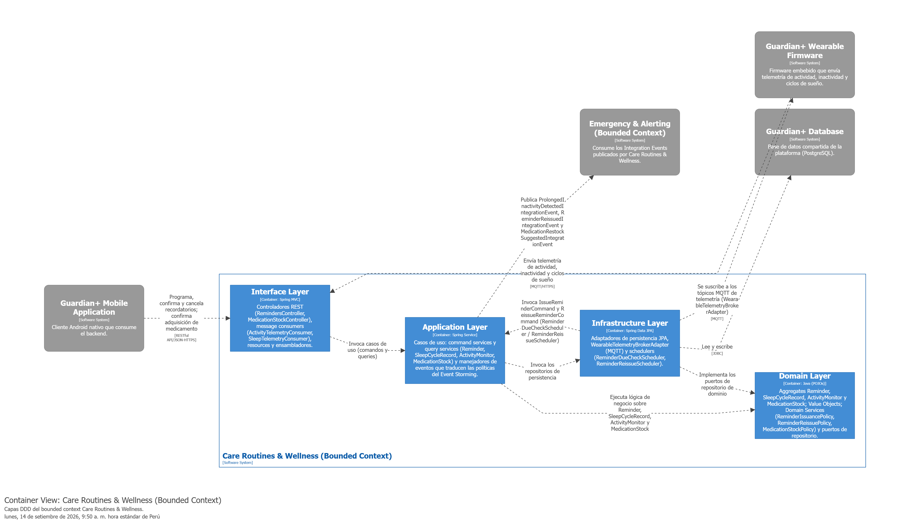

#### 2.6.5.6. Bounded Context Software Architecture Code Level Diagrams

En esta sección se presenta la estructura interna del Bounded Context **Care Routines & Wellness** a nivel de código, mediante el diagrama de clases de su Domain Layer y el diseño de su base de datos.

##### 2.6.5.6.1. Bounded Context Domain Layer Class Diagrams

El diagrama UML de la Figura 2.57 presenta la Domain Layer de **Care Routines & Wellness**, con los agregados `Reminder`, `SleepCycleRecord`, `ActivityMonitor` y `MedicationStock`, sus Value Objects y los Domain Services que aplican las políticas de emisión y reemisión de recordatorios y de stock de medicamentos.

<a id="figura-2-57"></a>**Figura 2.57.** Diagrama de clases de la Domain Layer de Care Routines & Wellness

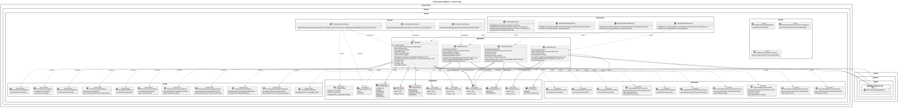

##### 2.6.5.6.2. Bounded Context Database Design Diagram

La Figura 2.58 presenta el diseño de persistencia del Bounded Context **Care Routines & Wellness**, derivado directamente de sus agregados: `reminders` conserva el ciclo de vida de cada recordatorio junto con su contador de reemisiones, `sleep_cycle_records` almacena cada ciclo de sueño cerrado con su clasificación, `activity_monitors` mantiene un único registro de actividad por persona bajo cuidado y `medication_stocks` el balance de dosis restantes que alimenta la sugerencia de reabastecimiento.

Las columnas `person_under_care_id` y `wearable_device_id` referencian, respectivamente, los perfiles gobernados por el Bounded Context Profile y los dispositivos gobernados por Health Monitoring, de modo que la telemetría registrada mantiene su trazabilidad hacia el dispositivo que la originó sin que este contexto administre ninguna de las dos entidades.

<a id="figura-2-58"></a>**Figura 2.58.** Diagrama de base de datos de Care Routines & Wellness

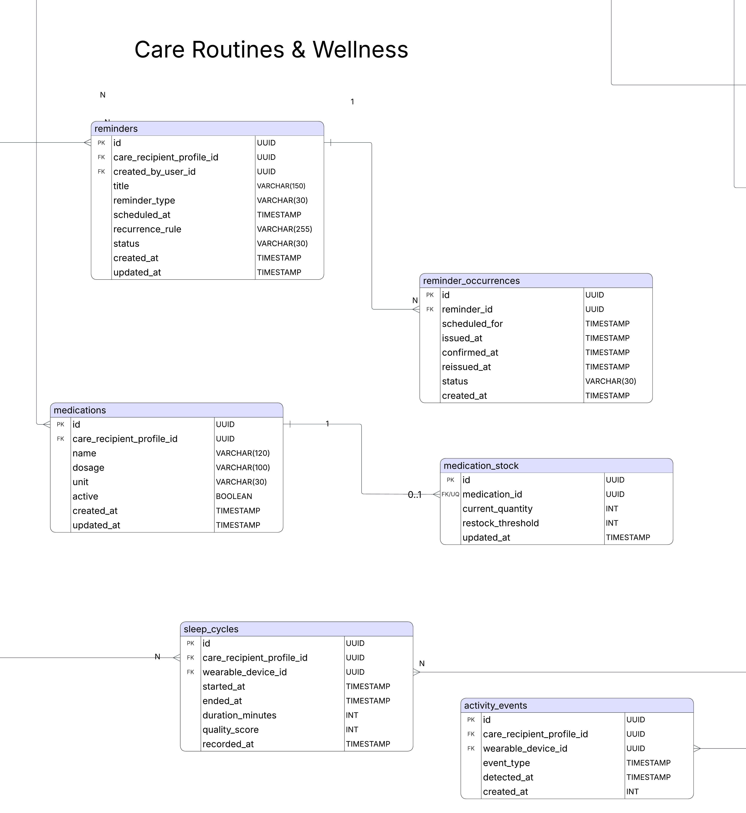

### 2.6.6. Bounded Context: Mobility & Geofencing

El Bounded Context **Mobility & Geofencing** pertenece al Supporting Domain de Guardian+. Su responsabilidad consiste en gestionar el seguimiento de ubicación de un Fragile Citizen, administrar las Safe Zones configuradas y evaluar las ubicaciones recibidas para determinar si la persona permanece dentro de una zona segura o si se ha producido una Safe Zone Violation.

Este contexto recibe la ubicación del Wearable Device, valida las coordenadas, mantiene el estado de ubicación y publica el evento de integración `SafeZoneViolation` cuando detecta una salida de la zona segura, que Emergency & Alerting consume para gestionar la respuesta y el escalamiento. A diferencia de Health Monitoring, no interpreta signos vitales, y su responsabilidad termina en la detección y el registro de los eventos de ubicación.

La arquitectura táctica se implementa sobre Java y Spring Boot con una estructura de paquetes dividida en cuatro capas: domain, interfaces, application e infrastructure. Su código se organiza en el paquete `com.healthify.guardian.platform.mobilitygeofencing` del repositorio `guardian-plus-platform`, con la siguiente estructura:

```
com.healthify.guardian.platform.mobilitygeofencing/
├── domain/
│   ├── model/
│   │   ├── aggregates/
│   │   ├── commands/
│   │   ├── entities/
│   │   ├── events/
│   │   ├── queries/
│   │   └── valueobjects/
│   ├── repositories/
│   └── services/
├── interfaces/
│   ├── events/
│   ├── rest/
│   │   ├── controllers/
│   │   ├── resources/
│   │   └── transform/
│   └── transform/
├── application/
│   ├── internal/
│   │   ├── commandservices/
│   │   └── queryservices/
│   └── ports/
│       └── inbound/
└── infrastructure/
    ├── persistence/
    │   └── jpa/
    │       ├── adapters/
    │       ├── assemblers/
    │       ├── entities/
    │       └── repositories/
    └── publisher/
```

#### 2.6.6.1. Domain Layer

Encapsula la lógica pura del dominio de movilidad y geocercas, las reglas de configuración de zonas seguras y la evaluación de las ubicaciones recibidas desde el dispositivo wearable. El dominio determina si una ubicación se encuentra dentro o fuera de una SafeZone y registra una violación cuando corresponde, sin asumir responsabilidades propias de Emergency & Alerting, como la generación de alertas, escalamiento o gestión de incidentes.

##### Aggregates

*   **SafeZone**
    *   Agregado raíz que representa una zona geográfica segura configurada para un Fragile Citizen.
    *   Mantiene las reglas y límites necesarios para determinar si una ubicación pertenece a la zona.
    *   Es responsable de preservar la consistencia de la configuración de la zona, incluyendo su estado activo.
    *   *Atributos:*
        *   id: SafeZoneId
        *   fragileCitizenId: FragileCitizenId
        *   name: String
        *   boundary: SafeZoneBoundary
        *   status: SafeZoneStatus
        *   createdAt: Instant
        *   updatedAt: Instant
    *   *Métodos:*
        *   SafeZone(CreateSafeZoneCommand command)
        *   updateBoundary(SafeZoneBoundary boundary): void
        *   activate(): void
        *   deactivate(): void
        *   contains(Location location): boolean
        *   isActive(): boolean

*   **LocationTracking**
    *   Agregado raíz que representa el registro de seguimiento de ubicación de un Fragile Citizen.
    *   Cada ubicación recibida se procesa y conserva como parte del historial de seguimiento, evitando que el agregado SafeZone tenga que mantener una colección potencialmente ilimitada de ubicaciones.
    *   *Atributos:*
        *   id: LocationTrackingId
        *   fragileCitizenId: FragileCitizenId
        *   currentLocation: Location
        *   currentStatus: LocationStatus
        *   lastUpdatedAt: Instant
    *   *Métodos:*
        *   LocationTracking(FragileCitizenId fragileCitizenId)
        *   recordLocation(Location location, LocationStatus status): void
        *   getCurrentLocation(): Location
        *   getCurrentStatus(): LocationStatus

##### Entities

*   **ZoneViolation**
    *   Entidad que representa el registro de una ubicación que fue determinada como externa a una SafeZone activa.
    *   Su propósito es conservar la ocurrencia de la violación dentro del contexto de movilidad. La generación y gestión de la alerta correspondiente pertenece a Emergency & Alerting.
    *   *Atributos:*
        *   id: ZoneViolationId
        *   safeZoneId: SafeZoneId
        *   fragileCitizenId: FragileCitizenId
        *   location: Location
        *   detectedAt: Instant
    *   *Métodos:*
        *   ZoneViolation(SafeZoneId safeZoneId, FragileCitizenId fragileCitizenId, Location location)
        *   getLocation(): Location
        *   getDetectedAt(): Instant

##### Value Objects

*   **Coordinates:** Encapsula las coordenadas geográficas de una ubicación (latitude: Double, longitude: Double). Invariante: latitud entre $-90.0$ y $90.0$, longitud entre $-180.0$ y $180.0$. Método: isValid().
*   **Location:** Representa una ubicación capturada por el wearable (coordinates: Coordinates, recordedAt: Instant, accuracyInMeters: Double). Es inmutable y representa el valor recibido para un instante determinado.
*   **SafeZoneBoundary:** Encapsula los límites geográficos de una SafeZone mediante un centro y un radio (center: Coordinates, radiusInMeters: Double). Invariante: radio mayor que 0. Método: contains(Coordinates coordinates).
*   **LocationStatus:** Representa el resultado de la evaluación de una ubicación respecto a una zona segura. Valores: WITHIN_SAFE_ZONE, OUTSIDE_SAFE_ZONE.
*   **SafeZoneStatus:** Representa el estado de una zona segura. Valores: ACTIVE, INACTIVE.
*   **SafeZoneId:** Identificador inmutable de una zona segura, basado en UUID.
*   **LocationTrackingId:** Identificador inmutable del agregado de seguimiento, basado en UUID.
*   **ZoneViolationId:** Identificador inmutable de una violación de zona, basado en UUID.
*   **FragileCitizenId:** Identificador de referencia inmutable del Fragile Citizen monitoreado.

##### Domain Services

*   **GeofenceEvaluationService**
    *   Servicio de dominio encargado de evaluar una ubicación contra los límites de una SafeZone.
    *   Se utiliza porque la evaluación geográfica no representa una responsabilidad exclusiva de una única entidad y requiere aplicar una regla espacial del dominio.
    *   *Métodos:*
        *   evaluate(Location location, SafeZoneBoundary boundary): LocationStatus
        *   isInside(Location location, SafeZoneBoundary boundary): boolean

##### Commands & Queries (Domain Model)

*   CreateSafeZoneCommand(UUID fragileCitizenId, String name, Coordinates center, Double radiusInMeters)
*   UpdateSafeZoneCommand(UUID safeZoneId, String name, Coordinates center, Double radiusInMeters)
*   ActivateSafeZoneCommand(UUID safeZoneId)
*   DeactivateSafeZoneCommand(UUID safeZoneId)
*   ReceiveLocationCommand(UUID fragileCitizenId, Coordinates coordinates, Double accuracyInMeters, Instant recordedAt)
*   EvaluateLocationCommand(UUID fragileCitizenId, UUID locationTrackingId)
*   GetCurrentLocationQuery(FragileCitizenId fragileCitizenId)
*   GetLocationHistoryQuery(FragileCitizenId fragileCitizenId, Instant periodStart, Instant periodEnd)
*   GetActiveSafeZoneQuery(FragileCitizenId fragileCitizenId)
*   GetLocationStatusQuery(FragileCitizenId fragileCitizenId)

##### Domain Events

*   SafeZoneCreatedEvent: Emitido después de crear correctamente una nueva SafeZone.
*   LocationReceivedEvent: Emitido después de validar y registrar una ubicación proveniente del wearable.
*   LocationStatusUpdatedEvent: Emitido después de evaluar una ubicación y determinar su estado respecto a la SafeZone.
*   SafeZoneViolationDetectedEvent: Emitido cuando una ubicación válida es evaluada como OUTSIDE_SAFE_ZONE. Este evento puede ser publicado hacia Emergency & Alerting, que se encarga de iniciar el flujo correspondiente de alertamiento.

##### Repositories (Domain Interfaces)

*   **SafeZoneRepository:**
    *   save(SafeZone safeZone): SafeZone
    *   findById(SafeZoneId id): Optional<SafeZone>
    *   findActiveByFragileCitizenId(FragileCitizenId citizenId): Optional<SafeZone>
    *   findAllByFragileCitizenId(FragileCitizenId citizenId): List<SafeZone>
*   **LocationTrackingRepository:**
    *   save(LocationTracking tracking): LocationTracking
    *   findByFragileCitizenId(FragileCitizenId citizenId): Optional<LocationTracking>
    *   findHistoryByFragileCitizenId(FragileCitizenId citizenId, Instant periodStart, Instant periodEnd): List<Location>
*   **ZoneViolationRepository:**
    *   save(ZoneViolation violation): ZoneViolation
    *   findByFragileCitizenId(FragileCitizenId citizenId): List<ZoneViolation>
    *   findBySafeZoneId(SafeZoneId safeZoneId): List<ZoneViolation>

#### 2.6.6.2. Interface Layer

Expone las capacidades del Bounded Context Mobility & Geofencing hacia clientes externos y sistemas con los que se integra. Esta capa transforma las solicitudes externas en comandos del dominio y adapta los eventos de dominio para su publicación hacia otros contextos, sin contener reglas propias de negocio.

##### REST Controllers

*   **SafeZoneController**
    *   Expone las operaciones relacionadas con la administración de SafeZone.
    *   Permite crear, actualizar, activar y desactivar zonas seguras.
    *   *Endpoints:*
        *   `POST /api/v1/safe-zones`
        *   `PUT /api/v1/safe-zones/{safeZoneId}`
        *   `PATCH /api/v1/safe-zones/{safeZoneId}/activate`
        *   `PATCH /api/v1/safe-zones/{safeZoneId}/deactivate`
        *   `GET /api/v1/safe-zones/fragile-citizen/{fragileCitizenId}/active`

*   **LocationTrackingController**
    *   Expone las operaciones relacionadas con la consulta del seguimiento de ubicación.
    *   Permite consultar la ubicación actual, el estado actual y el historial de ubicaciones de un Fragile Citizen.
    *   *Endpoints:*
        *   `GET /api/v1/location-tracking/{fragileCitizenId}/current`
        *   `GET /api/v1/location-tracking/{fragileCitizenId}/status`
        *   `GET /api/v1/location-tracking/{fragileCitizenId}/history`

##### Inbound Adapters (Wearable Integration)

*   **WearableLocationConsumer**
    *   Adaptador de entrada responsable de recibir las ubicaciones enviadas por el Wearable Device.
    *   Convierte el mensaje externo del dispositivo en un `ReceiveLocationCommand`.
    *   No realiza directamente la evaluación de la geocerca; delega el procesamiento al Application Layer.
    *   *Métodos:*
        *   consumeLocation(WearableLocationMessage message): void
        *   toCommand(WearableLocationMessage message): ReceiveLocationCommand

*   **WearableLocationMessage**
    *   Representa el mensaje externo recibido desde el dispositivo wearable.
    *   *Atributos:*
        *   fragileCitizenId: UUID
        *   latitude: Double
        *   longitude: Double
        *   accuracyInMeters: Double
        *   recordedAt: Instant

##### REST Resources

*   **SafeZoneResource**
    *   Representa la respuesta HTTP asociada a una SafeZone.
    *   *Atributos:*
        *   id: UUID
        *   fragileCitizenId: UUID
        *   name: String
        *   latitude: Double
        *   longitude: Double
        *   radiusInMeters: Double
        *   status: String

*   **CurrentLocationResource**
    *   Representa la ubicación actual del Fragile Citizen.
    *   *Atributos:*
        *   fragileCitizenId: UUID
        *   latitude: Double
        *   longitude: Double
        *   accuracyInMeters: Double
        *   status: String
        *   recordedAt: Instant

*   **LocationHistoryResource**
    *   Representa un elemento individual del historial de ubicaciones.
    *   *Atributos:*
        *   latitude: Double
        *   longitude: Double
        *   accuracyInMeters: Double
        *   status: String
        *   recordedAt: Instant

##### Transformers & Assemblers

*   **SafeZoneResourceAssembler**
    *   Transforma entidades del dominio SafeZone en `SafeZoneResource` para respuestas REST.
    *   *Métodos:*
        *   toResource(SafeZone safeZone): SafeZoneResource

*   **LocationResourceAssembler**
    *   Transforma objetos del dominio Location y LocationTracking en recursos REST.
    *   *Métodos:*
        *   toCurrentResource(LocationTracking tracking): CurrentLocationResource
        *   toHistoryResource(Location location): LocationHistoryResource

*   **WearableLocationTransformer**
    *   Convierte la carga útil del wearable en el comando ejecutable por el Application Layer.
    *   *Métodos:*
        *   toCommand(WearableLocationMessage message): ReceiveLocationCommand

##### Outbound Adapters (Event Publishers)

*   **MobilityEventPublisher**
    *   Adaptador de salida responsable de publicar eventos de integración hacia otros Bounded Contexts.
    *   Publica principalmente `SafeZoneViolationDetectedEvent` hacia Emergency & Alerting.
    *   No crea ni gestiona alertas; únicamente comunica el hecho ocurrido en Mobility & Geofencing.
    *   *Métodos:*
        *   publish(SafeZoneViolationDetectedEvent event): void

##### Responsabilidades de la Interface Layer

*   Recibir solicitudes HTTP provenientes de clientes autorizados.
*   Recibir mensajes de telemetría de ubicación provenientes del Wearable Device.
*   Validar el formato y estructura básica de los datos de entrada.
*   Transformar DTOs y mensajes externos en comandos de aplicación.
*   Transformar resultados del dominio en recursos de respuesta normalizados.
*   Publicar eventos de integración hacia otros Bounded Contexts.
*   Mantener desacoplada la infraestructura de transporte respecto a la lógica de negocio del dominio.

#### 2.6.6.3. Application Layer

Orquesta los casos de uso del Bounded Context Mobility & Geofencing, coordinando comandos, consultas, agregados, repositorios y eventos de dominio. Esta capa define los flujos de aplicación, pero delega las reglas de negocio y las invariantes al Domain Layer.

##### Command Services

*   **SafeZoneCommandService**
    *   Coordina los casos de uso relacionados con la administración del ciclo de vida de SafeZone.
    *   *Métodos:*
        *   createSafeZone(CreateSafeZoneCommand command): SafeZone
        *   updateSafeZone(UpdateSafeZoneCommand command): SafeZone
        *   activateSafeZone(ActivateSafeZoneCommand command): void
        *   deactivateSafeZone(DeactivateSafeZoneCommand command): void

*   **LocationTrackingCommandService**
    *   Coordina la recepción y procesamiento de las ubicaciones provenientes del wearable.
    *   Utiliza `GeofenceEvaluationService` para determinar si la ubicación se encuentra dentro o fuera de la zona segura.
    *   Cuando se detecta una salida de la zona, coordina el registro de la `ZoneViolation` y la publicación del evento correspondiente.
    *   *Métodos:*
        *   receiveLocation(ReceiveLocationCommand command): void
        *   evaluateLocation(EvaluateLocationCommand command): LocationStatus

##### Query Services

*   **SafeZoneQueryService**
    *   Proporciona consultas de solo lectura relacionadas con las zonas seguras configuradas.
    *   *Métodos:*
        *   getActiveSafeZone(GetActiveSafeZoneQuery query): Optional<SafeZone>
        *   getSafeZonesByFragileCitizen(FragileCitizenId fragileCitizenId): List<SafeZone>

*   **LocationTrackingQueryService**
    *   Proporciona información de seguimiento sin modificar el estado del dominio.
    *   *Métodos:*
        *   getCurrentLocation(GetCurrentLocationQuery query): Optional<Location>
        *   getLocationHistory(GetLocationHistoryQuery query): List<Location>
        *   getLocationStatus(GetLocationStatusQuery query): Optional<LocationStatus>

##### Command Handlers

*   **CreateSafeZoneCommandHandler**
    *   Recibe `CreateSafeZoneCommand` y delega la creación al `SafeZoneCommandService`.
*   **UpdateSafeZoneCommandHandler**
    *   Procesa `UpdateSafeZoneCommand` y coordina la actualización de los límites de una zona existente.
*   **ActivateSafeZoneCommandHandler**
    *   Procesa `ActivateSafeZoneCommand` y activa la zona segura correspondiente.
*   **DeactivateSafeZoneCommandHandler**
    *   Procesa `DeactivateSafeZoneCommand` y desactiva la zona segura correspondiente.
*   **ReceiveLocationCommandHandler**
    *   Recibe `ReceiveLocationCommand` y valida que la ubicación pueda ser procesada.
    *   Obtiene la SafeZone activa del Fragile Citizen y coordina la evaluación espacial de la ubicación.
    *   Actualiza el seguimiento de ubicación (`LocationTracking`).
    *   Si la ubicación se encuentra fuera de la zona segura, coordina el registro de la `ZoneViolation`.

##### Event Handlers

*   **LocationReceivedEventHandler**
    *   Procesa `LocationReceivedEvent`.
    *   Coordina la evaluación de la ubicación recibida respecto a la SafeZone activa.
*   **LocationStatusUpdatedEventHandler**
    *   Procesa `LocationStatusUpdatedEvent`.
    *   Si el resultado es `OUTSIDE_SAFE_ZONE`, coordina el registro de la violación y la generación de `SafeZoneViolationDetectedEvent`.
*   **SafeZoneViolationDetectedEventHandler**
    *   Responsable de preparar la publicación del evento de integración hacia Emergency & Alerting a través del puerto de salida correspondiente.
    *   No genera una alerta ni determina su severidad; su responsabilidad se limita a comunicar que se detectó una violación de zona.

##### Internal Application Services

*   **LocationEvaluationApplicationService**
    *   Coordina el flujo de extremo a extremo en la evaluación de una ubicación:
        1. Recupera la SafeZone activa.
        2. Invoca el `GeofenceEvaluationService`.
        3. Actualiza el agregado `LocationTracking`.
        4. Registra una `ZoneViolation` cuando corresponde.
        5. Publica los eventos de dominio resultantes.
    *   *Flujo principal:*
        *   `ReceiveLocationCommand` $\rightarrow$ `LocationTrackingCommandService` $\rightarrow$ `SafeZoneRepository` $\rightarrow$ `GeofenceEvaluationService` $\rightarrow$ `LocationTrackingRepository` $\rightarrow$ `ZoneViolationRepository` $\rightarrow$ `SafeZoneViolationDetectedEvent`

##### Application Ports

*   **Inbound Ports:**
    *   **WearableLocationInputPort:** Puerto de entrada utilizado para recibir ubicaciones provenientes del adaptador del wearable.
        *   *Métodos:*
            *   receiveLocation(ReceiveLocationCommand command): void
*   **Outbound Ports:**
    *   **MobilityEventOutputPort:** Puerto de salida utilizado para publicar eventos de integración hacia otros Bounded Contexts.
        *   *Métodos:*
            *   publish(SafeZoneViolationDetectedEvent event): void

##### Responsabilidades de la Application Layer

*   Orquestar los casos de uso del Bounded Context.
*   Coordinar Commands, Queries y Domain Events.
*   Invocar los agregados y servicios del dominio.
*   Utilizar las interfaces de repositorio definidas en el Domain Layer.
*   Coordinar la recepción y evaluación de ubicaciones.
*   Coordinar el registro de `ZoneViolation`.
*   Publicar `SafeZoneViolationDetectedEvent` hacia Emergency & Alerting.
*   Mantener la lógica de negocio compleja fuera de esta capa.
*   No gestionar alertas, incidentes, severidad ni escalamiento, ya que esas responsabilidades pertenecen a Emergency & Alerting.

#### 2.6.6.4. Infrastructure Layer

Implementa los mecanismos técnicos que permiten persistir la información del Bounded Context Mobility & Geofencing, recibir ubicaciones desde el Wearable Device y publicar eventos hacia otros Bounded Contexts. Esta capa contiene las implementaciones concretas de los puertos definidos por las capas Domain y Application, sin introducir reglas de negocio propias.

##### Persistence Implementations (Repositories)

*   **SafeZoneRepositoryImpl**
    *   Implementación concreta de `SafeZoneRepository`.
    *   Utiliza Spring Data JPA para persistir y recuperar agregados `SafeZone`.
    *   *Métodos:*
        *   save(SafeZone safeZone): SafeZone
        *   findById(SafeZoneId id): Optional<SafeZone>
        *   findActiveByFragileCitizenId(FragileCitizenId citizenId): Optional<SafeZone>
        *   findAllByFragileCitizenId(FragileCitizenId citizenId): List<SafeZone>

*   **LocationTrackingRepositoryImpl**
    *   Implementación concreta de `LocationTrackingRepository`.
    *   Gestiona la persistencia del estado actual y el historial de ubicaciones.
    *   *Métodos:*
        *   save(LocationTracking tracking): LocationTracking
        *   findByFragileCitizenId(FragileCitizenId citizenId): Optional<LocationTracking>
        *   findHistoryByFragileCitizenId(FragileCitizenId citizenId, Instant periodStart, Instant periodEnd): List<Location>

*   **ZoneViolationRepositoryImpl**
    *   Implementación concreta de `ZoneViolationRepository`.
    *   Persiste las violaciones de zonas seguras detectadas por el dominio.
    *   *Métodos:*
        *   save(ZoneViolation violation): ZoneViolation
        *   findByFragileCitizenId(FragileCitizenId citizenId): List<ZoneViolation>
        *   findBySafeZoneId(SafeZoneId safeZoneId): List<ZoneViolation>

##### JPA Entities

*   **SafeZoneJpaEntity**
    *   Representación persistente del agregado SafeZone en base de datos relacional.
    *   *Atributos:*
        *   id: UUID
        *   fragileCitizenId: UUID
        *   name: String
        *   latitude: Double
        *   longitude: Double
        *   radiusInMeters: Double
        *   status: String
        *   createdAt: Instant
        *   updatedAt: Instant

*   **LocationTrackingJpaEntity**
    *   Representación persistente del seguimiento actual de un Fragile Citizen.
    *   *Atributos:*
        *   id: UUID
        *   fragileCitizenId: UUID
        *   currentLatitude: Double
        *   currentLongitude: Double
        *   accuracyInMeters: Double
        *   currentStatus: String
        *   lastUpdatedAt: Instant

*   **LocationRecordJpaEntity**
    *   Representa un registro individual e inmutable del historial de ubicaciones.
    *   *Atributos:*
        *   id: UUID
        *   locationTrackingId: UUID
        *   latitude: Double
        *   longitude: Double
        *   accuracyInMeters: Double
        *   status: String
        *   recordedAt: Instant

*   **ZoneViolationJpaEntity**
    *   Representación persistente de una violación de zona segura detectada.
    *   *Atributos:*
        *   id: UUID
        *   safeZoneId: UUID
        *   fragileCitizenId: UUID
        *   latitude: Double
        *   longitude: Double
        *   detectedAt: Instant

##### Spring Data JPA Repositories

*   **SafeZoneJpaRepository**
    *   Repositorio Spring Data utilizado por `SafeZoneRepositoryImpl`.
    *   *Métodos:*
        *   findById(UUID id)
        *   findByFragileCitizenIdAndStatus(UUID fragileCitizenId, String status)
        *   findAllByFragileCitizenId(UUID fragileCitizenId)

*   **LocationTrackingJpaRepository**
    *   Repositorio Spring Data utilizado para acceder al seguimiento actual.
    *   *Métodos:*
        *   findByFragileCitizenId(UUID fragileCitizenId)

*   **LocationRecordJpaRepository**
    *   Repositorio Spring Data utilizado para consultar el historial de telemetría de ubicaciones.
    *   *Métodos:*
        *   findByLocationTrackingIdAndRecordedAtBetween(UUID trackingId, Instant start, Instant end)

*   **ZoneViolationJpaRepository**
    *   Repositorio Spring Data utilizado para consultar las violaciones registradas.
    *   *Métodos:*
        *   findByFragileCitizenId(UUID fragileCitizenId)
        *   findBySafeZoneId(UUID safeZoneId)

##### Assemblers & Converters

*   **SafeZonePersistenceAssembler**
    *   Convierte bidireccionalmente entre el agregado de dominio `SafeZone` y `SafeZoneJpaEntity`.
    *   *Métodos:*
        *   toEntity(SafeZone safeZone): SafeZoneJpaEntity
        *   toDomain(SafeZoneJpaEntity entity): SafeZone

*   **LocationTrackingPersistenceAssembler**
    *   Convierte bidireccionalmente entre `LocationTracking` y `LocationTrackingJpaEntity`.
    *   *Métodos:*
        *   toEntity(LocationTracking tracking): LocationTrackingJpaEntity
        *   toDomain(LocationTrackingJpaEntity entity): LocationTracking

*   **ZoneViolationPersistenceAssembler**
    *   Convierte bidireccionalmente entre `ZoneViolation` y `ZoneViolationJpaEntity`.
    *   *Métodos:*
        *   toEntity(ZoneViolation violation): ZoneViolationJpaEntity
        *   toDomain(ZoneViolationJpaEntity entity): ZoneViolation

*   **CoordinatesConverter**
    *   Convierte el Value Object `Coordinates` a los campos persistentes `latitude` y `longitude`, y viceversa.

##### Inbound Infrastructure Adapters

*   **WearableLocationAdapter**
    *   Implementa el mecanismo técnico utilizado para recibir las ubicaciones provenientes del Wearable Device (mediante HTTP, MQTT u otro protocolo IoT).
    *   Convierte el mensaje externo recibido en `WearableLocationMessage` y lo entrega al `WearableLocationInputPort`.
    *   No contiene lógica de evaluación de geocercas.

##### Outbound Infrastructure Adapters (Messaging)

*   **MobilityEventPublisherAdapter**
    *   Implementa el puerto de salida `MobilityEventOutputPort`.
    *   Publica eventos de integración mediante el mecanismo de mensajería (Message Broker: RabbitMQ/Kafka).
    *   Publica principalmente `SafeZoneViolationDetectedEvent` hacia Emergency & Alerting.
    *   *Métodos:*
        *   publish(SafeZoneViolationDetectedEvent event): void

*   **SafeZoneViolationIntegrationEvent**
    *   Representación serializable del evento de integración enviado fuera del Bounded Context.
    *   *Atributos:*
        *   eventId: UUID
        *   fragileCitizenId: UUID
        *   safeZoneId: UUID
        *   latitude: Double
        *   longitude: Double
        *   detectedAt: Instant

##### Infrastructure Configuration

*   **MobilityPersistenceConfiguration:** Configura los componentes de persistencia JPA, conexiones al pool de base de datos y gestión de transacciones.
*   **MobilityMessagingConfiguration:** Configura el broker de mensajería, exchanges/topics, serialización JSON y canales de publicación de eventos.
*   **WearableIntegrationConfiguration:** Configura el conector y los endpoints del protocolo técnico de comunicación con el Wearable Device.

##### Responsabilidades de la Infrastructure Layer

*   Implementar técnicamente los repositorios definidos por el Domain Layer.
*   Persistir de forma consistente `SafeZone`, `LocationTracking`, `LocationRecord` y `ZoneViolation`.
*   Implementar la capa técnica de transporte y comunicación con el Wearable Device.
*   Publicar eventos de integración hacia el broker para el consumo de Emergency & Alerting.
*   Configurar los beans de Spring para JPA, base de datos y mensajería asíncrona.
*   Transformar objetos de dominio a entidades de persistencia y viceversa (aislando la base de datos).
*   Mantener los detalles tecnológicos y dependencias de frameworks fuera del Domain y Application Layer.
*   No implementar reglas de negocio como la evaluación de geocercas o la determinación de violaciones; estas responsabilidades pertenecen estrictamente al Domain Layer.

#### 2.6.6.5. Bounded Context Software Architecture Component Level Diagrams

La Figura 2.59 presenta los componentes del Bounded Context **Mobility & Geofencing**: el consumidor de ubicación del wearable y los controladores REST en la Interface Layer; los servicios de comandos y consultas en la Application Layer; los agregados `SafeZone` y `LocationTracking`, la entidad `ZoneViolation` y el servicio de evaluación de geocercas en la Domain Layer; y los adaptadores de persistencia, la ACL hacia Profile y el publicador de eventos en la Infrastructure Layer.

<a id="figura-2-59"></a>**Figura 2.59.** Diagrama de componentes del Bounded Context Mobility & Geofencing

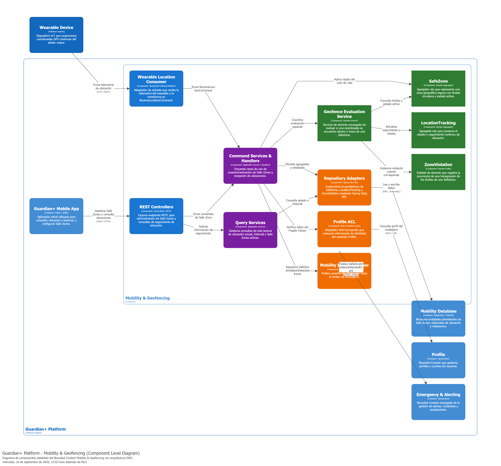

#### 2.6.6.6. Bounded Context Software Architecture Code Level Diagrams

En esta sección se presenta la estructura interna del Bounded Context **Mobility & Geofencing** a nivel de código, mediante el diagrama de clases de su Domain Layer y el diseño de su base de datos.

##### 2.6.6.6.1. Bounded Context Domain Layer Class Diagrams

El diagrama UML de la Figura 2.60 presenta la Domain Layer del Bounded Context **Mobility & Geofencing**, organizada alrededor de los agregados `SafeZone` y `LocationTracking`, la entidad `ZoneViolation` y el Domain Service `GeofenceEvaluationService`, que concentra la regla espacial de evaluación de una ubicación contra los límites de una zona segura.

<a id="figura-2-60"></a>**Figura 2.60.** Diagrama de clases de la Domain Layer de Mobility & Geofencing

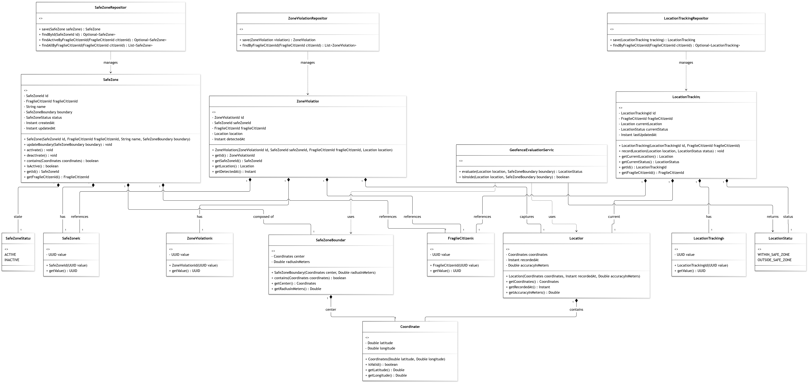

##### 2.6.6.6.2. Bounded Context Database Design Diagram

La Figura 2.61 presenta el diseño de persistencia del Bounded Context **Mobility & Geofencing**, derivado de sus agregados: `safe_zones` guarda la configuración de cada zona segura con su centro y radio, `location_trackings` mantiene el estado de ubicación vigente de un Fragile Citizen, `location_records` conserva el historial inmutable de ubicaciones recibidas y `zone_violations` registra cada evaluación que resultó externa a una zona segura activa.

Las columnas `fragile_citizen_id` y `wearable_device_id` referencian los perfiles gobernados por el Bounded Context Profile y los dispositivos gobernados por Health Monitoring. La resolución de una violación no se persiste en este contexto: su responsabilidad termina en la detección y el registro, mientras que la atención y el cierre pertenecen a Emergency & Alerting.

<a id="figura-2-61"></a>**Figura 2.61.** Diagrama de base de datos de Mobility & Geofencing

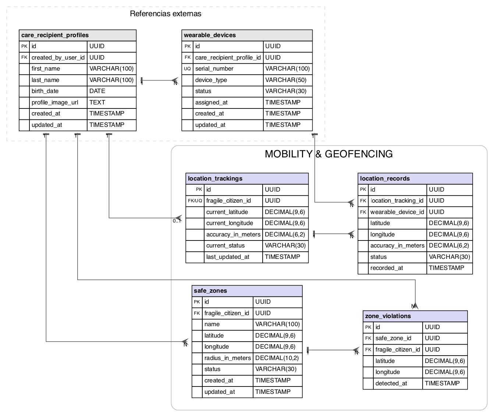

### 2.6.7. Bounded Context: IAM

El Bounded Context **IAM** pertenece al Generic Domain de Guardian+. Su responsabilidad consiste en gestionar la identidad digital de cuidadores y familiares: el registro y la verificación de credenciales mediante correo electrónico, la autenticación reforzada con un segundo factor opcional (OTP) y la recuperación segura de la contraseña.

A diferencia de los demás contextos, IAM no consume eventos de integración de ningún otro Bounded Context: es el contexto más upstream del dominio y actúa como Open Host Service (OHS), publicando un Published Language (PL) basado en JSON Web Tokens (JWT) firmados que cada contexto descendente valida localmente, sin consultar la base de datos de identidad.

La arquitectura táctica se diseñó sobre Java y Spring Boot con la misma estructura de paquetes de cuatro capas que el resto de Bounded Contexts: domain, interfaces, application e infrastructure. Su código se organizará en el paquete `com.healthify.guardian.platform.iam` del repositorio `guardian-plus-platform`, con la siguiente estructura:

```
com.healthify.guardian.platform.iam/
├── domain/
│   ├── model/
│   │   ├── aggregates/
│   │   ├── commands/
│   │   ├── events/
│   │   ├── queries/
│   │   ├── services/
│   │   └── valueobjects/
│   └── repositories/
├── interfaces/
│   ├── acl/
│   ├── events/
│   └── rest/
│       ├── controllers/
│       ├── resources/
│       └── transform/
├── application/
│   ├── acl/
│   ├── commandservices/
│   ├── internal/
│   │   ├── commandservices/
│   │   ├── eventhandlers/
│   │   └── queryservices/
│   └── queryservices/
└── infrastructure/
    ├── notifications/
    │   └── adapters/
    ├── persistence/
    │   └── jpa/
    │       ├── adapters/
    │       ├── assemblers/
    │       ├── converters/
    │       ├── entities/
    │       └── repositories/
    ├── scheduling/
    └── security/
        └── adapters/
```

#### 2.6.7.1. Domain Layer

Encapsula las reglas de identidad y acceso: la unicidad del correo electrónico, la obligatoriedad de verificación de la cuenta, la vigencia y el consumo de un solo uso de los códigos de segundo factor y de los tokens de recuperación de contraseña. Del Design-Level EventStorming se desprende una decisión de modelado central: los secretos de vida corta se separan de `UserAccount` en agregados propios (`OneTimePassword` y `PasswordResetToken`), ya que poseen un ciclo de vida independiente —emisión, vigencia, consumo— que no debe acoplarse a las invariantes permanentes de la cuenta. Esta separación es la que el diseño de base de datos refleja mediante las tablas `otp_codes` y `password_reset_tokens`.

Ninguno de los secretos se conserva en claro: el dominio almacena únicamente su hash (`code_hash` y `token_hash`), de modo que una filtración de la base de datos no permite reconstruir el código enviado al usuario.

##### Aggregates

*   **UserAccount**
    *   Agregado raíz que representa la identidad digital de un cuidador o familiar registrado en Guardian+.
    *   Hereda de `AbstractDomainAggregateRoot<UserAccount>` para registrar y publicar eventos de dominio.
    *   Gobierna de forma autónoma su ciclo de vida (`PENDING_EMAIL_VERIFICATION → ACTIVE`), rechazando la autenticación mientras el correo no haya sido verificado. El indicador `emailVerified` registra el hecho de la verificación y `status` gobierna la habilitación para autenticarse; la cuenta transiciona a `ACTIVE` únicamente cuando el correo queda verificado.
    *   El correo electrónico es la única credencial de identificación: la autenticación no admite nombre de usuario.
    *   *Atributos:*
        *   `id: UserAccountId`
        *   `email: Email`
        *   `passwordHash: HashedPassword`
        *   `emailVerified: Boolean`
        *   `twoFactorEnabled: Boolean`
        *   `status: UserAccountStatus`
        *   `createdAt: Instant`
        *   `updatedAt: Instant`
    *   *Métodos:*
        *   `UserAccount(RegisterUserCredentialsCommand command, HashedPassword passwordHash)`
        *   `confirmEmailVerification(): void`
        *   `validateCredentials(String rawPassword, PasswordHasher hasher): boolean`
        *   `changePassword(HashedPassword newPasswordHash): void`
        *   `enableTwoFactor(): void`
        *   `disableTwoFactor(): void`
        *   `requiresSecondFactor(): boolean`
        *   `canAuthenticate(): boolean`
        *   `isEmailVerified(): boolean`

*   **OneTimePassword**
    *   Agregado raíz que representa un código de un solo uso emitido hacia el correo del usuario, ya sea como segundo factor de un intento de login o como confirmación de la verificación de la cuenta. El propósito de la emisión se declara en `purpose`.
    *   Su estado no se persiste como columna: se deriva de `usedAt` y `expiresAt`, de modo que un código es utilizable únicamente mientras no haya sido consumido ni haya vencido.
    *   *Atributos:*
        *   `id: OtpId`
        *   `userAccountId: UserAccountId`
        *   `codeHash: HashedSecret`
        *   `purpose: OtpPurpose`
        *   `expiresAt: Instant`
        *   `usedAt: Instant`
        *   `createdAt: Instant`
    *   *Métodos:*
        *   `OneTimePassword(GenerateOtpCommand command, HashedSecret codeHash, Instant expiresAt)`
        *   `verify(String candidateCode, SecretHasher hasher, Instant now): boolean`
        *   `markAsUsed(Instant now): void`
        *   `isUsable(Instant now): boolean`
        *   `isExpired(Instant now): boolean`
        *   `isUsed(): boolean`

*   **PasswordResetToken**
    *   Agregado raíz que representa un token opaco de un solo uso emitido para restablecer la contraseña de una cuenta. Se modela como agregado propio porque una cuenta puede acumular varios tokens a lo largo del tiempo, cada uno con su vigencia y su consumo independiente.
    *   *Atributos:*
        *   `id: PasswordResetTokenId`
        *   `userAccountId: UserAccountId`
        *   `tokenHash: HashedSecret`
        *   `expiresAt: Instant`
        *   `usedAt: Instant`
        *   `createdAt: Instant`
    *   *Métodos:*
        *   `PasswordResetToken(RequestPasswordResetCommand command, UserAccountId userAccountId, HashedSecret tokenHash, Instant expiresAt)`
        *   `matches(String rawToken, SecretHasher hasher): boolean`
        *   `markAsUsed(Instant now): void`
        *   `isUsable(Instant now): boolean`
        *   `isExpired(Instant now): boolean`

Este contexto no requiere entidades internas: los tres agregados son de único nivel, sin objetos hijos con identidad propia.

##### Value Objects

*   **Email:** Encapsula el correo electrónico (`value: String`). Invariante: formato RFC 5322 válido. Método: `matches(String other)`.
*   **HashedPassword:** Encapsula el hash irreversible de la contraseña (`hash: String`). Nunca expone ni acepta la contraseña en texto plano fuera del `PasswordHasher`.
*   **HashedSecret:** Encapsula el hash irreversible de un secreto de vida corta (`hash: String`), utilizado tanto para los códigos OTP (`code_hash`) como para los tokens de recuperación (`token_hash`).
*   **UserAccountStatus:** Enum (`PENDING_EMAIL_VERIFICATION`, `ACTIVE`). Método: `canAuthenticate()`.
*   **OtpPurpose:** Enum (`LOGIN`, `EMAIL_VERIFICATION`) que declara para qué fue emitido un código de un solo uso.
*   **UserAccountId / OtpId / PasswordResetTokenId:** Identificadores inmutables tipo UUID.

##### Domain Services (Puertos)

*   **PasswordHasher:** `hash(String rawPassword): HashedPassword`; `matches(String rawPassword, HashedPassword hash): boolean`. Implementado en infraestructura mediante BCrypt.
*   **SecretGenerator:** `generateNumericCode(int digits): String`; `generateOpaqueToken(): String`. Genera los códigos OTP y los tokens de recuperación mediante un generador criptográficamente seguro.
*   **SecretHasher:** `hash(String rawSecret): HashedSecret`; `matches(String rawSecret, HashedSecret hash): boolean`. Permite verificar un código o token sin conservarlo en claro.

##### Commands & Queries (Domain Model)

*   `RegisterUserCredentialsCommand(String email, String rawPassword)`
*   `GenerateOtpCommand(UUID userAccountId, String purpose)`
*   `VerifyEmailCommand(UUID userAccountId, String code)`
*   `LoginCommand(String email, String rawPassword)`
*   `VerifyOtpCommand(UUID userAccountId, String code)`
*   `AuthenticateUserCommand(UUID userAccountId)`
*   `EnableTwoFactorCommand(UUID userAccountId)`
*   `DisableTwoFactorCommand(UUID userAccountId)`
*   `RequestPasswordResetCommand(String email)`
*   `ResetPasswordCommand(String token, String newRawPassword)`
*   `GetUserAccountByIdQuery(UserAccountId userAccountId)`
*   `GetUserAccountByEmailQuery(Email email)`
*   `GetEmailAvailabilityQuery(String email)`
*   `GetUsableOtpByUserAccountIdAndPurposeQuery(UserAccountId userAccountId, OtpPurpose purpose)`

##### Domain Events

*   `UserCredentialsRegisteredEvent`: Emitido al registrar exitosamente las credenciales, con la cuenta en estado `PENDING_EMAIL_VERIFICATION`.
*   `OtpGeneratedEvent`: Emitido tras emitir un código de un solo uso, portando su propósito y su vencimiento; el código en claro viaja únicamente hacia el adaptador de notificaciones y nunca se persiste.
*   `OtpVerifiedEvent`: Emitido cuando el código ingresado coincide con el hash almacenado dentro de la ventana de vigencia.
*   `EmailVerifiedEvent`: Emitido cuando el usuario confirma su correo con un código de propósito `EMAIL_VERIFICATION`; transiciona la cuenta a `ACTIVE`.
*   `CredentialsValidatedEvent`: Emitido cuando `Login` valida correctamente el correo y la contraseña.
*   `UserAuthenticatedEvent`: Emitido al concluir exitosamente el flujo de autenticación; dispara la emisión del JWT firmado.
*   `TwoFactorSettingChangedEvent`: Emitido al habilitar o deshabilitar el segundo factor de una cuenta.
*   `PasswordResetTokenIssuedEvent`: Emitido al emitir un token de recuperación de contraseña, portando su vencimiento.
*   `PasswordResetCompletedEvent`: Emitido al completar el cambio de contraseña con un token vigente, que queda consumido.

##### Repositories (Domain Interfaces)

*   **UserAccountRepository:**
    *   `save(UserAccount account): UserAccount`
    *   `findById(UserAccountId id): Optional<UserAccount>`
    *   `findByEmail(Email email): Optional<UserAccount>`
    *   `existsByEmail(Email email): boolean`
*   **OneTimePasswordRepository:**
    *   `save(OneTimePassword otp): OneTimePassword`
    *   `findById(OtpId id): Optional<OneTimePassword>`
    *   `findLatestUsableByUserAccountIdAndPurpose(UserAccountId userAccountId, OtpPurpose purpose, Instant now): Optional<OneTimePassword>`
    *   `deleteExpiredUnusedBefore(Instant threshold): int`
*   **PasswordResetTokenRepository:**
    *   `save(PasswordResetToken token): PasswordResetToken`
    *   `findById(PasswordResetTokenId id): Optional<PasswordResetToken>`
    *   `findUsableByTokenHash(HashedSecret tokenHash, Instant now): Optional<PasswordResetToken>`
    *   `deleteExpiredUnusedBefore(Instant threshold): int`

#### 2.6.7.2. Interface Layer

Traduce estímulos externos hacia comandos y consultas de aplicación y expone contratos HTTP RESTful para la app móvil. Al ser el contexto más upstream del dominio, no canaliza eventos de integración entrantes.

##### REST Controllers

*   **AuthController** (`/api/v1/auth`):
    *   `POST /register`: Registra nuevas credenciales de usuario.
    *   `POST /verify-email`: Confirma el correo electrónico mediante el código de propósito `EMAIL_VERIFICATION` enviado.
    *   `POST /verify-email/resend`: Reemite el código de verificación de correo.
    *   `POST /login`: Valida correo y contraseña y, si la cuenta tiene el segundo factor habilitado, dispara el desafío OTP.
    *   `POST /otp/verify`: Verifica el código OTP de propósito `LOGIN` y, de ser correcto, emite el JWT de sesión.
    *   `POST /password-reset/request`: Emite y envía el token de recuperación de contraseña.
    *   `POST /password-reset/confirm`: Establece la nueva contraseña a partir de un token vigente y no consumido.
*   **UserAccountsController** (`/api/v1/user-accounts`):
    *   `GET /{userAccountId}`: Recupera el detalle de una cuenta.
    *   `GET /availability`: Consulta la disponibilidad de un correo electrónico (`Email Available?`).
    *   `PUT /{userAccountId}/two-factor`: Habilita o deshabilita el segundo factor de autenticación de la cuenta.

##### Resources & Assemblers

*   *Resources (DTOs):* `RegisterUserCredentialsResource`, `VerifyEmailResource`, `LoginResource`, `VerifyOtpResource`, `TwoFactorSettingResource`, `RequestPasswordResetResource`, `ResetPasswordResource`, `UserAccountResource`, `AuthenticatedSessionResource`.
*   *Assemblers (Mappers):* `RegisterUserCredentialsCommandFromResourceAssembler`, `LoginCommandFromResourceAssembler`, `VerifyOtpCommandFromResourceAssembler`, `TwoFactorCommandFromResourceAssembler`, `UserAccountResourceFromEntityAssembler`, `AuthenticatedSessionResourceFromTokenAssembler`.

Los recursos de salida nunca exponen el hash de la contraseña ni el de un código o token: `UserAccountResource` publica únicamente el identificador, el correo, el estado, la verificación del correo y la habilitación del segundo factor.

##### Integration Events & ACL Facade

*   *Eventos publicados (outbound):*
    *   `UserAccountRegisteredIntegrationEvent`: Notifica a `Profile` el alta de una nueva identidad, mediante Event-Carried State Transfer, para la creación del perfil asociado.
    *   `UserAccountVerifiedIntegrationEvent`: Notifica la activación definitiva de la cuenta.
*   *Eventos consumidos (inbound):* Ninguno. IAM no depende de señales de negocio de otros contextos.
*   `IamContextFacade`: Interfaz expuesta para la validación síncrona de tokens y la consulta puntual de existencia de una `UserAccount` desde otros contextos, sin exponer el modelo interno de credenciales.

#### 2.6.7.3. Application Layer

Orquesta los flujos de registro, verificación, autenticación y recuperación de contraseña delegando las reglas de negocio en los agregados correspondientes. Los Event Handlers materializan directamente las policies identificadas en el Design-Level EventStorming.

##### Command Services

*   **UserAccountCommandService & UserAccountCommandServiceImpl:**
    *   `handle(RegisterUserCredentialsCommand command): Optional<UserAccount>`: Valida la disponibilidad del correo, aplica `PasswordHasher` y persiste el agregado en estado `PENDING_EMAIL_VERIFICATION`, con `emailVerified` en falso.
    *   `handle(VerifyEmailCommand command): void`: Recupera el código utilizable de propósito `EMAIL_VERIFICATION`, lo verifica contra su hash, lo marca como usado y transiciona la cuenta a `ACTIVE`.
    *   `handle(EnableTwoFactorCommand command): void` y `handle(DisableTwoFactorCommand command): void`: Modifican la exigencia del segundo factor de la cuenta.
    *   `handle(ResetPasswordCommand command): void`: Recupera el token utilizable por su hash, lo marca como usado y reemplaza el `HashedPassword` de la cuenta asociada.
*   **PasswordResetCommandService & PasswordResetCommandServiceImpl:**
    *   `handle(RequestPasswordResetCommand command): Optional<PasswordResetToken>`: Emite un token opaco mediante `SecretGenerator`, persiste únicamente su hash y publica `PasswordResetTokenIssuedEvent`. Si el correo no corresponde a ninguna cuenta, la operación no revela esa condición al solicitante.
*   **AuthenticationCommandService & AuthenticationCommandServiceImpl:**
    *   `handle(LoginCommand command): void`: Valida credenciales mediante `PasswordHasher.matches()`, verifica que la cuenta pueda autenticarse y publica `CredentialsValidatedEvent`.
    *   `handle(GenerateOtpCommand command): Optional<OneTimePassword>`: Construye y persiste el agregado `OneTimePassword` con el hash del código generado por `SecretGenerator`, según el propósito recibido.
    *   `handle(VerifyOtpCommand command): void`: Recupera el código utilizable del propósito `LOGIN` y lo verifica dentro de su vigencia, marcándolo como usado.
    *   `handle(AuthenticateUserCommand command): String`: Emite el JWT firmado con `UserId` y roles tras la validación exitosa del flujo de autenticación.

##### Query Services

*   **UserAccountQueryService & UserAccountQueryServiceImpl:** Resuelve `GetUserAccountByIdQuery`, `GetUserAccountByEmailQuery` y `GetEmailAvailabilityQuery`.
*   **OneTimePasswordQueryService & OneTimePasswordQueryServiceImpl:** Resuelve `GetUsableOtpByUserAccountIdAndPurposeQuery`.

##### Event Handlers

*   `UserCredentialsRegisteredEventHandler`: Implementa la policy **Mandatory Email Verification**. Despacha `GenerateOtpCommand` con propósito `EMAIL_VERIFICATION` tras el registro.
*   `CredentialsValidatedEventHandler`: Implementa la policy **Two-Factor OTP Authentication**. Si la cuenta tiene el segundo factor habilitado, despacha `GenerateOtpCommand` con propósito `LOGIN`; en caso contrario despacha directamente `AuthenticateUserCommand`.
*   `OtpGeneratedEventHandler`: Despacha el envío del código por correo mediante el adaptador de notificaciones, según el propósito de la emisión.
*   `OtpVerifiedEventHandler`: Despacha `AuthenticateUserCommand` cuando el propósito es `LOGIN`, cerrando el flujo de autenticación.
*   `EmailVerifiedEventHandler`: Publica `UserAccountVerifiedIntegrationEvent` hacia los contextos descendentes.
*   `PasswordResetTokenIssuedEventHandler`: Despacha el envío del correo con el enlace de recuperación, que porta el token en claro una única vez.

##### Application ACL Implementation

*   `IamContextFacadeImpl`: Implementa la fachada de acceso público del contexto (validación de tokens y existencia de cuentas).

#### 2.6.7.4. Infrastructure Layer

Implementa la persistencia técnica en PostgreSQL, el hashing de contraseñas, la firma/validación de JWT, la integración con el proveedor de correo electrónico y los componentes de programación temporal que sostienen la vigencia de tokens y códigos OTP.

##### Persistence JPA Entities

*   `UserAccountPersistenceEntity`: Mapea la tabla `user_accounts`. Columnas: `id`, `email` (única), `password_hash`, `email_verified`, `two_factor_enabled`, `status`, `created_at`, `updated_at`. Hereda campos de auditoría de `AuditableAbstractPersistenceEntity`.
*   `OneTimePasswordPersistenceEntity`: Mapea la tabla `otp_codes`. Columnas: `id`, `user_id`, `code_hash`, `purpose`, `expires_at`, `used_at`, `created_at`.
*   `PasswordResetTokenPersistenceEntity`: Mapea la tabla `password_reset_tokens`. Columnas: `id`, `user_id`, `token_hash`, `expires_at`, `used_at`, `created_at`.
*   *Converters:* `UserAccountStatusConverter` y `OtpPurposeConverter` traducen los enums de dominio hacia columnas `VARCHAR(30)`.

##### Spring Data Repositories & Adapters

*   `UserAccountPersistenceRepository`, `OneTimePasswordPersistenceRepository` y `PasswordResetTokenPersistenceRepository`: Extienden `JpaRepository<..., UUID>`.
*   `UserAccountRepositoryImpl`, `OneTimePasswordRepositoryImpl` y `PasswordResetTokenRepositoryImpl`: Implementan las interfaces de dominio usando los assemblers de persistencia para traducir bidireccionalmente entre entidades JPA y agregados.

##### Persistence Assemblers

*   `UserAccountPersistenceAssembler`: Traduce entre `UserAccountPersistenceEntity` y el agregado `UserAccount`, recomponiendo `Email`, `HashedPassword` y `UserAccountStatus`.
*   `OneTimePasswordPersistenceAssembler` y `PasswordResetTokenPersistenceAssembler`: Traducen entre sus respectivas entidades JPA y agregados, recomponiendo `HashedSecret` y, en el caso del OTP, `OtpPurpose`.

##### Security Adapters

*   `BCryptPasswordHasherAdapter`: Implementa `PasswordHasher` sobre el algoritmo BCrypt.
*   `BCryptSecretHasherAdapter`: Implementa `SecretHasher` para el hashing y la comparación de los códigos OTP y de los tokens de recuperación.
*   `SecureRandomSecretGeneratorAdapter`: Implementa `SecretGenerator` sobre un generador criptográficamente seguro, produciendo códigos numéricos de seis dígitos y tokens opacos.
*   `JwtTokenProviderAdapter`: Implementa la emisión y validación de JWT firmados (RS256) con `UserId` y roles como claims; materializa el Published Language del Open Host Service de IAM.

##### Notification Adapters

*   `EmailProviderAdapter`: Envía los correos de verificación de cuenta, los códigos OTP y los enlaces de recuperación de contraseña.

##### Scheduling

*   `ExpiredSecretsCleanupScheduler`: Tarea periódica que purga de `otp_codes` y `password_reset_tokens` los secretos vencidos y no consumidos, invocando `deleteExpiredUnusedBefore`. La invalidación no requiere una transición de estado persistida: un secreto deja de ser utilizable en cuanto vence su `expires_at` o se registra su `used_at`.

#### 2.6.7.5. Bounded Context Software Architecture Component Level Diagrams

La Figura 2.62 presenta las cuatro capas del Bounded Context **IAM**, su relación con la aplicación móvil, la base de datos y el proveedor de correo, y la emisión del JWT firmado que validan los Bounded Contexts descendentes.

<a id="figura-2-62"></a>**Figura 2.62.** Diagrama de componentes del Bounded Context IAM

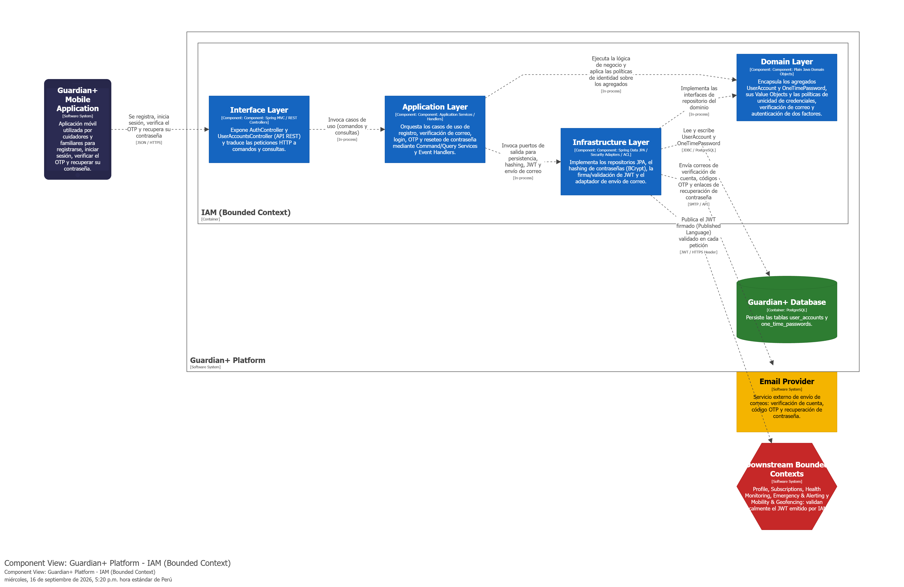

#### 2.6.7.6. Bounded Context Software Architecture Code Level Diagrams

En esta sección se presenta la estructura interna del Bounded Context **IAM** a nivel de código, mediante el diagrama de clases de su Domain Layer y el diseño de su base de datos.

##### 2.6.7.6.1. Bounded Context Domain Layer Class Diagrams

El diagrama UML de la Figura 2.63 presenta la Domain Layer de **IAM**, con los agregados `UserAccount`, `OneTimePassword` y `PasswordResetToken`, sus Value Objects y enumeraciones, y las interfaces de repositorio y de hashing que utiliza.

<a id="figura-2-63"></a>**Figura 2.63.** Diagrama de clases de la Domain Layer de IAM

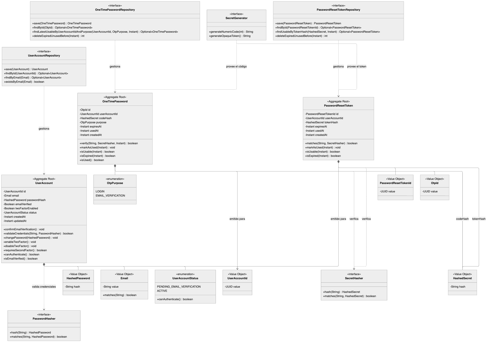

##### 2.6.7.6.2. Bounded Context Database Design Diagram

La Figura 2.64 presenta el diseño de persistencia de **IAM**: `user_accounts` almacena las cuentas con su correo, su contraseña cifrada y su estado, mientras que `otp_codes` y `password_reset_tokens` registran los códigos de segundo factor y los tokens de recuperación de contraseña de cada cuenta.

<a id="figura-2-64"></a>**Figura 2.64.** Diagrama de base de datos de IAM

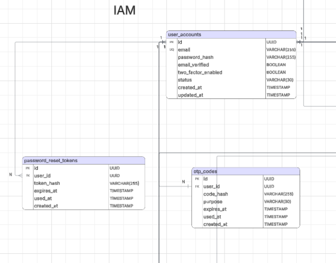

### Guardian+ Physical Database Schema

Como complemento a los Database Design Diagrams definidos individualmente para cada Bounded Context, la Figura 2.65 presenta una vista consolidada del esquema físico de persistencia de **Guardian+**.

El Physical Schema ERD integra las principales tablas utilizadas por los distintos contextos del sistema y permite visualizar de manera conjunta sus claves primarias, claves foráneas y relaciones. Esta representación facilita la comprensión de cómo los datos persistentes de identidad, perfiles, suscripciones, monitoreo de salud, alertas, rutinas de cuidado y demás capacidades de Guardian+ se relacionan dentro de la infraestructura de almacenamiento.

<a id="figura-2-65"></a>**Figura 2.65.** Esquema físico consolidado de la base de datos de Guardian+

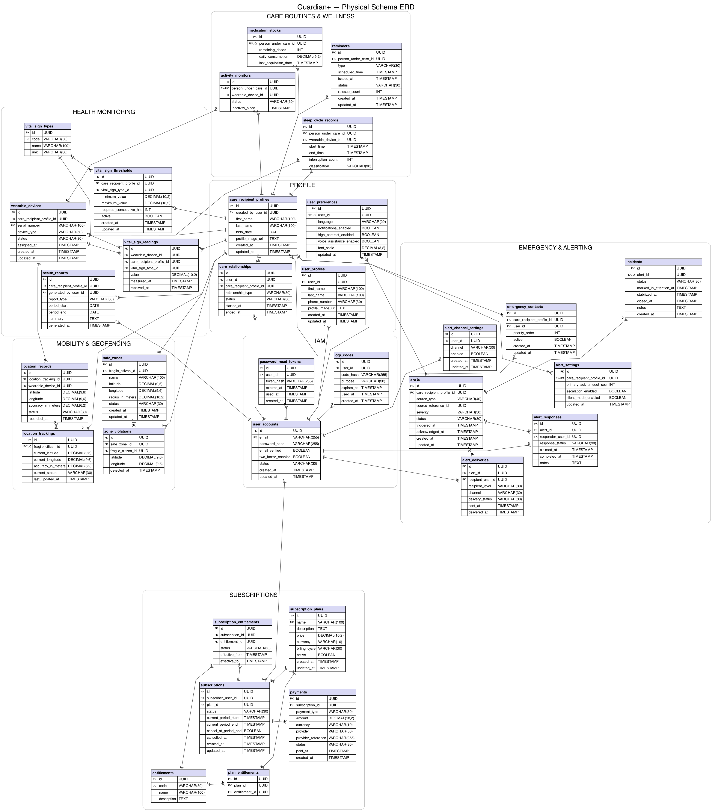

El modelo mantiene la separación lógica definida mediante los Bounded Contexts, mientras que las referencias necesarias entre sus datos persistentes se representan mediante identificadores y relaciones explícitas. De esta manera, el esquema físico proporciona una visión integral de la persistencia sin sustituir los Database Design Diagrams particulares documentados previamente para cada contexto.

<div style="page-break-before: always; break-before: page;"></div>

# Capítulo III: Solution UI/UX Design

En este capítulo se presenta el diseño de la experiencia y de la interfaz de Guardian+: la guía de estilos, la arquitectura de información, el diseño del Landing Page y el diseño de la aplicación móvil, desde sus wireframes hasta el prototipo navegable.

## 3.1. Product design

En esta sección se presenta el diseño de producto de Guardian+, que parte de la guía de estilos y la arquitectura de información para definir el Landing Page y la aplicación móvil.

### 3.1.1. Style Guidelines

Las presentes directrices de estilo definen el lenguaje visual, los componentes y las convenciones de interfaz para la plataforma Guardian+, abarcando tanto el sitio web estático (Landing Page) como la aplicación móvil nativa y multiplataforma. Este sistema asegura consistencia, accesibilidad universal y un entorno confiable para familiares, cuidadores y ciudadanos en situación de vulnerabilidad o dependencia.

**Concepto de diseño.** Todas las decisiones que siguen responden a una misma intención: que la interfaz se perciba como *una casa tranquila y no como una sala de hospital*. Guardian+ traslada información clínica a un entorno doméstico y de uso cotidiano, por lo que su lenguaje visual no puede adoptar la estética de un equipo médico —oscura, saturada, densa en datos— ni la de una aplicación de fitness —festiva, competitiva, gamificada—. La primera trasladaría a la casa la tensión de una unidad de cuidados intensivos; la segunda trivializaría una responsabilidad que para el usuario es afectiva antes que deportiva. El sistema se sitúa deliberadamente entre ambas: rigor en la estructura y en la precisión de los datos, calidez en el color, la forma y el espacio.

Esta intención se deriva del valor central que el Capítulo I identifica en los segmentos objetivo: lo que familiares y cuidadores buscan, antes que cualquier funcionalidad, es *tranquilidad*. Un producto que promete calma no puede generar tensión visual al abrirse. De ahí que el estado normal —la situación mayoritaria, la que el usuario verá casi siempre— se represente con un lenguaje sereno y silencioso, y que la intensidad visual esté racionada y reservada para lo excepcional. La jerarquía del sistema no se organiza por importancia funcional, sino por urgencia: el diseño permanece callado mientras todo está bien y solo eleva la voz cuando algo ocurre.

#### 3.1.1.1. General Style Guidelines

La guía de estilos general define los lineamientos que comparten el Landing Page y la aplicación móvil: el tono de comunicación, la paleta de colores, la tipografía y el uso de espaciado, bordes y elevaciones.

##### A. Tono de Comunicación y Lenguaje

El tono de Guardian+ equilibra la precisión médica con la serenidad humana indispensable para mitigar la ansiedad en situaciones de riesgo continuo:

*   **Formal / Casual:** *Formal y Profesional*. Proyecta rigor clínico, seguridad en la gestión de telemetría biométrica y solidez en los protocolos de auxilio.
*   **Entusiasta / Sereno:** *Sereno y Calmo*. Prioriza la claridad analítica y la templanza en estados de alarma crítica, evitando elementos alarmistas que susciten pánico infundado.
*   **Respetuoso / Irreverente:** *Estrictamente Respetuoso*. Reconoce la dignidad, privacidad y autonomía de las personas bajo cuidado y la responsabilidad de sus redes de apoyo.
*   **Divertido / Serio:** *Serio y Confiable*. Enfocado en la eficiencia operativa, la legibilidad inmediata de signos vitales y la rapidez de respuesta ante emergencias.

**Justificación de diseño.** El tono es la voz de la marca y define qué clase de acompañante es el producto. Guardian+ elige el registro de un profesional de confianza que informa sin sobresaltar: la misma manera en que un médico comunica una novedad a una familia. Los dos extremos disponibles fueron descartados por razones de contexto. Un tono entusiasta y motivacional, propio de las aplicaciones de actividad física, convertiría el cuidado de una persona vulnerable en un juego de logros y felicitaciones, algo que el usuario percibiría como una falta de seriedad frente a un asunto que le resulta afectivamente delicado. Un tono estrictamente clínico, construido sobre terminología técnica y cifras sin interpretación, trasladaría a la casa la frialdad del entorno hospitalario y dejaría al familiar con el dato pero sin la conclusión, que es precisamente lo que necesita.

La serenidad es agradable porque devuelve al usuario la sensación que compró: un mensaje como *Elena está bien · Actualizado hace 2 min* comunica normalidad de manera afirmativa, mientras que la ausencia de avisos podría interpretarse como una falla del sistema. El producto habla incluso cuando no hay novedades, y ese hábito de confirmar la calma es lo que construye el vínculo cotidiano con la aplicación. En el otro extremo, la emergencia se comunica con frases cortas y una acción evidente, sin signos de exclamación ni lenguaje dramático, porque en ese momento el usuario necesita dirección y no énfasis. El respeto es una decisión de diseño explícita y no una cortesía: la persona bajo cuidado es un sujeto con nombre propio dentro de la interfaz, nunca *el paciente* ni *el monitoreado*, y la pulsera le habla a ella directamente. Esta elección sostiene que el producto es un acompañamiento y no un instrumento de vigilancia, distinción que determina si la persona acepta usar el dispositivo.

**Justificación de usabilidad.** El tono traduce la terminología médica a expresiones de uso cotidiano y acompaña cada cifra de una interpretación en palabras (*Normal*, *Requiere atención*), porque familiares y cuidadores no son personal clínico. El registro sereno atiende además al contexto real de uso: quien abre la aplicación tras recibir una alerta lo hace bajo estrés, condición en la que la capacidad de procesamiento se reduce y un lenguaje alarmista incrementa el tiempo de reacción en lugar de acortarlo. Reservar las expresiones de urgencia para las emergencias reales evita también la fatiga de alertas: si todo aviso se comunica como crítico, el usuario deja de distinguir prioridades y termina desatendiendo las que sí lo son.

##### B. Paleta de Colores

La paleta cromática se estructura bajo las especificaciones técnicas del design system implementado, garantizando cumplimiento de contraste WCAG 2.1 nivel AA y AAA para usuarios con visión reducida, como se detalla en la Tabla 3.1:

<a id="tabla-3-1"></a>**Tabla 3.1.** Paleta de colores de Guardian+

| Token de Color | Código Hex | Rol en Interfaz | Conformidad WCAG |
| :--- | :--- | :--- | :--- |
| **Primary** | `#167A62` | Verde esmeralda clínico para botones primarios, estados activos y cabeceras | AA (4.8:1 sobre blanco) |
| **Primary Foreground** | `#FFFFFF` | Texto e iconos interactivos sobre contenedores primarios | AAA (> 7.0:1) |
| **Secondary (Pastel)** | `#D3F8F0` | Fondo de métricas estables, insignias y estados de sincronización | AA con Foreground |
| **Secondary Foreground** | `#169084` | Etiquetas, iconografía médica de soporte y enlaces secundarios | AA (4.5:1 sobre pastel) |
| **Accent Mint** | `#D9F0E7` | Relleno de chips interactivos y zonas de selección activa | AAA (> 7.0:1) |
| **Accent Foreground** | `#123128` | Verde bosque profundo para títulos y datos numéricos de alta jerarquía | AAA (12.2:1 sobre acento) |
| **Neutral Background** | `#F8FBF9` | Fondo base de las vistas móviles y secciones de la Landing Page | AAA (> 14.0:1 con texto) |
| **Neutral Foreground** | `#123128` | Color principal de lectura para párrafos, valores y etiquetas | AAA (14.5:1 sobre fondo) |
| **Neutral Muted** | `#EEF4F1` | Contenedores neutros secundarios y divisores estructurales | AA |
| **Muted Foreground** | `#587168` | Texto secundario, unidades de medida (bpm, mmHg) y marcas de tiempo | AA (4.6:1 sobre fondo) |
| **Border** | `#CFE0D8` | Líneas de división de tablas y bordes de tarjetas contenedoras | Componente UI |
| **Surface Card** | `#FFFFFF` | Superficie de tarjetas de métricas biométricas y tarjetas de incidentes | AAA con Foreground |
| **Card Foreground** | `#123128` | Texto principal de métricas y estados dentro de tarjetas | AAA (> 14.0:1) |
| **Destructive / Alert** | `#C53B3B` | Indicador de emergencias críticas, picos de presión y botón SOS activo | AA (4.7:1 sobre blanco) |
| **Destructive Foreground** | `#FFFFFF` | Tipografía de advertencias críticas sobre fondos destructivos | AAA (> 7.0:1) |
| **Pastel Orange (Warning)** | `#FFE6CC` | Advertencias de batería baja, umbrales en observación y rutinas pendientes | AAA con `#7A3E00` |
| **Pastel Orange Text** | `#B25900` | Etiquetas de advertencia preventiva y estados de tolerancia | AA (4.6:1 sobre fondo) |
| **Pastel Yellow (Notice)**| `#FFF4CC` | Alertas informativas de geocercas, recordatorios y revisiones programadas | AAA con `#665200` |
| **Pastel Yellow Text** | `#806600` | Tipografía de notificaciones preventivas y estados de sincronización | AA (4.5:1 sobre fondo) |

La Figura 3.1 muestra la paleta de colores del design system.

<a id="figura-3-1"></a>**Figura 3.1.** Paleta de colores aplicada en el design system

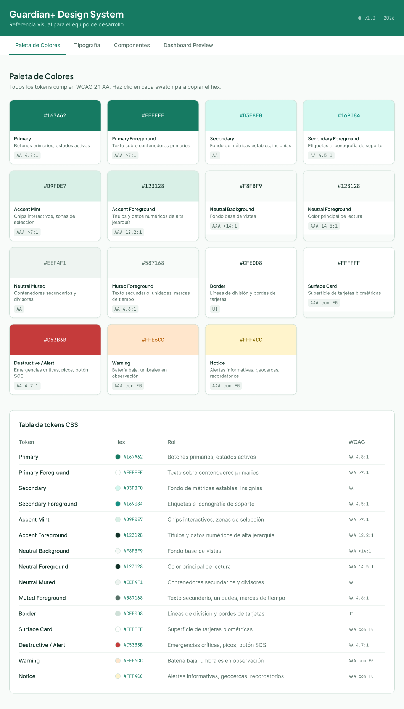

**Justificación de diseño.** *Por qué verde como color principal.* El verde es el color con el que la cultura visual de la salud representa la estabilidad: es el tono en que los monitores clínicos muestran un signo vital dentro de rango y el que el usuario ya asocia con *todo está en orden*. Como el estado normal es el que la aplicación muestra la mayor parte del tiempo, el color de marca y el color del bienestar coinciden, y la pantalla habitual resulta afirmativa por sí misma, sin necesidad de mensajes adicionales. Se descartó el azul, opción por defecto en el software médico y corporativo, por dos razones: comunica tecnología y procedimiento antes que cuidado, y resulta distante en un producto que media una relación familiar. El verde, en cambio, pertenece al registro de lo vivo, lo natural y lo sano.

*Por qué este verde y no otro.* El tono elegido, `#167A62`, es un esmeralda profundo con desviación hacia el azul verdoso. Esa inclinación es intencional: recoge del azul la seriedad y la sensación de competencia técnica que exige un producto que administra datos de salud, y del verde la vitalidad y la cercanía. Su saturación es moderada y su luminosidad baja, de modo que el color se lee sobrio y adulto; un verde más brillante o más amarillento habría evocado el vocabulario visual de lo *eco*, lo orgánico o lo infantil, y habría restado autoridad a la información clínica. El resultado es un color que puede sostener una cabecera y un botón de acción principal sin cansar ni banalizar el contenido.

*Por qué una paleta pastel y de baja saturación.* Los secundarios `#D3F8F0` y `#D9F0E7` son variaciones muy claras del mismo verde, lo que produce una armonía monocromática: la pantalla se percibe como una sola atmósfera y no como una suma de elementos que compiten. Esta es la decisión que más contribuye a que la interfaz resulte agradable en un uso frecuente y prolongado, porque el color saturado en superficies amplias genera tensión y fatiga visual, mientras que el pastel actúa como tela, madera o pintura de pared: materiales del entorno doméstico al que el producto pertenece. Al mantener toda la paleta en un rango cromático bajo, el sistema conserva además un recurso escaso —el color intenso— disponible únicamente para lo urgente.

*Por qué los avisos siguen el código del semáforo.* Los estados intermedios se resuelven con el naranja `#FFE6CC` y el amarillo `#FFF4CC`, y la emergencia con el rojo `#C53B3B`. La secuencia verde–ámbar–rojo es la convención de urgencia más extendida y no requiere aprendizaje alguno, ventaja decisiva para usuarios de edad avanzada o con poca familiaridad digital, que comprenden el nivel de gravedad antes de leer la etiqueta. Los tonos cálidos actúan como contrapunto del verde dominante y por ello destacan con claridad, pero se aplican en versión pastel para que el aviso preventivo llame la atención sin producir sobresalto. El rojo, en cambio, es un ladrillo ligeramente desaturado y no un rojo puro de máxima intensidad: transmite urgencia inequívoca y conserva un carácter contenido, coherente con un producto que evita el alarmismo incluso en su momento más crítico.

*Por qué el texto no es negro y el fondo no es blanco.* El color de lectura `#123128` es un verde bosque muy oscuro en lugar de negro puro. El negro sobre blanco produce el contraste máximo posible y con él una vibración incómoda en lecturas largas; un oscuro con matiz verde suaviza esa dureza, integra la tipografía en la misma familia cromática que el resto del sistema y da al conjunto un acabado más cuidado. Por la misma lógica, el fondo `#F8FBF9` es un blanco con una mínima presencia de verde: el blanco puro remite a lo estéril y clínico, deslumbra en el uso nocturno propio del monitoreo continuo, y no permitiría que las tarjetas blancas se distinguieran del lienzo. Con este fondo apenas teñido, las superficies blancas de las tarjetas emergen como hojas de papel sobre una mesa, y la jerarquía se construye con luz en lugar de con bordes o color.

**Justificación de usabilidad.** Todos los pares de texto y fondo superan el mínimo de 4.5:1 exigido por el criterio WCAG 2.1 1.4.3 y los textos de lectura prolongada alcanzan el nivel AAA, decisión motivada por el perfil de los usuarios: la pérdida de sensibilidad al contraste y la presbicia son frecuentes tanto en la persona bajo cuidado como en los familiares de mayor edad que integran el círculo de cuidado. El significado nunca se transmite únicamente por color, conforme al criterio 1.4.1: cada estado combina el token cromático con un ícono y una etiqueta textual, de modo que un usuario con deuteranopia —la deficiencia más común, y especialmente sensible a la distinción entre el verde primario y el rojo destructivo— continúa diferenciando una lectura normal de una emergencia. La exclusividad del rojo cumple asimismo una función perceptiva: el color saturado se detecta de forma preatencional, antes de leer la pantalla, y pierde esa capacidad si aparece en elementos rutinarios.

##### C. Tipografía

La selección tipográfica maximiza la legibilidad en pantallas móviles de diversa densidad de píxeles y en paneles de visualización web:

*   **Familia Primaria (UI & Body Text):** `Inter`, Sans-Serif. Empleada en interfaces de usuario, etiquetas de navegación, formularios y texto de soporte general por su alta legibilidad en tamaños reducidos.
*   **Familia Secundaria (Display & Metrics):** `Plus Jakarta Sans`, Sans-Serif geométrica. Empleada en encabezados principales, paneles analíticos y lecturas de telemetría en tiempo real (frecuencia cardíaca, SpO₂).
*   **Familia Monospaciada (Data & Logs):** `JetBrains Mono`, Monospace. Empleada en coordenadas GPS, códigos identificadores de incidentes, tramas de telemetría y sellos temporales.

La Tabla 3.2 presenta la escala tipográfica normalizada:

<a id="tabla-3-2"></a>**Tabla 3.2.** Escala tipográfica de Guardian+

| Nivel Jerárquico | Familia Tipográfica | Peso | Tamaño (Desktop) | Tamaño (Mobile) | Line Height |
| :--- | :--- | :--- | :--- | :--- | :--- |
| **H1 Display** | Plus Jakarta Sans | Bold (700) | 36px | 28px | 1.2 |
| **H2 Section** | Plus Jakarta Sans | SemiBold (600) | 24px | 22px | 1.3 |
| **H3 Subsection** | Plus Jakarta Sans | Medium (500) | 18px | 16px | 1.4 |
| **Body Large** | Inter | Regular (400) | 16px | 16px | 1.5 |
| **Body Base** | Inter | Regular (400) | 14px | 14px | 1.5 |
| **Caption / Meta**| Inter | Medium (500) | 12px | 12px | 1.4 |
| **Data Metric** | JetBrains Mono | Medium (500) | 28px | 24px | 1.1 |

La Figura 3.2 muestra la tipografía del design system.

<a id="figura-3-2"></a>**Figura 3.2.** Tipografía aplicada en el design system

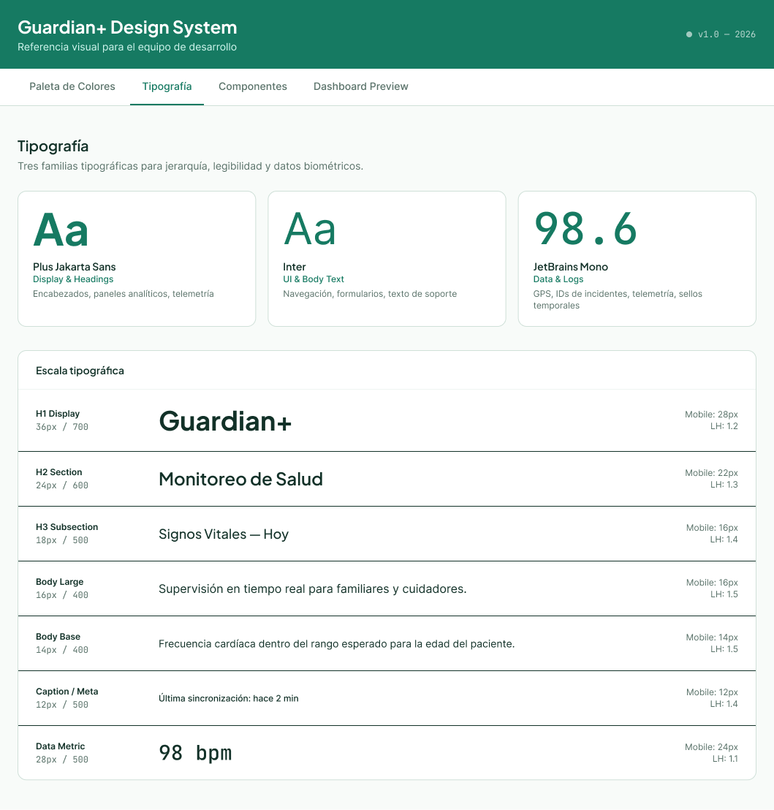

**Justificación de diseño.** *Por qué `Inter` en el cuerpo de texto.* `Inter` es una tipografía deliberadamente neutra, diseñada desde su origen para interfaces digitales. Esa neutralidad es el argumento a favor: en Guardian+ el protagonista debe ser el dato —una frecuencia cardíaca, una hora de medicación, el nombre de la persona bajo cuidado— y no la letra que lo escribe. Una tipografía con personalidad marcada añadiría una capa de estilo que competiría con la información y, en un producto de salud, restaría credibilidad. La carga emocional del sistema se deposita en el color y en el espacio; la tipografía de cuerpo aporta transparencia.

*Por qué `Plus Jakarta Sans` en los titulares.* La familia de despliegue es geométrica, con trazos de construcción limpia y detalles de corte humanista. Aporta al producto un carácter contemporáneo y amable que lo aleja del aspecto institucional de un sistema clínico, y lo hace únicamente en los titulares, donde el volumen de texto es breve y una tipografía con personalidad resulta un acierto en lugar de un obstáculo. La combinación funciona porque el contraste entre ambas familias es de estructura y no de estilo: las dos son sans-serif de proporciones afines, de modo que conviven sin disonancia. Se descartó emparejar una serif con una sans, recurso frecuente en diseño editorial, porque la serif habría dado al producto un aire tradicional, jurídico o institucional, incompatible con la inmediatez de una aplicación de monitoreo, además de degradarse en pantallas pequeñas.

*Por qué una monoespaciada para los datos.* `JetBrains Mono` cumple una función semántica: su forma comunica *medición* e *instrumento*, y basta ver una coordenada GPS o un identificador de incidente para entender que se trata de un valor registrado por el sistema y no de un texto redactado. Su ventaja decisiva en este producto es el ancho fijo de los dígitos: cuando una lectura biométrica se actualiza en tiempo real, las cifras cambian sin que el número se desplace ni el bloque se reacomode. Esa quietud es lo que permite mirar un valor que cambia continuamente sin que la pantalla resulte inquieta, y es también el motivo de que las métricas —y no solo los códigos— se compongan en esta familia.

*Por qué esta escala.* La escala es corta y de saltos amplios: siete niveles, sin tamaños intermedios que obliguen a decidir entre opciones equivalentes. El resultado es una jerarquía que se reconoce sin comparar, porque la diferencia entre un nivel y el siguiente siempre es evidente. Su rasgo característico es el peso otorgado al dato: una lectura biométrica se compone a 28px, un tamaño mayor que el del titular de su propia sección en móvil. Esta inversión de la jerarquía convencional define la estética del tablero —el número es la figura y todo lo demás es contexto— y responde al modo real de consulta: el usuario abre la aplicación para ver una cifra, no para leer una pantalla. Los niveles pequeños quedan reservados a la información que acompaña, como unidades y marcas de tiempo, que deben estar presentes pero nunca disputar la atención.

**Justificación de usabilidad.** Las tres familias son sans-serif de altura de x elevada y formas abiertas, características que sostienen la legibilidad en tamaños reducidos y en pantallas de baja densidad. `JetBrains Mono` diferencia además de manera inequívoca los caracteres 0/O y 1/l/I, lo que previene errores de lectura y de transcripción cuando un familiar dicta una ubicación o un código a un servicio de emergencia. La escala fija el cuerpo base en 14px y el de lectura extensa en 16px, sin descender por debajo de 12px, tamaño limitado a metadatos no críticos: ningún dato indispensable depende del nivel tipográfico más pequeño. El interlineado de 1.5 en los niveles de cuerpo cumple el criterio WCAG 2.1 1.4.12 y facilita el seguimiento de línea a usuarios con dislexia o con visión reducida. Limitar el sistema a tres familias y siete niveles refuerza, por último, la consistencia entre la Landing Page y la aplicación: el usuario aprende una sola vez qué significa cada jerarquía y la reconoce en ambos productos.


##### D. Espaciado, Bordes y Elevaciones (Effects)

*   **Sistema de Espaciado:** Cuadrícula base de 8px (incrementos de 4px, 8px, 12px, 16px, 24px, 32px, 48px).
*   **Border Radius:** 
    *   *Default (Tokens UI):* `12px` para tarjetas contenedoras, bloques analíticos y campos de entrada.
    *   *Subtle:* `6px` para botones de acción secundaria y etiquetas de estado.
    *   *Large:* `20px` para hojas inferiores modales (bottom sheets) y diálogos de confirmación.
    *   *Full:* `9999px` para botones de llamada directa, avatares e indicadores de pulso SOS.
*   **Elevaciones (Sombras CSS):**
    *   *Flat:* Sin sombra (`box-shadow: none`), demarcado por borde `#CFE0D8`.
    *   *Low:* `0px 1px 3px rgba(18, 49, 40, 0.06), 0px 1px 2px rgba(18, 49, 40, 0.04)` para tarjetas estáticas.
    *   *Mid:* `0px 4px 6px -1px rgba(18, 49, 40, 0.08), 0px 2px 4px -1px rgba(18, 49, 40, 0.04)` para elementos interactivos en foco y barras flotantes.
    *   *High:* `0px 10px 15px -3px rgba(18, 49, 40, 0.1), 0px 4px 6px -2px rgba(18, 49, 40, 0.05)` para modales de emergencia crítica.

La Figura 3.3 muestra el espaciado, los bordes y las elevaciones definidos.

<a id="figura-3-3"></a>**Figura 3.3.** Espaciado, bordes y elevaciones del design system

    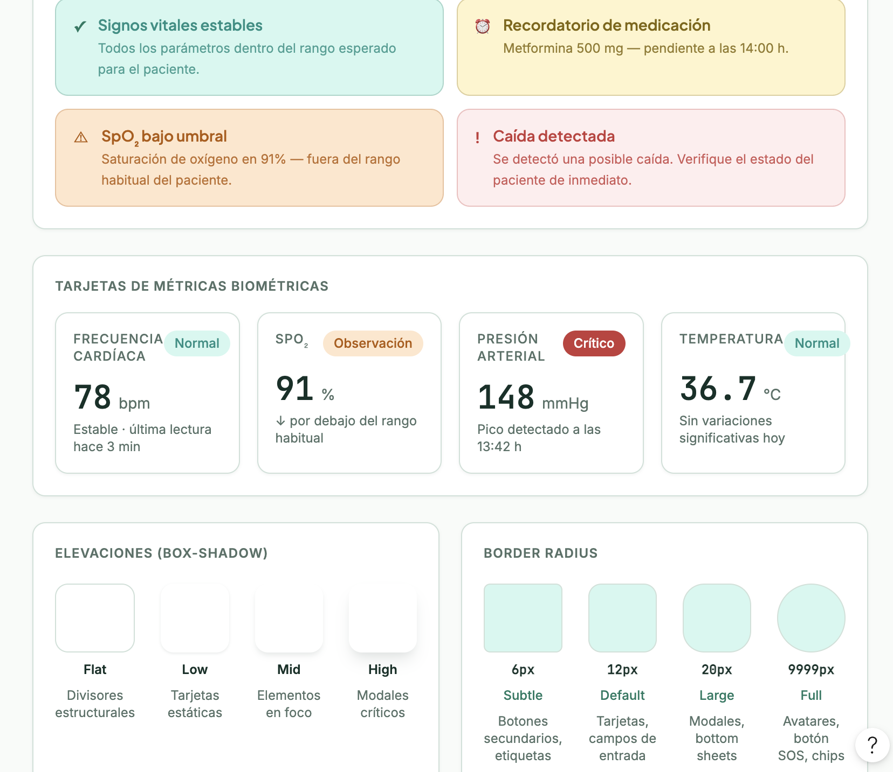

**Justificación de diseño.** *Por qué una cuadrícula de 8px y espacios generosos.* La retícula no se elige por comodidad de implementación, sino porque la alineación es lo que el usuario lee como calidad: una pantalla donde todos los márgenes son múltiplos de una misma unidad se percibe cuidada y, por extensión, fiable. En un producto cuyo argumento de venta es la confianza, la pulcritud de la composición forma parte de la promesa. El espacio en blanco que resulta de aplicar esa retícula con holgura cumple una función expresiva propia: una aplicación de monitoreo administra muchos indicadores a la vez y, sin aire entre ellos, adoptaría el aspecto de un panel de control saturado, precisamente la sensación que el producto quiere evitar. Al distribuir las tarjetas con márgenes amplios, la pantalla se lee reposada y la abundancia de datos deja de percibirse como complejidad.

*Por qué esquinas redondeadas y por qué estos radios.* La esquina viva se asocia a lo técnico, industrial y normativo; la redondeada, a lo blando y cercano. En un producto que entra en la casa para hablar de una persona querida, la forma debía ser amable, y por eso ningún contenedor del sistema tiene ángulos rectos. El valor de 12px es el punto de equilibrio buscado: suaviza el contorno de las tarjetas sin llegar al redondeo pronunciado que daría al producto un aire de juguete y le quitaría la seriedad que su contenido exige. Los radios crecen con la superficie —6px en las etiquetas y botones secundarios, 20px en las hojas inferiores y los diálogos— porque un mismo radio aplicado a superficies de tamaños muy distintos se percibe desigual: el elemento grande parece rígido y el pequeño, deformado. Escalarlo mantiene constante la sensación de suavidad en todo el sistema.

*Por qué la llamada y el SOS son circulares.* El círculo completo es la forma más física del sistema: remite a un botón real, pulsable, y es la única figura que se distingue del resto sin necesidad de leer nada. Reservarla para la llamada directa y para el indicador de pulso SOS hace que la acción de auxilio sea reconocible por su silueta en el instante en que el usuario está menos disponible para leer, y recupera además el lenguaje visual que la telefonía ha usado siempre para la misma acción.

*Por qué estas sombras y no más.* Las sombras están teñidas con el verde oscuro de la paleta, `#123128`, y no con negro neutro. Es una decisión de coherencia lumínica: sobre un fondo con matiz verde, una sombra gris se percibe sucia y ajena, mientras que una sombra del mismo matiz que el entorno parece proyectada por la luz de la propia escena. Sus opacidades son muy bajas, de modo que la profundidad se insinúa como luz difusa de día y no como un foco dirigido, en línea con la contención del resto del sistema. Esa moderación tiene una consecuencia deliberada: al mantener la interfaz casi plana en su uso habitual, la sombra pronunciada del modal de emergencia crítica se convierte en un acontecimiento visual. La profundidad, como el color intenso, es un recurso que el sistema administra con escasez para que signifique algo cuando aparece.

**Justificación de usabilidad.** La cuadrícula agrupa por proximidad los elementos de un mismo conjunto —valor, unidad y marca de tiempo de una métrica— y separa los conjuntos entre sí, de modo que la estructura de la pantalla se percibe antes de leer su contenido. Ese mismo espaciado garantiza que los controles interactivos conserven un área táctil mínima de 48dp y una separación suficiente entre ellos, condición necesaria cuando el usuario opera con una sola mano, con prisa o con destreza reducida por temblor o artrosis: cuanto mayor es el objetivo y menor la distancia, menor es el tiempo y la tasa de error al alcanzarlo, y un toque accidental sobre *Reconocer* o *Llamar* tiene consecuencias reales. El nivel *Flat*, por su parte, sustituye la sombra por un borde explícito `#CFE0D8`, de manera que la delimitación de los contenedores se mantiene visible en modos de alto contraste, donde las sombras dejan de percibirse.


Las Figuras 3.4 y 3.5 muestran un ejemplo de componentes y un ejemplo de vista que aplican estos lineamientos.

<a id="figura-3-4"></a>**Figura 3.4.** Ejemplo de componentes con los lineamientos de estilo

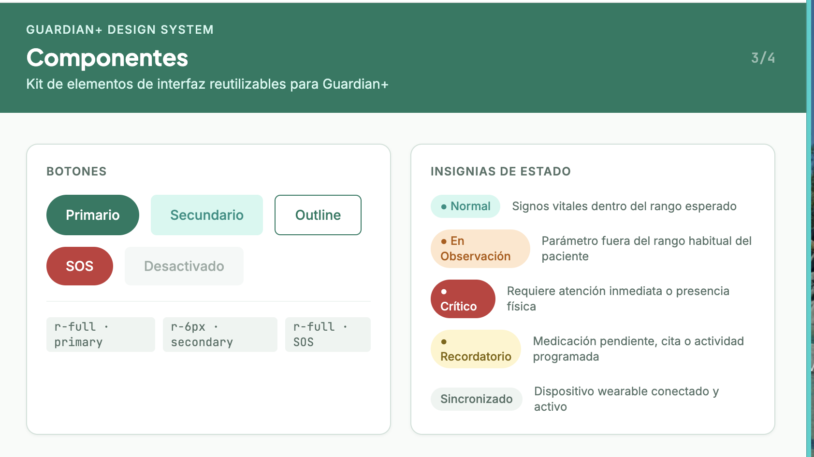

<a id="figura-3-5"></a>**Figura 3.5.** Ejemplo de vista con los lineamientos de estilo

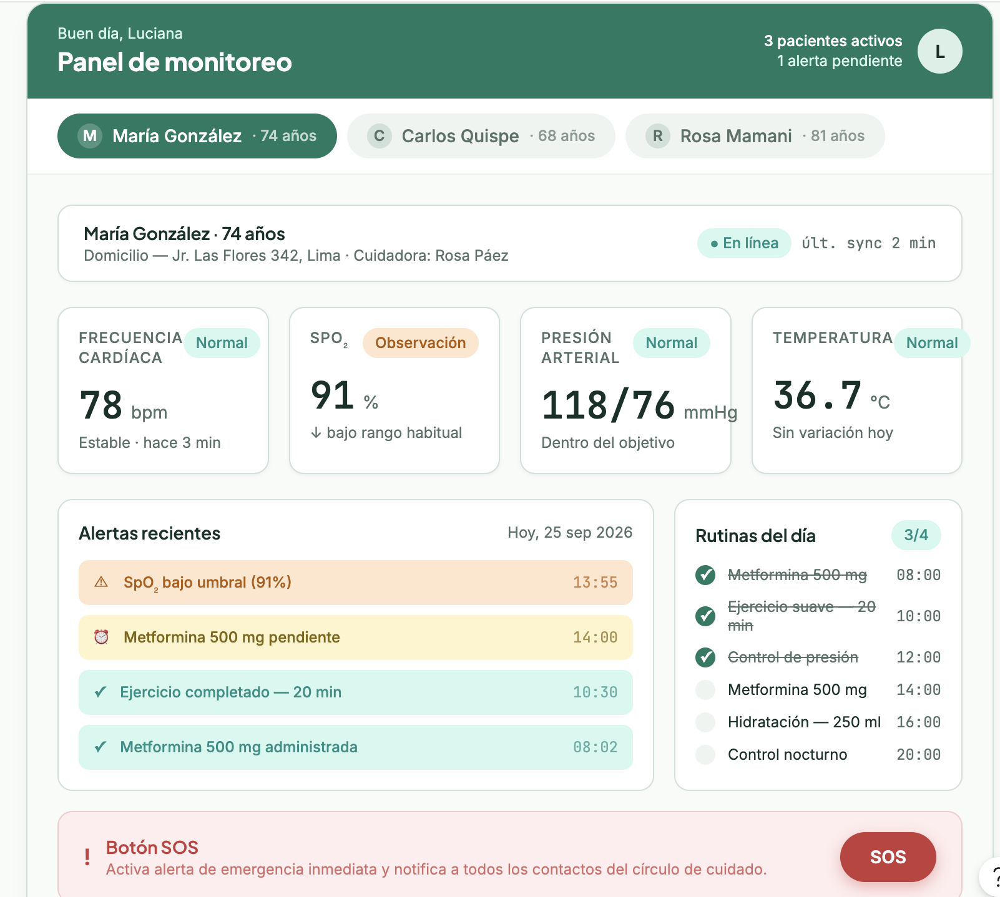

### 3.1.2. Information Architecture

La arquitectura de información define cómo se organiza, etiqueta, encuentra y recorre el contenido de Guardian+. En esta sección se presentan los sistemas de organización, etiquetado, búsqueda y navegación, junto con las etiquetas SEO del Landing Page.

#### 3.1.2.1. Organization Systems

Guardian+ organiza su información combinando estructuras visuales y esquemas de categorización según el tipo de contenido y la necesidad del usuario en cada momento.

##### Estructuras de organización

**Jerárquica (Visual Hierarchy).** Se aplica a la navegación principal de la app: desde el Inicio se accede a las 5 secciones core (Monitoreo de Salud, Rutinas y Bienestar, Alertas, Ubicación, Perfil), y dentro de cada una la información se prioriza visualmente según su criticidad — por ejemplo, en Alertas, las alertas activas se muestran por encima del historial de incidentes ya resueltos.

**Secuencial (Step-by-step).** Se usa en procesos donde el orden de los pasos es obligatorio: el flujo de autenticación y registro (Email → Contraseña → Iniciar Sesión), la respuesta ante una emergencia (alerta generada → ventana de confirmación → escalamiento a contactos), y la configuración inicial de la pulsera al vincular un nuevo dispositivo.

**Matricial (Matrix).** Se aplica donde el usuario necesita comparar información en dos dimensiones a la vez: el calendario semanal de recordatorios de medicación (horarios × días de la semana) y la comparación de planes de suscripción (beneficios × plan).

##### Esquemas de categorización

**Alfabético.** Para listas donde el usuario busca un ítem puntual por nombre: la lista de contactos de emergencia y el listado de medicamentos registrados.

**Cronológico.** Para todo lo que representa una secuencia en el tiempo: el historial de signos vitales, el historial de incidentes/alertas y el historial de pagos, donde lo más reciente aparece primero.

**Por tópico.** Es el criterio principal de la navegación de la app — cada sección agrupa funcionalidad relacionada siguiendo directamente los Bounded Contexts del dominio (Salud, Rutinas, Alertas, Ubicación, Perfil), de modo que el usuario siempre sabe en qué "mundo" de la app está.


La Figura 3.6 presenta los esquemas de organización de la aplicación móvil.

<a id="figura-3-6"></a>**Figura 3.6.** Esquemas de organización de la aplicación móvil

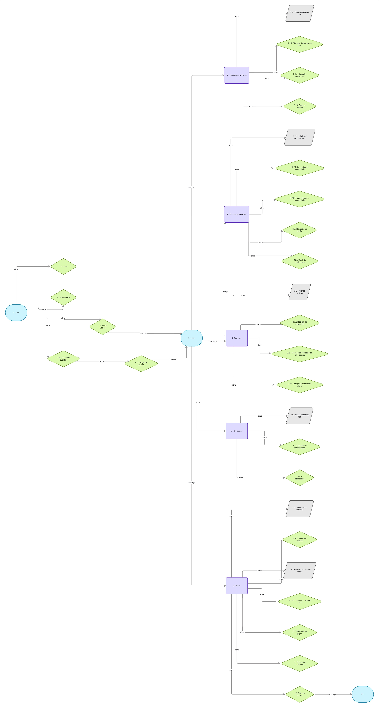

#### 3.1.2.2. Labelling Systems

Guardian+ define un sistema de etiquetas breve y consistente para que familiares, cuidadores y visitantes identifiquen cada conjunto de información sin necesidad de interpretar términos técnicos. Las etiquetas parten del Ubiquitous Language definido en el Capítulo II, pero se expresan en un lenguaje cotidiano y sereno, coherente con el tono de comunicación establecido en las Style Guidelines. Una misma etiqueta representa siempre el mismo concepto, tanto en la Landing Page como en la aplicación móvil.

##### Criterios de etiquetado

La Tabla 3.3 presenta los criterios de etiquetado aplicados en Guardian+.

<a id="tabla-3-3"></a>**Tabla 3.3.** Criterios de etiquetado

| Criterio | Aplicación en Guardian+ |
|---|---|
| **Mínimo de palabras** | Las etiquetas de navegación y los botones utilizan entre una y tres palabras. Las acciones se expresan con verbos en infinitivo (*Reconocer*, *Llamar*, *Exportar reporte*). |
| **Lenguaje cotidiano** | Los términos del dominio se traducen a palabras de uso común. Por ejemplo, *Fragile Citizen* se presenta como *Persona bajo cuidado* o directamente por su nombre. |
| **Tono sereno** | Los estados se comunican sin alarmismo: se utiliza *Requiere atención* en lugar de expresiones como *¡Peligro!*, reservando el color rojo y la palabra *Crítica* para emergencias reales. |
| **Ícono acompañado de texto** | Las opciones de navegación, los tipos de alerta y los estados combinan siempre ícono y texto. El color nunca es el único medio para transmitir un significado. |
| **Unidades visibles** | Cada valor biométrico muestra su unidad junto al número: lpm, mmHg, %, °C y rpm. |
| **Consistencia entre productos** | Las etiquetas compartidas entre la Landing Page y la aplicación (*Zonas seguras*, *Círculo de cuidado*, nombres de planes) se escriben exactamente igual en ambos productos. |

##### Del Ubiquitous Language a las etiquetas de interfaz

La Tabla 3.4 establece la correspondencia entre los términos del dominio y la etiqueta que el usuario visualiza, asegurando que la interfaz y el modelo de dominio hablen del mismo concepto.

<a id="tabla-3-4"></a>**Tabla 3.4.** Correspondencia entre el Ubiquitous Language y las etiquetas de interfaz

| Término del dominio | Etiqueta en la interfaz | Ubicación en la app |
|---|---|---|
| **Fragile Citizen** | Persona bajo cuidado (o su nombre, por ejemplo *Elena*) | Inicio, Perfil |
| **Care Circle** | Círculo de cuidado | Perfil |
| **Family / Caregiver** | Familiar / Cuidador | Registro, Círculo de cuidado |
| **Vital Signs** | Signos vitales | Salud |
| **Health History** | Historial | Salud, Alertas |
| **Care Routine** | Rutinas | Navegación principal |
| **Medication Reminder** | Medicación | Rutinas |
| **Medical Appointment** | Citas médicas | Rutinas |
| **Alert** | Alerta | Alertas |
| **Incident** | Incidente | Alertas › Historial |
| **Acknowledgment** | Reconocer | Detalle de alerta |
| **Emergency Contact** | Contactos de emergencia | Alertas › Configuración |
| **Escalation Chain** | Escalamiento | Alertas › Configuración |
| **Alert Settings** | Configuración de alertas | Alertas › Configuración |
| **Silent Mode** | Silenciar alertas no críticas | Alertas › Configuración |
| **Safe Zone** | Zonas seguras | Ubicación |
| **Care Plan** | Mi plan | Perfil |
| **Wearable Device** | Pulsera | Perfil, Onboarding |

##### Etiquetas del Landing Page

Las etiquetas del Landing Page coinciden con las secciones presentadas en los wireframes y mock-ups. Cada una funciona como una promesa de contenido: el visitante asocia la etiqueta con la información que encontrará al seleccionarla, sin que toda la información se concentre en un mismo lugar. La Tabla 3.5 presenta las etiquetas del Landing Page.

<a id="tabla-3-5"></a>**Tabla 3.5.** Etiquetas del Landing Page

| Etiqueta | Tipo | Asociación (qué encuentra el visitante) |
|---|---|---|
| **Cómo funciona** | Menú principal | Proceso de uso de Guardian+ explicado en tres pasos. |
| **Beneficios** | Menú principal | Las seis funcionalidades principales del producto. |
| **Por qué Guardian+** | Menú principal | Diferenciación frente a relojes fitness y botones SOS, junto con un testimonio. |
| **Precios** | Menú principal | Comparación de los planes Esencial, Guardian+ y Cuidado Pro. |
| **Contacto** | Menú principal | Formulario de contacto, teléfono y horario de atención. |
| **Conocer los planes** | CTA primario | Desplaza al visitante a la sección Precios. |
| **Ver cómo funciona** | CTA secundario | Desplaza al visitante a la sección Cómo funciona. |
| **Saber más** | Enlace de tarjeta | Amplía la descripción de una funcionalidad específica. |
| **Más elegido** | Distintivo | Identifica el plan recomendado para la mayoría de familias. |
| **Comenzar gratis** | CTA de plan | Inicia el uso del plan Esencial. |
| **Elegir este plan** | CTA de plan | Inicia la contratación de un plan de pago. |
| **Quiero más información** | Botón de formulario | Envía la solicitud de contacto al equipo de Guardian+. |
| **Privacidad · Términos** | Enlace de footer | Políticas de privacidad y términos de uso. |

Los campos del formulario de contacto utilizan etiquetas visibles sobre cada campo: *Nombre*, *Teléfono*, *Correo electrónico*, *¿A quién deseas cuidar?* y *Cuéntanos qué necesitas*.

Asimismo, las funcionalidades presentadas en la sección Beneficios anticipan las secciones que el usuario encontrará dentro de la aplicación, reforzando la asociación entre ambos productos, como se muestra en la Tabla 3.6:

<a id="tabla-3-6"></a>**Tabla 3.6.** Funcionalidades del Landing Page y sección asociada en la aplicación

| Funcionalidad en el Landing Page | Sección asociada en la app |
|---|---|
| **Salud en tiempo real** | Salud |
| **Detección de caídas + SOS** | Alertas |
| **Ubicación y zonas seguras** | Ubicación |
| **Rutinas sin olvidos** | Rutinas |
| **Prevención activa** | Alertas (inactividad prolongada) |
| **Siempre cerca** | Inicio (videollamada) |

##### Etiquetas de la aplicación móvil

La navegación principal de la aplicación se compone de cinco etiquetas, cada una asociada a un Bounded Context del dominio. El acceso a Perfil se ubica en el avatar de la barra superior. La Tabla 3.7 presenta las etiquetas de la navegación principal de la aplicación.

<a id="tabla-3-7"></a>**Tabla 3.7.** Etiquetas de la navegación principal de la aplicación

| Etiqueta | Ícono | Contenido asociado | Bounded Context | User Stories |
|---|---|---|---|---|
| **Inicio** | Casa | Estado general de la persona bajo cuidado, accesos rápidos y próximos recordatorios. | Vista integradora | US23 |
| **Salud** | Pulso | Signos vitales en tiempo real, historial y reportes de salud. | Health Monitoring | US01–US05, US07, US19, US21, US24 |
| **Rutinas** | Calendario | Medicación, citas médicas, actividad física, hidratación y descanso. | Care Routines & Wellness | US06, US13, US14, US17, US26, US27, US29 |
| **Alertas** | Campana | Alertas activas, historial de incidentes, contactos de emergencia y configuración de alertas. | Emergency & Alerting | US08–US12, US15, US16, US20, US22, US25 |
| **Ubicación** | Marcador de mapa | Ubicación actual y zonas seguras. | Mobility & Geofencing | US18, US28 |
| **Perfil** | Avatar | Datos del usuario, persona bajo cuidado, círculo de cuidado, pulsera, plan y sesión. | Profile, IAM, Subscriptions | — |

Dentro de cada sección se utilizan las etiquetas de la Tabla 3.8:

<a id="tabla-3-8"></a>**Tabla 3.8.** Etiquetas dentro de cada sección de la aplicación

| Sección | Pestañas | Etiquetas de contenido | Acciones |
|---|---|---|---|
| **Inicio** | — | *Elena está bien*, *Actualizado hace 2 min*, *Próximos recordatorios*, *Última alerta* | Llamar, Videollamada, Ver ubicación |
| **Salud** | Ahora · Historial | *Ritmo cardíaco (lpm)*, *Presión arterial (mmHg)*, *Oxígeno (%)*, *Temperatura (°C)*, *Respiración (rpm)*; filtros *Día · Semana · Mes* | Exportar reporte, Ver reporte semanal |
| **Rutinas** | Hoy · Semana | *Medicación*, *Citas médicas*, *Actividad*, *Hidratación*, *Descanso*, *Por agotarse* | Nuevo recordatorio, Reponer medicina |
| **Alertas** | Activas · Historial | *Caída*, *SOS*, *Signo vital fuera de rango*, *Salida de zona segura*, *Inactividad*, *Batería baja* | Reconocer, Llamar, Marcar estabilizado, Cerrar incidente, Configurar |
| **Ubicación** | Mapa · Zonas seguras | *Ubicación actual*, *Dentro de zona segura*, *Fuera de zona segura*, *Última actualización* | Nueva zona, Editar zona |
| **Perfil** | — | *Mis datos*, *Persona bajo cuidado*, *Círculo de cuidado*, *Pulsera*, *Mi plan* | Cerrar sesión |

Los flujos de acceso utilizan las etiquetas *Iniciar sesión*, *Crear cuenta*, *Correo electrónico*, *Contraseña*, *Código de verificación*, *¿Olvidaste tu contraseña?* y *Vincular pulsera*.

##### Etiquetas de estado

Los estados del dominio se presentan mediante etiquetas breves acompañadas del color semántico definido en la paleta de las Style Guidelines. La Tabla 3.9 presenta las etiquetas de estado.

<a id="tabla-3-9"></a>**Tabla 3.9.** Etiquetas de estado

| Concepto | Valor del dominio | Etiqueta | Color semántico |
|---|---|---|---|
| **Severidad de alerta** | `CRITICAL` / `HIGH` / `MEDIUM` | Crítica / Alta / Media | Destructive / Pastel Orange / Pastel Yellow |
| **Estado de alerta** | `PENDING_CONFIRMATION` | Confirmando | Pastel Yellow |
| | `TRIGGERED` / `ESCALATED` | Nueva / Escalada | Destructive |
| | `ACKNOWLEDGED` | Reconocida | Pastel Orange |
| | `DISMISSED` / `RESOLVED` | Descartada / Resuelta | Neutral Muted |
| **Estado de incidente** | `IN_ATTENTION` / `STABILIZED` / `CLOSED` | En atención / Estabilizado / Cerrado | Pastel Orange / Secondary / Neutral Muted |
| **Estado de recordatorio** | `SCHEDULED` / `ISSUED` / `REISSUED` | Programado / Pendiente / Reenviado | Neutral Muted / Pastel Yellow / Pastel Orange |
| | `CONFIRMED` / `CANCELLED` / `SUPPRESSED` | Confirmado / Cancelado / Omitido | Secondary / Neutral Muted / Neutral Muted |
| **Lectura de signo vital** | Rango normal / elevado / bajo / sin señal | Normal / Elevado / Bajo / Sin señal | Secondary / Pastel Orange / Pastel Orange / Neutral Muted |
| **Zona segura** | Dentro / fuera del perímetro | En su zona segura / Fuera de zona segura | Secondary / Pastel Yellow |
| **Pulsera** | Conectada / sin señal / batería baja | Conectada / Sin conexión / Batería baja | Secondary / Neutral Muted / Pastel Orange |

##### Etiquetas de la pulsera

La pulsera presenta un conjunto mínimo de etiquetas, pensadas para ser comprendidas por la persona bajo cuidado en una pantalla reducida. La Tabla 3.10 presenta las etiquetas de la pulsera.

<a id="tabla-3-10"></a>**Tabla 3.10.** Etiquetas de la pulsera

| Etiqueta | Función | User Story |
|---|---|---|
| **SOS** | Solicita ayuda inmediata a los contactos de emergencia. | US15 |
| **Estoy bien** | Confirma, dentro de la ventana de 30 segundos, que la persona se encuentra a salvo tras una advertencia, evitando movilizar al círculo de cuidado. | US10 |
| **Confirmar** | Registra que la medicación o la actividad recordada fue realizada. | US06, US14, US26 |
| **Responder** | Acepta la videollamada o la llamada de voz iniciada por un familiar. Disponible únicamente en los modelos de pulsera con capacidad de comunicación bidireccional. | US23 |

#### 3.1.2.3. SEO Tags and Meta Tags

  Guardian+ define elementos de Search Engine Optimization (SEO) para mejorar la identificación y visibilidad de su experiencia web en motores de búsqueda. Asimismo, se establecen elementos de App Store Optimization (ASO) para describir y posicionar adecuadamente la aplicación móvil en plataformas de distribución de aplicaciones.

##### Landing Page

La Landing Page constituye la presencia web pública de Guardian+ y tiene como propósito presentar la propuesta de valor de la solución, sus principales funcionalidades, beneficios, planes de suscripción y canales de contacto para familiares y cuidadores.

Debido a que la experiencia se estructura como una página informativa con navegación entre secciones, se utiliza un conjunto común de metadatos a nivel del documento principal. La Tabla 3.11 presenta estos elementos.

<a id="tabla-3-11"></a>**Tabla 3.11.** Elementos SEO del Landing Page

| SEO Element | Value |
|---|---|
| **Title** | Guardian+ \| Cuidado y monitoreo remoto |
| **Meta Description** | Guardian+ conecta a familiares y cuidadores con personas bajo cuidado mediante monitoreo remoto, alertas oportunas, geolocalización y tecnología wearable. |
| **Meta Keywords** | Guardian+, cuidado remoto, cuidadores, familiares, personas bajo cuidado, monitoreo de salud, alertas de emergencia, wearable, geolocalización, planes de suscripción |
| **Meta Author** | Healthify Team |

La configuración SEO definida para la Landing Page se incorporará en el documento principal mediante las etiquetas HTML correspondientes a `title`, `description`, `keywords` y `author`. Asimismo, se considera la configuración de `viewport` para garantizar una correcta visualización en dispositivos móviles. La Tabla 3.12 presenta las etiquetas HTML de SEO del Landing Page.

<a id="tabla-3-12"></a>**Tabla 3.12.** Etiquetas HTML de SEO del Landing Page

| HTML Tag | Value |
|---|---|
| `<title>` | Guardian+ \| Cuidado y monitoreo remoto |
| `<meta name="description">` | Guardian+ conecta a familiares y cuidadores con personas bajo cuidado mediante monitoreo remoto, alertas oportunas, geolocalización y tecnología wearable. |
| `<meta name="keywords">` | Guardian+, cuidado remoto, cuidadores, familiares, personas bajo cuidado, monitoreo de salud, alertas de emergencia, wearable, geolocalización, planes de suscripción |
| `<meta name="author">` | Healthify Team |
| `<meta name="viewport">` | width=device-width, initial-scale=1.0 |

Los términos seleccionados se relacionan con las principales secciones definidas para la Landing Page, como la explicación del funcionamiento de Guardian+, sus beneficios, características diferenciadoras, planes de suscripción y canales de contacto.

##### Web Application

En la arquitectura actual de Guardian+ no se contempla una Web Application operativa independiente. La experiencia web corresponde a la Landing Page pública, mientras que las funcionalidades operativas de monitoreo, alertas, ubicación, rutinas, perfiles y suscripciones son proporcionadas mediante la aplicación móvil.

Por este motivo, en la presente iteración no se definen SEO Tags ni Meta Tags adicionales para una Web Application separada, concentrándose la estrategia SEO de la experiencia web en la Landing Page.

##### Mobile Application — ASO Elements

La aplicación móvil constituye el principal medio de interacción para familiares y cuidadores dentro de Guardian+. Para su publicación y presentación en plataformas de distribución de aplicaciones se definen los siguientes elementos de App Store Optimization (ASO), presentados en la Tabla 3.13:

<a id="tabla-3-13"></a>**Tabla 3.13.** Elementos ASO de la aplicación móvil

| ASO Element | Value |
|---|---|
| **App Title** | Guardian+ |
| **App Subtitle/Short Description** | Cuidado y monitoreo remoto |
| **App Keywords** | cuidado remoto, cuidadores, familiares, adulto mayor, persona bajo cuidado, monitoreo, salud, alertas, emergencia, wearable, ubicación, seguridad |
| **App Description** | Guardian+ es una aplicación de apoyo para familiares y cuidadores que permite centralizar el seguimiento de personas bajo cuidado. Integrada con un dispositivo wearable, facilita el monitoreo remoto, la consulta de información relevante, la gestión de alertas ante situaciones de riesgo, el seguimiento de ubicación y el apoyo a rutinas de cuidado, permitiendo una respuesta más oportuna incluso cuando el responsable no se encuentra físicamente presente. |

Los elementos ASO definidos buscan comunicar de forma clara el propósito de Guardian+ y favorecer su identificación mediante términos relacionados con cuidado remoto, monitoreo, seguridad, alertas, ubicación y asistencia a personas bajo cuidado.

#### 3.1.2.4. Searching Systems

Guardian+ resuelve la totalidad de sus búsquedas con un único patrón de interacción, el **desplegable con búsqueda** (*searchable dropdown*), y un único mecanismo de filtrado, las **etiquetas** (*tags*). Todas las secciones que permiten consultar información —Salud, Rutinas, Alertas, Ubicación y Perfil— emplean estos dos componentes con el mismo comportamiento, de modo que el usuario aprende una sola mecánica de búsqueda y la reutiliza en el resto del producto. La búsqueda libre por texto abierto se descarta como mecanismo principal y se limita a los listados de nombres propios.

##### Justificación del patrón elegido

El desplegable con búsqueda combina las dos formas de localizar información sin obligar al usuario a elegir entre ellas: al abrirse muestra la lista completa de valores disponibles, lo que permite **reconocer** la opción buscada sin recordarla, y admite al mismo tiempo la escritura de unos pocos caracteres para **reducir** esa lista de inmediato. Esta doble vía resuelve la diferencia de uso entre los dos segmentos del producto: el familiar, que abre la aplicación de forma ocasional y no conoce de memoria las opciones, recorre la lista; el cuidador, que la usa varias veces al día y sabe qué busca, escribe dos letras y selecciona.

La razón de fondo para preferirlo a un campo de búsqueda abierto es que el vocabulario del dominio de Guardian+ es cerrado y conocido: existen cinco signos vitales, seis tipos de alerta, cinco tipos de rutina y un conjunto acotado de estados, todos ellos ya definidos en el Labelling Systems. Un campo de texto libre obligaría al usuario a adivinar ese vocabulario y produciría resultados vacíos cada vez que escribiera un término que el sistema no reconoce —*presión alta* en lugar de *Presión arterial*, *desmayo* en lugar de *Caída*—. El desplegable elimina por completo esa posibilidad: como solo ofrece valores existentes, ninguna consulta puede quedar sin resultados por un error de escritura o de terminología. En un producto usado bajo tensión y por personas de edad avanzada, evitar el callejón sin salida del *sin resultados* importa más que ofrecer la flexibilidad de la escritura libre.

El componente aporta además ventajas concretas en el contexto móvil. Cada opción es un objetivo táctil que cumple el área mínima definida en las Style Guidelines, por lo que seleccionar es más rápido y menos propenso a error que escribir en un teclado en pantalla, especialmente para un usuario con destreza reducida. Al no requerir ortografía exacta, tolera los términos clínicos difíciles de escribir. Y al mostrar siempre las opciones disponibles, informa al usuario de lo que el sistema puede hacer, en lugar de dejarlo frente a un campo vacío del que no sabe qué esperar.

Las etiquetas, por su parte, se eligen como mecanismo de filtrado porque hacen visible el estado de la consulta. Un filtro aplicado desde un menú que se cierra deja al usuario ante una lista incompleta sin explicación aparente, situación especialmente riesgosa en un historial de alertas, donde una lista filtrada puede leerse como *no hay más incidentes*. Cada etiqueta activa permanece en pantalla como un *chip* que declara el criterio vigente y que se elimina con un solo toque, de modo que el usuario siempre sabe por qué está viendo lo que ve y cómo volver atrás. Las etiquetas reutilizan literalmente las etiquetas de estado definidas en el Labelling Systems, con su mismo texto y su mismo color semántico, por lo que el vocabulario con el que se filtra es el mismo con el que se lee la información.

##### Anatomía del desplegable con búsqueda

La Tabla 3.14 describe los elementos del desplegable con búsqueda.

<a id="tabla-3-14"></a>**Tabla 3.14.** Anatomía del desplegable con búsqueda

| Elemento | Comportamiento |
|---|---|
| **Campo disparador** | Muestra la selección vigente o el texto de invitación de la sección (*Todos los signos vitales*, *Todos los tipos de alerta*). Presenta radio de 12px y un ícono de cheurón descendente. |
| **Panel desplegable** | Se abre como hoja inferior en móvil, con radio de 20px y elevación *High*, ocupando como máximo el 70% de la altura de la pantalla. |
| **Campo de búsqueda interno** | Se ubica en la cabecera del panel y filtra la lista a medida que el usuario escribe, sin distinguir mayúsculas ni acentos. |
| **Lista de opciones** | Presenta todas las opciones disponibles con su ícono y, cuando corresponde, su color semántico. Las coincidencias con el texto escrito se resaltan en negrita. |
| **Selección múltiple** | Los desplegables que admiten más de un valor incorporan casillas de verificación y un contador de seleccionados en el campo disparador (*2 tipos de alerta*). |
| **Acciones del panel** | *Aplicar* confirma la selección y cierra el panel; *Limpiar* restablece el valor por defecto de la sección. |
| **Estado sin coincidencias** | Cuando el texto escrito no coincide con ninguna opción, el panel indica que no existe ese criterio y ofrece la acción *Ver todas las opciones*, evitando que el usuario quede sin salida. |

##### Filtrado por etiquetas

La Tabla 3.15 describe los elementos del filtrado por etiquetas.

<a id="tabla-3-15"></a>**Tabla 3.15.** Elementos del filtrado por etiquetas

| Elemento | Comportamiento |
|---|---|
| **Barra de etiquetas activas** | Se sitúa bajo la cabecera de la sección y muestra un *chip* por cada criterio aplicado, con su color semántico y un ícono de cierre. |
| **Combinación de criterios** | Las etiquetas de una misma familia se combinan de forma inclusiva —*Crítica* junto con *Alta* devuelve ambas severidades— mientras que las etiquetas de familias distintas se combinan de forma restrictiva: *Crítica* junto con *Semana* devuelve las alertas críticas de la última semana. |
| **Eliminación** | Cada *chip* se retira individualmente con un toque en su ícono de cierre. La acción *Limpiar filtros* retira todos a la vez. |
| **Recuento de resultados** | Junto a la barra de etiquetas se indica la cantidad de registros que satisfacen la consulta (*12 resultados*). |
| **Persistencia** | Las etiquetas aplicadas se conservan al navegar al detalle de un registro y regresar, en coherencia con la regla de retorno predecible definida en los Navigation Systems. |
| **Resultado vacío** | Si ninguna combinación de etiquetas devuelve registros, la sección informa que no existen coincidencias para los criterios activos y ofrece la acción *Limpiar filtros*, en lugar de presentar una lista vacía sin explicación. |

##### Aplicación por sección

La Tabla 3.16 resume cómo se aplica cada mecanismo de búsqueda en cada sección.

<a id="tabla-3-16"></a>**Tabla 3.16.** Aplicación de los mecanismos de búsqueda por sección

| Sección | Desplegable con búsqueda | Etiquetas de filtrado | Presentación de resultados |
|---|---|---|---|
| **Salud** | Selector del parámetro biométrico: *Ritmo cardíaco*, *Presión arterial*, *Oxígeno*, *Temperatura*, *Respiración*. | Periodo (*Día · Semana · Mes*) y estado de la lectura (*Normal*, *Elevado*, *Bajo*, *Sin señal*). | Gráfica de tendencia del parámetro seleccionado y, bajo ella, la lista cronológica de lecturas con su etiqueta de estado. |
| **Rutinas** | Selector del recordatorio por nombre del medicamento, de la cita o de la rutina, con la lista completa visible al abrirse. | Tipo (*Medicación*, *Citas médicas*, *Actividad*, *Hidratación*, *Descanso*) y estado de cumplimiento (*Programado*, *Pendiente*, *Confirmado*, *Omitido*, *Reenviado*). | Agenda del periodo activo agrupada por franja horaria, con la etiqueta de estado de cada recordatorio. |
| **Alertas** | Selector del tipo de alerta: *Caída*, *SOS*, *Signo vital fuera de rango*, *Salida de zona segura*, *Inactividad*, *Batería baja*. Admite selección múltiple. | Severidad (*Crítica*, *Alta*, *Media*), estado del incidente (*En atención*, *Estabilizado*, *Cerrado*) y periodo (*Día · Semana · Mes*). | Lista cronológica descendente con la insignia de severidad de cada incidente y el acceso directo a su detalle. |
| **Ubicación** | Selector de la zona segura por nombre (*Casa*, *Parque*, *Club*), con la lista de zonas configuradas visible al abrirse. | Estado del perímetro (*En su zona segura*, *Fuera de zona segura*) y periodo (*Día · Semana · Mes*). | Mapa con la zona seleccionada resaltada y el registro de entradas y salidas del periodo. |
| **Perfil › Círculo de cuidado** | Selector del contacto por nombre, apellido o parentesco. Es el único caso en que la escritura libre opera sobre nombres propios, por lo que el desplegable acepta cualquier texto y filtra la lista de contactos registrados. | Rol (*Familiar*, *Cuidador*) y posición en el escalamiento (*Primario*, *Secundario*). | Lista ordenada alfabéticamente, con la posición de auxilio de cada contacto y la posibilidad de reordenarla. |

En la Landing Page no se incorpora un sistema de búsqueda: al tratarse de una página informativa de extensión acotada, la localización de contenido se resuelve mediante la navegación entre secciones descrita en los Navigation Systems.

#### 3.1.2.5. Navigation Systems

Guardian+ combina distintos sistemas de navegación para que visitantes y usuarios recorran el contenido sin perder de vista dónde se encuentran ni cómo volver. En el Landing Page, la navegación acompaña un recorrido narrativo que conduce al visitante hacia la elección de un plan o el contacto con el equipo. En la aplicación móvil, la navegación prioriza el acceso inmediato al estado de la persona bajo cuidado y la respuesta rápida ante una emergencia.

##### Landing Page

La Tabla 3.17 presenta los mecanismos de navegación del Landing Page.

<a id="tabla-3-17"></a>**Tabla 3.17.** Mecanismos de navegación del Landing Page

| Mecanismo | Componente | Descripción |
|---|---|---|
| **Navegación global** | Header fijo | Presenta el menú *Cómo funciona · Beneficios · Por qué Guardian+ · Precios · Contacto* en el mismo orden en que aparecen las secciones al hacer scroll. Permanece visible durante todo el recorrido y cada enlace desplaza al visitante a su sección (US30). |
| **Navegación global (mobile)** | Menú hamburguesa | En pantallas móviles el menú se agrupa en un ícono de hamburguesa que despliega las mismas cinco opciones. |
| **Navegación secuencial** | Scroll narrativo | Las secciones siguen el orden problema → solución → diferenciación → precio → acción, guiando al visitante de forma progresiva hacia la conversión. |
| **Navegación contextual** | CTAs | *Conocer los planes* lleva a Precios, *Ver cómo funciona* lleva a Cómo funciona y *Saber más* amplía cada funcionalidad sin abandonar la página. |
| **Navegación de conversión** | CTAs de planes y formulario | *Comenzar gratis* y *Elegir este plan* redirigen a la descarga de la aplicación móvil, donde se completa el registro. *Quiero más información* envía la solicitud de contacto y muestra un mensaje de confirmación. |
| **Navegación de retorno** | Logo y footer | El logo devuelve al inicio de la página. El footer repite el menú principal e incluye los enlaces *Privacidad · Términos*. |

La Figura 3.7 muestra la ubicación de estos mecanismos en el Landing Page.

<a id="figura-3-7"></a>**Figura 3.7.** Navegación del Landing Page

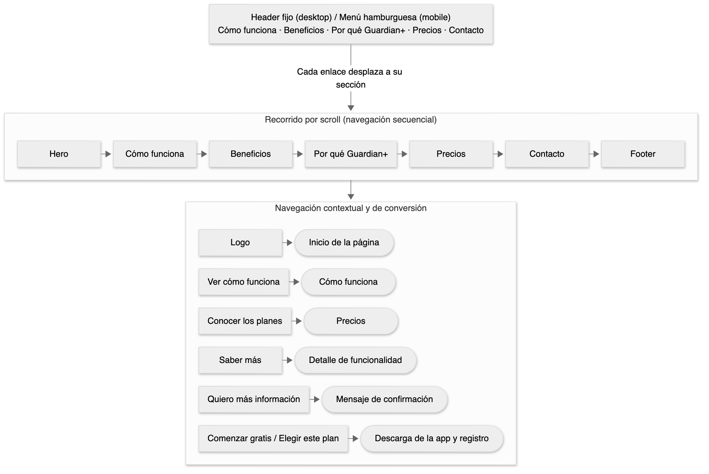

##### Aplicación móvil

La Tabla 3.18 presenta los tipos de navegación de la aplicación móvil.

<a id="tabla-3-18"></a>**Tabla 3.18.** Tipos de navegación de la aplicación móvil

| Tipo de navegación | Componente | Uso en Guardian+ |
|---|---|---|
| **Global** | Bottom navigation bar | Cinco destinos permanentes: *Inicio · Salud · Rutinas · Alertas · Ubicación*. Se muestra en todas las pantallas principales y se oculta en los flujos secuenciales y en la alerta a pantalla completa, para que el usuario se concentre en una sola tarea. |
| **Suplementaria** | Barra superior | Muestra el título de la pantalla, la flecha de regreso en pantallas secundarias y el avatar que conduce a Perfil. En Alertas incluye el acceso a *Configurar*. |
| **Local** | Pestañas | Cada sección organiza su contenido en pestañas: *Ahora · Historial* en Salud, *Hoy · Semana* en Rutinas, *Activas · Historial* en Alertas y *Mapa · Zonas seguras* en Ubicación. |
| **Contextual** | Tarjetas y enlaces internos | Las tarjetas de Inicio llevan a la sección correspondiente; el detalle de una alerta enlaza con *Ver ubicación* y con el historial de signos vitales del momento del evento. |
| **Secuencial** | Flujos paso a paso | El registro sigue los pasos *Crear cuenta → Código de verificación → Vincular pulsera → Persona bajo cuidado → Contactos de emergencia*, con un indicador de progreso (*Paso 2 de 5*). La creación de una zona segura también se realiza paso a paso. |
| **Por notificaciones** | Notificaciones push | Cada notificación abre directamente la pantalla relacionada: una alerta abre su detalle, un recordatorio abre Rutinas y la salida de una zona segura abre Ubicación. |
| **Indicadores de estado** | Badges | La pestaña Alertas muestra la cantidad de alertas activas, de modo que el usuario las identifica desde cualquier sección. |

Adicionalmente, se establecen las reglas de navegación de la Tabla 3.19:

<a id="tabla-3-19"></a>**Tabla 3.19.** Reglas de navegación de la aplicación móvil

| Regla | Descripción |
|---|---|
| **Profundidad máxima** | Ninguna pantalla se encuentra a más de tres niveles desde la navegación principal (sección → detalle → edición). |
| **Retorno predecible** | La flecha de regreso y el gesto del sistema siempre devuelven a la pantalla anterior, sin perder filtros ni pestañas seleccionadas. |
| **Estado por sección** | Cada destino de la bottom navigation bar conserva su propio estado; al volver a una sección, el usuario la encuentra donde la dejó. |
| **Prioridad de emergencia** | Una alerta crítica se superpone a cualquier pantalla y lleva al usuario a la acción *Reconocer* en un máximo de dos toques. |

##### Ruta de emergencia

La ruta de emergencia es el recorrido más crítico del producto, por lo que se diseña con el menor número de pasos posible. La Tabla 3.20 detalla cada paso de la ruta.

<a id="tabla-3-20"></a>**Tabla 3.20.** Ruta de emergencia

| Paso | Pantalla | Acción del usuario | Resultado |
|---|---|---|---|
| **1** | Notificación push | Toca la notificación | Se abre el detalle de la alerta a pantalla completa. |
| **2** | Detalle de alerta | Toca *Reconocer* | Se detiene el escalamiento y se abre el incidente con estado *En atención*. |
| **3** | Incidente en atención | *Llamar*, *Ver ubicación* o *Videollamada* | El usuario se comunica con la persona bajo cuidado o acude a su ubicación. |
| **4** | Incidente en atención | *Marcar estabilizado* y luego *Cerrar incidente* | El incidente se registra en *Alertas › Historial* y en el historial de salud. |

Si la alerta no es reconocida dentro del tiempo de espera configurado, el sistema la escala al siguiente contacto de emergencia según la cadena de escalamiento definida en *Configuración de alertas*.

##### Mapa de navegación de la aplicación

La Figura 3.8 presenta la distribución de las pantallas de la aplicación móvil y las rutas entre ellas.

<a id="figura-3-8"></a>**Figura 3.8.** Mapa de navegación de la aplicación móvil

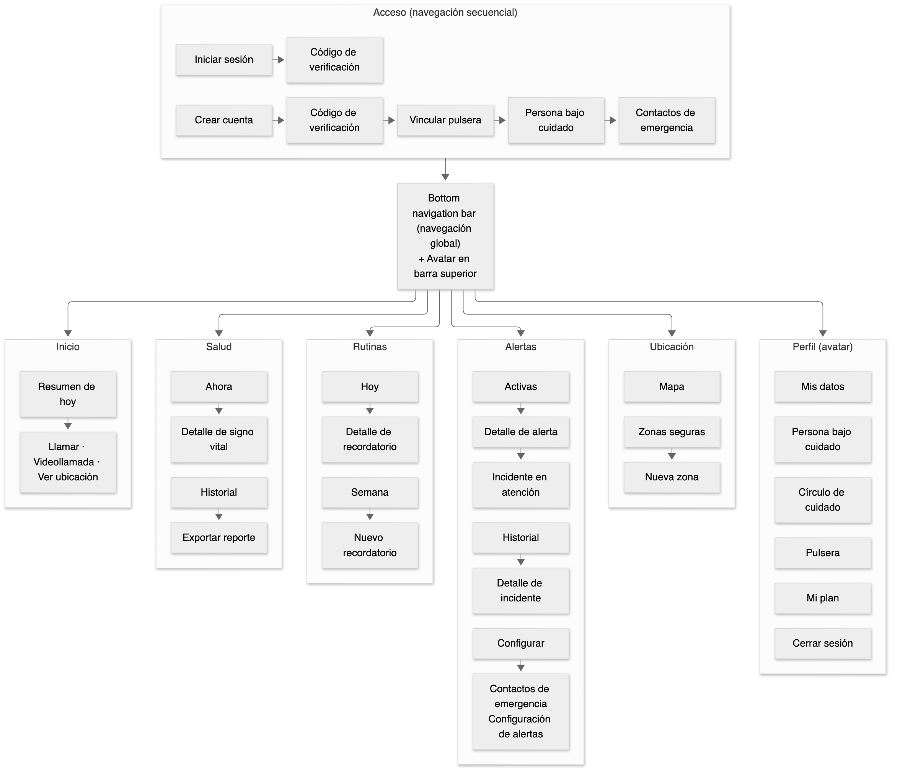

### 3.1.3. Landing Page UI Design

En esta sección se presenta el diseño de la interfaz del Landing Page de Guardian+, primero como wireframes y luego como mock-ups, en sus versiones para escritorio y para dispositivos móviles.

#### 3.1.3.1. Landing Page Wireframe

Los wireframes del Landing Page definen la estructura y la jerarquía de contenido de cada sección del sitio (Cómo funciona, Beneficios, Por qué Guardian+, Precios y Contacto), sin aplicar todavía la paleta de colores del Style Guide.

##### Landing page wireframe desktop

Las Figuras 3.9 a 3.13 presentan los wireframes de escritorio de cada sección del Landing Page.

###### Wireframe desktop - Cómo funciona

<a id="figura-3-9"></a>**Figura 3.9.** Wireframe de escritorio del Landing Page: Cómo funciona

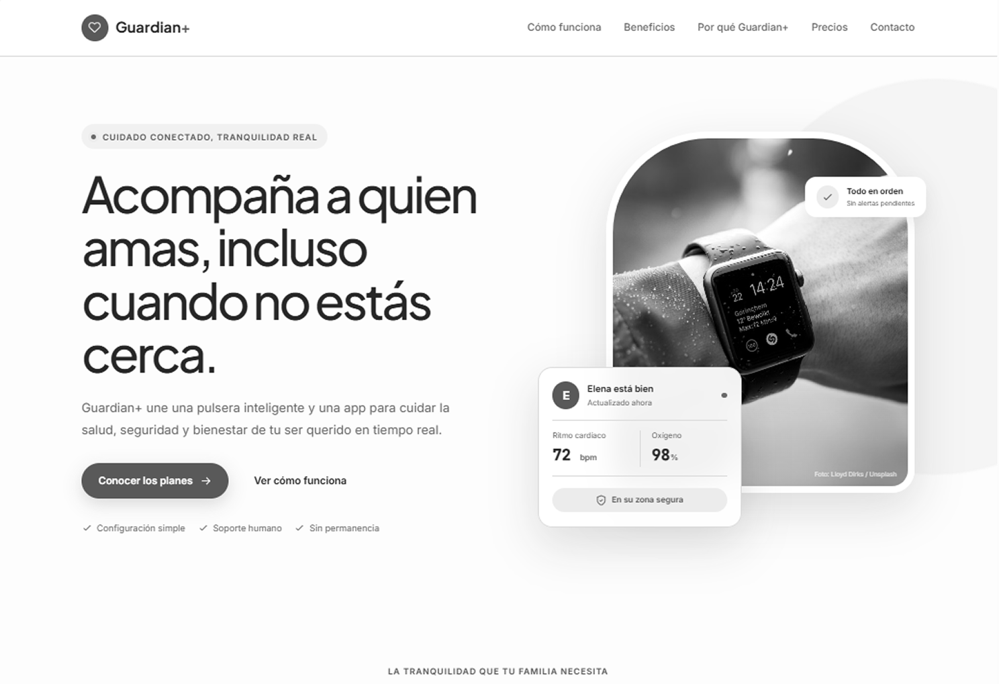

###### Wireframe desktop - Beneficios

<a id="figura-3-10"></a>**Figura 3.10.** Wireframe de escritorio del Landing Page: Beneficios

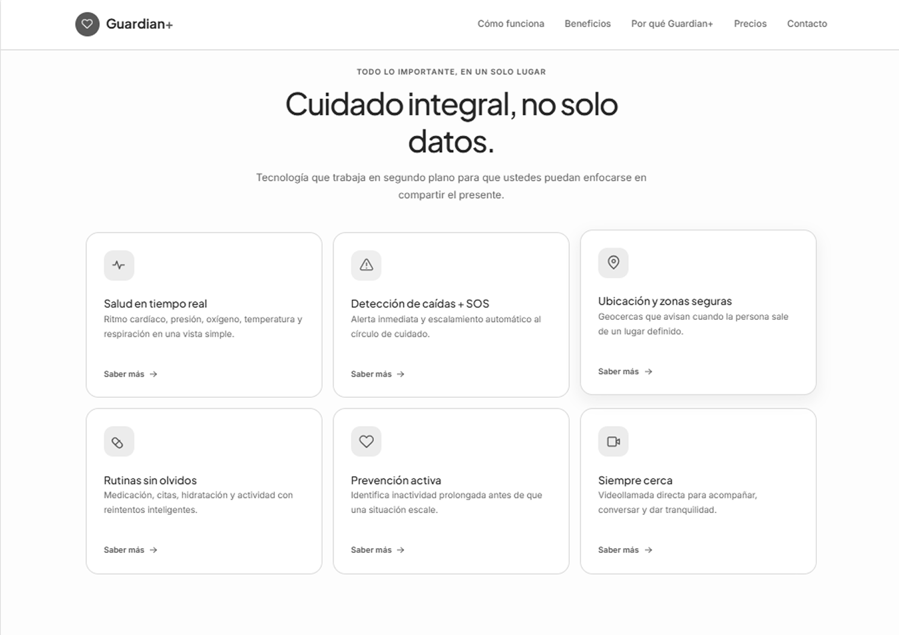

###### Wireframe desktop - Por qué Guardian+

<a id="figura-3-11"></a>**Figura 3.11.** Wireframe de escritorio del Landing Page: Por qué Guardian+

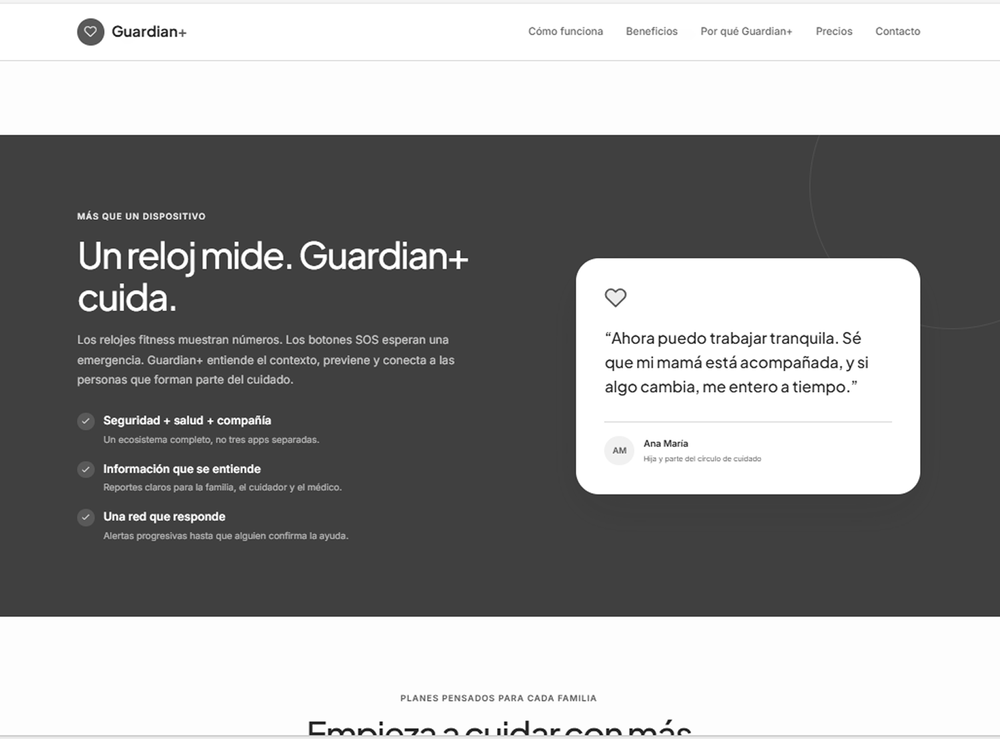

###### Wireframe desktop - Precios

<a id="figura-3-12"></a>**Figura 3.12.** Wireframe de escritorio del Landing Page: Precios

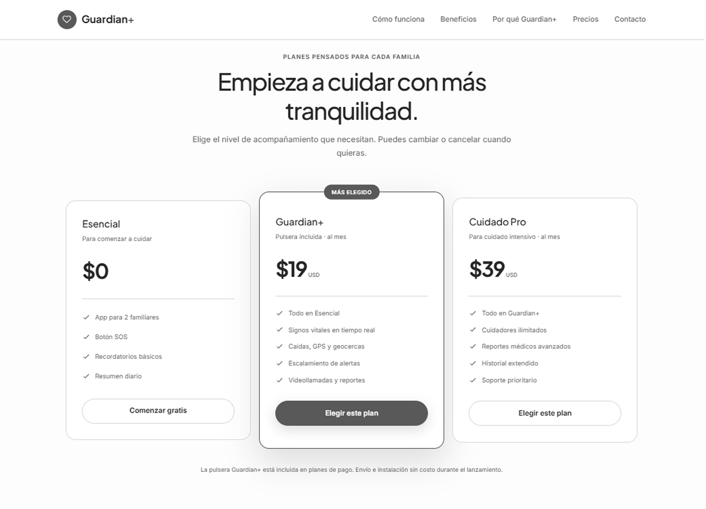

###### Wireframe desktop - Contacto

<a id="figura-3-13"></a>**Figura 3.13.** Wireframe de escritorio del Landing Page: Contacto

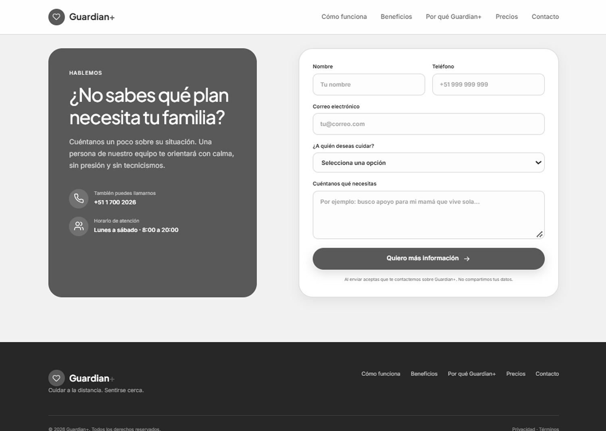

##### Landing page wireframe mobile

La Figura 3.14 presenta los wireframes del Landing Page en su versión móvil.

<a id="figura-3-14"></a>**Figura 3.14.** Wireframes móviles del Landing Page

<table>
  <tr>
    <td align="center" valign="top">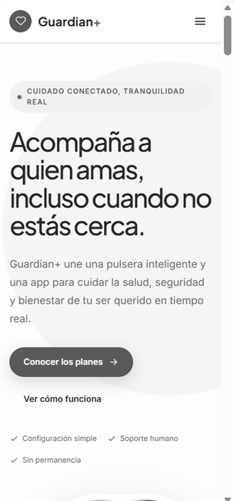<br><sub>Cómo funciona</sub></td>
    <td align="center" valign="top">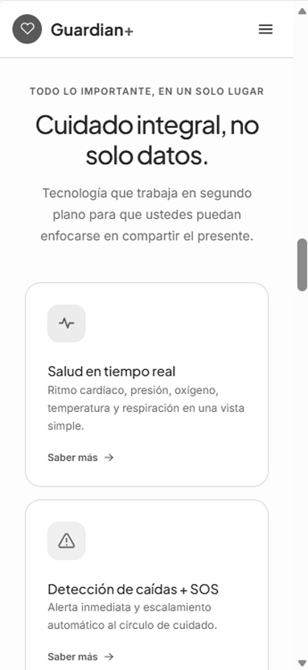<br><sub>Beneficios</sub></td>
    <td align="center" valign="top">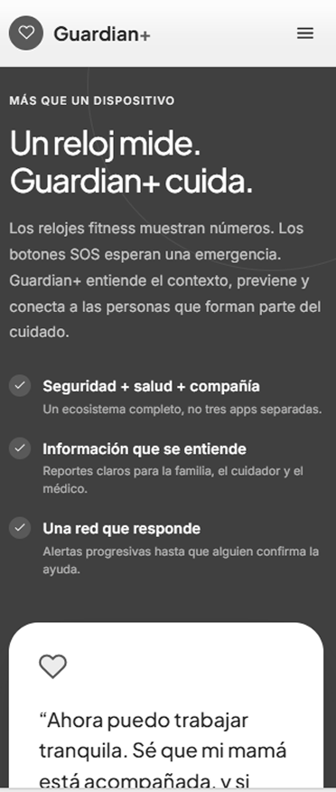<br><sub>Por qué Guardian+</sub></td>
  </tr>
  <tr>
    <td align="center" valign="top">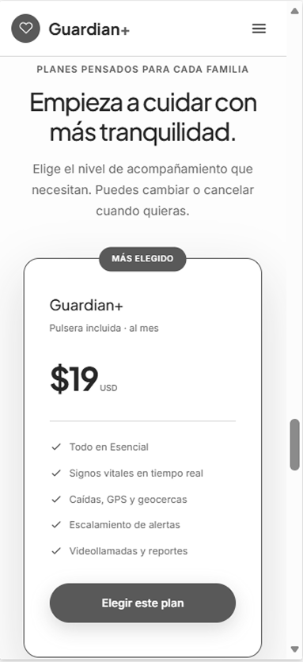<br><sub>Precios</sub></td>
    <td align="center" valign="top">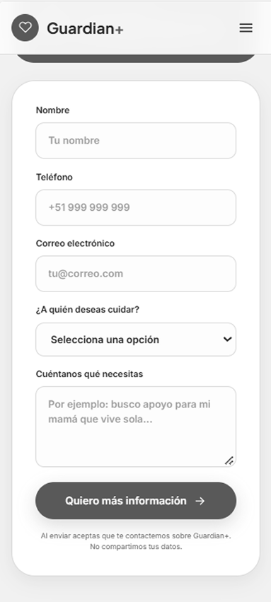<br><sub>Contacto</sub></td>
  </tr>
</table>


El wireframe de Guardian+ se estructura en escala de grises para validar la arquitectura de información antes de introducir color, tipografía final o imágenes: header de navegación, hero con CTA, sección de 3 preguntas del dolor del usuario, proceso en 3 pasos, grilla de 6 funcionalidades, bloque de diferenciación de marca, tabla de 3 planes de suscripción, formulario de contacto y footer. El menú de navegación (Cómo funciona → Beneficios → Por qué Guardian+ → Precios → Contacto) refleja exactamente ese mismo orden de scroll, siguiendo un flujo narrativo secuencial (problema → solución → diferenciación → precio → acción) coherente con lo definido en Organization Systems.

Jerarquía visual: cada bloque respeta un orden claro de lectura (título grande → subtítulo → contenido de apoyo → acción), reforzado por tamaño y peso tipográfico, no por color — esto permite validar que la jerarquía funciona incluso sin la paleta final.

Principios de diseño aplicados: alineación en grilla de 3 columnas para las tarjetas de pasos, funcionalidades y planes; proximidad (ícono + título + descripción + CTA agrupados en un mismo contenedor); repetición del mismo patrón de tarjeta en las 3 secciones de contenido, para que el usuario reconozca el patrón sin esfuerzo.

Diseño inclusivo: textos cortos y escaneables (títulos de 3-6 palabras, descripciones de una línea), CTAs con texto explícito ("Conocer los planes", no solo un ícono), y formulario de contacto con etiquetas visibles sobre cada campo (no solo placeholder), reduciendo la carga cognitiva para el público objetivo — familiares y cuidadores que buscan tranquilidad, no fricción técnica.

Versión Mobile: las mismas secciones se apilan en una sola columna, el menú colapsa a ícono de hamburguesa, y las grillas de 3 columnas pasan a apilarse verticalmente, manteniendo el mismo orden de lectura que en desktop.

#### 3.1.3.2. Landing Page Mock-up

Los mock-ups del Landing Page aplican sobre los wireframes la paleta de colores, la tipografía y los componentes definidos en el Style Guide, para las mismas secciones del sitio en escritorio y en dispositivos móviles.

##### Landing page mockup desktop

Las Figuras 3.15 a 3.19 presentan los mock-ups de escritorio de cada sección del Landing Page.

###### Mockup desktop - Cómo funciona

<a id="figura-3-15"></a>**Figura 3.15.** Mock-up de escritorio del Landing Page: Cómo funciona

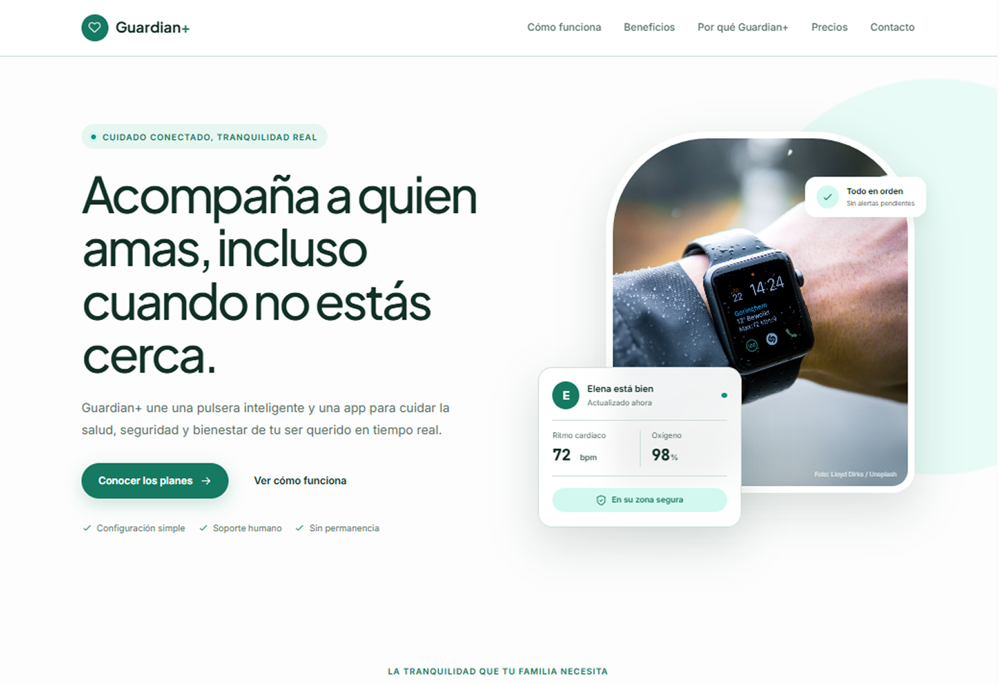

###### Mockup desktop - Beneficios

<a id="figura-3-16"></a>**Figura 3.16.** Mock-up de escritorio del Landing Page: Beneficios

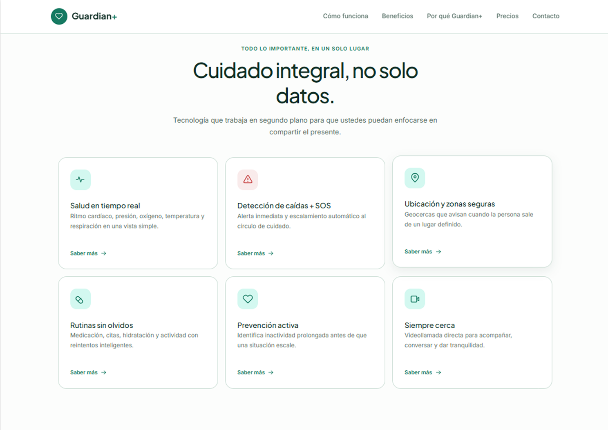

###### Mockup desktop - Por qué guardian+

<a id="figura-3-17"></a>**Figura 3.17.** Mock-up de escritorio del Landing Page: Por qué Guardian+

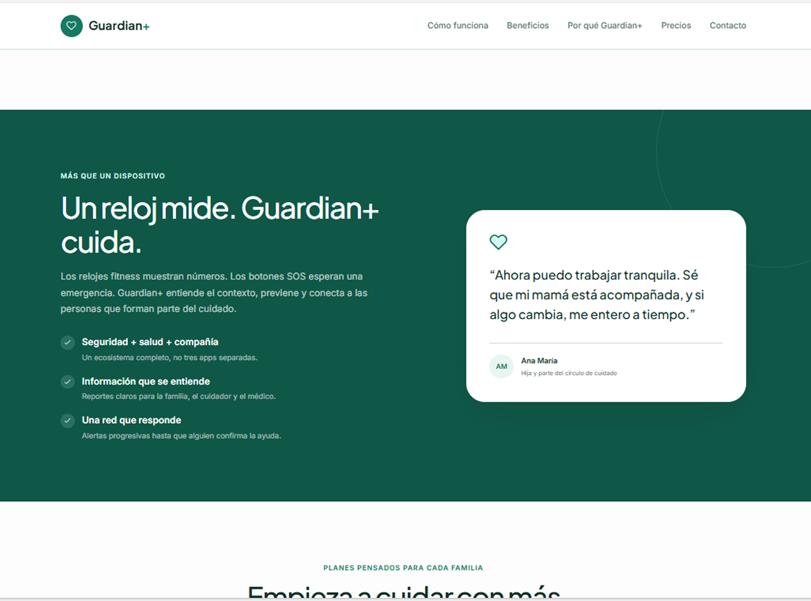

###### Mockup desktop - Precios

<a id="figura-3-18"></a>**Figura 3.18.** Mock-up de escritorio del Landing Page: Precios

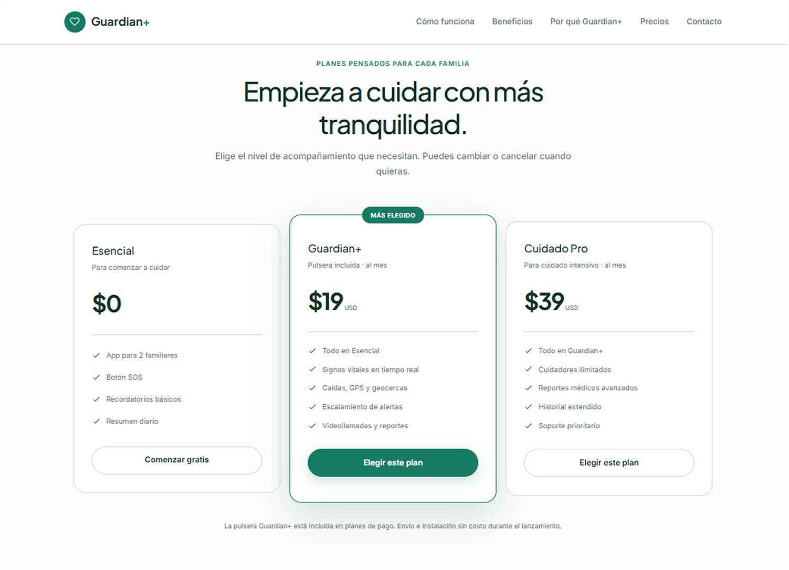

###### Mockup desktop - Contacto

<a id="figura-3-19"></a>**Figura 3.19.** Mock-up de escritorio del Landing Page: Contacto

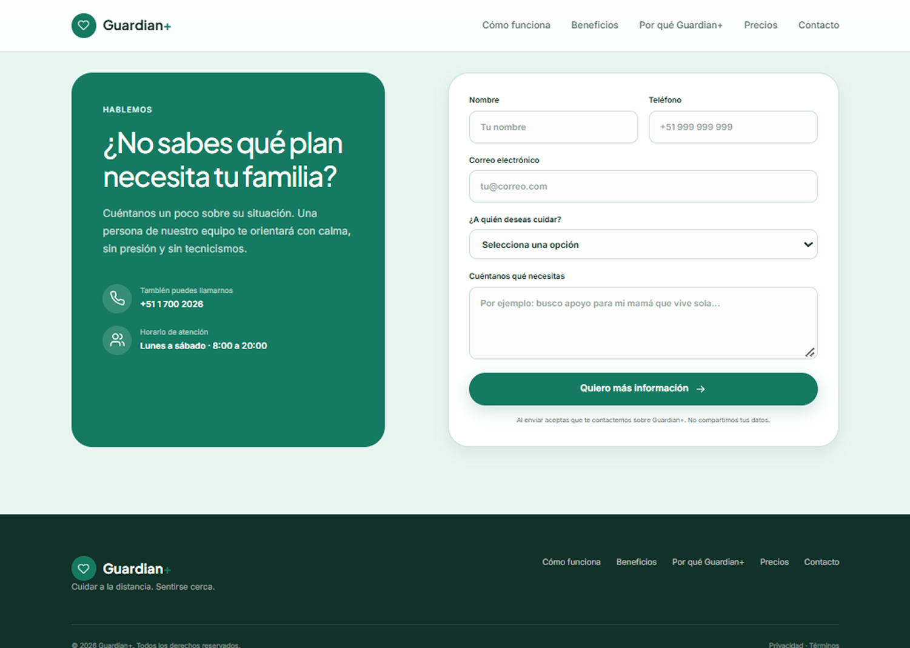

##### Landing page mockup mobile

La Figura 3.20 presenta los mock-ups del Landing Page en su versión móvil.

<a id="figura-3-20"></a>**Figura 3.20.** Mock-ups móviles del Landing Page

<table>
  <tr>
    <td align="center" valign="top">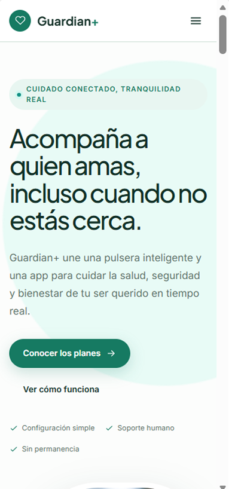<br><sub>Cómo funciona</sub></td>
    <td align="center" valign="top">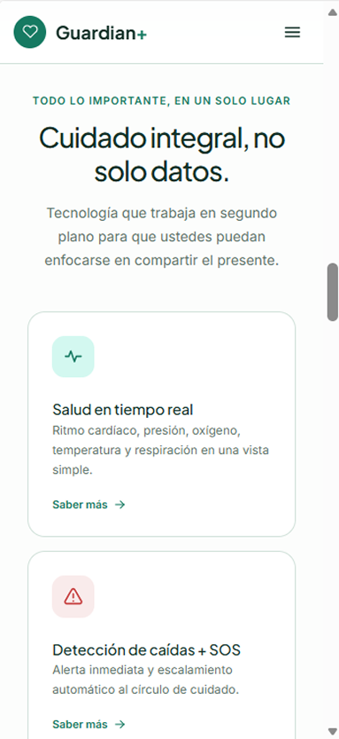<br><sub>Beneficios</sub></td>
    <td align="center" valign="top">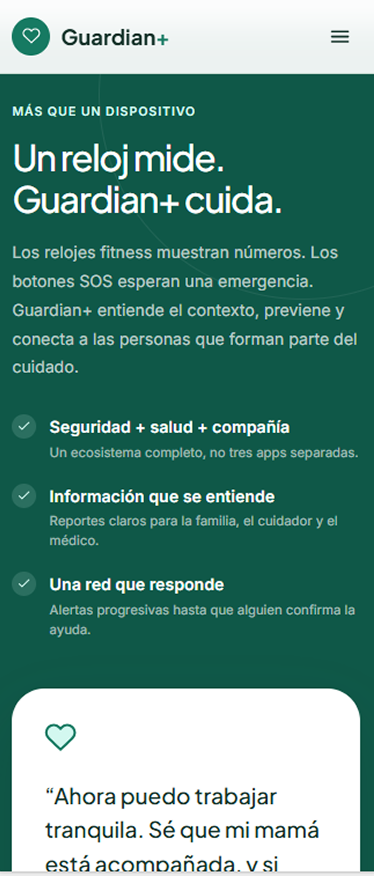<br><sub>Por qué guardian+</sub></td>
  </tr>
  <tr>
    <td align="center" valign="top">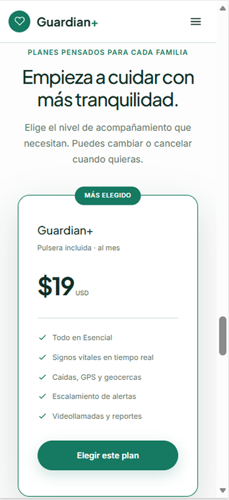<br><sub>Precios</sub></td>
    <td align="center" valign="top">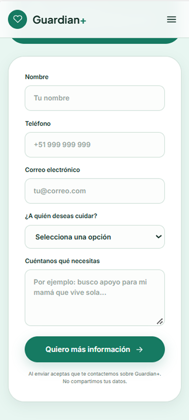<br><sub>Contacto</sub></td>
  </tr>
</table>

### 3.1.4. Mobile Applications UX/UI Design

En esta sección se presenta el diseño de la aplicación móvil de Guardian+ organizado por Bounded Context: los wireframes, los wireflows, los mock-ups, los user flow diagrams y el prototipo navegable.

#### 3.1.4.1. Mobile Applications Wireframes

Los wireframes de la aplicación móvil definen la estructura de las pantallas principales de cada sección. A continuación se presentan agrupados por Bounded Context.

##### Health Monitoring Bounded Context

Los wireframes del Bounded Context **Health Monitoring** definen, en escala de grises, la estructura y jerarquía de las pantallas de la sección **Salud** de la aplicación móvil, sin aplicar todavía la paleta de colores del Style Guide. Cubren las User Stories US01–US05, US07, US19, US21 y US24. La Tabla 3.21 describe cada pantalla de Health Monitoring.

<a id="tabla-3-21"></a>**Tabla 3.21.** Pantallas de los wireframes de Health Monitoring

| Pantalla | Descripción |
|---|---|
| Inicio | Pantalla principal del Cuidador. Resume el estado actual del Fragile Citizen, el estado de conexión y batería de la pulsera, las acciones rápidas (Llamar, Videollamada, Ubicación), un resumen de los cinco signos vitales, lo próximo en la agenda y la última alerta. Es el punto de partida de todos los flujos del contexto. |
| Salud · Ahora | Vista en tiempo real del contexto Health Monitoring. Destaca la frecuencia cardíaca con su tendencia reciente y presenta tarjetas de presión arterial, saturación de oxígeno, temperatura y respiración, cada una con su etiqueta de estado. Incluye la tarjeta “Sincronización activa” que comunica el estado del envío de lecturas tomadas sin conexión (US21). |
| Salud · Historial · Ritmo cardíaco | Pestaña Historial con el chip Ritmo seleccionado. Muestra el promedio semanal, mínimo y máximo, la gráfica de tendencia por día y las últimas lecturas registradas con su estado. Da acceso a Exportar PDF y Reporte semanal (US01). |
| Salud · Historial · Presión arterial | Pestaña Historial con el chip Presión seleccionado. Presenta la presión sistólica y diastólica en mmHg, su tendencia semanal y la clasificación de cada lectura (US02). |
| Salud · Historial · Saturación de oxígeno | Pestaña Historial con el chip SpO₂ seleccionado. Presenta el porcentaje de saturación de oxígeno, su tendencia semanal y el estado de cada lectura (US03). |
| Salud · Historial · Temperatura corporal | Pestaña Historial con el chip Temp seleccionado. Presenta la temperatura corporal en °C, su tendencia semanal y el estado de cada lectura para detectar fiebre o hipotermia (US04). |
| Salud · Historial · Frecuencia respiratoria | Pestaña Historial con el chip Respir seleccionado. Presenta la frecuencia respiratoria en rpm, su tendencia semanal y el estado de cada lectura (US05). |
| Buscar y filtrar | Hoja inferior que se abre desde el buscador “Todos los signos vitales”. Permite buscar entre las opciones y combinar criterios por signo vital, periodo (Día, Semana, Mes) y estado, con las acciones Limpiar y Aplicar (US07). |
| Exportar expediente | Hoja inferior que se abre desde Exportar PDF. Permite elegir el periodo (Últimos 30 días, Últimos 7 días o Personalizado), revisar las métricas incluidas y generar el expediente en PDF (US19). |
| Reporte semanal | Hoja inferior que se abre desde Reporte semanal. Resume la estabilidad de signos vitales, las alertas disparadas y la adherencia a la medicación, el comportamiento por parámetro y un aviso cuando se detecta un parámetro recurrente (US24). |

La Figura 3.21 presenta los wireframes de las pantallas de Health Monitoring.

<a id="figura-3-21"></a>**Figura 3.21.** Wireframes de Health Monitoring

<table>
  <tr>
    <td align="center" valign="top"><br><sub>Inicio</sub></td>
    <td align="center" valign="top"><br><sub>Salud · Ahora</sub></td>
    <td align="center" valign="top"><br><sub>Salud · Historial · Ritmo cardíaco</sub></td>
  </tr>
  <tr>
    <td align="center" valign="top"><br><sub>Salud · Historial · Presión arterial</sub></td>
    <td align="center" valign="top"><br><sub>Salud · Historial · Saturación de oxígeno</sub></td>
    <td align="center" valign="top"><br><sub>Salud · Historial · Temperatura corporal</sub></td>
  </tr>
  <tr>
    <td align="center" valign="top"><br><sub>Salud · Historial · Frecuencia respiratoria</sub></td>
    <td align="center" valign="top"><br><sub>Buscar y filtrar</sub></td>
    <td align="center" valign="top"><br><sub>Exportar expediente</sub></td>
  </tr>
  <tr>
    <td align="center" valign="top"><br><sub>Reporte semanal</sub></td>
  </tr>
</table>

##### Profile, IAM & Subscriptions

Los siguientes wireframes representan las vistas complementarias de Guardian+ relacionadas con la gestión del perfil, la información de la persona bajo cuidado, el dispositivo asociado, la suscripción y las preferencias de uso. Las pantallas se presentan en escala de grises, conservando la estructura y jerarquía visual definida para los mock-ups finales. La Tabla 3.22 describe cada pantalla de Profile, IAM y Subscriptions.

<a id="tabla-3-22"></a>**Tabla 3.22.** Pantallas de los wireframes de Profile, IAM y Subscriptions

| Pantalla | Descripción |
|---|---|
| Perfil y datos personales | Estas vistas permiten al familiar o cuidador acceder a las principales opciones de su perfil y consultar o actualizar su información personal y de contacto. |
| Persona bajo cuidado | Vista que permite al familiar o cuidador consultar la información principal de la persona bajo cuidado vinculada a su perfil. Presenta los datos de Elena Rojas y la relación existente con el usuario. |
| Círculo de cuidado | Vista que reúne a las personas vinculadas al cuidado de Elena. Permite consultar los integrantes del círculo de cuidado y localizar contactos mediante búsqueda y filtros por rol. |
| Pulsera | Vista destinada a consultar el estado del dispositivo wearable asociado a la persona bajo cuidado. Presenta información de conexión, batería, sincronización e identificación del dispositivo. |
| Mi plan | Vista que permite al familiar o cuidador consultar la suscripción activa de Guardian+, sus beneficios principales y el estado general del plan contratado. |
| Configuración | Vista que centraliza las preferencias generales de la aplicación. Permite acceder a las opciones de idioma, accesibilidad y a la información complementaria de Guardian+. |
| Idioma | Vista que permite seleccionar el idioma de la aplicación entre las opciones disponibles y guardar la preferencia elegida. |
| Accesibilidad | Vista que permite al usuario ajustar preferencias de accesibilidad de la aplicación, incluyendo tamaño de texto, contraste y reducción de movimiento. |
| Acerca de Guardian+ | Vista informativa que presenta datos generales de Guardian+, incluyendo su propósito, versión de la aplicación y acceso a información complementaria del producto. |
| Cerrar sesión | Diálogo de confirmación que permite al usuario cerrar su sesión de Guardian+ de forma segura antes de abandonar la aplicación. |

La Figura 3.22 presenta los wireframes de las pantallas de Profile, IAM y Subscriptions.

<a id="figura-3-22"></a>**Figura 3.22.** Wireframes de Profile, IAM y Subscriptions

<table>
  <tr>
    <td align="center" valign="top">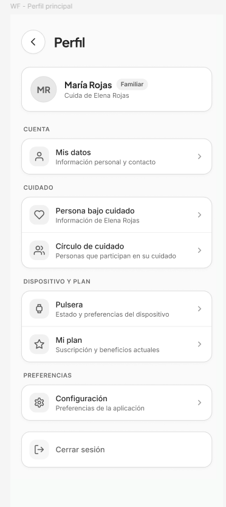<br><sub>Perfil</sub></td>
    <td align="center" valign="top">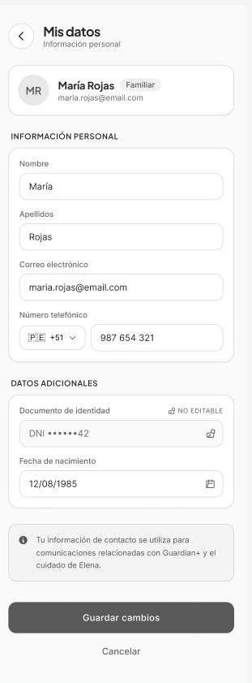<br><sub>Mis datos</sub></td>
    <td align="center" valign="top">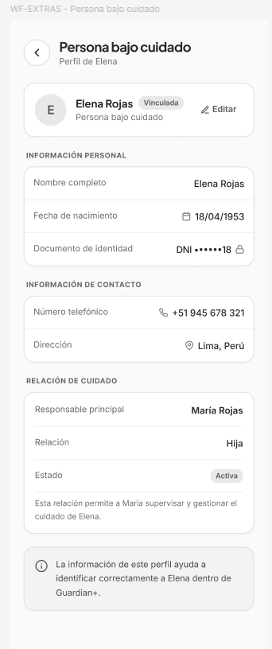<br><sub>Persona bajo cuidado</sub></td>
  </tr>
  <tr>
    <td align="center" valign="top">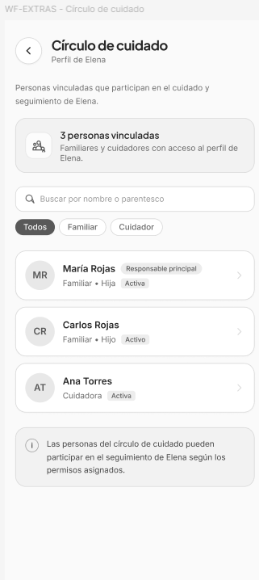<br><sub>Círculo de cuidado</sub></td>
    <td align="center" valign="top">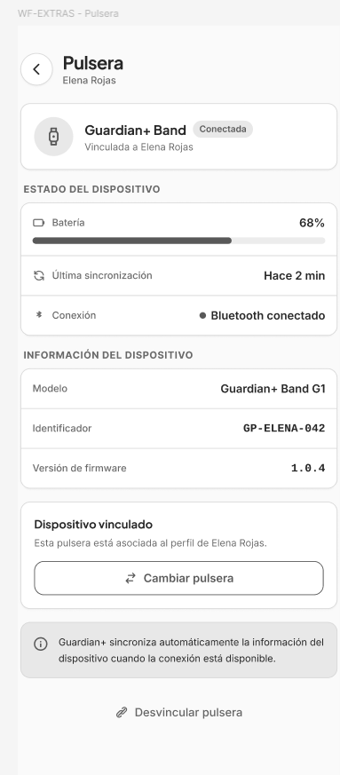<br><sub>Pulsera</sub></td>
    <td align="center" valign="top">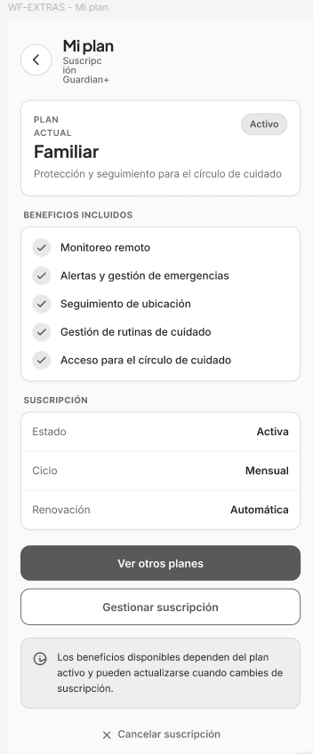<br><sub>Mi plan</sub></td>
  </tr>
  <tr>
    <td align="center" valign="top">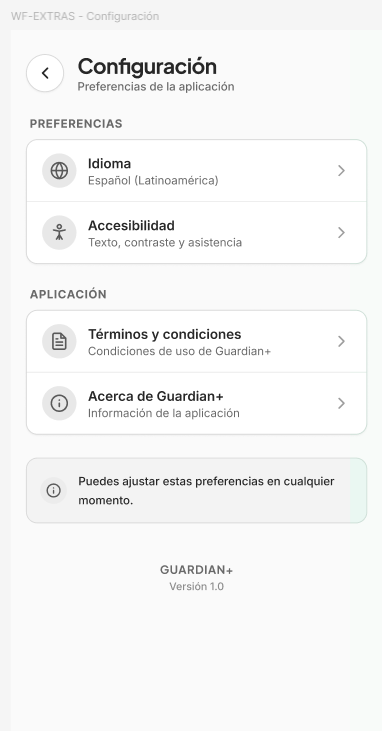<br><sub>Configuración</sub></td>
    <td align="center" valign="top">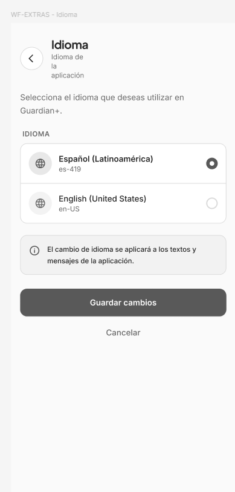<br><sub>Idioma</sub></td>
    <td align="center" valign="top">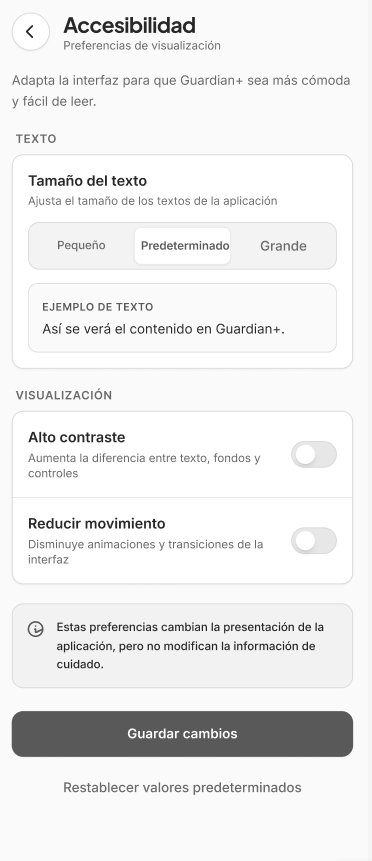<br><sub>Accesibilidad</sub></td>
  </tr>
  <tr>
    <td align="center" valign="top">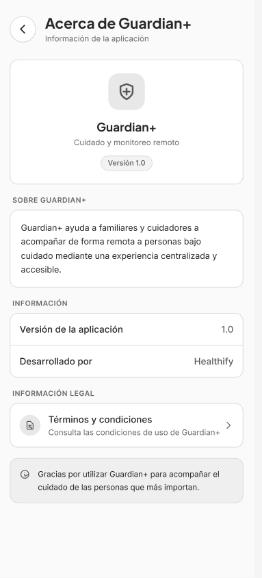<br><sub>Acerca de Guardian+</sub></td>
    <td align="center" valign="top">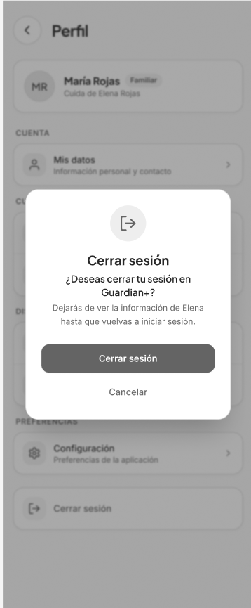<br><sub>Cerrar sesión</sub></td>
  </tr>
</table>

##### Emergency & Alerting Bounded Context

Los wireframes de la sección **Alertas** presentan en escala de grises las pantallas con las que el familiar o cuidador recibe, atiende y revisa las alertas de la persona bajo cuidado. Cubren las User Stories US08, US09, US10, US11, US15 y US16. La Figura 3.23 presenta los wireframes de Emergency & Alerting.

<a id="figura-3-23"></a>**Figura 3.23.** Wireframes de Emergency & Alerting

<table>
  <tr>
    <td align="center" valign="top">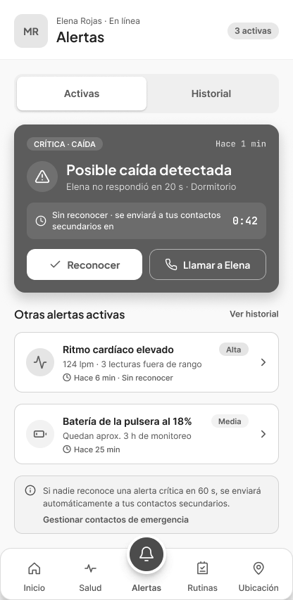<br><sub>Alertas activas</sub></td>
    <td align="center" valign="top">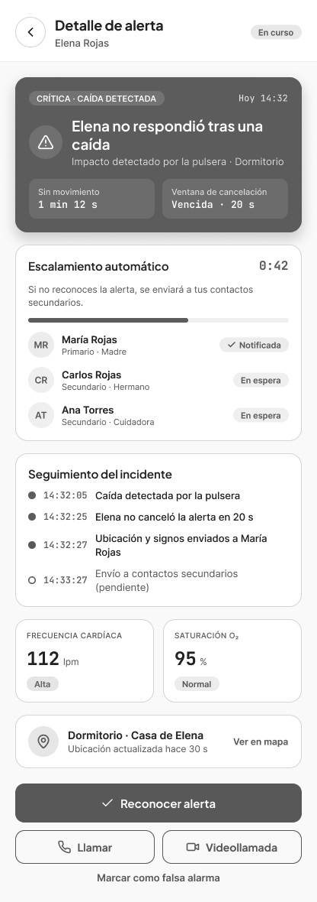<br><sub>Detalle de alerta crítica</sub></td>
    <td align="center" valign="top">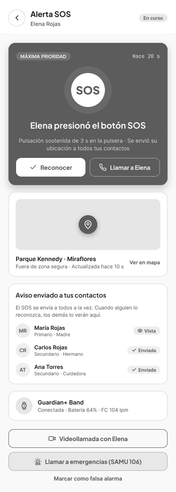<br><sub>Alerta SOS</sub></td>
  </tr>
  <tr>
    <td align="center" valign="top">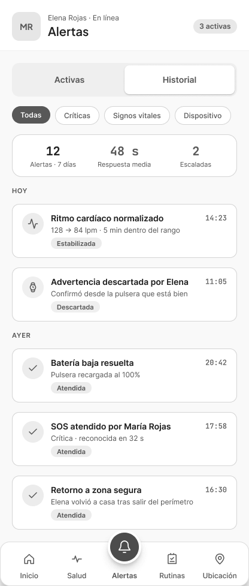<br><sub>Historial de alertas</sub></td>
    <td align="center" valign="top">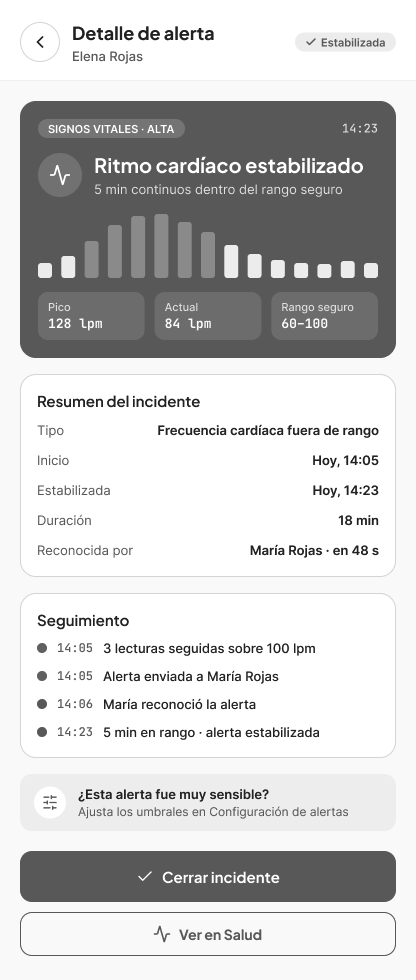<br><sub>Alerta estabilizada</sub></td>
    <td align="center" valign="top">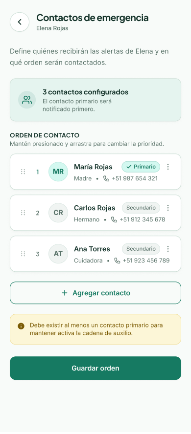<br><sub>Contactos de emergencia</sub></td>
  </tr>
</table>

##### Care Routines & Wellness Bounded Context

Los wireframes de la sección **Rutinas** muestran el resumen diario de rutinas y las pantallas para programar tomas de medicación, citas médicas y actividad ligera. Cubren las User Stories US06, US13 y US14. La Figura 3.24 presenta los wireframes de Care Routines & Wellness.

<a id="figura-3-24"></a>**Figura 3.24.** Wireframes de Care Routines & Wellness

<table>
  <tr>
    <td align="center" valign="top">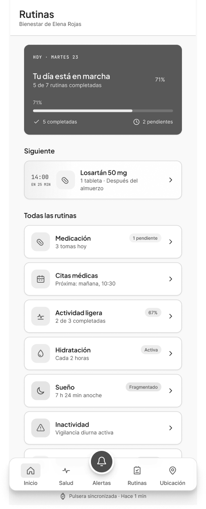<br><sub>Rutinas</sub></td>
    <td align="center" valign="top">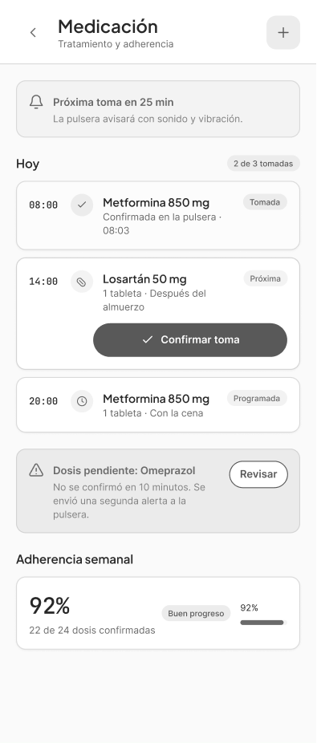<br><sub>Medicación</sub></td>
    <td align="center" valign="top">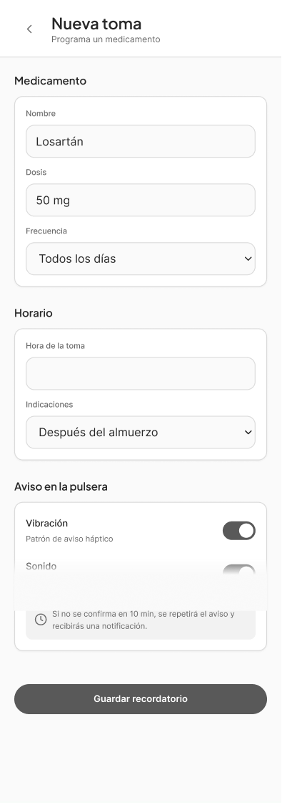<br><sub>Nueva toma</sub></td>
  </tr>
  <tr>
    <td align="center" valign="top">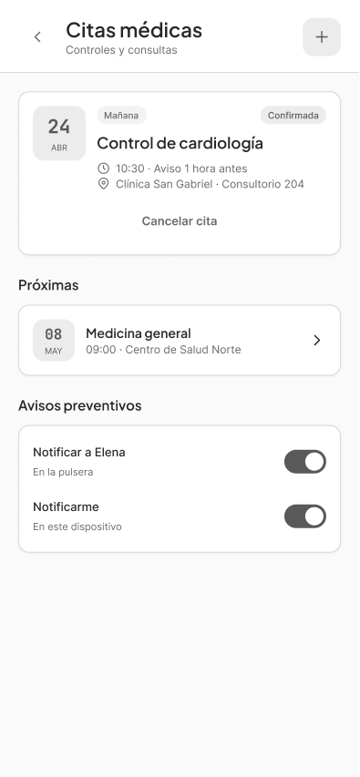<br><sub>Citas médicas</sub></td>
    <td align="center" valign="top">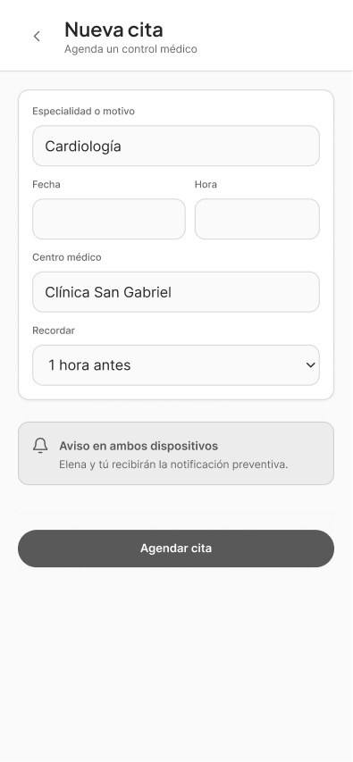<br><sub>Nueva cita</sub></td>
    <td align="center" valign="top">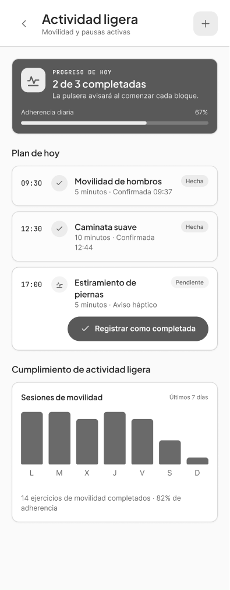<br><sub>Actividad ligera</sub></td>
  </tr>
</table>


#### 3.1.4.2. Mobile Applications Wireflow Diagrams

Los wireflow diagrams combinan los wireframes con las interacciones que conectan cada pantalla y muestran cómo el usuario cumple cada user goal. Se presentan agrupados por Bounded Context.

##### Health Monitoring Bounded Context

Los wireflows del Bounded Context **Health Monitoring** combinan los wireframes de la sección **Salud** con las interacciones que conectan cada pantalla. Cada wireflow corresponde a un user goal del Cuidador y muestra la secuencia de pantallas, de izquierda a derecha, y la acción que dispara cada transición.

###### Wireflow 1 - Consultar ritmo cardíaco (US01)

**User goal:** Como cuidador, quiero consultar la lectura actual del ritmo cardíaco de la persona bajo cuidado, para monitorear su estabilidad cardiovascular e identificar irregularidades oportunamente.

La Figura 3.25 presenta el wireflow para consultar el ritmo cardíaco (US01).

<a id="figura-3-25"></a>**Figura 3.25.** Wireflow de Health Monitoring: Consultar ritmo cardíaco (US01)

<table>
  <tr>
    <td align="center"><br><sub>Inicio</sub></td>
    <td align="center"><sub>Toca “Salud”</sub><br>&#10140;</td>
    <td align="center"><br><sub>Salud · Ahora</sub></td>
    <td align="center"><sub>Toca “Historial” y el chip “Ritmo”</sub><br>&#10140;</td>
    <td align="center"><br><sub>Ritmo cardíaco</sub></td>
  </tr>
</table>

###### Wireflow 2 - Consultar presión arterial (US02)

**User goal:** Como cuidador, quiero consultar la presión arterial sistólica y diastólica de la persona bajo cuidado, para evaluar su condición hemodinámica y prevenir descompensaciones.

La Figura 3.26 presenta el wireflow para consultar la presión arterial (US02).

<a id="figura-3-26"></a>**Figura 3.26.** Wireflow de Health Monitoring: Consultar presión arterial (US02)

<table>
  <tr>
    <td align="center"><br><sub>Inicio</sub></td>
    <td align="center"><sub>Toca “Salud”</sub><br>&#10140;</td>
    <td align="center"><br><sub>Salud · Ahora</sub></td>
    <td align="center"><sub>Toca “Historial” y el chip “Presión”</sub><br>&#10140;</td>
    <td align="center"><br><sub>Presión arterial</sub></td>
  </tr>
</table>

###### Wireflow 3 - Consultar saturación de oxígeno (US03)

**User goal:** Como cuidador, quiero consultar la saturación de oxígeno de la persona bajo cuidado, para identificar hipoxemia o dificultad respiratoria.

La Figura 3.27 presenta el wireflow para consultar la saturación de oxígeno (US03).

<a id="figura-3-27"></a>**Figura 3.27.** Wireflow de Health Monitoring: Consultar saturación de oxígeno (US03)

<table>
  <tr>
    <td align="center"><br><sub>Inicio</sub></td>
    <td align="center"><sub>Toca “Salud”</sub><br>&#10140;</td>
    <td align="center"><br><sub>Salud · Ahora</sub></td>
    <td align="center"><sub>Toca “Historial” y el chip “SpO₂”</sub><br>&#10140;</td>
    <td align="center"><br><sub>Saturación de oxígeno</sub></td>
  </tr>
</table>

###### Wireflow 4 - Supervisar temperatura corporal (US04)

**User goal:** Como cuidador, quiero supervisar la temperatura corporal de la persona bajo cuidado, para detectar oportunamente fiebre o hipotermia.

La Figura 3.28 presenta el wireflow para supervisar la temperatura corporal (US04).

<a id="figura-3-28"></a>**Figura 3.28.** Wireflow de Health Monitoring: Supervisar temperatura corporal (US04)

<table>
  <tr>
    <td align="center"><br><sub>Inicio</sub></td>
    <td align="center"><sub>Toca “Salud”</sub><br>&#10140;</td>
    <td align="center"><br><sub>Salud · Ahora</sub></td>
    <td align="center"><sub>Toca “Historial” y el chip “Temp”</sub><br>&#10140;</td>
    <td align="center"><br><sub>Temperatura corporal</sub></td>
  </tr>
</table>

###### Wireflow 5 - Consultar frecuencia respiratoria (US05)

**User goal:** Como cuidador, quiero consultar la frecuencia respiratoria de la persona bajo cuidado, para identificar taquipnea o bradipnea.

La Figura 3.29 presenta el wireflow para consultar la frecuencia respiratoria (US05).

<a id="figura-3-29"></a>**Figura 3.29.** Wireflow de Health Monitoring: Consultar frecuencia respiratoria (US05)

<table>
  <tr>
    <td align="center"><br><sub>Inicio</sub></td>
    <td align="center"><sub>Toca “Salud”</sub><br>&#10140;</td>
    <td align="center"><br><sub>Salud · Ahora</sub></td>
    <td align="center"><sub>Toca “Historial” y el chip “Respir”</sub><br>&#10140;</td>
    <td align="center"><br><sub>Frecuencia respiratoria</sub></td>
  </tr>
</table>

###### Wireflow 6 - Analizar tendencias históricas (US07)

**User goal:** Como cuidador, quiero revisar tendencias históricas de signos vitales, para identificar patrones de deterioro y compartir información con el médico.

La Figura 3.30 presenta el wireflow para analizar las tendencias históricas de los signos vitales (US07).

<a id="figura-3-30"></a>**Figura 3.30.** Wireflow de Health Monitoring: Analizar tendencias históricas (US07)

<table>
  <tr>
    <td align="center"><br><sub>Inicio</sub></td>
    <td align="center"><sub>Toca “Salud”</sub><br>&#10140;</td>
    <td align="center"><br><sub>Salud · Ahora</sub></td>
    <td align="center"><sub>Toca “Todos los signos vitales”</sub><br>&#10140;</td>
    <td align="center"><br><sub>Buscar y filtrar</sub></td>
    <td align="center"><sub>Elige signo y periodo y toca “Aplicar”</sub><br>&#10140;</td>
    <td align="center"><br><sub>Tendencia filtrada</sub></td>
  </tr>
</table>

###### Wireflow 7 - Exportar historial de telemetría (US19)

**User goal:** Como cuidador, quiero generar y exportar el historial de signos vitales, para respaldar las consultas médicas presenciales.

La Figura 3.31 presenta el wireflow para exportar el historial de telemetría (US19).

<a id="figura-3-31"></a>**Figura 3.31.** Wireflow de Health Monitoring: Exportar historial de telemetría (US19)

<table>
  <tr>
    <td align="center"><br><sub>Inicio</sub></td>
    <td align="center"><sub>Toca “Salud”</sub><br>&#10140;</td>
    <td align="center"><br><sub>Salud · Ahora</sub></td>
    <td align="center"><sub>Toca “Historial”</sub><br>&#10140;</td>
    <td align="center"><br><sub>Historial</sub></td>
    <td align="center"><sub>Toca “Exportar PDF”</sub><br>&#10140;</td>
    <td align="center"><br><sub>Exportar expediente</sub></td>
  </tr>
</table>

###### Wireflow 8 - Sincronizar telemetría sin conexión (US21)

**User goal:** Como cuidador, quiero que las lecturas tomadas sin red se almacenen y sincronicen al recuperar conexión, para conservar íntegro el historial.

La Figura 3.32 presenta el wireflow para sincronizar la telemetría registrada sin conexión (US21).

<a id="figura-3-32"></a>**Figura 3.32.** Wireflow de Health Monitoring: Sincronizar telemetría sin conexión (US21)

<table>
  <tr>
    <td align="center"><br><sub>Inicio</sub></td>
    <td align="center"><sub>Toca “Salud”</sub><br>&#10140;</td>
    <td align="center"><br><sub>Salud · Ahora (tarjeta “Sincronización activa”)</sub></td>
  </tr>
</table>

###### Wireflow 9 - Revisar reporte semanal de salud (US24)

**User goal:** Como cuidador, quiero recibir una síntesis semanal del estado de salud, para evaluar la evolución global sin revisar la telemetría continuamente.

La Figura 3.33 presenta el wireflow para revisar el reporte semanal de salud (US24).

<a id="figura-3-33"></a>**Figura 3.33.** Wireflow de Health Monitoring: Revisar reporte semanal de salud (US24)

<table>
  <tr>
    <td align="center"><br><sub>Inicio</sub></td>
    <td align="center"><sub>Toca “Salud”</sub><br>&#10140;</td>
    <td align="center"><br><sub>Salud · Ahora</sub></td>
    <td align="center"><sub>Toca “Historial”</sub><br>&#10140;</td>
    <td align="center"><br><sub>Historial</sub></td>
    <td align="center"><sub>Toca “Reporte semanal”</sub><br>&#10140;</td>
    <td align="center"><br><sub>Reporte semanal</sub></td>
  </tr>
</table>

##### Extras

Los wireflows de **Extras** combinan los wireframes relacionados con el perfil, el entorno de cuidado, la suscripción, las preferencias de la aplicación y la gestión de sesión. Cada wireflow corresponde a un user goal del Familiar o Cuidador y muestra la secuencia de pantallas, de izquierda a derecha, junto con la acción que dispara cada transición.

###### Wireflow 1 - Gestionar información personal

User goal: Como familiar o cuidador, quiero consultar y actualizar mis datos personales y de contacto, para mantener correcta la información asociada a mi perfil en Guardian+.

La Figura 3.34 presenta el wireflow para gestionar la información personal.

<a id="figura-3-34"></a>**Figura 3.34.** Wireflow de Extras: Gestionar información personal

<table>
  <tr>
    <td align="center"><br><sub>Inicio</sub></td>
    <td align="center"><sub>Toca su avatar</sub><br>&#10140;</td>
    <td align="center"><br><sub>Perfil</sub></td>
    <td align="center"><sub>Toca “Mis datos”</sub><br>&#10140;</td>
    <td align="center"><br><sub>Mis datos</sub></td>
  </tr>
</table>

###### Wireflow 2 - Consultar entorno de cuidado

**User goal:** Como familiar o cuidador, quiero consultar la información de Elena, las personas vinculadas a su cuidado y el estado de su pulsera, para mantenerme informado sobre su entorno de cuidado.

Las Figuras 3.35 a 3.37 presentan el wireflow para cada vista del entorno de cuidado: persona bajo cuidado, círculo de cuidado y pulsera.

<a id="figura-3-35"></a>**Figura 3.35.** Wireflow de Extras: Consultar entorno de cuidado (persona bajo cuidado)

<table>
  <tr>
    <td align="center"><br><sub>Inicio</sub></td>
    <td align="center"><sub>Toca su avatar</sub><br>&#10140;</td>
    <td align="center"><br><sub>Perfil</sub></td>
    <td align="center"><sub>Toca “Persona bajo cuidado”</sub><br>&#10140;</td>
    <td align="center"><br><sub>Persona bajo cuidado</sub></td>
  </tr>
</table>

<a id="figura-3-36"></a>**Figura 3.36.** Wireflow de Extras: Consultar entorno de cuidado (círculo de cuidado)

<table>
  <tr>
    <td align="center"><br><sub>Inicio</sub></td>
    <td align="center"><sub>Toca su avatar</sub><br>&#10140;</td>
    <td align="center"><br><sub>Perfil</sub></td>
    <td align="center"><sub>Toca “Círculo de cuidado”</sub><br>&#10140;</td>
    <td align="center"><br><sub>Círculo de cuidado</sub></td>
  </tr>
</table>

<a id="figura-3-37"></a>**Figura 3.37.** Wireflow de Extras: Consultar entorno de cuidado (pulsera)

<table>
  <tr>
    <td align="center"><br><sub>Inicio</sub></td>
    <td align="center"><sub>Toca su avatar</sub><br>&#10140;</td>
    <td align="center"><br><sub>Perfil</sub></td>
    <td align="center"><sub>Toca “Pulsera”</sub><br>&#10140;</td>
    <td align="center"><br><sub>Pulsera</sub></td>
  </tr>
</table>

###### Wireflow 3 - Consultar suscripción actual

**User goal:** Como familiar o cuidador, quiero consultar mi plan actual y sus beneficios, para conocer las funcionalidades disponibles en mi suscripción de Guardian+.

La Figura 3.38 presenta el wireflow para consultar la suscripción actual.

<a id="figura-3-38"></a>**Figura 3.38.** Wireflow de Extras: Consultar suscripción actual

<table>
  <tr>
    <td align="center"><br><sub>Inicio</sub></td>
    <td align="center"><sub>Toca su avatar</sub><br>&#10140;</td>
    <td align="center"><br><sub>Perfil</sub></td>
    <td align="center"><sub>Toca “Mi plan”</sub><br>&#10140;</td>
    <td align="center"><br><sub>Mi plan</sub></td>
  </tr>
</table>

###### Wireflow 4 - Configurar preferencias de la aplicación

**User goal:** Como familiar o cuidador, quiero ajustar el idioma y las opciones de accesibilidad de Guardian+, para adaptar la aplicación a mis necesidades de uso.

Las Figuras 3.39 y 3.40 presentan el wireflow para el idioma y para la accesibilidad.

<a id="figura-3-39"></a>**Figura 3.39.** Wireflow de Extras: Configurar preferencias de la aplicación (idioma)

<table>
  <tr>
    <td align="center"><br><sub>Inicio</sub></td>
    <td align="center"><sub>Toca su avatar</sub><br>&#10140;</td>
    <td align="center"><br><sub>Perfil</sub></td>
    <td align="center"><sub>Toca “Configuración”</sub><br>&#10140;</td>
    <td align="center"><br><sub>Configuración</sub></td>
    <td align="center"><sub>Toca “Idioma”</sub><br>&#10140;</td>
    <td align="center"><br><sub>Idioma</sub></td>
  </tr>
</table>

<a id="figura-3-40"></a>**Figura 3.40.** Wireflow de Extras: Configurar preferencias de la aplicación (accesibilidad)

<table>
  <tr>
    <td align="center"><br><sub>Inicio</sub></td>
    <td align="center"><sub>Toca su avatar</sub><br>&#10140;</td>
    <td align="center"><br><sub>Perfil</sub></td>
    <td align="center"><sub>Toca “Configuración”</sub><br>&#10140;</td>
    <td align="center"><br><sub>Configuración</sub></td>
    <td align="center"><sub>Toca “Accesibilidad”</sub><br>&#10140;</td>
    <td align="center"><br><sub>Accesibilidad</sub></td>
  </tr>
</table>

###### Wireflow 5 - Cerrar sesión de forma segura

**User goal:** Como familiar o cuidador, quiero cerrar mi sesión de Guardian+, para proteger el acceso a la información de la persona bajo cuidado cuando termine de utilizar la aplicación.

La Figura 3.41 presenta el wireflow para cerrar sesión de forma segura.

<a id="figura-3-41"></a>**Figura 3.41.** Wireflow de Extras: Cerrar sesión de forma segura

<table>
  <tr>
    <td align="center"><br><sub>Inicio</sub></td>
    <td align="center"><sub>Toca su avatar</sub><br>&#10140;</td>
    <td align="center"><br><sub>Perfil</sub></td>
    <td align="center"><sub>Toca “Cerrar sesión”</sub><br>&#10140;</td>
    <td align="center"><br><sub>Confirmar cierre de sesión</sub></td>
  </tr>
</table>


##### Emergency & Alerting Bounded Context

Los wireflows de **Alertas** siguen el recorrido de los tres tipos de alerta de Guardian+: una caída detectada por la pulsera, un pedido de auxilio con el botón SOS y una alerta por signos vitales fuera de rango.

###### Wireflow 1 - Atender una alerta de caída (US08, US11)

**User goal:** Como familiar de Elena, quiero enterarme de inmediato cuando la pulsera detecte una caída y atenderla, para asegurarme de que reciba ayuda a tiempo.

La Figura 3.42 presenta el wireflow para atender una alerta de caída (US08, US11).

<a id="figura-3-42"></a>**Figura 3.42.** Wireflow de Emergency & Alerting: Atender una alerta de caída (US08, US11)

<table>
  <tr>
    <td align="center"><br><sub>Alertas activas</sub></td>
    <td align="center"><sub>Toca la alerta de caída</sub><br>&#10140;</td>
    <td align="center"><br><sub>Detalle de alerta crítica</sub></td>
    <td align="center"><sub>Reconoce la alerta y cierra el incidente</sub><br>&#10140;</td>
    <td align="center"><br><sub>Historial</sub></td>
  </tr>
</table>

###### Wireflow 2 - Responder a un SOS (US15)

**User goal:** Como cuidadora de Elena, quiero recibir su pedido de auxilio en cuanto presione el botón SOS de la pulsera, para saber dónde está y actuar sin perder tiempo.

La Figura 3.43 presenta el wireflow para responder a un SOS (US15).

<a id="figura-3-43"></a>**Figura 3.43.** Wireflow de Emergency & Alerting: Responder a un SOS (US15)

<table>
  <tr>
    <td align="center"><br><sub>Inicio</sub></td>
    <td align="center"><sub>Toca la notificación SOS</sub><br>&#10140;</td>
    <td align="center"><br><sub>Alerta SOS</sub></td>
    <td align="center"><sub>Reconoce la alerta y atiende a Elena</sub><br>&#10140;</td>
    <td align="center"><br><sub>Historial</sub></td>
  </tr>
</table>

###### Wireflow 3 - Seguir una alerta de signos vitales (US09, US10)

**User goal:** Como familiar de Elena, quiero enterarme cuando sus signos vitales salgan del rango seguro y seguir la alerta hasta que se normalicen, para intervenir solo cuando realmente haga falta.

La Figura 3.44 presenta el wireflow para seguir una alerta de signos vitales (US09, US10).

<a id="figura-3-44"></a>**Figura 3.44.** Wireflow de Emergency & Alerting: Seguir una alerta de signos vitales (US09, US10)

<table>
  <tr>
    <td align="center"><br><sub>Alertas activas</sub></td>
    <td align="center"><sub>Reconoce la alerta de ritmo cardíaco</sub><br>&#10140;</td>
    <td align="center"><br><sub>Alerta estabilizada</sub></td>
    <td align="center"><sub>Toca “Cerrar incidente”</sub><br>&#10140;</td>
    <td align="center"><br><sub>Historial</sub></td>
  </tr>
</table>

##### Care Routines & Wellness Bounded Context

Los wireflows de **Rutinas** muestran cómo el cuidador programa un recordatorio desde el resumen diario de rutinas.

###### Wireflow 1 - Programar una toma de medicación (US06)

**User goal:** Como cuidador, deseo programar las tomas de medicación del Fragile Citizen y que su pulsera emita los avisos hápticos y sonoros en los horarios exactos para asegurar la adherencia al tratamiento prescrito.

La Figura 3.45 presenta el wireflow para programar una toma de medicación (US06).

<a id="figura-3-45"></a>**Figura 3.45.** Wireflow de Care Routines & Wellness: Programar una toma de medicación (US06)

<table>
  <tr>
    <td align="center"><br><sub>Rutinas</sub></td>
    <td align="center"><sub>Toca “Medicación”</sub><br>&#10140;</td>
    <td align="center"><br><sub>Medicación</sub></td>
    <td align="center"><sub>Toca “+”</sub><br>&#10140;</td>
    <td align="center"><br><sub>Nueva toma</sub></td>
  </tr>
</table>

###### Wireflow 2 - Agendar una cita médica (US13)

**User goal:** Como cuidador, deseo agendar los controles y citas médicas del Fragile Citizen para recibir avisos preventivos y evitar inasistencias a los centros de salud.

La Figura 3.46 presenta el wireflow para agendar una cita médica (US13).

<a id="figura-3-46"></a>**Figura 3.46.** Wireflow de Care Routines & Wellness: Agendar una cita médica (US13)

<table>
  <tr>
    <td align="center"><br><sub>Rutinas</sub></td>
    <td align="center"><sub>Toca “Citas médicas”</sub><br>&#10140;</td>
    <td align="center"><br><sub>Citas médicas</sub></td>
    <td align="center"><sub>Toca “+”</sub><br>&#10140;</td>
    <td align="center"><br><sub>Nueva cita</sub></td>
  </tr>
</table>


#### 3.1.4.3. Mobile Applications Mock-ups

Los mock-ups aplican el Style Guide sobre los wireframes y representan la apariencia final de las pantallas de la aplicación móvil. Se presentan agrupados por Bounded Context.

##### Health Monitoring Bounded Context

Los mock-ups del Bounded Context **Health Monitoring** aplican sobre los wireframes la paleta de colores, tipografía, elevaciones y etiquetas de estado definidas en el Style Guide (3.1.1). El verde identifica las acciones primarias y los estados normales, y el ámbar resalta las lecturas “En Observación”. La Tabla 3.23 describe cada pantalla de Health Monitoring.

<a id="tabla-3-23"></a>**Tabla 3.23.** Pantallas de los mock-ups de Health Monitoring

| Pantalla | Descripción |
|---|---|
| Inicio | Pantalla principal del Cuidador. Resume el estado actual del Fragile Citizen, el estado de conexión y batería de la pulsera, las acciones rápidas (Llamar, Videollamada, Ubicación), un resumen de los cinco signos vitales, lo próximo en la agenda y la última alerta. Es el punto de partida de todos los flujos del contexto. |
| Salud · Ahora | Vista en tiempo real del contexto Health Monitoring. Destaca la frecuencia cardíaca con su tendencia reciente y presenta tarjetas de presión arterial, saturación de oxígeno, temperatura y respiración, cada una con su etiqueta de estado. Incluye la tarjeta “Sincronización activa” que comunica el estado del envío de lecturas tomadas sin conexión (US21). |
| Salud · Historial · Ritmo cardíaco | Pestaña Historial con el chip Ritmo seleccionado. Muestra el promedio semanal, mínimo y máximo, la gráfica de tendencia por día y las últimas lecturas registradas con su estado. Da acceso a Exportar PDF y Reporte semanal (US01). |
| Salud · Historial · Presión arterial | Pestaña Historial con el chip Presión seleccionado. Presenta la presión sistólica y diastólica en mmHg, su tendencia semanal y la clasificación de cada lectura (US02). |
| Salud · Historial · Saturación de oxígeno | Pestaña Historial con el chip SpO₂ seleccionado. Presenta el porcentaje de saturación de oxígeno, su tendencia semanal y el estado de cada lectura (US03). |
| Salud · Historial · Temperatura corporal | Pestaña Historial con el chip Temp seleccionado. Presenta la temperatura corporal en °C, su tendencia semanal y el estado de cada lectura para detectar fiebre o hipotermia (US04). |
| Salud · Historial · Frecuencia respiratoria | Pestaña Historial con el chip Respir seleccionado. Presenta la frecuencia respiratoria en rpm, su tendencia semanal y el estado de cada lectura (US05). |
| Buscar y filtrar | Hoja inferior que se abre desde el buscador “Todos los signos vitales”. Permite buscar entre las opciones y combinar criterios por signo vital, periodo (Día, Semana, Mes) y estado, con las acciones Limpiar y Aplicar (US07). |
| Exportar expediente | Hoja inferior que se abre desde Exportar PDF. Permite elegir el periodo (Últimos 30 días, Últimos 7 días o Personalizado), revisar las métricas incluidas y generar el expediente en PDF (US19). |
| Reporte semanal | Hoja inferior que se abre desde Reporte semanal. Resume la estabilidad de signos vitales, las alertas disparadas y la adherencia a la medicación, el comportamiento por parámetro y un aviso cuando se detecta un parámetro recurrente (US24). |

La Figura 3.47 presenta los mock-ups de las pantallas de Health Monitoring.

<a id="figura-3-47"></a>**Figura 3.47.** Mock-ups de Health Monitoring

<table>
  <tr>
    <td align="center" valign="top">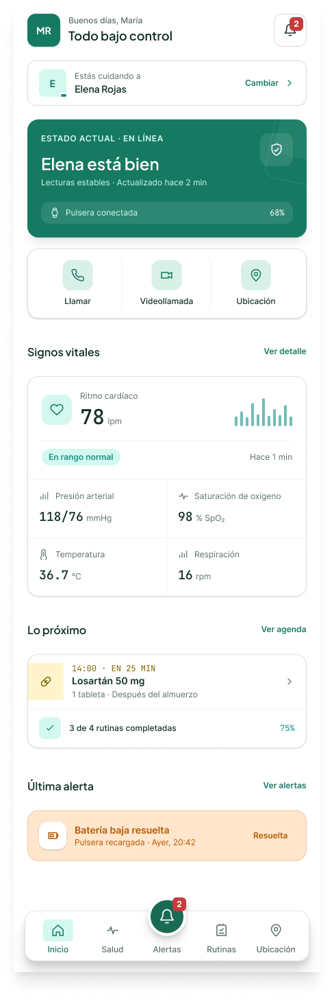<br><sub>Inicio</sub></td>
    <td align="center" valign="top">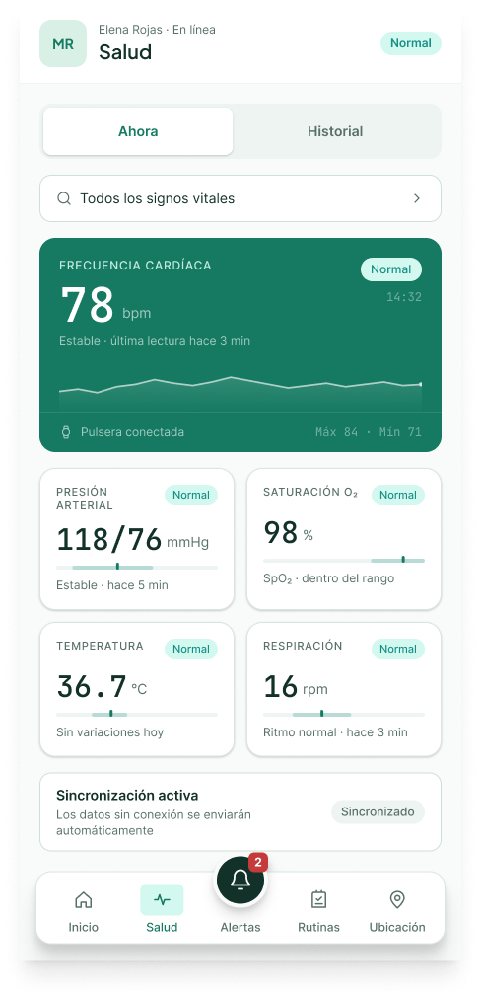<br><sub>Salud · Ahora</sub></td>
    <td align="center" valign="top">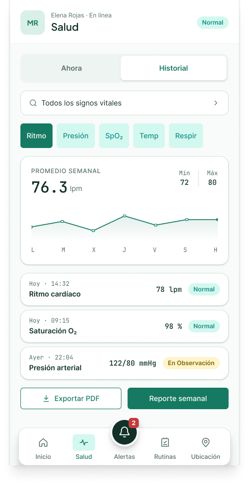<br><sub>Salud · Historial · Ritmo cardíaco</sub></td>
  </tr>
  <tr>
    <td align="center" valign="top">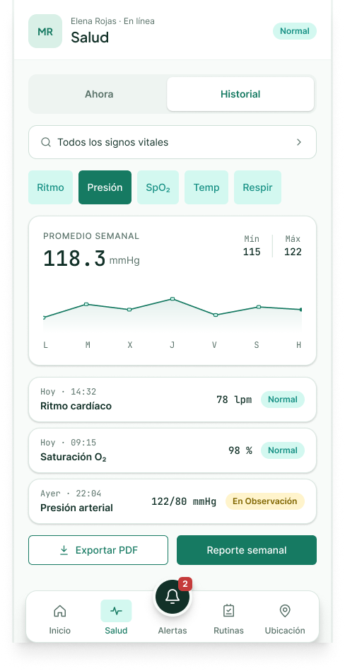<br><sub>Salud · Historial · Presión arterial</sub></td>
    <td align="center" valign="top">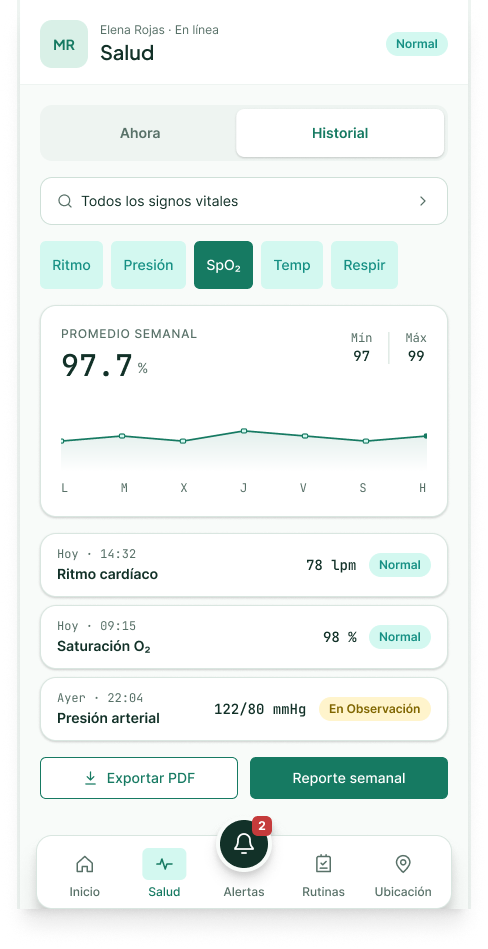<br><sub>Salud · Historial · Saturación de oxígeno</sub></td>
    <td align="center" valign="top">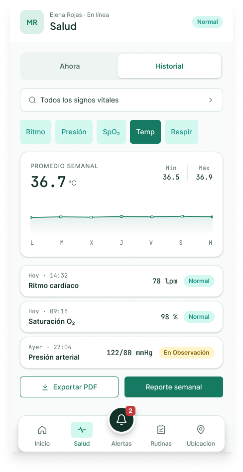<br><sub>Salud · Historial · Temperatura corporal</sub></td>
  </tr>
  <tr>
    <td align="center" valign="top">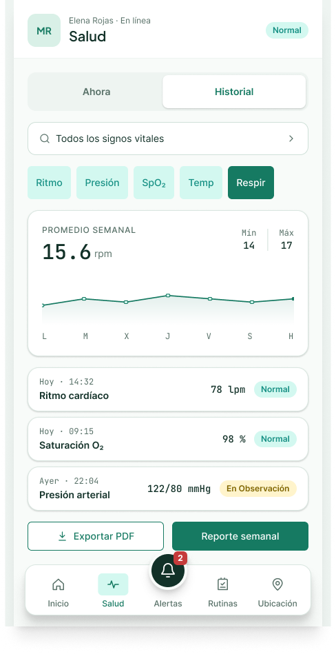<br><sub>Salud · Historial · Frecuencia respiratoria</sub></td>
    <td align="center" valign="top"><br><sub>Buscar y filtrar</sub></td>
    <td align="center" valign="top"><br><sub>Exportar expediente</sub></td>
  </tr>
  <tr>
    <td align="center" valign="top"><br><sub>Reporte semanal</sub></td>
  </tr>
</table>

##### Extras

Los mock-ups de **Extras** aplican el Design System de Guardian+ a las vistas relacionadas con el perfil, el entorno de cuidado, la suscripción, las preferencias de la aplicación y la gestión de sesión. Las pantallas mantienen la paleta, tipografía, jerarquía visual y componentes definidos en las Style Guidelines. La Tabla 3.24 describe cada pantalla de Extras.

<a id="tabla-3-24"></a>**Tabla 3.24.** Pantallas de los mock-ups de Extras

| Pantalla | Descripción |
|---|---|
| Perfil | Pantalla principal del perfil del familiar o cuidador. Centraliza el acceso a los datos personales, la información de la persona bajo cuidado, el círculo de cuidado, la pulsera, la suscripción, las preferencias de la aplicación y el cierre de sesión. |
| Mis datos | Vista destinada a consultar y actualizar la información personal y de contacto del familiar o cuidador, incluyendo nombre, correo electrónico, teléfono y datos adicionales asociados al perfil. |
| Persona bajo cuidado | Vista que permite al familiar o cuidador consultar la información principal de la persona bajo cuidado vinculada a su perfil, mostrando sus datos generales y la relación existente con el usuario. |
| Círculo de cuidado | Vista que presenta a las personas vinculadas al cuidado de Elena. Permite consultar los integrantes del círculo de cuidado y localizar contactos mediante búsqueda y filtros por rol. |
| Pulsera | Vista que permite consultar el estado del dispositivo wearable asociado a la persona bajo cuidado, incluyendo información de conexión, batería, sincronización y datos de identificación del dispositivo. |
| Mi plan | Vista que permite al familiar o cuidador consultar la suscripción activa de Guardian+, sus beneficios principales y el estado general del plan contratado. |
| Configuración | Vista que centraliza las preferencias generales de la aplicación y proporciona acceso a las opciones de idioma, accesibilidad e información complementaria de Guardian+. |
| Idioma | Vista que permite seleccionar el idioma de la aplicación entre las opciones disponibles y guardar la preferencia elegida. |
| Accesibilidad | Vista que permite ajustar preferencias de accesibilidad de la aplicación, incluyendo tamaño de texto, contraste y reducción de movimiento. |
| Acerca de Guardian+ | Vista informativa que presenta el propósito de Guardian+, la versión de la aplicación y el acceso a información complementaria del producto. |
| Cerrar sesión | Diálogo de confirmación que permite al usuario cerrar su sesión de Guardian+ de forma segura antes de abandonar la aplicación. |

La Figura 3.48 presenta los mock-ups de las pantallas de Extras.

<a id="figura-3-48"></a>**Figura 3.48.** Mock-ups de Extras

<table>
  <tr>
    <td align="center" valign="top">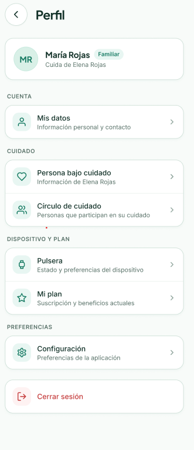<br><sub>Perfil</sub></td>
    <td align="center" valign="top">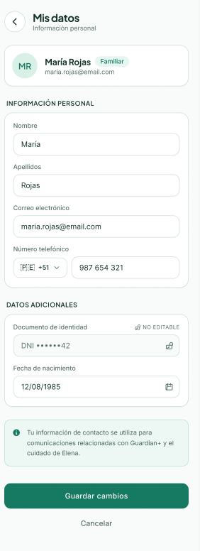<br><sub>Mis datos</sub></td>
    <td align="center" valign="top">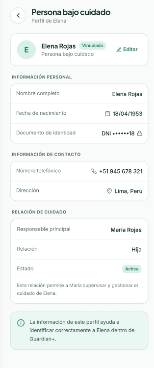<br><sub>Persona bajo cuidado</sub></td>
  </tr>
  <tr>
    <td align="center" valign="top">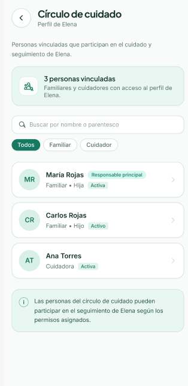<br><sub>Círculo de cuidado</sub></td>
    <td align="center" valign="top">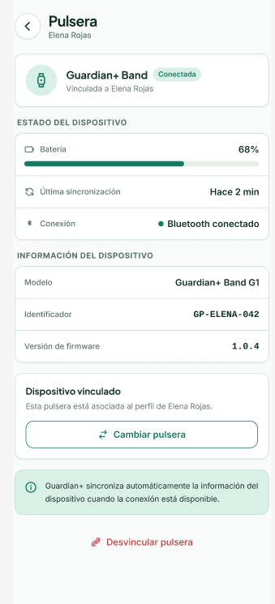<br><sub>Pulsera</sub></td>
    <td align="center" valign="top">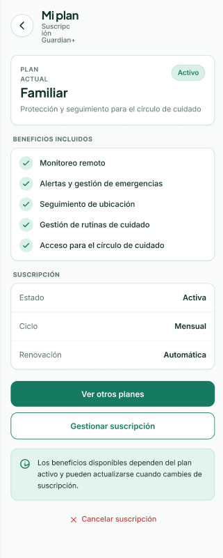<br><sub>Mi plan</sub></td>
  </tr>
  <tr>
    <td align="center" valign="top">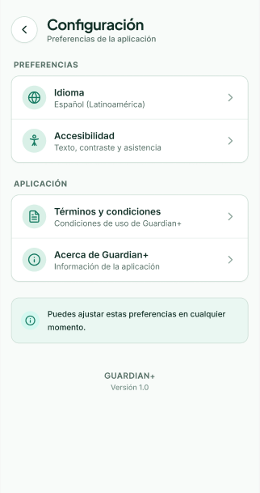<br><sub>Configuración</sub></td>
    <td align="center" valign="top">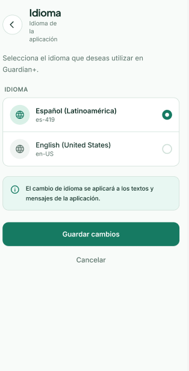<br><sub>Idioma</sub></td>
    <td align="center" valign="top">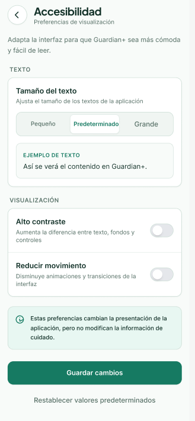<br><sub>Accesibilidad</sub></td>
  </tr>
  <tr>
    <td align="center" valign="top">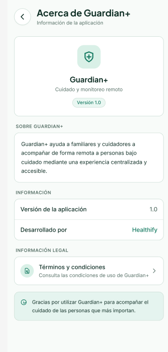<br><sub>Acerca de Guardian+</sub></td>
    <td align="center" valign="top">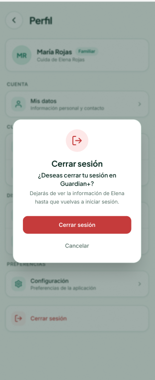<br><sub>Cerrar sesión</sub></td>
  </tr>
</table>

##### Emergency & Alerting Bounded Context

Los mock-ups de **Alertas** aplican el Style Guide (3.1.1) con un criterio de severidad: el rojo identifica las alertas críticas y el SOS, el ámbar las alertas de prioridad media y el verde las alertas estabilizadas o atendidas. La Figura 3.49 presenta los mock-ups de Emergency & Alerting.

<a id="figura-3-49"></a>**Figura 3.49.** Mock-ups de Emergency & Alerting

<table>
  <tr>
    <td align="center" valign="top">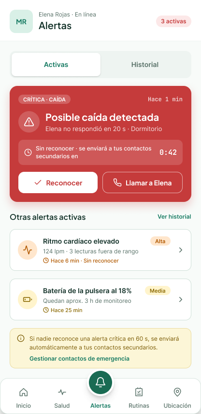<br><sub>Alertas activas</sub></td>
    <td align="center" valign="top">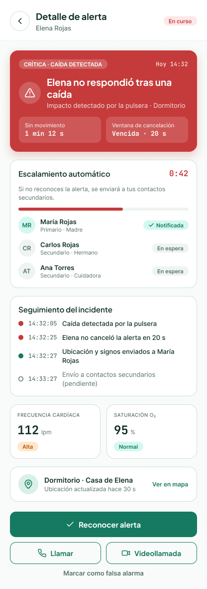<br><sub>Detalle de alerta crítica</sub></td>
    <td align="center" valign="top">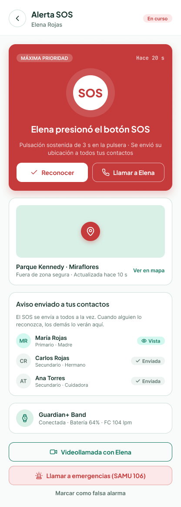<br><sub>Alerta SOS</sub></td>
  </tr>
  <tr>
    <td align="center" valign="top">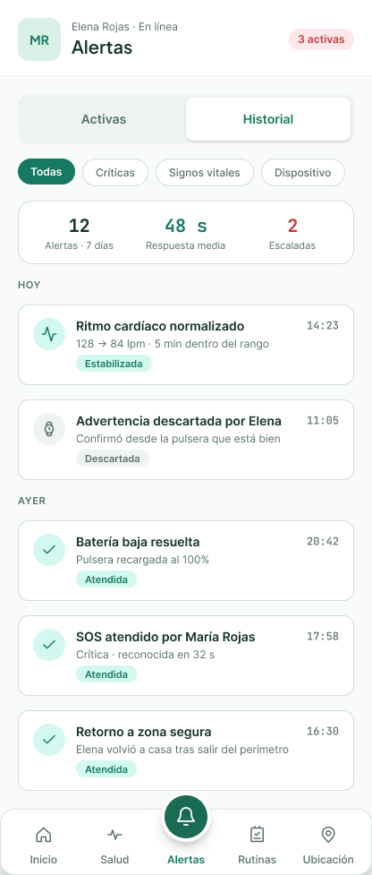<br><sub>Historial de alertas</sub></td>
    <td align="center" valign="top">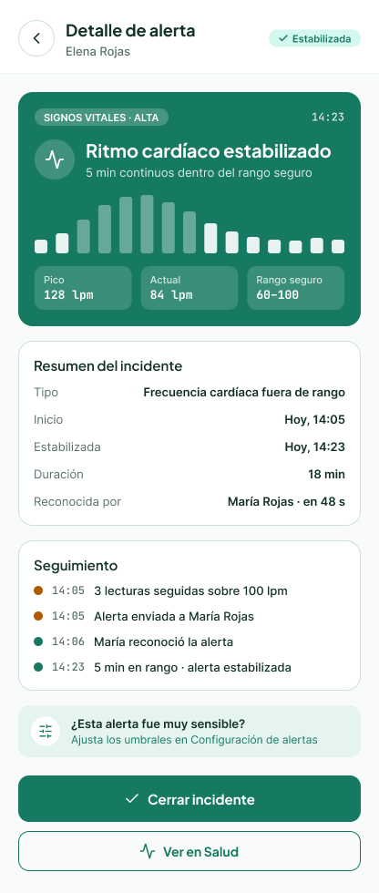<br><sub>Alerta estabilizada</sub></td>
    <td align="center" valign="top"><br><sub>Contactos de emergencia</sub></td>
  </tr>
</table>

##### Care Routines & Wellness Bounded Context

Los mock-ups de **Rutinas** usan el verde para las rutinas completadas y las acciones principales, y el ámbar para las tomas pendientes y los avisos preventivos. La Figura 3.50 presenta los mock-ups de Care Routines & Wellness.

<a id="figura-3-50"></a>**Figura 3.50.** Mock-ups de Care Routines & Wellness

<table>
  <tr>
    <td align="center" valign="top">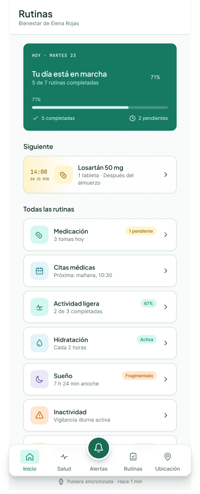<br><sub>Rutinas</sub></td>
    <td align="center" valign="top">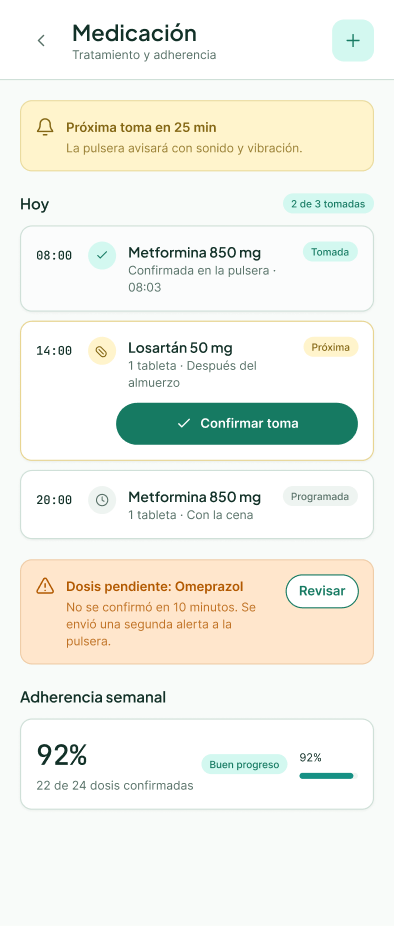<br><sub>Medicación</sub></td>
    <td align="center" valign="top">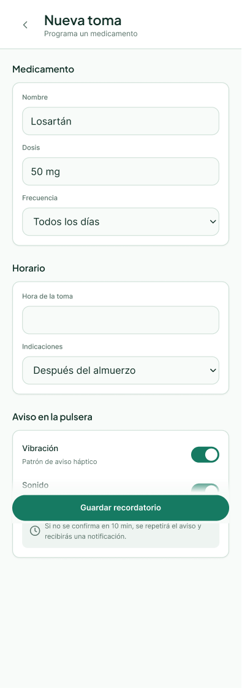<br><sub>Nueva toma</sub></td>
  </tr>
  <tr>
    <td align="center" valign="top">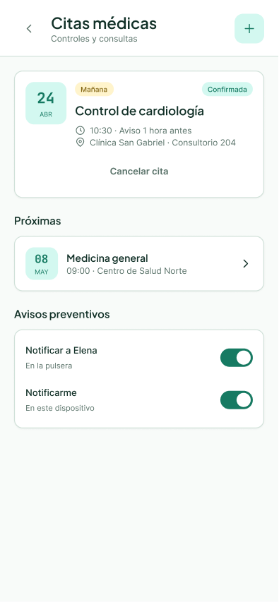<br><sub>Citas médicas</sub></td>
    <td align="center" valign="top">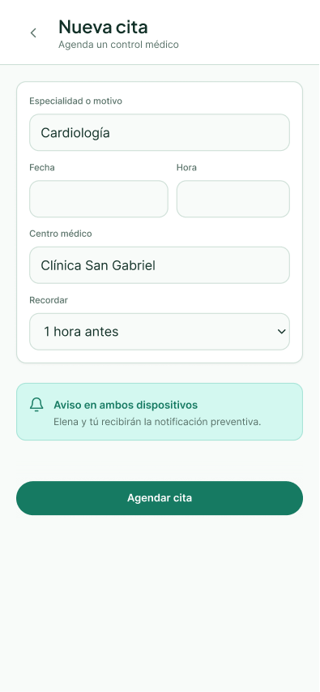<br><sub>Nueva cita</sub></td>
    <td align="center" valign="top">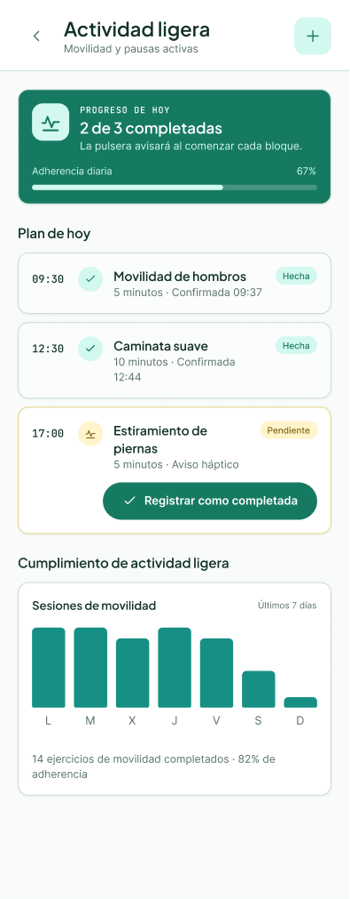<br><sub>Actividad ligera</sub></td>
  </tr>
</table>


#### 3.1.4.4. Mobile Applications User Flow Diagrams

Los user flow diagrams describen, para cada user goal, la secuencia de acciones del usuario en la aplicación y las respuestas del sistema. Cada diagrama se acompaña de la User Persona, el número de flujo y el user goal que representa, y se presentan agrupados por Bounded Context.

##### Mobility & Geofencing Bounded Context

Los user flows de Mobility & Geofencing cubren la consulta de la ubicación en tiempo real de la persona bajo cuidado, la comunicación directa con ella mediante llamada o videollamada y la configuración de zonas seguras.

La Figura 3.51 presenta el user flow para consultar la ubicación en tiempo real, junto con su User Persona y su user goal.

<a id="figura-3-51"></a>**Figura 3.51.** User flow de Mobility & Geofencing: Consultar la ubicación en tiempo real

<table>
  <tr>
    <td class="header">User Persona</td>
    <td>Cuidador</td>
    <td class="header">Número</td>
    <td>1</td>
  </tr>
  <tr>
    <td class="header">User Goal</td>
    <td colspan="3" class="italic bold">
    Como Cuidador, quiero consultar en tiempo real la ubicación del Fragile Citizen mediante las coordenadas de geolocalización de su pulsera, para verificar su paradero y actuar rápidamente ante una posible desorientación.
    </td>
  </tr>
  <tr>
    <td class="header">Happy path</td>
    <td colspan="3">
    <ol>
    <li>Cuidador inicia sesión en la aplicación</li>
    <li>El sistema muestra la pantalla principal con los Fragile Citizens asociados.</li>
    <li>Cuidador selecciona al Fragile Citizen que desea localizar.</li>
    <li>El sistema muestra la vista de Localización/Mapa.</li>
    <li>El Cuidador solicita la ubicación actual.</li>
    <li>El sistema consulta la telemetría de geolocalización de la pulsera</li>
    <li>¿Existe cobertura GNSS activa? Sí → el sistema obtiene la posición actual.</li>
    <li>El sistema recibe las coordenadas de latitud y longitud.</li>
    <li>El sistema verifica que la información tenga una marca de tiempo dentro de los últimos 30 segundos.</li>
    <li>El sistema muestra la ubicación actual del Fragile Citizen en el mapa</li>
    <li>Se muestran las coordenadas y la hora de última actualización. El Cuidador verifica el paradero del Fragile Citizen.</li>
    </ol>
    </td>
  </tr>
  <tr>
    <td class="header">Unhappy Paths</td>
    <td colspan="3">
    <ol>
    <li>El Cuidador selecciona al Fragile Citizen.</li>
    <li>El Cuidador solicita su ubicación actual.</li>
    <li>¿Existe cobertura GNSS activa? No → el sistema detecta que no existe una fijación satelital válida.</li>
    <li>El sistema recupera el último punto geográfico válido conocido.</li>
    <li>El sistema muestra dicho punto en el mapa.</li>
    <li>El sistema presenta una advertencia indicando que existe una pérdida momentánea de señal GNSS.</li>
    <li>El sistema muestra la marca de tiempo correspondiente al último punto válido, diferenciándola de una ubicación en tiempo real.</li>
    <li>El Cuidador puede continuar monitoreando la ubicación hasta que se restablezca la señal.</li>
    </ol>
    </td>
  </tr>
</table>

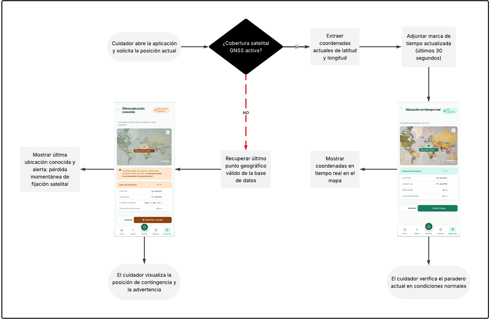

<hr>

La Figura 3.52 presenta el user flow para comunicarse directamente con la persona bajo cuidado, junto con su User Persona y su user goal.

<a id="figura-3-52"></a>**Figura 3.52.** User flow de Mobility & Geofencing: Comunicarse directamente con la persona bajo cuidado

<table>
  <tr>
    <td class="header">User Persona</td>
    <td>Famliar</td>
    <td class="header">Número</td>
    <td>2</td>
  </tr>
  <tr>
    <td class="header">User Goal</td>
    <td colspan="3" class="italic bold">
    Como Familiar, quiero iniciar una comunicación directa con el Fragile Citizen mediante videollamada o llamada de voz, según las capacidades de la pulsera, para verificar su condición ante una inquietud o situación cotidiana.
    </td>
  </tr>
  <tr>
    <td class="header">Happy path</td>
    <td colspan="3">
    <ol>
    <li>El Familiar selecciona al Fragile Citizen desde la aplicación.</li>
    <li>Solicita iniciar una videollamada.</li>
    <li>El sistema verifica las capacidades de comunicación de la pulsera.</li>
    <li>La pulsera cuenta con cámara, pantalla y conexión de datos activa.</li>
    <li>El sistema establece la sesión de videollamada.</li>
    <li>Se confirma la conexión entre el Familiar y el Fragile Citizen.</li>
    </ol>
    </td>
  </tr>
  <tr>
    <td class="header">Unhappy Paths</td>
    <td colspan="3">
    <ul>
    <li>Sin cámara: Si la pulsera permite comunicación por audio, pero no dispone de cámara, el sistema informa la limitación y cambia automáticamente la solicitud a una llamada de voz.</li>
    <li>Sin comunicación bidireccional: Si la pulsera solo permite telemetría, avisos hápticos y SOS, el sistema informa que no admite llamadas y ofrece realizar una llamada telefónica al número registrado.</li>
    <li>Llamada no contestada: Si el Fragile Citizen no responde después de 30 segundos, el sistema finaliza el intento y registra la llamada como no atendida en el historial.</li>
    </ul>
    </td>
  </tr>
</table>

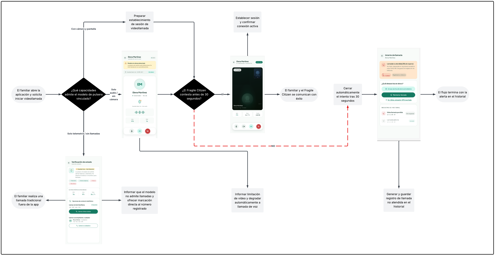

<hr>

La Figura 3.53 presenta el user flow para configurar y monitorear zonas seguras, junto con su User Persona y su user goal.

<a id="figura-3-53"></a>**Figura 3.53.** User flow de Mobility & Geofencing: Configurar y monitorear zonas seguras

<table>
  <tr>
    <td class="header">User Persona</td>
    <td>Cuidador</td>
    <td class="header">Número</td>
    <td>3</td>
  </tr>
  <tr>
    <td class="header">User Goal</td>
    <td colspan="3" class="italic bold">
    Como Cuidador, quiero configurar y monitorear múltiples zonas geográficas seguras para recibir alertas cuando el Fragile Citizen salga de los perímetros autorizados y ser informado cuando reingrese a una zona segura.
    </td>
  </tr>
  <tr>
    <td class="header">Happy path</td>
    <td colspan="3">
    <ol>
    <li>El Cuidador configura una o más geocercas, como hogar, parque o club.</li>
    <li>Define las coordenadas y el radio de cada zona segura.</li>
    <li>El sistema activa las geocercas y comienza el monitoreo.</li>
    <li>El Fragile Citizen permanece dentro de una zona segura.</li>
    <li>El sistema verifica continuamente las coordenadas del dispositivo.</li>
    <li>Cuando el Fragile Citizen reingresa a una zona después de haber estado fuera, el sistema notifica el reingreso al perímetro seguro.</li>
    <li>Se restablece la condición de vigilancia regular.</li>
    </ol>
    </td>
  </tr>
  <tr>
    <td class="header">Unhappy Paths</td>
    <td colspan="3">
    <ul>
    <li>Salida de todas las zonas seguras: Si las coordenadas se mantienen fuera de todas las geocercas activas, el sistema genera una alerta de egreso y la envía inmediatamente al Cuidador.</li>
    <li>Múltiples geocercas: Si existen varias zonas configuradas, el sistema debe verificar la posición respecto a todas las zonas activas antes de generar una alerta de salida.</li>
    <li>Reingreso: Si el Fragile Citizen vuelve a ingresar a cualquiera de las zonas autorizadas, el sistema notifica el reingreso y vuelve al estado de vigilancia regular.</li>
    </td>
    </ul>
  </tr>
</table>


<hr>

##### Health Monitoring Bounded Context

Los siguientes user flows corresponden al Bounded Context **Health Monitoring** y describen cómo la Cuidadora (User Persona: Roxana Paola Diana Ramírez) consulta, analiza, exporta y sincroniza los signos vitales del Fragile Citizen desde la sección **Salud**. Cada diagrama muestra el happy path con flechas continuas y el unhappy path con flechas discontinuas en rojo.

La Figura 3.54 presenta el user flow para consultar el ritmo cardíaco (US01), junto con su User Persona y su user goal.

<a id="figura-3-54"></a>**Figura 3.54.** User flow de Health Monitoring: Consultar ritmo cardíaco (US01)

<table>
  <tr>
    <td class="header">User Persona</td>
    <td>Cuidador (Roxana Paola Diana Ramírez)</td>
    <td class="header">Número</td>
    <td>1 · US01</td>
  </tr>
  <tr>
    <td class="header">User Goal</td>
    <td colspan="3" class="italic bold">
    Como cuidador, quiero consultar la lectura actual del ritmo cardíaco de la persona bajo cuidado, para monitorear su estabilidad cardiovascular e identificar irregularidades oportunamente.
    </td>
  </tr>
  <tr>
    <td class="header">Happy path</td>
    <td colspan="3">
    <ol>
    <li>El Cuidador necesita revisar el indicador y se encuentra en la pantalla de Inicio.</li>
    <li>El Cuidador toca Salud.</li>
    <li>El sistema muestra la pantalla Salud con los signos vitales en tiempo real.</li>
    <li>El Cuidador selecciona Ritmo cardíaco.</li>
    <li>El sistema muestra la pantalla de consulta de ritmo cardíaco.</li>
    <li>¿Hay lectura válida? Sí → el sistema muestra el valor, la tendencia y el estado.</li>
    <li>El Cuidador comprende el estado cardíaco del Fragile Citizen.</li>
    </ol>
    </td>
  </tr>
  <tr>
    <td class="header">Unhappy Paths</td>
    <td colspan="3">
    <ol>
    <li>El Cuidador selecciona Ritmo cardíaco.</li>
    <li>¿Hay lectura válida? No → el sistema no recibe una lectura válida de la pulsera.</li>
    <li>El sistema muestra el último valor válido junto con el indicador “Sin señal”.</li>
    <li>El Cuidador puede continuar el seguimiento con contexto.</li>
    </ol>
    </td>
  </tr>
</table>


<hr>

La Figura 3.55 presenta el user flow para consultar la presión arterial (US02), junto con su User Persona y su user goal.

<a id="figura-3-55"></a>**Figura 3.55.** User flow de Health Monitoring: Consultar presión arterial (US02)

<table>
  <tr>
    <td class="header">User Persona</td>
    <td>Cuidador (Roxana Paola Diana Ramírez)</td>
    <td class="header">Número</td>
    <td>2 · US02</td>
  </tr>
  <tr>
    <td class="header">User Goal</td>
    <td colspan="3" class="italic bold">
    Como cuidador, quiero consultar la presión arterial sistólica y diastólica de la persona bajo cuidado, para evaluar su condición hemodinámica y prevenir descompensaciones.
    </td>
  </tr>
  <tr>
    <td class="header">Happy path</td>
    <td colspan="3">
    <ol>
    <li>El Cuidador necesita revisar el indicador y se encuentra en la pantalla de Inicio.</li>
    <li>El Cuidador toca Salud.</li>
    <li>El sistema muestra la pantalla Salud con los signos vitales en tiempo real.</li>
    <li>El Cuidador selecciona Presión arterial.</li>
    <li>El sistema muestra la pantalla de consulta de presión arterial.</li>
    <li>¿Lectura concluyente? Sí → el sistema muestra el valor en mmHg y su clasificación.</li>
    <li>El Cuidador evalúa la presión arterial del Fragile Citizen.</li>
    </ol>
    </td>
  </tr>
  <tr>
    <td class="header">Unhappy Paths</td>
    <td colspan="3">
    <ol>
    <li>El Cuidador selecciona Presión arterial.</li>
    <li>¿Lectura concluyente? No → la medición no es válida.</li>
    <li>El sistema descarta la medición inválida e informa el error.</li>
    <li>Se solicita una nueva lectura.</li>
    </ol>
    </td>
  </tr>
</table>


<hr>

La Figura 3.56 presenta el user flow para consultar la saturación de oxígeno (US03), junto con su User Persona y su user goal.

<a id="figura-3-56"></a>**Figura 3.56.** User flow de Health Monitoring: Consultar saturación de oxígeno (US03)

<table>
  <tr>
    <td class="header">User Persona</td>
    <td>Cuidador (Roxana Paola Diana Ramírez)</td>
    <td class="header">Número</td>
    <td>3 · US03</td>
  </tr>
  <tr>
    <td class="header">User Goal</td>
    <td colspan="3" class="italic bold">
    Como cuidador, quiero consultar la saturación de oxígeno de la persona bajo cuidado, para identificar hipoxemia o dificultad respiratoria.
    </td>
  </tr>
  <tr>
    <td class="header">Happy path</td>
    <td colspan="3">
    <ol>
    <li>El Cuidador necesita revisar el indicador y se encuentra en la pantalla de Inicio.</li>
    <li>El Cuidador toca Salud.</li>
    <li>El sistema muestra la pantalla Salud con los signos vitales en tiempo real.</li>
    <li>El Cuidador selecciona Saturación O₂.</li>
    <li>El sistema muestra la pantalla de consulta de saturación de oxígeno.</li>
    <li>¿Hay contacto continuo? Sí → el sistema muestra el valor de SpO₂ y su estado.</li>
    <li>El Cuidador evalúa la oxigenación del Fragile Citizen.</li>
    </ol>
    </td>
  </tr>
  <tr>
    <td class="header">Unhappy Paths</td>
    <td colspan="3">
    <ol>
    <li>El Cuidador selecciona Saturación O₂.</li>
    <li>¿Hay contacto continuo? No → la pulsera no mantiene contacto continuo con la piel.</li>
    <li>El sistema conserva el último registro válido e indica que la lectura está incompleta.</li>
    <li>No se interpreta un dato incompleto.</li>
    </ol>
    </td>
  </tr>
</table>


<hr>

La Figura 3.57 presenta el user flow para supervisar la temperatura corporal (US04), junto con su User Persona y su user goal.

<a id="figura-3-57"></a>**Figura 3.57.** User flow de Health Monitoring: Supervisar temperatura corporal (US04)

<table>
  <tr>
    <td class="header">User Persona</td>
    <td>Cuidador (Roxana Paola Diana Ramírez)</td>
    <td class="header">Número</td>
    <td>4 · US04</td>
  </tr>
  <tr>
    <td class="header">User Goal</td>
    <td colspan="3" class="italic bold">
    Como cuidador, quiero supervisar la temperatura corporal de la persona bajo cuidado, para detectar oportunamente fiebre o hipotermia.
    </td>
  </tr>
  <tr>
    <td class="header">Happy path</td>
    <td colspan="3">
    <ol>
    <li>El Cuidador necesita revisar el indicador y se encuentra en la pantalla de Inicio.</li>
    <li>El Cuidador toca Salud.</li>
    <li>El sistema muestra la pantalla Salud con los signos vitales en tiempo real.</li>
    <li>El Cuidador selecciona Temperatura.</li>
    <li>El sistema muestra la pantalla de supervisión de temperatura corporal.</li>
    <li>¿Está en rango normal? Sí → el sistema muestra normotermia y registra la serie.</li>
    <li>El Cuidador supervisa la temperatura del Fragile Citizen.</li>
    </ol>
    </td>
  </tr>
  <tr>
    <td class="header">Unhappy Paths</td>
    <td colspan="3">
    <ol>
    <li>El Cuidador selecciona Temperatura.</li>
    <li>¿Está en rango normal? No → la temperatura está fuera del rango normal.</li>
    <li>El sistema destaca la fiebre o hipotermia y pide un control inmediato.</li>
    <li>La anomalía queda visible para que el Cuidador actúe.</li>
    </ol>
    </td>
  </tr>
</table>


<hr>

La Figura 3.58 presenta el user flow para consultar la frecuencia respiratoria (US05), junto con su User Persona y su user goal.

<a id="figura-3-58"></a>**Figura 3.58.** User flow de Health Monitoring: Consultar frecuencia respiratoria (US05)

<table>
  <tr>
    <td class="header">User Persona</td>
    <td>Cuidador (Roxana Paola Diana Ramírez)</td>
    <td class="header">Número</td>
    <td>5 · US05</td>
  </tr>
  <tr>
    <td class="header">User Goal</td>
    <td colspan="3" class="italic bold">
    Como cuidador, quiero consultar la frecuencia respiratoria de la persona bajo cuidado, para identificar taquipnea o bradipnea.
    </td>
  </tr>
  <tr>
    <td class="header">Happy path</td>
    <td colspan="3">
    <ol>
    <li>El Cuidador necesita revisar el indicador y se encuentra en la pantalla de Inicio.</li>
    <li>El Cuidador toca Salud.</li>
    <li>El sistema muestra la pantalla Salud con los signos vitales en tiempo real.</li>
    <li>El Cuidador selecciona Respiración.</li>
    <li>El sistema muestra la pantalla de consulta de frecuencia respiratoria.</li>
    <li>¿Está entre 12–20 rpm? Sí → el sistema muestra un ritmo ventilatorio normal.</li>
    <li>El Cuidador evalúa la respiración del Fragile Citizen.</li>
    </ol>
    </td>
  </tr>
  <tr>
    <td class="header">Unhappy Paths</td>
    <td colspan="3">
    <ol>
    <li>El Cuidador selecciona Respiración.</li>
    <li>¿Está entre 12–20 rpm? No → la frecuencia respiratoria está fuera del rango.</li>
    <li>El sistema destaca el valor anómalo y actualiza la condición.</li>
    <li>El Cuidador identifica la alteración respiratoria.</li>
    </ol>
    </td>
  </tr>
</table>


<hr>

La Figura 3.59 presenta el user flow para analizar las tendencias históricas de los signos vitales (US07), junto con su User Persona y su user goal.

<a id="figura-3-59"></a>**Figura 3.59.** User flow de Health Monitoring: Analizar tendencias históricas (US07)

<table>
  <tr>
    <td class="header">User Persona</td>
    <td>Cuidador (Roxana Paola Diana Ramírez)</td>
    <td class="header">Número</td>
    <td>6 · US07</td>
  </tr>
  <tr>
    <td class="header">User Goal</td>
    <td colspan="3" class="italic bold">
    Como cuidador, quiero revisar tendencias históricas de signos vitales, para identificar patrones de deterioro y compartir información con el médico.
    </td>
  </tr>
  <tr>
    <td class="header">Happy path</td>
    <td colspan="3">
    <ol>
    <li>El Cuidador necesita revisar el indicador y se encuentra en la pantalla de Inicio.</li>
    <li>El Cuidador toca Salud.</li>
    <li>El sistema muestra la pantalla Salud con los signos vitales en tiempo real.</li>
    <li>El Cuidador abre “Buscar y filtrar” y elige el signo vital y el periodo.</li>
    <li>El sistema aplica los criterios seleccionados.</li>
    <li>¿Hay al menos 12 h válidas? Sí → el sistema consolida el promedio, mínimo, máximo y la gráfica.</li>
    <li>La tendencia queda disponible para el Cuidador.</li>
    </ol>
    </td>
  </tr>
  <tr>
    <td class="header">Unhappy Paths</td>
    <td colspan="3">
    <ol>
    <li>El Cuidador elige el signo vital y el periodo.</li>
    <li>¿Hay al menos 12 h válidas? No → el periodo no tiene suficientes datos.</li>
    <li>El sistema informa que el muestreo es insuficiente.</li>
    <li>El Cuidador elige otro periodo.</li>
    </ol>
    </td>
  </tr>
</table>


<hr>

La Figura 3.60 presenta el user flow para exportar el historial de telemetría (US19), junto con su User Persona y su user goal.

<a id="figura-3-60"></a>**Figura 3.60.** User flow de Health Monitoring: Exportar historial de telemetría (US19)

<table>
  <tr>
    <td class="header">User Persona</td>
    <td>Cuidador (Roxana Paola Diana Ramírez)</td>
    <td class="header">Número</td>
    <td>7 · US19</td>
  </tr>
  <tr>
    <td class="header">User Goal</td>
    <td colspan="3" class="italic bold">
    Como cuidador, quiero generar y exportar el historial de signos vitales, para respaldar las consultas médicas presenciales.
    </td>
  </tr>
  <tr>
    <td class="header">Happy path</td>
    <td colspan="3">
    <ol>
    <li>El Cuidador necesita revisar el indicador y se encuentra en la pantalla de Inicio.</li>
    <li>El Cuidador toca Salud.</li>
    <li>El sistema muestra la pantalla Salud con los signos vitales en tiempo real.</li>
    <li>El Cuidador abre Exportar PDF y elige el periodo.</li>
    <li>El sistema muestra la hoja “Exportar expediente”.</li>
    <li>¿El rango tiene registros? Sí → el sistema compila y genera el expediente en PDF.</li>
    <li>El expediente queda listo para compartir.</li>
    </ol>
    </td>
  </tr>
  <tr>
    <td class="header">Unhappy Paths</td>
    <td colspan="3">
    <ol>
    <li>El Cuidador abre Exportar PDF y elige el periodo.</li>
    <li>¿El rango tiene registros? No → el periodo seleccionado no contiene datos.</li>
    <li>El sistema bloquea la exportación y conserva el periodo seleccionado.</li>
    <li>El Cuidador selecciona otro rango.</li>
    </ol>
    </td>
  </tr>
</table>


<hr>

La Figura 3.61 presenta el user flow para sincronizar la telemetría registrada sin conexión (US21), junto con su User Persona y su user goal.

<a id="figura-3-61"></a>**Figura 3.61.** User flow de Health Monitoring: Sincronizar telemetría sin conexión (US21)

<table>
  <tr>
    <td class="header">User Persona</td>
    <td>Cuidador (Roxana Paola Diana Ramírez)</td>
    <td class="header">Número</td>
    <td>8 · US21</td>
  </tr>
  <tr>
    <td class="header">User Goal</td>
    <td colspan="3" class="italic bold">
    Como cuidador, quiero que las lecturas tomadas sin red se almacenen y sincronicen al recuperar conexión, para conservar íntegro el historial.
    </td>
  </tr>
  <tr>
    <td class="header">Happy path</td>
    <td colspan="3">
    <ol>
    <li>El Cuidador necesita revisar el indicador y se encuentra en la pantalla de Inicio.</li>
    <li>El Cuidador toca Salud.</li>
    <li>El sistema muestra la pantalla Salud con los signos vitales en tiempo real.</li>
    <li>El monitoreo recibe nuevas lecturas de la pulsera.</li>
    <li>El sistema muestra la tarjeta “Sincronización activa” en la pestaña Ahora.</li>
    <li>¿Hay conexión disponible? Sí → el sistema transmite y persiste la telemetría.</li>
    <li>El historial queda actualizado.</li>
    </ol>
    </td>
  </tr>
  <tr>
    <td class="header">Unhappy Paths</td>
    <td colspan="3">
    <ol>
    <li>El monitoreo recibe nuevas lecturas de la pulsera.</li>
    <li>¿Hay conexión disponible? No → no existe conexión de red.</li>
    <li>El sistema almacena las lecturas localmente y las sincroniza al reconectar.</li>
    <li>Los datos pendientes se recuperan en el historial.</li>
    </ol>
    </td>
  </tr>
</table>


<hr>

La Figura 3.62 presenta el user flow para revisar el reporte semanal de salud (US24), junto con su User Persona y su user goal.

<a id="figura-3-62"></a>**Figura 3.62.** User flow de Health Monitoring: Revisar reporte semanal de salud (US24)

<table>
  <tr>
    <td class="header">User Persona</td>
    <td>Cuidador (Roxana Paola Diana Ramírez)</td>
    <td class="header">Número</td>
    <td>9 · US24</td>
  </tr>
  <tr>
    <td class="header">User Goal</td>
    <td colspan="3" class="italic bold">
    Como cuidador, quiero recibir una síntesis semanal del estado de salud, para evaluar la evolución global sin revisar la telemetría continuamente.
    </td>
  </tr>
  <tr>
    <td class="header">Happy path</td>
    <td colspan="3">
    <ol>
    <li>El Cuidador necesita revisar el indicador y se encuentra en la pantalla de Inicio.</li>
    <li>El Cuidador toca Salud.</li>
    <li>El sistema muestra la pantalla Salud con los signos vitales en tiempo real.</li>
    <li>El Cuidador abre Reporte semanal.</li>
    <li>El sistema muestra la hoja de reporte semanal de salud.</li>
    <li>El sistema muestra la estabilidad de signos vitales, las alertas disparadas y la adherencia a la medicación.</li>
    <li>El Cuidador comprende la evolución de la semana.</li>
    </ol>
    </td>
  </tr>
  <tr>
    <td class="header">Unhappy Paths</td>
    <td colspan="3">
    <ol>
    <li>El Cuidador abre Reporte semanal.</li>
    <li>El sistema detecta anomalías recurrentes en un parámetro durante la semana.</li>
    <li>El sistema resalta la recurrencia y recomienda una revisión médica preventiva.</li>
    <li>El Cuidador identifica el riesgo recurrente.</li>
    </ol>
    </td>
  </tr>
</table>


##### Extras

Los siguientes user flows corresponden a las vistas complementarias de **Extras** y describen cómo el Familiar o Cuidador gestiona su información personal, consulta su entorno de cuidado y suscripción, configura las preferencias de Guardian+ y administra el cierre de sesión. Cada diagrama presenta la ruta esperada o happy path y las rutas alternativas o unhappy paths.

La Figura 3.63 presenta el user flow para gestionar la información personal, junto con su User Persona y su user goal.

<a id="figura-3-63"></a>**Figura 3.63.** User flow de Extras: Gestionar información personal

<table>
  <tr>
    <td class="header">User Persona</td>
    <td>Familiar / Cuidador</td>
    <td class="header">Número</td>
    <td>1</td>
  </tr>
  <tr>
    <td class="header">User Goal</td>
    <td colspan="3" class="italic bold">
    Como familiar o cuidador, quiero consultar y actualizar mis datos personales y de contacto, para mantener correcta la información asociada a mi perfil en Guardian+.
    </td>
  </tr>
  <tr>
    <td class="header">Happy path</td>
    <td colspan="3">
    <ol>
      <li>El Familiar o Cuidador se encuentra en la pantalla de Inicio.</li>
      <li>El usuario toca su avatar.</li>
      <li>El sistema muestra la pantalla Perfil.</li>
      <li>El usuario selecciona “Mis datos”.</li>
      <li>El sistema muestra la información personal y de contacto registrada.</li>
      <li>El usuario modifica la información que desea actualizar y selecciona “Guardar cambios”.</li>
      <li>¿Los datos son válidos? Sí → el sistema guarda la información actualizada.</li>
      <li>El sistema confirma que los cambios fueron guardados correctamente.</li>
    </ol>
    </td>
  </tr>
  <tr>
    <td class="header">Unhappy Paths</td>
    <td colspan="3">
    <ol>
      <li>Datos inválidos: Si alguno de los datos ingresados no cumple con el formato esperado, el sistema mantiene la pantalla “Mis datos” y muestra el campo que debe corregirse.</li>
      <li>El usuario corrige el dato inválido y selecciona nuevamente “Guardar cambios”.</li>
      <li>Cancelar edición: Si el usuario selecciona “Cancelar”, el sistema regresa a Perfil sin guardar las modificaciones realizadas.</li>
    </ol>
    </td>
  </tr>
</table>

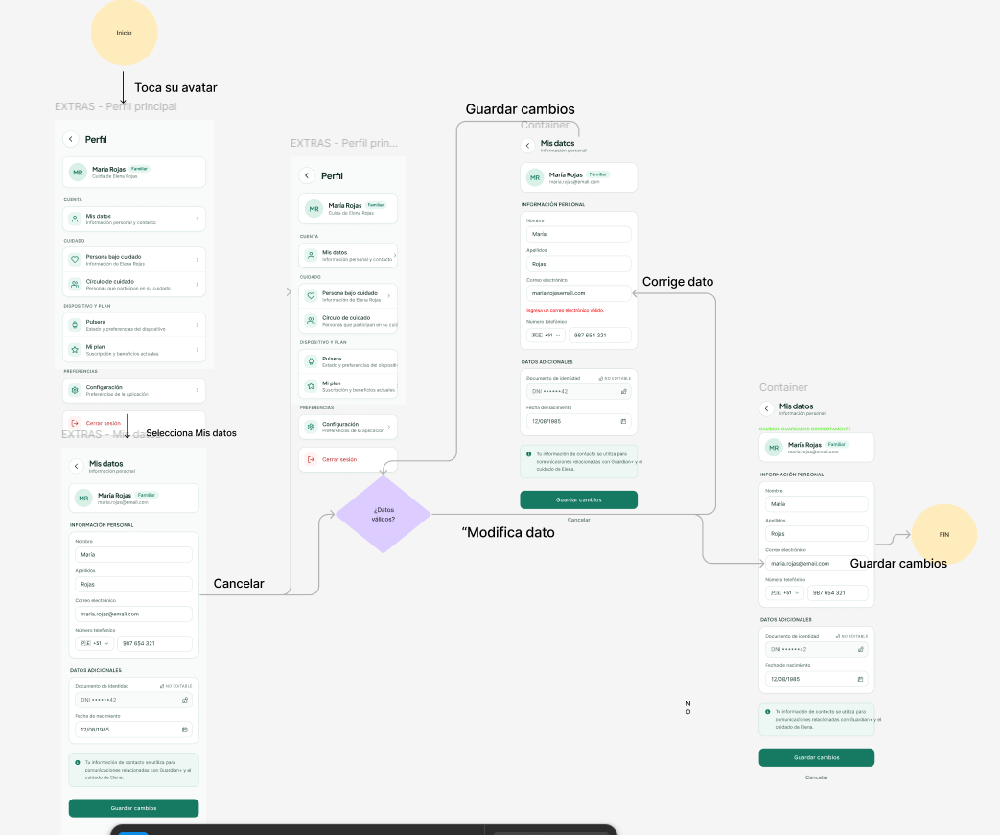

<hr>

La Figura 3.64 presenta el user flow para consultar el entorno de cuidado, junto con su User Persona y su user goal.

<a id="figura-3-64"></a>**Figura 3.64.** User flow de Extras: Consultar entorno de cuidado

<table>
  <tr>
    <td class="header">User Persona</td>
    <td>Familiar / Cuidador</td>
    <td class="header">Número</td>
    <td>2</td>
  </tr>
  <tr>
    <td class="header">User Goal</td>
    <td colspan="3" class="italic bold">
    Como familiar o cuidador, quiero consultar la información de Elena, las personas vinculadas a su cuidado y el estado de su pulsera, para mantenerme informado sobre su entorno de cuidado.
    </td>
  </tr>
  <tr>
    <td class="header">Happy path</td>
    <td colspan="3">
    <ol>
      <li>El Familiar o Cuidador se encuentra en la pantalla de Inicio.</li>
      <li>El usuario toca su avatar.</li>
      <li>El sistema muestra la pantalla Perfil.</li>
      <li>El usuario selecciona la información del entorno de cuidado que desea consultar.</li>
      <li>Si selecciona “Persona bajo cuidado”, el sistema muestra la información principal de Elena.</li>
      <li>Si selecciona “Pulsera”, el sistema muestra el estado y la información del dispositivo asociado.</li>
      <li>Si selecciona “Círculo de cuidado”, el sistema muestra las personas vinculadas al cuidado de Elena.</li>
      <li>El usuario puede buscar una persona por nombre o parentesco.</li>
      <li>¿Hay coincidencias? Sí → el sistema muestra los contactos que cumplen con el criterio de búsqueda.</li>
      <li>El usuario consulta la información requerida del entorno de cuidado.</li>
    </ol>
    </td>
  </tr>
  <tr>
    <td class="header">Unhappy Paths</td>
    <td colspan="3">
    <ol>
      <li>Sin coincidencias: Si la búsqueda no coincide con ninguna persona del círculo de cuidado, el sistema muestra el estado “No encontramos coincidencias”.</li>
      <li>El sistema mantiene disponible el campo de búsqueda y la acción para limpiar o modificar el criterio utilizado.</li>
      <li>El usuario modifica la búsqueda y el sistema vuelve a evaluar las coincidencias disponibles.</li>
    </ol>
    </td>
  </tr>
</table>

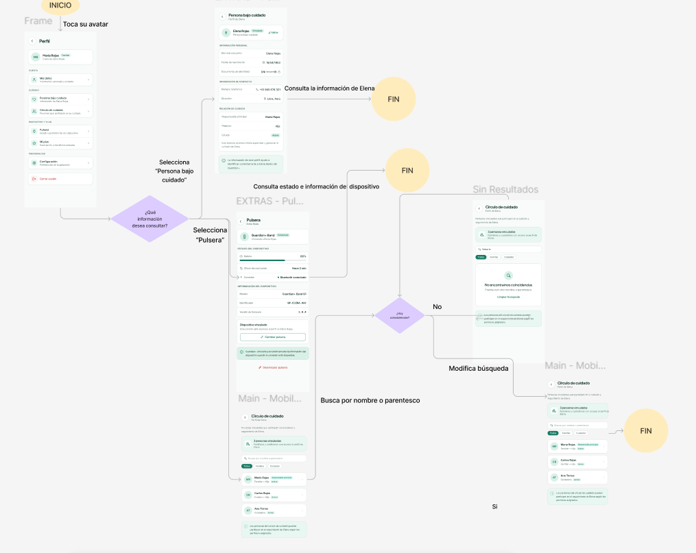

<hr>

La Figura 3.65 presenta el user flow para consultar la suscripción actual, junto con su User Persona y su user goal.

<a id="figura-3-65"></a>**Figura 3.65.** User flow de Extras: Consultar suscripción actual

<table>
  <tr>
    <td class="header">User Persona</td>
    <td>Familiar / Cuidador</td>
    <td class="header">Número</td>
    <td>3</td>
  </tr>
  <tr>
    <td class="header">User Goal</td>
    <td colspan="3" class="italic bold">
    Como familiar o cuidador, quiero consultar mi plan actual y sus beneficios, para conocer las funcionalidades disponibles en mi suscripción de Guardian+.
    </td>
  </tr>
  <tr>
    <td class="header">Happy path</td>
    <td colspan="3">
    <ol>
      <li>El Familiar o Cuidador se encuentra en la pantalla de Inicio.</li>
      <li>El usuario toca su avatar.</li>
      <li>El sistema muestra la pantalla Perfil.</li>
      <li>El usuario selecciona “Mi plan”.</li>
      <li>¿La información del plan está disponible? Sí → el sistema muestra la suscripción activa.</li>
      <li>El sistema presenta el nombre del plan, sus beneficios y el estado general de la suscripción.</li>
      <li>El usuario consulta la información y los beneficios disponibles en su plan.</li>
    </ol>
    </td>
  </tr>
  <tr>
    <td class="header">Unhappy Paths</td>
    <td colspan="3">
    <ol>
      <li>Error de carga: Si la información del plan no está disponible, el sistema muestra el mensaje “No pudimos cargar tu plan”.</li>
      <li>El sistema informa que los datos de la suscripción no han sido modificados.</li>
      <li>El usuario selecciona “Reintentar”.</li>
      <li>El sistema vuelve a consultar la información del plan hasta que pueda mostrarla correctamente.</li>
    </ol>
    </td>
  </tr>
</table>

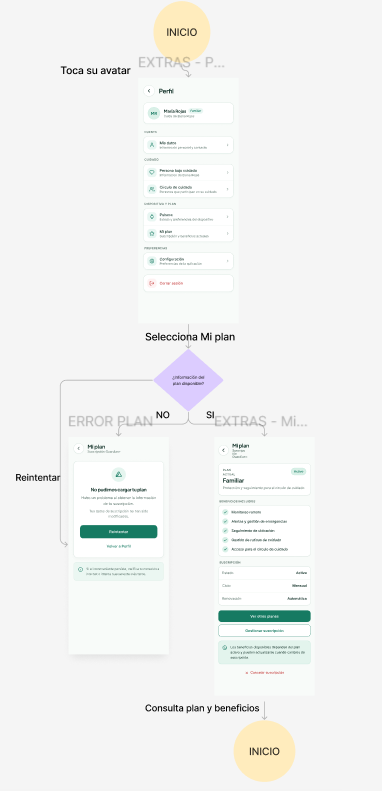

<hr>

La Figura 3.66 presenta el user flow para configurar las preferencias de la aplicación, junto con su User Persona y su user goal.

<a id="figura-3-66"></a>**Figura 3.66.** User flow de Extras: Configurar preferencias de la aplicación

<table>
  <tr>
    <td class="header">User Persona</td>
    <td>Familiar / Cuidador</td>
    <td class="header">Número</td>
    <td>4</td>
  </tr>
  <tr>
    <td class="header">User Goal</td>
    <td colspan="3" class="italic bold">
    Como familiar o cuidador, quiero ajustar el idioma y las opciones de accesibilidad de Guardian+, para adaptar la aplicación a mis necesidades de uso.
    </td>
  </tr>
  <tr>
    <td class="header">Happy path</td>
    <td colspan="3">
    <ol>
      <li>El Familiar o Cuidador se encuentra en la pantalla de Inicio.</li>
      <li>El usuario toca su avatar.</li>
      <li>El sistema muestra la pantalla Perfil.</li>
      <li>El usuario selecciona “Configuración”.</li>
      <li>El sistema muestra las preferencias disponibles de la aplicación.</li>
      <li>El usuario selecciona la preferencia que desea configurar: “Idioma” o “Accesibilidad”.</li>
      <li>Si selecciona “Idioma”, el sistema muestra los idiomas disponibles y el usuario selecciona el idioma deseado.</li>
      <li>Si selecciona “Accesibilidad”, el sistema muestra las opciones disponibles y el usuario ajusta sus preferencias.</li>
      <li>El usuario selecciona “Guardar cambios”.</li>
      <li>¿Se guardaron los cambios? Sí → el sistema actualiza la preferencia seleccionada y muestra una confirmación.</li>
    </ol>
    </td>
  </tr>
  <tr>
    <td class="header">Unhappy Paths</td>
    <td colspan="3">
    <ol>
      <li>Error al guardar idioma: Si la preferencia de idioma no puede guardarse, el sistema mantiene la selección realizada y muestra un mensaje de error.</li>
      <li>El usuario selecciona “Reintentar” y el sistema intenta guardar nuevamente la preferencia.</li>
      <li>Error al guardar accesibilidad: Si las preferencias de accesibilidad no pueden guardarse, el sistema mantiene los ajustes realizados y muestra un mensaje de error.</li>
      <li>El usuario selecciona “Reintentar” y el sistema intenta guardar nuevamente las preferencias.</li>
    </ol>
    </td>
  </tr>
</table>

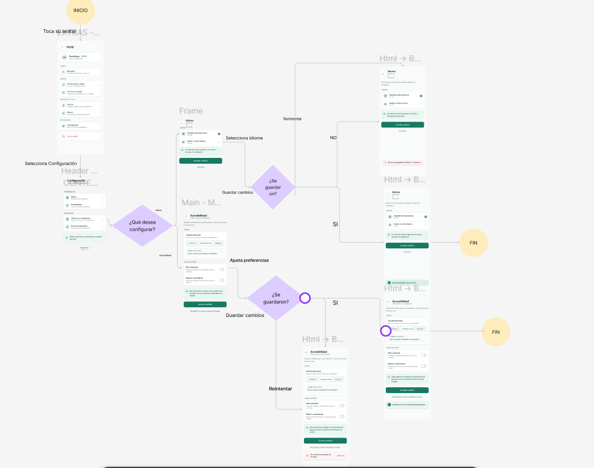

<hr>


##### Emergency & Alerting Bounded Context

Los siguientes user flows corresponden al Bounded Context **Emergency & Alerting** y describen cómo el familiar y la cuidadora atienden las alertas de Elena desde la sección **Alertas**. Cada diagrama muestra el happy path en verde y los unhappy paths en rojo.

La Figura 3.67 presenta el user flow para atender una alerta de caída (US08, US11), junto con su User Persona y su user goal.

<a id="figura-3-67"></a>**Figura 3.67.** User flow de Emergency & Alerting: Atender una alerta de caída (US08, US11)

<table>
  <tr>
    <td class="header">User Persona</td>
    <td>Familiar (María Fernanda Rojas Ibáñez)</td>
    <td class="header">Número</td>
    <td>1 · US08, US11</td>
  </tr>
  <tr>
    <td class="header">User Goal</td>
    <td colspan="3" class="italic bold">
    Como familiar de Elena, quiero enterarme de inmediato cuando la pulsera detecte una caída y atenderla, para asegurarme de que reciba ayuda a tiempo.
    </td>
  </tr>
  <tr>
    <td class="header">Happy path</td>
    <td colspan="3">
    <ol>
      <li>La pulsera detecta una caída y Elena no la cancela en 20 s.</li>
      <li>El familiar toca la notificación y abre la alerta desde Alertas activas.</li>
      <li>El sistema muestra el detalle de la alerta crítica con el escalamiento y la ubicación.</li>
      <li>¿Reconoce antes de 60 s? Sí → llama o hace videollamada a Elena.</li>
      <li>¿Elena está bien? Sí → cierra el incidente, que queda registrado en el Historial.</li>
    </ol>
    </td>
  </tr>
  <tr>
    <td class="header">Unhappy Paths</td>
    <td colspan="3">
    <ol>
      <li>Si no reconoce la alerta en 60 s, el sistema la envía a los contactos secundarios y el primero que la reconoce la atiende.</li>
      <li>Si Elena no está bien, el familiar llama a emergencias (SAMU 106) y el incidente se deriva.</li>
    </ol>
    </td>
  </tr>
</table>

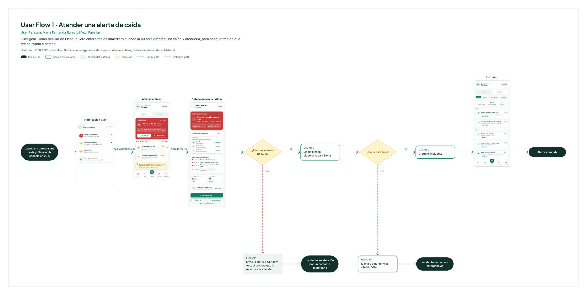

<hr>

La Figura 3.68 presenta el user flow para responder a un SOS (US15, US25), junto con su User Persona y su user goal.

<a id="figura-3-68"></a>**Figura 3.68.** User flow de Emergency & Alerting: Responder a un SOS (US15, US25)

<table>
  <tr>
    <td class="header">User Persona</td>
    <td>Cuidadora (Roxana Paola Diana Ramírez)</td>
    <td class="header">Número</td>
    <td>2 · US15, US25</td>
  </tr>
  <tr>
    <td class="header">User Goal</td>
    <td colspan="3" class="italic bold">
    Como cuidadora de Elena, quiero recibir su pedido de auxilio en cuanto presione el botón SOS de la pulsera, para saber dónde está y actuar sin perder tiempo.
    </td>
  </tr>
  <tr>
    <td class="header">Happy path</td>
    <td colspan="3">
    <ol>
      <li>Elena mantiene presionado el botón SOS de la pulsera por al menos 3 s.</li>
      <li>El sistema muestra la Alerta SOS con la ubicación de Elena.</li>
      <li>¿La cuidadora la reconoce primero? Sí → revisa la ubicación en el mapa y llama a Elena.</li>
      <li>¿Es una emergencia real? Sí → llama al SAMU 106 y acude al lugar.</li>
    </ol>
    </td>
  </tr>
  <tr>
    <td class="header">Unhappy Paths</td>
    <td colspan="3">
    <ol>
      <li>Si Elena presiona el botón menos de 3 s, la pulsera descarta la acción y no se envía la alerta.</li>
      <li>Si otro contacto reconoce la alerta primero, la cuidadora ve quién la atiende y hace el seguimiento desde el detalle.</li>
      <li>Si no es una emergencia real, la cuidadora marca la alerta como falsa alarma y queda registrada como descartada en el Historial.</li>
    </ol>
    </td>
  </tr>
</table>

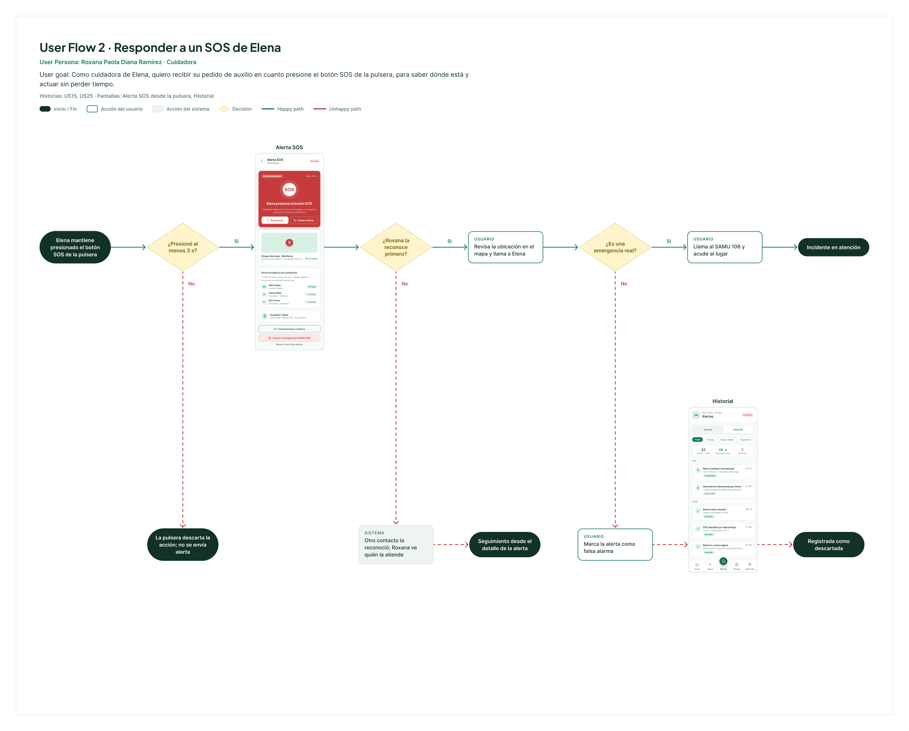

<hr>

La Figura 3.69 presenta el user flow para seguir una alerta de signos vitales (US09, US10), junto con su User Persona y su user goal.

<a id="figura-3-69"></a>**Figura 3.69.** User flow de Emergency & Alerting: Seguir una alerta de signos vitales (US09, US10)

<table>
  <tr>
    <td class="header">User Persona</td>
    <td>Familiar (María Fernanda Rojas Ibáñez)</td>
    <td class="header">Número</td>
    <td>3 · US09, US10</td>
  </tr>
  <tr>
    <td class="header">User Goal</td>
    <td colspan="3" class="italic bold">
    Como familiar de Elena, quiero enterarme cuando sus signos vitales salgan del rango seguro y seguir la alerta hasta que se normalicen, para intervenir solo cuando realmente haga falta.
    </td>
  </tr>
  <tr>
    <td class="header">Happy path</td>
    <td colspan="3">
    <ol>
      <li>Se registran tres lecturas seguidas del ritmo cardíaco fuera de rango y llega la alerta.</li>
      <li>El familiar reconoce la alerta desde Alertas activas y revisa los signos de Elena.</li>
      <li>¿Vuelve al rango seguro por 5 min? Sí → el sistema muestra la alerta como estabilizada.</li>
      <li>El familiar cierra el incidente, que queda registrado en el Historial.</li>
    </ol>
    </td>
  </tr>
  <tr>
    <td class="header">Unhappy Paths</td>
    <td colspan="3">
    <ol>
      <li>Antes de alertar, la pulsera muestra una advertencia preventiva a Elena; si confirma que está bien en 30 s, la alerta se descarta y queda en el Historial.</li>
      <li>Si los signos no vuelven al rango seguro, el familiar llama a Elena o ajusta los umbrales en Configuración de alertas, y la alerta sigue activa hasta normalizarse.</li>
    </ol>
    </td>
  </tr>
</table>

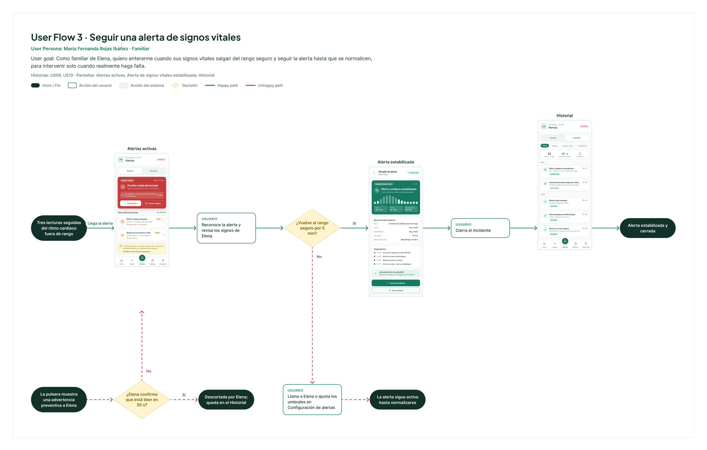

<hr>


#### 3.1.4.5. Mobile Applications Prototyping

El prototipo de la aplicación móvil de Guardian+ se construyó en Figma, en la página *Prototype v2* del archivo *Guardian+ Prototyping*, a partir de los mock-ups de la sección 3.1.4.3. Reúne las 38 pantallas de las cinco secciones de la aplicación (Inicio, Salud, Alertas, Rutinas y Ubicación) y la sección de Perfil, conectadas en un único flujo llamado *Guardian+* que inicia en la pantalla de Inicio. Desde ese punto se puede llegar a todas las pantallas del prototipo y volver desde cada una de ellas, de modo que el recorrido de los User Flow Diagrams de la sección 3.1.4.4 puede reproducirse sin interrupciones.

##### Criterios de interacción

Las conexiones del prototipo siguen el sistema de navegación definido en la sección 3.1.2.5. Los criterios aplicados se presentan en la Tabla 3.25:

<a id="tabla-3-25"></a>**Tabla 3.25.** Criterios de interacción del prototipo

| Tipo de navegación | Decisión en el prototipo | Relación con la arquitectura de información |
|---|---|---|
| **Global** | La barra de navegación inferior está presente en las pantallas principales de cada sección y cada destino abre la pantalla raíz de su sección. El destino de la sección actual no tiene enlace para evitar recargar la misma pantalla. Alertas ocupa la posición central y se destaca con un botón circular. | Corresponde a los cinco destinos permanentes de la bottom navigation bar. Siguiendo la misma regla, la barra se oculta en las pantallas de detalle y en los formularios. |
| **Suplementaria** | El avatar de la barra superior del Inicio abre Perfil, desde donde se accede a Mis datos, Persona bajo cuidado, Círculo de cuidado, Pulsera, Mi plan, Configuración y Cerrar sesión. | Perfil se ubica en la barra superior y no en la inferior, que se limita a cinco destinos. |
| **Local** | Las pestañas *Ahora* e *Historial* de Salud y las pestañas *Activas* e *Historial* de Alertas alternan entre las dos vistas de su sección. En el historial de Salud, los chips Ritmo, Presión, SpO₂, Temp y Respir cambian entre los cinco signos vitales. | Cada sección organiza su contenido en vistas de la misma categoría, según los esquemas de organización de la sección 3.1.2.1. |
| **Contextual** | Las tarjetas y los enlaces del Inicio (*Ver detalle*, *Ver agenda*, *Ver alertas*, signos vitales, próxima toma y última alerta) llevan a la pantalla que amplía esa información. *Ver en mapa* lleva desde el detalle de una alerta a la ubicación en tiempo real. | El Inicio resume el estado de la persona bajo cuidado y cada bloque funciona como acceso directo a su sección. |
| **Retorno** | Las pantallas de detalle y los formularios de Rutinas, Alertas y Ubicación tienen un botón de volver que regresa a la pantalla anterior. Los formularios también regresan al confirmar con *Guardar recordatorio* o *Agendar cita*. | Aplica la regla de retorno predecible: el botón de volver regresa a la pantalla desde la que se abrió la secundaria y no a una pantalla fija. |
| **Hojas modales** | *Buscar y filtrar*, *Exportar expediente* y *Reporte semanal* se abren sobre la pantalla de Salud y se cierran con su acción principal o al tocar fuera de la hoja. | Son tareas puntuales sobre la información de Salud y no cambian de sección. |

Todas las interacciones se activan al tocar (*On tap*). En el Inicio, el contenido se desplaza verticalmente mientras la barra de navegación inferior permanece fija, igual que en la aplicación nativa.

##### Ruta de emergencia

El prototipo reproduce la ruta de emergencia de la sección 3.1.2.5. Como Figma no permite simular una notificación push, la campana del Inicio cumple ese papel y abre la alerta SOS enviada desde la pulsera. Desde Alertas, la tarjeta de la alerta crítica abre su detalle, que muestra el escalamiento a los contactos de emergencia y la ubicación de la persona bajo cuidado. En ambas pantallas, *Ver en mapa* abre la ubicación en tiempo real. Así, el cuidador llega al detalle de la emergencia en uno o dos toques desde la pantalla en la que se encuentre.

##### Flujos cubiertos por el prototipo

La Tabla 3.26 relaciona cada recorrido del prototipo con sus User Stories.

<a id="tabla-3-26"></a>**Tabla 3.26.** Flujos cubiertos por el prototipo

| Sección | Recorrido en el prototipo | User Stories |
|---|---|---|
| Salud | Inicio → Salud · Ahora → Historial del signo vital → cambio entre Ritmo, Presión, SpO₂, Temp y Respir. | US01, US02, US03, US04, US05, US07 |
| Salud | Historial → *Todos los signos vitales* → Buscar y filtrar → *Aplicar*. | US07 |
| Salud | Historial → *Exportar PDF* → Exportar expediente → *Generar y exportar PDF*. | US19 |
| Salud | Historial → *Reporte semanal* → Reporte semanal. | US24 |
| Alertas | Alertas activas → Detalle de alerta crítica → *Ver en mapa*. | US08, US11 |
| Alertas | Inicio → campana → Alerta SOS desde la pulsera → *Ver en mapa*. | US15 |
| Alertas | Alertas → Historial → Alerta de signos vitales estabilizada → *Ver en Salud*. | US09, US10 |
| Rutinas | Rutinas → Medicación → Nueva toma → *Guardar recordatorio*. | US06 |
| Rutinas | Rutinas → Citas médicas → Nueva cita → *Agendar cita*. | US13 |
| Rutinas | Rutinas → Actividad ligera → Nueva actividad. | US14 |
| Rutinas | Rutinas → Hidratación, Sueño e Inactividad. | US26, US17, US27 |
| Ubicación | Inicio → Ubicación → Ubicación en tiempo real. | US18 |
| Perfil | Inicio → Perfil → Mis datos, Persona bajo cuidado, Círculo de cuidado, Pulsera, Mi plan, Configuración (Idioma, Accesibilidad, Términos y condiciones, Acerca de Guardian+) y Cerrar sesión. | — |

Las acciones que dependen de servicios externos, como *Llamar* y *Videollamada*, se muestran en las pantallas pero no tienen conexión en el prototipo, ya que no cuentan con una pantalla propia.

##### Evidencia del prototipo

La Figura 3.70 muestra las conexiones del prototipo en la página *Prototype v2*, agrupadas por sección: Perfil, Inicio (*Dashboard*), Salud (*Monitoreo*), Alertas, Ubicación (*Mobility*) y Rutinas (*Care routines and wellness*).

<a id="figura-3-70"></a>**Figura 3.70.** Conexiones del prototipo de Guardian+

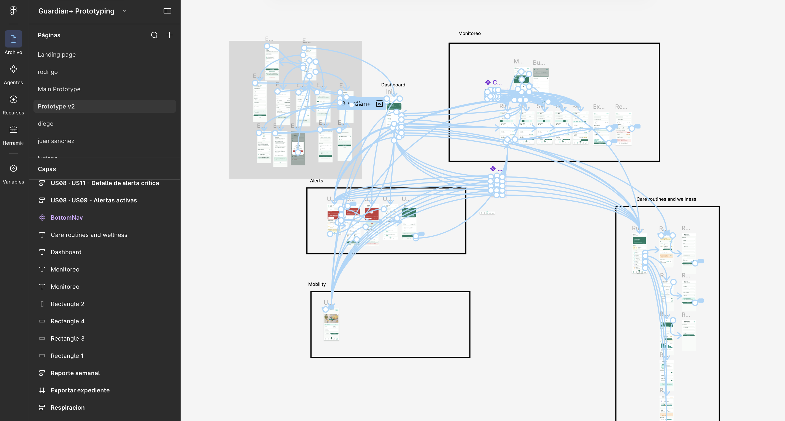

En la Figura 3.71, correspondiente a la sección de Salud, se aprecian las conexiones entre la vista *Ahora*, el historial de cada signo vital y las hojas modales de búsqueda, exportación y reporte semanal.

<a id="figura-3-71"></a>**Figura 3.71.** Conexiones de la sección Salud en el prototipo

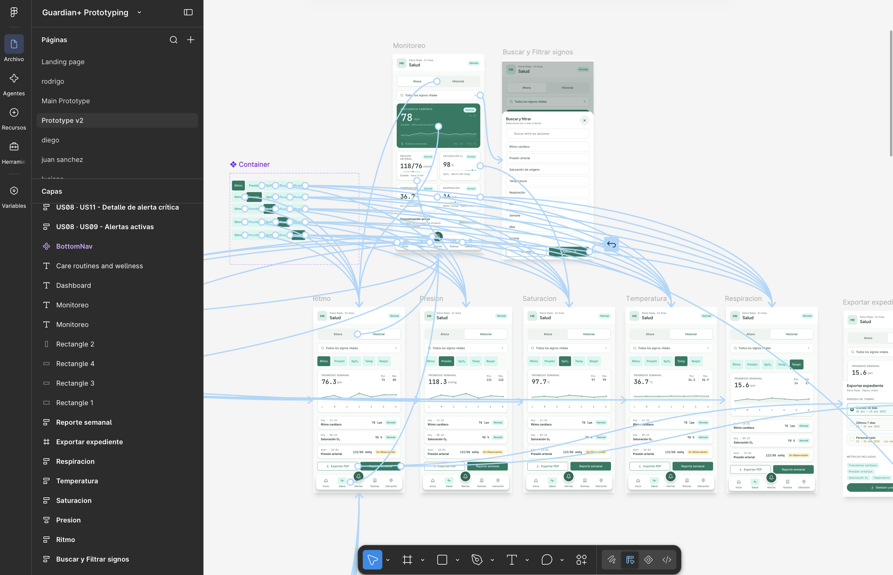

La Figura 3.72 corresponde a la ejecución del prototipo desde la pantalla de Inicio.

<a id="figura-3-72"></a>**Figura 3.72.** Ejecución del prototipo desde la pantalla de Inicio

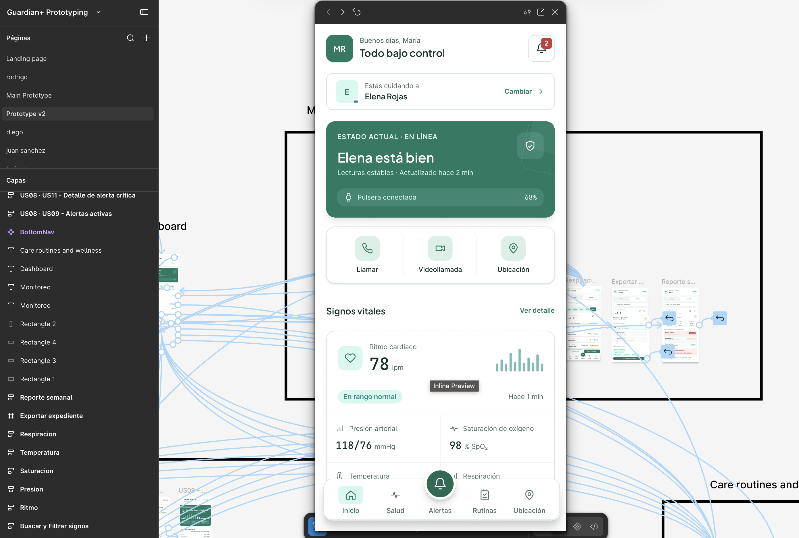

La Tabla 3.27 reúne los enlaces al prototipo en Figma y al video del recorrido.

<a id="tabla-3-27"></a>**Tabla 3.27.** Enlaces al prototipo y al video del recorrido

| Recurso | Enlace |
|---|---|
| Prototipo en Figma | [Guardian+ Prototype](https://www.figma.com/proto/kxCl254LnsEBLOvjC65nD2/Guardian--Prototyping?node-id=436-1532&p=f&t=C4aAPKwd1OEPOhE6-1&scaling=min-zoom&content-scaling=fixed&page-id=436%3A1471&starting-point-node-id=436%3A1532) |
| Video del recorrido | [Guardian+ — Recorrido del prototipo móvil](https://youtu.be/rcKs9-MPEaE) |

<div style="page-break-before: always; break-before: page;"></div>

# Capítulo IV: Product Implementation & Validation

En este capítulo se describe la implementación y la validación de Guardian+: la configuración del entorno de desarrollo, la gestión del código fuente y del despliegue, la ejecución del Sprint 1 con sus evidencias y las entrevistas de validación realizadas con usuarios.

## 4.1. Software Configuration Management

En esta sección se describe cómo el equipo gestiona la configuración del software de Guardian+: las herramientas del entorno de desarrollo, la gestión del código fuente con GitFlow, las convenciones de código y la configuración del despliegue de cada producto.

### 4.1.1. Software Development Environment Configuration

En esta sección se especifican los productos de software que utilizan los integrantes del equipo para colaborar durante el ciclo de vida de Guardian+. Para cada producto se indica su propósito dentro del proyecto, su tipo de uso y la ruta de referencia, en el caso de servicios SaaS, o la ruta de descarga, en el caso de herramientas que se instalan en el computador de cada integrante. Las herramientas se agrupan según la actividad del ciclo de vida en la que se utilizan.

#### Project Management

La Tabla 4.1 presenta las herramientas utilizadas para Project Management.

<a id="tabla-4-1"></a>**Tabla 4.1.** Herramientas de Project Management

| Product | Purpose | Type | Reference / Download URL |
|---|---|---|---|
| **ClickUp** | Gestión del Product Backlog, planificación de Sprints, estimación con Story Points, asignación de tareas y seguimiento de su estado. | SaaS | [Tablero de Guardian+](https://sharing.clickup.com/9013201240/b/h/6-1400350000000524-2/1612e210bce4708) |
| **WhatsApp** | Comunicación diaria del equipo y coordinación rápida de avances y bloqueos. | SaaS / Mobile | [whatsapp.com](https://www.whatsapp.com/download) |
| **Discord** | Reuniones sincrónicas del equipo, revisiones de avance y sesiones de trabajo colaborativo. | SaaS / Desktop | [discord.com](https://discord.com/download) |

#### Requirements Management

La Tabla 4.2 presenta las herramientas utilizadas para Requirements Management.

<a id="tabla-4-2"></a>**Tabla 4.2.** Herramientas de Requirements Management

| Product | Purpose | Type | Reference / Download URL |
|---|---|---|---|
| **ClickUp** | Registro y priorización de User Stories, Technical Stories y Epics dentro del Product Backlog. | SaaS | [clickup.com](https://clickup.com) |
| **UXPressia** | Elaboración de User Personas, Empathy Maps, User Journey Maps e Impact Maps. | SaaS | [uxpressia.com](https://uxpressia.com) |
| **Miro** | Sesiones de EventStorming, Big Picture EventStorming y descubrimiento de Bounded Contexts candidatos. | SaaS | [miro.com](https://miro.com) |

#### Product UX/UI Design

La Tabla 4.3 presenta las herramientas utilizadas para Product UX/UI Design.

<a id="tabla-4-3"></a>**Tabla 4.3.** Herramientas de Product UX/UI Design

| Product | Purpose | Type | Reference / Download URL |
|---|---|---|---|
| **Figma** | Diseño de Style Guidelines, wireframes, mock-ups y prototipos del Landing Page y de la aplicación móvil. | SaaS | [figma.com](https://www.figma.com) |

#### Software Architecture & Modeling

La Tabla 4.4 presenta las herramientas utilizadas para Software Architecture & Modeling.

<a id="tabla-4-4"></a>**Tabla 4.4.** Herramientas de Software Architecture & Modeling

| Product | Purpose | Type | Reference / Download URL |
|---|---|---|---|
| **Structurizr** | Elaboración de los diagramas de arquitectura bajo el C4 Model. | SaaS | [structurizr.com](https://structurizr.com) |
| **Mermaid** | Diagramas como código para diagramas de clases, componentes, Domain Message Flows y mapas de navegación, versionados junto al informe. | Library / SaaS | [mermaid.js.org](https://mermaid.js.org) |
| **Graphviz** | Generación de los diagramas de base de datos a partir de archivos `.dot` versionados en el repositorio del informe. | Desktop | [graphviz.org/download](https://graphviz.org/download/) |

#### Software Development

La Tabla 4.5 presenta las herramientas utilizadas para Software Development.

<a id="tabla-4-5"></a>**Tabla 4.5.** Herramientas de Software Development

| Product | Purpose | Type | Reference / Download URL |
|---|---|---|---|
| **Git** | Control de versiones distribuido para todos los repositorios del proyecto. | Desktop | [git-scm.com/downloads](https://git-scm.com/downloads) |
| **GitHub** | Alojamiento de repositorios, revisión de cambios mediante Pull Requests e integración de ramas bajo GitFlow. | SaaS | [Organización Healthify](https://github.com/upc-pre-202620-1asi0238-13980-Healthify) |
| **Visual Studio Code** | Editor de código para el desarrollo del Landing Page y la edición del informe en Markdown. | Desktop | [code.visualstudio.com/download](https://code.visualstudio.com/download) |
| **Node.js y npm** | Entorno de ejecución y gestor de paquetes para instalar dependencias, ejecutar y compilar el Landing Page. | Desktop | [nodejs.org/en/download](https://nodejs.org/en/download) |
| **IntelliJ IDEA** | IDE para el desarrollo de los RESTful Web Services en Java con Spring Boot. | Desktop | [jetbrains.com/idea/download](https://www.jetbrains.com/idea/download/) |
| **Java Development Kit (JDK)** | Compilación y ejecución de los Web Services. | Desktop | [oracle.com/java/technologies/downloads](https://www.oracle.com/java/technologies/downloads/) |
| **Apache Maven** | Gestión de dependencias y construcción del proyecto de Web Services mediante Maven Wrapper. | Desktop | [maven.apache.org/download.cgi](https://maven.apache.org/download.cgi) |
| **PostgreSQL** | Base de datos relacional utilizada por los Web Services durante el desarrollo local. | Desktop | [postgresql.org/download](https://www.postgresql.org/download/) |
| **Docker Desktop** | Construcción y ejecución local de la imagen de contenedor de los Web Services antes de su despliegue. | Desktop | [docker.com/products/docker-desktop](https://www.docker.com/products/docker-desktop/) |
| **Android Studio** | IDE para el desarrollo de la aplicación móvil nativa en Kotlin, incluyendo Android SDK y Android Emulator. | Desktop | [developer.android.com/studio](https://developer.android.com/studio) |
| **Python** | Lenguaje de implementación y ejecución del IoT Simulator. | Desktop | [python.org/downloads](https://www.python.org/downloads/) |
| **Google Cloud (Compute Engine)** | Despliegue del IoT Simulator y del broker MQTT en una máquina virtual con IP pública fija. | SaaS | [cloud.google.com/compute](https://cloud.google.com/compute) |
| **Terraform** | Infraestructura como código: aprovisiona la máquina virtual, la IP fija, el firewall y la cuenta de servicio del IoT Simulator. | CLI | [developer.hashicorp.com/terraform/install](https://developer.hashicorp.com/terraform/install) |
| **Google Cloud Shell** | Terminal en el navegador desde la que se ejecuta Terraform sin instalar herramientas locales. | SaaS | [cloud.google.com/shell](https://cloud.google.com/shell) |
| **Eclipse Mosquitto** | Broker MQTT al que el IoT Simulator publica la telemetría y al que se suscribe el backend. | Library | [mosquitto.org](https://mosquitto.org) |

#### Software Testing

La Tabla 4.6 presenta las herramientas utilizadas para Software Testing.

<a id="tabla-4-6"></a>**Tabla 4.6.** Herramientas de Software Testing

| Product | Purpose | Type | Reference / Download URL |
|---|---|---|---|
| **JUnit 5 y Mockito** | Pruebas unitarias y de integración de los Web Services, incluidas en los starters de prueba de Spring Boot. | Library | [junit.org/junit5](https://junit.org/junit5/) |
| **Cucumber** | Ejecución de los escenarios de aceptación escritos en Gherkin a partir de los criterios de aceptación de las User Stories. | Library | [cucumber.io](https://cucumber.io) |
| **Swagger UI** | Prueba manual de los endpoints expuestos por los Web Services a partir de su especificación OpenAPI. | Library | [swagger.io/tools/swagger-ui](https://swagger.io/tools/swagger-ui/) |
| **JUnit, Espresso y Compose UI Test** | Pruebas unitarias e instrumentadas de la aplicación móvil. | Library | [developer.android.com/training/testing](https://developer.android.com/training/testing) |
| **Jest y React Testing Library** | Pruebas de los componentes del Landing Page. | Library | [jestjs.io](https://jestjs.io) |
| **Lighthouse** | Evaluación de accesibilidad, rendimiento y buenas prácticas SEO del Landing Page. | Browser tool | [developer.chrome.com/docs/lighthouse](https://developer.chrome.com/docs/lighthouse/overview/) |

#### Software Deployment

La Tabla 4.7 presenta las herramientas utilizadas para Software Deployment.

<a id="tabla-4-7"></a>**Tabla 4.7.** Herramientas de Software Deployment

| Product | Purpose | Type | Reference / Download URL |
|---|---|---|---|
| **Cloudflare Pages** | Publicación del Landing Page con despliegue automático desde la rama `main` de su repositorio. | SaaS | [pages.cloudflare.com](https://pages.cloudflare.com) |
| **Microsoft Azure** | Máquina virtual que ejecuta los Web Services como contenedor Docker y servicio gestionado Azure Database for PostgreSQL para su base de datos. | Cloud provider | [azure.microsoft.com](https://azure.microsoft.com) |
| **GitHub Actions** | Integración continua de los Web Services y despliegue automático en la máquina virtual de Azure ante cada integración en `develop`. | SaaS | [github.com/features/actions](https://github.com/features/actions) |
| **GitHub Container Registry** | Almacenamiento de las imágenes Docker de los Web Services que se despliegan en Azure. | SaaS | [ghcr.io](https://github.com/features/packages) |
| **Caddy** | Proxy inverso que publica los Web Services por HTTPS y gestiona automáticamente su certificado TLS. | Server | [caddyserver.com](https://caddyserver.com) |
| **Firebase App Distribution** | Distribución de las versiones de prueba de la aplicación móvil a los testers y usuarios de validación. | SaaS | [firebase.google.com/products/app-distribution](https://firebase.google.com/products/app-distribution) |

#### Software Documentation

La Tabla 4.8 presenta las herramientas utilizadas para Software Documentation.

<a id="tabla-4-8"></a>**Tabla 4.8.** Herramientas de Software Documentation

| Product | Purpose | Type | Reference / Download URL |
|---|---|---|---|
| **GitHub y Markdown** | Elaboración colaborativa y versionamiento del informe del proyecto. | SaaS | [guardian-plus-report](https://github.com/upc-pre-202620-1asi0238-13980-Healthify/guardian-plus-report) |
| **OpenAPI Specification vía Swagger** | Documentación de los endpoints de los Web Services, generada con springdoc-openapi. | Library | [springdoc.org](https://springdoc.org) |

#### Technology Stack

Las versiones de lenguajes y frameworks corresponden a las configuradas actualmente en los repositorios de cada producto. La Tabla 4.9 presenta el stack tecnológico de cada producto.

<a id="tabla-4-9"></a>**Tabla 4.9.** Technology Stack de Guardian+

| Product | Technology | Version |
|---|---|---|
| **Landing Page** | React | 19.3 |
| | React Scripts | 5.0.1 |
| **Web Services** | Java | 27 |
| | Spring Boot | 4.1.1 |
| | springdoc-openapi | 3.1.0 |
| | PostgreSQL | Driver JDBC gestionado por Spring Boot |
| **Mobile Application** | Kotlin | 2.2.10 |
| | Android Gradle Plugin | 9.4.1 |
| | Jetpack Compose BOM | 2026.02.01 |
| | Material Design 3 | Gestionado por Compose BOM |
| | Android SDK | `compileSdk` y `targetSdk` 37, `minSdk` 24 |
| **IoT Simulator** | Python | 3.14 (imagen Docker); Python 3 de Debian 12 en la VM |
| | Flask | 3.1.0 |
| | paho-mqtt | 2.1.0 |
| | requests | 2.32.3 |
| | Eclipse Mosquitto | Paquete de Debian 12 |

### 4.1.2. Source Code Management

El equipo utiliza Git como sistema de control de versiones distribuido y GitHub como plataforma para almacenar y administrar los repositorios de los productos que conforman Guardian+. Esta organización permite mantener trazabilidad sobre los cambios realizados, separar el trabajo de cada integrante y revisar las modificaciones mediante Pull Requests antes de integrarlas a las ramas principales.

Los repositorios utilizados por Guardian+ se presentan en la Tabla 4.10:

<a id="tabla-4-10"></a>**Tabla 4.10.** Repositorios de Guardian+

| Product / Artifact | Repository | Purpose |
|---|---|---|
| Project Report | [guardian-plus-report](https://github.com/upc-pre-202620-1asi0238-13980-Healthify/guardian-plus-report) | Documentación colaborativa del proyecto elaborada en Markdown. |
| Landing Page | [guardian-plus-website](https://github.com/upc-pre-202620-1asi0238-13980-Healthify/guardian-plus-website) | Código fuente correspondiente al sitio web público de Guardian+. |
| Web Services | [guardian-plus-platform](https://github.com/upc-pre-202620-1asi0238-13980-Healthify/guardian-plus-platform) | Backend y RESTful Web Services que soportan los procesos de negocio de Guardian+. |
| Mobile Application | [guardian-plus-mobile-app](https://github.com/upc-pre-202620-1asi0238-13980-Healthify/guardian-plus-mobile-app) | Aplicación móvil Android desarrollada para familiares y cuidadores. |
| IoT Simulator | [guardian-plus-iot-simulator](https://github.com/upc-pre-202620-1asi0238-13980-Healthify/guardian-plus-iot-simulator) | Simulación de los datos y eventos generados por el dispositivo wearable durante el desarrollo y las pruebas. |

En la iteración actual no se mantiene una Web Application operativa independiente. La experiencia web pública corresponde a la Landing Page, mientras que las principales funcionalidades operativas son proporcionadas mediante la aplicación móvil y los Web Services.

#### 4.1.2.1. GitFlow & Branching Strategy

Guardian+ adopta GitFlow como estrategia de organización de ramas para mantener separado el código estable, el trabajo de integración y el desarrollo de nuevas funcionalidades. Los cambios se desarrollan en ramas independientes y se integran mediante Pull Requests, evitando realizar modificaciones directas sobre las ramas principales.

Las ramas consideradas en el workflow se presentan en la Tabla 4.11:

<a id="tabla-4-11"></a>**Tabla 4.11.** Ramas del workflow GitFlow

| Branch | Purpose | Origin | Destination |
|---|---|---|---|
| `main` | Contiene las versiones estables del producto y representa el estado preparado para una release. | — | — |
| `develop` | Rama de integración que concentra los cambios aprobados durante el desarrollo de cada Sprint. | `main` | `main` mediante una release |
| `feat/*` | Rama temporal utilizada para desarrollar una nueva funcionalidad, artefacto o capacidad de forma aislada. | `develop` | `develop` |
| `release/*` | Rama temporal utilizada para estabilizar una versión antes de integrarla a producción. Solo admite correcciones necesarias para completar la release. | `develop` | `main` y `develop` |
| `hotfix/*` | Rama temporal destinada a corregir errores críticos detectados sobre una versión estable. | `main` | `main` y `develop` |
| `fix/*` | Rama complementaria utilizada para correcciones identificadas durante el desarrollo antes de una release. | `develop` | `develop` |

##### Branch Naming Conventions

Los nombres de las ramas se escriben en inglés, utilizando minúsculas y palabras separadas mediante guiones. El nombre debe indicar claramente el propósito del cambio. La Tabla 4.12 resume estas convenciones.

<a id="tabla-4-12"></a>**Tabla 4.12.** Convenciones de nombres de ramas

| Branch Type | Convention | Example |
|---|---|---|
| Feature | `feat/<scope>-<short-description>` | `feat/profile-settings` |
| Development Fix | `fix/<scope>-<short-description>` | `fix/subscriptions-entitlement-alignment` |
| Release | `release/v<major>.<minor>.<patch>` | `release/v1.0.0` |
| Hotfix | `hotfix/v<major>.<minor>.<patch>-<short-description>` | `hotfix/v1.0.1-login-error` |

Una nueva funcionalidad comienza desde `develop`. Una vez finalizada y revisada, se crea un Pull Request hacia `develop`. De esta manera, los cambios permanecen aislados hasta que sean aprobados e incorporados a la rama de integración.

El flujo utilizado para una funcionalidad es:

`develop` → `feat/*` → Pull Request → `develop`

Cuando el conjunto de funcionalidades correspondiente a una versión se encuentra preparado para estabilización, se crea una rama `release/*` desde `develop`. Las correcciones realizadas durante esta etapa permanecen limitadas a los ajustes necesarios para completar la versión. Finalmente, la rama se integra tanto a `main` como a `develop`.

El flujo de una release es:

`develop` → `release/vX.Y.Z` → `main` + `develop`

Si se detecta un error crítico en una versión que ya se encuentra en `main`, se crea una rama `hotfix/*` directamente desde `main`. Una vez solucionado el problema, el cambio se integra nuevamente tanto a `main` como a `develop` para evitar diferencias entre la versión estable y la versión en desarrollo.

El flujo de un hotfix es:

`main` → `hotfix/vX.Y.Z-description` → `main` + `develop`

##### Pull Request Strategy

Las ramas `main` y `develop` se utilizan como ramas de integración y no como espacios de desarrollo directo. Las funcionalidades y correcciones se implementan en ramas independientes y posteriormente se integran mediante Pull Requests.

Antes de aceptar un Pull Request se verifica que:

- el cambio corresponda al propósito definido para la rama;
- no se incluyan modificaciones ajenas al alcance del Pull Request;
- no existan conflictos pendientes;
- la documentación o código modificado mantenga consistencia con el proyecto;
- los commits sigan la convención definida por el equipo.

##### Conventional Commits

Los mensajes de commit siguen Conventional Commits con el objetivo de comunicar claramente la naturaleza de cada modificación y mantener un historial legible.

La estructura utilizada es:

`<type>(<scope>): <description>`

Los tipos principales adoptados por el equipo se presentan en la Tabla 4.13:

<a id="tabla-4-13"></a>**Tabla 4.13.** Tipos de Conventional Commits

| Type | Usage |
|---|---|
| `feat` | Incorporación de una nueva funcionalidad o capacidad. |
| `fix` | Corrección de un error. |
| `docs` | Modificaciones relacionadas exclusivamente con documentación. |
| `test` | Creación o modificación de pruebas. |
| `refactor` | Reestructuración interna sin modificar el comportamiento funcional esperado. |
| `chore` | Tareas de mantenimiento que no modifican directamente la funcionalidad del producto. |
| `build` | Cambios relacionados con dependencias o configuración del proceso de construcción. |
| `ci` | Cambios relacionados con procesos de integración o despliegue continuo. |

Ejemplos aplicados al proyecto:

`feat(profile): add care relationship management`

`fix(subscriptions): correct entitlement synchronization`

`docs(chapterIV): document gitflow strategy`

`test(alerting): add incident service unit tests`

El `scope` identifica el componente, bounded context o sección afectada y la descripción se redacta de manera breve y específica.

##### Semantic Versioning

Guardian+ adopta Semantic Versioning para identificar las releases mediante la estructura:

`MAJOR.MINOR.PATCH`

Cada componente representa:

- **MAJOR:** se incrementa cuando una versión introduce cambios incompatibles con la versión anterior.
- **MINOR:** se incrementa cuando se añaden funcionalidades manteniendo compatibilidad con la versión anterior.
- **PATCH:** se incrementa cuando se incorporan correcciones compatibles con la versión existente.

Las versiones se representan mediante tags con el prefijo `v`.

Ejemplos:

`v1.0.0` — primera versión estable.

`v1.1.0` — incorporación de nuevas funcionalidades compatibles.

`v1.1.1` — corrección de un error sin introducir cambios incompatibles.

Las ramas de release utilizan la versión que se está preparando, por ejemplo `release/v1.0.0`. Una vez integrada la release en `main`, se crea el tag correspondiente para identificar de manera inequívoca el estado del código asociado a dicha versión.

### 4.1.3. Source Code Style Guide & Conventions

Guardian+ establece convenciones de código comunes para mantener consistencia, legibilidad y mantenibilidad entre los diferentes productos que forman parte de la solución. Las reglas se aplican de acuerdo con las tecnologías utilizadas actualmente en los repositorios del proyecto y toman como referencia las convenciones oficiales o ampliamente adoptadas para cada lenguaje y framework.

Todos los nombres utilizados en el código fuente, incluyendo clases, métodos, variables, componentes, archivos, paquetes y escenarios de pruebas, se redactan en inglés.

Las convenciones documentadas en esta sección corresponden únicamente a las tecnologías que forman parte de la implementación actual de Guardian+. La Tabla 4.14 presenta las tecnologías consideradas.

<a id="tabla-4-14"></a>**Tabla 4.14.** Lenguajes y tecnologías por producto

| Product | Language / Technology | Application in Guardian+ |
|---|---|---|
| Landing Page | HTML5, CSS3, JavaScript | Estructura, presentación y comportamiento de la experiencia web pública. |
| Web Services | Java, Spring Boot | Implementación de los RESTful Web Services y lógica correspondiente a los Bounded Contexts. |
| Mobile Application | Kotlin, Android | Implementación de la aplicación móvil nativa de Guardian+. |
| IoT Simulator | Python | Simulación y procesamiento de datos y eventos asociados al dispositivo wearable. |
| Automated Acceptance Tests | Gherkin | Especificación de escenarios BDD relacionados con User Stories y criterios de aceptación. |

#### General Coding Conventions

Independientemente del lenguaje utilizado, el equipo adopta las siguientes convenciones generales:

- Los identificadores y nombres de elementos de código se escriben en inglés.
- Los nombres deben expresar claramente la responsabilidad del elemento y evitar abreviaturas ambiguas.
- Se mantiene una única responsabilidad por clase, función o componente siempre que sea posible.
- Se evita duplicar lógica y se reutilizan funciones, componentes o servicios cuando representan el mismo comportamiento.
- Los comentarios se utilizan para explicar decisiones o comportamientos que no sean evidentes a partir del propio código, evitando comentarios redundantes.
- No se mantiene código comentado dentro del repositorio. El historial de Git se utiliza para recuperar implementaciones anteriores.
- Las credenciales, API keys, tokens y otros datos sensibles no deben almacenarse directamente en el código fuente.
- Los archivos y directorios deben organizarse de acuerdo con el módulo, funcionalidad o Bounded Context al que pertenecen.
- El código debe mantener la separación de responsabilidades definida por la arquitectura de cada producto.
- Antes de integrar cambios mediante Pull Request, el código debe compilar o ejecutarse correctamente y las pruebas relacionadas con la funcionalidad modificada deben completarse satisfactoriamente.

#### HTML Coding Conventions

Para los documentos HTML utilizados en la Landing Page se adoptan las siguientes reglas:

- Se utiliza HTML5 y elementos semánticos siempre que correspondan, como `header`, `nav`, `main`, `section`, `article` y `footer`.
- Los nombres de elementos y atributos se escriben en minúsculas.
- Los valores de los atributos se delimitan mediante comillas dobles.
- La estructura del documento mantiene una indentación consistente de dos espacios.
- Las imágenes informativas incluyen el atributo `alt` con una descripción significativa.
- Los elementos interactivos utilizan etiquetas apropiadas para su función.
- Se utilizan atributos ARIA cuando sean necesarios para complementar la accesibilidad.
- Los identificadores y nombres de clases se redactan en inglés.
- Se evita agregar estilos directamente mediante el atributo `style`, manteniendo la presentación en los archivos CSS correspondientes.
- Se mantiene una estructura jerárquica clara de encabezados y secciones.

Ejemplo:

```html
<section class="subscription-plans" aria-labelledby="plans-title">
  <h2 id="plans-title">Subscription Plans</h2>

  <article class="subscription-card">
    <h3>Premium Plan</h3>
    <button type="button">View details</button>
  </article>
</section>
```

#### CSS Coding Conventions

Las hojas de estilo de Guardian+ siguen las siguientes convenciones:

- Los selectores de clase utilizan `kebab-case`.
- Los nombres describen el elemento o propósito visual y se redactan en inglés.
- Cada declaración CSS se coloca en una línea independiente.
- Se utiliza una indentación de dos espacios.
- Se prioriza el uso de clases frente a selectores excesivamente específicos.
- Se evita el uso de `!important`, excepto cuando exista una justificación técnica.
- Los valores reutilizables, como colores, dimensiones o espaciados, se centralizan mediante variables CSS cuando corresponda.
- Los estilos deben respetar los colores, tipografía, spacing y demás decisiones establecidas en los Style Guidelines de Guardian+.
- Los estilos responsive utilizan breakpoints consistentes y evitan la duplicación innecesaria de reglas.
- Se evita utilizar identificadores como selectores exclusivamente para aplicar estilos.

Ejemplo:

```css
.subscription-card {
  display: flex;
  flex-direction: column;
  gap: 1rem;
  padding: 1.5rem;
}

.subscription-card__title {
  font-weight: 600;
}
```

#### JavaScript Coding Conventions

JavaScript se utiliza para implementar el comportamiento e interacción de la Landing Page.

Se aplican las siguientes convenciones:

- Las variables y funciones utilizan `camelCase`.
- Las clases utilizan `PascalCase`.
- Las constantes globales utilizan `UPPER_SNAKE_CASE`.
- Los nombres se redactan en inglés y deben expresar claramente su propósito.
- Se utiliza `const` por defecto cuando una referencia no requiere reasignación.
- Se utiliza `let` únicamente cuando el valor necesita ser reasignado.
- Se evita utilizar `var`.
- Se utiliza comparación estricta mediante `===` y `!==`.
- Las funciones se mantienen pequeñas y enfocadas en una única responsabilidad.
- Se evita modificar innecesariamente el estado global.
- Las operaciones relacionadas con el DOM se mantienen separadas de la lógica que pueda reutilizarse.
- Los eventos se gestionan mediante `addEventListener`.
- Se verifica la existencia de los elementos del DOM antes de operar con ellos cuando corresponda.
- Se evita duplicar selectores, valores o lógica cuando pueden almacenarse en una variable o función reutilizable.

Ejemplo:

```javascript
const planButtons = document.querySelectorAll(".subscription-card__button");

function handlePlanSelection(event) {
  const selectedPlan = event.currentTarget.dataset.plan;

  if (!selectedPlan) {
    return;
  }

  console.log(`Selected plan: ${selectedPlan}`);
}

planButtons.forEach((button) => {
  button.addEventListener("click", handlePlanSelection);
});
```

#### Java and Spring Boot Coding Conventions

Los Web Services de Guardian+ se implementan mediante Java y Spring Boot.

Las convenciones utilizadas son:

- Las clases, interfaces, enumeraciones y records utilizan `PascalCase`.
- Los métodos, variables y atributos utilizan `camelCase`.
- Las constantes utilizan `UPPER_SNAKE_CASE`.
- Los packages utilizan únicamente minúsculas.
- Las clases se organizan de acuerdo con el Bounded Context y la capa arquitectónica correspondiente.
- Los Controllers se mantienen enfocados en recibir solicitudes y delegar el procesamiento hacia la Application Layer.
- Las reglas de negocio permanecen en la Domain Layer y no se implementan directamente en Controllers o componentes de infraestructura.
- Los Commands, Queries y Events representan acciones o hechos relevantes del dominio mediante nombres explícitos.
- Los Handlers coordinan los casos de uso definidos en la Application Layer.
- Las interfaces Repository pertenecientes al modelo se mantienen separadas de sus implementaciones tecnológicas.
- Las implementaciones de persistencia, integración con servicios externos y otros detalles técnicos se mantienen en Infrastructure.
- Las dependencias se proporcionan mediante inyección por constructor.
- Las estructuras utilizadas para solicitudes y respuestas REST se mantienen separadas del modelo de dominio cuando corresponda.
- Las excepciones representan condiciones significativas y no se utilizan como mecanismo habitual de control de flujo.

La organización del código mantiene la separación establecida durante el Tactical-Level Domain-Driven Design:

```text
com.guardianplus.platform.<boundedcontext>
├── domain
├── application
├── interfaces
└── infrastructure
```

Ejemplo:

```java
public final class ActivateSubscriptionHandler {

    private final SubscriptionRepository subscriptionRepository;

    public ActivateSubscriptionHandler(
            SubscriptionRepository subscriptionRepository) {
        this.subscriptionRepository = subscriptionRepository;
    }

    public void handle(ActivateSubscriptionCommand command) {
        Subscription subscription =
                subscriptionRepository.findById(command.subscriptionId());

        subscription.activate();

        subscriptionRepository.save(subscription);
    }
}
```

#### Kotlin and Android Coding Conventions

La aplicación móvil nativa de Guardian+ utiliza Kotlin para Android.

Las convenciones principales son:

- Las clases, interfaces, objects y enumeraciones utilizan `PascalCase`.
- Las variables, propiedades, funciones y métodos utilizan `camelCase`.
- Las constantes utilizan `UPPER_SNAKE_CASE`.
- Los packages utilizan nombres en minúsculas.
- Se utiliza `val` en lugar de `var` siempre que un valor no requiera modificación.
- Se aprovechan las características de null safety proporcionadas por Kotlin y se evita utilizar valores nullable cuando no son necesarios.
- Los nombres de archivos corresponden al principal elemento declarado en ellos.
- La lógica de presentación se mantiene separada de las operaciones de red, persistencia y reglas de negocio.
- Los estados de UI se modelan mediante estructuras explícitas y se favorece la inmutabilidad.
- Los textos visibles por el usuario se mantienen en recursos para facilitar su mantenimiento e internacionalización.
- Los colores, tipografías y estilos reutilizables utilizan los recursos o temas definidos para la aplicación.
- Las funciones se mantienen pequeñas y orientadas a una responsabilidad específica.
- Se evita utilizar valores literales repetidos cuando pueden representarse mediante constantes o recursos.

Ejemplo:

```kotlin
data class ProfileUiState(
    val isLoading: Boolean = false,
    val displayName: String = "",
    val errorMessage: String? = null
)

class ProfileViewModel {
    fun updateProfile(profileId: String) {
        // Application interaction
    }
}
```

#### Python Coding Conventions

El IoT Simulator de Guardian+ utiliza Python para representar el comportamiento y los eventos generados por el dispositivo wearable, siguiendo como referencia la guía PEP 8.

Se aplican las siguientes convenciones:

- Las clases utilizan `PascalCase`.
- Las funciones, métodos, variables y módulos utilizan `snake_case`.
- Las constantes utilizan `UPPER_SNAKE_CASE`.
- Los elementos de uso interno de una clase o módulo se identifican con un guion bajo inicial.
- Los identificadores se redactan en inglés y describen claramente su responsabilidad.
- Las funciones y métodos públicos declaran los tipos de sus parámetros y de su retorno mediante type hints.
- La indentación es de cuatro espacios.
- Los valores literales repetidos, como umbrales clínicos o canales, se representan mediante constantes con nombres significativos.
- Los datos recibidos del backend se validan antes de ser procesados, y los datos simulados se mantienen coherentes en el tiempo mediante el estado de cada dispositivo.
- La lógica que genera las señales se mantiene separada de la lógica que las publica y de la que expone la API HTTP.
- La configuración se obtiene de variables de entorno o de argumentos de línea de comandos, sin valores sensibles en el código.
- Los recursos externos, como la conexión al broker, se gestionan para que la ausencia del broker o del backend no detenga la ejecución del simulador.

Ejemplo:

~~~python
BATTERY_LOW_THRESHOLD = 20
BATTERY_CRITICAL_THRESHOLD = 5


def classify_battery(level: float) -> str:
    if level <= BATTERY_CRITICAL_THRESHOLD:
        return "BATTERY_CRITICAL"
    if level <= BATTERY_LOW_THRESHOLD:
        return "BATTERY_LOW"
    return "OK"
~~~

#### Gherkin and BDD Feature File Conventions

Los Acceptance Tests implementados bajo el enfoque Behavior-Driven Development utilizan archivos `.feature` escritos mediante Gherkin. Estos escenarios mantienen trazabilidad con las User Stories y Acceptance Criteria definidos para Guardian+.

Se adoptan las siguientes convenciones:

- Cada archivo `.feature` representa una funcionalidad o comportamiento claramente delimitado.
- Los nombres de los archivos utilizan `kebab-case`, por ejemplo `emergency-alert.feature`.
- Los escenarios se redactan en inglés.
- Las palabras clave `Feature`, `Scenario`, `Given`, `When`, `Then`, `And` y `But` se utilizan de acuerdo con su propósito.
- `Given` establece las precondiciones necesarias para ejecutar el escenario.
- `When` representa la acción o evento que desencadena el comportamiento.
- `Then` expresa el resultado observable esperado.
- `And` y `But` complementan pasos sin modificar su propósito semántico.
- Los escenarios describen comportamiento observable y evitan detalles internos de implementación.
- Cada escenario se enfoca en validar un comportamiento específico.
- Los escenarios pueden identificarse mediante tags relacionados con la User Story correspondiente.
- Cuando una misma situación requiere validarse con diferentes conjuntos de datos se utiliza `Scenario Outline` junto con `Examples`.
- Los nombres de los escenarios deben expresar claramente el comportamiento que se está validando.

Ejemplo:

```gherkin
@US08
Feature: Emergency alert after fall detection

  Scenario: Generate an emergency alert after a confirmed fall
    Given a care recipient has an active care relationship
    And the wearable device is connected
    When a fall is confirmed
    Then an emergency alert should be created
    And the registered care circle should be notified
```

Los Step Definitions asociados a los archivos `.feature` se implementan utilizando el lenguaje correspondiente al proyecto de testing y contienen únicamente el código necesario para ejecutar los pasos definidos, sin duplicar reglas de negocio que pertenezcan a la solución.

#### Naming Conventions Summary

La Tabla 4.15 resume las convenciones de nombres de todos los productos.

<a id="tabla-4-15"></a>**Tabla 4.15.** Resumen de convenciones de nombres

| Element | Convention | Example |
|---|---|---|
| Java / Kotlin class | `PascalCase` | `CareRelationship` |
| Python class | `PascalCase` | `MqttPublisher` |
| Method / Function | `camelCase` | `activateSubscription()` |
| Variable / Property | `camelCase` | `currentPeriodEnd` |
| Constant | `UPPER_SNAKE_CASE` | `MAX_RETRY_ATTEMPTS` |
| Java / Kotlin package | lowercase | `com.guardianplus.platform.profile` |
| JavaScript file | `kebab-case` | `subscription-plans.js` |
| CSS class | `kebab-case` | `subscription-card` |
| Gherkin file | `kebab-case.feature` | `emergency-alert.feature` |
| REST resource | plural lowercase noun | `/subscriptions` |

Estas convenciones permiten mantener un criterio común entre los diferentes productos de Guardian+, facilitar las revisiones de código y conservar la separación arquitectónica definida durante el diseño e implementación de la solución.

### 4.1.4. Software Deployment Configuration

En esta sección se especifica la configuración de despliegue de cada producto digital de Guardian+, incluyendo los pasos necesarios para que, a partir de su repositorio de código fuente, se logre su publicación satisfactoria. El despliegue se integra con la estrategia de GitFlow definida en la sección 4.1.2: el Landing Page se publica en producción a partir de la rama `main`, mientras que los Web Services se despliegan automáticamente ante cada integración en `develop`, de modo que el equipo valida cada incremento integrado sobre el entorno publicado. El desarrollo de nuevas funcionalidades se realiza en las ramas `feat/*`. Las credenciales y cadenas de conexión se configuran como variables de entorno en cada plataforma y no se almacenan en los repositorios.

#### Deployment Overview

La Tabla 4.16 resume el despliegue de cada producto.

<a id="tabla-4-16"></a>**Tabla 4.16.** Deployment Overview de Guardian+

| Product | Repository | Platform | Deployment Trigger | Public Access |
|---|---|---|---|---|
| **Landing Page** | [guardian-plus-website](https://github.com/upc-pre-202620-1asi0238-13980-Healthify/guardian-plus-website) | Cloudflare Pages | Integración de cambios en `main` | [guardian-plus.pages.dev](https://guardian-plus.pages.dev) |
| **Web Services** | [guardian-plus-platform](https://github.com/upc-pre-202620-1asi0238-13980-Healthify/guardian-plus-platform) | Microsoft Azure: máquina virtual con Docker Compose y Caddy, y Azure Database for PostgreSQL | GitHub Actions ante cada integración en `develop` | [Swagger UI](https://guardian-plus-api.chilecentral.cloudapp.azure.com/swagger-ui/index.html) |
| **Mobile Application** | [guardian-plus-mobile-app](https://github.com/upc-pre-202620-1asi0238-13980-Healthify/guardian-plus-mobile-app) | Firebase App Distribution | Publicación de una release versionada con Semantic Versioning, por ejemplo `v1.0.0` | Invitación por correo a los testers registrados |
| **IoT Simulator** | [guardian-plus-iot-simulator](https://github.com/upc-pre-202620-1asi0238-13980-Healthify/guardian-plus-iot-simulator) | Google Cloud Compute Engine (VM Debian 12 aprovisionada con Terraform) | Manual: `terraform apply` sobre el código de la rama `main`, que la VM clona al arrancar | API de monitoreo en `http://34.45.141.10:5000` y broker MQTT en `34.45.141.10:1883` (WebSocket en `9001`), con acceso restringido por firewall a las IP autorizadas |

#### Deployment Environments

La Tabla 4.17 presenta los entornos de despliegue de cada producto.

<a id="tabla-4-17"></a>**Tabla 4.17.** Entornos de despliegue

| Environment | Branch | Landing Page | Web Services | Mobile Application | IoT Simulator |
|---|---|---|---|---|---|
| **Local** | `feat/*`, `develop` | `npm start` en `localhost:3000` | `./mvnw spring-boot:run` con PostgreSQL local | Android Emulator desde Android Studio | `python simulator/cli.py serve` con un broker Mosquitto local |
| **Preview** | Pull Request | Preview Deployment generado automáticamente por Cloudflare Pages | — | — | — |
| **Production** | `main` (Web Services: `develop`) | Cloudflare Pages Production | Máquina virtual de Azure y Azure Database for PostgreSQL | Firebase App Distribution | Máquina virtual en Google Compute Engine |

#### Landing Page Deployment

La Tabla 4.18 presenta los pasos del despliegue del Landing Page.

<a id="tabla-4-18"></a>**Tabla 4.18.** Pasos del despliegue del Landing Page

| Step | Action |
|---|---|
| **1** | Verificar que `node_modules/` y `build/` estén incluidos en `.gitignore` y que `npm run build` se ejecute sin errores. |
| **2** | Iniciar sesión en Cloudflare, ingresar a *Workers & Pages* y seleccionar *Create → Pages → Connect to Git*. |
| **3** | Autorizar la aplicación de Cloudflare en la organización de GitHub del equipo e importar el repositorio `guardian-plus-website`. |
| **4** | Configurar el proyecto: *Project name* `guardian-plus`, *Production branch* `main`, *Framework preset* `Create React App`, *Build command* `npm run build` y *Build output directory* `build`. |
| **5** | Registrar la variable de entorno `NODE_VERSION` con el valor `24`, junto con las variables `REACT_APP_*` del Landing Page a medida que estén disponibles. |
| **6** | Ejecutar *Save and Deploy* y registrar la URL pública asignada por Cloudflare Pages, con el formato `https://<project-name>.pages.dev`. |
| **7** | Validar la navegación entre secciones, el formulario de contacto, los meta tags definidos en la sección 3.1.2.3 y los resultados de accesibilidad y rendimiento en Lighthouse. |

Una vez configurado, cada integración en `main` publica automáticamente una nueva versión del Landing Page, y cada Pull Request genera una URL de vista previa que permite revisar los cambios antes de integrarlos.

#### Web Services Deployment

Los Web Services se despliegan en una máquina virtual de Microsoft Azure como contenedor Docker, detrás del proxy inverso Caddy, que publica la API por HTTPS y renueva su certificado de forma automática. La base de datos se aloja en Azure Database for PostgreSQL. El despliegue se automatiza con GitHub Actions: cada integración en `develop` ejecuta las pruebas, publica la imagen en GitHub Container Registry (GHCR) y actualiza los contenedores de la máquina virtual.

**Recursos en Azure**

Los recursos se crearon en el grupo de recursos `guardian-plus-rg`, en la región Chile Central y bajo la suscripción Azure for Students. La Tabla 4.19 describe cada recurso.

<a id="tabla-4-19"></a>**Tabla 4.19.** Recursos de Azure de los Web Services

| Resource | Description |
|---|---|
| **Máquina virtual `guardian-plus-vm`** | Ubuntu 24.04, tamaño Standard B2ats v2 (2 vCPU y 1 GiB de RAM), con Docker y Docker Compose. Su IP pública tiene asignado el nombre DNS `guardian-plus-api.chilecentral.cloudapp.azure.com`. |
| **Red de la máquina virtual** | Red virtual, interfaz de red, IP pública, disco del sistema operativo y grupo de seguridad de red que regula el tráfico entrante: HTTP y HTTPS para la API y SSH para el despliegue. |
| **Azure Database for PostgreSQL `guardian-plus-db-54c33b`** | Servidor flexible con PostgreSQL 17, configuración Burstable B1ms (1 vCore, 2 GiB de RAM y 32 GiB de almacenamiento) y la base de datos `guardian_plus`, con conexiones cifradas (`sslmode=require`). |

**Preparación del repositorio**

La Tabla 4.20 presenta los pasos de preparación del repositorio.

<a id="tabla-4-20"></a>**Tabla 4.20.** Preparación del repositorio de los Web Services

| Step | Action |
|---|---|
| **1** | Agregar un `Dockerfile` multi-stage: una etapa de construcción con Maven y JDK 26 que ejecuta `mvn package -DskipTests`, y una etapa de ejecución con JRE 26 que inicia el archivo `.jar` con un usuario sin privilegios y el perfil `prod` activo. |
| **2** | Configurar `application-prod.properties` para que la conexión a la base de datos se obtenga de las variables de entorno `DATABASE_*`, con `sslmode=require` y sin credenciales en el código fuente. |
| **3** | Agregar en `deploy/` el archivo `compose.yaml`, con los servicios `app` (imagen publicada en GHCR) y `caddy` (puertos 80 y 443), y el `Caddyfile`, que redirige el tráfico del dominio hacia `app:8080`. Como la máquina virtual tiene 1 GiB de RAM, el contenedor de la API se limita a 768 MB. |
| **4** | Agregar el workflow `ci.yml`, que compila y ejecuta las pruebas con un servicio de PostgreSQL 17 en cada Pull Request hacia `develop` o `main`. |
| **5** | Agregar el workflow `deploy.yml`, que ante cada integración en `develop` ejecuta tres jobs: `test` (reutiliza `ci.yml`), `build` (publica la imagen en GHCR con las etiquetas `latest` y el SHA del commit) y `deploy` (copia los archivos de `deploy/` a la máquina virtual por SSH, descarga la nueva imagen, reinicia los contenedores con `docker compose up -d` y espera a que `/v3/api-docs` responda). |

**Aprovisionamiento en Azure**

La Tabla 4.21 presenta los pasos de aprovisionamiento en Azure.

<a id="tabla-4-21"></a>**Tabla 4.21.** Aprovisionamiento de los Web Services en Azure

| Step | Action |
|---|---|
| **6** | Crear el grupo de recursos `guardian-plus-rg` en la región Chile Central. |
| **7** | Crear el servidor flexible de Azure Database for PostgreSQL con PostgreSQL 17 y configuración Burstable B1ms, crear la base de datos `guardian_plus` y habilitar en sus reglas de red el acceso desde la máquina virtual. |
| **8** | Crear la máquina virtual `guardian-plus-vm` con Ubuntu 24.04 y tamaño Standard B2ats v2, con autenticación por llave SSH, y asignar a su IP pública la etiqueta DNS `guardian-plus-api`. |
| **9** | Instalar Docker Engine y el plugin de Docker Compose en la máquina virtual, crear la carpeta `~/guardian-plus` y registrar en ella el archivo `.env` con las variables indicadas en la tabla siguiente, a partir de `deploy/.env.example`. |
| **10** | Registrar en el repositorio de GitHub las variables `VM_HOST` y `VM_USER` y el secreto `VM_SSH_PRIVATE_KEY`, que el workflow utiliza para conectarse a la máquina virtual. |
| **11** | Integrar un cambio en `develop` para ejecutar el workflow y validar el acceso público a la documentación de los Web Services en `/swagger-ui/index.html`. |

La Tabla 4.22 presenta las variables de entorno registradas en la máquina virtual.

<a id="tabla-4-22"></a>**Tabla 4.22.** Variables de entorno de los Web Services

| Variable | Description | Source |
|---|---|---|
| `SITE_ADDRESS` | Dominio público de la API, utilizado por Caddy para emitir el certificado HTTPS. | Nombre DNS de la máquina virtual |
| `DATABASE_URL` / `DATABASE_PORT` / `DATABASE_NAME` | Host, puerto y nombre de la base de datos `guardian_plus`. | Azure Database for PostgreSQL |
| `DATABASE_USER` / `DATABASE_PASSWORD` | Credenciales de la base de datos. | Azure Database for PostgreSQL |
| `HEALTH_MONITORING_MQTT_ENABLED` / `HEALTH_MONITORING_MQTT_BROKER_URL` | Activan la suscripción a la telemetría de signos vitales y apuntan al broker MQTT del IoT Simulator mediante WebSocket. | IoT Simulator |

Las variables de las integraciones externas, como Firebase, Stripe y Google Maps Platform, se registran en el mismo archivo a medida que cada integración se implementa.

#### Mobile Application Deployment

La Tabla 4.23 presenta los pasos del despliegue de la aplicación móvil.

<a id="tabla-4-23"></a>**Tabla 4.23.** Pasos del despliegue de la aplicación móvil

| Step | Action |
|---|---|
| **1** | Crear el proyecto `guardian-plus` en Firebase y registrar la aplicación Android con su `applicationId` definitivo. Este identificador no puede modificarse después sin registrar una nueva aplicación. |
| **2** | Descargar `google-services.json` y ubicarlo en el módulo `app/`. El archivo se excluye del repositorio mediante `.gitignore` y se comparte con el equipo por un canal privado. |
| **3** | Definir en `BuildConfig` la URL base de la API (`API_BASE_URL`), apuntando al dominio de los Web Services en Azure en el build de release, y registrar la API key de Google Maps en `local.properties`. |
| **4** | Generar el keystore de firma desde *Build → Generate Signed App Bundle or APK* y almacenarlo fuera del repositorio, junto con sus credenciales. |
| **5** | Desde la rama `release/*`, actualizar `versionName` con la versión semántica de la release e incrementar `versionCode`. |
| **6** | Generar el APK de release firmado desde Android Studio o mediante `./gradlew assembleRelease`. |
| **7** | En Firebase Console, ingresar a *App Distribution*, cargar el APK, redactar las notas de la versión y asignarlo al grupo de testers `validation-testers`. |
| **8** | Verificar que los testers reciban la invitación por correo e instalen la aplicación mediante Firebase App Tester. |

#### IoT Simulator Deployment

El IoT Simulator se despliega en una máquina virtual de Google Compute Engine aprovisionada con Terraform, cuyos archivos se encuentran en la carpeta `infra/terraform` del repositorio. En esa misma máquina se ejecutan, como servicios de `systemd`, el broker MQTT Eclipse Mosquitto y el simulador, de modo que este último publica la telemetría hacia un broker local y el backend se suscribe a él mediante MQTT sobre WebSocket.

El repositorio incluye además un `Dockerfile` para ejecutar el simulador de forma local en contenedor. El despliegue en producción no utiliza la imagen, porque el simulador requiere un broker MQTT junto a él y la imagen contiene únicamente el simulador.

**Recursos aprovisionados**

La Tabla 4.24 describe los recursos aprovisionados.

<a id="tabla-4-24"></a>**Tabla 4.24.** Recursos aprovisionados para el IoT Simulator

| Resource | Description |
|---|---|
| **Máquina virtual `guardian-iot-sim`** | Debian 12, tipo `e2-small`, disco de 20 GB, zona `us-central1-a`, con Secure Boot y OS Login habilitados. |
| **Dirección IP externa estática** | Permite que el backend conozca siempre la dirección del broker. |
| **Regla de firewall `guardian-iot-sim-app`** | Permite el tráfico TCP hacia los puertos 5000 (API del simulador), 1883 (MQTT) y 9001 (MQTT sobre WebSocket) únicamente desde las direcciones autorizadas: el equipo de desarrollo y el servidor del backend. |
| **Regla de firewall `guardian-iot-sim-ssh`** | Permite el acceso SSH por el puerto 22 únicamente desde el rango de Identity-Aware Proxy de Google. |
| **Cuenta de servicio** | Identidad de la máquina virtual, limitada a los roles `logging.logWriter` y `monitoring.metricWriter`. |

**Preparación y despliegue**

La Tabla 4.25 presenta los pasos de preparación y despliegue.

<a id="tabla-4-25"></a>**Tabla 4.25.** Preparación y despliegue del IoT Simulator

| Step | Action |
|---|---|
| **1** | Verificar que la rama `main` del repositorio contiene el código a desplegar, ya que la máquina virtual lo clona desde GitHub al arrancar. |
| **2** | Seleccionar o crear un proyecto en Google Cloud con facturación habilitada y abrir Google Cloud Shell. |
| **3** | Habilitar las APIs `iam.googleapis.com` y `cloudresourcemanager.googleapis.com` con `gcloud services enable`. La API de Compute es habilitada por el propio Terraform. |
| **4** | Instalar Terraform (versión 1.5 o superior) en el directorio personal de Cloud Shell, ya que no viene preinstalado. |
| **5** | Clonar el repositorio, ingresar a `infra/terraform` y copiar `terraform.tfvars.example` como `terraform.tfvars`. |
| **6** | Completar las variables indicadas en la tabla siguiente. |
| **7** | Ejecutar `terraform init` y `terraform apply`, y aprobar el plan de 8 recursos. |
| **8** | Esperar que el script de arranque termine de instalar Mosquitto y el simulador, y validar el estado en `http://<external_ip>:5000/health`. |
| **9** | Registrar el valor `mqtt_websocket_broker` entregado por Terraform en la variable `HEALTH_MONITORING_MQTT_BROKER_URL` del backend. |

La Tabla 4.26 presenta las variables de Terraform utilizadas.

<a id="tabla-4-26"></a>**Tabla 4.26.** Variables de Terraform del IoT Simulator

| Terraform Variable | Description |
|---|---|
| `project_id` | Identificador del proyecto de Google Cloud donde se despliegan los recursos. |
| `allowed_source_ranges` | Direcciones IP autorizadas a acceder a la API del simulador y al broker: el equipo de desarrollo y el servidor del backend. El broker permite conexiones anónimas, por lo que esta lista se mantiene lo más acotada posible. |
| `backend_devices_url` | Endpoint del backend desde el que el simulador obtiene los wearables (`/api/v1/wearable-devices`). |
| `mqtt_max_rate` / `mqtt_burst` | Límite de mensajes por segundo hacia el broker (20) y tamaño de ráfaga permitido (20). Las alertas críticas no esperan. |
| `mqtt_retain` | Indica que el broker conserva el último mensaje de cada tópico para suscriptores que se conecten tarde (`true`). |

Las variables de entorno que Terraform entrega al servicio del simulador se presentan en la Tabla 4.27:

<a id="tabla-4-27"></a>**Tabla 4.27.** Variables de entorno del IoT Simulator

| Variable | Description | Value |
|---|---|---|
| `MQTT_HOST` / `MQTT_PORT` | Broker al que se publica la telemetría. | `localhost` / `1883` |
| `MQTT_TOPIC_PREFIX` | Prefijo de los tópicos (`<prefijo>/<canal>/<deviceId>`). | `guardian` |
| `BACKEND_DEVICES_URL` | Endpoint del backend desde el que se cargan los wearables. | Definido en `terraform.tfvars` |
| `SIMULATOR_PORT` | Puerto de la API HTTP del simulador. | `5000` |
| `EMIT_INTERVAL_SECONDS` | Segundos entre ciclos de simulación. | `10` |
| `MQTT_MAX_RATE` / `MQTT_BURST` / `MQTT_RETAIN` | Control de tasa y retención de mensajes. | `20` / `20` / `true` |

Si el backend no está disponible al iniciar el simulador, este arranca igualmente y los dispositivos pueden cargarse posteriormente mediante `POST /update` o de forma manual mediante `PUT /devices`. Al terminar las demostraciones, la infraestructura se elimina con `terraform destroy` para evitar costos.

#### Deployment Considerations

La Tabla 4.28 presenta las decisiones consideradas en el despliegue.

<a id="tabla-4-28"></a>**Tabla 4.28.** Consideraciones de despliegue

| Decision | Description |
|---|---|
| **Transporte de telemetría** | En la presente iteración, la pulsera es reemplazada por el IoT Simulator, que publica la telemetría y los eventos del dispositivo mediante MQTT en canales independientes (`vitals`, `alerts`, `location`, `activity` y `sleep`), de modo que cada Bounded Context se suscriba únicamente a lo que consume. El broker Mosquitto se despliega en la misma máquina virtual y el backend se suscribe mediante MQTT sobre WebSocket. Las alertas críticas se publican con QoS 1 y la telemetría de rutina con QoS 0. Un broker gestionado, como HiveMQ Cloud o EMQX, podrá reemplazar a Mosquitto cuando se integre la pulsera física, modificando únicamente la dirección configurada en el backend. |
| **Seguridad del simulador y del broker** | El broker permite conexiones anónimas y la API del simulador no implementa autenticación, además de utilizar el servidor de desarrollo de Flask. Por ello, el acceso se restringe mediante el firewall de la red a las direcciones IP del equipo y del backend, y el simulador se utiliza únicamente como herramienta de desarrollo y validación. |
| **Ciclo de vida de la infraestructura** | La infraestructura del simulador se encuentra definida como código y puede crearse o destruirse con un solo comando, por lo que se mantiene activa únicamente durante las pruebas y demostraciones. |
| **Eventos de integración** | Debido a que los Bounded Contexts se despliegan dentro de una única REST API, los eventos de integración entre ellos se publican en memoria mediante Spring Application Events, sin requerir infraestructura adicional. Los puertos de salida definidos en cada contexto, como `MobilityEventOutputPort`, permiten reemplazar este mecanismo por un Message Broker como RabbitMQ si en el futuro los contextos se despliegan de forma independiente. |
| **Ubicación de los servicios** | La REST API y la base de datos se despliegan en la región Chile Central de Azure, la más cercana a Lima, para reducir la latencia hacia los usuarios y entre ambos servicios. |
| **Recursos de la máquina virtual** | La máquina virtual de los Web Services cuenta con 1 GiB de RAM, por lo que el contenedor de la API se limita a 768 MB y la JVM utiliza el recolector de basura serial y un máximo del 70 % de esa memoria. |

#### Deployment Diagram

La Figura 4.1, elaborada con Structurizr bajo el C4 Model, presenta la distribución de los contenedores de Guardian+ en el entorno de producción. Su explicación detallada se encuentra en la sección 2.5.3.4.

<a id="figura-4-1"></a>**Figura 4.1.** Diagrama de despliegue de Guardian+


## 4.2. Landing Page & Mobile Application Implementation

En esta sección se documenta la implementación del Landing Page, la aplicación móvil y los Web Services de Guardian+ organizada por Sprint, con la planificación, el backlog y las evidencias presentadas en cada Sprint Review.

### 4.2.1. Sprint 1

En esta sección se documenta el Sprint 1 de Guardian+: su planificación, la distribución de responsabilidades, el Sprint Backlog, las evidencias de desarrollo, pruebas, ejecución, documentación de servicios y despliegue presentadas en el Sprint Review, y los insights de colaboración del equipo.

#### 4.2.1.1. Sprint Planning 1

El Sprint 1 constituye el primer Sprint de implementación de Guardian+ y se ejecuta entre el 7 y el 27 de septiembre de 2026. Su planificación se realizó en una reunión sincrónica del equipo al inicio del Sprint, en la que se revisó el Product Backlog priorizado de la sección 2.4.3, se acordó la capacidad de trabajo del equipo y se seleccionaron las User Stories que componen el alcance comprometido.

El criterio de selección combinó dos referencias. La primera es la prioridad de negocio establecida en el Product Backlog, que sitúa en los primeros lugares las historias de detección y respuesta ante emergencias por constituir la propuesta de valor central del producto. La segunda es el alcance esperado para el Stage Review de la semana 7, que requiere la Landing Page desplegada, el backend desplegado al 70% y las pantallas core de la aplicación en funcionamiento. De la intersección de ambas resulta el alcance comprometido: el circuito completo de emergencia —desde la pulsera hasta el teléfono del contacto de auxilio—, la geolocalización en tiempo real y la totalidad de las historias de la Landing Page.

Las pantallas core que se habilitan en este Sprint son, en consecuencia, las del circuito de emergencia: *Inicio*, con el estado general de la persona bajo cuidado; *Alertas*, con las alertas activas, el detalle del incidente y la configuración de contactos; y *Ubicación*, con la posición en tiempo real. Las pantallas de *Salud* y *Rutinas* dependen de historias planificadas para los Sprints siguientes. El siguiente cuadro resume los acuerdos de la reunión de planificación. La Tabla 4.29 resume la planificación del Sprint 1.

<a id="tabla-4-29"></a>**Tabla 4.29.** Sprint Planning del Sprint 1

| Sprint # | Sprint 1 |
|---|---|
| **Sprint Planning Background** | |
| Date | 2026-09-27 |
| Time | 07:00 PM |
| Location | Reunión virtual mediante Discord, en el canal de voz del equipo. |
| Prepared By | Equipo Healthify — Guardian+ |
| Attendees (to planning meeting) | Azama Fukuda, Juan Pablo / Lopez Monroy, Rodrigo Alfredo / Luis Miranda, Diego Andres / Mechan Montenegro, Luciana Carolina / Sanchez Cuadrado, Juan Antonio |
| Sprint 0 Review Summary | No aplica. El Sprint 1 es el primer Sprint de implementación del proyecto, por lo que no existe un Sprint previo del cual reportar resultados de software. El antecedente inmediato es el hito AV1, en el que se entregaron los Capítulos I y II del informe: el análisis de los segmentos objetivo, el Product Backlog con 33 User Stories estimadas en Story Points y el diseño estratégico del dominio con sus cinco Bounded Contexts. Esos artefactos constituyen la línea base sobre la que se planifica este Sprint. |
| Sprint 0 Retrospective Summary | No aplica por la misma razón. En su lugar, el equipo estableció en esta reunión los acuerdos de trabajo que regirán el Sprint: la estrategia de ramificación GitFlow y las convenciones de nomenclatura de ramas definidas en la sección 4.1.2.1, el uso de Conventional Commits, la obligatoriedad de revisión por Pull Request antes de integrar a `develop` y el registro del avance de cada tarea en el tablero de ClickUp. |
| **Sprint Goal & User Stories** | |
| Sprint 1 Goal | *Our focus is on letting a family reach Guardian+ and be warned in time: a person interested in the service can find it, understand it and choose a plan on their own, and a family that already uses it is warned on the phone when the person under their care suffers a fall or asks for help, wherever they are.*<br><br>*We believe it delivers to families and caregivers the peace of mind of knowing that a critical event will not go unnoticed during their absence, which is the reason they hire the service.*<br><br>*This will be confirmed when an interested visitor completes on their own the path from discovering Guardian+ to requesting information or choosing a plan, and when a fall or an SOS raised on the wrist of the person under care reaches their family's phone, is acknowledged from it, and is passed on to another contact of the care circle if nobody answers.*<br><br>**Métrica de cumplimiento:** un visitante recorre la Landing Page pública y envía una solicitud de contacto o selecciona un plan sin asistencia; una caída detectada o una activación del botón SOS llega al teléfono del contacto primario en menos de 5 segundos desde su detección (US08) y se escala a los contactos secundarios transcurridos 60 segundos sin reconocimiento (US11); el familiar reconoce la alerta y consulta la ubicación de la persona bajo cuidado desde la aplicación; y las 10 User Stories del alcance quedan verificadas contra sus criterios de aceptación (39 Story Points completados). |
| Sprint 1 Velocity | 40 Story Points. Corresponde a la capacidad estimada del equipo de cinco integrantes para un Sprint de tres semanas, calculada sobre una dedicación promedio de ocho horas semanales por integrante. Al ser el primer Sprint, este valor es una estimación inicial que será ajustada en la planificación del Sprint 2 con la velocidad real observada. |
| Sum of Story Points | 39 Story Points. |

Las User Stories que conforman el alcance comprometido del Sprint 1 son las siguientes, tomadas del Product Backlog en su orden de prioridad, como se presenta en la Tabla 4.30:

<a id="tabla-4-30"></a>**Tabla 4.30.** User Stories comprometidas en el Sprint 1

| # Orden | User Story Id | Título | Story Points | Bounded Context / Producto |
|---|---|---|---|---|
| 1 | US15 | Activación de auxilio mediante botón SOS en pulsera | 5 | Emergency & Alerting |
| 2 | US08 | Detección automática de caídas y despacho de emergencia | 8 | Emergency & Alerting |
| 3 | US09 | Generación de alertas por transgresión de umbrales biomédicos | 5 | Emergency & Alerting |
| 4 | US11 | Escalamiento automatizado de alertas críticas no atendidas | 5 | Emergency & Alerting |
| 5 | US16 | Administración de agenda de contactos de auxilio | 2 | Emergency & Alerting |
| 6 | US18 | Telemetría de geolocalización en tiempo real | 5 | Mobility & Geofencing |
| 7 | US30 | Navegación entre secciones informativas de la Landing Page | 1 | Landing Page |
| 8 | US31 | Presentación de características y beneficios clave del sistema | 2 | Landing Page |
| 9 | US32 | Captura y procesamiento de solicitudes de contacto institucional | 3 | Landing Page |
| 10 | US33 | Visualización comparativa de planes de suscripción Guardian+ | 3 | Landing Page |
| | | **Total** | **39** | |

La suma de 39 Story Points se ubica por debajo de la velocidad establecida de 40, dejando un margen deliberado para las tareas de configuración inicial del entorno de desarrollo, del repositorio y del despliegue descritas en la sección 4.1, que el equipo debe completar durante este primer Sprint y que no están representadas como User Stories en el Product Backlog.

#### 4.2.1.2. Aspect Leaders and Collaborators

Para el Sprint 1 el equipo organizó el trabajo en ocho aspectos: el **UX/UI Design**, que comprende la guía de estilos, la arquitectura de información, los wireframes y los mock-ups; los Bounded Contexts **Health Monitoring**, **Emergency & Alerting**, **Mobility & Geofencing**, **Care Routines & Wellness**, **IAM** y **Profile & Subscriptions**; y el **Testing**, con las pruebas unitarias, de integración y de aceptación del Sprint.

La Leadership-and-Collaboration Matrix (LACX) de la Tabla 4.31 indica el líder (L) y los colaboradores (C) de cada aspecto.

<a id="tabla-4-31"></a>**Tabla 4.31.** Leadership-and-Collaboration Matrix del Sprint 1

| Team Member (Last Name, First Name) | GitHub Username | UX/UI Design | Health Monitoring | Emergency & Alerting | Mobility & Geofencing | Care Routines & Wellness | IAM | Profile & Subscriptions | Testing |
|---|---|---|---|---|---|---|---|---|---|
| Azama Fukuda, Juan Pablo | Llummo | L | L | C | C | C | L | C | C |
| Mechan Montenegro, Luciana Carolina | luuu6 | C | C | C | C | L | C | C | C |
| Luis Miranda, Diego Andres | Andrewdmr | C | C | C | L | C | C | C | C |
| López Monroy, Rodrigo Alfredo | rodrigolopezu | C | C | L | C | C | C | C | C |
| Sanchez Cuadrado, Juan Antonio | JuanASC05 | C | C | C | C | C | C | L | L |

#### 4.2.1.3. Sprint Backlog 1

El objetivo del Sprint 1 es que una persona interesada pueda conocer Guardian+ desde la Landing Page y que una familia que ya usa el servicio reciba en su teléfono las alertas de caída o SOS de la persona bajo cuidado. Para lograrlo, el equipo organizó el trabajo del Sprint en ClickUp, distribuyendo las tareas de diseño, configuración, implementación y documentación entre los integrantes.

El tablero del Sprint 1 está disponible en el siguiente enlace: [Sprint Backlog 1 — Guardian+](https://sharing.clickup.com/9013201240/b/h/6-1400350000000524-2/1612e210bce4708) Las Figuras 4.2 y 4.3 muestran el tablero.

<a id="figura-4-2"></a>**Figura 4.2.** Tablero del Sprint 1 en ClickUp (parte 1)

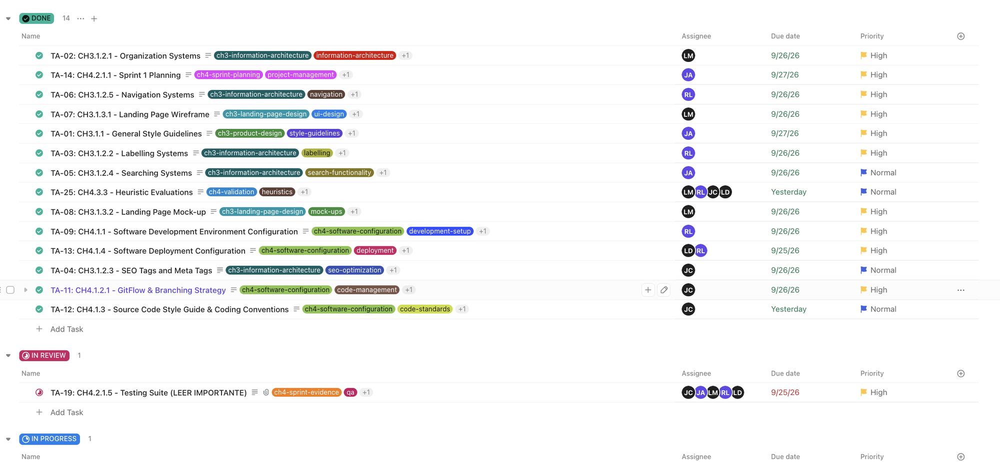

<a id="figura-4-3"></a>**Figura 4.3.** Tablero del Sprint 1 en ClickUp (parte 2)

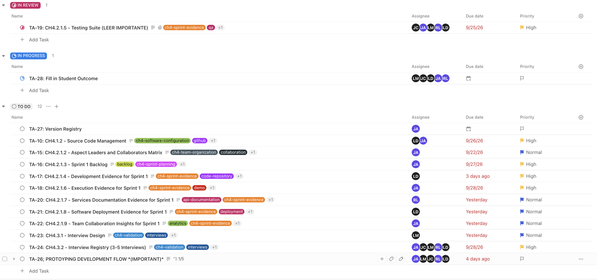

La Tabla 4.32 detalla las tareas del Sprint 1 y su estado.

<a id="tabla-4-32"></a>**Tabla 4.32.** Sprint Backlog 1

| Sprint # | Sprint 1 | | | | | | |
|---|---|---|---|---|---|---|---|
| **User Story Id** | **User Story Title** | **Work-Item / Task Id** | **Work-Item / Task Title** | **Description** | **Estimation (Hours)** | **Assigned To** | **Status** |
| — | — | TA-01 | General Style Guidelines | Definir la guía de estilos general: branding, tipografía, colores, espaciado y tono de comunicación. | 6 | Azama Fukuda, Juan Pablo | Done |
| — | — | TA-02 | Organization Systems | Documentar los sistemas de organización del contenido de la Landing Page y la aplicación. | 3 | Mechan Montenegro, Luciana Carolina | Done |
| — | — | TA-03 | Labelling Systems | Definir las etiquetas de las secciones y opciones de la Landing Page y la aplicación. | 3 | Lopez Monroy, Rodrigo Alfredo | Done |
| — | — | TA-04 | SEO Tags and Meta Tags | Definir los meta tags de la Landing Page y los metadatos de la aplicación para tiendas. | 2 | Sanchez Cuadrado, Juan Antonio | Done |
| — | — | TA-05 | Searching Systems | Documentar las opciones de búsqueda y filtrado de la aplicación. | 3 | Azama Fukuda, Juan Pablo | Done |
| — | — | TA-06 | Navigation Systems | Documentar la navegación entre secciones de la Landing Page y pantallas de la aplicación. | 3 | Lopez Monroy, Rodrigo Alfredo | Done |
| — | — | TA-07 | Landing Page Wireframe | Diseñar los wireframes de la Landing Page para escritorio y móvil. | 5 | Mechan Montenegro, Luciana Carolina | Done |
| — | — | TA-08 | Landing Page Mock-up | Diseñar los mock-ups de la Landing Page aplicando la guía de estilos. | 6 | Mechan Montenegro, Luciana Carolina | Done |
| — | — | TA-09 | Software Development Environment Configuration | Documentar las herramientas y el entorno de desarrollo del proyecto. | 3 | Lopez Monroy, Rodrigo Alfredo | Done |
| — | — | TA-10 | Source Code Management | Configurar los repositorios en GitHub y documentar su gestión. | 2 | Luis Miranda, Diego Andres / Azama Fukuda, Juan Pablo | To-do |
| — | — | TA-11 | GitFlow & Branching Strategy | Definir la estrategia GitFlow y las convenciones de ramas y commits. | 2 | Sanchez Cuadrado, Juan Antonio | Done |
| — | — | TA-12 | Source Code Style Guide & Coding Conventions | Definir las guías de estilo y convenciones de código por lenguaje. | 3 | Sanchez Cuadrado, Juan Antonio | Done |
| — | — | TA-13 | Software Deployment Configuration | Configurar y documentar el despliegue de la Landing Page y los Web Services. | 4 | Luis Miranda, Diego Andres / Lopez Monroy, Rodrigo Alfredo | Done |
| — | — | TA-14 | Sprint 1 Planning | Elaborar el Sprint Planning con el objetivo, la velocidad y las User Stories del Sprint. | 3 | Azama Fukuda, Juan Pablo | Done |
| — | — | TA-15 | Aspect Leaders and Collaborators Matrix | Elaborar la matriz de líderes y colaboradores por aspecto del Sprint. | 1 | Azama Fukuda, Juan Pablo | To-do |
| — | — | TA-16 | Sprint 1 Backlog | Elaborar el Sprint Backlog con el tablero y la tabla de tareas del Sprint. | 2 | Azama Fukuda, Juan Pablo | To-do |
| — | — | TA-17 | Development Evidence for Sprint 1 | Registrar los commits de implementación de cada repositorio. | 2 | Luis Miranda, Diego Andres | To-do |
| — | — | TA-18 | Execution Evidence for Sprint 1 | Registrar capturas y video de las funcionalidades implementadas. | 3 | Azama Fukuda, Juan Pablo | To-do |
| — | — | TA-19 | Testing Suite | Implementar las pruebas unitarias, de integración y de aceptación del Sprint. | 8 | Sanchez Cuadrado, Juan Antonio / Azama Fukuda, Juan Pablo / Mechan Montenegro, Luciana Carolina / Lopez Monroy, Rodrigo Alfredo / Luis Miranda, Diego Andres | To-Review |
| — | — | TA-20 | Services Documentation Evidence for Sprint 1 | Documentar los endpoints de los Web Services con OpenAPI. | 3 | Lopez Monroy, Rodrigo Alfredo | To-do |
| — | — | TA-21 | Software Deployment Evidence for Sprint 1 | Registrar la evidencia del despliegue de la Landing Page y los Web Services. | 2 | Luis Miranda, Diego Andres | To-do |
| — | — | TA-22 | Team Collaboration Insights for Sprint 1 | Registrar las analíticas de colaboración de los repositorios. | 1 | Azama Fukuda, Juan Pablo | To-do |
| — | — | TA-23 | Interview Design | Elaborar el guion de entrevistas de validación. | 2 | Mechan Montenegro, Luciana Carolina | To-do |
| — | — | TA-24 | Interview Registry | Realizar y registrar entre 3 y 5 entrevistas de validación. | 5 | Azama Fukuda, Juan Pablo / Sanchez Cuadrado, Juan Antonio / Mechan Montenegro, Luciana Carolina / Lopez Monroy, Rodrigo Alfredo / Luis Miranda, Diego Andres | To-do |
| — | — | TA-25 | Heuristic Evaluations | Evaluar la usabilidad de la Landing Page y la aplicación con principios heurísticos. | 4 | Mechan Montenegro, Luciana Carolina / Lopez Monroy, Rodrigo Alfredo / Sanchez Cuadrado, Juan Antonio / Luis Miranda, Diego Andres | Done |
| — | — | TA-26 | Prototyping Development Flow | Diseñar los flujos, wireframes y mock-ups de la aplicación por Bounded Context. | 10 | Azama Fukuda, Juan Pablo / Mechan Montenegro, Luciana Carolina / Sanchez Cuadrado, Juan Antonio / Lopez Monroy, Rodrigo Alfredo / Luis Miranda, Diego Andres | To-do |
| — | — | TA-27 | Version Registry | Registrar las versiones del informe y sus cambios. | 1 | Azama Fukuda, Juan Pablo | To-do |
| — | — | TA-28 | Fill in Student Outcome | Completar la sección de Student Outcome del informe. | 2 | Mechan Montenegro, Luciana Carolina / Sanchez Cuadrado, Juan Antonio / Luis Miranda, Diego Andres / Azama Fukuda, Juan Pablo / Lopez Monroy, Rodrigo Alfredo | In-Process |

#### 4.2.1.4. Development Evidence for Sprint Review

En esta sección se registran los commits que implementan las User Stories del Sprint 1 en cada repositorio.

##### Landing Page

Implementación del Landing Page de Guardian+ (US30, US31, US32 y US33): navegación entre secciones, presentación de las funcionalidades y beneficios, comparación de planes de suscripción y formulario de contacto, a partir de los tokens de diseño de las Style Guidelines. Se integró a `develop` mediante el Pull Request [#1](https://github.com/upc-pre-202620-1asi0238-13980-Healthify/guardian-plus-website/pull/1) y se publicó como versión 1.0.0. La Tabla 4.33 presenta los commits del Landing Page.

<a id="tabla-4-33"></a>**Tabla 4.33.** Commits del Landing Page

| Repository | Branch | Commit Id | Commit Message | Committed on |
|---|---|---|---|---|
| [guardian-plus-website](https://github.com/upc-pre-202620-1asi0238-13980-Healthify/guardian-plus-website) | `feat/landing-page-first-iteration` | `afa00cc` | `feat(styles): add design tokens and base styles from the style guidelines` | 2026-09-28 |
| [guardian-plus-website](https://github.com/upc-pre-202620-1asi0238-13980-Healthify/guardian-plus-website) | `feat/landing-page-first-iteration` | `c70c557` | `feat(navigation): add sticky header with active section, mobile menu and footer` | 2026-09-28 |
| [guardian-plus-website](https://github.com/upc-pre-202620-1asi0238-13980-Healthify/guardian-plus-website) | `feat/landing-page-first-iteration` | `121bc43` | `feat(landing): add hero, pain points and how it works sections` | 2026-09-28 |
| [guardian-plus-website](https://github.com/upc-pre-202620-1asi0238-13980-Healthify/guardian-plus-website) | `feat/landing-page-first-iteration` | `3b06be6` | `feat(landing): add benefits with expandable details and why guardian+ sections` | 2026-09-28 |
| [guardian-plus-website](https://github.com/upc-pre-202620-1asi0238-13980-Healthify/guardian-plus-website) | `feat/landing-page-first-iteration` | `15c1f4d` | `feat(pricing): add subscription plans comparison` | 2026-09-28 |
| [guardian-plus-website](https://github.com/upc-pre-202620-1asi0238-13980-Healthify/guardian-plus-website) | `feat/landing-page-first-iteration` | `cc3359e` | `feat(contact): add contact form with validation and submission service` | 2026-09-28 |
| [guardian-plus-website](https://github.com/upc-pre-202620-1asi0238-13980-Healthify/guardian-plus-website) | `feat/landing-page-first-iteration` | `556f945` | `test(landing): add tests for navigation, benefits, pricing and contact form` | 2026-09-28 |

##### Web Services — Emergency & Alerting

Implementación del Bounded Context Emergency & Alerting (US08, US09, US11, US15 y US16), integrada a `develop` mediante los Pull Requests [#7](https://github.com/upc-pre-202620-1asi0238-13980-Healthify/guardian-plus-platform/pull/7) y [#6](https://github.com/upc-pre-202620-1asi0238-13980-Healthify/guardian-plus-platform/pull/6). Este último corrige el manejo compartido de solicitudes mal formadas. La Tabla 4.34 presenta los commits de Emergency & Alerting en los Web Services.

<a id="tabla-4-34"></a>**Tabla 4.34.** Commits de Web Services: Emergency & Alerting

| Repository | Branch | Commit Id | Commit Message | Committed on |
|---|---|---|---|---|
| [guardian-plus-platform](https://github.com/upc-pre-202620-1asi0238-13980-Healthify/guardian-plus-platform) | `fix/shared-invalid-request-parameters` | `b49811f` | `fix(shared): return client error statuses for malformed or rejected requests` | 2026-10-01 |
| [guardian-plus-platform](https://github.com/upc-pre-202620-1asi0238-13980-Healthify/guardian-plus-platform) | `feat/emergency-alerting-core-flow` | `6ef2a84` | `feat(emergency-alerting): add domain model, commands, queries and events` | 2026-09-30 |
| [guardian-plus-platform](https://github.com/upc-pre-202620-1asi0238-13980-Healthify/guardian-plus-platform) | `feat/emergency-alerting-core-flow` | `62512c5` | `feat(emergency-alerting): add jpa persistence entities and repositories` | 2026-09-30 |
| [guardian-plus-platform](https://github.com/upc-pre-202620-1asi0238-13980-Healthify/guardian-plus-platform) | `feat/emergency-alerting-core-flow` | `785c9bb` | `feat(emergency-alerting): implement command and query services` | 2026-09-30 |
| [guardian-plus-platform](https://github.com/upc-pre-202620-1asi0238-13980-Healthify/guardian-plus-platform) | `feat/emergency-alerting-core-flow` | `92371b3` | `feat(emergency-alerting): add event handlers, integration events and context facade` | 2026-09-30 |
| [guardian-plus-platform](https://github.com/upc-pre-202620-1asi0238-13980-Healthify/guardian-plus-platform) | `feat/emergency-alerting-core-flow` | `54b5ce7` | `fix(emergency-alerting): retry alert commands that lose an optimistic-lock race` | 2026-10-01 |
| [guardian-plus-platform](https://github.com/upc-pre-202620-1asi0238-13980-Healthify/guardian-plus-platform) | `feat/emergency-alerting-core-flow` | `b704e95` | `feat(emergency-alerting): send alert notifications through channel adapters` | 2026-10-01 |
| [guardian-plus-platform](https://github.com/upc-pre-202620-1asi0238-13980-Healthify/guardian-plus-platform) | `feat/emergency-alerting-core-flow` | `05d11e7` | `feat(emergency-alerting): add fall confirmation and acknowledgement timeout schedulers` | 2026-10-01 |
| [guardian-plus-platform](https://github.com/upc-pre-202620-1asi0238-13980-Healthify/guardian-plus-platform) | `feat/emergency-alerting-core-flow` | `849eea9` | `fix(emergency-alerting): keep deliveries in dispatch order and avoid update deadlocks` | 2026-10-01 |
| [guardian-plus-platform](https://github.com/upc-pre-202620-1asi0238-13980-Healthify/guardian-plus-platform) | `feat/emergency-alerting-core-flow` | `7df392d` | `feat(emergency-alerting): add rest controllers, resources and assemblers` | 2026-10-01 |
| [guardian-plus-platform](https://github.com/upc-pre-202620-1asi0238-13980-Healthify/guardian-plus-platform) | `feat/emergency-alerting-core-flow` | `e19fb0a` | `docs(readme): document emergency and alerting bounded context` | 2026-10-01 |

##### Web Services — Care Routines & Wellness

Implementación anticipada del Bounded Context Care Routines & Wellness (US06, US13, US14, US17, US26, US27 y US29), correspondiente a la épica EP02, planificada para Sprints posteriores. Se integró a `develop` mediante los Pull Requests [#3](https://github.com/upc-pre-202620-1asi0238-13980-Healthify/guardian-plus-platform/pull/3) y [#5](https://github.com/upc-pre-202620-1asi0238-13980-Healthify/guardian-plus-platform/pull/5). La Tabla 4.35 presenta los commits de Care Routines & Wellness en los Web Services.

<a id="tabla-4-35"></a>**Tabla 4.35.** Commits de Web Services: Care Routines & Wellness

| Repository | Branch | Commit Id | Commit Message | Committed on |
|---|---|---|---|---|
| [guardian-plus-platform](https://github.com/upc-pre-202620-1asi0238-13980-Healthify/guardian-plus-platform) | `feat/care-routines-and-wellness` | `6ce3850` | `feat(care-routines-wellness): add domain model, commands and queries` | 2026-09-29 |
| [guardian-plus-platform](https://github.com/upc-pre-202620-1asi0238-13980-Healthify/guardian-plus-platform) | `feat/care-routines-and-wellness` | `c06a556` | `feat(care-routines-wellness): implement command and query services` | 2026-09-29 |
| [guardian-plus-platform](https://github.com/upc-pre-202620-1asi0238-13980-Healthify/guardian-plus-platform) | `feat/care-routines-and-wellness` | `dcd1955` | `feat(care-routines-wellness): add jpa repositories` | 2026-09-29 |
| [guardian-plus-platform](https://github.com/upc-pre-202620-1asi0238-13980-Healthify/guardian-plus-platform) | `feat/care-routines-and-wellness` | `1ac4bfb` | `feat(care-routines-wellness): add rest controllers, resources and assemblers` | 2026-09-29 |
| [guardian-plus-platform](https://github.com/upc-pre-202620-1asi0238-13980-Healthify/guardian-plus-platform) | `refactor/pluralize-medication-stock-endpoint` | `ce653fc` | `refactor(care-routines-wellness): pluralize medication stock endpoint path` | 2026-09-30 |

##### Web Services — Health Monitoring

Implementación anticipada del Bounded Context Health Monitoring (US01, US02, US03, US04, US05, US07 y US24), correspondiente a la épica EP01, planificada para Sprints posteriores. Incluye la recepción de la telemetría de signos vitales del simulador IoT por MQTT sobre WebSocket y la generación de alertas ante signos vitales fuera de rango en Emergency & Alerting. Se integró a `develop` mediante los Pull Requests [#12](https://github.com/upc-pre-202620-1asi0238-13980-Healthify/guardian-plus-platform/pull/12) y [#14](https://github.com/upc-pre-202620-1asi0238-13980-Healthify/guardian-plus-platform/pull/14). La Tabla 4.36 presenta los commits de Health Monitoring en los Web Services.

<a id="tabla-4-36"></a>**Tabla 4.36.** Commits de Web Services: Health Monitoring

| Repository | Branch | Commit Id | Commit Message | Committed on |
|---|---|---|---|---|
| [guardian-plus-platform](https://github.com/upc-pre-202620-1asi0238-13980-Healthify/guardian-plus-platform) | `feat/health-monitoring` | `1574326` | `feat(health-monitoring): add value objects` | 2026-10-04 |
| [guardian-plus-platform](https://github.com/upc-pre-202620-1asi0238-13980-Healthify/guardian-plus-platform) | `feat/health-monitoring` | `337093b` | `feat(healthmonitoring): add identifier value objects` | 2026-10-05 |
| [guardian-plus-platform](https://github.com/upc-pre-202620-1asi0238-13980-Healthify/guardian-plus-platform) | `feat/health-monitoring` | `6d50a43` | `feat(healthmonitoring): add measurement value objects` | 2026-10-05 |
| [guardian-plus-platform](https://github.com/upc-pre-202620-1asi0238-13980-Healthify/guardian-plus-platform) | `feat/health-monitoring` | `7ecb740` | `feat(healthmonitoring): add enumeration value objects` | 2026-10-05 |
| [guardian-plus-platform](https://github.com/upc-pre-202620-1asi0238-13980-Healthify/guardian-plus-platform) | `feat/health-monitoring` | `bd78cf3` | `test(healthmonitoring): add value object unit tests` | 2026-10-05 |
| [guardian-plus-platform](https://github.com/upc-pre-202620-1asi0238-13980-Healthify/guardian-plus-platform) | `feat/health-monitoring` | `2208497` | `feat(healthmonitoring): add domain commands` | 2026-10-05 |
| [guardian-plus-platform](https://github.com/upc-pre-202620-1asi0238-13980-Healthify/guardian-plus-platform) | `feat/health-monitoring` | `3a559c1` | `feat(healthmonitoring): add domain queries` | 2026-10-05 |
| [guardian-plus-platform](https://github.com/upc-pre-202620-1asi0238-13980-Healthify/guardian-plus-platform) | `feat/health-monitoring` | `3d4a155` | `feat(healthmonitoring): add domain events` | 2026-10-05 |
| [guardian-plus-platform](https://github.com/upc-pre-202620-1asi0238-13980-Healthify/guardian-plus-platform) | `feat/health-monitoring` | `6120907` | `feat(healthmonitoring): add domain and application guard messages` | 2026-10-05 |
| [guardian-plus-platform](https://github.com/upc-pre-202620-1asi0238-13980-Healthify/guardian-plus-platform) | `feat/health-monitoring` | `93266ec` | `feat(healthmonitoring): add VitalSignThreshold aggregate` | 2026-10-05 |
| [guardian-plus-platform](https://github.com/upc-pre-202620-1asi0238-13980-Healthify/guardian-plus-platform) | `feat/health-monitoring` | `bcdd5a3` | `feat(healthmonitoring): add VitalSign aggregate` | 2026-10-05 |
| [guardian-plus-platform](https://github.com/upc-pre-202620-1asi0238-13980-Healthify/guardian-plus-platform) | `feat/health-monitoring` | `58a06d7` | `feat(healthmonitoring): add WearableDevice aggregate` | 2026-10-05 |
| [guardian-plus-platform](https://github.com/upc-pre-202620-1asi0238-13980-Healthify/guardian-plus-platform) | `feat/health-monitoring` | `cfb089b` | `feat(healthmonitoring): add VitalSignType aggregate` | 2026-10-05 |
| [guardian-plus-platform](https://github.com/upc-pre-202620-1asi0238-13980-Healthify/guardian-plus-platform) | `feat/health-monitoring` | `0d29ec6` | `feat(healthmonitoring): add VitalSignSummary entity` | 2026-10-05 |
| [guardian-plus-platform](https://github.com/upc-pre-202620-1asi0238-13980-Healthify/guardian-plus-platform) | `feat/health-monitoring` | `1012bec` | `feat(healthmonitoring): add HealthReport aggregate` | 2026-10-05 |
| [guardian-plus-platform](https://github.com/upc-pre-202620-1asi0238-13980-Healthify/guardian-plus-platform) | `feat/health-monitoring` | `ab9afdf` | `feat(healthmonitoring): add repository ports` | 2026-10-05 |
| [guardian-plus-platform](https://github.com/upc-pre-202620-1asi0238-13980-Healthify/guardian-plus-platform) | `feat/health-monitoring` | `5261388` | `feat(healthmonitoring): add command service contracts` | 2026-10-05 |
| [guardian-plus-platform](https://github.com/upc-pre-202620-1asi0238-13980-Healthify/guardian-plus-platform) | `feat/health-monitoring` | `5797baa` | `feat(healthmonitoring): add query service contracts` | 2026-10-05 |
| [guardian-plus-platform](https://github.com/upc-pre-202620-1asi0238-13980-Healthify/guardian-plus-platform) | `feat/health-monitoring` | `a6cf0c7` | `feat(healthmonitoring): implement vital sign command service` | 2026-10-05 |
| [guardian-plus-platform](https://github.com/upc-pre-202620-1asi0238-13980-Healthify/guardian-plus-platform) | `feat/health-monitoring` | `4634895` | `feat(healthmonitoring): implement vital sign threshold command service` | 2026-10-05 |
| [guardian-plus-platform](https://github.com/upc-pre-202620-1asi0238-13980-Healthify/guardian-plus-platform) | `feat/health-monitoring` | `f3053ad` | `feat(healthmonitoring): implement wearable device command service` | 2026-10-05 |
| [guardian-plus-platform](https://github.com/upc-pre-202620-1asi0238-13980-Healthify/guardian-plus-platform) | `feat/health-monitoring` | `1349495` | `feat(healthmonitoring): implement vital sign type command service` | 2026-10-05 |
| [guardian-plus-platform](https://github.com/upc-pre-202620-1asi0238-13980-Healthify/guardian-plus-platform) | `feat/health-monitoring` | `5952114` | `feat(healthmonitoring): implement health report command service` | 2026-10-05 |
| [guardian-plus-platform](https://github.com/upc-pre-202620-1asi0238-13980-Healthify/guardian-plus-platform) | `feat/health-monitoring` | `57fed00` | `feat(healthmonitoring): implement query services` | 2026-10-05 |
| [guardian-plus-platform](https://github.com/upc-pre-202620-1asi0238-13980-Healthify/guardian-plus-platform) | `feat/health-monitoring` | `04ec377` | `feat(healthmonitoring): add integration events` | 2026-10-05 |
| [guardian-plus-platform](https://github.com/upc-pre-202620-1asi0238-13980-Healthify/guardian-plus-platform) | `feat/health-monitoring` | `8a96b17` | `feat(healthmonitoring): chain detect, emit and evaluate event handlers` | 2026-10-05 |
| [guardian-plus-platform](https://github.com/upc-pre-202620-1asi0238-13980-Healthify/guardian-plus-platform) | `feat/health-monitoring` | `c1b1f6f` | `feat(healthmonitoring): add tolerance rule event handler` | 2026-10-05 |
| [guardian-plus-platform](https://github.com/upc-pre-202620-1asi0238-13980-Healthify/guardian-plus-platform) | `feat/health-monitoring` | `fc3a5fb` | `feat(healthmonitoring): add weekly summary compiled event handler` | 2026-10-05 |
| [guardian-plus-platform](https://github.com/upc-pre-202620-1asi0238-13980-Healthify/guardian-plus-platform) | `feat/health-monitoring` | `92ef3e5` | `feat(healthmonitoring): add context facade ACL` | 2026-10-05 |
| [guardian-plus-platform](https://github.com/upc-pre-202620-1asi0238-13980-Healthify/guardian-plus-platform) | `feat/health-monitoring` | `2443938` | `test(healthmonitoring): add in-memory test support` | 2026-10-05 |
| [guardian-plus-platform](https://github.com/upc-pre-202620-1asi0238-13980-Healthify/guardian-plus-platform) | `feat/health-monitoring` | `bbc3b5d` | `test(healthmonitoring): add threshold and health report service tests` | 2026-10-05 |
| [guardian-plus-platform](https://github.com/upc-pre-202620-1asi0238-13980-Healthify/guardian-plus-platform) | `feat/health-monitoring` | `191bf5b` | `test(healthmonitoring): add tolerance rule tests` | 2026-10-05 |
| [guardian-plus-platform](https://github.com/upc-pre-202620-1asi0238-13980-Healthify/guardian-plus-platform) | `feat/health-monitoring` | `197e1f4` | `feat(healthmonitoring): add CareRecipientProfileId persistence converter` | 2026-10-05 |
| [guardian-plus-platform](https://github.com/upc-pre-202620-1asi0238-13980-Healthify/guardian-plus-platform) | `feat/health-monitoring` | `bde885a` | `feat(healthmonitoring): add vital sign type persistence` | 2026-10-05 |
| [guardian-plus-platform](https://github.com/upc-pre-202620-1asi0238-13980-Healthify/guardian-plus-platform) | `feat/health-monitoring` | `938b190` | `feat(healthmonitoring): add wearable device persistence` | 2026-10-05 |
| [guardian-plus-platform](https://github.com/upc-pre-202620-1asi0238-13980-Healthify/guardian-plus-platform) | `feat/health-monitoring` | `c4c4f00` | `feat(healthmonitoring): add vital sign threshold persistence` | 2026-10-05 |
| [guardian-plus-platform](https://github.com/upc-pre-202620-1asi0238-13980-Healthify/guardian-plus-platform) | `feat/health-monitoring` | `4e8cbcf` | `feat(healthmonitoring): add vital sign reading persistence` | 2026-10-05 |
| [guardian-plus-platform](https://github.com/upc-pre-202620-1asi0238-13980-Healthify/guardian-plus-platform) | `feat/health-monitoring` | `77220e3` | `feat(healthmonitoring): add health report persistence` | 2026-10-05 |
| [guardian-plus-platform](https://github.com/upc-pre-202620-1asi0238-13980-Healthify/guardian-plus-platform) | `feat/health-monitoring` | `901e6c3` | `feat(healthmonitoring): add weekly health summary scheduler` | 2026-10-05 |
| [guardian-plus-platform](https://github.com/upc-pre-202620-1asi0238-13980-Healthify/guardian-plus-platform) | `feat/health-monitoring` | `20d8f9d` | `feat(healthmonitoring): seed the vital sign type catalog` | 2026-10-05 |
| [guardian-plus-platform](https://github.com/upc-pre-202620-1asi0238-13980-Healthify/guardian-plus-platform) | `feat/health-monitoring` | `e819129` | `chore(healthmonitoring): add configuration properties` | 2026-10-05 |
| [guardian-plus-platform](https://github.com/upc-pre-202620-1asi0238-13980-Healthify/guardian-plus-platform) | `feat/health-monitoring` | `34e0d53` | `feat(healthmonitoring): add not-found error messages` | 2026-10-05 |
| [guardian-plus-platform](https://github.com/upc-pre-202620-1asi0238-13980-Healthify/guardian-plus-platform) | `feat/health-monitoring` | `59cc595` | `feat(healthmonitoring): expose vital sign types REST endpoints` | 2026-10-05 |
| [guardian-plus-platform](https://github.com/upc-pre-202620-1asi0238-13980-Healthify/guardian-plus-platform) | `feat/health-monitoring` | `e3b5722` | `feat(healthmonitoring): expose wearable devices REST endpoints` | 2026-10-05 |
| [guardian-plus-platform](https://github.com/upc-pre-202620-1asi0238-13980-Healthify/guardian-plus-platform) | `feat/health-monitoring` | `599487e` | `feat(healthmonitoring): expose vital sign thresholds REST endpoints` | 2026-10-05 |
| [guardian-plus-platform](https://github.com/upc-pre-202620-1asi0238-13980-Healthify/guardian-plus-platform) | `feat/health-monitoring` | `563b0dd` | `feat(healthmonitoring): expose vital signs REST endpoints` | 2026-10-05 |
| [guardian-plus-platform](https://github.com/upc-pre-202620-1asi0238-13980-Healthify/guardian-plus-platform) | `feat/health-monitoring` | `560176e` | `feat(healthmonitoring): expose health reports REST endpoints` | 2026-10-05 |
| [guardian-plus-platform](https://github.com/upc-pre-202620-1asi0238-13980-Healthify/guardian-plus-platform) | `feat/health-monitoring` | `3eaa733` | `feat(emergencyalerting): raise alerts from vital sign anomalies` | 2026-10-05 |
| [guardian-plus-platform](https://github.com/upc-pre-202620-1asi0238-13980-Healthify/guardian-plus-platform) | `feat/health-monitoring` | `ab6ee82` | `test(healthmonitoring): add REST integration tests` | 2026-10-05 |
| [guardian-plus-platform](https://github.com/upc-pre-202620-1asi0238-13980-Healthify/guardian-plus-platform) | `feat/health-monitoring` | `da873da` | `build: add Cucumber for BDD acceptance tests` | 2026-10-05 |
| [guardian-plus-platform](https://github.com/upc-pre-202620-1asi0238-13980-Healthify/guardian-plus-platform) | `feat/health-monitoring` | `c147b33` | `test(healthmonitoring): add Gherkin acceptance features` | 2026-10-05 |
| [guardian-plus-platform](https://github.com/upc-pre-202620-1asi0238-13980-Healthify/guardian-plus-platform) | `feat/health-monitoring` | `48306d0` | `test(healthmonitoring): add acceptance step definitions and runner` | 2026-10-05 |
| [guardian-plus-platform](https://github.com/upc-pre-202620-1asi0238-13980-Healthify/guardian-plus-platform) | `feat/health-monitoring` | `93a48ce` | `feat(healthmonitoring): add reference range error messages` | 2026-10-05 |
| [guardian-plus-platform](https://github.com/upc-pre-202620-1asi0238-13980-Healthify/guardian-plus-platform) | `feat/health-monitoring` | `6e39410` | `feat(healthmonitoring): add VitalSignRange value object` | 2026-10-05 |
| [guardian-plus-platform](https://github.com/upc-pre-202620-1asi0238-13980-Healthify/guardian-plus-platform) | `feat/health-monitoring` | `d089279` | `feat(healthmonitoring): add reference ranges to vital sign types` | 2026-10-05 |
| [guardian-plus-platform](https://github.com/upc-pre-202620-1asi0238-13980-Healthify/guardian-plus-platform) | `feat/health-monitoring` | `b67c7db` | `feat(healthmonitoring): persist vital sign type reference ranges` | 2026-10-05 |
| [guardian-plus-platform](https://github.com/upc-pre-202620-1asi0238-13980-Healthify/guardian-plus-platform) | `feat/health-monitoring` | `73e0084` | `feat(healthmonitoring): seed vital sign types with reference ranges` | 2026-10-05 |
| [guardian-plus-platform](https://github.com/upc-pre-202620-1asi0238-13980-Healthify/guardian-plus-platform) | `feat/health-monitoring` | `14f8d7d` | `feat(healthmonitoring): evaluate readings against vital sign type ranges` | 2026-10-05 |
| [guardian-plus-platform](https://github.com/upc-pre-202620-1asi0238-13980-Healthify/guardian-plus-platform) | `feat/health-monitoring` | `b98a712` | `feat(healthmonitoring): keep thresholds within physical limits` | 2026-10-05 |
| [guardian-plus-platform](https://github.com/upc-pre-202620-1asi0238-13980-Healthify/guardian-plus-platform) | `feat/health-monitoring` | `a1d5c83` | `feat(healthmonitoring): expose reference ranges in vital sign types endpoints` | 2026-10-05 |
| [guardian-plus-platform](https://github.com/upc-pre-202620-1asi0238-13980-Healthify/guardian-plus-platform) | `feat/health-monitoring` | `296619a` | `test(healthmonitoring): add reference range domain tests` | 2026-10-05 |
| [guardian-plus-platform](https://github.com/upc-pre-202620-1asi0238-13980-Healthify/guardian-plus-platform) | `feat/health-monitoring` | `38c4281` | `test(healthmonitoring): cover reference ranges in service tests` | 2026-10-05 |
| [guardian-plus-platform](https://github.com/upc-pre-202620-1asi0238-13980-Healthify/guardian-plus-platform) | `feat/health-monitoring` | `cee04e4` | `test(healthmonitoring): cover reference ranges in REST integration tests` | 2026-10-05 |
| [guardian-plus-platform](https://github.com/upc-pre-202620-1asi0238-13980-Healthify/guardian-plus-platform) | `feat/health-monitoring` | `cf8bead` | `fix(healthmonitoring): parse acceptance decimals regardless of feature locale` | 2026-10-05 |
| [guardian-plus-platform](https://github.com/upc-pre-202620-1asi0238-13980-Healthify/guardian-plus-platform) | `feat/health-monitoring` | `8ce1043` | `feat(healthmonitoring): add VitalSignType value object with per-type ranges` | 2026-10-05 |
| [guardian-plus-platform](https://github.com/upc-pre-202620-1asi0238-13980-Healthify/guardian-plus-platform) | `feat/health-monitoring` | `367bde8` | `refactor(healthmonitoring): evaluate vital signs against the normal range of their type` | 2026-10-05 |
| [guardian-plus-platform](https://github.com/upc-pre-202620-1asi0238-13980-Healthify/guardian-plus-platform) | `feat/health-monitoring` | `6415fb8` | `feat(healthmonitoring): link wearable devices to care recipients` | 2026-10-05 |
| [guardian-plus-platform](https://github.com/upc-pre-202620-1asi0238-13980-Healthify/guardian-plus-platform) | `feat/health-monitoring` | `14f78d3` | `refactor(healthmonitoring): summarize health reports against type normal ranges` | 2026-10-05 |
| [guardian-plus-platform](https://github.com/upc-pre-202620-1asi0238-13980-Healthify/guardian-plus-platform) | `feat/health-monitoring` | `18d9f94` | `refactor(healthmonitoring): remove the VitalSignThreshold and VitalSignType aggregates` | 2026-10-05 |
| [guardian-plus-platform](https://github.com/upc-pre-202620-1asi0238-13980-Healthify/guardian-plus-platform) | `feat/health-monitoring` | `64a3c38` | `refactor(healthmonitoring): persist the vital sign type as an enum column` | 2026-10-05 |
| [guardian-plus-platform](https://github.com/upc-pre-202620-1asi0238-13980-Healthify/guardian-plus-platform) | `feat/health-monitoring` | `fcc7d61` | `refactor(healthmonitoring): apply the tolerance rule over type normal ranges` | 2026-10-05 |
| [guardian-plus-platform](https://github.com/upc-pre-202620-1asi0238-13980-Healthify/guardian-plus-platform) | `feat/health-monitoring` | `1954ce5` | `refactor(healthmonitoring): expose device linking and vital sign types REST endpoints` | 2026-10-05 |
| [guardian-plus-platform](https://github.com/upc-pre-202620-1asi0238-13980-Healthify/guardian-plus-platform) | `feat/health-monitoring` | `76ef5e7` | `chore(healthmonitoring): update messages and configuration` | 2026-10-05 |
| [guardian-plus-platform](https://github.com/upc-pre-202620-1asi0238-13980-Healthify/guardian-plus-platform) | `feat/health-monitoring` | `bd5d81e` | `test(healthmonitoring): cover VitalSignType and the reworked aggregates` | 2026-10-05 |
| [guardian-plus-platform](https://github.com/upc-pre-202620-1asi0238-13980-Healthify/guardian-plus-platform) | `feat/health-monitoring` | `edfe9af` | `test(healthmonitoring): update service, tolerance rule and test support` | 2026-10-05 |
| [guardian-plus-platform](https://github.com/upc-pre-202620-1asi0238-13980-Healthify/guardian-plus-platform) | `feat/health-monitoring` | `80818e5` | `test(healthmonitoring): update REST integration tests` | 2026-10-05 |
| [guardian-plus-platform](https://github.com/upc-pre-202620-1asi0238-13980-Healthify/guardian-plus-platform) | `feat/health-monitoring` | `3965d2f` | `test(healthmonitoring): evaluate acceptance scenarios against type normal ranges` | 2026-10-05 |
| [guardian-plus-platform](https://github.com/upc-pre-202620-1asi0238-13980-Healthify/guardian-plus-platform) | `feat/iot-connection` | `3e8c09b` | `build: add Eclipse Paho MQTT client for wearable telemetry over WebSocket` | 2026-10-06 |
| [guardian-plus-platform](https://github.com/upc-pre-202620-1asi0238-13980-Healthify/guardian-plus-platform) | `feat/iot-connection` | `fc9dce4` | `feat(healthmonitoring): add get all wearable devices query` | 2026-10-06 |
| [guardian-plus-platform](https://github.com/upc-pre-202620-1asi0238-13980-Healthify/guardian-plus-platform) | `feat/iot-connection` | `fa066c8` | `feat(healthmonitoring): resolve get all wearable devices query` | 2026-10-06 |
| [guardian-plus-platform](https://github.com/upc-pre-202620-1asi0238-13980-Healthify/guardian-plus-platform) | `feat/iot-connection` | `47e97f6` | `feat(healthmonitoring): expose all wearable devices for the IoT simulator` | 2026-10-06 |
| [guardian-plus-platform](https://github.com/upc-pre-202620-1asi0238-13980-Healthify/guardian-plus-platform) | `feat/iot-connection` | `755275b` | `test(healthmonitoring): cover listing all wearable devices` | 2026-10-06 |
| [guardian-plus-platform](https://github.com/upc-pre-202620-1asi0238-13980-Healthify/guardian-plus-platform) | `feat/iot-connection` | `7e8b1c9` | `feat(healthmonitoring): add vital sign telemetry message` | 2026-10-06 |
| [guardian-plus-platform](https://github.com/upc-pre-202620-1asi0238-13980-Healthify/guardian-plus-platform) | `feat/iot-connection` | `0440b59` | `feat(healthmonitoring): assemble detect vital signs command from telemetry message` | 2026-10-06 |
| [guardian-plus-platform](https://github.com/upc-pre-202620-1asi0238-13980-Healthify/guardian-plus-platform) | `feat/iot-connection` | `99aff05` | `feat(healthmonitoring): handle vital sign telemetry messages from the broker` | 2026-10-06 |
| [guardian-plus-platform](https://github.com/upc-pre-202620-1asi0238-13980-Healthify/guardian-plus-platform) | `feat/iot-connection` | `d853ef2` | `feat(healthmonitoring): subscribe to vital sign telemetry over MQTT WebSocket` | 2026-10-06 |
| [guardian-plus-platform](https://github.com/upc-pre-202620-1asi0238-13980-Healthify/guardian-plus-platform) | `feat/iot-connection` | `63e4080` | `feat(healthmonitoring): configure MQTT WebSocket telemetry connection` | 2026-10-06 |
| [guardian-plus-platform](https://github.com/upc-pre-202620-1asi0238-13980-Healthify/guardian-plus-platform) | `feat/iot-connection` | `e2ce6db` | `test(healthmonitoring): cover vital sign telemetry message handling` | 2026-10-06 |
| [guardian-plus-platform](https://github.com/upc-pre-202620-1asi0238-13980-Healthify/guardian-plus-platform) | `feat/iot-connection` | `08f0962` | `build(docker): add mosquitto broker with websocket listener to the dev stack` | 2026-10-06 |
| [guardian-plus-platform](https://github.com/upc-pre-202620-1asi0238-13980-Healthify/guardian-plus-platform) | `feat/iot-connection` | `de5ad3a` | `feat(healthmonitoring): enable vital sign telemetry by default in the dev profile` | 2026-10-06 |
| [guardian-plus-platform](https://github.com/upc-pre-202620-1asi0238-13980-Healthify/guardian-plus-platform) | `feat/iot-connection` | `87c55b3` | `build(docker): run the backend and IoT simulator in the dev stack under the full profile` | 2026-10-06 |
| [guardian-plus-platform](https://github.com/upc-pre-202620-1asi0238-13980-Healthify/guardian-plus-platform) | `feat/iot-connection` | `3bd33dd` | `docs(deploy): document vital sign telemetry settings for production` | 2026-10-06 |
| [guardian-plus-platform](https://github.com/upc-pre-202620-1asi0238-13980-Healthify/guardian-plus-platform) | `feat/iot-connection` | `0d775e0` | `docs(readme): document the local IoT stack and telemetry settings` | 2026-10-06 |

##### Web Services — Mobility & Geofencing

Implementación del Bounded Context Mobility & Geofencing (US18), que recibe la ubicación del wearable, mantiene el seguimiento de la persona bajo cuidado y expone su ubicación actual, su estado y su historial. Incluye de forma anticipada la administración de zonas seguras y la detección de sus violaciones (US28). Se integró a `develop` mediante el Pull Request [#11](https://github.com/upc-pre-202620-1asi0238-13980-Healthify/guardian-plus-platform/pull/11). La Tabla 4.37 presenta los commits de Mobility & Geofencing en los Web Services.

<a id="tabla-4-37"></a>**Tabla 4.37.** Commits de Web Services: Mobility & Geofencing

| Repository | Branch | Commit Id | Commit Message | Committed on |
|---|---|---|---|---|
| [guardian-plus-platform](https://github.com/upc-pre-202620-1asi0238-13980-Healthify/guardian-plus-platform) | `feat/mobility-geofencing-context` | `0856a96` | `feat(mobilitygeofencing): add SafeZone aggregate root` | 2026-10-04 |
| [guardian-plus-platform](https://github.com/upc-pre-202620-1asi0238-13980-Healthify/guardian-plus-platform) | `feat/mobility-geofencing-context` | `6b3cec4` | `refactor(mobilitygeofencing): introduce LocationTracking aggregate root for domain state management` | 2026-10-04 |
| [guardian-plus-platform](https://github.com/upc-pre-202620-1asi0238-13980-Healthify/guardian-plus-platform) | `feat/mobility-geofencing-context` | `7c02fd6` | `refactor(mobilitygeofencing): implement ZoneViolation entity within the domain model` | 2026-10-04 |
| [guardian-plus-platform](https://github.com/upc-pre-202620-1asi0238-13980-Healthify/guardian-plus-platform) | `feat/mobility-geofencing-context` | `12f7df1` | `feat refactor(mobilitygeofencing): implement WearableLocationTransformer to map external telemetry to domain commands` | 2026-10-04 |
| [guardian-plus-platform](https://github.com/upc-pre-202620-1asi0238-13980-Healthify/guardian-plus-platform) | `feat/mobility-geofencing-context` | `f8a2374` | `refactor(mobilitygeofencing): implement database persistence adapter for LocationTracking aggregate` | 2026-10-04 |
| [guardian-plus-platform](https://github.com/upc-pre-202620-1asi0238-13980-Healthify/guardian-plus-platform) | `feat/mobility-geofencing-context` | `ebb4c64` | `feat(mobilitygeofencing): expose controller http metods endpoints for current location, status, and history tracking` | 2026-10-04 |
| [guardian-plus-platform](https://github.com/upc-pre-202620-1asi0238-13980-Healthify/guardian-plus-platform) | `feat/mobility-geofencing-context` | `b25d298` | `feat(mobilitygeofencing): expose REST controller for safe zone CRUD and lifecycle management and feat identifier zone violationID` | 2026-10-04 |

##### Web Services — Profile

Implementación del Bounded Context Profile, que gestiona los perfiles de usuario, los perfiles de las personas bajo cuidado, las relaciones de cuidado y las preferencias de idioma y accesibilidad que utiliza la sección Perfil de la aplicación. Se integró a `develop` mediante el Pull Request [#13](https://github.com/upc-pre-202620-1asi0238-13980-Healthify/guardian-plus-platform/pull/13). La Tabla 4.38 presenta los commits de Profile en los Web Services.

<a id="tabla-4-38"></a>**Tabla 4.38.** Commits de Web Services: Profile

| Repository | Branch | Commit Id | Commit Message | Committed on |
|---|---|---|---|---|
| [guardian-plus-platform](https://github.com/upc-pre-202620-1asi0238-13980-Healthify/guardian-plus-platform) | `feat/profile-bounded-context` | `b447710` | `feat(profile): add user and care recipient domain model` | 2026-10-04 |
| [guardian-plus-platform](https://github.com/upc-pre-202620-1asi0238-13980-Healthify/guardian-plus-platform) | `feat/profile-bounded-context` | `12dd1c1` | `feat(profile): add jpa persistence entities and repositories` | 2026-10-04 |
| [guardian-plus-platform](https://github.com/upc-pre-202620-1asi0238-13980-Healthify/guardian-plus-platform) | `feat/profile-bounded-context` | `399d5a3` | `feat(profile): implement command and query services` | 2026-10-04 |
| [guardian-plus-platform](https://github.com/upc-pre-202620-1asi0238-13980-Healthify/guardian-plus-platform) | `feat/profile-bounded-context` | `1103d1d` | `feat(profile): add care relationship domain model` | 2026-10-04 |
| [guardian-plus-platform](https://github.com/upc-pre-202620-1asi0238-13980-Healthify/guardian-plus-platform) | `feat/profile-bounded-context` | `01ca094` | `feat(profile): add user preferences domain model` | 2026-10-04 |
| [guardian-plus-platform](https://github.com/upc-pre-202620-1asi0238-13980-Healthify/guardian-plus-platform) | `feat/profile-bounded-context` | `251e137` | `feat(profile): add user profile rest endpoints` | 2026-10-04 |
| [guardian-plus-platform](https://github.com/upc-pre-202620-1asi0238-13980-Healthify/guardian-plus-platform) | `feat/profile-bounded-context` | `9e4e959` | `feat(profile): add care relationship rest endpoints` | 2026-10-04 |

##### Mobile App — Emergency & Alerting

Implementación de las pantallas del Bounded Context Emergency & Alerting en la aplicación móvil: alertas activas, detalle de alerta, historial, contactos de emergencia y configuración de alertas, conectadas a los Web Services del mismo contexto (US08, US09, US11, US15 y US16). Se integró a `develop` mediante el Pull Request [#1](https://github.com/upc-pre-202620-1asi0238-13980-Healthify/guardian-plus-mobile-app/pull/1). La Tabla 4.39 presenta los commits de Emergency & Alerting en la aplicación móvil.

<a id="tabla-4-39"></a>**Tabla 4.39.** Commits de Mobile App: Emergency & Alerting

| Repository | Branch | Commit Id | Commit Message | Committed on |
|---|---|---|---|---|
| [guardian-plus-mobile-app](https://github.com/upc-pre-202620-1asi0238-13980-Healthify/guardian-plus-mobile-app) | `feat/emergency-alerting-screens` | `70a7bf9` | `build: add hilt, retrofit, navigation and java time desugaring` | 2026-10-03 |
| [guardian-plus-mobile-app](https://github.com/upc-pre-202620-1asi0238-13980-Healthify/guardian-plus-mobile-app) | `feat/emergency-alerting-screens` | `9ae9f15` | `feat(emergency-alerting): add active alerts and alert detail screens` | 2026-10-03 |
| [guardian-plus-mobile-app](https://github.com/upc-pre-202620-1asi0238-13980-Healthify/guardian-plus-mobile-app) | `feat/emergency-alerting-screens` | `b32bc08` | `feat(emergency-alerting): add alert history screen` | 2026-10-03 |
| [guardian-plus-mobile-app](https://github.com/upc-pre-202620-1asi0238-13980-Healthify/guardian-plus-mobile-app) | `feat/emergency-alerting-screens` | `e2a0e42` | `feat(emergency-alerting): add emergency contacts and alert settings screens` | 2026-10-03 |

##### Mobile App — Health Monitoring

Implementación de la capa de dominio, infraestructura y presentación del Bounded Context Health Monitoring en la aplicación móvil: pantalla de inicio, signos vitales en tiempo real e historial semanal de lecturas. Se integró a `develop` mediante los Pull Requests [#3](https://github.com/upc-pre-202620-1asi0238-13980-Healthify/guardian-plus-mobile-app/pull/3), [#5](https://github.com/upc-pre-202620-1asi0238-13980-Healthify/guardian-plus-mobile-app/pull/5) y [#6](https://github.com/upc-pre-202620-1asi0238-13980-Healthify/guardian-plus-mobile-app/pull/6). La Tabla 4.40 presenta los commits de Health Monitoring en la aplicación móvil.

<a id="tabla-4-40"></a>**Tabla 4.40.** Commits de Mobile App: Health Monitoring

| Repository | Branch | Commit Id | Commit Message | Committed on |
|---|---|---|---|---|
| [guardian-plus-mobile-app](https://github.com/upc-pre-202620-1asi0238-13980-Healthify/guardian-plus-mobile-app) | `feat/health-monitoring` | `16c7b01` | `feat(health-monitoring): add VitalSignType` | 2026-10-05 |
| [guardian-plus-mobile-app](https://github.com/upc-pre-202620-1asi0238-13980-Healthify/guardian-plus-mobile-app) | `feat/health-monitoring` | `e98d424` | `feat(health-monitoring): add core enums` | 2026-10-05 |
| [guardian-plus-mobile-app](https://github.com/upc-pre-202620-1asi0238-13980-Healthify/guardian-plus-mobile-app) | `feat/health-monitoring` | `7950b92` | `feat(health-monitoring): add LiveVitalSign data class` | 2026-10-05 |
| [guardian-plus-mobile-app](https://github.com/upc-pre-202620-1asi0238-13980-Healthify/guardian-plus-mobile-app) | `feat/health-monitoring` | `bc1bf41` | `feat(health-monitoring): add LiveVitalSigns class` | 2026-10-05 |
| [guardian-plus-mobile-app](https://github.com/upc-pre-202620-1asi0238-13980-Healthify/guardian-plus-mobile-app) | `feat/health-monitoring` | `6a11b00` | `feat(health-monitoring): add LiveVitalSigns class` | 2026-10-05 |
| [guardian-plus-mobile-app](https://github.com/upc-pre-202620-1asi0238-13980-Healthify/guardian-plus-mobile-app) | `feat/health-monitoring` | `ebdd8a7` | `feat(health-monitoring): add WearalbeDevice data class` | 2026-10-05 |
| [guardian-plus-mobile-app](https://github.com/upc-pre-202620-1asi0238-13980-Healthify/guardian-plus-mobile-app) | `feat/health-monitoring` | `74d0b55` | `feat(health-monitoring): add domain repositories` | 2026-10-05 |
| [guardian-plus-mobile-app](https://github.com/upc-pre-202620-1asi0238-13980-Healthify/guardian-plus-mobile-app) | `feat/health-monitoring` | `1dea8db` | `feat(health-monitoring): add DTOs, also, moved apiCall.kt to a core/network package` | 2026-10-05 |
| [guardian-plus-mobile-app](https://github.com/upc-pre-202620-1asi0238-13980-Healthify/guardian-plus-mobile-app) | `feat/health-monitoring` | `cc90381` | `feat(health-monitoring): add services and repository implementations` | 2026-10-05 |
| [guardian-plus-mobile-app](https://github.com/upc-pre-202620-1asi0238-13980-Healthify/guardian-plus-mobile-app) | `feat/health-monitoring` | `944de96` | `feat(health-monitoring): add hilt modules` | 2026-10-05 |
| [guardian-plus-mobile-app](https://github.com/upc-pre-202620-1asi0238-13980-Healthify/guardian-plus-mobile-app) | `feat/health-monitoring` | `f2e9bdd` | `feat(health-monitoring): add use cases` | 2026-10-05 |
| [guardian-plus-mobile-app](https://github.com/upc-pre-202620-1asi0238-13980-Healthify/guardian-plus-mobile-app) | `feat/health-monitoring` | `9c39adc` | `feat(health-monitoring): partially added presentation layer` | 2026-10-06 |
| [guardian-plus-mobile-app](https://github.com/upc-pre-202620-1asi0238-13980-Healthify/guardian-plus-mobile-app) | `feat/health-monitoring` | `71824de` | `feat(health-monitoring): add vital sign readings from history` | 2026-10-06 |
| [guardian-plus-mobile-app](https://github.com/upc-pre-202620-1asi0238-13980-Healthify/guardian-plus-mobile-app) | `feat/health-monitoring` | `b1a64c7` | `refactor(health-monitoring): move live vitals state and labels into common package` | 2026-10-06 |
| [guardian-plus-mobile-app](https://github.com/upc-pre-202620-1asi0238-13980-Healthify/guardian-plus-mobile-app) | `feat/health-monitoring` | `76e15d6` | `docs(health-monitoring): add view model and screens guides` | 2026-10-06 |
| [guardian-plus-mobile-app](https://github.com/upc-pre-202620-1asi0238-13980-Healthify/guardian-plus-mobile-app) | `feat/health-monitoring` | `45cba1f` | `fix(health-monitoring): match patch device type name with the platform` | 2026-10-06 |
| [guardian-plus-mobile-app](https://github.com/upc-pre-202620-1asi0238-13980-Healthify/guardian-plus-mobile-app) | `feat/health-monitoring` | `462d59a` | `feat(health-monitoring): add reading badge, value formatting and screen strings` | 2026-10-06 |
| [guardian-plus-mobile-app](https://github.com/upc-pre-202620-1asi0238-13980-Healthify/guardian-plus-mobile-app) | `feat/health-monitoring` | `bec4e2e` | `feat(health-monitoring): track server time and blood pressure in live vitals state` | 2026-10-06 |
| [guardian-plus-mobile-app](https://github.com/upc-pre-202620-1asi0238-13980-Healthify/guardian-plus-mobile-app) | `feat/health-monitoring` | `42c2171` | `feat(health-monitoring): add home screen` | 2026-10-06 |
| [guardian-plus-mobile-app](https://github.com/upc-pre-202620-1asi0238-13980-Healthify/guardian-plus-mobile-app) | `feat/health-monitoring` | `03a9c90` | `feat(health-monitoring): add vital history state and view model` | 2026-10-06 |
| [guardian-plus-mobile-app](https://github.com/upc-pre-202620-1asi0238-13980-Healthify/guardian-plus-mobile-app) | `feat/health-monitoring` | `c954a23` | `feat(health-monitoring): add live vitals screen` | 2026-10-06 |
| [guardian-plus-mobile-app](https://github.com/upc-pre-202620-1asi0238-13980-Healthify/guardian-plus-mobile-app) | `feat/health-monitoring` | `f7f5486` | `feat(health-monitoring): add vital history screen with weekly chart` | 2026-10-06 |
| [guardian-plus-mobile-app](https://github.com/upc-pre-202620-1asi0238-13980-Healthify/guardian-plus-mobile-app) | `feat/health-monitoring` | `badd6fd` | `feat(health-monitoring): add health screen with now and history tabs` | 2026-10-06 |
| [guardian-plus-mobile-app](https://github.com/upc-pre-202620-1asi0238-13980-Healthify/guardian-plus-mobile-app) | `feat/health-monitoring` | `1c4eeb9` | `feat(health-monitoring): wire health monitoring nav graph and open the app on home` | 2026-10-06 |
| [guardian-plus-mobile-app](https://github.com/upc-pre-202620-1asi0238-13980-Healthify/guardian-plus-mobile-app) | `feat/mqtt-connection` | `a185d07` | `chore: simulator connection implemented` | 2026-10-06 |

##### IoT Simulator

Implementación del simulador de la pulsera Guardian+: catálogo de señales y generador con estado por dispositivo, publicación por MQTT en canales por Bounded Context, API HTTP de control y monitoreo, y CLI. La imagen de contenedor del simulador se integró a `main` mediante el Pull Request [#1](https://github.com/upc-pre-202620-1asi0238-13980-Healthify/guardian-plus-iot-simulator/pull/1). La Tabla 4.41 presenta los commits del IoT Simulator.

<a id="tabla-4-41"></a>**Tabla 4.41.** Commits de IoT Simulator

| Repository | Branch | Commit Id | Commit Message | Committed on |
|---|---|---|---|---|
| [guardian-plus-iot-simulator](https://github.com/upc-pre-202620-1asi0238-13980-Healthify/guardian-plus-iot-simulator) | `main` | `e264c53` | `chore: scaffold project structure and dependencies` | 2026-09-27 |
| [guardian-plus-iot-simulator](https://github.com/upc-pre-202620-1asi0238-13980-Healthify/guardian-plus-iot-simulator) | `main` | `db68bde` | `feat(model): add signal catalogue and stateful generator` | 2026-09-27 |
| [guardian-plus-iot-simulator](https://github.com/upc-pre-202620-1asi0238-13980-Healthify/guardian-plus-iot-simulator) | `main` | `259769a` | `feat(interfaces): add MQTT publisher and simulator HTTP API` | 2026-09-27 |
| [guardian-plus-iot-simulator](https://github.com/upc-pre-202620-1asi0238-13980-Healthify/guardian-plus-iot-simulator) | `main` | `c2a8dd1` | `feat(cli): add control and monitoring CLI` | 2026-09-27 |
| [guardian-plus-iot-simulator](https://github.com/upc-pre-202620-1asi0238-13980-Healthify/guardian-plus-iot-simulator) | `main` | `c8d4eb9` | `docs: document signals, thresholds and usage` | 2026-09-27 |
| [guardian-plus-iot-simulator](https://github.com/upc-pre-202620-1asi0238-13980-Healthify/guardian-plus-iot-simulator) | `build/docker-image` | `67eec4a` | `build(docker): add simulator container image` | 2026-10-06 |
| [guardian-plus-iot-simulator](https://github.com/upc-pre-202620-1asi0238-13980-Healthify/guardian-plus-iot-simulator) | `build/docker-image` | `12e0b64` | `feat: simulator functions now` | 2026-10-06 |

#### 4.2.1.5. Testing Suite Evidence for Sprint Review

Durante el presente Sprint se incorporaron pruebas automatizadas como parte del proceso de implementación de los Web Services de Guardian+. El objetivo de estas pruebas es verificar los comportamientos principales de los componentes desarrollados y reducir la posibilidad de introducir errores antes de integrar los cambios hacia las ramas principales del proyecto.

De acuerdo con el alcance del Sprint, que contempla el desarrollo progresivo del backend, las pruebas se implementan de manera incremental junto con las funcionalidades correspondientes a cada Bounded Context.

Para el Bounded Context **Profile** se desarrollaron Unit Tests orientados principalmente a validar los Aggregate Roots del dominio y un Application Service. Las pruebas fueron implementadas utilizando **JUnit Jupiter**, mientras que **Mockito** fue utilizado para aislar dependencias externas en las pruebas de servicios de aplicación.

Las pruebas siguen el patrón **Arrange - Act - Assert (AAA)**:

- **Arrange:** preparación de datos, objetos y dependencias necesarias para ejecutar el escenario.
- **Act:** ejecución de la operación o comportamiento que se desea comprobar.
- **Assert:** verificación de que el resultado obtenido corresponda con el comportamiento esperado.

En el presente avance, la evidencia automatizada desarrollada para Profile corresponde a **Unit Tests**. Los Integration Tests y Acceptance Tests bajo BDD no forman parte todavía de la implementación actual y podrán incorporarse en siguientes incrementos conforme se completen las integraciones entre Bounded Contexts y los flujos funcionales del producto.

##### Unit Tests - Bounded Context Profile

Las pruebas desarrolladas para Profile verifican las principales reglas y comportamientos de los Aggregate Roots `UserProfile`, `CareRecipientProfile`, `CareRelationship` y `UserPreferences`.

Adicionalmente, se incluye una prueba del servicio `UserProfileCommandServiceImpl`, utilizando Mockito para reemplazar temporalmente la implementación del repositorio y verificar el comportamiento del servicio de manera aislada. La Tabla 4.42 resume las pruebas implementadas.

<a id="tabla-4-42"></a>**Tabla 4.42.** Unit Tests del Bounded Context Profile

| Test Class | Class Under Test | Test | Behavior Verified |
|---|---|---|---|
| `UserProfileTest` | `UserProfile` | `shouldCreateUserProfileWithValidData` | Verifica que un perfil de usuario pueda crearse correctamente cuando recibe información válida. |
| `UserProfileTest` | `UserProfile` | `shouldUpdatePersonalInformation` | Verifica la actualización del nombre y apellido del perfil de usuario. |
| `UserProfileTest` | `UserProfile` | `shouldUpdateContactInformation` | Verifica la actualización de la información de contacto asociada al perfil. |
| `UserProfileTest` | `UserProfile` | `shouldRejectBlankPersonalInformation` | Verifica que el Aggregate Root rechace información personal inválida o vacía. |
| `CareRecipientProfileTest` | `CareRecipientProfile` | `shouldCreateCareRecipientProfileWithValidData` | Verifica la creación correcta de un perfil de persona bajo cuidado. |
| `CareRecipientProfileTest` | `CareRecipientProfile` | `shouldUpdatePersonalInformation` | Verifica la actualización de nombres y fecha de nacimiento de la persona bajo cuidado. |
| `CareRecipientProfileTest` | `CareRecipientProfile` | `shouldUpdateProfileImage` | Verifica la actualización de la imagen del perfil de la persona bajo cuidado. |
| `CareRecipientProfileTest` | `CareRecipientProfile` | `shouldRejectNullBirthDate` | Verifica que el Aggregate Root rechace una fecha de nacimiento inválida. |
| `CareRelationshipTest` | `CareRelationship` | `shouldEstablishCareRelationshipWithValidData` | Verifica que una relación de cuidado válida sea creada correctamente con estado `ACTIVE`. |
| `CareRelationshipTest` | `CareRelationship` | `shouldEndActiveCareRelationship` | Verifica la transición de una relación de cuidado desde `ACTIVE` hacia `ENDED`. |
| `CareRelationshipTest` | `CareRelationship` | `shouldRejectEndingRelationshipTwice` | Verifica que una relación que ya fue finalizada no pueda volver a finalizarse. |
| `CareRelationshipTest` | `CareRelationship` | `shouldRejectNullRelationshipType` | Verifica que no pueda establecerse una relación de cuidado sin un tipo válido. |
| `UserPreferencesTest` | `UserPreferences` | `shouldCreateUserPreferencesWithDefaultValues` | Verifica la creación de preferencias con los valores iniciales definidos por Guardian+. |
| `UserPreferencesTest` | `UserPreferences` | `shouldUpdateApplicationPreferences` | Verifica la actualización de las preferencias generales de aplicación. |
| `UserPreferencesTest` | `UserPreferences` | `shouldUpdateLanguageAndAccessibilityPreferences` | Verifica la actualización conjunta de idioma, alto contraste, reducción de movimiento y tamaño de fuente. |
| `UserPreferencesTest` | `UserPreferences` | `shouldRejectNullLanguage` | Verifica que el dominio rechace una actualización cuando no se proporciona un idioma válido. |
| `UserProfileCommandServiceImplTest` | `UserProfileCommandServiceImpl` | `shouldCreateUserProfileWhenUserHasNoProfile` | Verifica que el servicio cree y persista un nuevo perfil cuando el usuario todavía no posee uno. |
| `UserProfileCommandServiceImplTest` | `UserProfileCommandServiceImpl` | `shouldReturnConflictWhenUserAlreadyHasProfile` | Verifica que el servicio retorne un conflicto y no persista un nuevo perfil cuando el usuario ya posee uno. |

##### Domain Unit Tests

Las pruebas `UserProfileTest`, `CareRecipientProfileTest`, `CareRelationshipTest` y `UserPreferencesTest` se ejecutan directamente sobre los Aggregate Roots del Bounded Context Profile.

Estas pruebas no requieren inicializar Spring, una base de datos ni contenedores Docker, debido a que su objetivo es comprobar de manera aislada las reglas propias del dominio.

Entre los principales comportamientos validados se encuentran:

- creación de Aggregate Roots con información válida;
- modificación de información personal;
- actualización de información de contacto;
- actualización de imágenes de perfil;
- control del ciclo de vida de las relaciones de cuidado;
- validación de estados inválidos;
- configuración y modificación de preferencias de usuario;
- validación de parámetros obligatorios.

##### Application Service Unit Test

`UserProfileCommandServiceImplTest` verifica el comportamiento de la capa de aplicación.

En este caso se utiliza **Mockito** debido a que `UserProfileCommandServiceImpl` depende de `UserProfileRepository`.

El repositorio es reemplazado mediante un mock para controlar sus respuestas durante cada escenario de prueba.

Se verifican principalmente dos comportamientos:

- cuando el usuario todavía no posee un perfil, el servicio crea el Aggregate Root y ejecuta la operación de persistencia;
- cuando ya existe un perfil asociado al mismo usuario, el servicio retorna un resultado de conflicto y evita realizar una nueva operación de persistencia.

De esta manera, se comprueba el comportamiento del Application Service sin depender de una base de datos real.

##### Testing Execution Evidence

Los Unit Tests del Bounded Context **Profile** fueron ejecutados mediante Maven.

Para ejecutar únicamente las pruebas correspondientes a Profile se utilizó:

~~~powershell
.\mvnw.cmd "-Dtest=UserProfileTest,CareRecipientProfileTest,CareRelationshipTest,UserPreferencesTest,UserProfileCommandServiceImplTest" test
~~~

La Figura 4.4 muestra la ejecución de las pruebas correspondientes a `UserProfileCommandServiceImplTest`, `CareRecipientProfileTest`, `CareRelationshipTest`, `UserPreferencesTest` y `UserProfileTest`.

<a id="figura-4-4"></a>**Figura 4.4.** Ejecución de los Unit Tests de Profile

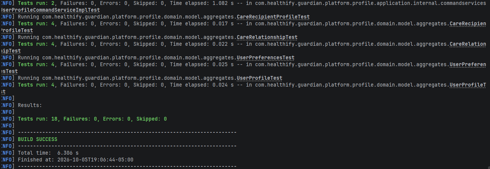

La ejecución comprende un total de **18 Unit Tests** distribuidos entre los cuatro Aggregate Roots principales de Profile y el Application Service `UserProfileCommandServiceImpl`.

Los resultados obtenidos fueron:

- `UserProfileCommandServiceImplTest`: 2 tests ejecutados.
- `CareRecipientProfileTest`: 4 tests ejecutados.
- `CareRelationshipTest`: 4 tests ejecutados.
- `UserPreferencesTest`: 4 tests ejecutados.
- `UserProfileTest`: 4 tests ejecutados.

La ejecución finalizó correctamente con los siguientes resultados:

~~~text
Tests run: 18, Failures: 0, Errors: 0, Skipped: 0
BUILD SUCCESS
~~~

Esto confirma que los Unit Tests implementados para el Bounded Context **Profile** se ejecutan satisfactoriamente y validan los comportamientos definidos tanto en los Aggregate Roots como en el Application Service probado.

##### Integration Tests and Acceptance Tests

Estas pruebas podrán incorporarse en siguientes incrementos cuando se encuentren disponibles las integraciones necesarias entre los diferentes Bounded Contexts y se implementen los flujos funcionales completos correspondientes a los User Stories del producto.


##### Testing Repository

Las pruebas automatizadas de Profile se encuentran dentro del mismo repositorio utilizado para la implementación de los Web Services de Guardian+.

**Repository:**

`upc-pre-202620-1asi0238-13980-Healthify/guardian-plus-platform`

**Branch:**

`feat/profile-bounded-context`

**Testing source path:**

~~~text
src/test/java/com/healthify/guardian/platform/profile
~~~

La estructura principal utilizada para las pruebas es:

~~~text
profile
├── application
│   └── internal
│       └── commandservices
│           └── UserProfileCommandServiceImplTest.java
│
└── domain
    └── model
        └── aggregates
            ├── UserProfileTest.java
            ├── CareRecipientProfileTest.java
            ├── CareRelationshipTest.java
            └── UserPreferencesTest.java
~~~

##### Testing Commits

El commit de la Tabla 4.43 contiene la implementación de los Unit Tests correspondientes al Bounded Context Profile durante el presente Sprint.

<a id="tabla-4-43"></a>**Tabla 4.43.** Commit de los Unit Tests de Profile

| Repository | Branch | Commit Id | Commit Message | Commit Message Body | Committed on (Date) |
|---|---|---|---|---|---|
| `upc-pre-202620-1asi0238-13980-Healthify/guardian-plus-platform` | `feat/profile-bounded-context` | `711c50c` | `test(profile): add unit tests for profile bounded context` | — | `2026-10-03` |

Este commit incorpora las pruebas unitarias correspondientes a los cuatro Aggregate Roots principales de Profile y la prueba del Application Service `UserProfileCommandServiceImpl`.


#### 4.2.1.6. Execution Evidence for Sprint Review

Al cierre del Sprint 1, Guardian+ cuenta con el Landing Page desplegado, con una primera versión de la aplicación móvil y con los Web Services desplegados que esta consume. En el Landing Page se completaron las User Stories US30, US31, US32 y US33: el visitante puede recorrer las secciones del sitio desde el menú, conocer las funcionalidades y beneficios de la pulsera y la aplicación, comparar los planes de suscripción y enviar una solicitud de contacto. En la aplicación móvil se implementaron el inicio de sesión, la pantalla de Inicio, la sección de Salud y la sección de Alertas con sus alertas activas, el detalle de cada alerta, el historial, la configuración de alertas y los contactos de emergencia. Los Web Services exponen los endpoints de Emergency & Alerting, Health Monitoring, Care Routines & Wellness, Mobility & Geofencing y Profile desde su despliegue en Microsoft Azure.

##### Landing Page

El Landing Page se encuentra publicado en [guardian-plus.pages.dev](https://guardian-plus.pages.dev). La Figura 4.5 muestra la sección principal del sitio en su versión de escritorio.

<a id="figura-4-5"></a>**Figura 4.5.** Landing Page en ejecución

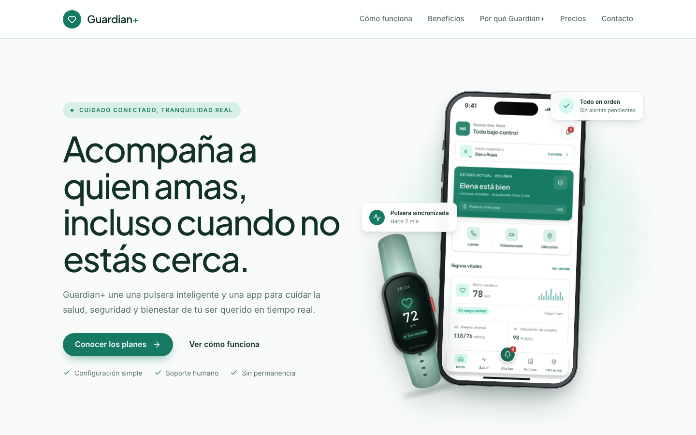

La Tabla 4.44 presenta el enlace al video de ejecución del Landing Page.

<a id="tabla-4-44"></a>**Tabla 4.44.** Video de ejecución del Landing Page

| Producto | Video de ejecución |
|---|---|
| Landing Page | [Guardian+ — Landing Page (Sprint 1)](https://youtu.be/ZqqCONDHst8) |

##### Mobile Application

La Figura 4.6 muestra la pantalla de Inicio de la aplicación móvil ejecutándose en el emulador de Android Studio (Pixel 8, API 37).

<a id="figura-4-6"></a>**Figura 4.6.** Aplicación móvil en ejecución en el emulador

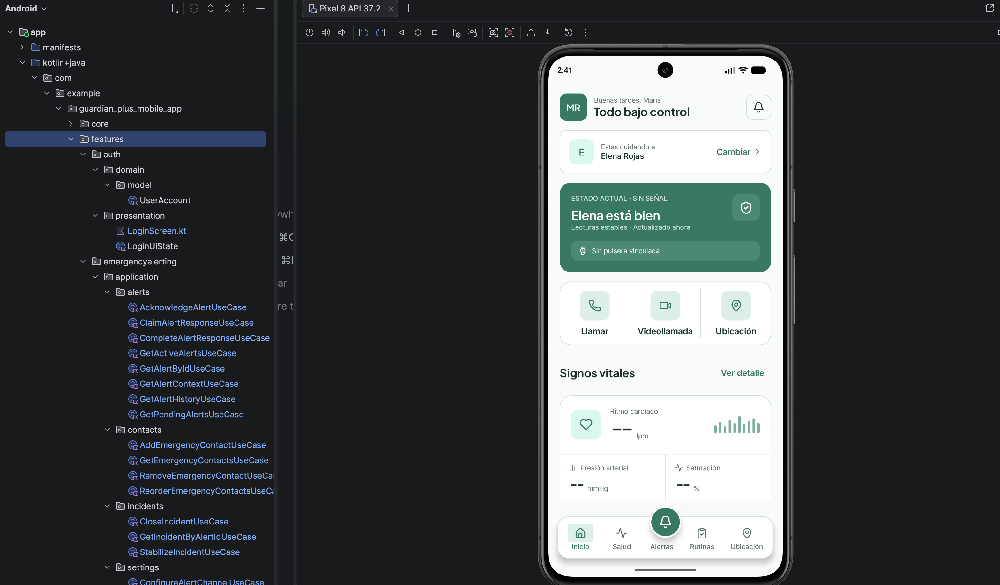

La Tabla 4.45 presenta el enlace al video de ejecución de la aplicación móvil.

<a id="tabla-4-45"></a>**Tabla 4.45.** Video de ejecución de la aplicación móvil

| Producto | Video de ejecución |
|---|---|
| Mobile Application | [Guardian+ — Mobile Application (Sprint 1)](https://www.youtube.com/watch?v=Q-VMpyzhfJM) |

##### Web Services

Los Web Services se encuentran publicados en Microsoft Azure y su documentación puede consultarse en [Swagger UI](https://guardian-plus-api.chilecentral.cloudapp.azure.com/swagger-ui/index.html). La Figura 4.7 muestra los endpoints disponibles en el entorno desplegado.

<a id="figura-4-7"></a>**Figura 4.7.** Web Services en ejecución en Swagger UI

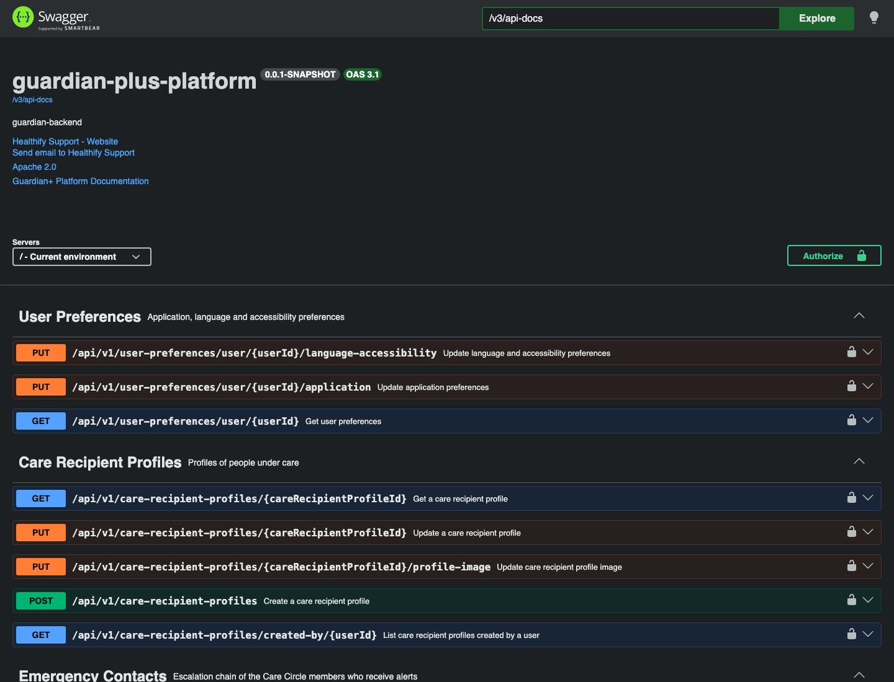

La Tabla 4.46 presenta el enlace al video de ejecución de los Web Services.

<a id="tabla-4-46"></a>**Tabla 4.46.** Video de ejecución de los Web Services

| Producto | Video de ejecución |
|---|---|
| Web Services | [Guardian+ — Web Services (Sprint 1)](https://youtu.be/GIFvYs21GDY) |

#### 4.2.1.7. Services Documentation Evidence for Sprint Review

Los Web Services se documentan con OpenAPI mediante springdoc-openapi. La especificación se publica en `/v3/api-docs` y puede explorarse en Swagger UI (`/swagger-ui/index.html`). Los errores siguen un formato común (`code`, `message`, `details`) con los códigos `400`, `404`, `409` y `422`.

##### Emergency & Alerting

La Tabla 4.47 presenta los endpoints de Emergency & Alerting.

<a id="tabla-4-47"></a>**Tabla 4.47.** Endpoints de Emergency & Alerting

| Verbo | Endpoint | Acción | Parámetros | Respuesta |
|---|---|---|---|---|
| POST | `/api/v1/alerts` | Dispara una alerta de caída o SOS desde el wearable | Body: `careRecipientProfileId`, `sourceType`, `sourceReferenceId` | 201 `AlertResource` |
| GET | `/api/v1/alerts` | Historial paginado | Query: `careRecipientProfileId`, `severity`, `from`, `to`, `page`, `size` | 200 `PageResource` |
| GET | `/api/v1/alerts/active/care-recipient/{careRecipientProfileId}` | Alertas activas de la persona bajo cuidado | Path: `careRecipientProfileId` | 200 lista |
| GET | `/api/v1/alerts/pending/recipient/{userId}` | Alertas pendientes de reconocimiento (canal in-app) | Path: `userId` | 200 lista |
| GET | `/api/v1/alerts/{alertId}` | Detalle con entregas y respuestas | Path: `alertId` | 200 / 404 |
| POST | `/api/v1/alerts/{alertId}/dismiss` | Descarta una caída dentro de los 20 s | Path: `alertId` | 200 / 422 |
| POST | `/api/v1/alerts/{alertId}/acknowledge` | Reconoce la alerta y abre el incidente | Body: `userId` | 200 / 422 |
| POST | `/api/v1/alerts/{alertId}/responses` | Asume la respuesta y avisa al Care Circle | Body: `responderUserId` | 201 / 422 |
| POST | `/api/v1/alerts/{alertId}/responses/{responseId}/complete` | Registra el resultado de la intervención | Body: `notes` | 200 |
| GET | `/api/v1/incidents/{incidentId}` | Detalle del incidente | Path: `incidentId` | 200 / 404 |
| GET | `/api/v1/incidents/alert/{alertId}` | Incidente de una alerta | Path: `alertId` | 200 / 404 |
| POST | `/api/v1/incidents/{incidentId}/stabilize` | Declara estabilizada la situación | Body: `notes` | 200 / 422 |
| POST | `/api/v1/incidents/{incidentId}/close` | Cierra el incidente y resuelve la alerta | Body: `notes` | 200 / 422 |
| GET | `/api/v1/alert-settings/care-recipient/{careRecipientProfileId}` | Configuración de alertamiento | Path: `careRecipientProfileId` | 200 |
| PUT | `/api/v1/alert-settings/care-recipient/{careRecipientProfileId}` | Actualiza tiempo de espera y escalamiento | Body: `primaryAckTimeoutSec`, `escalationEnabled`, `broadcastCriticalImmediately` | 200 / 400 |
| POST / DELETE | `/api/v1/alert-settings/care-recipient/{careRecipientProfileId}/silent-mode` | Activa o desactiva el modo silencioso | Path: `careRecipientProfileId` | 200 |
| GET | `/api/v1/emergency-contacts/care-recipient/{careRecipientProfileId}` | Contactos de emergencia por prioridad | Path: `careRecipientProfileId` | 200 lista |
| POST | `/api/v1/emergency-contacts` | Registra un contacto de emergencia | Body: `careRecipientProfileId`, `userId`, `displayName`, `relationship`, `phoneNumber`, `priorityOrder` | 201 / 400 / 409 |
| PUT | `/api/v1/emergency-contacts/care-recipient/{careRecipientProfileId}/order` | Reordena las prioridades | Body: `orderedEmergencyContactIds` | 200 / 400 |
| DELETE | `/api/v1/emergency-contacts/{emergencyContactId}` | Da de baja un contacto | Path: `emergencyContactId` | 200 / 422 |
| GET | `/api/v1/alert-channel-settings/user/{userId}` | Canales de notificación del usuario | Path: `userId` | 200 lista |
| PUT | `/api/v1/alert-channel-settings/user/{userId}/channels/{channel}` | Habilita o deshabilita un canal | Body: `enabled`, `deviceToken` | 200 / 422 |
| POST | `/api/v1/webhooks/notification-deliveries` | Resultado de una entrega informado por el proveedor | Body: `alertId`, `deliveryId`, `status` | 204 / 404 |

##### Health Monitoring

La Tabla 4.48 presenta los endpoints de Health Monitoring.

<a id="tabla-4-48"></a>**Tabla 4.48.** Endpoints de Health Monitoring

| Verbo | Endpoint | Acción | Parámetros | Respuesta |
|---|---|---|---|---|
| POST | `/api/v1/vital-signs` | Registra una lectura enviada por el wearable y evalúa su rango normal | Body: `wearableDeviceId`, `careRecipientProfileId`, `vitalSignType`, `value`, `measuredAt` | 201 `VitalSignResource` / 400 / 404 / 409 / 422 |
| POST | `/api/v1/vital-signs/batches` | Sincroniza las lecturas almacenadas por el wearable sin conexión | Body: `readings` | 202 `TelemetryBatchResultResource` / 400 / 422 |
| POST | `/api/v1/vital-signs/{vitalSignId}/emit` | Reemite una lectura para la vista en vivo | Path: `vitalSignId` | 200 / 404 / 422 |
| GET | `/api/v1/vital-signs/{vitalSignId}` | Detalle de una lectura | Path: `vitalSignId` | 200 / 404 |
| GET | `/api/v1/vital-signs/live/{careRecipientProfileId}` | Última lectura de cada signo vital con su clasificación | Path: `careRecipientProfileId` | 200 `LiveVitalSignsResource` |
| GET | `/api/v1/vital-signs/history/{careRecipientProfileId}` | Historial de lecturas en un periodo | Path: `careRecipientProfileId`; Query: `from`, `to` | 200 lista / 400 |
| GET | `/api/v1/vital-sign-types` | Tipos de signo vital con rango normal y límites físicos | - | 200 lista |
| POST | `/api/v1/wearable-devices` | Vincula un wearable a la persona bajo cuidado | Body: `careRecipientProfileId`, `serialNumber`, `deviceType` | 201 / 400 / 409 |
| GET | `/api/v1/wearable-devices` | Lista todos los wearables vinculados | - | 200 lista |
| GET | `/api/v1/wearable-devices/care-recipient/{careRecipientProfileId}` | Wearables de la persona bajo cuidado | Path: `careRecipientProfileId` | 200 lista |
| POST | `/api/v1/health-reports` | Genera un reporte de salud del periodo indicado | Body: `careRecipientProfileId`, `generatedByUserId`, `periodStart`, `periodEnd` | 201 `HealthReportResource` / 400 / 422 |
| GET | `/api/v1/health-reports/{reportId}` | Detalle de un reporte de salud | Path: `reportId` | 200 / 404 |
| GET | `/api/v1/health-reports/care-recipient/{careRecipientProfileId}` | Reportes de la persona bajo cuidado, del más reciente al más antiguo | Path: `careRecipientProfileId` | 200 lista |

##### Care Routines & Wellness

La Tabla 4.49 presenta los endpoints de Care Routines & Wellness.

<a id="tabla-4-49"></a>**Tabla 4.49.** Endpoints de Care Routines & Wellness

| Verbo | Endpoint | Acción | Parámetros | Respuesta |
|---|---|---|---|---|
| POST | `/api/v1/reminders` | Programa un recordatorio de medicación, cita, actividad física o hidratación | Body: `personUnderCareId`, `type`, `scheduledTime` | 201 `ReminderResource` / 400 |
| PUT | `/api/v1/reminders/{reminderId}/confirm` | Confirma un recordatorio emitido o reemitido | Path: `reminderId` | 200 / 404 / 422 |
| DELETE | `/api/v1/reminders/{reminderId}` | Cancela un recordatorio programado, emitido o reemitido | Path: `reminderId` | 200 / 404 / 422 |
| GET | `/api/v1/reminders/citizen/{personUnderCareId}` | Lista los recordatorios de la persona bajo cuidado | Path: `personUnderCareId` | 200 lista |
| PUT | `/api/v1/medication-stocks/citizen/{personUnderCareId}/acquisition` | Confirma la adquisición de un envase; crea el stock en la primera adquisición | Path: `personUnderCareId`; Body: `dosesAdded` | 200 `MedicationStockResource` / 400 |
| GET | `/api/v1/medication-stocks/citizen/{personUnderCareId}` | Saldo de dosis y días de suministro proyectados | Path: `personUnderCareId` | 200 / 404 |


Los demás comandos del contexto no se exponen por REST, porque los dispara el sistema, como se detalla en la Tabla 4.50:

<a id="tabla-4-50"></a>**Tabla 4.50.** Procesos de Care Routines & Wellness disparados por el sistema

| Proceso | Componente | Descripción |
|---|---|---|
| Emisión de recordatorios | `ReminderDueCheckScheduler` | Cada 30 s emite los recordatorios `SCHEDULED` cuyo horario se cumplió. Los de hidratación dentro de la ventana de sueño (22:00–06:00, zona `America/Lima`) pasan a `SUPPRESSED`. |
| Reemisión | `ReminderReissueScheduler` | Cada 60 s reemite los recordatorios de medicación `ISSUED` sin confirmar tras 10 minutos. |
| Descuento de stock | `ReminderConfirmedEventHandler` | Al confirmarse un recordatorio de medicación descuenta una dosis y, si quedan 3 días de suministro o menos, genera la sugerencia de reabastecimiento. |
| Telemetría del wearable | `ActivityTelemetryConsumer`, `SleepTelemetryConsumer` | Traducen los mensajes de actividad y sueño a comandos del dominio. La suscripción al broker MQTT se encuentra pendiente de integración. |
| Eventos de integración | `ProlongedInactivityDetectedIntegrationEvent`, `ReminderReissuedIntegrationEvent`, `MedicationRestockSuggestedIntegrationEvent` | Se publican en memoria mediante Spring Application Events para Emergency & Alerting. |

Los umbrales son configurables mediante `care-routines-wellness.*` en `application.properties`: tolerancia de reemisión (10 min), ventana de sueño (22:00–06:00), umbral de reabastecimiento (3 días), consumo diario por defecto (1 dosis) y frecuencia de los schedulers (30 s y 60 s).

##### Mobility & Geofencing

La Tabla 4.51 presenta los endpoints de Mobility & Geofencing, que cubren la administración de zonas seguras y la consulta de la ubicación de la persona bajo cuidado.

<a id="tabla-4-51"></a>**Tabla 4.51.** Endpoints de Mobility & Geofencing

| Verbo | Endpoint | Acción | Parámetros | Respuesta |
|---|---|---|---|---|
| POST | `/api/v1/safe-zones` | Crea una zona segura circular para la persona bajo cuidado | Body: `fragileCitizenId`, `name`, `centerLatitude`, `centerLongitude`, `radiusInMeters` | 201 identificador de la zona segura |
| PUT | `/api/v1/safe-zones/{safeZoneId}` | Actualiza el nombre, el centro y el radio de una zona segura | Path: `safeZoneId`. Body: `name`, `centerLatitude`, `centerLongitude`, `radiusInMeters` | 200 |
| PATCH | `/api/v1/safe-zones/{safeZoneId}/activate` | Activa una zona segura | Path: `safeZoneId` | 200 |
| PATCH | `/api/v1/safe-zones/{safeZoneId}/deactivate` | Desactiva una zona segura | Path: `safeZoneId` | 200 |
| GET | `/api/v1/safe-zones/fragile-citizen/{fragileCitizenId}/active` | Zona segura activa de la persona bajo cuidado | Path: `fragileCitizenId` | 200 `SafeZoneResource` / 404 |
| GET | `/api/v1/location-tracking/{fragileCitizenId}/current` | Última ubicación registrada | Path: `fragileCitizenId` | 200 `CurrentLocationResource` / 404 |
| GET | `/api/v1/location-tracking/{fragileCitizenId}/status` | Estado actual de la ubicación respecto de la zona segura | Path: `fragileCitizenId` | 200 `WITHIN_SAFE_ZONE` u `OUTSIDE_SAFE_ZONE` / 404 |
| GET | `/api/v1/location-tracking/{fragileCitizenId}/history` | Historial de ubicaciones en un rango de tiempo (por defecto, las últimas 24 horas) | Path: `fragileCitizenId`. Query: `start`, `end` | 200 lista de `LocationHistoryResource` |

##### Profile

La Tabla 4.52 presenta los endpoints de Profile, organizados en perfiles de usuario, preferencias, perfiles de personas bajo cuidado y relaciones de cuidado.

<a id="tabla-4-52"></a>**Tabla 4.52.** Endpoints de Profile

| Verbo | Endpoint | Acción | Parámetros | Respuesta |
|---|---|---|---|---|
| POST | `/api/v1/user-profiles` | Crea el perfil de un usuario | Body: `userId`, `firstName`, `lastName`, `phoneNumber`, `profileImageUrl` | 201 `UserProfileResource` / 400 / 409 |
| GET | `/api/v1/user-profiles/user/{userId}` | Perfil de un usuario | Path: `userId` | 200 `UserProfileResource` / 404 |
| PUT | `/api/v1/user-profiles/{userProfileId}` | Actualiza los datos personales | Path: `userProfileId`. Body: `firstName`, `lastName` | 200 `UserProfileResource` / 400 / 404 |
| PUT | `/api/v1/user-profiles/{userProfileId}/contact-information` | Actualiza la información de contacto | Path: `userProfileId`. Body: `phoneNumber` | 200 `UserProfileResource` / 400 / 404 |
| PUT | `/api/v1/user-profiles/{userProfileId}/profile-image` | Actualiza la imagen de perfil | Path: `userProfileId`. Body: `profileImageUrl` | 200 `UserProfileResource` / 404 |
| GET | `/api/v1/user-preferences/user/{userId}` | Preferencias de un usuario | Path: `userId` | 200 `UserPreferencesResource` / 404 |
| PUT | `/api/v1/user-preferences/user/{userId}/application` | Actualiza las preferencias de la aplicación | Path: `userId`. Body: `notificationsEnabled` | 200 `UserPreferencesResource` / 400 |
| PUT | `/api/v1/user-preferences/user/{userId}/language-accessibility` | Actualiza el idioma y las opciones de accesibilidad | Path: `userId`. Body: `language`, `highContrastEnabled`, `reduceMotionEnabled`, `fontScale` | 200 `UserPreferencesResource` / 400 / 404 |
| POST | `/api/v1/care-recipient-profiles` | Crea el perfil de una persona bajo cuidado | Body: `createdByUserId`, `firstName`, `lastName`, `birthDate`, `profileImageUrl` | 201 `CareRecipientProfileResource` / 400 |
| GET | `/api/v1/care-recipient-profiles/{careRecipientProfileId}` | Perfil de una persona bajo cuidado | Path: `careRecipientProfileId` | 200 `CareRecipientProfileResource` / 404 |
| GET | `/api/v1/care-recipient-profiles/created-by/{userId}` | Perfiles de personas bajo cuidado creados por un usuario | Path: `userId` | 200 lista |
| PUT | `/api/v1/care-recipient-profiles/{careRecipientProfileId}` | Actualiza el perfil de una persona bajo cuidado | Path: `careRecipientProfileId`. Body: `firstName`, `lastName`, `birthDate` | 200 `CareRecipientProfileResource` / 400 / 404 |
| PUT | `/api/v1/care-recipient-profiles/{careRecipientProfileId}/profile-image` | Actualiza la imagen de perfil de la persona bajo cuidado | Path: `careRecipientProfileId`. Body: `profileImageUrl` | 200 `CareRecipientProfileResource` / 404 |
| POST | `/api/v1/care-relationships` | Establece una relación de cuidado entre un usuario y una persona bajo cuidado | Body: `userId`, `careRecipientProfileId`, `relationshipType` | 201 `CareRelationshipResource` / 400 / 404 / 409 |
| GET | `/api/v1/care-relationships/user/{userId}` | Relaciones de cuidado activas de un usuario | Path: `userId` | 200 lista |
| GET | `/api/v1/care-relationships/care-recipient/{careRecipientProfileId}` | Relaciones de cuidado activas de una persona bajo cuidado | Path: `careRecipientProfileId` | 200 lista |
| DELETE | `/api/v1/care-relationships/{careRelationshipId}` | Finaliza una relación de cuidado | Path: `careRelationshipId` | 200 `CareRelationshipResource` / 404 / 422 |

#### 4.2.1.8. Software Deployment Evidence for Sprint Review

En este Sprint se realizó el primer despliegue del Landing Page de Guardian+ en Cloudflare Pages y de los Web Services en Microsoft Azure, además del IoT Simulator en Google Cloud, siguiendo la configuración descrita en la sección 4.1.4. En el Landing Page, cada integración en la rama `main` publica automáticamente una nueva versión del sitio; en los Web Services, cada integración en `develop` ejecuta las pruebas y actualiza la API publicada mediante GitHub Actions.

##### Landing Page

La Tabla 4.53 resume el despliegue del Landing Page.

<a id="tabla-4-53"></a>**Tabla 4.53.** Despliegue del Landing Page en el Sprint 1

| Aspecto | Detalle |
|---|---|
| **Plataforma** | Cloudflare Pages |
| **URL pública** | [guardian-plus.pages.dev](https://guardian-plus.pages.dev) |
| **Repositorio** | [guardian-plus-website](https://github.com/upc-pre-202620-1asi0238-13980-Healthify/guardian-plus-website) |
| **Rama de producción** | `main` |
| **Versión desplegada** | `v1.0.0` |
| **Configuración de build** | *Framework preset* `Create React App`, *Build command* `npm run build`, *Build output directory* `build` y `NODE_VERSION` con el valor `24` |

El despliegue se realizó en los pasos de la Tabla 4.54:

<a id="tabla-4-54"></a>**Tabla 4.54.** Pasos del despliegue del Landing Page en el Sprint 1

| Step | Acción | Resultado |
|---|---|---|
| **1** | Integración de la rama `feat/landing-page-first-iteration` en `develop` mediante el Pull Request #1. | Implementación de las User Stories US30, US31, US32 y US33 disponible en la rama de integración. |
| **2** | Creación del proyecto `guardian-plus` en Cloudflare Pages conectado al repositorio. | El primer build, ejecutado sobre el commit inicial de `main`, falló en la instalación de dependencias porque el `package-lock.json` no era compatible con npm 10, versión incluida en el entorno de build. |
| **3** | Creación de la rama `release/v1.0.0` desde `develop`, actualización de la versión a `1.0.0` y regeneración del `package-lock.json` para que `npm ci` funcione con npm 10 y npm 11. | Build y 26 pruebas automatizadas ejecutadas satisfactoriamente sobre una instalación limpia. |
| **4** | Integración de `release/v1.0.0` en `main` mediante el Pull Request #2. | Despliegue automático en Cloudflare Pages y publicación del sitio en la URL pública. |
| **5** | Validación del sitio publicado. | Navegación entre secciones, meta tags de la sección 3.1.2.3 y resultados de Lighthouse verificados. |

La Tabla 4.55 presenta los resultados de Lighthouse sobre la URL pública:

<a id="tabla-4-55"></a>**Tabla 4.55.** Resultados de Lighthouse del Landing Page

| Categoría | Mobile | Desktop |
|---|---|---|
| **Performance** | 71 | 85 |
| **Accessibility** | 97 | 97 |
| **Best Practices** | 100 | 100 |
| **SEO** | 100 | 100 |

La Figura 4.8 muestra el Landing Page publicado.

<a id="figura-4-8"></a>**Figura 4.8.** Landing Page publicado en Cloudflare Pages


##### Web Services

La Tabla 4.56 resume el despliegue de los Web Services.

<a id="tabla-4-56"></a>**Tabla 4.56.** Despliegue de los Web Services en el Sprint 1

| Aspecto | Detalle |
|---|---|
| **Plataforma** | Microsoft Azure (suscripción Azure for Students), región Chile Central |
| **URL pública** | [guardian-plus-api.chilecentral.cloudapp.azure.com](https://guardian-plus-api.chilecentral.cloudapp.azure.com/swagger-ui/index.html) |
| **Repositorio** | [guardian-plus-platform](https://github.com/upc-pre-202620-1asi0238-13980-Healthify/guardian-plus-platform) |
| **Rama desplegada** | `develop` |
| **Infraestructura** | Máquina virtual `guardian-plus-vm` (Ubuntu 24.04, Standard B2ats v2) y Azure Database for PostgreSQL `guardian-plus-db-54c33b` (PostgreSQL 17, Burstable B1ms) |
| **Contenedores en la VM** | `app` (imagen de GHCR) y `caddy` (HTTPS), gestionados con Docker Compose |
| **Automatización** | Workflow `Deploy` de GitHub Actions: `test` → `build` → `deploy` |
| **Bounded Contexts publicados** | Emergency & Alerting, Health Monitoring, Care Routines & Wellness, Mobility & Geofencing y Profile, con 63 rutas documentadas en Swagger UI |

El despliegue se realizó en los pasos de la Tabla 4.57:

<a id="tabla-4-57"></a>**Tabla 4.57.** Pasos del despliegue de los Web Services en el Sprint 1

| Step | Acción | Resultado |
|---|---|---|
| **1** | Integración de la rama `chore/azure-vm-deployment` en `develop` mediante el Pull Request #8, con el `Dockerfile`, los archivos de `deploy/` y los workflows `ci.yml` y `deploy.yml`. | Repositorio preparado para construir la imagen de la API y desplegarla de forma automática. |
| **2** | Creación del grupo de recursos `guardian-plus-rg` en Chile Central, del servidor de Azure Database for PostgreSQL con la base de datos `guardian_plus` y de la máquina virtual `guardian-plus-vm` con la etiqueta DNS `guardian-plus-api`. | Siete recursos creados el 3 de octubre de 2026: la base de datos, la máquina virtual y sus recursos de red y disco. |
| **3** | Instalación de Docker en la máquina virtual y registro del archivo `.env` en `~/guardian-plus`. Registro de `VM_HOST`, `VM_USER` y `VM_SSH_PRIVATE_KEY` en el repositorio de GitHub. | Máquina virtual lista para recibir los despliegues del workflow. |
| **4** | Cambio del disparador del despliegue de `main` a `develop` mediante el Pull Request #10, para validar cada incremento integrado durante el Sprint. | Primera ejecución del workflow `Deploy` completada y API publicada por HTTPS. |
| **5** | Integración de Mobility & Geofencing (Pull Request #11). | El job `test` falló porque el contexto de la aplicación no se cargaba, por lo que el workflow omitió `build` y `deploy` y la versión publicada se mantuvo sin cambios. |
| **6** | Integración de Health Monitoring, Profile y la conexión con el IoT Simulator (Pull Requests #12, #13 y #14). | Tres despliegues consecutivos completados, el último el 6 de octubre de 2026. |
| **7** | Validación de la API publicada. | `/v3/api-docs` y Swagger UI responden por HTTPS, y las solicitudes HTTP se redirigen automáticamente a HTTPS. |

El grupo de recursos `guardian-plus-rg` reúne todos los recursos de Azure de los Web Services, como se muestra en la Figura 4.9.

<a id="figura-4-9"></a>**Figura 4.9.** Grupo de recursos guardian-plus-rg en Azure

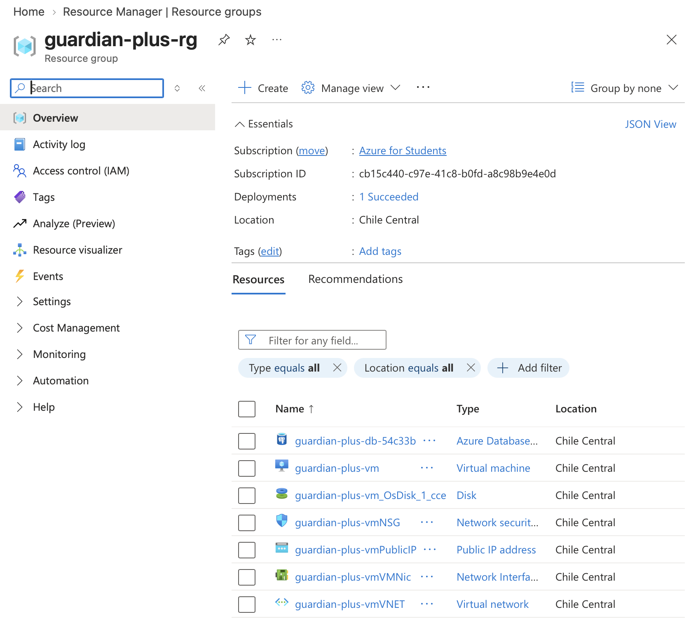

La máquina virtual `guardian-plus-vm` se encuentra en ejecución con el nombre DNS público de la API, como se muestra en la Figura 4.10.

<a id="figura-4-10"></a>**Figura 4.10.** Máquina virtual guardian-plus-vm en Azure

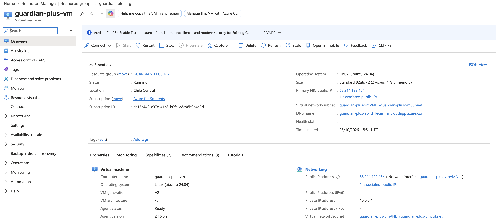

El servidor de Azure Database for PostgreSQL aloja la base de datos `guardian_plus`, como se muestra en la Figura 4.11.

<a id="figura-4-11"></a>**Figura 4.11.** Servidor de Azure Database for PostgreSQL

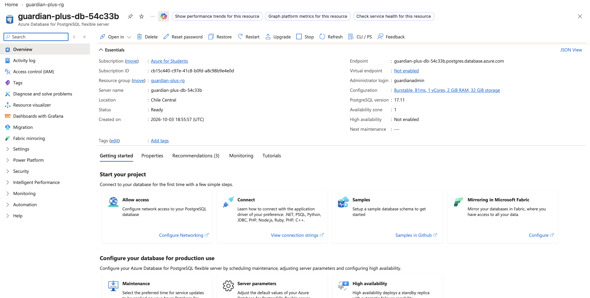

Las ejecuciones de GitHub Actions muestran los workflows `CI`, ejecutado en cada Pull Request, y `Deploy`, ejecutado en cada integración en `develop`, como se muestra en la Figura 4.12.

<a id="figura-4-12"></a>**Figura 4.12.** Ejecuciones de los workflows de GitHub Actions

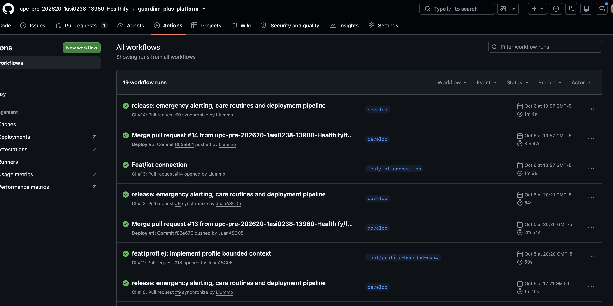

Finalmente, la documentación de los Web Services queda disponible públicamente en Swagger UI, como se muestra en la Figura 4.13.

<a id="figura-4-13"></a>**Figura 4.13.** Documentación de los Web Services en Swagger UI


##### IoT Simulator

En este Sprint se desplegó el IoT Simulator en Google Cloud siguiendo la configuración descrita en la sección 4.1.4. La Tabla 4.58 resume este despliegue.

<a id="tabla-4-58"></a>**Tabla 4.58.** Despliegue del IoT Simulator en el Sprint 1

| Aspecto | Detalle |
|---|---|
| **Plataforma** | Google Cloud Compute Engine, aprovisionada con Terraform |
| **Acceso** | `http://34.45.141.10:5000` (API) y `34.45.141.10:1883` (MQTT), restringido por firewall |
| **Repositorio** | [guardian-plus-iot-simulator](https://github.com/upc-pre-202620-1asi0238-13980-Healthify/guardian-plus-iot-simulator) |
| **Rama desplegada** | `main` |
| **Infraestructura** | VM `e2-small` con Debian 12, IP estática, 2 reglas de firewall y cuenta de servicio con permisos mínimos |
| **Servicios en la VM** | `mosquitto` y `guardian-simulator` (`systemd`, con reinicio automático) |

El despliegue se realizó en los pasos de la Tabla 4.59:

<a id="tabla-4-59"></a>**Tabla 4.59.** Pasos del despliegue del IoT Simulator en el Sprint 1

| Step | Acción | Resultado |
|---|---|---|
| **1** | Instalación de Terraform en Google Cloud Shell, que no lo incluía preinstalado. | Terraform 1.9.8 disponible en el directorio personal. |
| **2** | Configuración de `terraform.tfvars` y ejecución de `terraform init` y `terraform apply`. | Se crearon la IP estática y las dos reglas de firewall. La creación de la cuenta de servicio falló porque la API de IAM estaba deshabilitada en el proyecto. |
| **3** | Habilitación de `iam.googleapis.com` y `cloudresourcemanager.googleapis.com`, y nueva ejecución de `terraform apply`. | Se crearon la cuenta de servicio, sus permisos y la máquina virtual. En total, 8 recursos. |
| **4** | Ejecución del script de arranque de la VM. | Mosquitto y el simulador quedaron instalados y en ejecución como servicios. |
| **5** | Validación del estado en `/health`. | El simulador responde `status: ok`, con `mqttConnected: true` y `loopRunning: true`. |
| **6** | Carga de los wearables desde `GET /api/v1/wearable-devices` y verificación en `/signals`. | El backend devuelve las 4 pulseras registradas (`GP-ESP32-S3-0001` a `GP-ESP32-S3-0004`) y el simulador publica su telemetría: `GET /api/v1/vital-signs/live/{careRecipientProfileId}` entrega lecturas actualizadas cada segundo, con `liveSignal: true`. |


#### 4.2.1.9. Team Collaboration Insights during Sprint

Durante el Sprint 1 (del 6 de septiembre al 6 de octubre de 2026), el equipo trabajó en los repositorios de cada producto mediante ramas por funcionalidad integradas con pull requests. A continuación se muestran las analíticas de colaboración (Pulse) de cada repositorio.

**Backend (Web Services):** 13 pull requests fusionados y 1 abierto, con 180 commits de 5 autores en todas las ramas. La Figura 4.14 muestra los insights del repositorio de los Web Services.

<a id="figura-4-14"></a>**Figura 4.14.** Insights del repositorio de los Web Services

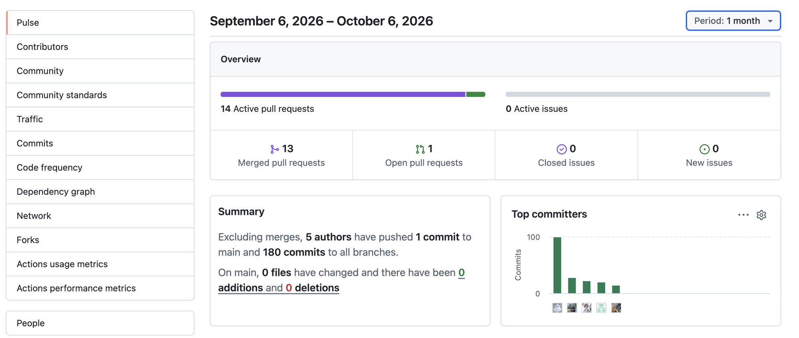

**Mobile App:** 6 pull requests fusionados, con 46 commits de 2 autores en todas las ramas. La Figura 4.15 muestra los insights del repositorio de la aplicación móvil.

<a id="figura-4-15"></a>**Figura 4.15.** Insights del repositorio de la aplicación móvil

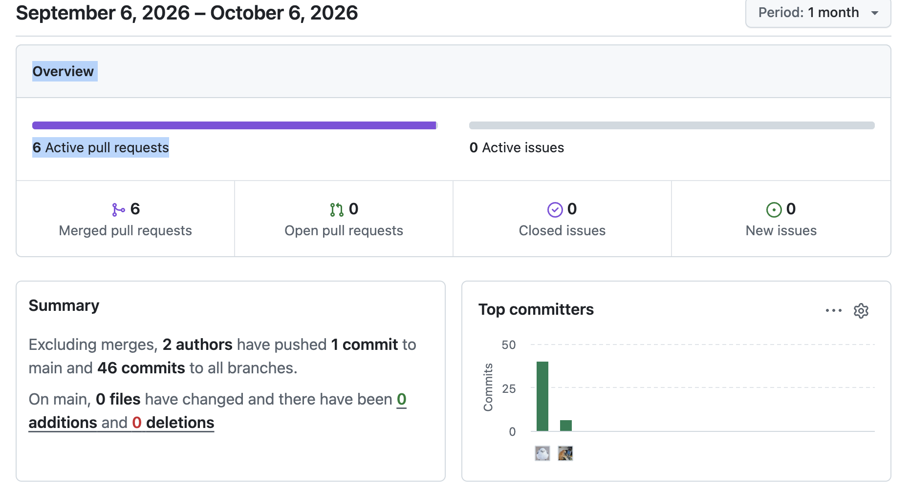

**Website (Landing Page):** 4 pull requests fusionados, con 25 commits de 2 autores en main. La Figura 4.16 muestra los insights del repositorio del Landing Page.

<a id="figura-4-16"></a>**Figura 4.16.** Insights del repositorio del Landing Page

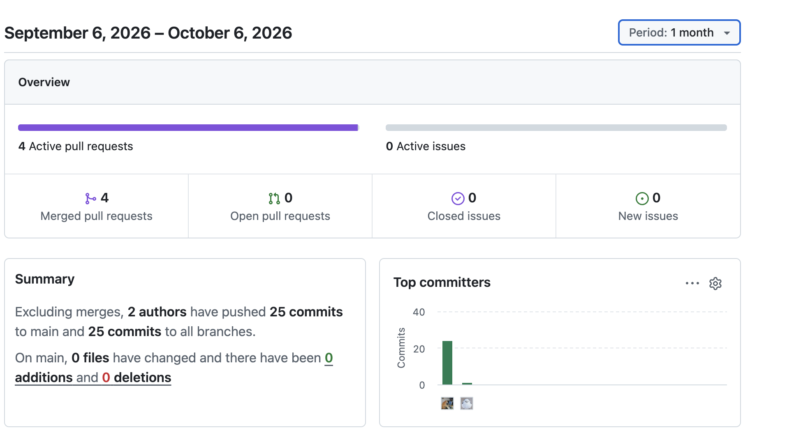

**IoT Simulator:** 1 pull request fusionado, con 7 commits de 1 autor en main. La Figura 4.17 muestra los insights del repositorio del IoT Simulator.

<a id="figura-4-17"></a>**Figura 4.17.** Insights del repositorio del IoT Simulator

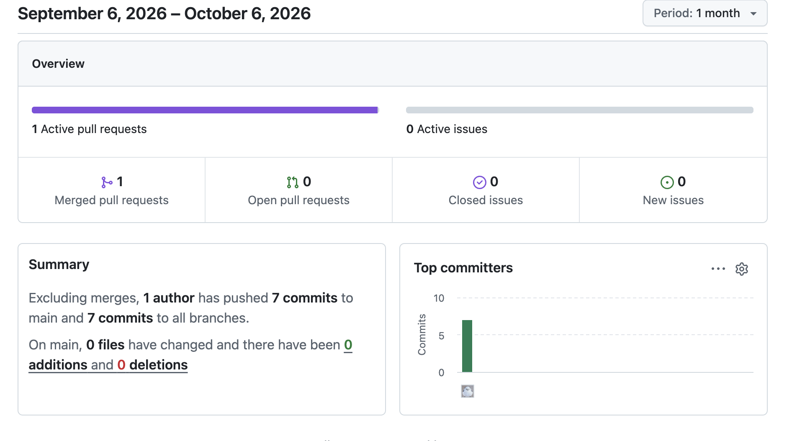

## 4.3. Validation Interviews

En esta sección se presentan las entrevistas de validación del Landing Page realizadas con familiares y cuidadores, junto con su diseño y su registro, y la evaluación heurística del prototipo de la aplicación móvil.

### 4.3.1. Diseño de Entrevistas

La sesión de validación consiste en un recorrido guiado (think-aloud) por el Landing Page de Guardian+, en el mismo orden en que está estructurado el sitio: Hero → Pain Points → Cómo funciona → Pulsera → Beneficios → Tour de la app → Zonas Seguras → Por qué Guardian+ → Planes → Contacto. El objetivo de cada pregunta es verificar si, según su segmento, el entrevistado entiende y percibe el valor real que ofrece Guardian+ en esa sección, por lo que todas las preguntas buscan que el entrevistado se explaye y justifique su respuesta, evitando preguntas cerradas de sí/no.

#### Segmento 1 — Familiares

1. **Hero:** Después de leer esta primera pantalla, ¿qué entiendes que hace Guardian+ por ti y tu familia, en tus propias palabras? ¿Por qué lo entiendes así?
2. **Pain Points:** ¿Cuál de estas tres preguntas refleja mejor una preocupación que tú mismo has tenido con tu familiar, y por qué esa en particular?
3. **Cómo funciona:** ¿Qué entiendes que pasa, paso a paso, si tu familiar sufre una emergencia? ¿Qué parte del proceso te queda más clara y cuál más confusa?
4. **Pulsera:** ¿Cuáles de estas funciones de la pulsera usarías con tu familiar, y qué tranquilidad específica te daría cada una?
5. **Beneficios:** ¿Cuáles de estos seis beneficios te parecen más importantes para decidir si usarías Guardian+, y qué necesidad tuya resuelve cada uno?
6. **Tour de la app:** Al ver la pantalla de Inicio ¿qué tan bien reflejan la forma en que tú querrías enterarte del estado de tu familiar durante el día? ¿Por qué?
7. **Zonas Seguras:** ¿De qué manera esta función cambiaría tu tranquilidad o tu rutina actual con tu familiar? ¿Por qué?
8. **Por qué Guardian+:** ¿Qué tan identificado te sientes con el testimonio mostrado, y qué parte de esa historia se parece más a la tuya?
9. **Planes:** Viendo los tres planes, ¿cuál elegirías para tu familia y qué fue lo que más pesó en tu decisión?
10. **Contacto:** Si tuvieras dudas sobre qué plan elegir, ¿qué información esperarías recibir al usar este formulario de contacto?

#### Segmento 2 — Cuidadores

1. **Hero:** Si estuvieras buscando una herramienta que te apoye en tu trabajo de cuidado, ¿qué entiendes que te ofrece Guardian+ a partir de esta pantalla? ¿Por qué lo entiendes así?
2. **Pain Points:** ¿Cuál de estas preguntas representa mejor un riesgo que tú monitoreas en tu trabajo diario, y por qué ese en particular?
3. **Cómo funciona:** Viendo estos 3 pasos, ¿en qué se parece o se diferencia esto de cómo actúas tú actualmente ante una emergencia con tu paciente?
4. **Pulsera:** ¿Cuáles de estas funciones de la pulsera usarías en tu trabajo diario, y qué problema puntual de tu rutina de cuidado te resolvería cada una?
5. **Beneficios:** ¿Cuáles de estos beneficios te ahorrarían tiempo o esfuerzo en tu rutina diaria de cuidado, y de qué manera lo harían?
6. **Tour de la app:** Al ver la pantalla de Inicio con el estado del paciente, ¿qué tan útil te resulta esa información para hacer seguimiento durante tu jornada? ¿Qué le agregarías o quitarías?
7. **Zonas Seguras:** ¿De qué manera esta función reduciría la supervisión constante que haces actualmente? ¿Por qué?
8. **Por qué Guardian+:** Como cuidador profesional, ¿qué tanta confianza te generan estos diferenciadores frente a lo que usas hoy, y por qué?
9. **Planes:** Si tú recomendaras un plan a la familia de tu paciente, ¿cuál sugerirías según las necesidades que observas en tu trabajo, y por qué ese?
10. **Contacto:** Si necesitaras orientación sobre el plan adecuado para tu paciente, ¿qué información esperarías recibir al usar este formulario de contacto?

### 4.3.2. Registro de Entrevistas

A continuación se presenta el registro de las entrevistas de validación del Landing Page, incluyendo la ficha de cada entrevistado, la captura de pantalla correspondiente y el análisis de sus respuestas.

##### Segmento 1: Familiares

**Entrevistado 1**

**Enlace a la grabación de la entrevista:** [Ver grabación en SharePoint](https://upcedupe-my.sharepoint.com/:v:/g/personal/u20241b843_upc_edu_pe/IQBKYPpWt5CVTKNKT1KQHr26Aaz4_Jr5SuOov7l5OLCPyUE?e=EdUJcA&nav=eyJyZWZlcnJhbEluZm8iOnsicmVmZXJyYWxBcHAiOiJTdHJlYW1XZWJBcHAiLCJyZWZlcnJhbFZpZXciOiJTaGFyZURpYWxvZy1MaW5rIiwicmVmZXJyYWxBcHBQbGF0Zm9ybSI6IldlYiIsInJlZmVycmFsTW9kZSI6InZpZXcifX0%3D)

La Tabla 4.60 presenta los datos de la entrevistada.

<a id="tabla-4-60"></a>**Tabla 4.60.** Datos de la entrevista de validación a Rocio Alvarado

| Campo | Valor |
|---|---|
| Nombre y apellido | Rocío Miranda Alvarado Silva |
| Edad | 22 |
| Distrito | Jesus María |

La Figura 4.18 muestra una captura de la entrevista de validación a Rocio Alvarado.

<a id="figura-4-18"></a>**Figura 4.18.** Captura de la entrevista de validación a Rocio Alvarado

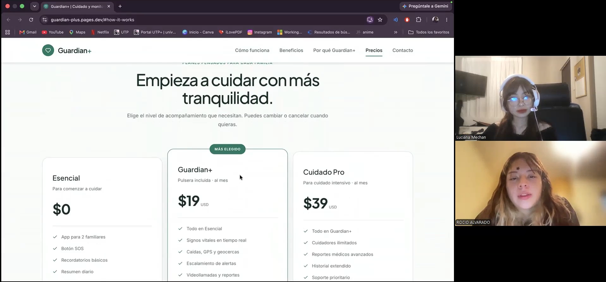

**Análisis de la entrevista:** Rocío Alvarado, familiar de una persona con esquizofrenia, recorrió el Landing Page completo y mostró una comprensión clara de la propuesta de valor de Guardian+. Al leer la pantalla inicial lo describió como una app con pulsera inteligente que acompaña a quienes necesitan cuidados, y calificó la sección "Cómo funciona" como sencilla y fácil de entender, sin dudas en ninguno de sus tres pasos. De las preocupaciones de la sección Pain Points se identificó con la pregunta sobre la medicación, porque su familiar requiere medicación constante y una rutina estable. Coherentemente con ello, valoró del apartado de la pulsera el recordatorio con vibración y la confirmación de la toma con un solo toque, y eligió "Rutinas sin olvidos" como el beneficio más importante, ya que le permite asegurar que se cumplan la medicación y las citas.

Sobre el resto de secciones, indicó que la pantalla de Inicio de la app refleja muy bien la forma en que quiere enterarse del estado de su familiar durante el día, porque muestra lo primordial y le daría más confianza. Respecto a las Zonas Seguras, destacó que le alertarían si su familiar sale de casa, algo relevante por el riesgo de que se pierda o le ocurra algún incidente. También se sintió identificada con el testimonio, pues trabaja y estar informada le da tranquilidad mientras está fuera. Entre los planes, eligió Guardian+ porque incluye la pulsera, cubre lo esencial y se adecúa a su presupuesto. Finalmente, del formulario de contacto esperaría recibir atención de un operador que resuelva sus dudas por teléfono, correo o WhatsApp.

**Entrevistado 2**

**Enlace a la grabación de la entrevista:** [Ver grabación en SharePoint](https://upcedupe-my.sharepoint.com/:v:/g/personal/u20241d185_upc_edu_pe/IQABOx69dgUqQJVteesEI7SjAdyRmsIZdNLA461ekIXLgtg?e=7FNzjH)

La Tabla 4.61 presenta los datos del entrevistado.

<a id="tabla-4-61"></a>**Tabla 4.61.** Datos de la entrevista de validación a Junior Antenor

| Campo | Valor |
|---|---|
| Nombre y apellido | Junior Antenor Ayala |
| Edad | 33 |
| Distrito | San Juan Bautista |

La Figura 4.19 muestra una captura de la entrevista de validación a Junior Antenor.

<a id="figura-4-19"></a>**Figura 4.19.** Captura de la entrevista de validación a Junior Antenor

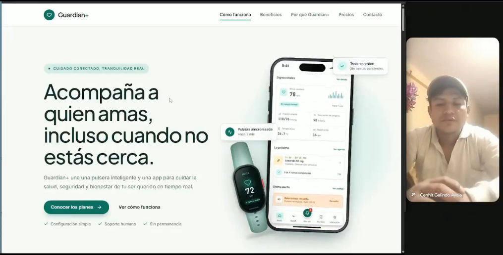

**Análisis de la entrevista:** El entrevistado entiende Guardián+ como una plataforma que utiliza una pulsera inteligente para monitorear la salud, ubicación y seguridad de un familiar, destacando su utilidad para recibir alertas ante situaciones como caídas, problemas de salud o falta de respuesta. Considera especialmente valiosas la geolocalización, las alertas y las opciones de comunicación, ya que le permitirían reaccionar con mayor rapidez ante una emergencia y reducir la preocupación durante el día, incluso mientras trabaja o se encuentra lejos de su familiar. También percibe como útiles funciones como el monitoreo de signos vitales, rutinas y recordatorios de medicamentos, calificando la propuesta como completa. En cuanto a los planes, muestra interés por el plan más avanzado, aunque señala que inicialmente podría comenzar con el de $19 para conocer mejor el funcionamiento de la plataforma. Finalmente, espera que el formulario de contacto presente información breve, directa, clara y sin términos técnicos.


##### Segmento 2: Cuidadores

**Entrevistado 1**

**Enlace a la grabación de la entrevista:** [Ver grabación en SharePoint](https://upcedupe-my.sharepoint.com/:v:/g/personal/u202411310_upc_edu_pe/IQD8oJT2Z8TpSoJBUXSMSMGhAfeo7eDVGKMqM2Pu5ygx8Ys?e=Uh9lJl&nav=eyJyZWZlcnJhbEluZm8iOnsicmVmZXJyYWxBcHAiOiJTdHJlYW1XZWJBcHAiLCJyZWZlcnJhbFZpZXciOiJTaGFyZURpYWxvZy1MaW5rIiwicmVmZXJyYWxBcHBQbGF0Zm9ybSI6IldlYiIsInJlZmVycmFsTW9kZSI6InZpZXcifX0%3D)

La Tabla 4.62 presenta los datos de la entrevistada.

<a id="tabla-4-62"></a>**Tabla 4.62.** Datos de la entrevista de validación a Roxana Paola Diana

| Campo | Valor |
|---|---|
| Nombre y apellido | Roxana Paola Diana |
| Edad | 39 |
| Distrito | Surco |

La Figura 4.20 muestra una captura de la entrevista de validación a Roxana Paola Diana.

<a id="figura-4-20"></a>**Figura 4.20.** Captura de la entrevista de validación a Roxana Paola Diana

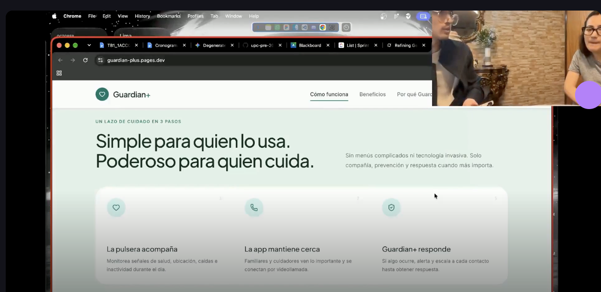

**Análisis de la entrevista:** Roxana Paola Diana recorrió el Landing Page de Guardian+ y validó la mayoría de sus secciones, comprendiendo la propuesta de valor y el funcionamiento del servicio a partir de la pulsera, la aplicación y la respuesta ante emergencias. Desde su experiencia como cuidadora, consideró que la información más relevante del sitio es la detección de caídas, el recordatorio de medicaciones, la detección de signos vitales y el envío de alertas, ya que son los aspectos que más se relacionan con su rutina diaria de cuidado. Como oportunidad de mejora, sugirió hacer el Landing Page más dinámico para captar mejor la atención del visitante durante el recorrido.

**Entrevistado 2**

**Enlace a la grabación de la entrevista:** [Ver grabación en SharePoint](https://upcedupe-my.sharepoint.com/:v:/g/personal/u202319404_upc_edu_pe/IQDoaeLwjz7pRrzg8-g7O6AzAdLOTQcjJpGE6qaMDAqHBEg?nav=eyJyZWZlcnJhbEluZm8iOnsicmVmZXJyYWxBcHAiOiJPbmVEcml2ZUZvckJ1c2luZXNzIiwicmVmZXJyYWxBcHBQbGF0Zm9ybSI6IldlYiIsInJlZmVycmFsTW9kZSI6InZpZXciLCJyZWZlcnJhbFZpZXciOiJNeUZpbGVzTGlua0NvcHkifX0&e=5m6P3a)

La Tabla 4.63 presenta los datos del entrevistado.

<a id="tabla-4-63"></a>**Tabla 4.63.** Datos de la entrevista de validación a Piero Segurda Cardenas

| Campo | Valor |
|---|---|
| Nombre y apellido | Piero Segurda Cardenas |
| Edad | 20 |
| Distrito | Callao |

La Figura 4.21 muestra una captura de la entrevista de validación a Piero Segurda Cardenas.

<a id="figura-4-21"></a>**Figura 4.21.** Captura de la entrevista de validación a Piero Segurda Cardenas

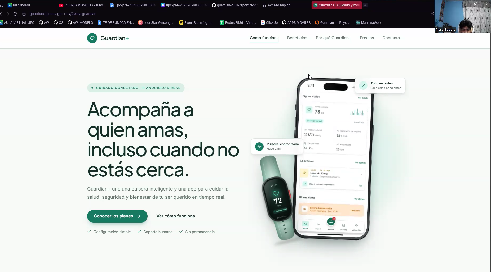

**Análisis de la entrevista:** Piero comprendió que Guardian+ integra una pulsera y una aplicación para centralizar el seguimiento de la salud, la seguridad, las rutinas y las alertas de la persona bajo cuidado. Desde su experiencia como cuidador, destacó principalmente la detección automática de caídas, el botón SOS, la ubicación mediante GPS y el escalamiento de alertas, ya que estas funciones podrían ayudarle a reaccionar con mayor rapidez cuando no se encuentra junto al paciente. También valoró que la aplicación reúna signos vitales, medicación, pendientes y alertas en un solo lugar, lo que facilitaría el seguimiento diario, la entrega de turnos y la coordinación con familiares u otros cuidadores. Como oportunidades de mejora, señaló la necesidad de aclarar quién confirma la atención de una emergencia, diferenciar la confirmación de un recordatorio de la toma real de un medicamento, incorporar pendientes y observaciones del cuidador, y evitar inconsistencias visuales como mostrar notificaciones cuando el estado general indica que el paciente se encuentra bien. Asimismo, consideró útiles las zonas seguras para pacientes con riesgo de desorientación, aunque indicó que permanecer dentro de una zona no garantiza por sí solo su bienestar. Finalmente, manifestó interés por los planes Guardian+ y Cuidado Pro, pero señaló que antes de contratar necesitaría conocer con claridad el costo total, la autonomía y conectividad de la pulsera, la precisión de las mediciones y el procedimiento de respuesta ante emergencias, considerando una demostración del servicio como un elemento importante para generar confianza.

**Entrevistado 3**

**Enlace a la grabación de la entrevista:** [Ver grabación en SharePoint](https://upcedupe-my.sharepoint.com/:v:/g/personal/u20241d185_upc_edu_pe/IQB7Nk6PrMXqS5-kBKUcezySARYOt3pUCZya8d1mWq2jZBE?e=0Sqbtb)

La Tabla 4.64 presenta los datos de la entrevistada.

<a id="tabla-4-64"></a>**Tabla 4.64.** Datos de la entrevista de validación a Gabriela Cuadros

| Campo | Valor |
|---|---|
| Nombre y apellido | Gabriela Cuadros Curihuaman |
| Edad | 21 |
| Distrito | Santa Anita |

La Figura 4.22 muestra una captura de la entrevista de validación a Gabriela Cuadros.

<a id="figura-4-22"></a>**Figura 4.22.** Captura de la entrevista de validación a Gabriela Cuadros

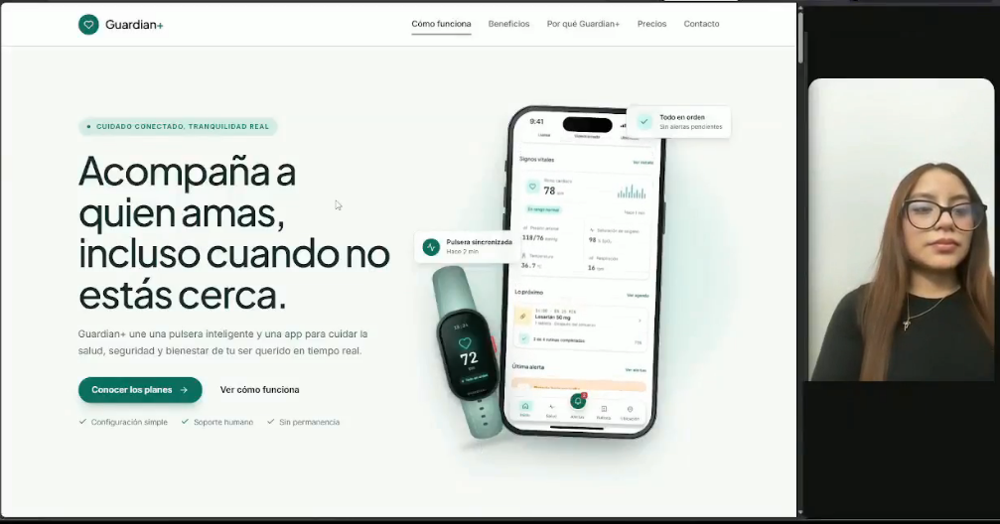

**Análisis de la entrevista:**  Gabriela entiende Guardián+ como una herramienta integral que combina una pulsera inteligente para monitorear la salud y seguridad del paciente, recibir alertas y mantener conectado al círculo de cuidado. Considera que el principal riesgo que monitorea diariamente son las caídas, especialmente cuando no tiene al paciente a la vista, y valora funciones como el botón SOS, la detección de caídas y las alertas automáticas, ya que reducirían su esfuerzo y la necesidad de supervisión constante. También encuentra útil un dashboard que concentre signos vitales, recordatorios, alertas y cambios importantes, siempre que la información sea clara y no esté saturada. Las zonas seguras y la geolocalización le permitirían reducir el monitoreo continuo, mientras que destaca como diferencial la integración de seguridad, salud, rutinas y comunicación, junto con un sistema de escalamiento de alertas. Para un paciente con necesidades intensivas recomendaría el plan Cuidado Pro, por sus cuidados ilimitados, reportes avanzados, historial extendido y soporte prioritario. Finalmente, espera que el formulario de contacto proporcione una comparación clara de planes, precios y funciones, además de información sobre la pulsera, configuración de alertas y privacidad de datos.

### 4.3.3. Evaluaciones según heurísticas

La evaluación heurística se realizó sobre el prototipo de alta fidelidad de la aplicación móvil, considerando principios de usabilidad, diseño inclusivo y arquitectura de información. A continuación se presentan su alcance, las tareas evaluadas y los problemas encontrados con su severidad y recomendación.

#### UX Heuristics & Principles Evaluation
**Usability - Inclusive Design - Information Architecture**

La Tabla 4.65 presenta los datos generales de la evaluación.

<a id="tabla-4-65"></a>**Tabla 4.65.** Datos generales de la evaluación heurística

| | |
|---|---|
| **CARRERA** | Ingeniería de Software |
| **CURSO** | 1ACC0238 Aplicaciones para dispositivos móviles |
| **NRC** | 13980 |
| **PROFESORES** | Todos |
| **AUDITOR** | Healthify |
| **CLIENTE(S)** | Azama Fukuda, Juan Pablo, Mechan Montenegro, Luciana Carolina,Luis Miranda, Diego Andres, López Monroy, Rodrigo Alfredo, Sanchez Cuadrado, Juan Antonio |

**SITE o APP A EVALUAR:** Guardian+ (prototipo de alta fidelidad — módulos de Salud, Alertas, Rutinas y Ubicación)

**TAREAS A EVALUAR:**

El alcance de esta evaluación incluye la revisión de la usabilidad de las siguientes tareas:

1. Programar un nuevo recordatorio de medicación, cita médica o actividad (Care Routines & Wellness)
2. Consultar el historial de signos vitales y aplicar filtros de búsqueda (Health Monitoring)
3. Exportar el expediente de signos vitales seleccionando un periodo de tiempo (Health Monitoring)
4. Agregar, editar y reordenar contactos de emergencia (Emergency & Alerting)

No están incluidas en esta versión de la evaluación las siguientes tareas:

1. Gestión de planes de suscripción y pagos
2. Configuración de cuenta e IAM (inicio de sesión, recuperación de contraseña)
3. Ubicación en tiempo real, zonas seguras y videollamada
4. Flujo de onboarding inicial del wearable

**ESCALA DE SEVERIDAD:**

La Tabla 4.66 define la escala de severidad utilizada.

<a id="tabla-4-66"></a>**Tabla 4.66.** Escala de severidad de la evaluación heurística

| Nivel | Descripción |
|---|---|
| 1 | Problema superficial: Puede ser fácilmente superado por el usuario y ocurre con muy poca frecuencia. No necesita ser arreglado a no ser que exista disponibilidad de tiempo. |
| 2 | Problema menor: Puede ocurrir un poco más frecuentemente o es un poco más difícil de superar para el usuario. Se le debería asignar una prioridad baja para resolverlo de cara al siguiente release. |
| 3 | Problema mayor: Ocurre frecuentemente o los usuarios no son capaces de resolverlos. Es importante que sean corregidos y se les debe asignar una prioridad alta. |
| 4 | Problema muy grave: Un error de gran impacto que impide al usuario continuar con el uso de la herramienta. Es imperativo que sea corregido antes del lanzamiento. |


**TABLA RESUMEN:**

La Tabla 4.67 resume los problemas encontrados.

<a id="tabla-4-67"></a>**Tabla 4.67.** Resumen de problemas de la evaluación heurística

| # | Problema | Escala de severidad | Heurística/Principio violada(o) |
|---|---|---|---|
| 1 | Los campos de fecha/hora en "Nueva toma", "Nueva cita" y "Nueva actividad" se muestran vacíos, sin placeholder ni formato de referencia (ej. HH:MM) | 2 | Usability: Prevención de errores |
| 2 | El reordenamiento de contactos de emergencia solo puede hacerse mediante gesto de "mantener presionado y arrastrar", sin alternativa accesible (botones subir/bajar) | 3 | Inclusive Design: Proporciona experiencias comparables |
| 3 | Las opciones del panel "Buscar y filtrar" se muestran como filas de texto plano, sin checkbox ni indicador visual de selección, pese a ser una selección múltiple con contador ("Aplicar · 0") | 2 | Usability: Reconocimiento antes que recuerdo |
| 4 | En "Exportar expediente", las opciones de periodo se listan en orden "Últimos 30 días" → "Últimos 7 días", invirtiendo la progresión lógica de menor a mayor duración | 1 | Information Architecture: Organization Systems |
| 5 | El gráfico de "Sueño" usa tonos de verde muy similares entre sí (Profundo/Ligero) junto con un tono naranja (Despierta) para diferenciar tres estados, sin patrón o textura adicional | 2 | Inclusive Design: Proporciona experiencias comparables |


**PROBLEMA #1: Campos de fecha/hora sin placeholder ni formato de referencia**

**Severidad:** 2
**Heurística violada:** Usability - Prevención de errores

**Problema:**
En las pantallas "Nueva toma", "Nueva cita" y "Nueva actividad" del módulo de Rutinas, los campos "Hora de la toma", "Fecha"/"Hora" y "Hora del aviso" se muestran como recuadros completamente vacíos, sin placeholder (ej. "14:00" o "HH:MM") ni un ícono de reloj/calendario que indique que son selectores. Esto contrasta con el formulario "Nuevo contacto de emergencia" del módulo de Alertas, que sí incluye placeholders claros (ej. "Ej. Carlos Rojas", "999 999 999"), evidenciando además una inconsistencia de patrones entre bounded contexts.

Las Figuras 4.23 a 4.25 muestran las pantallas Nueva toma, Nueva cita y Nueva actividad.

<a id="figura-4-23"></a>**Figura 4.23.** Pantalla Nueva toma del módulo de Rutinas

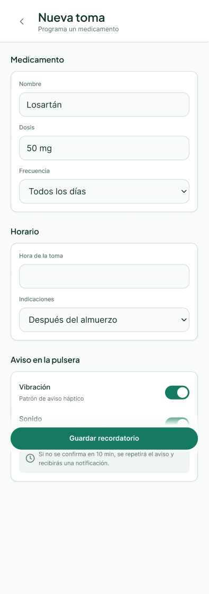

<a id="figura-4-24"></a>**Figura 4.24.** Pantalla Nueva cita del módulo de Rutinas

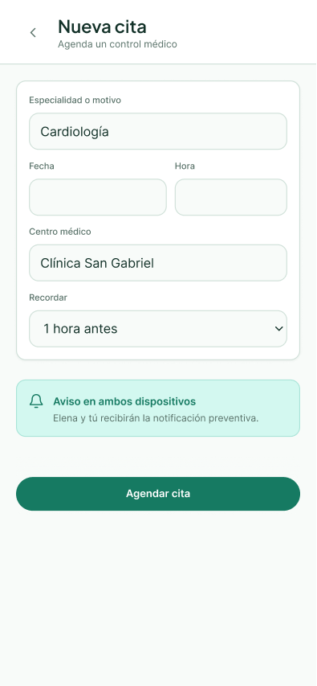

<a id="figura-4-25"></a>**Figura 4.25.** Pantalla Nueva actividad del módulo de Rutinas

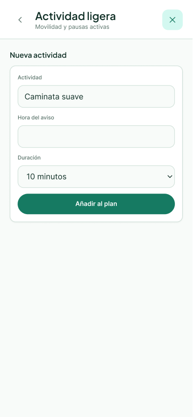

**Recomendación:**
Agregar placeholders con el formato esperado y un ícono reconocible de reloj/calendario en todos los campos de fecha/hora, replicando el estándar de placeholders ya usado en el módulo de contactos de emergencia.

---
**PROBLEMA #2: Reordenamiento de contactos de emergencia sin alternativa accesible al gesto de arrastre**

**Severidad:** 3
**Heurística violada:** Inclusive Design - Proporciona experiencias comparables

**Problema:**
En "Contactos de emergencia", el único mecanismo para cambiar la prioridad de un contacto es "Mantén presionado y arrastra", un gesto que puede ser difícil de ejecutar con precisión para usuarios con limitaciones motrices o destreza reducida —un perfil de usuario especialmente relevante considerando que muchos cuidadores y familiares de Guardian+ son personas de edad avanzada. No se ofrece una alternativa como botones de subir/bajar o un menú de "mover a posición". La Figura 4.26 muestra la pantalla Contactos de emergencia.

<a id="figura-4-26"></a>**Figura 4.26.** Pantalla Contactos de emergencia

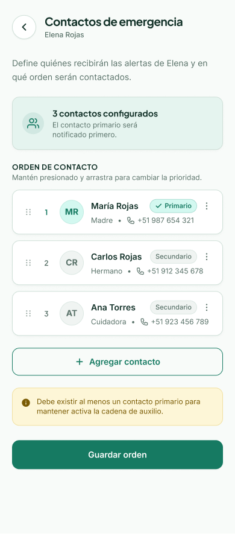

**Recomendación:**
Agregar una alternativa accesible al drag-and-drop, como botones de flecha arriba/abajo en el menú de tres puntos de cada contacto, o una opción "Cambiar prioridad" dentro de "Editar contacto".

---

**PROBLEMA #3: Opciones de filtro sin indicador visual de selección**

**Severidad:** 2
**Heurística violada:** Usability - Reconocimiento antes que recuerdo

**Problema:**
En el panel "Buscar y filtrar" del módulo Salud, las opciones (Ritmo cardíaco, Presión arterial, Día, Semana, etc.) se muestran como filas de texto plano, sin checkbox, radio button ni ningún indicador visual de selección. Sin embargo, el botón inferior "Aplicar · 0" confirma que se trata de una selección múltiple con conteo. El usuario no puede reconocer a simple vista qué opciones están disponibles para seleccionar ni cuáles ya eligió. La Figura 4.27 muestra el panel Buscar y filtrar del módulo de Salud.

<a id="figura-4-27"></a>**Figura 4.27.** Panel Buscar y filtrar del módulo de Salud

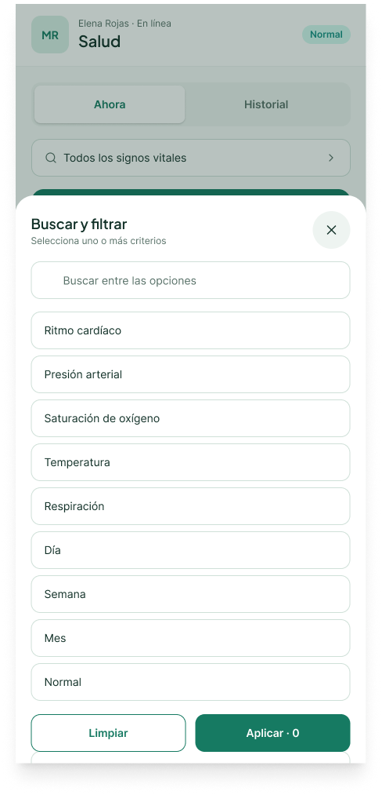

**Recomendación:**
Agregar checkboxes o un estado visual claro (cambio de fondo/borde) a cada fila seleccionada, de forma que el usuario pueda reconocer su selección sin necesidad de recordarla.

---

**PROBLEMA #4: Orden no intuitivo de las opciones de periodo**

**Severidad:** 1
**Heurística violada:** Information Architecture - Organization Systems

**Problema:**
En "Exportar expediente", las opciones de periodo se presentan en el orden "Últimos 30 días" → "Últimos 7 días" → "Personalizado", invirtiendo la progresión lógica esperada de menor a mayor duración (7 días antes que 30 días), lo que puede dificultar que el usuario escanee rápidamente la opción que busca. La Figura 4.28 muestra la pantalla Exportar expediente.

<a id="figura-4-28"></a>**Figura 4.28.** Pantalla Exportar expediente

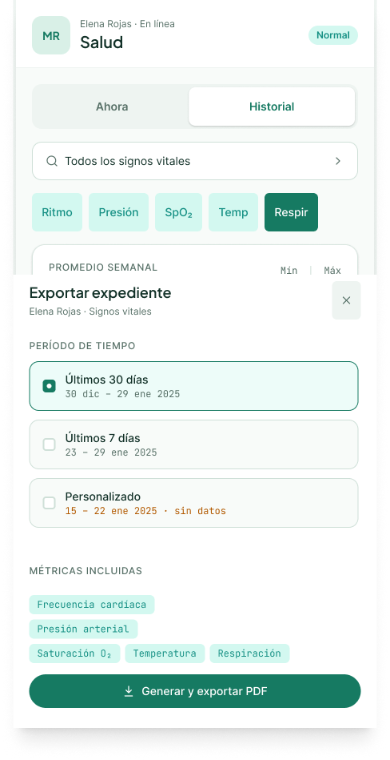

**Recomendación:**
Reordenar las opciones de forma ascendente: "Últimos 7 días", "Últimos 30 días", "Personalizado".

---

**PROBLEMA #5: Diferenciación de estados de sueño basada en tonos de color muy similares**

**Severidad:** 2
**Heurística violada:** Inclusive Design - Proporciona experiencias comparables

**Problema:**
En la pantalla "Sueño", el gráfico de barras distingue tres estados (Profundo, Ligero, Despierta) usando dos tonos de verde muy cercanos entre sí y un tono naranja, sin ningún patrón, textura o forma adicional que refuerce la diferencia. Para personas con daltonismo (especialmente deuteranopia, la forma más común), distinguir entre los dos tonos de verde puede ser difícil, dejándolos sin una forma confiable de leer el gráfico. La Figura 4.29 muestra la pantalla Sueño del módulo de Rutinas.

<a id="figura-4-29"></a>**Figura 4.29.** Pantalla Sueño del módulo de Rutinas

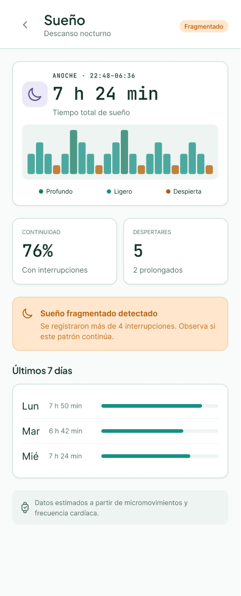

**Recomendación:**
Usar colores con mayor contraste entre sí (ej. verde oscuro, celeste y naranja) o agregar un patrón/textura distinto a cada barra además del color, siguiendo WCAG 1.4.1 (no depender únicamente del color para transmitir información).

<div style="page-break-before: always; break-before: page;"></div>

# Conclusiones y recomendaciones

A partir del trabajo realizado, el equipo logró confirmar la vigencia del Problem Statement planteado para Guardian+: tanto los familiares como los cuidadores de personas con necesidades especiales enfrentan dificultades reales para supervisar el bienestar de quienes están a su cargo cuando no pueden estar físicamente presentes, careciendo actualmente de herramientas tecnológicas especializadas que les brinden información oportuna ante emergencias o problemas de salud. Este hallazgo se sustenta directamente en el análisis de entrevistas realizado a ambos segmentos, donde el 100% de los participantes manifestó preocupación por la seguridad de su familiar o paciente durante periodos de ausencia, así como interés en recibir alertas y monitorear indicadores de salud a distancia.

En cuanto a los Assumptions definidos durante el proceso de Lean UX, los User Assumptions y User Outcome Assumptions relacionados con la necesidad de tranquilidad, reducción de la carga de supervisión y acceso a información en tiempo real se vieron reforzados por los resultados del Needfinding, evidenciando que ambos segmentos comparten una motivación común centrada en la seguridad, aunque con matices distintos: los familiares priorizan la tranquilidad de saber a distancia que su familiar se encuentra bien y de ser avisados a tiempo ante una emergencia, mientras que los cuidadores priorizan centralizar el seguimiento de signos vitales, medicación y alertas para reducir la carga que genera la supervisión constante.

El diseño estratégico con Domain-Driven Design permitió organizar la solución en siete Bounded Contexts, con Emergency & Alerting y Health Monitoring como Core Domain, y definir sus relaciones mediante eventos de integración que mantienen a cada contexto independiente. Este modelo guió tanto el diseño de la aplicación móvil, cuya navegación se organiza en las secciones Inicio, Salud, Alertas, Rutinas y Ubicación, como la estructura de los Web Services, que replican en su código los mismos contextos y capas.

Al cierre del Sprint 1, Guardian+ cuenta con el Landing Page desplegado en Cloudflare Pages, con las User Stories US30 a US33 completadas, y con una primera versión de la aplicación móvil que incluye el inicio de sesión, la pantalla de Inicio, la sección de Salud y la sección de Alertas. La aplicación consume los Web Services desplegados en Microsoft Azure, cuyo despliegue se automatizó con GitHub Actions, y el simulador IoT permite probar el flujo de telemetría sin la pulsera física.

Las entrevistas de validación del Landing Page confirmaron que los usuarios comprenden la propuesta de valor y el funcionamiento del servicio, y que valoran especialmente la detección de caídas, el botón SOS, la ubicación por GPS, el recordatorio de medicación y el envío de alertas. Por su parte, la evaluación heurística del prototipo identificó cinco problemas de usabilidad, diseño inclusivo y arquitectura de información, de los cuales el más severo es la falta de una alternativa accesible al gesto de arrastre para reordenar los contactos de emergencia.

A partir de estos resultados, el equipo plantea las siguientes recomendaciones para los próximos Sprints:

- Corregir los problemas identificados en la evaluación heurística, empezando por los de mayor severidad, antes de implementar las pantallas afectadas.
- Completar la implementación de los Bounded Contexts IAM y Subscriptions en los Web Services, así como las secciones de Rutinas y Ubicación en la aplicación móvil.
- Incorporar al Landing Page elementos más dinámicos, como sugirieron los usuarios entrevistados, para captar mejor la atención del visitante.
- Continuar las entrevistas de validación con ambos segmentos sobre la aplicación móvil, para contrastar sus flujos con las necesidades identificadas en el Needfinding.

<div style="page-break-before: always; break-before: page;"></div>

# Bibliografía

Barrera, M. (2022). Diseño de un sistema de supervisión y control de la salud en el hogar, para adultos mayores en la vereda "La Venta" del municipio de Belén-Boyacá, haciendo uso del internet de las cosas (IoT) [Tesis de licenciatura, Universidad Cooperativa de Colombia]. Repositorio Institucional. [Enlace](https://repository.ucc.edu.co/entities/publication/e41d1244-9d65-4fed-a5e1-177da2504ea8)

Guerrero, J., & Pardo, G. (2024). Apoyo familiar y su incidencia en los adultos mayores del proyecto Envejeciendo Juntos, Paltas. Tesla Revista Científica, 7(15), 223-234. [Enlace](https://doi.org/10.56124/tj.v7i15ep.014)

Instituto Nacional de Estadística e Informática. (2017). Perfil sociodemográfico de la población con discapacidad, 2017: Capítulo III. Resultados generales sobre la población con discapacidad. INEI. [Enlace](https://www.inei.gob.pe/media/MenuRecursivo/publicaciones_digitales/Est/Lib1675/cap03.pdf)

Instituto Nacional de Estadística e Informática. (2014). En el Perú 1 millón 575 mil personas presentan algún tipo de discapacidad [Nota de prensa]. INEI. [Enlace](https://m.inei.gob.pe/prensa/noticias/en-el-peru-1-millon-575-mil-personas-presentan-alg/)

Instituto Nacional de Estadística e Informática. (2017). 47 de cada 100 personas con discapacidad son adultos mayores [Nota de prensa]. INEI. [Enlace](https://m.inei.gob.pe/prensa/noticias/47-de-cada-100-personas-con-discapacidad-son-adultos-mayores-10226/)

Ministerio de Salud. (2018, 13 de diciembre). Uno de cada tres adultos mayores de 65 años sufre una caída. Gob.pe. [Enlace](https://www.gob.pe/institucion/minsa/noticias/23629-uno-de-cada-tres-adultos-mayores-de-65-anos-sufre-una-caida)
