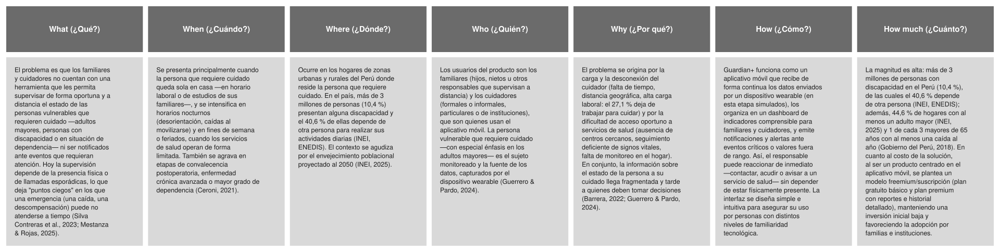
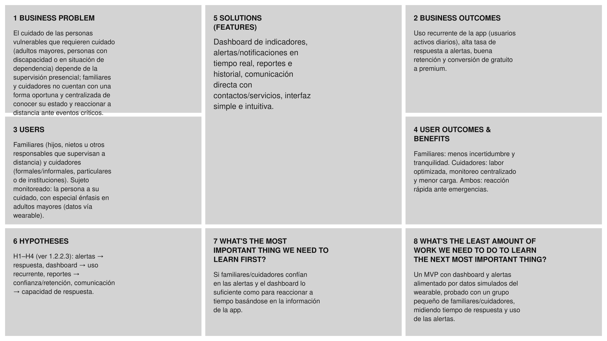

## Capítulo I: Presentación

### 1.1. Startup Profile

#### 1.1.1. Descripción de la Startup

Guardian+ es una startup tecnológica desarrollada por estudiantes de Ingeniería de Software de la UPC que busca mejorar el cuidado y monitoreo de personas vulnerables que requieren cuidado como adultos mayores, personas con discapacidad o en situación de dependencia mediante una aplicación móvil integrada con dispositivos wearables.

Surgió ante la necesidad de brindar a familiares y cuidadores una herramienta que les permita realizar un seguimiento más oportuno y eficiente del estado de la persona a su cuidado, especialmente en situaciones donde la supervisión presencial no es constante. Actualmente, los familiares pueden encontrarse ausentes debido a sus responsabilidades laborales o personales, mientras que los cuidadores requieren herramientas que faciliten el seguimiento continuo de las personas bajo su responsabilidad

Como respuesta a esta problemática, Guardian+ propone una solución móvil que conecta a la persona que requiere cuidado con sus familiares o cuidadores, utilizando los datos obtenidos desde un dispositivo wearable para proporcionar información relevante sobre su estado y generar alertas ante situaciones que puedan requerir atención y asi ayudar a los responsables a reaccionar rápidamente ante situaciones que puedan comprometer su bienestar.

#### 1.1.2. Perfiles de integrantes del equipo

|                         Foto                         | Apellidos y Nombres                       |    Código    | Carrera                | Resumen                                                                                                                                                                                                                                                                                                                                                                                                                                                |
| :--------------------------------------------------: | :---------------------------------------- | :----------: | :--------------------- | :----------------------------------------------------------------------------------------------------------------------------------------------------------------------------------------------------------------------------------------------------------------------------------------------------------------------------------------------------------------------------------------------------------------------------------------------------- |
|           | Azama Fukuda, Juan Pablo | [U202411310] | Ingeniería de Software | Soy Juan Pablo Azama Fukuda (Código: u202411310), estudiante de sexto ciclo de Ingeniería de Software. En el ámbito técnico, poseo una base sólida en lenguajes como C++, Java y Unity. Para este proyecto, mi contribución principal tendrá un foco en la parte de diseño/frontend de la aplicación, tanto en la aplicación web y el landing page. Para ello, me respaldo en mis conocimientos decentes en Figma, HTML y CSS, además de mi manejo de React.js, competencias que seguiré escalando a lo largo del curso. A nivel de gestión, asumo el rol de team leader, con la responsabilidad de articular los esfuerzos del equipo, guiar el desarrollo y garantizar una metodología de trabajo eficiente.                   |
|  | Lopez Monroy, Rodrigo Alfredo            | [U202421866] | Ingeniería de Software | Estudiante del 6to ciclo de Ingeniería de Software, con interés en el desarrollo de soluciones tecnológicas. Me enfoco en analizar problemas y plantear soluciones estructuradas, aplicando buenas prácticas y patrones de software. Mis principales habilidades técnicas incluyen el diseño de soluciones de software, desarrollo backend con Spring Boot y despliegue de aplicaciones en infraestructura cloud.                                                                                      |
|               | Luis Miranda, Diego Andres               | [U20241D185] | Ingeniería de Software | Estudiante de la carrera de ingeniería de software del 6to ciclo, apasionado en la programación,con reflejos por el desarrollo web frontend y backend, mediante diversos lenguajes de programación. Me gusta trabajar con responsabilidad, orden, metodología ágiles para entregar un buen proyecto. Con mi experiencia y capacidades sé que puedo aportar más de lo logrado siendo una persona proactiva y perseverante.  . |
|                   | Mechan Montenegro, Luciana Carolina                    | [U20241B843] | Ingeniería de Software | Soy Luciana Carolina Mechan Montenegro (Código: u20241b843), estudiante del sexto ciclo de la carrera de Ingeniería de Software. Cuento con conocimientos en lenguajes de programación como C++, Python y Java, los cuales he aplicado en distintos proyectos académicos orientados a la resolución de problemas y desarrollo de sistemas. Dentro del equipo, mi contribución se enfoca tanto en el desarrollo frontend como backend, participando en la implementación de funcionalidades y en la integración de los distintos componentes del sistema. Me caracterizo por ser responsable, proactiva y con una gran capacidad de aprendizaje, además de tener facilidad para el trabajo en equipo y la adaptación a nuevos retos dentro del proyecto.                                                              |
|  | Sanchez Cuadrado, Juan Antonio             | [U202319404] | Ingeniería de Software | Soy ...                                                                                                                                                     |

### 1.2. Solution Profile

#### 1.2.1. Antecedentes y problemática

En el Perú, una parte importante de la población se encuentra en situación de vulnerabilidad y requiere cuidado y supervisión constante. Según el Censo 2017 del INEI, el 10,4 % de la población (más de 3 millones de personas) presenta algún tipo de discapacidad, y el 40,6 % de ellas depende de otra persona para realizar sus actividades diarias (INEI, ENEDIS). Esta situación se cruza fuertemente con la vejez: 47 de cada 100 personas con discapacidad son adultos mayores (INEI). Además, el envejecimiento poblacional se acelera: durante el tercer trimestre de 2025, el 44,6 % de los hogares del país contaba con al menos un adulto mayor (47,4 % en Lima Metropolitana), y el índice de dependencia de adultos mayores pasará de 23,0 % en 2025 a 41,5 % en 2050 (INEI, 2025). A ello se suman condiciones como la fragilidad, la comorbilidad y el riesgo de caídas: uno de cada tres adultos mayores de 65 años sufre al menos una caída al año, una de las principales causas de hospitalización en esta población (Gobierno del Perú, 2018).

El punto crítico es que el cuidado de estas personas recae en familiares y cuidadores que no siempre pueden estar presentes. De hecho, entre quienes apoyan a una persona con discapacidad, muchos dejan de trabajar (27,1 %) o de realizar sus quehaceres del hogar (46,7 %) para asumir ese cuidado (INEI, ENEDIS). Cuando la persona vulnerable queda sola, sus familiares y cuidadores carecen de una forma oportuna, centralizada y a distancia de conocer su estado y de ser alertados ante un evento crítico. Guardian+ aborda esta brecha mediante un aplicativo móvil que recibe los datos de un dispositivo wearable, los presenta de forma clara y genera alertas, permitiendo una respuesta rápida sin necesidad de presencia constante.

**Análisis 5W2H**

#### 1.2.2. Lean UX Process

##### 1.2.2.1. Lean UX Problem Statements

**Problem Statement principal (PS-1):**
El cuidado de personas vulnerables que requieren cuidado (adultos mayores, personas con discapacidad o en situación de dependencia) en el Perú se ha apoyado principalmente en la supervisión presencial y en herramientas genéricas (llamadas, mensajería o wearables orientados al fitness) que no fueron diseñadas para el acompañamiento a distancia. Lo que los familiares y cuidadores necesitan es una forma oportuna, centralizada y confiable de conocer el estado de la persona a su cuidado y de ser alertados ante eventos críticos, incluso cuando no están presentes. Debido a que las soluciones actuales no integran monitoreo, alertas y comunicación pensados para este contexto, la información llega fragmentada y tarde. Por ello, Guardian+ abordará esta brecha mediante un aplicativo móvil que recibe los datos de un dispositivo wearable, los presenta en un dashboard claro y emite notificaciones y alertas en tiempo real. Nuestro foco inicial serán los familiares y cuidadores de personas vulnerables que requieren cuidado, con especial énfasis en los adultos mayores.

Enunciados secundarios por objetivo:

- **PS-2 (Seguridad):** los familiares y cuidadores no reciben aviso oportuno ante caídas o emergencias. ¿Cómo garantizar una respuesta rápida mediante alertas inmediatas en la app?
- **PS-3 (Salud):** no existe un seguimiento continuo y comprensible de los signos de la persona a su cuidado. ¿Cómo ofrecer un monitoreo preventivo desde el aplicativo móvil?

##### 1.2.2.2. Lean UX Assumptions

**Business Assumptions (Suposiciones de negocio)**

- Creemos que existe un mercado creciente de familias e instituciones que necesitan supervisar a distancia a personas vulnerables que requieren cuidado.
- Creemos que podemos adquirir usuarios mediante alianzas con instituciones de salud, EPS/seguros y centros de cuidado, además de canales digitales.
- Creemos que generaremos ingresos con un modelo freemium/suscripción (plan básico gratuito y plan premium con reportes e historial detallado).
- Creemos que nuestro principal riesgo es que los datos mostrados sean imprecisos o que las alertas fallen, y lo mitigaremos con validación de datos y un diseño cuidadoso de la lógica de alertas.

**Business Outcome Assumptions (Resultados de negocio esperados)**

- Creemos que el éxito se reflejará en un uso recurrente de la app (usuarios activos diarios) y en una alta tasa de respuesta a las alertas.
- Creemos que una buena experiencia elevará la retención y la conversión del plan gratuito al premium.

**User Assumptions (Suposiciones sobre los usuarios)**

- Creemos que nuestros usuarios iniciales son familiares que supervisan a distancia y cuidadores con varias personas a cargo.
- Creemos que valoran, ante todo, la tranquilidad: saber a tiempo cómo está la persona a su cuidado y poder reaccionar rápido.
- Creemos que tienen niveles variados de familiaridad tecnológica, por lo que requieren una interfaz simple e intuitiva.

**User Outcome Assumptions (Beneficios esperados por el usuario)**

- Creemos que los familiares reducirán su incertidumbre al acceder a indicadores y alertas oportunas.
- Creemos que los cuidadores optimizarán su labor al centralizar el monitoreo de varias personas y reducir la carga de supervisión manual.

**Feature Assumptions (Suposiciones sobre funcionalidades)**

- Creemos que un dashboard de indicadores claro cubre la necesidad de conocer el estado de la persona a su cuidado.
- Creemos que las notificaciones y alertas en tiempo real ante eventos críticos permiten reaccionar a tiempo.
- Creemos que los reportes e historial del estado de la persona a su cuidado aportan valor preventivo.
- Creemos que la comunicación directa (contacto rápido con familiares o servicios) refuerza la respuesta ante emergencias.

##### 1.2.2.3. Lean UX Hypothesis Statements

- **H1:** Creemos que mejoraremos la respuesta ante emergencias si los familiares y cuidadores reciben avisos oportunos mediante alertas en tiempo real ante caídas o eventos críticos. *Métrica:* se reduce el tiempo promedio entre el evento detectado y la primera acción del responsable.
- **H2:** Creemos que aumentaremos el uso recurrente de la app si los cuidadores logran supervisar sin presencia física mediante un dashboard de indicadores centralizado. *Métrica:* usuarios activos diarios y frecuencia de consultas al dashboard.
- **H3:** Creemos que incrementaremos la confianza y la retención si los familiares obtienen mayor tranquilidad mediante reportes e historial del estado de la persona a su cuidado. *Métrica:* número de reportes revisados y tasa de retención semanal.
- **H4:** Creemos que elevaremos la capacidad de respuesta si los familiares y cuidadores pueden actuar de inmediato mediante comunicación directa integrada en la app. *Métrica:* tasa de respuesta a las alertas y tiempo hasta el primer contacto.

##### 1.2.2.4. Lean UX Canvas

### 1.3. Segmentos objetivo

Guardian+ está dirigido a dos segmentos que forman parte de nuestro ecosistema, estos segmentos estan relacionado dentro del dominio del problema

- **Segmento 1: Familiares**
El primer segmento está dirigido a familiares de personas vulnerables que requieren cuidado (adultos mayores, personas con discapacidad o en situación de dependencia), como hijos, nietos, hermanos u otros responsables, que necesitan supervisar su bienestar sin estar presentes de manera permanente. Este segmento puede enfrentar limitaciones de tiempo, distancia o responsabilidades laborales que dificultan el acompañamiento continuo. Guardian+ les permite acceder a indicadores relevantes de la persona a su cuidado y recibir notificaciones ante eventos críticos, facilitando una supervisión oportuna y una respuesta rápida ante posibles situaciones de emergencia.  
Durante el tercer trimestre de 2025, el 44,6% de los hogares del país tenía al menos un miembro adulto mayor, mientras que en Lima Metropolitana la proporción llegó al 47,4%. Esto representa un grupo importante de hogares potencialmente vinculados con necesidades de acompañamiento, supervisión y cuidado. Para los familiares, la propuesta de se centra principalmente en reducir la incertidumbre asociada al cuidado a distancia, proporcionando información y alertas que permitan reaccionar oportunamente ante determinados eventos.

- **Segmento 1: Cuidadores**  
El segundo segmento está dirigido a personas encargadas del cuidado frecuente o permanente de personas vulnerables que requieren cuidado (adultos mayores, personas con discapacidad o en situación de dependencia), ya sea de manera particular o como parte de una institución especializada. A diferencia de los familiares, los cuidadores tienen una participación más activa y frecuente en el cuidado de la persona a su cargo, por lo que requieren herramientas que faciliten la supervisión de varias actividades y permitan identificar rápidamente situaciones que requieran intervención.. Guardian+ les proporciona un dashboard de monitoreo con indicadores relevantes y notificaciones ante eventos críticos, permitiendo centralizar la información y mejorar la capacidad de respuesta ante situaciones que requieran atención.  
La necesidad de soluciones de apoyo se relaciona también con el proceso de envejecimiento de la población peruana. El incremento proyectado del índice de dependencia de adultos mayores de 23,0% en 2025 a 41,5% en 2050 evidencia que las necesidades de acompañamiento y cuidado tenderán a adquirir mayor relevancia en los próximos años.