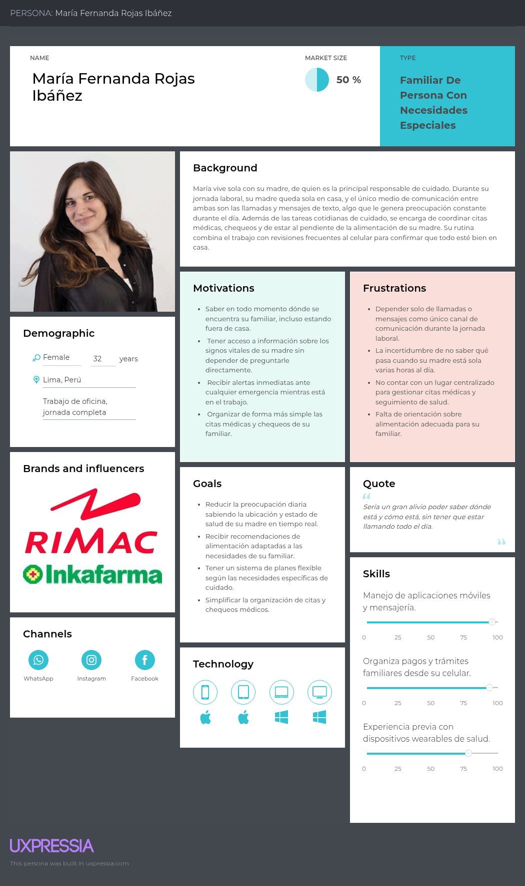
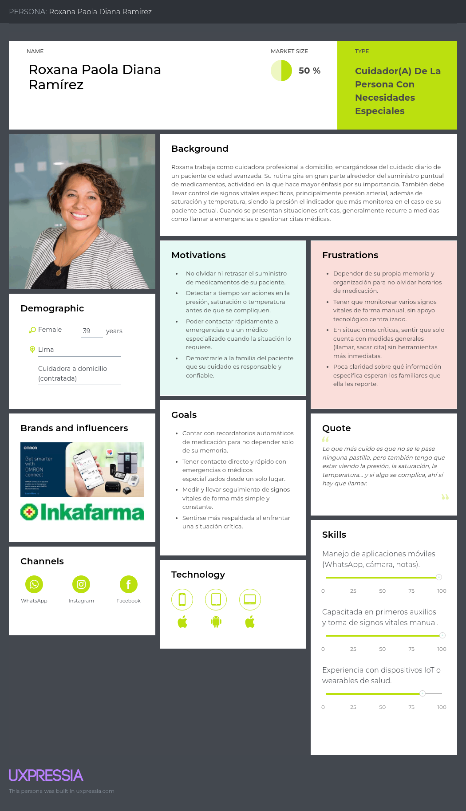
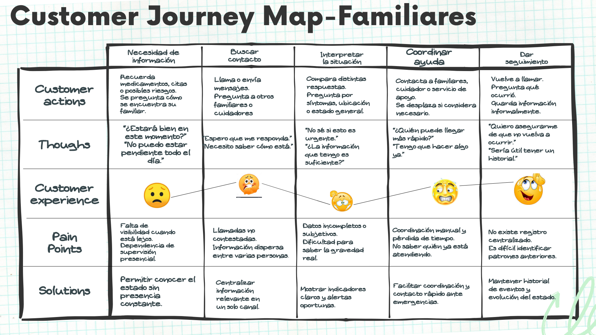
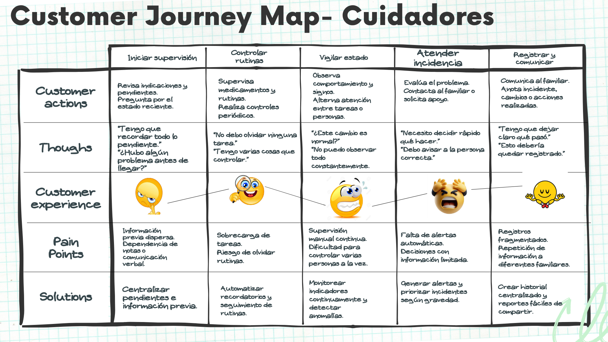
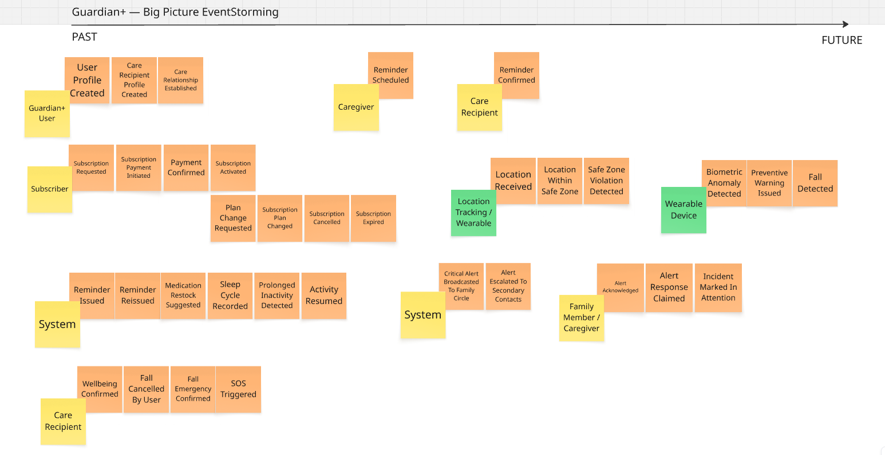
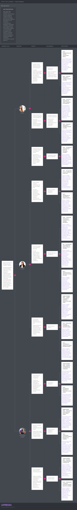

## Capítulo II: Requirements Development and Software Solution Design

### 2.1. Competidores

#### 2.1.1. Análisis competitivo

#### LifeWatch/LifeWatch 2:
Reloj inteligente que monitorea pulso, presión arterial, oxígeno, ejercicio, temperatura corporal y patrones de sueño. Está más orientado al fitness y bienestar general que al cuidado de personas con necesidades específicas, y no cuentan con funciones de emergencia o conectividad familiar especializada. Precio aproximado: S/.140 soles.

#### SaveFamily Senior: 
Smartwatch completo con detector de caídas, frecuencia cardíaca, podómetro, medición de tensión arterial y recordatorio de medicamentos. Su propuesta está orientada al monitoreo integral, pero carece del concepto de "lazo de cuidado" bidireccional y requiere configuración técnica más compleja. Precio aproximado: S/.370 soles.

#### SeniorDomo:
Reloj pulsera con GPS, botón SOS, detección de caídas y llamadas que ofrece protección 24 horas. Está más orientado a la seguridad y emergencias que al acompañamiento cotidiano, y no dispone de la dupla de dispositivos.

#### MovilTecno 866:
Reloj de pulsera diseñado específicamente para personas mayores, ancianos o con principios de Alzheimer, con localización GPS y tecla de socorro. Aunque tiene un enfoque geriátrico, su mercado está limitado a casos avanzados y no contempla el monitoreo preventivo o la conexión familiar cotidiana .

## Competitive Analysis Landscape

**¿Por qué llevar a cabo este análisis?**
Para nuestra empresa (Guardian+) es esencial identificar fortalezas y debilidades frente a la competencia, entender sus estrategias, tomar decisiones informadas, detectar oportunidades de crecimiento, anticipar movimientos y optimizar recursos para mejorar nuestra posición en el mercado.

|  | Guardian+ | LifeWatch / LifeWatch 2 | SaveFamily Senior | SeniorDomo | MovilTecno866 |
|---|---|---|---|---|---|
| **Logo** | | LIFE WATCH | SaveFamily SENIOR | seniorDOMO | MovilTecno.com |
| **Overview** | Pulsera + suscripción mensual accesible para la app (modelo freemium/premium). | Reloj inteligente orientado al fitness y bienestar: mide pulso, presión, oxígeno, temperatura y sueño. | Smartwatch para adultos mayores: frecuencia cardíaca, detector de caídas, recordatorio de medicamentos, podómetro. | Pulsera con GPS, botón SOS, detección de caídas y llamadas de emergencia 24/7. | Reloj GPS localizador 4G para adultos mayores (Alzheimer, demencia), con detector de caídas, botón SOS y respuesta automática a llamadas entrantes. |
| **Precios y Costos** | Modelo mixto: venta de dispositivo + suscripción (freemium/premium). | S/.140 (aprox.). | S/.370 (aprox.). | S/.470 (aprox.), requiere servicio adicional de geolocalización. | Disponible sin cuotas adicionales, aunque precio no claramente especificado. |
| **Ventaja Competitiva (Valor ofrecido)** | "Lazo de cuidado" bidireccional (persona con necesidades específicas–familiar/cuidador), app intuitiva y accesible, reportes médicos, comunicación directa y enfoque en salud + bienestar emocional. | Económico y multifuncional, accesible como gadget fitness. | Amplia cobertura en salud preventiva, incluye recordatorios de medicación. | Fuerte en seguridad y localización, SOS en tiempo real. | Alta orientación en seguridad y localización en tiempo real con respuesta automática y detector de caídas. |
| **Mercado Objetivo** | Personas que requieren de atención especial, familiares y cuidadores que buscan tranquilidad y monitoreo constante. | Jóvenes y adultos que buscan cuidar su salud y condición física. | Adultos mayores con necesidad de monitoreo de salud integral y rutinas médicas. | Adultos mayores con alto riesgo de caídas o desorientación (Alzheimer, demencia). | Personas mayores con Alzheimer, demencia, desorientación o condiciones similares; enfoque en seguridad. |
| **Estrategias de Marketing** | Enfoque en la tranquilidad familiar, alianzas con instituciones de salud y seguros, comunicación en redes sociales y campañas educativas. | Marketing en tiendas online y marketplaces (ej. MercadoLibre, Linio). | Marketing digital especializado en cuidado de mayores, distribuidores autorizados. | Orientado a familias en Europa, con campañas web y distribuidores de teleasistencia. | Facebook y web informativa; poca inversión en publicidad. |
| **Productos & Servicios** | Pulsera IoT con sensores (FC, SpO2, movimiento, caídas) + app móvil con alertas, reportes, comunicación y soporte. | Wearable fitness (ritmo cardíaco, sueño, oxígeno, presión, podómetro, ejercicio). | Smartwatch senior con caídas, tensión arterial, podómetro y recordatorio de medicación. | Pulsera SOS con GPS, llamadas y caídas, protección permanente. | Reloj con GPS, botón SOS, detección de caídas, llamada automática, sin necesidad de pulsar pantalla. |
| **Canales de Distribución (Web y/o Móvil)** | App móvil, página web, redes sociales, WhatsApp, alianzas con EPS y seguros. | Marketplaces online, tiendas minoristas. | Distribuidores online especializados y página web. | Distribución online y teleasistencia en Europa; importadores en LatAm. | Sitio web oficial MovilTecno, tiendas online (global), marketing web. |
| **Fortalezas** | Solución integral de cuidado físico, emocional y familiar; interfaz simplificada para las personas vulnerables que requieren cuidado. | Precio bajo, multifuncional, fácil acceso. | Orientado específicamente a seniors, con medición integral de salud. | Seguridad y geolocalización permanente, SOS en tiempo real. | Tecnología probada en seguridad, facilidad de uso para situaciones de desorientación (respuesta automática). |
| **Oportunidades** | Integración con servicios de telemedicina, expansión en provincias, modelo escalable con cuidadores y clínicas, integración con seguros. | Ampliar mercado hacia adultos mayores, añadir alertas familiares. | Mejorar accesibilidad y simplicidad de configuración. | Complementar con app de acompañamiento y reportes familiares. | Complementar funcionalidades con monitoreo de salud y comunicación familiar para ofrecer mayor valor añadido. |
| **Debilidades** | En fase de validación y crecimiento, aún sin base de usuarios consolidada. | No enfocado en adultos mayores, sin alertas familiares. | Requiere configuración técnica más compleja, carece de "lazo de cuidado" bidireccional. | Sin acompañamiento emocional, no incluye reportes médicos ni monitoreo integral. | Enfoque limitado a la seguridad física y localización; sin capacidad de monitoreo médico ni reportes de salud. |
| **Amenazas** | Competidores globales con mayor capital y alcance comercial. | Sustitución por otros relojes fitness más económicos. | Aparición de apps con pulseras más intuitivas. | Competencia tecnológica que combine seguridad + monitoreo de salud. | Competidores con plataforma más robusta o integración con servicios de salud podrían desplazarlo. |

#### 2.1.2. Estrategias y tácticas frente a competidores
Estrategias y tácticas frente a competidores
Nuestra solución contará con compatibilidad completa con dispositivos móviles Android e iOS, así como con servicios de geolocalización en tiempo real, lo que permitirá a las familias localizar a sus adultos mayores en cualquier momento, con notificaciones inmediatas ante emergencias o caídas.
La pulsera IoT enviará actualizaciones constantes sobre signos vitales (frecuencia cardíaca, oxígeno, presión arterial), estado de actividad física y posibles caídas, de manera continua antes, durante y después de un evento crítico, generando un historial médico accesible desde la app.
A diferencia de dispositivos genéricos como LifeWatch o SeniorDomo, nuestra propuesta incorpora el concepto de “lazo de cuidado” bidireccional, en el que tanto la persona vulnerable que requiere cuidado como el familiar/cuidador están conectados entre sí. Esto permite comunicación directa, envío de alertas y generación de confianza mutua en tiempo real.
La plataforma contará con un registro digital de incidentes y alertas previas, lo que permitirá a los familiares conocer antecedentes de salud, historial de caídas y cambios en los signos vitales. Esto ofrece mayor capacidad de prevención y facilita la consulta médica posterior.
Hemos identificado una oportunidad clave en las familias que actualmente dependen de dispositivos importados o genéricos, los cuales suelen estar orientados al fitness o a la seguridad básica. Nuestra propuesta integra seguridad, salud y acompañamiento emocional en un solo dispositivo, diferenciándonos por ofrecer un servicio más integral y enfocado en las personas vulnerables que requieren cuidado.
La aplicación contará con pagos seguros e integración con servicios adicionales (como telemedicina, seguros o planes premium), lo que permitirá a los usuarios acceder a un ecosistema completo desde la misma plataforma, generando valor agregado y fidelización.

### 2.2. Entrevistas

#### 2.2.1. Diseño de entrevistas

**Preguntas para segmento 1**
**(Familiares de personas vulnerables que requieren cuidado)**

- ¿Qué relación tiene con la persona que cuida o acompaña, y vive usted con ella o de forma independiente?
- ¿Su familiar suele estar solo o con poca compañía en algunos momentos del día? Si es así, ¿qué es lo que más le preocupa a usted en esa situación?
- ¿Cómo maneja usted las situaciones en las que su familiar se siente mal de salud o sufre algún malestar repentino?
- ¿Ha tenido alguna experiencia reciente en la que su familiar necesitó ayuda y no había nadie cerca? ¿Qué ocurrió?
- ¿Qué tipo de ayuda o acompañamiento le gustaría que su familiar tuviera disponible sin depender de que usted esté siempre presente?
- ¿Qué significa para usted que su familiar se sienta seguro en su propia casa?
- En caso de una caída o un problema de salud repentino de su familiar, ¿qué tan rápido cree que podría conseguirse ayuda?
- ¿Su familiar suele tener dificultades para recordar sus horarios de medicamentos o sus citas médicas? Si es así, ¿qué sistemas utilizan actualmente para recordárselos?
- ¿Qué tan cómodo se siente usted usando tecnología (aplicaciones, relojes inteligentes, pulseras) para temas de salud o para comunicarse con el resto de la familia sobre el estado de su familiar?
- ¿A través de qué medios o canales digitales suele mantenerse informado sobre el estado de salud o bienestar de su familiar (WhatsApp, llamadas, apps, redes sociales)?
- Si pudiera contar con un dispositivo que le ayude a monitorear el bienestar de su familiar, ¿qué características serían las más importantes para usted, además de conocer su ubicación?
- ¿Qué tipo de actividades realiza su familiar con más frecuencia (caminar, hacer ejercicio suave, socializar con amigos u otros familiares)?
- ¿Qué cambios ha notado en la salud o en la vida cotidiana de su familiar en los últimos años?
- ¿Qué le daría más tranquilidad: prevenir problemas de salud de su familiar o recibir ayuda inmediata cuando ocurren?
- ¿Qué cosas le resultan fáciles y cuáles difíciles a su familiar al usar aparatos electrónicos?
- Si existiera una pulsera o dispositivo que apoye el cuidado de su familiar, ¿qué es lo primero que le gustaría que hiciera por él/ella?
- ¿Qué funciones o características evitaría en un dispositivo para que no le resulte molesto o incómodo de usar a su familiar?
- ¿Existen marcas de tecnología o salud (relojes, apps, seguros) en las que usted confía especialmente para el cuidado de su familia? ¿Por qué?
- ¿Estaría dispuesto/a a pagar por un servicio de este tipo? ¿Qué precio consideraría razonable?

**Preguntas para segmento 2**
**(Cuidadores responsables del bienestar de personas vulnerables que requieren cuidado)**

- ¿Cómo es un día típico en el cuidado de la persona a su cargo, qué tareas debe hacer normalmente?
- ¿En algún momento ha tenido que dejar a la persona a su cargo sola en casa?
- ¿Qué es lo que más le preocupa cuando la persona a su cargo está sola en casa?
- ¿Cómo le gustaría enterarse si ocurre algo mientras usted no está?
- ¿En qué momentos del día siente mayor necesidad de monitorear a la persona a su cargo?
- ¿Qué aspectos de la salud de la persona a su cargo considera más difíciles de vigilar constantemente?
- ¿Qué tan cómodo cree que sería usar tecnologías (apps, pulseras, dispositivos) para apoyar el cuidado de la persona a su cargo?
- ¿Qué información cree que sería útil que le muestre nuestro servicio sobre el estado de la persona a su cargo, aparte de los signos vitales básicos?
- ¿Piensa usted que la supervisión constante que debe realizar le genera carga? De ser así, ¿de qué manera cree que nuestro servicio le ayudaría a reducir la carga?
- ¿Qué funciones cree que serían más útiles en una aplicación de monitoreo para personas vulnerables que requieren cuidado?
- ¿Cómo le gustaría que se vieran estas funciones en la aplicación o la pulsera, en relación a la facilidad de uso de estas?
- ¿Qué situaciones de emergencia ha tenido que enfrentar con la persona a su cargo y cómo las resolvió?
- ¿Alguna vez ha sentido que la supervisión manual sobre la persona a su cargo fue insuficiente?
- ¿Qué características harían que usted confíe en un sistema de monitoreo para complementar su trabajo?
- ¿Usted compraría el servicio que le ofrecemos si es a un precio razonable?

#### 2.2.2. Registro de entrevistas

## Primer segmento: Familiares

### Entrevista 1

**Datos del entrevistado**

- **Nombres:** 
- **Apellidos:** 
- **Edad:** 
- **Distrito:** 

### Entrevista 2

**Datos del entrevistado**

- **Nombres:** 
- **Apellidos:** 
- **Edad:** 
- **Distrito:** 

### Entrevista 3

**Datos del entrevistado**

- **Nombres:** Rocío Miranda
- **Apellidos:** Alvarado Silva
- **Edad:** 22
- **Distrito:** Jesus María

- **Resumen:** 

De la entrevista realizada a Rocío Alvarado, familiar de una persona con necesidades especiales, se identificó que ella y su madre son las responsables directas del cuidado de su hermano, quien padece esquizofrenia y otros trastornos asociados, y con quien conviven en la misma vivienda. Ambas se turnan para acompañarlo durante el día, aunque existen lapsos de entre 40 minutos y una hora en los que él permanece solo debido a los horarios de trabajo y estudio, situación que le genera preocupación constante ante el riesgo de brotes psicóticos. La entrevistada relató un episodio reciente en el que, tras ausentarse cerca de dos horas, vecinos les informaron que su hermano se alteró y gritó sin que ellas pudieran enterarse en el momento, lo que evidencia la falta de un canal de supervisión inmediata. Para el manejo de crisis más severas, la familia recurre a un centro de salud mental cercano a su domicilio, y el control de la medicación depende completamente de ellas, ya que su hermano no se automedica; su madre lleva un registro manual en papel, mientras que Rocío utiliza notas en su celular para llevar el control de horarios y citas.

En cuanto a su relación con la tecnología, Rocío se mostró cómoda usando aplicaciones, relojes inteligentes y pulseras para temas de salud, calificándose como parte de "esta era digital", y mencionó que se mantiene informada principalmente a través de comunidades y grupos de WhatsApp, además de Facebook y TikTok. Su hermano, por su parte, cuenta con un celular que usa únicamente para llamadas, y aunque su condición ha reducido su nivel de actividad —pasando de salir a caminar y socializar con amigos a un estilo de vida actualmente sedentario, con dolores en las piernas, cansancio y mareos—, la entrevistada indicó que él sí está familiarizado con el manejo básico de dispositivos electrónicos por ser joven. Respecto a un posible dispositivo de monitoreo, Rocío priorizó claramente el control del ritmo cardíaco como la funcionalidad más importante, dado el deterioro de salud de su hermano, seguido de la medición de otros indicadores como la glucosa, y enfatizó que preferiría prevenir problemas de salud antes que solo reaccionar ante ellos; también propuso la idea de integrar cámaras conectadas a una app para monitoreo en tiempo real con notificaciones.

Sobre las marcas y servicios en los que confía, mencionó a Rimac Seguros, Mifarma e Inkafarma, destacando que estas dos últimas cuentan con páginas web que le permiten informarse y contactarse fácilmente. En cuanto a un dispositivo dedicado al cuidado de su hermano, señaló que la facilidad de uso es un requisito indispensable, evitando configuraciones complicadas o con demasiadas indicaciones, y se mostró dispuesta a pagar por un servicio de este tipo hasta S/. 100 mensuales, resaltando que le brindaría tranquilidad frente a la preocupación constante que le genera el cuidado de su hermano.  

## Segundo segmento: Cuidadores

### Entrevista 1

**Datos del entrevistado**

- **Nombres:** 
- **Apellidos:** 
- **Edad:** 
- **Distrito:** 

### Entrevista 2

**Datos del entrevistado**

- **Nombres:** 
- **Apellidos:** 
- **Edad:** 
- **Distrito:** 

### Entrevista 3

**Datos del entrevistado**

- **Nombres:** 
- **Apellidos:** 
- **Edad:** 
- **Distrito:** 

#### 2.2.3. Análisis de entrevistas

### 2.3. Needfinding

#### 2.3.1. User Personas

## Primer segmento: Familiares 

## Segundo segmento: Cuidadores

#### 2.3.2. User Task Matrix
| Task (Adaptado para supervisión) | Familiares – Frecuencia | Familiares – Importancia | Cuidadores – Frecuencia | Cuidadores – Importancia |
|---|---|---|---|---|
| Supervisar toma de medicamentos | Media | Alta | Alta | Alta |
| Monitorear signos vitales | Media | Alta | Alta | Alta |
| Atender alertas de emergencia | Baja | Alta | Baja | Alta |
| Conocer estado general de salud | Media | Alta | Alta | Alta |
| Revisar reportes médicos | Alta | Alta | Media | Media |
| Acompañar en citas médicas | Baja | Media | Alta | Alta |
| Supervisar rutinas diarias | Baja | Alta | Alta | Alta |
#### 2.3.3. User Journey Mapping

En esta sección se presentan los User Journey Maps As-Is elaborados para los User Personas correspondientes a los segmentos objetivo de Guardian+. Estos artefactos permiten representar el recorrido actual que realizan los usuarios para cumplir sus objetivos de cuidado y supervisión, antes de la existencia de la solución Guardian+.

Los journeys se construyen a partir de la información obtenida durante las entrevistas, su análisis y los User Personas previamente definidos. Para cada recorrido se identifican las principales etapas, acciones, puntos de contacto, pensamientos, emociones, dificultades y oportunidades encontradas durante la experiencia.

##### User Journey Map - Familiar

El recorrido del segmento de familiares representa la experiencia de supervisar a distancia el bienestar de una persona vulnerable. El journey inicia con la necesidad de conocer su estado, continúa con la búsqueda de información mediante llamadas, mensajería u otros responsables, y contempla la evaluación de posibles situaciones de riesgo, la coordinación de asistencia y el seguimiento posterior.

##### User Journey Map - Cuidador

El recorrido del segmento de cuidadores representa una jornada habitual de supervisión de una o varias personas bajo su responsabilidad. Comprende la revisión inicial del estado y actividades pendientes, el seguimiento de rutinas, la vigilancia continua, la atención de posibles incidencias y el registro o comunicación de lo ocurrido a familiares u otros responsables.

#### 2.3.4. Empathy Mapping

#### 2.3.5. Big Picture EventStorming

El Big Picture EventStorming permitió explorar el dominio de Guardian+ desde una perspectiva integral, identificando los principales Domain Events que ocurren a lo largo del ciclo de uso de la solución. Este artefacto fue utilizado para comprender de manera global cómo interactúan los actores principales, los sistemas externos y los eventos relevantes del negocio antes de profundizar en la identificación formal de Bounded Contexts.

A diferencia de un EventStorming detallado orientado al diseño interno de un contexto específico, en esta etapa se priorizó la visualización general del comportamiento del dominio. Por ello, se representaron los actores involucrados, los sistemas externos relevantes y los eventos significativos organizados de manera cronológica aproximada, desde la configuración inicial del ecosistema de cuidado hasta los eventos de monitoreo, prevención y respuesta ante incidentes.

Entre los actores identificados se encuentran el usuario de Guardian+, el suscriptor, el cuidador, la persona bajo cuidado y los familiares o cuidadores responsables de responder ante alertas. Asimismo, se consideraron sistemas externos como el wearable y el sistema de tracking de ubicación, ya que forman parte esencial del funcionamiento de la solución. A partir de esta exploración fue posible reconocer eventos importantes como la creación de perfiles, el establecimiento de relaciones de cuidado, la activación de suscripciones, la programación y confirmación de recordatorios, la recepción de ubicaciones, la detección de anomalías biométricas, la emisión de advertencias preventivas, la detección de caídas, la activación de SOS y la atención de alertas críticas.

Este artefacto sirvió como base para construir una visión compartida del dominio, alinear el lenguaje del equipo y preparar el análisis posterior de Strategic Domain-Driven Design, especialmente las actividades de Candidate Context Discovery y Context Mapping.

#### 2.3.6. Ubiquitous Language

## Ubiquitous Language

Eric Evans plantea que el Ubiquitous Language se modela dentro de un contexto delimitado, donde se identifican los términos y conceptos del dominio del negocio, y no debe existir ambigüedad¹. A continuación, se presenta el glosario de términos del dominio de negocio de Guardian+, construido a partir del análisis de segmentos, entrevistas y arquetipos elaborados.

- **Fragile Citizen (Ciudadano frágil):** Persona con necesidades especiales —adulto mayor, paciente con movilidad reducida, condición crónica o de salud mental, entre otras— que requiere supervisión y monitoreo constante para garantizar su seguridad y bienestar.

- **Family (Familiar):** Persona con un vínculo familiar directo con el Fragile Citizen, que asume la responsabilidad principal o compartida de su cuidado, aunque no lo haga como labor remunerada.

- **Caregiver (Cuidador):** Persona contratada o designada para brindar atención directa y cotidiana al Fragile Citizen, encargándose de tareas como el suministro de medicación, la vigilancia de signos vitales y el acompañamiento diario.

- **Care Circle (Círculo de cuidado):** Conjunto de personas —familiares y/o cuidadores— vinculadas a un mismo Fragile Citizen, que coordinan y comparten la responsabilidad de su cuidado.

- **Bidirectional Care Bond (Lazo de cuidado bidireccional):** Vínculo de comunicación y monitoreo constante entre el Fragile Citizen y su Care Circle, que permite a ambas partes mantenerse informadas y conectadas en tiempo real.

- **Vital Signs (Signos vitales):** Conjunto de indicadores fisiológicos del Fragile Citizen —como frecuencia cardíaca, saturación de oxígeno, presión arterial y temperatura corporal— utilizados para evaluar su estado de salud.

- **Fall Detection (Detección de caídas):** Identificación automática de una caída sufrida por el Fragile Citizen, a partir de la cual se genera una alerta hacia su Care Circle.

- **Emergency Alert (Alerta de emergencia):** Notificación inmediata enviada al Care Circle o a servicios de emergencia ante una situación crítica en la salud o seguridad del Fragile Citizen, como una caída, un signo vital anormal o un episodio de crisis.

- **Crisis Episode (Episodio de crisis):** Situación en la que el Fragile Citizen presenta una alteración repentina y severa de su condición de salud física o mental, que puede requerir intervención inmediata de su Care Circle o de un centro de salud.

- **Safe Zone (Zona segura):** Área geográfica predefinida dentro de la cual se espera que el Fragile Citizen permanezca, cuyo abandono genera una notificación al Care Circle.

- **Medication Reminder (Recordatorio de medicación):** Aviso relacionado con los horarios en que el Fragile Citizen debe recibir su medicación, orientado a evitar olvidos o retrasos en su administración.

- **Care Routine (Rutina de cuidado):** Conjunto de actividades cotidianas relacionadas con la atención del Fragile Citizen, como la administración de medicamentos, el control de signos vitales y el acompañamiento diario.

- **Wellness Recommendation (Recomendación de bienestar):** Sugerencia orientada a mejorar la calidad de vida del Fragile Citizen, como pautas de alimentación o actividad física adaptadas a su condición.

- **Medical Appointment (Cita médica):** Encuentro programado entre el Fragile Citizen y un profesional de la salud, cuya organización y seguimiento suele estar a cargo de su Care Circle.

- **Health History (Historial de salud):** Registro acumulado de signos vitales, alertas e incidentes del Fragile Citizen, utilizado como referencia para consultas médicas y toma de decisiones de cuidado.

- **Peace of Mind (Tranquilidad):** Estado de confianza y bienestar emocional que experimenta el Care Circle al saber que el Fragile Citizen se encuentra seguro y monitoreado, incluso en su ausencia.

- **Care Plan (Plan de cuidado):** Modalidad de servicio contratada por el Care Circle, que define el nivel de funcionalidades y monitoreo disponibles según las necesidades específicas del Fragile Citizen.

# 2.4. Requirements specification

## 2.4.1. User Stories

Requisitos definidos junto con el conjunto de User Stories y Epics para los requisitos identificados. Los User Stories incluyen Acceptance Criteria. En esta sección el equipo redacta una introducción, identifica todas las Epics y presenta un cuadro con la estructura especificada a continuación para cada User Storie.

### Epics Identificadas

* **EP01 - Monitoreo de Salud en Tiempo Real:** Supervisión continua y telemetría de signos vitales (ritmo cardíaco, presión arterial, saturación de oxígeno, temperatura y frecuencia respiratoria) para la detección temprana de irregularidades fisiológicas.
* **EP02 - Recordatorios y Rutinas de Bienestar:** Gestión programada de tomas de medicación, hidratación, actividad física, citas médicas y supervisión de patrones de descanso.
* **EP03 - Alertas y Gestión de Emergencias:** Procesamiento, detección local/remota y escalamiento automatizado ante situaciones de riesgo crítico como caídas, anomalías biomédicas o activación manual de SOS.
* **EP04 - Localización y Seguridad en Movilidad:** Rastreo geográfico en tiempo real, delimitación de perímetros seguros (geocercas) y canales de comunicación directa familiar.
* **EP05 - Presencia Web y Adquisición (Landing Page):** Difusión de la propuesta de valor, planes de suscripción, canales de contacto y educación al usuario respecto al ecosistema Guardian+.
* **EP06 - Servicios de Integración y Plataforma Backend:** Capacidades técnicas de ingesta de telemetría, consultas RESTful y persistencia segura de datos clínicos e incidentes.
* **EP07 - Spikes de Investigación Técnica:** Exploración, análisis de compatibilidad y prototipado rápido de dependencias de hardware embebido, protocolos IoT y pasarelas de pago.

---

<table>
  <tr>
    <th style="width: 20%;">Story ID</th>
    <th style="width: 25%;">User</th>
    <th style="width: 20%;">Priority</th>
    <th style="width: 35%;">Epic</th>
  </tr>
  <tr>
    <td><strong>US01</strong></td>
    <td>Cuidador</td>
    <td>High</td>
    <td>EP01 - Monitoreo de Salud en Tiempo Real</td>
  </tr>
  <tr>
    <th>Title</th>
    <td colspan="3"><strong>Visualización de ritmo cardíaco en tiempo real</strong></td>
  </tr>
  <tr>
    <th colspan="4" style="text-align: center;">Description</th>
  </tr>
  <tr>
    <td colspan="4">Como cuidador, deseo consultar la lectura actual del ritmo cardíaco del adulto mayor, persona con discapacidad o en situación de dependencia para monitorear su estabilidad cardiovascular e identificar irregularidades de manera oportuna.</td>
  </tr>
  <tr>
    <th colspan="4" style="text-align: center;">Acceptance Criteria</th>
  </tr>
  <tr>
    <td colspan="4"><strong>Escenario 1: Lectura de ritmo cardíaco en rango normal</strong> - <strong>Dado que</strong> el dispositivo wearable transmite lecturas de frecuencia cardíaca entre 60 y 100 lpm. - <strong>Cuando</strong> el cuidador consulta el estado cardiovascular actual del adulto mayor, persona con discapacidad o en situación de dependencia. - <strong>Entonces</strong> el sistema presenta el valor biométrico en tiempo real y clasifica el estado cardíaco como normal.  <strong>Escenario 2: Detección de taquicardia o ritmo elevado</strong> - <strong>Dado que</strong> el dispositivo wearable transmite una frecuencia cardíaca superior a 100 lpm. - <strong>Cuando</strong> el cuidador consulta el estado cardiovascular del adulto mayor, persona con discapacidad o en situación de dependencia. - <strong>Entonces</strong> el sistema clasifica el valor como elevado y genera un indicador de advertencia sobre la lectura.  <strong>Escenario 3: Detección de bradicardia o ritmo bajo</strong> - <strong>Dado que</strong> el dispositivo wearable transmite una frecuencia cardíaca inferior a 50 lpm. - <strong>Cuando</strong> el cuidador consulta el estado cardiovascular del adulto mayor, persona con discapacidad o en situación de dependencia. - <strong>Entonces</strong> el sistema clasifica el valor como bajo y genera un indicador de advertencia sobre la lectura.  <strong>Escenario 4: Interrupción en la transmisión de telemetría</strong> - <strong>Dado que</strong> la transmisión de telemetría desde el dispositivo wearable no responde o pierde sincronización. - <strong>Cuando</strong> el cuidador intenta consultar el ritmo cardíaco actual. - <strong>Entonces</strong> el sistema expone el último valor histórico registrado indicando la ausencia de señal en vivo.</td>
  </tr>
</table>

 

<table>
  <tr>
    <th style="width: 20%;">Story ID</th>
    <th style="width: 25%;">User</th>
    <th style="width: 20%;">Priority</th>
    <th style="width: 35%;">Epic</th>
  </tr>
  <tr>
    <td><strong>US02</strong></td>
    <td>Cuidador</td>
    <td>High</td>
    <td>EP01 - Monitoreo de Salud en Tiempo Real</td>
  </tr>
  <tr>
    <th>Title</th>
    <td colspan="3"><strong>Visualización de presión arterial estimada</strong></td>
  </tr>
  <tr>
    <th colspan="4" style="text-align: center;">Description</th>
  </tr>
  <tr>
    <td colspan="4">Como cuidador, deseo consultar los valores estimados de presión arterial sistólica y diastólica del adulto mayor, persona con discapacidad o en situación de dependencia para evaluar su condición hemodinámica y prevenir descompensaciones.</td>
  </tr>
  <tr>
    <th colspan="4" style="text-align: center;">Acceptance Criteria</th>
  </tr>
  <tr>
    <td colspan="4"><strong>Escenario 1: Presión arterial dentro del umbral normotenso</strong> - <strong>Dado que</strong> el sensor registra valores de presión arterial dentro de 90/60 mmHg y 120/80 mmHg. - <strong>Cuando</strong> el cuidador consulta las mediciones de presión arterial del adulto mayor, persona con discapacidad o en situación de dependencia. - <strong>Entonces</strong> el sistema expone los valores sistólicos y diastólicos indicando un estado estable sin generar alertas.  <strong>Escenario 2: Detección de pico hipertensivo</strong> - <strong>Dado que</strong> el sensor registra un valor sistólico superior a 140 mmHg o diastólico superior a 90 mmHg. - <strong>Cuando</strong> el cuidador solicita los valores actuales de presión arterial. - <strong>Entonces</strong> el sistema categoriza la lectura como valor fuera de rango y activa una marca de observación clínica.  <strong>Escenario 3: Detección de hipotensión</strong> - <strong>Dado que</strong> el sensor registra una presión arterial inferior a 90/60 mmHg. - <strong>Cuando</strong> el cuidador solicita los valores actuales de presión arterial. - <strong>Entonces</strong> el sistema clasifica la condición como presión baja y notifica el valor fuera de umbral de seguridad.  <strong>Escenario 4: Lectura fallida o no concluyente</strong> - <strong>Dado que</strong> las señales hemodinámicas obtenidas por el sensor presentan ruido excesivo o artefactos de movimiento. - <strong>Cuando</strong> el cuidador consulta la presión arterial. - <strong>Entonces</strong> el sistema descarta la medición errónea y reporta la lectura como inválida sin alterar los umbrales de alerta.</td>
  </tr>
</table>

 

<table>
  <tr>
    <th style="width: 20%;">Story ID</th>
    <th style="width: 25%;">User</th>
    <th style="width: 20%;">Priority</th>
    <th style="width: 35%;">Epic</th>
  </tr>
  <tr>
    <td><strong>US03</strong></td>
    <td>Cuidador</td>
    <td>High</td>
    <td>EP01 - Monitoreo de Salud en Tiempo Real</td>
  </tr>
  <tr>
    <th>Title</th>
    <td colspan="3"><strong>Visualización de saturación de oxígeno periférico (SpO₂)</strong></td>
  </tr>
  <tr>
    <th colspan="4" style="text-align: center;">Description</th>
  </tr>
  <tr>
    <td colspan="4">Como cuidador, deseo consultar el porcentaje de saturación de oxígeno en sangre del adulto mayor, persona con discapacidad o en situación de dependencia para identificar posibles cuadros de hipoxemia o dificultad respiratoria.</td>
  </tr>
  <tr>
    <th colspan="4" style="text-align: center;">Acceptance Criteria</th>
  </tr>
  <tr>
    <td colspan="4"><strong>Escenario 1: Saturación de oxígeno en nivel óptimo</strong> - <strong>Dado que</strong> la pulsera registra una saturación de oxígeno SpO₂ igual o superior al 95%. - <strong>Cuando</strong> el cuidador consulta el nivel de oxígeno del adulto mayor, persona con discapacidad o en situación de dependencia. - <strong>Entonces</strong> el sistema confirma el porcentaje en tiempo real catalogándolo en estado normal.  <strong>Escenario 2: Hipoxemia o saturación por debajo de umbral seguro</strong> - <strong>Dado que</strong> el sensor de oximetría registra un valor inferior al 90% de SpO₂. - <strong>Cuando</strong> el cuidador consulta el nivel de oxígeno o el sistema procesa la telemetría. - <strong>Entonces</strong> el sistema clasifica inmediatamente el estado como crítico y reporta la anomalía de oxigenación.  <strong>Escenario 3: Artefacto de censado por desconexión</strong> - <strong>Dado que</strong> la pulsera pierde contacto cutáneo continuo durante la captura fotopletismográfica. - <strong>Cuando</strong> se procesa la lectura de saturación de oxígeno. - <strong>Entonces</strong> el sistema suspende el cálculo de SpO₂ y registra una condición de lectura incompleta conservando el último registro válido.</td>
  </tr>
</table>

 

<table>
  <tr>
    <th style="width: 20%;">Story ID</th>
    <th style="width: 25%;">User</th>
    <th style="width: 20%;">Priority</th>
    <th style="width: 35%;">Epic</th>
  </tr>
  <tr>
    <td><strong>US04</strong></td>
    <td>Cuidador</td>
    <td>High</td>
    <td>EP01 - Monitoreo de Salud en Tiempo Real</td>
  </tr>
  <tr>
    <th>Title</th>
    <td colspan="3"><strong>Supervisión de temperatura corporal continua</strong></td>
  </tr>
  <tr>
    <th colspan="4" style="text-align: center;">Description</th>
  </tr>
  <tr>
    <td colspan="4">Como cuidador, deseo supervisar las mediciones de temperatura corporal del adulto mayor, persona con discapacidad o en situación de dependencia para alertar de forma oportuna episodios febriles o cuadros de hipotermia.</td>
  </tr>
  <tr>
    <th colspan="4" style="text-align: center;">Acceptance Criteria</th>
  </tr>
  <tr>
    <td colspan="4"><strong>Escenario 1: Registro de normotermia</strong> - <strong>Dado que</strong> el sensor infrarrojo reporta una temperatura cutánea normal entre 36.0 °C y 37.2 °C. - <strong>Cuando</strong> el cuidador revisa la telemetría térmica del adulto mayor, persona con discapacidad o en situación de dependencia. - <strong>Entonces</strong> el sistema valida el estado térmico como normal y registra la serie temporal.  <strong>Escenario 2: Detección de estado febril</strong> - <strong>Dado que</strong> el sensor reporta una temperatura corporal que excede los 37.8 °C de manera sostenida. - <strong>Cuando</strong> el sistema procesa la medición térmica recibida. - <strong>Entonces</strong> el sistema cataloga el evento como fiebre y marca visualmente la anomalía en el perfil del usuario.  <strong>Escenario 3: Detección de hipotermia</strong> - <strong>Dado que</strong> el sensor reporta una temperatura corporal inferior a 35.0 °C. - <strong>Cuando</strong> el sistema procesa la medición térmica recibida. - <strong>Entonces</strong> el sistema cataloga el registro como hipotermia y genera un aviso de control inmediato.</td>
  </tr>
</table>

 

<table>
  <tr>
    <th style="width: 20%;">Story ID</th>
    <th style="width: 25%;">User</th>
    <th style="width: 20%;">Priority</th>
    <th style="width: 35%;">Epic</th>
  </tr>
  <tr>
    <td><strong>US05</strong></td>
    <td>Cuidador</td>
    <td>High</td>
    <td>EP01 - Monitoreo de Salud en Tiempo Real</td>
  </tr>
  <tr>
    <th>Title</th>
    <td colspan="3"><strong>Visualización de frecuencia respiratoria estimada</strong></td>
  </tr>
  <tr>
    <th colspan="4" style="text-align: center;">Description</th>
  </tr>
  <tr>
    <td colspan="4">Como cuidador, deseo examinar la frecuencia respiratoria del adulto mayor, persona con discapacidad o en situación de dependencia para monitorear su ritmo ventilatorio e identificar taquipnea o bradipnea.</td>
  </tr>
  <tr>
    <th colspan="4" style="text-align: center;">Acceptance Criteria</th>
  </tr>
  <tr>
    <td colspan="4"><strong>Escenario 1: Frecuencia ventilatoria normal</strong> - <strong>Dado que</strong> el algoritmo biomédico procesa entre 12 y 20 respiraciones por minuto (rpm). - <strong>Cuando</strong> el cuidador consulta la frecuencia respiratoria de la persona a su cargo. - <strong>Entonces</strong> el sistema muestra la métrica actual catalogándola dentro de los estándares fisiológicos seguros.  <strong>Escenario 2: Detección de frecuencia respiratoria alterada</strong> - <strong>Dado que</strong> el algoritmo estima una frecuencia respiratoria superior a 24 rpm o menor a 10 rpm. - <strong>Cuando</strong> el sistema procesa el flujo continuo de datos respiratorios. - <strong>Entonces</strong> el sistema destaca el valor como anómalo y actualiza la condición de alerta respiratoria de la persona a su cargo.</td>
  </tr>
</table>

 

<table>
  <tr>
    <th style="width: 20%;">Story ID</th>
    <th style="width: 25%;">User</th>
    <th style="width: 20%;">Priority</th>
    <th style="width: 35%;">Epic</th>
  </tr>
  <tr>
    <td><strong>US06</strong></td>
    <td>Adulto mayor, persona con discapacidad o en situación de dependencia</td>
    <td>High</td>
    <td>EP02 - Recordatorios y Rutinas de Bienestar</td>
  </tr>
  <tr>
    <th>Title</th>
    <td colspan="3"><strong>Emisión y confirmación de recordatorios de medicación</strong></td>
  </tr>
  <tr>
    <th colspan="4" style="text-align: center;">Description</th>
  </tr>
  <tr>
    <td colspan="4">Como adulto mayor, persona con discapacidad o en situación de dependencia, deseo recibir avisos hápticos y sonoros en mi pulsera en los horarios exactos de mis medicamentos para no olvidar mis dosis prescritas.</td>
  </tr>
  <tr>
    <th colspan="4" style="text-align: center;">Acceptance Criteria</th>
  </tr>
  <tr>
    <td colspan="4"><strong>Escenario 1: Disparo puntual del recordatorio programado</strong> - <strong>Dado que</strong> existe una toma de medicamento registrada para una hora específica. - <strong>Cuando</strong> el reloj del sistema alcanza la hora programada. - <strong>Entonces</strong> el dispositivo emite señales vibratorias y sonoras, y el sistema marca el recordatorio como emitido.  <strong>Escenario 2: Confirmación manual de ingestión de medicamento</strong> - <strong>Dado que</strong> el recordatorio de medicamento está activo en el dispositivo. - <strong>Cuando</strong> el adulto mayor, persona con discapacidad o en situación de dependencia ejecuta la confirmación de la toma en el dispositivo. - <strong>Entonces</strong> el sistema registra la dosis como administrada exitosamente y sincroniza el evento con el cuidador.  <strong>Escenario 3: Reintento por omisión de confirmación</strong> - <strong>Dado que</strong> un recordatorio ha sido emitido y el adulto mayor, persona con discapacidad o en situación de dependencia no envía confirmación dentro de 10 minutos. - <strong>Cuando</strong> expira dicho lapso de tolerancia. - <strong>Entonces</strong> el sistema genera una segunda advertencia local y remite una notificación de dosis pendiente al cuidador.</td>
  </tr>
</table>

 

<table>
  <tr>
    <th style="width: 20%;">Story ID</th>
    <th style="width: 25%;">User</th>
    <th style="width: 20%;">Priority</th>
    <th style="width: 35%;">Epic</th>
  </tr>
  <tr>
    <td><strong>US07</strong></td>
    <td>Cuidador</td>
    <td>Medium</td>
    <td>EP01 - Monitoreo de Salud en Tiempo Real</td>
  </tr>
  <tr>
    <th>Title</th>
    <td colspan="3"><strong>Análisis comparativo y tendencias históricas de signos vitales</strong></td>
  </tr>
  <tr>
    <th colspan="4" style="text-align: center;">Description</th>
  </tr>
  <tr>
    <td colspan="4">Como cuidador, deseo revisar gráficas de tendencias históricas de los signos vitales para identificar patrones de deterioro fisiológico y compartir reportes con el médico tratante.</td>
  </tr>
  <tr>
    <th colspan="4" style="text-align: center;">Acceptance Criteria</th>
  </tr>
  <tr>
    <td colspan="4"><strong>Escenario 1: Generación de serie temporal consolidada</strong> - <strong>Dado que</strong> existen registros continuos de signos vitales durante los últimos 7 días. - <strong>Cuando</strong> el cuidador solicita el análisis de tendencia para un parámetro específico y rango de fechas. - <strong>Entonces</strong> el sistema consolida los valores históricos y calcula los promedios, valores mínimos y valores máximos.  <strong>Escenario 2: Muestreo insuficiente para conformar tendencia</strong> - <strong>Dado que</strong> el período seleccionado posee menos de 12 horas acumuladas de lecturas válidas. - <strong>Cuando</strong> el cuidador intenta generar la gráfica de tendencia histórica. - <strong>Entonces</strong> el sistema notifica que el volumen de datos recolectado es insuficiente para emitir un gráfico representativo.</td>
  </tr>
</table>

 

<table>
  <tr>
    <th style="width: 20%;">Story ID</th>
    <th style="width: 25%;">User</th>
    <th style="width: 20%;">Priority</th>
    <th style="width: 35%;">Epic</th>
  </tr>
  <tr>
    <td><strong>US08</strong></td>
    <td>Familiar / Cuidador</td>
    <td>Highest</td>
    <td>EP03 - Alertas y Gestión de Emergencias</td>
  </tr>
  <tr>
    <th>Title</th>
    <td colspan="3"><strong>Detección automática de caídas y despacho de emergencia</strong></td>
  </tr>
  <tr>
    <th colspan="4" style="text-align: center;">Description</th>
  </tr>
  <tr>
    <td colspan="4">Como familiar o cuidador, deseo recibir una alerta crítica inmediata cuando la pulsera detecte un patrón de caída del adulto mayor, persona con discapacidad o en situación de dependencia para gestionar auxilio oportuno.</td>
  </tr>
  <tr>
    <th colspan="4" style="text-align: center;">Acceptance Criteria</th>
  </tr>
  <tr>
    <td colspan="4"><strong>Escenario 1: Identificación cinemática de caída no mitigada</strong> - <strong>Dado que</strong> el microcontrolador detecta una aceleración brusca seguida de impacto e inmovilidad relativa. - <strong>Cuando</strong> concluye el ciclo de evaluación cinemática en el firmware. - <strong>Entonces</strong> el sistema despacha una notificación de emergencia de máxima prioridad en un lapso menor a 5 segundos.  <strong>Escenario 2: Cancelación por falsa alarma efectuada por el usuario</strong> - <strong>Dado que</strong> el sistema clasifica una caída y activa una ventana de cancelación local de 20 segundos. - <strong>Cuando</strong> el adulto mayor, persona con discapacidad o en situación de dependencia activa la opción de confirmación de bienestar antes del vencimiento del temporizador. - <strong>Entonces</strong> el sistema interrumpe el despacho a contactos de emergencia y clasifica el evento como falso positivo resuelto.  <strong>Escenario 3: Escalamiento por falta de respuesta del usuario</strong> - <strong>Dado que</strong> se dispara el temporizador de alerta local por caída. - <strong>Cuando</strong> el temporizador de 20 segundos culmina sin interacción del adulto mayor, persona con discapacidad o en situación de dependencia. - <strong>Entonces</strong> el sistema confirma la emergencia, envía la telemetría con coordenadas GPS y activa el flujo de auxilio.</td>
  </tr>
</table>

 

<table>
  <tr>
    <th style="width: 20%;">Story ID</th>
    <th style="width: 25%;">User</th>
    <th style="width: 20%;">Priority</th>
    <th style="width: 35%;">Epic</th>
  </tr>
  <tr>
    <td><strong>US09</strong></td>
    <td>Familiar / Cuidador</td>
    <td>Highest</td>
    <td>EP03 - Alertas y Gestión de Emergencias</td>
  </tr>
  <tr>
    <th>Title</th>
    <td colspan="3"><strong>Generación de alertas por transgresión de umbrales biomédicos</strong></td>
  </tr>
  <tr>
    <th colspan="4" style="text-align: center;">Description</th>
  </tr>
  <tr>
    <td colspan="4">Como cuidador, deseo que el sistema genere una notificación prioritaria cuando los signos vitales del adulto mayor, persona con discapacidad o en situación de dependencia excedan los rangos seguros configurados para intervenir preventivamente.</td>
  </tr>
  <tr>
    <th colspan="4" style="text-align: center;">Acceptance Criteria</th>
  </tr>
  <tr>
    <td colspan="4"><strong>Escenario 1: Superación persistente de umbrales clínicos</strong> - <strong>Dado que</strong> una variable biomédica se mantiene fuera de los límites de seguridad durante más de 3 lecturas consecutivas. - <strong>Cuando</strong> el motor de reglas procesa la telemetría entrante. - <strong>Entonces</strong> el sistema genera un evento de alerta crítica con nivel de severidad correspondiente y la distribuye al cuidador.  <strong>Escenario 2: Restablecimiento de valores basales seguros</strong> - <strong>Dado que</strong> una alerta por anomalía biomédica se encuentra activa. - <strong>Cuando</strong> las lecturas biométricas retornan a valores dentro de los márgenes seguros por 5 minutos continuos. - <strong>Entonces</strong> el sistema actualiza el estado del incidente a estabilizado y notifica el cierre de la anomalía al cuidador.</td>
  </tr>
</table>

 

<table>
  <tr>
    <th style="width: 20%;">Story ID</th>
    <th style="width: 25%;">User</th>
    <th style="width: 20%;">Priority</th>
    <th style="width: 35%;">Epic</th>
  </tr>
  <tr>
    <td><strong>US10</strong></td>
    <td>Adulto mayor, persona con discapacidad o en situación de dependencia</td>
    <td>High</td>
    <td>EP03 - Alertas y Gestión de Emergencias</td>
  </tr>
  <tr>
    <th>Title</th>
    <td colspan="3"><strong>Confirmación manual de estado de bienestar tras incidente</strong></td>
  </tr>
  <tr>
    <th colspan="4" style="text-align: center;">Description</th>
  </tr>
  <tr>
    <td colspan="4">Como adulto mayor, persona con discapacidad o en situación de dependencia, deseo validar manualmente desde mi pulsera que me encuentro a salvo tras dispararse una advertencia para evitar movilizaciones innecesarias de mis familiares.</td>
  </tr>
  <tr>
    <th colspan="4" style="text-align: center;">Acceptance Criteria</th>
  </tr>
  <tr>
    <td colspan="4"><strong>Escenario 1: Notificación de resolución rápida por parte del adulto mayor, persona con discapacidad o en situación de dependencia</strong> - <strong>Dado que</strong> se ha emitido una advertencia preventiva en el ecosistema Guardian+. - <strong>Cuando</strong> el adulto mayor, persona con discapacidad o en situación de dependencia confirma la opción de estado seguro dentro de una ventana de 30 segundos. - <strong>Entonces</strong> el sistema notifica al cuidador que el evento ha sido atendido y descartado por el propio usuario.  <strong>Escenario 2: Vencimiento de ventana de confirmación manual</strong> - <strong>Dado que</strong> la advertencia preventiva se encuentra activa en el dispositivo. - <strong>Cuando</strong> transcurren 30 segundos continuos sin registro de interacción manual. - <strong>Entonces</strong> el sistema promueve la advertencia a categoría de alerta de confirmación requerida y la despacha al cuidador.</td>
  </tr>
</table>

 

<table>
  <tr>
    <th style="width: 20%;">Story ID</th>
    <th style="width: 25%;">User</th>
    <th style="width: 20%;">Priority</th>
    <th style="width: 35%;">Epic</th>
  </tr>
  <tr>
    <td><strong>US11</strong></td>
    <td>Familiar / Cuidador</td>
    <td>Highest</td>
    <td>EP03 - Alertas y Gestión de Emergencias</td>
  </tr>
  <tr>
    <th>Title</th>
    <td colspan="3"><strong>Escalamiento automatizado de alertas críticas no atendidas</strong></td>
  </tr>
  <tr>
    <th colspan="4" style="text-align: center;">Description</th>
  </tr>
  <tr>
    <td colspan="4">Como cuidador, deseo que las alertas críticas no reconocidas se transmitan a contactos secundarios o entidades de apoyo para asegurar que el adulto mayor, persona con discapacidad o en situación de dependencia reciba atención de emergencia.</td>
  </tr>
  <tr>
    <th colspan="4" style="text-align: center;">Acceptance Criteria</th>
  </tr>
  <tr>
    <td colspan="4"><strong>Escenario 1: Reenvío a lista jerárquica de contactos de respaldo</strong> - <strong>Dado que</strong> se emite una alerta crítica de emergencia dirigida al cuidador primario. - <strong>Cuando</strong> el cuidador primario no confirma la recepción del evento dentro de los 60 segundos posteriores. - <strong>Entonces</strong> el sistema despacha la alerta de auxilio de forma simultánea a los contactos secundarios definidos.  <strong>Escenario 2: Neutralización del protocolo de escalamiento</strong> - <strong>Dado que</strong> la alerta crítica ha sido escalada hacia contactos secundarios. - <strong>Cuando</strong> cualquiera de los contactos autorizados registra el reconocimiento de la emergencia. - <strong>Entonces</strong> el sistema detiene los envíos sucesivos de escalamiento y actualiza el estado a incidente en atención.</td>
  </tr>
</table>

 

<table>
  <tr>
    <th style="width: 20%;">Story ID</th>
    <th style="width: 25%;">User</th>
    <th style="width: 20%;">Priority</th>
    <th style="width: 35%;">Epic</th>
  </tr>
  <tr>
    <td><strong>US12</strong></td>
    <td>Familiar / Cuidador</td>
    <td>Medium</td>
    <td>EP03 - Alertas y Gestión de Emergencias</td>
  </tr>
  <tr>
    <th>Title</th>
    <td colspan="3"><strong>Configuración y parametrización de niveles de alerta</strong></td>
  </tr>
  <tr>
    <th colspan="4" style="text-align: center;">Description</th>
  </tr>
  <tr>
    <td colspan="4">Como cuidador, deseo personalizar los canales y umbrales de severidad de las notificaciones para adaptar el comportamiento del sistema a los requerimientos clínicos específicos de la persona a su cargo.</td>
  </tr>
  <tr>
    <th colspan="4" style="text-align: center;">Acceptance Criteria</th>
  </tr>
  <tr>
    <td colspan="4"><strong>Escenario 1: Modificación de canales de notificación por severidad</strong> - <strong>Dado que</strong> el cuidador dispone de permisos de administración sobre el perfil de la persona a su cargo. - <strong>Cuando</strong> el cuidador asigna canales específicos (vibración, notificación prioritaria, SMS) a un tipo de alerta. - <strong>Entonces</strong> el sistema persiste la configuración y la aplica de forma inmediata a los eventos generados a partir de ese momento.  <strong>Escenario 2: Restablecimiento de umbrales clínicos predeterminados</strong> - <strong>Dado que</strong> existen parámetros de alerta modificados respecto a la configuración original. - <strong>Cuando</strong> el cuidador opta por restablecer los valores de fábrica. - <strong>Entonces</strong> el sistema reasigna los rangos estándar definidos por las guías clínicas preconfiguradas.</td>
  </tr>
</table>

 

<table>
  <tr>
    <th style="width: 20%;">Story ID</th>
    <th style="width: 25%;">User</th>
    <th style="width: 20%;">Priority</th>
    <th style="width: 35%;">Epic</th>
  </tr>
  <tr>
    <td><strong>US13</strong></td>
    <td>Cuidador</td>
    <td>Medium</td>
    <td>EP02 - Recordatorios y Rutinas de Bienestar</td>
  </tr>
  <tr>
    <th>Title</th>
    <td colspan="3"><strong>Programación y notificación de consultas médicas</strong></td>
  </tr>
  <tr>
    <th colspan="4" style="text-align: center;">Description</th>
  </tr>
  <tr>
    <td colspan="4">Como cuidador, deseo agendar los controles y citas médicas del adulto mayor, persona con discapacidad o en situación de dependencia para recibir avisos preventivos y evitar inasistencias a los centros de salud.</td>
  </tr>
  <tr>
    <th colspan="4" style="text-align: center;">Acceptance Criteria</th>
  </tr>
  <tr>
    <td colspan="4"><strong>Escenario 1: Generación de recordatorio previo a la cita</strong> - <strong>Dado que</strong> existe una cita médica registrada en el calendario de la persona a su cargo. - <strong>Cuando</strong> el tiempo restante coincide con la antelación configurada por el cuidador (por ejemplo, 1 hora antes). - <strong>Entonces</strong> el sistema genera una notificación preventiva tanto en el dispositivo del adulto mayor, persona con discapacidad o en situación de dependencia como en el del cuidador.  <strong>Escenario 2: Cancelación de evento programado</strong> - <strong>Dado que</strong> una cita médica agendada es anulada por el cuidador en el sistema. - <strong>Cuando</strong> se confirma la cancelación de la cita. - <strong>Entonces</strong> el sistema desactiva los temporizadores asociados y purga los recordatorios pendientes correspondientes.</td>
  </tr>
</table>

 

<table>
  <tr>
    <th style="width: 20%;">Story ID</th>
    <th style="width: 25%;">User</th>
    <th style="width: 20%;">Priority</th>
    <th style="width: 35%;">Epic</th>
  </tr>
  <tr>
    <td><strong>US14</strong></td>
    <td>Adulto mayor, persona con discapacidad o en situación de dependencia</td>
    <td>Low</td>
    <td>EP02 - Recordatorios y Rutinas de Bienestar</td>
  </tr>
  <tr>
    <th>Title</th>
    <td colspan="3"><strong>Recordatorios programados para actividad física ligera</strong></td>
  </tr>
  <tr>
    <th colspan="4" style="text-align: center;">Description</th>
  </tr>
  <tr>
    <td colspan="4">Como adulto mayor, persona con discapacidad o en situación de dependencia, deseo que mi pulsera me recuerde realizar pausas activas o ejercicios de movilidad suave para mantener mi autonomía funcional.</td>
  </tr>
  <tr>
    <th colspan="4" style="text-align: center;">Acceptance Criteria</th>
  </tr>
  <tr>
    <td colspan="4"><strong>Escenario 1: Disparo de rutina de ejercicio planificada</strong> - <strong>Dado que</strong> se ha configurado un plan de actividad física para un horario definido. - <strong>Cuando</strong> el reloj del sistema coincide con dicho horario. - <strong>Entonces</strong> la pulsera emite una señal háptica indicando el inicio del bloque de actividad física.  <strong>Escenario 2: Registro de cumplimiento de actividad</strong> - <strong>Dado que</strong> el recordatorio de actividad física ha sido presentado al adulto mayor, persona con discapacidad o en situación de dependencia. - <strong>Cuando</strong> el usuario confirma la finalización del ejercicio en el dispositivo. - <strong>Entonces</strong> el sistema incrementa el contador de adherencia a rutinas de movilidad en el registro diario.</td>
  </tr>
</table>

 

<table>
  <tr>
    <th style="width: 20%;">Story ID</th>
    <th style="width: 25%;">User</th>
    <th style="width: 20%;">Priority</th>
    <th style="width: 35%;">Epic</th>
  </tr>
  <tr>
    <td><strong>US15</strong></td>
    <td>Adulto mayor, persona con discapacidad o en situación de dependencia</td>
    <td>Highest</td>
    <td>EP03 - Alertas y Gestión de Emergencias</td>
  </tr>
  <tr>
    <th>Title</th>
    <td colspan="3"><strong>Activación de auxilio mediante botón SOS en pulsera</strong></td>
  </tr>
  <tr>
    <th colspan="4" style="text-align: center;">Description</th>
  </tr>
  <tr>
    <td colspan="4">Como adulto mayor, persona con discapacidad o en situación de dependencia, deseo pulsar un botón SOS físico en la pulsera ante cualquier peligro para pedir asistencia inmediata a mis familiares sin depender del teléfono móvil.</td>
  </tr>
  <tr>
    <th colspan="4" style="text-align: center;">Acceptance Criteria</th>
  </tr>
  <tr>
    <td colspan="4"><strong>Escenario 1: Disparo efectivo por pulsación sostenida</strong> - <strong>Dado que</strong> la pulsera se encuentra encendida y con enlace de datos disponible. - <strong>Cuando</strong> el adulto mayor, persona con discapacidad o en situación de dependencia presiona el botón físico de SOS por al menos 3 segundos continuos. - <strong>Entonces</strong> el sistema despacha de forma inmediata un evento de auxilio de máxima severidad incluyendo la ubicación actual.  <strong>Escenario 2: Aborto preventivo por pulsación involuntaria</strong> - <strong>Dado que</strong> el usuario presiona el botón de SOS por un lapso inferior a 3 segundos. - <strong>Cuando</strong> se libera la presión del botón sin alcanzar el umbral requerido. - <strong>Entonces</strong> el dispositivo descarta la acción y evita el despacho de cualquier evento de alarma.</td>
  </tr>
</table>

 

<table>
  <tr>
    <th style="width: 20%;">Story ID</th>
    <th style="width: 25%;">User</th>
    <th style="width: 20%;">Priority</th>
    <th style="width: 35%;">Epic</th>
  </tr>
  <tr>
    <td><strong>US16</strong></td>
    <td>Cuidador</td>
    <td>High</td>
    <td>EP03 - Alertas y Gestión de Emergencias</td>
  </tr>
  <tr>
    <th>Title</th>
    <td colspan="3"><strong>Administración de agenda de contactos de auxilio</strong></td>
  </tr>
  <tr>
    <th colspan="4" style="text-align: center;">Description</th>
  </tr>
  <tr>
    <td colspan="4">Como cuidador, deseo registrar y ordenar los contactos prioritarios de emergencia para garantizar que las notificaciones críticas se canalicen a las personas correctas.</td>
  </tr>
  <tr>
    <th colspan="4" style="text-align: center;">Acceptance Criteria</th>
  </tr>
  <tr>
    <td colspan="4"><strong>Escenario 1: Incorporación de nuevo contacto de auxilio válido</strong> - <strong>Dado que</strong> el cuidador ingresa nombre completo, parentesco y número telefónico con código internacional válido. - <strong>Cuando</strong> se solicita el guardado del nuevo contacto. - <strong>Entonces</strong> el sistema valida la integridad de los datos, almacena el registro y lo asocia a la cadena de alertas.  <strong>Escenario 2: Retiro de contacto de emergencia obsoleto</strong> - <strong>Dado que</strong> un contacto de emergencia existe en el directorio de la persona a su cargo. - <strong>Cuando</strong> el cuidador elimina dicho contacto y la lista mantiene al menos un contacto primario. - <strong>Entonces</strong> el sistema actualiza la lista de distribución excluyendo al contacto removido de futuros eventos.</td>
  </tr>
</table>

 

<table>
  <tr>
    <th style="width: 20%;">Story ID</th>
    <th style="width: 25%;">User</th>
    <th style="width: 20%;">Priority</th>
    <th style="width: 35%;">Epic</th>
  </tr>
  <tr>
    <td><strong>US17</strong></td>
    <td>Cuidador</td>
    <td>Low</td>
    <td>EP02 - Recordatorios y Rutinas de Bienestar</td>
  </tr>
  <tr>
    <th>Title</th>
    <td colspan="3"><strong>Estimación y registro de fases de sueño</strong></td>
  </tr>
  <tr>
    <th colspan="4" style="text-align: center;">Description</th>
  </tr>
  <tr>
    <td colspan="4">Como cuidador, deseo acceder al registro de descanso nocturno del adulto mayor, persona con discapacidad o en situación de dependencia para evaluar la calidad del sueño e identificar patrones de insomnio o agitación.</td>
  </tr>
  <tr>
    <th colspan="4" style="text-align: center;">Acceptance Criteria</th>
  </tr>
  <tr>
    <td colspan="4"><strong>Escenario 1: Procesamiento consolidado de descanso nocturno</strong> - <strong>Dado que</strong> la pulsera recopila datos de micromovimientos y frecuencia cardíaca durante la ventana nocturna. - <strong>Cuando</strong> el sistema procesa el intervalo al inicio de la mañana. - <strong>Entonces</strong> el sistema computa el total de horas de sueño, la continuidad del descanso y el número de despertares.  <strong>Escenario 2: Identificación de descanso interrumpido atípico</strong> - <strong>Dado que</strong> el análisis de telemetría detecta más de 4 interrupciones prolongadas en una sola noche. - <strong>Cuando</strong> se consolida el reporte matutino. - <strong>Entonces</strong> el sistema cataloga la sesión de descanso como sueño fragmentado y lo registra en el historial de la persona a su cargo.</td>
  </tr>
</table>

 

<table>
  <tr>
    <th style="width: 20%;">Story ID</th>
    <th style="width: 25%;">User</th>
    <th style="width: 20%;">Priority</th>
    <th style="width: 35%;">Epic</th>
  </tr>
  <tr>
    <td><strong>US18</strong></td>
    <td>Cuidador</td>
    <td>Highest</td>
    <td>EP04 - Localización y Seguridad en Movilidad</td>
  </tr>
  <tr>
    <th>Title</th>
    <td colspan="3"><strong>Telemetría de geolocalización en tiempo real</strong></td>
  </tr>
  <tr>
    <th colspan="4" style="text-align: center;">Description</th>
  </tr>
  <tr>
    <td colspan="4">Como cuidador, deseo consultar las coordenadas de ubicación en tiempo real del adulto mayor, persona con discapacidad o en situación de dependencia para verificar su paradero y actuar rápidamente si sufre una desorientación.</td>
  </tr>
  <tr>
    <th colspan="4" style="text-align: center;">Acceptance Criteria</th>
  </tr>
  <tr>
    <td colspan="4"><strong>Escenario 1: Transmisión de coordenadas en condiciones normales</strong> - <strong>Dado que</strong> el receptor GNSS de la pulsera dispone de cobertura satelital activa. - <strong>Cuando</strong> el cuidador solicita la posición actual del adulto mayor, persona con discapacidad o en situación de dependencia. - <strong>Entonces</strong> el sistema entrega las coordenadas de latitud y longitud con una marca de tiempo actualizada dentro de los últimos 30 segundos.  <strong>Escenario 2: Degradación de señal satelital en interiores</strong> - <strong>Dado que</strong> la pulsera entra en una zona subterránea o sin cobertura GNSS. - <strong>Cuando</strong> se solicita la localización geográfica de la persona a su cargo. - <strong>Entonces</strong> el sistema expone el último punto geográfico válido conocido indicando explícitamente la pérdida momentánea de fijación satelital.</td>
  </tr>
</table>

 

<table>
  <tr>
    <th style="width: 20%;">Story ID</th>
    <th style="width: 25%;">User</th>
    <th style="width: 20%;">Priority</th>
    <th style="width: 35%;">Epic</th>
  </tr>
  <tr>
    <td><strong>US19</strong></td>
    <td>Cuidador</td>
    <td>Medium</td>
    <td>EP01 - Monitoreo de Salud en Tiempo Real</td>
  </tr>
  <tr>
    <th>Title</th>
    <td colspan="3"><strong>Exportación de reporte cronológico de telemetría médica</strong></td>
  </tr>
  <tr>
    <th colspan="4" style="text-align: center;">Description</th>
  </tr>
  <tr>
    <td colspan="4">Como cuidador, deseo generar y exportar el historial de signos vitales en formato estandarizado para respaldar las consultas médicas presenciales.</td>
  </tr>
  <tr>
    <th colspan="4" style="text-align: center;">Acceptance Criteria</th>
  </tr>
  <tr>
    <td colspan="4"><strong>Escenario 1: Exportación exitosa de expediente de telemetría</strong> - <strong>Dado que</strong> la persona a su cargo cuenta con mediciones registradas durante un intervalo de 30 días. - <strong>Cuando</strong> el cuidador selecciona el rango y solicita la exportación documental. - <strong>Entonces</strong> el sistema compila un reporte estructurado en formato PDF conteniendo tablas y resúmenes de las anomalías detectadas.  <strong>Escenario 2: Solicitud de exportación en rango vacío</strong> - <strong>Dado que</strong> no existen lecturas de signos vitales dentro del período seleccionado. - <strong>Cuando</strong> el cuidador intenta ejecutar la exportación documental. - <strong>Entonces</strong> el sistema bloquea la generación del archivo y notifica que no existen registros en el rango indicado.</td>
  </tr>
</table>

 

<table>
  <tr>
    <th style="width: 20%;">Story ID</th>
    <th style="width: 25%;">User</th>
    <th style="width: 20%;">Priority</th>
    <th style="width: 35%;">Epic</th>
  </tr>
  <tr>
    <td><strong>US20</strong></td>
    <td>Adulto mayor, persona con discapacidad o en situación de dependencia / Cuidador</td>
    <td>High</td>
    <td>EP03 - Alertas y Gestión de Emergencias</td>
  </tr>
  <tr>
    <th>Title</th>
    <td colspan="3"><strong>Notificación de nivel crítico de batería en wearable</strong></td>
  </tr>
  <tr>
    <th colspan="4" style="text-align: center;">Description</th>
  </tr>
  <tr>
    <td colspan="4">Como adulto mayor, persona con discapacidad o en situación de dependencia, o cuidador, deseo recibir una advertencia oportuna cuando la batería de la pulsera descienda del 20% para recargarla y evitar la suspensión del monitoreo.</td>
  </tr>
  <tr>
    <th colspan="4" style="text-align: center;">Acceptance Criteria</th>
  </tr>
  <tr>
    <td colspan="4"><strong>Escenario 1: Advertencia preventiva por descarga progresiva</strong> - <strong>Dado que</strong> el circuito de carga de la pulsera mide un remanente igual o menor al 20% de energía. - <strong>Cuando</strong> se procesa la lectura periódica del estado de la batería. - <strong>Entonces</strong> el dispositivo activa un aviso de recarga necesaria y envía una notificación preventiva a la aplicación del cuidador.  <strong>Escenario 2: Umbral de apagado inminente</strong> - <strong>Dado que</strong> el nivel de batería alcanza un 5% de capacidad residual. - <strong>Cuando</strong> el dispositivo evalúa su reserva energética crítica. - <strong>Entonces</strong> el sistema emite una última telemetría con prioridad crítica avisando del cese temporal inminente de la supervisión.</td>
  </tr>
</table>

 

<table>
  <tr>
    <th style="width: 20%;">Story ID</th>
    <th style="width: 25%;">User</th>
    <th style="width: 20%;">Priority</th>
    <th style="width: 35%;">Epic</th>
  </tr>
  <tr>
    <td><strong>US21</strong></td>
    <td>Cuidador</td>
    <td>High</td>
    <td>EP01 - Monitoreo de Salud en Tiempo Real</td>
  </tr>
  <tr>
    <th>Title</th>
    <td colspan="3"><strong>Sincronización y persistencia resiliente de telemetría (Offline Sync)</strong></td>
  </tr>
  <tr>
    <th colspan="4" style="text-align: center;">Description</th>
  </tr>
  <tr>
    <td colspan="4">Como cuidador, deseo que los datos recopilados por la pulsera durante pérdidas de red se almacenen localmente y se sincronicen al recuperar conexión para garantizar la integridad histórica.</td>
  </tr>
  <tr>
    <th colspan="4" style="text-align: center;">Acceptance Criteria</th>
  </tr>
  <tr>
    <td colspan="4"><strong>Escenario 1: Buffer local por indisponibilidad de conexión</strong> - <strong>Dado que</strong> el dispositivo wearable pierde conexión a la red de datos durante su operación. - <strong>Cuando</strong> se efectúan nuevas lecturas biométricas o de incidentes. - <strong>Entonces</strong> el microcontrolador persiste las tramas localmente en su memoria no volátil manteniendo el orden cronológico.  <strong>Escenario 2: Vaciado automático de buffer tras reconexión</strong> - <strong>Dado que</strong> existen tramas biométricas retenidas en la memoria local del dispositivo. - <strong>Cuando</strong> se restablece el enlace inalámbrico con el backend. - <strong>Entonces</strong> el dispositivo transmite en bloque la telemetría pendiente y el servidor las persiste eliminando registros duplicados.</td>
  </tr>
</table>

 

<table>
  <tr>
    <th style="width: 20%;">Story ID</th>
    <th style="width: 25%;">User</th>
    <th style="width: 20%;">Priority</th>
    <th style="width: 35%;">Epic</th>
  </tr>
  <tr>
    <td><strong>US22</strong></td>
    <td>Adulto mayor, persona con discapacidad o en situación de dependencia</td>
    <td>Low</td>
    <td>EP03 - Alertas y Gestión de Emergencias</td>
  </tr>
  <tr>
    <th>Title</th>
    <td colspan="3"><strong>Activación de modo discreto y silencioso en wearable</strong></td>
  </tr>
  <tr>
    <th colspan="4" style="text-align: center;">Description</th>
  </tr>
  <tr>
    <td colspan="4">Como adulto mayor, persona con discapacidad o en situación de dependencia, deseo habilitar un modo de vibración táctil silenciosa para recibir mis notificaciones sin perturbar mi entorno en espacios públicos o eventos sociales.</td>
  </tr>
  <tr>
    <th colspan="4" style="text-align: center;">Acceptance Criteria</th>
  </tr>
  <tr>
    <td colspan="4"><strong>Escenario 1: Conmutación a perfil táctil silencioso</strong> - <strong>Dado que</strong> la pulsera opera bajo el perfil de notificaciones auditivas estándar. - <strong>Cuando</strong> el usuario activa el modo discreto en el dispositivo. - <strong>Entonces</strong> el sistema silencia los zumbadores acústicos y canaliza todos los avisos a través de patrones vibratorios.  <strong>Escenario 2: Excepción para eventos de emergencia crítica</strong> - <strong>Dado que</strong> la pulsera se encuentra configurada en modo discreto. - <strong>Cuando</strong> se dispara una alerta clasificada como emergencia crítica o SOS. - <strong>Entonces</strong> el sistema anula la restricción silenciosa y ejecuta las señales audibles de máxima alerta.</td>
  </tr>
</table>

 

<table>
  <tr>
    <th style="width: 20%;">Story ID</th>
    <th style="width: 25%;">User</th>
    <th style="width: 20%;">Priority</th>
    <th style="width: 35%;">Epic</th>
  </tr>
  <tr>
    <td><strong>US23</strong></td>
    <td>Familiar</td>
    <td>Medium</td>
    <td>EP04 - Localización y Seguridad en Movilidad</td>
  </tr>
  <tr>
    <th>Title</th>
    <td colspan="3"><strong>Establecimiento de canal de comunicación directa</strong></td>
  </tr>
  <tr>
    <th colspan="4" style="text-align: center;">Description</th>
  </tr>
  <tr>
    <td colspan="4">Como familiar, deseo iniciar un canal de comunicación rápida con el adulto mayor, persona con discapacidad o en situación de dependencia para verificar su condición ante cualquier sospecha o inquietud cotidiana.</td>
  </tr>
  <tr>
    <th colspan="4" style="text-align: center;">Acceptance Criteria</th>
  </tr>
  <tr>
    <td colspan="4"><strong>Escenario 1: Enlace de comunicación exitoso</strong> - <strong>Dado que</strong> el adulto mayor, persona con discapacidad o en situación de dependencia y el familiar cuentan con dispositivos vinculados y conexión de datos activa. - <strong>Cuando</strong> el familiar solicita la apertura de un canal de voz o videollamada. - <strong>Entonces</strong> el sistema establece la sesión interactiva y confirma la conexión entre ambas partes.  <strong>Escenario 2: Llamada no contestada</strong> - <strong>Dado que</strong> se emite la señal de comunicación hacia el dispositivo receptor. - <strong>Cuando</strong> transcurren 30 segundos sin que el receptor atienda la solicitud. - <strong>Entonces</strong> el sistema cierra el intento de conexión y genera un registro de llamada no atendida en el historial del cuidador.</td>
  </tr>
</table>

 

<table>
  <tr>
    <th style="width: 20%;">Story ID</th>
    <th style="width: 25%;">User</th>
    <th style="width: 20%;">Priority</th>
    <th style="width: 35%;">Epic</th>
  </tr>
  <tr>
    <td><strong>US24</strong></td>
    <td>Cuidador</td>
    <td>Medium</td>
    <td>EP01 - Monitoreo de Salud en Tiempo Real</td>
  </tr>
  <tr>
    <th>Title</th>
    <td colspan="3"><strong>Consolidación y despacho de reporte semanal de salud</strong></td>
  </tr>
  <tr>
    <th colspan="4" style="text-align: center;">Description</th>
  </tr>
  <tr>
    <td colspan="4">Como cuidador, deseo recibir una síntesis semanal automatizada del estado de salud del adulto mayor, persona con discapacidad o en situación de dependencia para evaluar su evolución global sin revisar telemetría segundo a segundo.</td>
  </tr>
  <tr>
    <th colspan="4" style="text-align: center;">Acceptance Criteria</th>
  </tr>
  <tr>
    <td colspan="4"><strong>Escenario 1: Compilación automática al cierre de ciclo semanal</strong> - <strong>Dado que</strong> culmina el ciclo operativo de 7 días de la persona a su cargo. - <strong>Cuando</strong> el servicio de reportes ejecuta su tarea programada de cierre. - <strong>Entonces</strong> el sistema genera una síntesis agregando estabilidad de signos vitales, alertas disparadas y porcentaje de adherencia a medicación.  <strong>Escenario 2: Resaltado de incidentes recurrentes</strong> - <strong>Dado que</strong> la persona a su cargo experimentó más de 3 anomalías del mismo tipo a lo largo de la semana. - <strong>Cuando</strong> se genera la síntesis semanal. - <strong>Entonces</strong> el sistema marca el parámetro como recurrente e incluye una recomendación de revisión médica preventiva.</td>
  </tr>
</table>

 

<table>
  <tr>
    <th style="width: 20%;">Story ID</th>
    <th style="width: 25%;">User</th>
    <th style="width: 20%;">Priority</th>
    <th style="width: 35%;">Epic</th>
  </tr>
  <tr>
    <td><strong>US25</strong></td>
    <td>Familiar</td>
    <td>High</td>
    <td>EP03 - Alertas y Gestión de Emergencias</td>
  </tr>
  <tr>
    <th>Title</th>
    <td colspan="3"><strong>Despacho simultáneo a múltiples contactos de auxilio</strong></td>
  </tr>
  <tr>
    <th colspan="4" style="text-align: center;">Description</th>
  </tr>
  <tr>
    <td colspan="4">Como familiar, deseo que las alertas de máxima criticidad se remitan simultáneamente a todo el círculo familiar registrado para maximizar la velocidad de respuesta.</td>
  </tr>
  <tr>
    <th colspan="4" style="text-align: center;">Acceptance Criteria</th>
  </tr>
  <tr>
    <td colspan="4"><strong>Escenario 1: Difusión simultánea ante evento crítico</strong> - <strong>Dado que</strong> se confirma una emergencia crítica (como caída o SOS manual). - <strong>Cuando</strong> el motor de despacho procesa el incidente. - <strong>Entonces</strong> el sistema emite notificaciones simultáneas a todos los contactos registrados en el círculo familiar activo.  <strong>Escenario 2: Notificación colaborativa de atención confirmada</strong> - <strong>Dado que</strong> múltiples familiares recibieron la notificación de emergencia en paralelo. - <strong>Cuando</strong> el primer familiar pulsa la opción de acudir al auxilio. - <strong>Entonces</strong> el sistema distribuye una actualización al resto de los contactos informando que dicho integrante ya asumió la respuesta.</td>
  </tr>
</table>

 

<table>
  <tr>
    <th style="width: 20%;">Story ID</th>
    <th style="width: 25%;">User</th>
    <th style="width: 20%;">Priority</th>
    <th style="width: 35%;">Epic</th>
  </tr>
  <tr>
    <td><strong>US26</strong></td>
    <td>Adulto mayor, persona con discapacidad o en situación de dependencia</td>
    <td>Low</td>
    <td>EP02 - Recordatorios y Rutinas de Bienestar</td>
  </tr>
  <tr>
    <th>Title</th>
    <td colspan="3"><strong>Recordatorios periódicos de hidratación y pausas activas</strong></td>
  </tr>
  <tr>
    <th colspan="4" style="text-align: center;">Description</th>
  </tr>
  <tr>
    <td colspan="4">Como adulto mayor, persona con discapacidad o en situación de dependencia, deseo que la pulsera me avise periódicamente cuándo tomar agua o levantarme para evitar la deshidratación y la rigidez articular.</td>
  </tr>
  <tr>
    <th colspan="4" style="text-align: center;">Acceptance Criteria</th>
  </tr>
  <tr>
    <td colspan="4"><strong>Escenario 1: Notificación de intervalo de hidratación</strong> - <strong>Dado que</strong> transcurren 120 minutos consecutivos sin registro de confirmación de ingesta hídrica. - <strong>Cuando</strong> se cumple la ventana de tiempo establecida. - <strong>Entonces</strong> el dispositivo emite un patrón de vibración indicando el recordatorio de hidratación.  <strong>Escenario 2: Supresión durante horas de descanso</strong> - <strong>Dado que</strong> el sistema identifica que el usuario se encuentra dentro del rango horario de sueño nocturno. - <strong>Cuando</strong> vence el ciclo de hidratación periódica. - <strong>Entonces</strong> el sistema inhibe la emisión del recordatorio para resguardar el descanso de la persona a su cargo.</td>
  </tr>
</table>

 

<table>
  <tr>
    <th style="width: 20%;">Story ID</th>
    <th style="width: 25%;">User</th>
    <th style="width: 20%;">Priority</th>
    <th style="width: 35%;">Epic</th>
  </tr>
  <tr>
    <td><strong>US27</strong></td>
    <td>Cuidador</td>
    <td>Medium</td>
    <td>EP02 - Recordatorios y Rutinas de Bienestar</td>
  </tr>
  <tr>
    <th>Title</th>
    <td colspan="3"><strong>Detección de inactividad física prolongada</strong></td>
  </tr>
  <tr>
    <th colspan="4" style="text-align: center;">Description</th>
  </tr>
  <tr>
    <td colspan="4">Como cuidador, deseo ser alertado si el adulto mayor, persona con discapacidad o en situación de dependencia permanece inmóvil por un período anómalo durante el día para descartar episodios de desvanecimiento o auxilio retenido.</td>
  </tr>
  <tr>
    <th colspan="4" style="text-align: center;">Acceptance Criteria</th>
  </tr>
  <tr>
    <td colspan="4"><strong>Escenario 1: Superación de umbral de inmovilidad en horas diurnas</strong> - <strong>Dado que</strong> la persona a su cargo no presenta movimiento articular durante más de 60 minutos en su jornada activa. - <strong>Cuando</strong> se evalúa el contador de inactividad física. - <strong>Entonces</strong> el sistema despacha un aviso preventivo de inactividad prolongada al cuidador.  <strong>Escenario 2: Restablecimiento de conteo por detección motriz</strong> - <strong>Dado que</strong> el contador de inactividad acumula 45 minutos continuos. - <strong>Cuando</strong> los acelerómetros del dispositivo detectan patrones de marcha o desplazamiento físico. - <strong>Entonces</strong> el sistema reinicia el contador a cero sin generar ningún tipo de alarma.</td>
  </tr>
</table>

 

<table>
  <tr>
    <th style="width: 20%;">Story ID</th>
    <th style="width: 25%;">User</th>
    <th style="width: 20%;">Priority</th>
    <th style="width: 35%;">Epic</th>
  </tr>
  <tr>
    <td><strong>US28</strong></td>
    <td>Cuidador</td>
    <td>High</td>
    <td>EP04 - Localización y Seguridad en Movilidad</td>
  </tr>
  <tr>
    <th>Title</th>
    <td colspan="3"><strong>Delimitación y monitoreo perimetral mediante geocercas múltiples</strong></td>
  </tr>
  <tr>
    <th colspan="4" style="text-align: center;">Description</th>
  </tr>
  <tr>
    <td colspan="4">Como cuidador, deseo delimitar zonas geográficas seguras (hogar, parque, club) para ser alertado oportunamente si el adulto mayor, persona con discapacidad o en situación de dependencia cruza los perímetros autorizados.</td>
  </tr>
  <tr>
    <th colspan="4" style="text-align: center;">Acceptance Criteria</th>
  </tr>
  <tr>
    <td colspan="4"><strong>Escenario 1: Detección de salida de zona segura autorizada</strong> - <strong>Dado que</strong> la persona a su cargo dispone de una o más geocercas activas configuradas con coordenadas y radio métrico. - <strong>Cuando</strong> las coordenadas del receptor GPS se posicionan de forma sostenida fuera de todas las zonas seguras activas. - <strong>Entonces</strong> el sistema genera una alerta de egreso de perímetro seguro y la remite de inmediato al cuidador.  <strong>Escenario 2: Reingreso automático al perímetro seguro</strong> - <strong>Dado que</strong> la persona a su cargo se encuentra registrada fuera del perímetro seguro. - <strong>Cuando</strong> las coordenadas actualizadas confirman su retorno al interior del área delimitada. - <strong>Entonces</strong> el sistema notifica el reingreso a la zona de seguridad y restablece la condición de vigilancia regular.</td>
  </tr>
</table>

 

<table>
  <tr>
    <th style="width: 20%;">Story ID</th>
    <th style="width: 25%;">User</th>
    <th style="width: 20%;">Priority</th>
    <th style="width: 35%;">Epic</th>
  </tr>
  <tr>
    <td><strong>US29</strong></td>
    <td>Familiar</td>
    <td>Low</td>
    <td>EP02 - Recordatorios y Rutinas de Bienestar</td>
  </tr>
  <tr>
    <th>Title</th>
    <td colspan="3"><strong>Previsión de agotamiento de stock y pedidos de medicinas</strong></td>
  </tr>
  <tr>
    <th colspan="4" style="text-align: center;">Description</th>
  </tr>
  <tr>
    <td colspan="4">Como familiar, deseo recibir avisos de reabastecimiento cuando las dosis prescritas estén por terminarse para coordinar oportunamente la compra de medicamentos.</td>
  </tr>
  <tr>
    <th colspan="4" style="text-align: center;">Acceptance Criteria</th>
  </tr>
  <tr>
    <td colspan="4"><strong>Escenario 1: Generación de advertencia por saldo bajo de medicamentos</strong> - <strong>Dado que</strong> el conteo de dosis registradas en el tratamiento indica una disponibilidad remanente para 3 días o menos. - <strong>Cuando</strong> el sistema computa el balance de consumo diario. - <strong>Entonces</strong> se emite un recordatorio de reposición al familiar sugiriendo la reposición del medicamento prescrito.  <strong>Escenario 2: Actualización de stock farmacéutico tras adquisición</strong> - <strong>Dado que</strong> el familiar confirma la adquisición de un nuevo envase de medicamento en la plataforma. - <strong>Cuando</strong> se ingresa la cantidad de unidades adicionadas. - <strong>Entonces</strong> el sistema recalcula el balance total y actualiza la fecha estimada del próximo requerimiento de compra.</td>
  </tr>
</table>

 

<table>
  <tr>
    <th style="width: 20%;">Story ID</th>
    <th style="width: 25%;">User</th>
    <th style="width: 20%;">Priority</th>
    <th style="width: 35%;">Epic</th>
  </tr>
  <tr>
    <td><strong>US30</strong></td>
    <td>Visitante</td>
    <td>Medium</td>
    <td>EP05 - Presencia Web y Adquisición (Landing Page)</td>
  </tr>
  <tr>
    <th>Title</th>
    <td colspan="3"><strong>Navegación entre secciones informativas de la Landing Page</strong></td>
  </tr>
  <tr>
    <th colspan="4" style="text-align: center;">Description</th>
  </tr>
  <tr>
    <td colspan="4">Como visitante, deseo navegar de forma fluida entre las diferentes secciones del portal web para conocer rápidamente la propuesta de valor, funciones y testimonios de Guardian+.</td>
  </tr>
  <tr>
    <th colspan="4" style="text-align: center;">Acceptance Criteria</th>
  </tr>
  <tr>
    <td colspan="4"><strong>Escenario 1: Transición dirigida mediante elementos de navegación</strong> - <strong>Dado que</strong> el visitante se encuentra explorando cualquier bloque de la Landing Page. - <strong>Cuando</strong> el visitante selecciona un enlace del menú principal de navegación. - <strong>Entonces</strong> el navegador efectúa un desplazamiento animado hacia el bloque seleccionado y actualiza el estado activo de la opción.  <strong>Escenario 2: Fijación contextual de la barra de navegación</strong> - <strong>Dado que</strong> el visitante realiza desplazamiento vertical superando el área superior de bienvenida. - <strong>Cuando</strong> la posición de scroll sobrepasa el umbral inicial de la página. - <strong>Entonces</strong> la barra de navegación permanece anclada en la parte superior manteniendo accesibles los accesos a todas las secciones.</td>
  </tr>
</table>

 

<table>
  <tr>
    <th style="width: 20%;">Story ID</th>
    <th style="width: 25%;">User</th>
    <th style="width: 20%;">Priority</th>
    <th style="width: 35%;">Epic</th>
  </tr>
  <tr>
    <td><strong>US31</strong></td>
    <td>Visitante</td>
    <td>Medium</td>
    <td>EP05 - Presencia Web y Adquisición (Landing Page)</td>
  </tr>
  <tr>
    <th>Title</th>
    <td colspan="3"><strong>Presentación de características y beneficios clave del sistema</strong></td>
  </tr>
  <tr>
    <th colspan="4" style="text-align: center;">Description</th>
  </tr>
  <tr>
    <td colspan="4">Como visitante, deseo examinar las ventajas comparativas y capacidades de Guardian+ en la Landing Page para evaluar si satisface los requerimientos de cuidado de mi familia.</td>
  </tr>
  <tr>
    <th colspan="4" style="text-align: center;">Acceptance Criteria</th>
  </tr>
  <tr>
    <td colspan="4"><strong>Escenario 1: Despliegue de capacidades y arquitectura de valor</strong> - <strong>Dado que</strong> el visitante accede al portal desde un navegador web compatible. - <strong>Cuando</strong> se presenta la sección de características del producto. - <strong>Entonces</strong> el sistema expone los pilares de la solución (sensores biomédicos, detección de caídas, geolocalización y lazo familiar) de forma ordenada y legible.  <strong>Escenario 2: Interacción con componentes informativos de producto</strong> - <strong>Dado que</strong> los bloques explicativos de beneficios se encuentran renderizados en la página. - <strong>Cuando</strong> el visitante interactúa sobre cada beneficio presentado. - <strong>Entonces</strong> el sistema expone información complementaria detallando el impacto funcional de cada capacidad.</td>
  </tr>
</table>

 

<table>
  <tr>
    <th style="width: 20%;">Story ID</th>
    <th style="width: 25%;">User</th>
    <th style="width: 20%;">Priority</th>
    <th style="width: 35%;">Epic</th>
  </tr>
  <tr>
    <td><strong>US32</strong></td>
    <td>Visitante</td>
    <td>Medium</td>
    <td>EP05 - Presencia Web y Adquisición (Landing Page)</td>
  </tr>
  <tr>
    <th>Title</th>
    <td colspan="3"><strong>Captura y procesamiento de solicitudes de contacto institucional</strong></td>
  </tr>
  <tr>
    <th colspan="4" style="text-align: center;">Description</th>
  </tr>
  <tr>
    <td colspan="4">Como visitante, deseo enviar mis dudas o consultas comerciales a través de un formulario de contacto web para recibir orientación directa del equipo de Guardian+.</td>
  </tr>
  <tr>
    <th colspan="4" style="text-align: center;">Acceptance Criteria</th>
  </tr>
  <tr>
    <td colspan="4"><strong>Escenario 1: Envío de solicitud con datos íntegros</strong> - <strong>Dado que</strong> el visitante ingresa nombre completo, correo con sintaxis válida y mensaje explicativo. - <strong>Cuando</strong> el visitante confirma el envío del formulario de contacto. - <strong>Entonces</strong> el sistema persiste la consulta, emite acuse de recibo en pantalla y despacha un correo de confirmación al remitente.  <strong>Escenario 2: Rechazo por omisión o formato inválido de datos</strong> - <strong>Dado que</strong> el visitante intenta remitir el formulario omitiendo campos mandatorios o con un formato de correo erróneo. - <strong>When</strong> el visitante ejecuta la acción de envío. - <strong>Then</strong> el sistema interrumpe el procesamiento, marca los campos en error y mantiene los datos previamente ingresados.</td>
  </tr>
</table>

 

<table>
  <tr>
    <th style="width: 20%;">Story ID</th>
    <th style="width: 25%;">User</th>
    <th style="width: 20%;">Priority</th>
    <th style="width: 35%;">Epic</th>
  </tr>
  <tr>
    <td><strong>US33</strong></td>
    <td>Visitante</td>
    <td>Medium</td>
    <td>EP05 - Presencia Web y Adquisición (Landing Page)</td>
  </tr>
  <tr>
    <th>Title</th>
    <td colspan="3"><strong>Visualización comparativa de planes de suscripción Guardian+</strong></td>
  </tr>
  <tr>
    <th colspan="4" style="text-align: center;">Description</th>
  </tr>
  <tr>
    <td colspan="4">Como visitante interesado, deseo comparar los planes de suscripción y sus beneficios asociados para elegir el esquema comercial más adecuado a mis necesidades.</td>
  </tr>
  <tr>
    <th colspan="4" style="text-align: center;">Acceptance Criteria</th>
  </tr>
  <tr>
    <td colspan="4"><strong>Escenario 1: Comparativa de tarifas y coberturas disponibles</strong> - <strong>Dado que</strong> existen planes comerciales parametrizados en la plataforma (básico, familiar, premium). - <strong>Cuando</strong> el visitante consulta la sección de tarifas y suscripciones. - <strong>Entonces</strong> el sistema expone los costos periódicos, las inclusiones de servicio y los métodos de pago aceptados.  <strong>Escenario 2: Selección y redirección hacia flujo de adquisición</strong> - <strong>Dado que</strong> el visitante examina la tabla comparativa de planes comerciales. - <strong>Cuando</strong> el visitante selecciona la opción de contratación en un plan seleccionado. - <strong>Entonces</strong> el sistema canaliza la sesión hacia el flujo de registro y procesamiento de pago correspondiente al plan elegido.</td>
  </tr>
</table>

 

<table>
  <tr>
    <th style="width: 20%;">Story ID</th>
    <th style="width: 25%;">User</th>
    <th style="width: 20%;">Priority</th>
    <th style="width: 35%;">Epic</th>
  </tr>
  <tr>
    <td><strong>TS01</strong></td>
    <td>Developer</td>
    <td>High</td>
    <td>EP06 - Servicios de Integración y Plataforma Backend</td>
  </tr>
  <tr>
    <th>Title</th>
    <td colspan="3"><strong>Endpoint RESTful para consulta y filtrado de incidentes y alertas</strong></td>
  </tr>
  <tr>
    <th colspan="4" style="text-align: center;">Description</th>
  </tr>
  <tr>
    <td colspan="4">Como Developer, deseo disponer de un endpoint RESTful `/api/v1/incidents` para consultar, paginar y filtrar incidentes registrados por rango de fechas, tipo de evento y severidad clínica.</td>
  </tr>
  <tr>
    <th colspan="4" style="text-align: center;">Acceptance Criteria</th>
  </tr>
  <tr>
    <td colspan="4"><strong>Escenario 1: Consulta de incidentes autorizada y exitosa</strong> - <strong>Dado que</strong> la base de datos de telemetría está operativa y el cliente HTTP remite un token JWT de autorización válido. - <strong>Cuando</strong> el Developer envía una petición <code>GET /api/v1/incidents?patientId={id}&page=1&size=20</code>. - <strong>Entonces</strong> la API retorna el código de estado HTTP 200 OK junto con una carga JSON paginada con los incidentes requeridos.  <strong>Escenario 2: Petición sin cabecera de autenticación válida</strong> - <strong>Dado que</strong> la solicitud HTTP no incluye un token de autorización o este ha expirado. - <strong>Cuando</strong> el cliente realiza un requerimiento <code>GET /api/v1/incidents</code>. - <strong>Entonces</strong> la API intercepta la petición y responde con el código de estado HTTP 401 Unauthorized y un cuerpo de error descriptivo.  <strong>Escenario 3: Filtro por severidad crítica sin resultados asociados</strong> - <strong>Dado que</strong> una persona monitoreada no posee registros clasificados bajo el nivel de criticidad solicitado. - <strong>Cuando</strong> el Developer envía una petición <code>GET /api/v1/incidents?patientId={id}&severity=CRITICAL</code>. - <strong>Entonces</strong> la API devuelve el código HTTP 200 OK conteniendo un arreglo JSON vacío y metadatos de paginación en cero.</td>
  </tr>
</table>

 

<table>
  <tr>
    <th style="width: 20%;">Story ID</th>
    <th style="width: 25%;">User</th>
    <th style="width: 20%;">Priority</th>
    <th style="width: 35%;">Epic</th>
  </tr>
  <tr>
    <td><strong>TS02</strong></td>
    <td>Developer</td>
    <td>High</td>
    <td>EP06 - Servicios de Integración y Plataforma Backend</td>
  </tr>
  <tr>
    <th>Title</th>
    <td colspan="3"><strong>Endpoint RESTful para ingesta de telemetría biomédica por lotes</strong></td>
  </tr>
  <tr>
    <th colspan="4" style="text-align: center;">Description</th>
  </tr>
  <tr>
    <td colspan="4">Como Developer, deseo implementar un endpoint `POST /api/v1/telemetry/batches` que procese y valide cargas útiles por lotes provenientes del wearable o gateway móvil.</td>
  </tr>
  <tr>
    <th colspan="4" style="text-align: center;">Acceptance Criteria</th>
  </tr>
  <tr>
    <td colspan="4"><strong>Escenario 1: Ingesta de lote biométrico estructurado correctamente</strong> - <strong>Dado que</strong> el lote enviado contiene lecturas con marcas de tiempo ISO-8601, identificador de pulsera y mediciones fisiológicas válidas. - <strong>Cuando</strong> se efectúa una petición <code>POST /api/v1/telemetry/batches</code> con autenticación válida de dispositivo. - <strong>Entonces</strong> la API persiste las mediciones en la base de datos de series temporales y retorna el código de estado HTTP 202 Accepted.  <strong>Escenario 2: Ingesta rechazada por malformación de esquema</strong> - <strong>Dado que</strong> la carga útil contiene campos numéricos fuera de los rangos admisibles o carece de identificador de dispositivo. - <strong>Cuando</strong> se efectúa una petición <code>POST /api/v1/telemetry/batches</code>. - <strong>Entonces</strong> la API rechaza el procesamiento retornando el código HTTP 422 Unprocessable Entity detallando los campos inválidos.</td>
  </tr>
</table>

 

<table>
  <tr>
    <th style="width: 20%;">Story ID</th>
    <th style="width: 25%;">User</th>
    <th style="width: 20%;">Priority</th>
    <th style="width: 35%;">Epic</th>
  </tr>
  <tr>
    <td><strong>SP01</strong></td>
    <td>Developer</td>
    <td>High</td>
    <td>EP07 - Spikes de Investigación Técnica</td>
  </tr>
  <tr>
    <th>Title</th>
    <td colspan="3"><strong>Investigación de protocolos de transporte ligero y telemetría MQTT sobre ESP32-S3</strong></td>
  </tr>
  <tr>
    <th colspan="4" style="text-align: center;">Description</th>
  </tr>
  <tr>
    <td colspan="4">Como equipo de desarrollo, deseamos investigar, comparar y prototipar la transmisión de telemetría biométrica mediante MQTT y WebSockets sobre el microcontrolador ESP32-S3 para determinar el balance óptimo entre latencia de alerta (menor a 5 segundos) y consumo de batería.</td>
  </tr>
  <tr>
    <th colspan="4" style="text-align: center;">Acceptance Criteria</th>
  </tr>
  <tr>
    <td colspan="4"><strong>Escenario 1: Evaluación y prueba de rendimiento de latencia y sobrecarga de red</strong> - <strong>Dado que</strong> se despliega un broker de mensajería de prueba (EMQX/HiveMQ) y un entorno de prototipado con firmware en ESP-IDF. - <strong>Cuando</strong> el desarrollador mide los tiempos de entrega de mensajes de alerta simulados bajo MQTT con QoS 1 frente a WebSockets bajo condiciones de cobertura 4G/WiFi variables. - <strong>Entonces</strong> el desarrollador elabora un reporte comparativo documentando los tiempos de latencia observados y la sobrecarga de bytes por trama transmitida.  <strong>Escenario 2: Prototipo funcional de reconexión y almacenamiento en buffer local</strong> - <strong>Dado que</strong> se simula una caída forzada del enlace inalámbrico durante la ejecución del firmware del ESP32-S3. - <strong>Cuando</strong> el microcontrolador retiene lecturas simuladas en memoria flash y detecta la reanudación del canal de comunicación. - <strong>Entonces</strong> el prototipo ejecuta la retransmisión completa sin pérdidas de tramas y el proceso queda evidenciado en un repositorio y reporte técnico.  <strong>Definition of Done (DoD):</strong> - Código fuente del firmware prototipo disponible en una rama del repositorio de GitHub. - Reporte técnico comparativo documentado con conclusiones sobre consumo de energía y latencia. - Refinamiento de historias técnicas de backend y firmware basadas en el protocolo seleccionado. - Límite de tiempo (Timebox): 16 horas de desarrollo e investigación.</td>
  </tr>
</table>

 

<table>
  <tr>
    <th style="width: 20%;">Story ID</th>
    <th style="width: 25%;">User</th>
    <th style="width: 20%;">Priority</th>
    <th style="width: 35%;">Epic</th>
  </tr>
  <tr>
    <td><strong>SP02</strong></td>
    <td>Developer</td>
    <td>Medium</td>
    <td>EP07 - Spikes de Investigación Técnica</td>
  </tr>
  <tr>
    <th>Title</th>
    <td colspan="3"><strong>Investigación de pasarela de pagos y cobro recurrente de suscripciones con Stripe</strong></td>
  </tr>
  <tr>
    <th colspan="4" style="text-align: center;">Description</th>
  </tr>
  <tr>
    <td colspan="4">Como equipo de desarrollo, deseamos investigar e implementar una prueba de concepto mínima con la API de Stripe para validar la integración de cobros recurrentes de suscripciones tanto en la aplicación web como en los clientes móviles.</td>
  </tr>
  <tr>
    <th colspan="4" style="text-align: center;">Acceptance Criteria</th>
  </tr>
  <tr>
    <td colspan="4"><strong>Escenario 1: Análisis de compatibilidad de flujos Checkout y Payment Intents</strong> - <strong>Dado que</strong> el equipo requiere determinar la arquitectura más segura y costo-eficiente para gestionar planes de suscripción mensual. - <strong>Cuando</strong> el desarrollador analiza la integración de Stripe Billing mediante webhooks y componentes móviles. - <strong>Entonces</strong> el desarrollador documenta el flujo de autenticación, cumplimiento PCI-DSS y gestión de estados de pago en un reporte técnico compartido.  <strong>Escenario 2: Prueba de concepto funcional en entorno Sandbox</strong> - <strong>Dado que</strong> se dispone de credenciales de prueba de la API de Stripe y un endpoint webhook en el backend. - <strong>Cuando</strong> se ejecuta una transacción simulada de suscripción mensual con tarjetas de prueba. - <strong>Entonces</strong> el backend procesa el evento <code>invoice.paid</code>, actualiza el estado de la suscripción y registra el ciclo de facturación exitosamente.  <strong>Definition of Done (DoD):</strong> - Prueba de concepto (PoC) operativa en rama de desarrollo probada en entorno Sandbox. - Diagrama de secuencia de integración y reporte de comisiones y consideraciones legales documentado. - Historias de usuario para el módulo de facturación refinadas y estimadas en el Product Backlog. - Límite de tiempo (Timebox): 12 horas de investigación y prototipado.</td>
  </tr>
</table>

#### 2.4.2. Impact Mapping

El Impact Mapping de Guardian+ permite relacionar los objetivos de negocio de la solución con los actores que participan en el ecosistema, los cambios de comportamiento esperados en cada uno de ellos y los entregables que permitirán generar dichos impactos.

Para este análisis se consideran tres actores principales: los familiares, los cuidadores y las personas bajo cuidado, conformadas principalmente por adultos mayores, personas con discapacidad o personas en situación de dependencia. El mapa permite mantener trazabilidad entre las necesidades del negocio, el comportamiento esperado de los usuarios, las funcionalidades planteadas y las User Stories definidas previamente.

El objetivo de negocio planteado busca mejorar de manera integral la efectividad del cuidado remoto y favorecer la adopción de Guardian+. Durante los primeros seis meses del piloto se espera alcanzar un uso recurrente de la plataforma por parte de al menos el 70% de los familiares y cuidadores activos, lograr que al menos el 80% de las alertas críticas sean reconocidas dentro de los primeros 60 segundos y alcanzar una conversión mínima del 15% de usuarios del plan gratuito hacia un plan de pago.

Los impactos identificados se concentran en reducir la dependencia de la supervisión presencial, mejorar la capacidad de respuesta frente a emergencias, facilitar el monitoreo continuo de la salud, apoyar el cumplimiento de rutinas de bienestar y brindar mayor autonomía y seguridad a las personas bajo cuidado. A partir de estos impactos se identifican entregables relacionados con monitoreo remoto, gestión de emergencias, reportes de salud, recordatorios de cuidado, localización segura y planes de suscripción.

El Impact Map evidencia que las funcionalidades principales de Guardian+ no se plantean de manera aislada, sino como mecanismos orientados a generar cambios concretos en el comportamiento de los actores. Los familiares buscan reducir la incertidumbre y reaccionar con mayor rapidez; los cuidadores requieren centralizar la supervisión y mejorar la toma de decisiones; mientras que las personas bajo cuidado necesitan mayor autonomía para cumplir sus rutinas y solicitar ayuda ante situaciones de riesgo.

Asimismo, el artefacto permite mantener trazabilidad con las User Stories del Product Backlog. Entre las historias relacionadas se encuentran la detección automática de caídas y despacho de emergencia (US08), la generación y escalamiento de alertas críticas (US09 y US11), el monitoreo de signos vitales (US01-US05), los reportes históricos de salud (US07, US19 y US24), los recordatorios de bienestar (US06, US14 y US26), el botón SOS (US15), la localización y geocercas (US18 y US28), y la visualización comparativa de planes de suscripción (US33).

#### 2.4.3. Product Backlog

El Product Backlog se construyó a partir de las 33 User Stories definidas en la sección 2.4.1, ordenadas según el valor que cada una aporta al negocio. Bajo ese criterio, las historias con mayor valor de negocio son las de detección y respuesta ante emergencias (EP03) y localización (EP04), pues constituyen la propuesta de valor central de Guardian+ ("lazo de cuidado" bidireccional ante situaciones críticas); les siguen el monitoreo de salud en tiempo real (EP01) y, después, recordatorios, reportes y comunicación (EP02). Las historias del sitio web estático o Landing Page (EP05) se incorporan desde el primer sprint, en un frente de trabajo paralelo al del aplicativo móvil, ya que son necesarias tempranamente para la difusión de la propuesta de valor y la adquisición de usuarios.

La estimación de esfuerzo se realizó con Story Points en escala de Fibonacci, en función de la complejidad técnica y del número de escenarios de aceptación de cada historia, utilizando ClickUp como herramienta de gestión del Product Backlog.

**Tablero público en ClickUp:** `<pendiente>`

`<pendiente — insertar captura de pantalla del Product Backlog en ClickUp>`

| # Orden | User Story Id | Título | Story Points (1 / 2 / 3 / 5 / 8) | Sprint |
|---|---|---|---|---|
| 1 | US15 | Activación de auxilio mediante botón SOS en pulsera | 5 | Sprint 1 |
| 2 | US08 | Detección automática de caídas y despacho de emergencia | 8 | Sprint 1 |
| 3 | US09 | Generación de alertas por transgresión de umbrales biomédicos | 5 | Sprint 1 |
| 4 | US11 | Escalamiento automatizado de alertas críticas no atendidas | 5 | Sprint 1 |
| 5 | US16 | Administración de agenda de contactos de auxilio | 2 | Sprint 1 |
| 6 | US18 | Telemetría de geolocalización en tiempo real | 5 | Sprint 1 |
| 7 | US30 | Navegación entre secciones informativas de la Landing Page | 1 | Sprint 1 |
| 8 | US31 | Presentación de características y beneficios clave del sistema | 2 | Sprint 1 |
| 9 | US32 | Captura y procesamiento de solicitudes de contacto institucional | 3 | Sprint 1 |
| 10 | US33 | Visualización comparativa de planes de suscripción Guardian+ | 3 | Sprint 1 |
| 11 | US01 | Visualización de ritmo cardíaco en tiempo real | 3 | Sprint 2 |
| 12 | US02 | Visualización de presión arterial estimada | 3 | Sprint 2 |
| 13 | US03 | Visualización de saturación de oxígeno periférico (SpO₂) | 3 | Sprint 2 |
| 14 | US04 | Supervisión de temperatura corporal continua | 3 | Sprint 2 |
| 15 | US05 | Visualización de frecuencia respiratoria estimada | 3 | Sprint 2 |
| 16 | US10 | Confirmación manual de estado de bienestar tras incidente | 3 | Sprint 2 |
| 17 | US20 | Notificación de nivel crítico de batería en wearable | 2 | Sprint 2 |
| 18 | US25 | Despacho simultáneo a múltiples contactos de auxilio | 3 | Sprint 2 |
| 19 | US21 | Sincronización y persistencia resiliente de telemetría (Offline Sync) | 8 | Sprint 2 |
| 20 | US06 | Emisión y confirmación de recordatorios de medicación | 5 | Sprint 3 |
| 21 | US07 | Análisis comparativo y tendencias históricas de signos vitales | 5 | Sprint 3 |
| 22 | US12 | Configuración y parametrización de niveles de alerta | 3 | Sprint 3 |
| 23 | US13 | Programación y notificación de consultas médicas | 3 | Sprint 3 |
| 24 | US19 | Exportación de reporte cronológico de telemetría médica | 3 | Sprint 3 |
| 25 | US23 | Establecimiento de canal de comunicación directa | 5 | Sprint 3 |
| 26 | US24 | Consolidación y despacho de reporte semanal de salud | 3 | Sprint 3 |
| 27 | US28 | Delimitación y monitoreo perimetral mediante geocercas múltiples | 5 | Sprint 3 |
| 28 | US14 | Recordatorios programados para actividad física ligera | 2 | Sprint 4 |
| 29 | US17 | Estimación y registro de fases de sueño | 5 | Sprint 4 |
| 30 | US22 | Activación de modo discreto y silencioso en wearable | 2 | Sprint 4 |
| 31 | US26 | Recordatorios periódicos de hidratación y pausas activas | 2 | Sprint 4 |
| 32 | US27 | Detección de inactividad física prolongada | 5 | Sprint 4 |
| 33 | US29 | Previsión de agotamiento de stock y pedidos de medicinas | 5 | Sprint 4 |

### 2.5. Strategic-Level Domain-Driven Design

#### 2.5.1. EventStorming

##### 2.5.1.1. Candidate Context Discovery

##### 2.5.1.2. Domain Message Flows Modeling

##### 2.5.1.3. Bounded Context Canvases

#### 2.5.2. Context Mapping

#### 2.5.3. Software Architecture

##### 2.5.3.1. Software Architecture Context Level Diagrams

##### 2.5.3.2. Software Architecture Container Level Diagrams

##### 2.5.3.3. Software Architecture Deployment Diagrams

### 2.6. Tactical-Level Domain-Driven Design

#### 2.6.x. Bounded Context: <Nombre del Bounded Context>

##### 2.6.x.1. Domain Layer

##### 2.6.x.2. Interface Layer

##### 2.6.x.3. Application Layer

##### 2.6.x.4. Infrastructure Layer

##### 2.6.x.5. Bounded Context Software Architecture Component Level Diagrams

##### 2.6.x.6. Bounded Context Software Architecture Code Level Diagrams

###### 2.6.x.6.1. Bounded Context Domain Layer Class Diagrams

###### 2.6.x.6.2. Bounded Context Database Design Diagram