## Capítulo II: Requirements Development and Software Solution Design

### 2.1. Competidores

#### 2.1.1. Análisis competitivo

#### LifeWatch/LifeWatch 2:
Reloj inteligente que monitorea pulso, presión arterial, oxígeno, ejercicio, temperatura corporal y patrones de sueño. Está más orientado al fitness y bienestar general que al cuidado de personas con necesidades específicas, y no cuentan con funciones de emergencia o conectividad familiar especializada. Precio aproximado: S/.140 soles.

#### SaveFamily Senior: 
Smartwatch completo con detector de caídas, frecuencia cardíaca, podómetro, medición de tensión arterial y recordatorio de medicamentos. Su propuesta está orientada al monitoreo integral, pero carece del concepto de "lazo de cuidado" bidireccional y requiere configuración técnica más compleja. Precio aproximado: S/.370 soles.

#### SeniorDomo:
Reloj pulsera con GPS, botón SOS, detección de caídas y llamadas que ofrece protección 24 horas. Está más orientado a la seguridad y emergencias que al acompañamiento cotidiano, y no dispone de la dupla de dispositivos.

#### MovilTecno 866:
Reloj de pulsera diseñado específicamente para personas mayores, ancianos o con principios de Alzheimer, con localización GPS y tecla de socorro. Aunque tiene un enfoque geriátrico, su mercado está limitado a casos avanzados y no contempla el monitoreo preventivo o la conexión familiar cotidiana .

## Competitive Analysis Landscape

**¿Por qué llevar a cabo este análisis?**
Para nuestra empresa (Guardian+) es esencial identificar fortalezas y debilidades frente a la competencia, entender sus estrategias, tomar decisiones informadas, detectar oportunidades de crecimiento, anticipar movimientos y optimizar recursos para mejorar nuestra posición en el mercado.

|  | Guardian+ | LifeWatch / LifeWatch 2 | SaveFamily Senior | SeniorDomo | MovilTecno866 |
|---|---|---|---|---|---|
| **Logo** | | LIFE WATCH | SaveFamily SENIOR | seniorDOMO | MovilTecno.com |
| **Overview** | Pulsera + suscripción mensual accesible para la app (modelo freemium/premium). | Reloj inteligente orientado al fitness y bienestar: mide pulso, presión, oxígeno, temperatura y sueño. | Smartwatch para adultos mayores: frecuencia cardíaca, detector de caídas, recordatorio de medicamentos, podómetro. | Pulsera con GPS, botón SOS, detección de caídas y llamadas de emergencia 24/7. | Reloj GPS localizador 4G para adultos mayores (Alzheimer, demencia), con detector de caídas, botón SOS y respuesta automática a llamadas entrantes. |
| **Precios y Costos** | Modelo mixto: venta de dispositivo + suscripción (freemium/premium). | S/.140 (aprox.). | S/.370 (aprox.). | S/.470 (aprox.), requiere servicio adicional de geolocalización. | Disponible sin cuotas adicionales, aunque precio no claramente especificado. |
| **Ventaja Competitiva (Valor ofrecido)** | "Lazo de cuidado" bidireccional (persona con necesidades específicas–familiar/cuidador), app intuitiva y accesible, reportes médicos, comunicación directa y enfoque en salud + bienestar emocional. | Económico y multifuncional, accesible como gadget fitness. | Amplia cobertura en salud preventiva, incluye recordatorios de medicación. | Fuerte en seguridad y localización, SOS en tiempo real. | Alta orientación en seguridad y localización en tiempo real con respuesta automática y detector de caídas. |
| **Mercado Objetivo** | Personas que requieren de atención especial, familiares y cuidadores que buscan tranquilidad y monitoreo constante. | Jóvenes y adultos que buscan cuidar su salud y condición física. | Adultos mayores con necesidad de monitoreo de salud integral y rutinas médicas. | Adultos mayores con alto riesgo de caídas o desorientación (Alzheimer, demencia). | Personas mayores con Alzheimer, demencia, desorientación o condiciones similares; enfoque en seguridad. |
| **Estrategias de Marketing** | Enfoque en la tranquilidad familiar, alianzas con instituciones de salud y seguros, comunicación en redes sociales y campañas educativas. | Marketing en tiendas online y marketplaces (ej. MercadoLibre, Linio). | Marketing digital especializado en cuidado de mayores, distribuidores autorizados. | Orientado a familias en Europa, con campañas web y distribuidores de teleasistencia. | Facebook y web informativa; poca inversión en publicidad. |
| **Productos & Servicios** | Pulsera IoT con sensores (FC, SpO2, movimiento, caídas) + app móvil con alertas, reportes, comunicación y soporte. | Wearable fitness (ritmo cardíaco, sueño, oxígeno, presión, podómetro, ejercicio). | Smartwatch senior con caídas, tensión arterial, podómetro y recordatorio de medicación. | Pulsera SOS con GPS, llamadas y caídas, protección permanente. | Reloj con GPS, botón SOS, detección de caídas, llamada automática, sin necesidad de pulsar pantalla. |
| **Canales de Distribución (Web y/o Móvil)** | App móvil, página web, redes sociales, WhatsApp, alianzas con EPS y seguros. | Marketplaces online, tiendas minoristas. | Distribuidores online especializados y página web. | Distribución online y teleasistencia en Europa; importadores en LatAm. | Sitio web oficial MovilTecno, tiendas online (global), marketing web. |
| **Fortalezas** | Solución integral de cuidado físico, emocional y familiar; interfaz simplificada para las personas vulnerables que requieren cuidado. | Precio bajo, multifuncional, fácil acceso. | Orientado específicamente a seniors, con medición integral de salud. | Seguridad y geolocalización permanente, SOS en tiempo real. | Tecnología probada en seguridad, facilidad de uso para situaciones de desorientación (respuesta automática). |
| **Oportunidades** | Integración con servicios de telemedicina, expansión en provincias, modelo escalable con cuidadores y clínicas, integración con seguros. | Ampliar mercado hacia adultos mayores, añadir alertas familiares. | Mejorar accesibilidad y simplicidad de configuración. | Complementar con app de acompañamiento y reportes familiares. | Complementar funcionalidades con monitoreo de salud y comunicación familiar para ofrecer mayor valor añadido. |
| **Debilidades** | En fase de validación y crecimiento, aún sin base de usuarios consolidada. | No enfocado en adultos mayores, sin alertas familiares. | Requiere configuración técnica más compleja, carece de "lazo de cuidado" bidireccional. | Sin acompañamiento emocional, no incluye reportes médicos ni monitoreo integral. | Enfoque limitado a la seguridad física y localización; sin capacidad de monitoreo médico ni reportes de salud. |
| **Amenazas** | Competidores globales con mayor capital y alcance comercial. | Sustitución por otros relojes fitness más económicos. | Aparición de apps con pulseras más intuitivas. | Competencia tecnológica que combine seguridad + monitoreo de salud. | Competidores con plataforma más robusta o integración con servicios de salud podrían desplazarlo. |

#### 2.1.2. Estrategias y tácticas frente a competidores
Estrategias y tácticas frente a competidores
Nuestra solución contará con compatibilidad completa con dispositivos móviles Android e iOS, así como con servicios de geolocalización en tiempo real, lo que permitirá a las familias localizar a sus adultos mayores en cualquier momento, con notificaciones inmediatas ante emergencias o caídas.
La pulsera IoT enviará actualizaciones constantes sobre signos vitales (frecuencia cardíaca, oxígeno, presión arterial), estado de actividad física y posibles caídas, de manera continua antes, durante y después de un evento crítico, generando un historial médico accesible desde la app.
A diferencia de dispositivos genéricos como LifeWatch o SeniorDomo, nuestra propuesta incorpora el concepto de “lazo de cuidado” bidireccional, en el que tanto la persona vulnerable que requiere cuidado como el familiar/cuidador están conectados entre sí. Esto permite comunicación directa, envío de alertas y generación de confianza mutua en tiempo real.
La plataforma contará con un registro digital de incidentes y alertas previas, lo que permitirá a los familiares conocer antecedentes de salud, historial de caídas y cambios en los signos vitales. Esto ofrece mayor capacidad de prevención y facilita la consulta médica posterior.
Hemos identificado una oportunidad clave en las familias que actualmente dependen de dispositivos importados o genéricos, los cuales suelen estar orientados al fitness o a la seguridad básica. Nuestra propuesta integra seguridad, salud y acompañamiento emocional en un solo dispositivo, diferenciándonos por ofrecer un servicio más integral y enfocado en las personas vulnerables que requieren cuidado.
La aplicación contará con pagos seguros e integración con servicios adicionales (como telemedicina, seguros o planes premium), lo que permitirá a los usuarios acceder a un ecosistema completo desde la misma plataforma, generando valor agregado y fidelización.

### 2.2. Entrevistas

#### 2.2.1. Diseño de entrevistas

**Preguntas para segmento 1**
**(Familiares de personas vulnerables que requieren cuidado)**

- ¿Qué relación tiene con la persona que cuida o acompaña, y vive usted con ella o de forma independiente?
- ¿Su familiar suele estar solo o con poca compañía en algunos momentos del día? Si es así, ¿qué es lo que más le preocupa a usted en esa situación?
- ¿Cómo maneja usted las situaciones en las que su familiar se siente mal de salud o sufre algún malestar repentino?
- ¿Ha tenido alguna experiencia reciente en la que su familiar necesitó ayuda y no había nadie cerca? ¿Qué ocurrió?
- ¿Qué tipo de ayuda o acompañamiento le gustaría que su familiar tuviera disponible sin depender de que usted esté siempre presente?
- ¿Qué significa para usted que su familiar se sienta seguro en su propia casa?
- En caso de una caída o un problema de salud repentino de su familiar, ¿qué tan rápido cree que podría conseguirse ayuda?
- ¿Su familiar suele tener dificultades para recordar sus horarios de medicamentos o sus citas médicas? Si es así, ¿qué sistemas utilizan actualmente para recordárselos?
- ¿Qué tan cómodo se siente usted usando tecnología (aplicaciones, relojes inteligentes, pulseras) para temas de salud o para comunicarse con el resto de la familia sobre el estado de su familiar?
- ¿A través de qué medios o canales digitales suele mantenerse informado sobre el estado de salud o bienestar de su familiar (WhatsApp, llamadas, apps, redes sociales)?
- Si pudiera contar con un dispositivo que le ayude a monitorear el bienestar de su familiar, ¿qué características serían las más importantes para usted, además de conocer su ubicación?
- ¿Qué tipo de actividades realiza su familiar con más frecuencia (caminar, hacer ejercicio suave, socializar con amigos u otros familiares)?
- ¿Qué cambios ha notado en la salud o en la vida cotidiana de su familiar en los últimos años?
- ¿Qué le daría más tranquilidad: prevenir problemas de salud de su familiar o recibir ayuda inmediata cuando ocurren?
- ¿Qué cosas le resultan fáciles y cuáles difíciles a su familiar al usar aparatos electrónicos?
- Si existiera una pulsera o dispositivo que apoye el cuidado de su familiar, ¿qué es lo primero que le gustaría que hiciera por él/ella?
- ¿Qué funciones o características evitaría en un dispositivo para que no le resulte molesto o incómodo de usar a su familiar?
- ¿Existen marcas de tecnología o salud (relojes, apps, seguros) en las que usted confía especialmente para el cuidado de su familia? ¿Por qué?
- ¿Estaría dispuesto/a a pagar por un servicio de este tipo? ¿Qué precio consideraría razonable?

**Preguntas para segmento 2**
**(Cuidadores responsables del bienestar de personas vulnerables que requieren cuidado)**

- ¿Cómo es un día típico en el cuidado de la persona a su cargo, qué tareas debe hacer normalmente?
- ¿En algún momento ha tenido que dejar a la persona a su cargo sola en casa?
- ¿Qué es lo que más le preocupa cuando la persona a su cargo está sola en casa?
- ¿Cómo le gustaría enterarse si ocurre algo mientras usted no está?
- ¿En qué momentos del día siente mayor necesidad de monitorear a la persona a su cargo?
- ¿Qué aspectos de la salud de la persona a su cargo considera más difíciles de vigilar constantemente?
- ¿Qué tan cómodo cree que sería usar tecnologías (apps, pulseras, dispositivos) para apoyar el cuidado de la persona a su cargo?
- ¿Qué información cree que sería útil que le muestre nuestro servicio sobre el estado de la persona a su cargo, aparte de los signos vitales básicos?
- ¿Piensa usted que la supervisión constante que debe realizar le genera carga? De ser así, ¿de qué manera cree que nuestro servicio le ayudaría a reducir la carga?
- ¿Qué funciones cree que serían más útiles en una aplicación de monitoreo para personas vulnerables que requieren cuidado?
- ¿Cómo le gustaría que se vieran estas funciones en la aplicación o la pulsera, en relación a la facilidad de uso de estas?
- ¿Qué situaciones de emergencia ha tenido que enfrentar con la persona a su cargo y cómo las resolvió?
- ¿Alguna vez ha sentido que la supervisión manual sobre la persona a su cargo fue insuficiente?
- ¿Qué características harían que usted confíe en un sistema de monitoreo para complementar su trabajo?
- ¿Usted compraría el servicio que le ofrecemos si es a un precio razonable?

#### 2.2.2. Registro de entrevistas

A continuación se presenta el registro de las entrevistas realizadas a los segmentos de Familiares y Cuidadores, incluyendo la ficha de cada entrevistado y la captura de pantalla correspondiente.

**Enlace a la grabación de las entrevistas:** [Ver grabación en SharePoint](https://upcedupe-my.sharepoint.com/:v:/g/personal/u202421866_upc_edu_pe/IQACcQNLkvZqQpHQRm3if26lAffXgxwl4EZcZ-_CvP5Vc0A?nav=eyJyZWZlcnJhbEluZm8iOnsicmVmZXJyYWxBcHAiOiJPbmVEcml2ZUZvckJ1c2luZXNzIiwicmVmZXJyYWxBcHBQbGF0Zm9ybSI6IldlYiIsInJlZmVycmFsTW9kZSI6InZpZXciLCJyZWZlcnJhbFZpZXciOiJNeUZpbGVzTGlua0NvcHkifX0&e=xXF12j)

##### Segmento 1: Familiares

**Entrevistado 1**

| Campo | Valor |
|---|---|
| Nombre y apellido | Rocío Miranda Alvarado Silva |
| Edad | 22 |
| Distrito | Jesús María |
| Timing (inicio en la grabación) | 00:04 |
| Duración | 12:35 |


**Resumen de la entrevista:** Rocío Alvarado, junto a su madre, es responsable directa del cuidado de su hermano (quien padece esquizofrenia y otros trastornos asociados y convive con ambas). Se turnan para acompañarlo durante el día, aunque existen lapsos de 40 minutos a una hora en los que él queda solo por motivos laborales o académicos, lo que le genera preocupación constante ante el riesgo de brotes psicóticos; relató un episodio en el que, tras ausentarse cerca de dos horas, vecinos les informaron que su hermano se había alterado sin que ellas pudieran enterarse a tiempo, evidenciando la falta de un canal de supervisión inmediata. El control de la medicación depende completamente de ellas mediante registros manuales. Rocío se mostró cómoda con la tecnología (apps, relojes y pulseras de salud) y priorizó el monitoreo del ritmo cardíaco como la funcionalidad más importante de un dispositivo de este tipo, seguido de otros indicadores como la glucosa, prefiriendo la prevención antes que solo reaccionar ante emergencias. Destacó que la facilidad de uso es un requisito indispensable y se mostró dispuesta a pagar hasta S/. 100 mensuales por un servicio que le brinde tranquilidad frente al cuidado de su hermano.

**Entrevistado 2**

| Campo | Valor |
|---|---|
| Nombre y apellido | Lucía Infante |
| Edad | 27 |
| Distrito | Santiago de Surco |
| Timing (inicio en la grabación) | 12:39 |
| Duración | 12:32 |


**Resumen de la entrevista:** Lucía Infante vive sola con un adulto mayor bajo su cuidado y comentó que debe dejarlo solo durante sus jornadas laborales, lo que le genera preocupación al tener como único medio de comunicación con él los mensajes o llamadas telefónicas. Consideró que una propuesta como Guardian+ sería de gran alivio, ya que le permitiría saber en todo momento dónde se encuentra su familiar, acceder a información sobre sus signos vitales y recibir alertas ante emergencias. Entre las funcionalidades adicionales que le gustaría encontrar en la aplicación, mencionó opciones para organizar citas médicas y chequeos del adulto mayor, así como recomendaciones o sugerencias sobre su alimentación. Indicó que estaría dispuesta a pagar entre S/. 50 y S/. 100 mensuales por el servicio (aparte del costo del equipo), y sugirió que sería interesante manejar distintos planes según los servicios o necesidades específicas del adulto mayor a su cuidado.

**Entrevistado 3**

| Campo | Valor |
|---|---|
| Nombre y apellido | Junio Antenor Ayala |
| Edad | 32 |
| Distrito | San Juan Baustista |
| Timing (inicio en la grabación) | 25:11 |
| Duración | 13:06 |


**Resumen de la entrevista:** El entrevistado Junior Ayala de 32 años y soldador, vive con su pareja y su hijo y manifiesta preocupación principalmente por la seguridad y el bienestar de su familia cuando no puede estar presente debido al trabajo u otras actividades. Señala que, ante emergencias o problemas de salud, suele experimentar preocupación y desesperación, recurriendo a familiares cercanos o a servicios de emergencia. Considera que una solución tecnológica, como una pulsera o dispositivo inteligente, podría ayudar a monitorear el estado de salud, las actividades y la seguridad de sus familiares, además de recordar medicamentos y citas médicas. Actualmente no utiliza herramientas de monitoreo ni lleva un control preventivo de la salud, ya que normalmente acuden a un centro de salud cuando los síntomas se vuelven graves. Está dispuesto a utilizar tecnología de este tipo, aunque considera importantes factores como el costo, la duración de la batería y la conectividad, especialmente en zonas rurales. Finalmente, estaría dispuesto a pagar por un dispositivo que realmente aporte seguridad y bienestar a su familia, realizando un esfuerzo económico si considera que el producto es útil y de buena calidad.
##### Segmento 2: Cuidadores

**Entrevistado 1**

| Campo | Valor |
|---|---|
| Nombre y apellido | Roxana Paola Diana|
| Edad | 39 |
| Distrito | Surco |
| Timing (inicio en la grabación) | 38:21 |
| Duración | 11:16 |


**Resumen de la entrevista:** De la entrevista realizada a Roxana Paola Diana Ramírez se pudieron obtener datos que favorecen a la implementación de nuevas features. En primer lugar, el usuario menciona un poco sobre la rutina que debe seguir, en este caso, hace mayor énfasis en el suministro de las pastillas que debe controlar. En segundo lugar, menciona que hay ciertos signos precisos que el usuario debe rastrear los cuales son la presión, saturación y la temperatura.  Entre estos, el primero destaca más en el caso particular de este usuario. En tercer lugar, en relación al manejo de situaciones críticas, el usuario generalmente toma medidas generales (llamado a emergencia o sacar citas médicas).
Ante todo lo mencionado, se puede evidenciar que algunas de las features proporcionadas pueden ser aplicables, como los recordatorios de medicación (especialmente en este caso), contacto directo a emergencias o médicos especializados y la medición de signos vitales.


**Entrevistado 2**

| Campo | Valor |
|---|---|
| Nombre y apellido | Piero Segura|
| Edad | 22 |
| Distrito | Callao |
| Timing (inicio en la grabación) | 49:37 |
| Duración | 5:10 |


**Resumen de la entrevista:** Piero Segura Cárdenas, de 22 años, del distrito del Callao y estudiante de psicología, cuenta con experiencia como voluntario en un asilo, donde apoyaba a los adultos mayores en su alimentación, medicamentos, higiene, movilidad y atención ante posibles emergencias. Cuando debía dejar solo a un paciente, su principal preocupación era que pudiera sufrir una caída, descompensarse o necesitar ayuda urgente sin poder comunicarlo. Considera que recibir alertas en su celular con información sobre lo ocurrido sería una solución útil, especialmente cuando se encuentra estudiando, fuera del lugar o durante la noche. Le interesa monitorear aspectos como caídas, presión, ritmo cardíaco, estado de ánimo, sueño, medicación y actividad física. Considera que una aplicación o pulsera sería útil siempre que sea sencilla, cómoda para el paciente y muestre información clara. Además, señala que la supervisión constante le genera carga, por lo que un sistema de monitoreo le permitiría sentirse más tranquilo y organizar mejor su tiempo. Para confiar en el servicio, considera importantes la precisión, rapidez de las alertas, buena duración de la batería y protección de la información del paciente. Finalmente, estaría dispuesto a comprar el servicio si el precio es razonable, ya que considera que facilitaría el cuidado y brindaría mayor seguridad tanto al paciente como al cuidador.

**Entrevistado 3**

| Campo | Valor |
|---|---|
| Nombre y apellido | Fernanda Llanos |
| Edad | 59 |
| Distrito | San Borja |
| Timing (inicio en la grabación) | 54:47 |
| Duración | 12:19 |


**Resumen de la entrevista:** La Sra. Fernanda Llanos trabaja como cuidadora de una señora de 88 años. Comentó que, al no estar siempre presentes los familiares, en varios momentos del día se ve en la necesidad de dejar sola a la señora, lo cual le genera preocupación: teme que se dirija a zonas de la casa que puedan representar un peligro (como escaleras o la cocina) o que sufra algún incidente de salud sin que nadie esté cerca para asistirla a tiempo. Frente a este escenario, considera útil la implementación de una tecnología de supervisión como la que propone Guardian+, ya que le permitiría conocer el estado y la ubicación de la señora incluso en su ausencia, y manifestó que apoyaría y utilizaría una solución de este tipo si estuviera disponible.

**Entrevistado 4**

| Campo | Valor |
|---|---|
| Nombre y apellido | Gabriela Cuadros Curihuaman |
| Edad | 21 |
| Distrito | Santa Anita |
| Timing (inicio en la grabación) | 01:06:58 |
| Duración | 8:53 |


**Resumen de la entrevista:** Gabriela Cuadro Curihuamán, de 21 años, es enfermera y trabaja en la Casa del Adulto Mayor de Santa Anita, donde se encarga de acompañar y supervisar a pacientes adultos mayores, apoyándolos en su alimentación, higiene, medicamentos y actividades diarias. Su principal preocupación cuando debe dejar solo a un paciente es que pueda sufrir una caída, sentirse mal o tener alguna emergencia sin recibir ayuda inmediata. Considera que un sistema de monitoreo mediante una aplicación y una pulsera sería muy útil para recibir alertas en su celular, conocer la ubicación, actividad, calidad del sueño y detectar caídas o comportamientos fuera de lo normal. También destaca la importancia de contar con recordatorios de medicamentos y un historial del estado del paciente. Señala que la supervisión constante puede ser agotadora y generar preocupación, por lo que la tecnología podría reducir su carga y brindarle mayor tranquilidad. Para confiar en el sistema, considera fundamental que sea preciso, confiable, fácil de usar, con botones grandes, información clara, poco peso, alertas rápidas y una batería que dure todo el día. Finalmente, estaría dispuesta a adquirir el servicio siempre que tenga un precio accesible y cumpla adecuadamente con estas funciones.

#### 2.2.3. Análisis de entrevistas

* En la entrevista con Rocío Alvarado es una familiar cuidadora que vive con su hermano y su madre, quienes se turnan para supervisarlo debido a sus necesidades de atención. Su principal preocupación es que su hermano atraviese una crisis mientras se encuentra solo, ya que en una ocasión reciente ocurrió una situación de este tipo sin que ellas pudieran enterarse hasta regresar a casa. Valora especialmente una solución tecnológica que permita monitorear su estado a distancia, recibir notificaciones y controlar indicadores como el ritmo cardíaco y la actividad física. Se muestra cómoda utilizando tecnología y considera importante que el dispositivo sea sencillo. Su principal motivación es reducir la preocupación y tener mayor tranquilidad, mostrando además una alta disposición de pago, de hasta S/100 mensuales, por un servicio que considere útil.
* La entrevista con Lucía Infante, de 27 años, es diseñadora gráfica y vive con su padre adulto mayor, quien todavía mantiene cierta autonomía. Su principal dificultad aparece cuando se encuentra fuera de casa y no puede saber qué está ocurriendo con él, especialmente cuando no responde sus llamadas. Considera que una aplicación de monitoreo debe ser sencilla, intuitiva y poco recargada, debido a las posibles dificultades de los adultos mayores con la tecnología. Valora la seguridad, la facilidad de uso y la confianza en el manejo de los datos. Está dispuesta a pagar aproximadamente entre S/30 y S/40 mensuales, siempre que el servicio ofrezca beneficios claros y se adapte al nivel de cuidado que requiere cada usuario.
* En la entrevista con Junior Antenor, de 32 años y soldador, vive con su pareja y su hijo, y su principal preocupación es conocer la seguridad y bienestar de su familia cuando se encuentra trabajando o fuera de casa. Ha experimentado situaciones en las que su hijo necesitó la presencia de un adulto debido a accidentes o problemas repentinos, generándole preocupación y la necesidad de recurrir rápidamente a familiares cercanos. Actualmente no utiliza sistemas de monitoreo ni realiza un seguimiento preventivo constante de la salud familiar. Considera atractiva una solución tecnológica que permita monitorear el estado de sus familiares, facilitar la atención ante emergencias y recordar medicamentos o citas. Está dispuesto a realizar un esfuerzo económico por adquirirla, aunque considera importantes el precio, la duración de la batería y la conectividad, especialmente en zonas con poca cobertura.

* La entrevistada Roxana Paola tiene a su cargo el cuidado diario de una adulta mayor y realiza actividades como higiene, alimentación, administración de medicamentos, control de presión y saturación, además de acompañarla durante sus actividades cotidianas. Su principal preocupación está relacionada con el cumplimiento de la medicación, ya que la adulta mayor puede olvidar si tomó sus pastillas, así como con la supervisión durante la noche, cuando existe mayor riesgo de caídas o accidentes al levantarse para ir al baño. Considera que una pulsera vinculada a una aplicación sería útil para automatizar el control de signos vitales como presión, temperatura y saturación, además de generar alertas ante situaciones anormales. Valora especialmente que la solución sea sencilla, funcional y fácil de utilizar, con información precisa y confiable. También reconoce que la tecnología podría reducir la carga que genera la supervisión constante y facilitar el seguimiento del estado de salud de la adulta mayor. Aunque actualmente siempre existe otra persona acompañándola, muestra interés en adquirir el dispositivo si identifica una necesidad concreta y percibe que realmente puede ser útil para el cuidado.
* La entrevista Gabriela Cuadros, de 21 años, es enfermera y trabaja cuidando adultos mayores, por lo que tiene experiencia directa en tareas de alimentación, higiene, medicación y supervisión. Su principal preocupación cuando no puede estar presente es que el paciente pueda sufrir una caída, presentar un problema de salud o tener una emergencia sin recibir ayuda inmediata. Considera que un dispositivo conectado a una aplicación sería una herramienta útil para complementar el cuidado y reducir la carga que genera la supervisión constante. Valora funciones como alertas de emergencia, ubicación, monitoreo de actividad, sueño y medicamentos. Para confiar en el servicio, espera que sea preciso, confiable, sencillo, ligero, con botones grandes, alertas rápidas y batería de larga duración. Además, estaría dispuesta a adquirirlo si el precio es accesible.
* Piero, de 22 años, estudiante de psicología y voluntario en un asilo, cuenta con experiencia apoyando a adultos mayores en su alimentación, higiene, movilidad y medicación. Su principal preocupación son las caídas, descompensaciones y situaciones en las que el paciente pueda necesitar ayuda urgente mientras él se encuentra estudiando o fuera del lugar. Considera útil recibir alertas en el celular y acceder a información sobre signos vitales, medicamentos, sueño, actividad física y posibles comportamientos inusuales. La solución ideal para él debe ser simple, cómoda y fácil de comprender. También considera fundamentales la precisión, rapidez de las alertas, duración de la batería y protección de los datos del paciente. Está dispuesto a comprar el servicio si este facilita el cuidado y proporciona mayor seguridad tanto al paciente como al cuidador.
* En la entrevista con Fernanda Llanos, de 59 años, residente de San Borja y cuidadora de una adulta mayor de 88 años, realiza labores de acompañamiento y supervisión, pero enfrenta dificultades cuando debe dejarla sola debido a la ausencia de los familiares. Su principal preocupación es que la adulta mayor pueda desplazarse hacia lugares peligrosos de la vivienda, como las escaleras o la cocina, o sufrir algún problema de salud sin recibir asistencia inmediata. Esta situación evidencia una necesidad de supervisión a distancia que le permita conocer tanto la ubicación como el estado de la adulta mayor cuando no se encuentra presente. Fernanda muestra una actitud favorable hacia el uso de tecnología para complementar el cuidado y considera que una solución como Guardian+ podría brindarle mayor tranquilidad y seguridad. Su perfil representa a un cuidador con experiencia que busca reducir los riesgos asociados a la ausencia física y contar con información oportuna para actuar ante posibles incidentes.

##### 1. Segmento: familiares de personas que requieren atención especial

En este segmento identificamos a **Rocío Alvarado**, **Junior Ayala Miranda**, **Lucia Infante** por lo que la muestra es de **3 entrevistados**.

| Característica identificada                                      | Entrevistados que la mencionan | %    |
| ---------------------------------------------------------------- | ------------------------------ | ---- |
| Preocupación por la seguridad del familiar cuando está solo      | 3/3                            | 100% |
| Necesidad de recibir alertas o información a distancia           | 3/3                            | 100% |
| Interés en monitorear la salud mediante tecnología               | 3/3                            | 100% |
| Preocupación ante emergencias o problemas repentinos             | 3/3                            | 100% |
| Consideran importante una respuesta rápida ante emergencias      | 3/3                            | 100% |
| No utilizan actualmente un sistema tecnológico especializado de monitoreo | 3/3                       | 100% |
| Valoran la facilidad de uso del dispositivo                      | 3/3                            | 100% |
| Consideran importante la conectividad                            | 2/3                            | 67%  |
| Consideran importante una buena duración de batería              | 2/3                            | 67%  |
| Están dispuestos a pagar por una solución útil                   | 3/3                            | 100% |

**Análisis:** Los familiares entrevistados presentan como principal necesidad la seguridad y supervisión de sus seres queridos cuando no pueden estar físicamente presentes. El 100% manifestó preocupación por posibles emergencias, accidentes o problemas de salud durante los períodos en los que el familiar permanece solo. Rocío, por ejemplo, relató una situación en la que su hermano tuvo una crisis mientras ella y su madre se encontraban fuera de casa y no tuvieron conocimiento de lo ocurrido hasta regresar. Por su parte, Junior señaló que cuando se encuentra trabajando o realizando sus actividades diarias le preocupa no saber qué está haciendo su hijo o si se encuentra bien al igual que Lucia. Los entrevistados mostraron interés en una solución tecnológica que permita monitorear el estado del familiar y enviar alertas a distancia, evidenciando una necesidad de mayor tranquilidad y control. Asimismo, el 100% indicó estar dispuesto a utilizar o adquirir una solución de este tipo si resulta útil. Entre las características más valoradas aparecen la facilidad de uso, el monitoreo de indicadores de salud y la posibilidad de recibir asistencia rápida ante una emergencia. Rocío incluso manifestó una disposición de pago de hasta S/100 mensuales, mientras que Junior indicó que realizaría un esfuerzo económico si la tecnología realmente aporta seguridad y salud a su familia.

##### 2. Segmento: cuidadores de adultos mayores

En este segmento podemos considerar a **Roxana Paola**, **Fernanda Llanos**, **Gabriela Curihuamán** y **Piero Segura**, por lo que tenemos una muestra de **4 entrevistados**.

| Característica identificada                                      | Entrevistados que la mencionan | %    |
| ---------------------------------------------------------------- | ------------------------------ | ---- |
| Preocupación por caídas o emergencias                            | 4/4                            | 100% |
| Consideran útil recibir alertas en el celular                    | 4/4                            | 100% |
| Interés en monitorear al adulto mayor a distancia                | 4/4                            | 100% |
| Valoran la facilidad de uso                                      | 4/4                            | 100% |
| Consideran importante monitorear medicamentos                    | 2/4                            | 50%  |
| Interés en conocer actividad/sueño del adulto mayor              | 3/4                            | 67%  |
| Consideran que el monitoreo reduce la carga del cuidador         | 3/4                            | 67%  |
| Consideran importantes las alertas rápidas                       | 4/4                            | 67%  |
| Consideran importante una buena duración de batería              | 3/4                            | 67%  |
| Están dispuestos a pagar por el servicio                         | 4/4                            | 100% |

**Analisis:** Los entrevistados de este segmento coinciden principalmente en que el cuidado del adulto mayor requiere una supervisión constante, lo que puede generar preocupación y carga para el cuidador. El 100% identifica las caídas y las emergencias como situaciones críticas y considera útil recibir alertas cuando no se encuentra junto al adulto mayor. Gabriela menciona que la supervisión constante es agotadora y que una aplicación podría ayudarla a sentirse más tranquila, mientras que Piero señala que el monitoreo le permitiría organizar mejor su tiempo cuando debe estudiar o atender otras actividades. Asimismo, existe una alta valoración de funciones relacionadas con la medicación, ubicación, actividad física, sueño y signos vitales. El 100% de los entrevistados considera importante que la solución sea sencilla y fácil de utilizar, especialmente debido a las posibles dificultades que pueden presentar los adultos mayores frente a la tecnología. En cuanto a la disposición de pago, los tres entrevistados estarían dispuestos a adquirir el servicio si el precio resulta razonable; Lucía estima un rango de S/30 a S/40 mensuales, mientras Gabriela y Piero también condicionan su compra a que el precio sea accesible y que el sistema realmente aporte seguridad y utilidad.

##### 3. Características para la construcción de los arquetipos

A partir del análisis, podemos resumir los principales elementos que deberían formar parte de los arquetipos:

| Variable                | Familiares                                | Cuidadores de adultos mayores                          |
| ----------------------- | ----------------------------------------- | ------------------------------------------------------ |
| Principal preocupación  | Seguridad y bienestar del familiar        | Caídas, emergencias y estado de salud                  |
| Necesidad principal     | Saber qué ocurre cuando están lejos        | Supervisar sin estar constantemente presentes          |
| Emoción predominante    | Preocupación / desesperación              | Preocupación / agotamiento                             |
| Solución esperada       | Monitoreo y alertas a distancia           | Monitoreo, alertas y seguimiento                       |
| Funciones más valoradas | Salud, seguridad, ubicación y emergencias | Caídas, medicamentos, ubicación, signos vitales, sueño |
| Diseño esperado         | Fácil de utilizar                         | Simple, intuitivo y cómodo                             |
| Problema actual         | Falta de información cuando están ausentes| Supervisión manual constante                           |
| Barreras                | Precio y conectividad                     | Precio, batería y facilidad de uso                     |
| Disposición de pago     | Sí                                        | Sí                                                     |

### 2.3. Needfinding

#### 2.3.1. User Personas

## Primer segmento: Familiares 


## Segundo segmento: Cuidadores


#### 2.3.2. User Task Matrix
| Task (Adaptado para supervisión) | Familiares – Frecuencia | Familiares – Importancia | Cuidadores – Frecuencia | Cuidadores – Importancia |
|---|---|---|---|---|
| Supervisar toma de medicamentos | Media | Alta | Alta | Alta |
| Monitorear signos vitales | Media | Alta | Alta | Alta |
| Atender alertas de emergencia | Baja | Alta | Baja | Alta |
| Conocer estado general de salud | Media | Alta | Alta | Alta |
| Revisar reportes médicos | Alta | Alta | Media | Media |
| Acompañar en citas médicas | Baja | Media | Alta | Alta |
| Supervisar rutinas diarias | Baja | Alta | Alta | Alta |
#### 2.3.3. User Journey Mapping

En esta sección se presentan los User Journey Maps As-Is elaborados para los User Personas correspondientes a los segmentos objetivo de Guardian+. Estos artefactos permiten representar el recorrido actual que realizan los usuarios para cumplir sus objetivos de cuidado y supervisión, antes de la existencia de la solución Guardian+.

Los journeys se construyen a partir de la información obtenida durante las entrevistas, su análisis y los User Personas previamente definidos. Para cada recorrido se identifican las principales etapas, acciones, puntos de contacto, pensamientos, emociones, dificultades y oportunidades encontradas durante la experiencia.

##### User Journey Map - Familiar

El recorrido del segmento de familiares representa la experiencia de supervisar a distancia el bienestar de una persona vulnerable. El journey inicia con la necesidad de conocer su estado, continúa con la búsqueda de información mediante llamadas, mensajería u otros responsables, y contempla la evaluación de posibles situaciones de riesgo, la coordinación de asistencia y el seguimiento posterior.


##### User Journey Map - Cuidador

El recorrido del segmento de cuidadores representa una jornada habitual de supervisión de una o varias personas bajo su responsabilidad. Comprende la revisión inicial del estado y actividades pendientes, el seguimiento de rutinas, la vigilancia continua, la atención de posibles incidencias y el registro o comunicación de lo ocurrido a familiares u otros responsables.


#### 2.3.4. Empathy Mapping

En esta sección se presentan los Empathy Maps elaborados para los User Personas de cada segmento objetivo de Guardian+. Estos artefactos permiten profundizar en la perspectiva de los usuarios, identificando lo que necesitan hacer, lo que ven, dicen, hacen, escuchan, piensan y sienten durante su labor de cuidado, así como sus principales dolores (pains) y beneficios esperados (gains).

Los mapas se construyen a partir de la información obtenida en las entrevistas, su análisis, los User Personas y los User Journey Maps previamente definidos, consolidando los hallazgos comunes de cada segmento.

##### Empathy Map - Familiar

El mapa del segmento de familiares refleja la experiencia de una persona que asume la responsabilidad del cuidado de un familiar vulnerable mientras cumple con su jornada laboral. Destaca la preocupación constante por no saber qué ocurre en casa, la dependencia de llamadas y mensajes como único canal de información, y la necesidad de recibir alertas oportunas y datos confiables que le brinden tranquilidad a distancia.

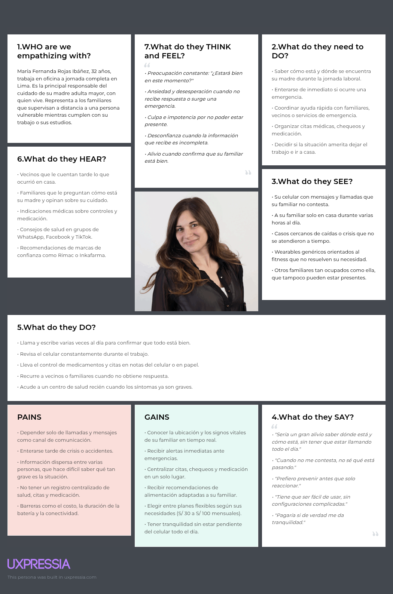

##### Empathy Map - Cuidador

El mapa del segmento de cuidadores refleja la experiencia de una persona encargada del cuidado directo y cotidiano de un Fragile Citizen. Destaca la carga que genera la supervisión manual continua, el riesgo de olvidar horarios de medicación o no advertir una caída durante sus ausencias, y la necesidad de contar con recordatorios, alertas automáticas y un historial centralizado que facilite su labor y la comunicación con la familia.

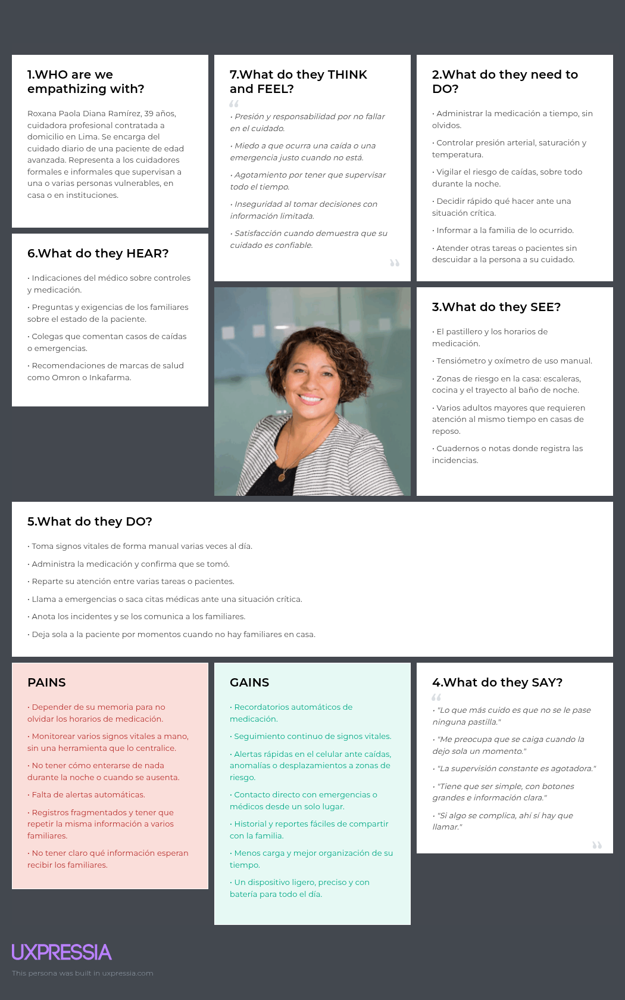

#### 2.3.5. Big Picture EventStorming

El Big Picture EventStorming permitió explorar el dominio de Guardian+ desde una perspectiva integral, identificando los principales Domain Events que ocurren a lo largo del ciclo de uso de la solución. Este artefacto fue utilizado para comprender de manera global cómo interactúan los actores principales, los sistemas externos y los eventos relevantes del negocio antes de profundizar en la identificación formal de Bounded Contexts.

A diferencia de un EventStorming detallado orientado al diseño interno de un contexto específico, en esta etapa se priorizó la visualización general del comportamiento del dominio. Por ello, se representaron los actores involucrados, los sistemas externos relevantes y los eventos significativos organizados de manera cronológica aproximada, desde la configuración inicial del ecosistema de cuidado hasta los eventos de monitoreo, prevención y respuesta ante incidentes.

Entre los actores identificados se encuentran el usuario de Guardian+, el suscriptor, el cuidador, el Fragile Citizen y los familiares o cuidadores responsables de responder ante alertas. Asimismo, se consideraron sistemas externos como el wearable y el sistema de tracking de ubicación, ya que forman parte esencial del funcionamiento de la solución. A partir de esta exploración fue posible reconocer eventos importantes como la creación de perfiles, el establecimiento de relaciones de cuidado, la activación de suscripciones, la programación y confirmación de recordatorios, la recepción de ubicaciones, la detección de anomalías biométricas, la emisión de advertencias preventivas, la detección de caídas, la activación de SOS y la atención de alertas críticas.

Este artefacto sirvió como base para construir una visión compartida del dominio, alinear el lenguaje del equipo y preparar el análisis posterior de Strategic Domain-Driven Design, especialmente las actividades de Candidate Context Discovery y Context Mapping.


#### 2.3.6. Ubiquitous Language

## Ubiquitous Language

Eric Evans plantea que el Ubiquitous Language se modela dentro de un contexto delimitado, donde se identifican los términos y conceptos del dominio del negocio, y no debe existir ambigüedad¹. A continuación, se presenta el glosario de términos del dominio de negocio de Guardian+, construido a partir del análisis de segmentos, entrevistas y arquetipos elaborados.

- **Fragile Citizen (Ciudadano frágil):** Persona con necesidades especiales —adulto mayor, paciente con movilidad reducida, condición crónica o de salud mental, entre otras— que requiere supervisión y monitoreo constante para garantizar su seguridad y bienestar.

- **Family (Familiar):** Persona con un vínculo familiar directo con el Fragile Citizen, que asume la responsabilidad principal o compartida de su cuidado, aunque no lo haga como labor remunerada.

- **Caregiver (Cuidador):** Persona contratada o designada para brindar atención directa y cotidiana al Fragile Citizen, encargándose de tareas como el suministro de medicación, la vigilancia de signos vitales y el acompañamiento diario.

- **Care Circle (Círculo de cuidado):** Conjunto de personas —familiares y/o cuidadores— vinculadas a un mismo Fragile Citizen, que coordinan y comparten la responsabilidad de su cuidado.

- **Bidirectional Care Bond (Lazo de cuidado bidireccional):** Vínculo de comunicación y monitoreo constante entre el Fragile Citizen y su Care Circle, que permite a ambas partes mantenerse informadas y conectadas en tiempo real.

- **Vital Signs (Signos vitales):** Conjunto de indicadores fisiológicos del Fragile Citizen —como frecuencia cardíaca, saturación de oxígeno, presión arterial y temperatura corporal— utilizados para evaluar su estado de salud.

- **Fall Detection (Detección de caídas):** Identificación automática de una caída sufrida por el Fragile Citizen, a partir de la cual se genera una alerta hacia su Care Circle.

- **Emergency Alert (Alerta de emergencia):** Notificación inmediata enviada al Care Circle o a servicios de emergencia ante una situación crítica en la salud o seguridad del Fragile Citizen, como una caída, un signo vital anormal o un episodio de crisis.

- **Crisis Episode (Episodio de crisis):** Situación en la que el Fragile Citizen presenta una alteración repentina y severa de su condición de salud física o mental, que puede requerir intervención inmediata de su Care Circle o de un centro de salud.

- **Safe Zone (Zona segura):** Área geográfica predefinida dentro de la cual se espera que el Fragile Citizen permanezca, cuyo abandono genera una notificación al Care Circle.

- **Medication Reminder (Recordatorio de medicación):** Aviso relacionado con los horarios en que el Fragile Citizen debe recibir su medicación, orientado a evitar olvidos o retrasos en su administración.

- **Care Routine (Rutina de cuidado):** Conjunto de actividades cotidianas relacionadas con la atención del Fragile Citizen, como la administración de medicamentos, el control de signos vitales y el acompañamiento diario.

- **Wellness Recommendation (Recomendación de bienestar):** Sugerencia orientada a mejorar la calidad de vida del Fragile Citizen, como pautas de alimentación o actividad física adaptadas a su condición.

- **Medical Appointment (Cita médica):** Encuentro programado entre el Fragile Citizen y un profesional de la salud, cuya organización y seguimiento suele estar a cargo de su Care Circle.

- **Health History (Historial de salud):** Registro acumulado de signos vitales, alertas e incidentes del Fragile Citizen, utilizado como referencia para consultas médicas y toma de decisiones de cuidado.

- **Peace of Mind (Tranquilidad):** Estado de confianza y bienestar emocional que experimenta el Care Circle al saber que el Fragile Citizen se encuentra seguro y monitoreado, incluso en su ausencia.

- **Care Plan (Plan de cuidado):** Modalidad de servicio contratada por el Care Circle, que define el nivel de funcionalidades y monitoreo disponibles según las necesidades específicas del Fragile Citizen.

- **Incident (Incidente):** Situación real que compromete la seguridad del Fragile Citizen —como una caída, una activación de SOS, una anomalía biométrica o la salida de una Safe Zone—, registrada con su tipo, severidad y estado, y que forma parte de su Health History.

- **Alert (Alerta):** Notificación derivada de un Incident y dirigida a un integrante específico del Care Circle a través de uno o más canales. Un mismo Incident puede originar varias Alerts; cuando su severidad es crítica, constituye una Emergency Alert.

- **Escalation Chain (Cadena de escalamiento):** Secuencia ordenada de contactos del Care Circle y tiempos de espera que se activa ante un Incident confirmado, notificando al siguiente contacto cuando el anterior no reconoce la Alert a tiempo.

- **Alert Settings (Configuración de alertas):** Preferencias de alertamiento definidas para cada Fragile Citizen: canales de notificación por severidad, umbrales personalizados, orden de los contactos de emergencia y estado del Silent Mode.

- **Severity (Severidad):** Nivel de criticidad de un Incident —crítica, alta o media— que determina la estrategia de notificación: difusión simultánea a todo el Care Circle o escalamiento secuencial mediante la Escalation Chain.

- **Acknowledgment (Reconocimiento):** Confirmación explícita de un integrante del Care Circle de haber recibido una Alert, que detiene el escalamiento y marca el Incident como en atención.

- **Preventive Warning (Advertencia preventiva):** Aviso de menor criticidad emitido ante señales tempranas de riesgo, que el Fragile Citizen puede confirmar como situación controlada y que escala a Alert si no obtiene respuesta.

- **Silent Mode (Modo silencioso):** Configuración que permite al Fragile Citizen recibir notificaciones de forma discreta, sin sonido, y que solo se anula ante Incidents de severidad crítica.

# 2.4. Requirements specification

## 2.4.1. User Stories

Requisitos definidos junto con el conjunto de User Stories y Epics para los requisitos identificados. Los User Stories incluyen Acceptance Criteria. En esta sección el equipo redacta una introducción, identifica todas las Epics y presenta un cuadro con la estructura especificada a continuación para cada User Storie.

### Epics Identificadas

* **EP01 - Monitoreo de Salud en Tiempo Real:** Supervisión continua y telemetría de signos vitales (ritmo cardíaco, presión arterial, saturación de oxígeno, temperatura y frecuencia respiratoria) para la detección temprana de irregularidades fisiológicas.
* **EP02 - Recordatorios y Rutinas de Bienestar:** Gestión programada de tomas de medicación, hidratación, actividad física, citas médicas y supervisión de patrones de descanso.
* **EP03 - Alertas y Gestión de Emergencias:** Procesamiento, detección local/remota y escalamiento automatizado ante situaciones de riesgo crítico como caídas, anomalías biomédicas o activación manual de SOS.
* **EP04 - Localización y Seguridad en Movilidad:** Rastreo geográfico en tiempo real, delimitación de perímetros seguros (geocercas) y canales de comunicación directa familiar.
* **EP05 - Presencia Web y Adquisición (Landing Page):** Difusión de la propuesta de valor, planes de suscripción, canales de contacto y educación al usuario respecto al ecosistema Guardian+.
* **EP06 - Servicios de Integración y Plataforma Backend:** Capacidades técnicas de ingesta de telemetría, consultas RESTful y persistencia segura de datos clínicos e incidentes.
* **EP07 - Spikes de Investigación Técnica:** Exploración, análisis de compatibilidad y prototipado rápido de dependencias de hardware embebido, protocolos IoT y pasarelas de pago.

---

<table>
  <tr>
    <th style="width: 20%;">Story ID</th>
    <th style="width: 25%;">User</th>
    <th style="width: 20%;">Priority</th>
    <th style="width: 35%;">Epic</th>
  </tr>
  <tr>
    <td><strong>US01</strong></td>
    <td>Cuidador</td>
    <td>High</td>
    <td>EP01 - Monitoreo de Salud en Tiempo Real</td>
  </tr>
  <tr>
    <th>Title</th>
    <td colspan="3"><strong>Visualización de ritmo cardíaco en tiempo real</strong></td>
  </tr>
  <tr>
    <th colspan="4" style="text-align: center;">Description</th>
  </tr>
  <tr>
    <td colspan="4">Como cuidador, deseo consultar la lectura actual del ritmo cardíaco del Fragile Citizen para monitorear su estabilidad cardiovascular e identificar irregularidades de manera oportuna.</td>
  </tr>
  <tr>
    <th colspan="4" style="text-align: center;">Acceptance Criteria</th>
  </tr>
  <tr>
    <td colspan="4"><strong>Escenario 1: Lectura de ritmo cardíaco en rango normal</strong><br>- <strong>Dado que</strong> el dispositivo wearable transmite lecturas de frecuencia cardíaca entre 60 y 100 lpm.<br>- <strong>Cuando</strong> el cuidador consulta el estado cardiovascular actual del Fragile Citizen.<br>- <strong>Entonces</strong> el sistema presenta el valor biométrico en tiempo real y clasifica el estado cardíaco como normal.<br><br><strong>Escenario 2: Detección de taquicardia o ritmo elevado</strong><br>- <strong>Dado que</strong> el dispositivo wearable transmite una frecuencia cardíaca superior a 100 lpm.<br>- <strong>Cuando</strong> el cuidador consulta el estado cardiovascular del Fragile Citizen.<br>- <strong>Entonces</strong> el sistema clasifica el valor como elevado y genera un indicador de advertencia sobre la lectura.<br><br><strong>Escenario 3: Detección de bradicardia o ritmo bajo</strong><br>- <strong>Dado que</strong> el dispositivo wearable transmite una frecuencia cardíaca inferior a 50 lpm.<br>- <strong>Cuando</strong> el cuidador consulta el estado cardiovascular del Fragile Citizen.<br>- <strong>Entonces</strong> el sistema clasifica el valor como bajo y genera un indicador de advertencia sobre la lectura.<br><br><strong>Escenario 4: Interrupción en la transmisión de telemetría</strong><br>- <strong>Dado que</strong> la transmisión de telemetría desde el dispositivo wearable no responde o pierde sincronización.<br>- <strong>Cuando</strong> el cuidador intenta consultar el ritmo cardíaco actual.<br>- <strong>Entonces</strong> el sistema expone el último valor histórico registrado indicando la ausencia de señal en vivo.</td>
  </tr>
</table>

<br>

<table>
  <tr>
    <th style="width: 20%;">Story ID</th>
    <th style="width: 25%;">User</th>
    <th style="width: 20%;">Priority</th>
    <th style="width: 35%;">Epic</th>
  </tr>
  <tr>
    <td><strong>US02</strong></td>
    <td>Cuidador</td>
    <td>High</td>
    <td>EP01 - Monitoreo de Salud en Tiempo Real</td>
  </tr>
  <tr>
    <th>Title</th>
    <td colspan="3"><strong>Visualización de presión arterial estimada</strong></td>
  </tr>
  <tr>
    <th colspan="4" style="text-align: center;">Description</th>
  </tr>
  <tr>
    <td colspan="4">Como cuidador, deseo consultar los valores estimados de presión arterial sistólica y diastólica del Fragile Citizen para evaluar su condición hemodinámica y prevenir descompensaciones.</td>
  </tr>
  <tr>
    <th colspan="4" style="text-align: center;">Acceptance Criteria</th>
  </tr>
  <tr>
    <td colspan="4"><strong>Escenario 1: Presión arterial dentro del umbral normotenso</strong><br>- <strong>Dado que</strong> el sensor registra valores de presión arterial dentro de 90/60 mmHg y 120/80 mmHg.<br>- <strong>Cuando</strong> el cuidador consulta las mediciones de presión arterial del Fragile Citizen.<br>- <strong>Entonces</strong> el sistema expone los valores sistólicos y diastólicos indicando un estado estable sin generar alertas.<br><br><strong>Escenario 2: Detección de pico hipertensivo</strong><br>- <strong>Dado que</strong> el sensor registra un valor sistólico superior a 140 mmHg o diastólico superior a 90 mmHg.<br>- <strong>Cuando</strong> el cuidador solicita los valores actuales de presión arterial.<br>- <strong>Entonces</strong> el sistema categoriza la lectura como valor fuera de rango y activa una marca de observación clínica.<br><br><strong>Escenario 3: Detección de hipotensión</strong><br>- <strong>Dado que</strong> el sensor registra una presión arterial inferior a 90/60 mmHg.<br>- <strong>Cuando</strong> el cuidador solicita los valores actuales de presión arterial.<br>- <strong>Entonces</strong> el sistema clasifica la condición como presión baja y notifica el valor fuera de umbral de seguridad.<br><br><strong>Escenario 4: Lectura fallida o no concluyente</strong><br>- <strong>Dado que</strong> las señales hemodinámicas obtenidas por el sensor presentan ruido excesivo o artefactos de movimiento.<br>- <strong>Cuando</strong> el cuidador consulta la presión arterial.<br>- <strong>Entonces</strong> el sistema descarta la medición errónea y reporta la lectura como inválida sin alterar los umbrales de alerta.</td>
  </tr>
</table>

<br>

<table>
  <tr>
    <th style="width: 20%;">Story ID</th>
    <th style="width: 25%;">User</th>
    <th style="width: 20%;">Priority</th>
    <th style="width: 35%;">Epic</th>
  </tr>
  <tr>
    <td><strong>US03</strong></td>
    <td>Cuidador</td>
    <td>High</td>
    <td>EP01 - Monitoreo de Salud en Tiempo Real</td>
  </tr>
  <tr>
    <th>Title</th>
    <td colspan="3"><strong>Visualización de saturación de oxígeno periférico (SpO₂)</strong></td>
  </tr>
  <tr>
    <th colspan="4" style="text-align: center;">Description</th>
  </tr>
  <tr>
    <td colspan="4">Como cuidador, deseo consultar el porcentaje de saturación de oxígeno en sangre del Fragile Citizen para identificar posibles cuadros de hipoxemia o dificultad respiratoria.</td>
  </tr>
  <tr>
    <th colspan="4" style="text-align: center;">Acceptance Criteria</th>
  </tr>
  <tr>
    <td colspan="4"><strong>Escenario 1: Saturación de oxígeno en nivel óptimo</strong><br>- <strong>Dado que</strong> la pulsera registra una saturación de oxígeno SpO₂ igual o superior al 95%.<br>- <strong>Cuando</strong> el cuidador consulta el nivel de oxígeno del Fragile Citizen.<br>- <strong>Entonces</strong> el sistema confirma el porcentaje en tiempo real catalogándolo en estado normal.<br><br><strong>Escenario 2: Hipoxemia o saturación por debajo de umbral seguro</strong><br>- <strong>Dado que</strong> el sensor de oximetría registra un valor inferior al 90% de SpO₂.<br>- <strong>Cuando</strong> el cuidador consulta el nivel de oxígeno o el sistema procesa la telemetría.<br>- <strong>Entonces</strong> el sistema clasifica inmediatamente el estado como crítico y reporta la anomalía de oxigenación.<br><br><strong>Escenario 3: Artefacto de censado por desconexión</strong><br>- <strong>Dado que</strong> la pulsera pierde contacto cutáneo continuo durante la captura fotopletismográfica.<br>- <strong>Cuando</strong> se procesa la lectura de saturación de oxígeno.<br>- <strong>Entonces</strong> el sistema suspende el cálculo de SpO₂ y registra una condición de lectura incompleta conservando el último registro válido.</td>
  </tr>
</table>

<br>

<table>
  <tr>
    <th style="width: 20%;">Story ID</th>
    <th style="width: 25%;">User</th>
    <th style="width: 20%;">Priority</th>
    <th style="width: 35%;">Epic</th>
  </tr>
  <tr>
    <td><strong>US04</strong></td>
    <td>Cuidador</td>
    <td>High</td>
    <td>EP01 - Monitoreo de Salud en Tiempo Real</td>
  </tr>
  <tr>
    <th>Title</th>
    <td colspan="3"><strong>Supervisión de temperatura corporal continua</strong></td>
  </tr>
  <tr>
    <th colspan="4" style="text-align: center;">Description</th>
  </tr>
  <tr>
    <td colspan="4">Como cuidador, deseo supervisar las mediciones de temperatura corporal del Fragile Citizen para alertar de forma oportuna episodios febriles o cuadros de hipotermia.</td>
  </tr>
  <tr>
    <th colspan="4" style="text-align: center;">Acceptance Criteria</th>
  </tr>
  <tr>
    <td colspan="4"><strong>Escenario 1: Registro de normotermia</strong><br>- <strong>Dado que</strong> el sensor infrarrojo reporta una temperatura cutánea normal entre 36.0 °C y 37.2 °C.<br>- <strong>Cuando</strong> el cuidador revisa la telemetría térmica del Fragile Citizen.<br>- <strong>Entonces</strong> el sistema valida el estado térmico como normal y registra la serie temporal.<br><br><strong>Escenario 2: Detección de estado febril</strong><br>- <strong>Dado que</strong> el sensor reporta una temperatura corporal que excede los 37.8 °C de manera sostenida.<br>- <strong>Cuando</strong> el sistema procesa la medición térmica recibida.<br>- <strong>Entonces</strong> el sistema cataloga el evento como fiebre y marca visualmente la anomalía en el perfil del usuario.<br><br><strong>Escenario 3: Detección de hipotermia</strong><br>- <strong>Dado que</strong> el sensor reporta una temperatura corporal inferior a 35.0 °C.<br>- <strong>Cuando</strong> el sistema procesa la medición térmica recibida.<br>- <strong>Entonces</strong> el sistema cataloga el registro como hipotermia y genera un aviso de control inmediato.</td>
  </tr>
</table>

<br>

<table>
  <tr>
    <th style="width: 20%;">Story ID</th>
    <th style="width: 25%;">User</th>
    <th style="width: 20%;">Priority</th>
    <th style="width: 35%;">Epic</th>
  </tr>
  <tr>
    <td><strong>US05</strong></td>
    <td>Cuidador</td>
    <td>High</td>
    <td>EP01 - Monitoreo de Salud en Tiempo Real</td>
  </tr>
  <tr>
    <th>Title</th>
    <td colspan="3"><strong>Visualización de frecuencia respiratoria estimada</strong></td>
  </tr>
  <tr>
    <th colspan="4" style="text-align: center;">Description</th>
  </tr>
  <tr>
    <td colspan="4">Como cuidador, deseo examinar la frecuencia respiratoria del Fragile Citizen para monitorear su ritmo ventilatorio e identificar taquipnea o bradipnea.</td>
  </tr>
  <tr>
    <th colspan="4" style="text-align: center;">Acceptance Criteria</th>
  </tr>
  <tr>
    <td colspan="4"><strong>Escenario 1: Frecuencia ventilatoria normal</strong><br>- <strong>Dado que</strong> el algoritmo biomédico procesa entre 12 y 20 respiraciones por minuto (rpm).<br>- <strong>Cuando</strong> el cuidador consulta la frecuencia respiratoria del Fragile Citizen.<br>- <strong>Entonces</strong> el sistema muestra la métrica actual catalogándola dentro de los estándares fisiológicos seguros.<br><br><strong>Escenario 2: Detección de frecuencia respiratoria alterada</strong><br>- <strong>Dado que</strong> el algoritmo estima una frecuencia respiratoria superior a 24 rpm o menor a 10 rpm.<br>- <strong>Cuando</strong> el sistema procesa el flujo continuo de datos respiratorios.<br>- <strong>Entonces</strong> el sistema destaca el valor como anómalo y actualiza la condición de alerta respiratoria del Fragile Citizen.</td>
  </tr>
</table>

<br>

<table>
  <tr>
    <th style="width: 20%;">Story ID</th>
    <th style="width: 25%;">User</th>
    <th style="width: 20%;">Priority</th>
    <th style="width: 35%;">Epic</th>
  </tr>
  <tr>
    <td><strong>US06</strong></td>
    <td>Fragile Citizen</td>
    <td>High</td>
    <td>EP02 - Recordatorios y Rutinas de Bienestar</td>
  </tr>
  <tr>
    <th>Title</th>
    <td colspan="3"><strong>Emisión y confirmación de recordatorios de medicación</strong></td>
  </tr>
  <tr>
    <th colspan="4" style="text-align: center;">Description</th>
  </tr>
  <tr>
    <td colspan="4">Como Fragile Citizen, deseo recibir avisos hápticos y sonoros en mi pulsera en los horarios exactos de mis medicamentos para no olvidar mis dosis prescritas.</td>
  </tr>
  <tr>
    <th colspan="4" style="text-align: center;">Acceptance Criteria</th>
  </tr>
  <tr>
    <td colspan="4"><strong>Escenario 1: Disparo puntual del recordatorio programado</strong><br>- <strong>Dado que</strong> existe una toma de medicamento registrada para una hora específica.<br>- <strong>Cuando</strong> el reloj del sistema alcanza la hora programada.<br>- <strong>Entonces</strong> el dispositivo emite señales vibratorias y sonoras, y el sistema marca el recordatorio como emitido.<br><br><strong>Escenario 2: Confirmación manual de ingestión de medicamento</strong><br>- <strong>Dado que</strong> el recordatorio de medicamento está activo en el dispositivo.<br>- <strong>Cuando</strong> el Fragile Citizen ejecuta la confirmación de la toma en el dispositivo.<br>- <strong>Entonces</strong> el sistema registra la dosis como administrada exitosamente y sincroniza el evento con el cuidador.<br><br><strong>Escenario 3: Reintento por omisión de confirmación</strong><br>- <strong>Dado que</strong> un recordatorio ha sido emitido y el Fragile Citizen no envía confirmación dentro de 10 minutos.<br>- <strong>Cuando</strong> expira dicho lapso de tolerancia.<br>- <strong>Entonces</strong> el sistema genera una segunda advertencia local y remite una notificación de dosis pendiente al cuidador.</td>
  </tr>
</table>

<br>

<table>
  <tr>
    <th style="width: 20%;">Story ID</th>
    <th style="width: 25%;">User</th>
    <th style="width: 20%;">Priority</th>
    <th style="width: 35%;">Epic</th>
  </tr>
  <tr>
    <td><strong>US07</strong></td>
    <td>Cuidador</td>
    <td>Medium</td>
    <td>EP01 - Monitoreo de Salud en Tiempo Real</td>
  </tr>
  <tr>
    <th>Title</th>
    <td colspan="3"><strong>Análisis comparativo y tendencias históricas de signos vitales</strong></td>
  </tr>
  <tr>
    <th colspan="4" style="text-align: center;">Description</th>
  </tr>
  <tr>
    <td colspan="4">Como cuidador, deseo revisar gráficas de tendencias históricas de los signos vitales para identificar patrones de deterioro fisiológico y compartir reportes con el médico tratante.</td>
  </tr>
  <tr>
    <th colspan="4" style="text-align: center;">Acceptance Criteria</th>
  </tr>
  <tr>
    <td colspan="4"><strong>Escenario 1: Generación de serie temporal consolidada</strong><br>- <strong>Dado que</strong> existen registros continuos de signos vitales durante los últimos 7 días.<br>- <strong>Cuando</strong> el cuidador solicita el análisis de tendencia para un parámetro específico y rango de fechas.<br>- <strong>Entonces</strong> el sistema consolida los valores históricos y calcula los promedios, valores mínimos y valores máximos.<br><br><strong>Escenario 2: Muestreo insuficiente para conformar tendencia</strong><br>- <strong>Dado que</strong> el período seleccionado posee menos de 12 horas acumuladas de lecturas válidas.<br>- <strong>Cuando</strong> el cuidador intenta generar la gráfica de tendencia histórica.<br>- <strong>Entonces</strong> el sistema notifica que el volumen de datos recolectado es insuficiente para emitir un gráfico representativo.</td>
  </tr>
</table>

<br>

<table>
  <tr>
    <th style="width: 20%;">Story ID</th>
    <th style="width: 25%;">User</th>
    <th style="width: 20%;">Priority</th>
    <th style="width: 35%;">Epic</th>
  </tr>
  <tr>
    <td><strong>US08</strong></td>
    <td>Familiar / Cuidador</td>
    <td>Highest</td>
    <td>EP03 - Alertas y Gestión de Emergencias</td>
  </tr>
  <tr>
    <th>Title</th>
    <td colspan="3"><strong>Detección automática de caídas y despacho de emergencia</strong></td>
  </tr>
  <tr>
    <th colspan="4" style="text-align: center;">Description</th>
  </tr>
  <tr>
    <td colspan="4">Como familiar o cuidador, deseo recibir una alerta crítica inmediata cuando la pulsera detecte un patrón de caída del Fragile Citizen para gestionar auxilio oportuno.</td>
  </tr>
  <tr>
    <th colspan="4" style="text-align: center;">Acceptance Criteria</th>
  </tr>
  <tr>
    <td colspan="4"><strong>Escenario 1: Identificación cinemática de caída no mitigada</strong><br>- <strong>Dado que</strong> el microcontrolador detecta una aceleración brusca seguida de impacto e inmovilidad relativa.<br>- <strong>Cuando</strong> concluye el ciclo de evaluación cinemática en el firmware.<br>- <strong>Entonces</strong> el sistema despacha una notificación de emergencia de máxima prioridad en un lapso menor a 5 segundos.<br><br><strong>Escenario 2: Cancelación por falsa alarma efectuada por el usuario</strong><br>- <strong>Dado que</strong> el sistema clasifica una caída y activa una ventana de cancelación local de 20 segundos.<br>- <strong>Cuando</strong> el Fragile Citizen activa la opción de confirmación de bienestar antes del vencimiento del temporizador.<br>- <strong>Entonces</strong> el sistema interrumpe el despacho a contactos de emergencia y clasifica el evento como falso positivo resuelto.<br><br><strong>Escenario 3: Escalamiento por falta de respuesta del usuario</strong><br>- <strong>Dado que</strong> se dispara el temporizador de alerta local por caída.<br>- <strong>Cuando</strong> el temporizador de 20 segundos culmina sin interacción del Fragile Citizen.<br>- <strong>Entonces</strong> el sistema confirma la emergencia, envía la telemetría con coordenadas GPS y activa el flujo de auxilio.</td>
  </tr>
</table>

<br>

<table>
  <tr>
    <th style="width: 20%;">Story ID</th>
    <th style="width: 25%;">User</th>
    <th style="width: 20%;">Priority</th>
    <th style="width: 35%;">Epic</th>
  </tr>
  <tr>
    <td><strong>US09</strong></td>
    <td>Familiar / Cuidador</td>
    <td>Highest</td>
    <td>EP03 - Alertas y Gestión de Emergencias</td>
  </tr>
  <tr>
    <th>Title</th>
    <td colspan="3"><strong>Generación de alertas por transgresión de umbrales biomédicos</strong></td>
  </tr>
  <tr>
    <th colspan="4" style="text-align: center;">Description</th>
  </tr>
  <tr>
    <td colspan="4">Como cuidador, deseo que el sistema genere una notificación prioritaria cuando los signos vitales del Fragile Citizen excedan los rangos seguros configurados para intervenir preventivamente.</td>
  </tr>
  <tr>
    <th colspan="4" style="text-align: center;">Acceptance Criteria</th>
  </tr>
  <tr>
    <td colspan="4"><strong>Escenario 1: Superación persistente de umbrales clínicos</strong><br>- <strong>Dado que</strong> una variable biomédica se mantiene fuera de los límites de seguridad durante más de 3 lecturas consecutivas.<br>- <strong>Cuando</strong> el motor de reglas procesa la telemetría entrante.<br>- <strong>Entonces</strong> el sistema genera un evento de alerta crítica con nivel de severidad correspondiente y la distribuye al cuidador.<br><br><strong>Escenario 2: Restablecimiento de valores basales seguros</strong><br>- <strong>Dado que</strong> una alerta por anomalía biomédica se encuentra activa.<br>- <strong>Cuando</strong> las lecturas biométricas retornan a valores dentro de los márgenes seguros por 5 minutos continuos.<br>- <strong>Entonces</strong> el sistema actualiza el estado del incidente a estabilizado y notifica el cierre de la anomalía al cuidador.</td>
  </tr>
</table>

<br>

<table>
  <tr>
    <th style="width: 20%;">Story ID</th>
    <th style="width: 25%;">User</th>
    <th style="width: 20%;">Priority</th>
    <th style="width: 35%;">Epic</th>
  </tr>
  <tr>
    <td><strong>US10</strong></td>
    <td>Fragile Citizen</td>
    <td>High</td>
    <td>EP03 - Alertas y Gestión de Emergencias</td>
  </tr>
  <tr>
    <th>Title</th>
    <td colspan="3"><strong>Confirmación manual de estado de bienestar tras incidente</strong></td>
  </tr>
  <tr>
    <th colspan="4" style="text-align: center;">Description</th>
  </tr>
  <tr>
    <td colspan="4">Como Fragile Citizen, deseo validar manualmente desde mi pulsera que me encuentro a salvo tras dispararse una advertencia para evitar movilizaciones innecesarias de mis familiares.</td>
  </tr>
  <tr>
    <th colspan="4" style="text-align: center;">Acceptance Criteria</th>
  </tr>
  <tr>
    <td colspan="4"><strong>Escenario 1: Notificación de resolución rápida por parte del Fragile Citizen</strong><br>- <strong>Dado que</strong> se ha emitido una advertencia preventiva en el ecosistema Guardian+.<br>- <strong>Cuando</strong> el Fragile Citizen confirma la opción de estado seguro dentro de una ventana de 30 segundos.<br>- <strong>Entonces</strong> el sistema notifica al cuidador que el evento ha sido atendido y descartado por el propio usuario.<br><br><strong>Escenario 2: Vencimiento de ventana de confirmación manual</strong><br>- <strong>Dado que</strong> la advertencia preventiva se encuentra activa en el dispositivo.<br>- <strong>Cuando</strong> transcurren 30 segundos continuos sin registro de interacción manual.<br>- <strong>Entonces</strong> el sistema promueve la advertencia a categoría de alerta de confirmación requerida y la despacha al cuidador.</td>
  </tr>
</table>

<br>

<table>
  <tr>
    <th style="width: 20%;">Story ID</th>
    <th style="width: 25%;">User</th>
    <th style="width: 20%;">Priority</th>
    <th style="width: 35%;">Epic</th>
  </tr>
  <tr>
    <td><strong>US11</strong></td>
    <td>Familiar / Cuidador</td>
    <td>Highest</td>
    <td>EP03 - Alertas y Gestión de Emergencias</td>
  </tr>
  <tr>
    <th>Title</th>
    <td colspan="3"><strong>Escalamiento automatizado de alertas críticas no atendidas</strong></td>
  </tr>
  <tr>
    <th colspan="4" style="text-align: center;">Description</th>
  </tr>
  <tr>
    <td colspan="4">Como cuidador, deseo que las alertas críticas no reconocidas se transmitan a contactos secundarios o entidades de apoyo para asegurar que el Fragile Citizen reciba atención de emergencia.</td>
  </tr>
  <tr>
    <th colspan="4" style="text-align: center;">Acceptance Criteria</th>
  </tr>
  <tr>
    <td colspan="4"><strong>Escenario 1: Reenvío a lista jerárquica de contactos de respaldo</strong><br>- <strong>Dado que</strong> se emite una alerta crítica de emergencia dirigida al cuidador primario.<br>- <strong>Cuando</strong> el cuidador primario no confirma la recepción del evento dentro de los 60 segundos posteriores.<br>- <strong>Entonces</strong> el sistema despacha la alerta de auxilio de forma simultánea a los contactos secundarios definidos.<br><br><strong>Escenario 2: Neutralización del protocolo de escalamiento</strong><br>- <strong>Dado que</strong> la alerta crítica ha sido escalada hacia contactos secundarios.<br>- <strong>Cuando</strong> cualquiera de los contactos autorizados registra el reconocimiento de la emergencia.<br>- <strong>Entonces</strong> el sistema detiene los envíos sucesivos de escalamiento y actualiza el estado a incidente en atención.</td>
  </tr>
</table>

<br>

<table>
  <tr>
    <th style="width: 20%;">Story ID</th>
    <th style="width: 25%;">User</th>
    <th style="width: 20%;">Priority</th>
    <th style="width: 35%;">Epic</th>
  </tr>
  <tr>
    <td><strong>US12</strong></td>
    <td>Familiar / Cuidador</td>
    <td>Medium</td>
    <td>EP03 - Alertas y Gestión de Emergencias</td>
  </tr>
  <tr>
    <th>Title</th>
    <td colspan="3"><strong>Configuración y parametrización de niveles de alerta</strong></td>
  </tr>
  <tr>
    <th colspan="4" style="text-align: center;">Description</th>
  </tr>
  <tr>
    <td colspan="4">Como cuidador, deseo personalizar los canales y umbrales de severidad de las notificaciones para adaptar el comportamiento del sistema a los requerimientos clínicos específicos del Fragile Citizen.</td>
  </tr>
  <tr>
    <th colspan="4" style="text-align: center;">Acceptance Criteria</th>
  </tr>
  <tr>
    <td colspan="4"><strong>Escenario 1: Modificación de canales de notificación por severidad</strong><br>- <strong>Dado que</strong> el cuidador dispone de permisos de administración sobre el perfil del Fragile Citizen.<br>- <strong>Cuando</strong> el cuidador asigna canales específicos (vibración, notificación prioritaria, SMS) a un tipo de alerta.<br>- <strong>Entonces</strong> el sistema persiste la configuración y la aplica de forma inmediata a los eventos generados a partir de ese momento.<br><br><strong>Escenario 2: Restablecimiento de umbrales clínicos predeterminados</strong><br>- <strong>Dado que</strong> existen parámetros de alerta modificados respecto a la configuración original.<br>- <strong>Cuando</strong> el cuidador opta por restablecer los valores de fábrica.<br>- <strong>Entonces</strong> el sistema reasigna los rangos estándar definidos por las guías clínicas preconfiguradas.</td>
  </tr>
</table>

<br>

<table>
  <tr>
    <th style="width: 20%;">Story ID</th>
    <th style="width: 25%;">User</th>
    <th style="width: 20%;">Priority</th>
    <th style="width: 35%;">Epic</th>
  </tr>
  <tr>
    <td><strong>US13</strong></td>
    <td>Cuidador</td>
    <td>Medium</td>
    <td>EP02 - Recordatorios y Rutinas de Bienestar</td>
  </tr>
  <tr>
    <th>Title</th>
    <td colspan="3"><strong>Programación y notificación de consultas médicas</strong></td>
  </tr>
  <tr>
    <th colspan="4" style="text-align: center;">Description</th>
  </tr>
  <tr>
    <td colspan="4">Como cuidador, deseo agendar los controles y citas médicas del Fragile Citizen para recibir avisos preventivos y evitar inasistencias a los centros de salud.</td>
  </tr>
  <tr>
    <th colspan="4" style="text-align: center;">Acceptance Criteria</th>
  </tr>
  <tr>
    <td colspan="4"><strong>Escenario 1: Generación de recordatorio previo a la cita</strong><br>- <strong>Dado que</strong> existe una cita médica registrada en el calendario del Fragile Citizen.<br>- <strong>Cuando</strong> el tiempo restante coincide con la antelación configurada por el cuidador (por ejemplo, 1 hora antes).<br>- <strong>Entonces</strong> el sistema genera una notificación preventiva tanto en el dispositivo del Fragile Citizen como en el del cuidador.<br><br><strong>Escenario 2: Cancelación de evento programado</strong><br>- <strong>Dado que</strong> una cita médica agendada es anulada por el cuidador en el sistema.<br>- <strong>Cuando</strong> se confirma la cancelación de la cita.<br>- <strong>Entonces</strong> el sistema desactiva los temporizadores asociados y purga los recordatorios pendientes correspondientes.</td>
  </tr>
</table>

<br>

<table>
  <tr>
    <th style="width: 20%;">Story ID</th>
    <th style="width: 25%;">User</th>
    <th style="width: 20%;">Priority</th>
    <th style="width: 35%;">Epic</th>
  </tr>
  <tr>
    <td><strong>US14</strong></td>
    <td>Fragile Citizen</td>
    <td>Low</td>
    <td>EP02 - Recordatorios y Rutinas de Bienestar</td>
  </tr>
  <tr>
    <th>Title</th>
    <td colspan="3"><strong>Recordatorios programados para actividad física ligera</strong></td>
  </tr>
  <tr>
    <th colspan="4" style="text-align: center;">Description</th>
  </tr>
  <tr>
    <td colspan="4">Como Fragile Citizen, deseo que mi pulsera me recuerde realizar pausas activas o ejercicios de movilidad suave para mantener mi autonomía funcional.</td>
  </tr>
  <tr>
    <th colspan="4" style="text-align: center;">Acceptance Criteria</th>
  </tr>
  <tr>
    <td colspan="4"><strong>Escenario 1: Disparo de rutina de ejercicio planificada</strong><br>- <strong>Dado que</strong> se ha configurado un plan de actividad física para un horario definido.<br>- <strong>Cuando</strong> el reloj del sistema coincide con dicho horario.<br>- <strong>Entonces</strong> la pulsera emite una señal háptica indicando el inicio del bloque de actividad física.<br><br><strong>Escenario 2: Registro de cumplimiento de actividad</strong><br>- <strong>Dado que</strong> el recordatorio de actividad física ha sido presentado al Fragile Citizen.<br>- <strong>Cuando</strong> el usuario confirma la finalización del ejercicio en el dispositivo.<br>- <strong>Entonces</strong> el sistema incrementa el contador de adherencia a rutinas de movilidad en el registro diario.</td>
  </tr>
</table>

<br>

<table>
  <tr>
    <th style="width: 20%;">Story ID</th>
    <th style="width: 25%;">User</th>
    <th style="width: 20%;">Priority</th>
    <th style="width: 35%;">Epic</th>
  </tr>
  <tr>
    <td><strong>US15</strong></td>
    <td>Fragile Citizen</td>
    <td>Highest</td>
    <td>EP03 - Alertas y Gestión de Emergencias</td>
  </tr>
  <tr>
    <th>Title</th>
    <td colspan="3"><strong>Activación de auxilio mediante botón SOS en pulsera</strong></td>
  </tr>
  <tr>
    <th colspan="4" style="text-align: center;">Description</th>
  </tr>
  <tr>
    <td colspan="4">Como Fragile Citizen, deseo pulsar un botón SOS físico en la pulsera ante cualquier peligro para pedir asistencia inmediata a mis familiares sin depender del teléfono móvil.</td>
  </tr>
  <tr>
    <th colspan="4" style="text-align: center;">Acceptance Criteria</th>
  </tr>
  <tr>
    <td colspan="4"><strong>Escenario 1: Disparo efectivo por pulsación sostenida</strong><br>- <strong>Dado que</strong> la pulsera se encuentra encendida y con enlace de datos disponible.<br>- <strong>Cuando</strong> el Fragile Citizen presiona el botón físico de SOS por al menos 3 segundos continuos.<br>- <strong>Entonces</strong> el sistema despacha de forma inmediata un evento de auxilio de máxima severidad incluyendo la ubicación actual.<br><br><strong>Escenario 2: Aborto preventivo por pulsación involuntaria</strong><br>- <strong>Dado que</strong> el usuario presiona el botón de SOS por un lapso inferior a 3 segundos.<br>- <strong>Cuando</strong> se libera la presión del botón sin alcanzar el umbral requerido.<br>- <strong>Entonces</strong> el dispositivo descarta la acción y evita el despacho de cualquier evento de alarma.</td>
  </tr>
</table>

<br>

<table>
  <tr>
    <th style="width: 20%;">Story ID</th>
    <th style="width: 25%;">User</th>
    <th style="width: 20%;">Priority</th>
    <th style="width: 35%;">Epic</th>
  </tr>
  <tr>
    <td><strong>US16</strong></td>
    <td>Cuidador</td>
    <td>High</td>
    <td>EP03 - Alertas y Gestión de Emergencias</td>
  </tr>
  <tr>
    <th>Title</th>
    <td colspan="3"><strong>Administración de agenda de contactos de auxilio</strong></td>
  </tr>
  <tr>
    <th colspan="4" style="text-align: center;">Description</th>
  </tr>
  <tr>
    <td colspan="4">Como cuidador, deseo registrar y ordenar los contactos prioritarios de emergencia para garantizar que las notificaciones críticas se canalicen a las personas correctas.</td>
  </tr>
  <tr>
    <th colspan="4" style="text-align: center;">Acceptance Criteria</th>
  </tr>
  <tr>
    <td colspan="4"><strong>Escenario 1: Incorporación de nuevo contacto de auxilio válido</strong><br>- <strong>Dado que</strong> el cuidador ingresa nombre completo, parentesco y número telefónico con código internacional válido.<br>- <strong>Cuando</strong> se solicita el guardado del nuevo contacto.<br>- <strong>Entonces</strong> el sistema valida la integridad de los datos, almacena el registro y lo asocia a la cadena de alertas.<br><br><strong>Escenario 2: Retiro de contacto de emergencia obsoleto</strong><br>- <strong>Dado que</strong> un contacto de emergencia existe en el directorio del Fragile Citizen.<br>- <strong>Cuando</strong> el cuidador elimina dicho contacto y la lista mantiene al menos un contacto primario.<br>- <strong>Entonces</strong> el sistema actualiza la lista de distribución excluyendo al contacto removido de futuros eventos.</td>
  </tr>
</table>

<br>

<table>
  <tr>
    <th style="width: 20%;">Story ID</th>
    <th style="width: 25%;">User</th>
    <th style="width: 20%;">Priority</th>
    <th style="width: 35%;">Epic</th>
  </tr>
  <tr>
    <td><strong>US17</strong></td>
    <td>Cuidador</td>
    <td>Low</td>
    <td>EP02 - Recordatorios y Rutinas de Bienestar</td>
  </tr>
  <tr>
    <th>Title</th>
    <td colspan="3"><strong>Estimación y registro de fases de sueño</strong></td>
  </tr>
  <tr>
    <th colspan="4" style="text-align: center;">Description</th>
  </tr>
  <tr>
    <td colspan="4">Como cuidador, deseo acceder al registro de descanso nocturno del Fragile Citizen para evaluar la calidad del sueño e identificar patrones de insomnio o agitación.</td>
  </tr>
  <tr>
    <th colspan="4" style="text-align: center;">Acceptance Criteria</th>
  </tr>
  <tr>
    <td colspan="4"><strong>Escenario 1: Procesamiento consolidado de descanso nocturno</strong><br>- <strong>Dado que</strong> la pulsera recopila datos de micromovimientos y frecuencia cardíaca durante la ventana nocturna.<br>- <strong>Cuando</strong> el sistema procesa el intervalo al inicio de la mañana.<br>- <strong>Entonces</strong> el sistema computa el total de horas de sueño, la continuidad del descanso y el número de despertares.<br><br><strong>Escenario 2: Identificación de descanso interrumpido atípico</strong><br>- <strong>Dado que</strong> el análisis de telemetría detecta más de 4 interrupciones prolongadas en una sola noche.<br>- <strong>Cuando</strong> se consolida el reporte matutino.<br>- <strong>Entonces</strong> el sistema cataloga la sesión de descanso como sueño fragmentado y lo registra en el historial del Fragile Citizen.</td>
  </tr>
</table>

<br>

<table>
  <tr>
    <th style="width: 20%;">Story ID</th>
    <th style="width: 25%;">User</th>
    <th style="width: 20%;">Priority</th>
    <th style="width: 35%;">Epic</th>
  </tr>
  <tr>
    <td><strong>US18</strong></td>
    <td>Cuidador</td>
    <td>Highest</td>
    <td>EP04 - Localización y Seguridad en Movilidad</td>
  </tr>
  <tr>
    <th>Title</th>
    <td colspan="3"><strong>Telemetría de geolocalización en tiempo real</strong></td>
  </tr>
  <tr>
    <th colspan="4" style="text-align: center;">Description</th>
  </tr>
  <tr>
    <td colspan="4">Como cuidador, deseo consultar las coordenadas de ubicación en tiempo real del Fragile Citizen para verificar su paradero y actuar rápidamente si sufre una desorientación.</td>
  </tr>
  <tr>
    <th colspan="4" style="text-align: center;">Acceptance Criteria</th>
  </tr>
  <tr>
    <td colspan="4"><strong>Escenario 1: Transmisión de coordenadas en condiciones normales</strong><br>- <strong>Dado que</strong> el receptor GNSS de la pulsera dispone de cobertura satelital activa.<br>- <strong>Cuando</strong> el cuidador solicita la posición actual del Fragile Citizen.<br>- <strong>Entonces</strong> el sistema entrega las coordenadas de latitud y longitud con una marca de tiempo actualizada dentro de los últimos 30 segundos.<br><br><strong>Escenario 2: Degradación de señal satelital en interiores</strong><br>- <strong>Dado que</strong> la pulsera entra en una zona subterránea o sin cobertura GNSS.<br>- <strong>Cuando</strong> se solicita la localización geográfica del Fragile Citizen.<br>- <strong>Entonces</strong> el sistema expone el último punto geográfico válido conocido indicando explícitamente la pérdida momentánea de fijación satelital.</td>
  </tr>
</table>

<br>

<table>
  <tr>
    <th style="width: 20%;">Story ID</th>
    <th style="width: 25%;">User</th>
    <th style="width: 20%;">Priority</th>
    <th style="width: 35%;">Epic</th>
  </tr>
  <tr>
    <td><strong>US19</strong></td>
    <td>Cuidador</td>
    <td>Medium</td>
    <td>EP01 - Monitoreo de Salud en Tiempo Real</td>
  </tr>
  <tr>
    <th>Title</th>
    <td colspan="3"><strong>Exportación de reporte cronológico de telemetría médica</strong></td>
  </tr>
  <tr>
    <th colspan="4" style="text-align: center;">Description</th>
  </tr>
  <tr>
    <td colspan="4">Como cuidador, deseo generar y exportar el historial de signos vitales en formato estandarizado para respaldar las consultas médicas presenciales.</td>
  </tr>
  <tr>
    <th colspan="4" style="text-align: center;">Acceptance Criteria</th>
  </tr>
  <tr>
    <td colspan="4"><strong>Escenario 1: Exportación exitosa de expediente de telemetría</strong><br>- <strong>Dado que</strong> el Fragile Citizen cuenta con mediciones registradas durante un intervalo de 30 días.<br>- <strong>Cuando</strong> el cuidador selecciona el rango y solicita la exportación documental.<br>- <strong>Entonces</strong> el sistema compila un reporte estructurado en formato PDF conteniendo tablas y resúmenes de las anomalías detectadas.<br><br><strong>Escenario 2: Solicitud de exportación en rango vacío</strong><br>- <strong>Dado que</strong> no existen lecturas de signos vitales dentro del período seleccionado.<br>- <strong>Cuando</strong> el cuidador intenta ejecutar la exportación documental.<br>- <strong>Entonces</strong> el sistema bloquea la generación del archivo y notifica que no existen registros en el rango indicado.</td>
  </tr>
</table>

<br>

<table>
  <tr>
    <th style="width: 20%;">Story ID</th>
    <th style="width: 25%;">User</th>
    <th style="width: 20%;">Priority</th>
    <th style="width: 35%;">Epic</th>
  </tr>
  <tr>
    <td><strong>US20</strong></td>
    <td>Fragile Citizen / Cuidador</td>
    <td>High</td>
    <td>EP03 - Alertas y Gestión de Emergencias</td>
  </tr>
  <tr>
    <th>Title</th>
    <td colspan="3"><strong>Notificación de nivel crítico de batería en wearable</strong></td>
  </tr>
  <tr>
    <th colspan="4" style="text-align: center;">Description</th>
  </tr>
  <tr>
    <td colspan="4">Como Fragile Citizen, o cuidador, deseo recibir una advertencia oportuna cuando la batería de la pulsera descienda del 20% para recargarla y evitar la suspensión del monitoreo.</td>
  </tr>
  <tr>
    <th colspan="4" style="text-align: center;">Acceptance Criteria</th>
  </tr>
  <tr>
    <td colspan="4"><strong>Escenario 1: Advertencia preventiva por descarga progresiva</strong><br>- <strong>Dado que</strong> el circuito de carga de la pulsera mide un remanente igual o menor al 20% de energía.<br>- <strong>Cuando</strong> se procesa la lectura periódica del estado de la batería.<br>- <strong>Entonces</strong> el dispositivo activa un aviso de recarga necesaria y envía una notificación preventiva a la aplicación del cuidador.<br><br><strong>Escenario 2: Umbral de apagado inminente</strong><br>- <strong>Dado que</strong> el nivel de batería alcanza un 5% de capacidad residual.<br>- <strong>Cuando</strong> el dispositivo evalúa su reserva energética crítica.<br>- <strong>Entonces</strong> el sistema emite una última telemetría con prioridad crítica avisando del cese temporal inminente de la supervisión.</td>
  </tr>
</table>

<br>

<table>
  <tr>
    <th style="width: 20%;">Story ID</th>
    <th style="width: 25%;">User</th>
    <th style="width: 20%;">Priority</th>
    <th style="width: 35%;">Epic</th>
  </tr>
  <tr>
    <td><strong>US21</strong></td>
    <td>Cuidador</td>
    <td>High</td>
    <td>EP01 - Monitoreo de Salud en Tiempo Real</td>
  </tr>
  <tr>
    <th>Title</th>
    <td colspan="3"><strong>Sincronización y persistencia resiliente de telemetría (Offline Sync)</strong></td>
  </tr>
  <tr>
    <th colspan="4" style="text-align: center;">Description</th>
  </tr>
  <tr>
    <td colspan="4">Como cuidador, deseo que los datos recopilados por la pulsera durante pérdidas de red se almacenen localmente y se sincronicen al recuperar conexión para garantizar la integridad histórica.</td>
  </tr>
  <tr>
    <th colspan="4" style="text-align: center;">Acceptance Criteria</th>
  </tr>
  <tr>
    <td colspan="4"><strong>Escenario 1: Buffer local por indisponibilidad de conexión</strong><br>- <strong>Dado que</strong> el dispositivo wearable pierde conexión a la red de datos durante su operación.<br>- <strong>Cuando</strong> se efectúan nuevas lecturas biométricas o de incidentes.<br>- <strong>Entonces</strong> el microcontrolador persiste las tramas localmente en su memoria no volátil manteniendo el orden cronológico.<br><br><strong>Escenario 2: Vaciado automático de buffer tras reconexión</strong><br>- <strong>Dado que</strong> existen tramas biométricas retenidas en la memoria local del dispositivo.<br>- <strong>Cuando</strong> se restablece el enlace inalámbrico con el backend.<br>- <strong>Entonces</strong> el dispositivo transmite en bloque la telemetría pendiente y el servidor las persiste eliminando registros duplicados.</td>
  </tr>
</table>

<br>

<table>
  <tr>
    <th style="width: 20%;">Story ID</th>
    <th style="width: 25%;">User</th>
    <th style="width: 20%;">Priority</th>
    <th style="width: 35%;">Epic</th>
  </tr>
  <tr>
    <td><strong>US22</strong></td>
    <td>Fragile Citizen</td>
    <td>Low</td>
    <td>EP03 - Alertas y Gestión de Emergencias</td>
  </tr>
  <tr>
    <th>Title</th>
    <td colspan="3"><strong>Activación de modo discreto y silencioso en wearable</strong></td>
  </tr>
  <tr>
    <th colspan="4" style="text-align: center;">Description</th>
  </tr>
  <tr>
    <td colspan="4">Como Fragile Citizen, deseo habilitar un modo de vibración táctil silenciosa para recibir mis notificaciones sin perturbar mi entorno en espacios públicos o eventos sociales.</td>
  </tr>
  <tr>
    <th colspan="4" style="text-align: center;">Acceptance Criteria</th>
  </tr>
  <tr>
    <td colspan="4"><strong>Escenario 1: Conmutación a perfil táctil silencioso</strong><br>- <strong>Dado que</strong> la pulsera opera bajo el perfil de notificaciones auditivas estándar.<br>- <strong>Cuando</strong> el usuario activa el modo discreto en el dispositivo.<br>- <strong>Entonces</strong> el sistema silencia los zumbadores acústicos y canaliza todos los avisos a través de patrones vibratorios.<br><br><strong>Escenario 2: Excepción para eventos de emergencia crítica</strong><br>- <strong>Dado que</strong> la pulsera se encuentra configurada en modo discreto.<br>- <strong>Cuando</strong> se dispara una alerta clasificada como emergencia crítica o SOS.<br>- <strong>Entonces</strong> el sistema anula la restricción silenciosa y ejecuta las señales audibles de máxima alerta.</td>
  </tr>
</table>

<br>

<table>
  <tr>
    <th style="width: 20%;">Story ID</th>
    <th style="width: 25%;">User</th>
    <th style="width: 20%;">Priority</th>
    <th style="width: 35%;">Epic</th>
  </tr>
  <tr>
    <td><strong>US23</strong></td>
    <td>Familiar</td>
    <td>Medium</td>
    <td>EP04 - Localización y Seguridad en Movilidad</td>
  </tr>
  <tr>
    <th>Title</th>
    <td colspan="3"><strong>Establecimiento de canal de comunicación directa</strong></td>
  </tr>
  <tr>
    <th colspan="4" style="text-align: center;">Description</th>
  </tr>
  <tr>
    <td colspan="4">Como familiar, deseo iniciar un canal de comunicación rápida con el Fragile Citizen para verificar su condición ante cualquier sospecha o inquietud cotidiana.</td>
  </tr>
  <tr>
    <th colspan="4" style="text-align: center;">Acceptance Criteria</th>
  </tr>
  <tr>
    <td colspan="4"><strong>Escenario 1: Enlace de comunicación exitoso</strong><br>- <strong>Dado que</strong> el Fragile Citizen y el familiar cuentan con dispositivos vinculados y conexión de datos activa.<br>- <strong>Cuando</strong> el familiar solicita la apertura de un canal de voz o videollamada.<br>- <strong>Entonces</strong> el sistema establece la sesión interactiva y confirma la conexión entre ambas partes.<br><br><strong>Escenario 2: Llamada no contestada</strong><br>- <strong>Dado que</strong> se emite la señal de comunicación hacia el dispositivo receptor.<br>- <strong>Cuando</strong> transcurren 30 segundos sin que el receptor atienda la solicitud.<br>- <strong>Entonces</strong> el sistema cierra el intento de conexión y genera un registro de llamada no atendida en el historial del cuidador.</td>
  </tr>
</table>

<br>

<table>
  <tr>
    <th style="width: 20%;">Story ID</th>
    <th style="width: 25%;">User</th>
    <th style="width: 20%;">Priority</th>
    <th style="width: 35%;">Epic</th>
  </tr>
  <tr>
    <td><strong>US24</strong></td>
    <td>Cuidador</td>
    <td>Medium</td>
    <td>EP01 - Monitoreo de Salud en Tiempo Real</td>
  </tr>
  <tr>
    <th>Title</th>
    <td colspan="3"><strong>Consolidación y despacho de reporte semanal de salud</strong></td>
  </tr>
  <tr>
    <th colspan="4" style="text-align: center;">Description</th>
  </tr>
  <tr>
    <td colspan="4">Como cuidador, deseo recibir una síntesis semanal automatizada del estado de salud del Fragile Citizen para evaluar su evolución global sin revisar telemetría segundo a segundo.</td>
  </tr>
  <tr>
    <th colspan="4" style="text-align: center;">Acceptance Criteria</th>
  </tr>
  <tr>
    <td colspan="4"><strong>Escenario 1: Compilación automática al cierre de ciclo semanal</strong><br>- <strong>Dado que</strong> culmina el ciclo operativo de 7 días del Fragile Citizen.<br>- <strong>Cuando</strong> el servicio de reportes ejecuta su tarea programada de cierre.<br>- <strong>Entonces</strong> el sistema genera una síntesis agregando estabilidad de signos vitales, alertas disparadas y porcentaje de adherencia a medicación.<br><br><strong>Escenario 2: Resaltado de incidentes recurrentes</strong><br>- <strong>Dado que</strong> el Fragile Citizen experimentó más de 3 anomalías del mismo tipo a lo largo de la semana.<br>- <strong>Cuando</strong> se genera la síntesis semanal.<br>- <strong>Entonces</strong> el sistema marca el parámetro como recurrente e incluye una recomendación de revisión médica preventiva.</td>
  </tr>
</table>

<br>

<table>
  <tr>
    <th style="width: 20%;">Story ID</th>
    <th style="width: 25%;">User</th>
    <th style="width: 20%;">Priority</th>
    <th style="width: 35%;">Epic</th>
  </tr>
  <tr>
    <td><strong>US25</strong></td>
    <td>Familiar</td>
    <td>High</td>
    <td>EP03 - Alertas y Gestión de Emergencias</td>
  </tr>
  <tr>
    <th>Title</th>
    <td colspan="3"><strong>Despacho simultáneo a múltiples contactos de auxilio</strong></td>
  </tr>
  <tr>
    <th colspan="4" style="text-align: center;">Description</th>
  </tr>
  <tr>
    <td colspan="4">Como familiar, deseo que las alertas de máxima criticidad se remitan simultáneamente a todo el Care Circle registrado para maximizar la velocidad de respuesta.</td>
  </tr>
  <tr>
    <th colspan="4" style="text-align: center;">Acceptance Criteria</th>
  </tr>
  <tr>
    <td colspan="4"><strong>Escenario 1: Difusión simultánea ante evento crítico</strong><br>- <strong>Dado que</strong> se confirma una emergencia crítica (como caída o SOS manual).<br>- <strong>Cuando</strong> el motor de despacho procesa el incidente.<br>- <strong>Entonces</strong> el sistema emite notificaciones simultáneas a todos los contactos registrados en el Care Circle activo.<br><br><strong>Escenario 2: Notificación colaborativa de atención confirmada</strong><br>- <strong>Dado que</strong> múltiples familiares recibieron la notificación de emergencia en paralelo.<br>- <strong>Cuando</strong> el primer familiar pulsa la opción de acudir al auxilio.<br>- <strong>Entonces</strong> el sistema distribuye una actualización al resto de los contactos informando que dicho integrante ya asumió la respuesta.</td>
  </tr>
</table>

<br>

<table>
  <tr>
    <th style="width: 20%;">Story ID</th>
    <th style="width: 25%;">User</th>
    <th style="width: 20%;">Priority</th>
    <th style="width: 35%;">Epic</th>
  </tr>
  <tr>
    <td><strong>US26</strong></td>
    <td>Fragile Citizen</td>
    <td>Low</td>
    <td>EP02 - Recordatorios y Rutinas de Bienestar</td>
  </tr>
  <tr>
    <th>Title</th>
    <td colspan="3"><strong>Recordatorios periódicos de hidratación y pausas activas</strong></td>
  </tr>
  <tr>
    <th colspan="4" style="text-align: center;">Description</th>
  </tr>
  <tr>
    <td colspan="4">Como Fragile Citizen, deseo que la pulsera me avise periódicamente cuándo tomar agua o levantarme para evitar la deshidratación y la rigidez articular.</td>
  </tr>
  <tr>
    <th colspan="4" style="text-align: center;">Acceptance Criteria</th>
  </tr>
  <tr>
    <td colspan="4"><strong>Escenario 1: Notificación de intervalo de hidratación</strong><br>- <strong>Dado que</strong> transcurren 120 minutos consecutivos sin registro de confirmación de ingesta hídrica.<br>- <strong>Cuando</strong> se cumple la ventana de tiempo establecida.<br>- <strong>Entonces</strong> el dispositivo emite un patrón de vibración indicando el recordatorio de hidratación.<br><br><strong>Escenario 2: Supresión durante horas de descanso</strong><br>- <strong>Dado que</strong> el sistema identifica que el usuario se encuentra dentro del rango horario de sueño nocturno.<br>- <strong>Cuando</strong> vence el ciclo de hidratación periódica.<br>- <strong>Entonces</strong> el sistema inhibe la emisión del recordatorio para resguardar el descanso del Fragile Citizen.</td>
  </tr>
</table>

<br>

<table>
  <tr>
    <th style="width: 20%;">Story ID</th>
    <th style="width: 25%;">User</th>
    <th style="width: 20%;">Priority</th>
    <th style="width: 35%;">Epic</th>
  </tr>
  <tr>
    <td><strong>US27</strong></td>
    <td>Cuidador</td>
    <td>Medium</td>
    <td>EP02 - Recordatorios y Rutinas de Bienestar</td>
  </tr>
  <tr>
    <th>Title</th>
    <td colspan="3"><strong>Detección de inactividad física prolongada</strong></td>
  </tr>
  <tr>
    <th colspan="4" style="text-align: center;">Description</th>
  </tr>
  <tr>
    <td colspan="4">Como cuidador, deseo ser alertado si el Fragile Citizen permanece inmóvil por un período anómalo durante el día para descartar episodios de desvanecimiento o auxilio retenido.</td>
  </tr>
  <tr>
    <th colspan="4" style="text-align: center;">Acceptance Criteria</th>
  </tr>
  <tr>
    <td colspan="4"><strong>Escenario 1: Superación de umbral de inmovilidad en horas diurnas</strong><br>- <strong>Dado que</strong> el Fragile Citizen no presenta movimiento articular durante más de 60 minutos en su jornada activa.<br>- <strong>Cuando</strong> se evalúa el contador de inactividad física.<br>- <strong>Entonces</strong> el sistema despacha un aviso preventivo de inactividad prolongada al cuidador.<br><br><strong>Escenario 2: Restablecimiento de conteo por detección motriz</strong><br>- <strong>Dado que</strong> el contador de inactividad acumula 45 minutos continuos.<br>- <strong>Cuando</strong> los acelerómetros del dispositivo detectan patrones de marcha o desplazamiento físico.<br>- <strong>Entonces</strong> el sistema reinicia el contador a cero sin generar ningún tipo de alarma.</td>
  </tr>
</table>

<br>

<table>
  <tr>
    <th style="width: 20%;">Story ID</th>
    <th style="width: 25%;">User</th>
    <th style="width: 20%;">Priority</th>
    <th style="width: 35%;">Epic</th>
  </tr>
  <tr>
    <td><strong>US28</strong></td>
    <td>Cuidador</td>
    <td>High</td>
    <td>EP04 - Localización y Seguridad en Movilidad</td>
  </tr>
  <tr>
    <th>Title</th>
    <td colspan="3"><strong>Delimitación y monitoreo perimetral mediante geocercas múltiples</strong></td>
  </tr>
  <tr>
    <th colspan="4" style="text-align: center;">Description</th>
  </tr>
  <tr>
    <td colspan="4">Como cuidador, deseo delimitar zonas geográficas seguras (hogar, parque, club) para ser alertado oportunamente si el Fragile Citizen cruza los perímetros autorizados.</td>
  </tr>
  <tr>
    <th colspan="4" style="text-align: center;">Acceptance Criteria</th>
  </tr>
  <tr>
    <td colspan="4"><strong>Escenario 1: Detección de salida de zona segura autorizada</strong><br>- <strong>Dado que</strong> el Fragile Citizen dispone de una o más geocercas activas configuradas con coordenadas y radio métrico.<br>- <strong>Cuando</strong> las coordenadas del receptor GPS se posicionan de forma sostenida fuera de todas las zonas seguras activas.<br>- <strong>Entonces</strong> el sistema genera una alerta de egreso de perímetro seguro y la remite de inmediato al cuidador.<br><br><strong>Escenario 2: Reingreso automático al perímetro seguro</strong><br>- <strong>Dado que</strong> el Fragile Citizen se encuentra registrada fuera del perímetro seguro.<br>- <strong>Cuando</strong> las coordenadas actualizadas confirman su retorno al interior del área delimitada.<br>- <strong>Entonces</strong> el sistema notifica el reingreso a la zona de seguridad y restablece la condición de vigilancia regular.</td>
  </tr>
</table>

<br>

<table>
  <tr>
    <th style="width: 20%;">Story ID</th>
    <th style="width: 25%;">User</th>
    <th style="width: 20%;">Priority</th>
    <th style="width: 35%;">Epic</th>
  </tr>
  <tr>
    <td><strong>US29</strong></td>
    <td>Familiar</td>
    <td>Low</td>
    <td>EP02 - Recordatorios y Rutinas de Bienestar</td>
  </tr>
  <tr>
    <th>Title</th>
    <td colspan="3"><strong>Previsión de agotamiento de stock y pedidos de medicinas</strong></td>
  </tr>
  <tr>
    <th colspan="4" style="text-align: center;">Description</th>
  </tr>
  <tr>
    <td colspan="4">Como familiar, deseo recibir avisos de reabastecimiento cuando las dosis prescritas estén por terminarse para coordinar oportunamente la compra de medicamentos.</td>
  </tr>
  <tr>
    <th colspan="4" style="text-align: center;">Acceptance Criteria</th>
  </tr>
  <tr>
    <td colspan="4"><strong>Escenario 1: Generación de advertencia por saldo bajo de medicamentos</strong><br>- <strong>Dado que</strong> el conteo de dosis registradas en el tratamiento indica una disponibilidad remanente para 3 días o menos.<br>- <strong>Cuando</strong> el sistema computa el balance de consumo diario.<br>- <strong>Entonces</strong> se emite un recordatorio de reposición al familiar sugiriendo la reposición del medicamento prescrito.<br><br><strong>Escenario 2: Actualización de stock farmacéutico tras adquisición</strong><br>- <strong>Dado que</strong> el familiar confirma la adquisición de un nuevo envase de medicamento en la plataforma.<br>- <strong>Cuando</strong> se ingresa la cantidad de unidades adicionadas.<br>- <strong>Entonces</strong> el sistema recalcula el balance total y actualiza la fecha estimada del próximo requerimiento de compra.</td>
  </tr>
</table>

<br>

<table>
  <tr>
    <th style="width: 20%;">Story ID</th>
    <th style="width: 25%;">User</th>
    <th style="width: 20%;">Priority</th>
    <th style="width: 35%;">Epic</th>
  </tr>
  <tr>
    <td><strong>US30</strong></td>
    <td>Visitante</td>
    <td>Medium</td>
    <td>EP05 - Presencia Web y Adquisición (Landing Page)</td>
  </tr>
  <tr>
    <th>Title</th>
    <td colspan="3"><strong>Navegación entre secciones informativas de la Landing Page</strong></td>
  </tr>
  <tr>
    <th colspan="4" style="text-align: center;">Description</th>
  </tr>
  <tr>
    <td colspan="4">Como visitante, deseo navegar de forma fluida entre las diferentes secciones del portal web para conocer rápidamente la propuesta de valor, funciones y testimonios de Guardian+.</td>
  </tr>
  <tr>
    <th colspan="4" style="text-align: center;">Acceptance Criteria</th>
  </tr>
  <tr>
    <td colspan="4"><strong>Escenario 1: Transición dirigida mediante elementos de navegación</strong><br>- <strong>Dado que</strong> el visitante se encuentra explorando cualquier bloque de la Landing Page.<br>- <strong>Cuando</strong> el visitante selecciona un enlace del menú principal de navegación.<br>- <strong>Entonces</strong> el navegador efectúa un desplazamiento animado hacia el bloque seleccionado y actualiza el estado activo de la opción.<br><br><strong>Escenario 2: Fijación contextual de la barra de navegación</strong><br>- <strong>Dado que</strong> el visitante realiza desplazamiento vertical superando el área superior de bienvenida.<br>- <strong>Cuando</strong> la posición de scroll sobrepasa el umbral inicial de la página.<br>- <strong>Entonces</strong> la barra de navegación permanece anclada en la parte superior manteniendo accesibles los accesos a todas las secciones.</td>
  </tr>
</table>

<br>

<table>
  <tr>
    <th style="width: 20%;">Story ID</th>
    <th style="width: 25%;">User</th>
    <th style="width: 20%;">Priority</th>
    <th style="width: 35%;">Epic</th>
  </tr>
  <tr>
    <td><strong>US31</strong></td>
    <td>Visitante</td>
    <td>Medium</td>
    <td>EP05 - Presencia Web y Adquisición (Landing Page)</td>
  </tr>
  <tr>
    <th>Title</th>
    <td colspan="3"><strong>Presentación de características y beneficios clave del sistema</strong></td>
  </tr>
  <tr>
    <th colspan="4" style="text-align: center;">Description</th>
  </tr>
  <tr>
    <td colspan="4">Como visitante, deseo examinar las ventajas comparativas y capacidades de Guardian+ en la Landing Page para evaluar si satisface los requerimientos de cuidado de mi familia.</td>
  </tr>
  <tr>
    <th colspan="4" style="text-align: center;">Acceptance Criteria</th>
  </tr>
  <tr>
    <td colspan="4"><strong>Escenario 1: Despliegue de capacidades y arquitectura de valor</strong><br>- <strong>Dado que</strong> el visitante accede al portal desde un navegador web compatible.<br>- <strong>Cuando</strong> se presenta la sección de características del producto.<br>- <strong>Entonces</strong> el sistema expone los pilares de la solución (sensores biomédicos, detección de caídas, geolocalización y lazo familiar) de forma ordenada y legible.<br><br><strong>Escenario 2: Interacción con componentes informativos de producto</strong><br>- <strong>Dado que</strong> los bloques explicativos de beneficios se encuentran renderizados en la página.<br>- <strong>Cuando</strong> el visitante interactúa sobre cada beneficio presentado.<br>- <strong>Entonces</strong> el sistema expone información complementaria detallando el impacto funcional de cada capacidad.</td>
  </tr>
</table>

<br>

<table>
  <tr>
    <th style="width: 20%;">Story ID</th>
    <th style="width: 25%;">User</th>
    <th style="width: 20%;">Priority</th>
    <th style="width: 35%;">Epic</th>
  </tr>
  <tr>
    <td><strong>US32</strong></td>
    <td>Visitante</td>
    <td>Medium</td>
    <td>EP05 - Presencia Web y Adquisición (Landing Page)</td>
  </tr>
  <tr>
    <th>Title</th>
    <td colspan="3"><strong>Captura y procesamiento de solicitudes de contacto institucional</strong></td>
  </tr>
  <tr>
    <th colspan="4" style="text-align: center;">Description</th>
  </tr>
  <tr>
    <td colspan="4">Como visitante, deseo enviar mis dudas o consultas comerciales a través de un formulario de contacto web para recibir orientación directa del equipo de Guardian+.</td>
  </tr>
  <tr>
    <th colspan="4" style="text-align: center;">Acceptance Criteria</th>
  </tr>
  <tr>
    <td colspan="4"><strong>Escenario 1: Envío de solicitud con datos íntegros</strong><br>- <strong>Dado que</strong> el visitante ingresa nombre completo, correo con sintaxis válida y mensaje explicativo.<br>- <strong>Cuando</strong> el visitante confirma el envío del formulario de contacto.<br>- <strong>Entonces</strong> el sistema persiste la consulta, emite acuse de recibo en pantalla y despacha un correo de confirmación al remitente.<br><br><strong>Escenario 2: Rechazo por omisión o formato inválido de datos</strong><br>- <strong>Dado que</strong> el visitante intenta remitir el formulario omitiendo campos mandatorios o con un formato de correo erróneo.<br>- <strong>When</strong> el visitante ejecuta la acción de envío.<br>- <strong>Then</strong> el sistema interrumpe el procesamiento, marca los campos en error y mantiene los datos previamente ingresados.</td>
  </tr>
</table>

<br>

<table>
  <tr>
    <th style="width: 20%;">Story ID</th>
    <th style="width: 25%;">User</th>
    <th style="width: 20%;">Priority</th>
    <th style="width: 35%;">Epic</th>
  </tr>
  <tr>
    <td><strong>US33</strong></td>
    <td>Visitante</td>
    <td>Medium</td>
    <td>EP05 - Presencia Web y Adquisición (Landing Page)</td>
  </tr>
  <tr>
    <th>Title</th>
    <td colspan="3"><strong>Visualización comparativa de planes de suscripción Guardian+</strong></td>
  </tr>
  <tr>
    <th colspan="4" style="text-align: center;">Description</th>
  </tr>
  <tr>
    <td colspan="4">Como visitante interesado, deseo comparar los planes de suscripción y sus beneficios asociados para elegir el esquema comercial más adecuado a mis necesidades.</td>
  </tr>
  <tr>
    <th colspan="4" style="text-align: center;">Acceptance Criteria</th>
  </tr>
  <tr>
    <td colspan="4"><strong>Escenario 1: Comparativa de tarifas y coberturas disponibles</strong><br>- <strong>Dado que</strong> existen planes comerciales parametrizados en la plataforma (básico, familiar, premium).<br>- <strong>Cuando</strong> el visitante consulta la sección de tarifas y suscripciones.<br>- <strong>Entonces</strong> el sistema expone los costos periódicos, las inclusiones de servicio y los métodos de pago aceptados.<br><br><strong>Escenario 2: Selección y redirección hacia flujo de adquisición</strong><br>- <strong>Dado que</strong> el visitante examina la tabla comparativa de planes comerciales.<br>- <strong>Cuando</strong> el visitante selecciona la opción de contratación en un plan seleccionado.<br>- <strong>Entonces</strong> el sistema canaliza la sesión hacia el flujo de registro y procesamiento de pago correspondiente al plan elegido.</td>
  </tr>
</table>

<br>

<table>
  <tr>
    <th style="width: 20%;">Story ID</th>
    <th style="width: 25%;">User</th>
    <th style="width: 20%;">Priority</th>
    <th style="width: 35%;">Epic</th>
  </tr>
  <tr>
    <td><strong>TS01</strong></td>
    <td>Developer</td>
    <td>High</td>
    <td>EP06 - Servicios de Integración y Plataforma Backend</td>
  </tr>
  <tr>
    <th>Title</th>
    <td colspan="3"><strong>Endpoint RESTful para consulta y filtrado de incidentes y alertas</strong></td>
  </tr>
  <tr>
    <th colspan="4" style="text-align: center;">Description</th>
  </tr>
  <tr>
    <td colspan="4">Como Developer, deseo disponer de un endpoint RESTful `/api/v1/incidents` para consultar, paginar y filtrar incidentes registrados por rango de fechas, tipo de evento y severidad clínica.</td>
  </tr>
  <tr>
    <th colspan="4" style="text-align: center;">Acceptance Criteria</th>
  </tr>
  <tr>
    <td colspan="4"><strong>Escenario 1: Consulta de incidentes autorizada y exitosa</strong><br>- <strong>Dado que</strong> la base de datos de telemetría está operativa y el cliente HTTP remite un token JWT de autorización válido.<br>- <strong>Cuando</strong> el Developer envía una petición <code>GET /api/v1/incidents?patientId={id}&page=1&size=20</code>.<br>- <strong>Entonces</strong> la API retorna el código de estado HTTP 200 OK junto con una carga JSON paginada con los incidentes requeridos.<br><br><strong>Escenario 2: Petición sin cabecera de autenticación válida</strong><br>- <strong>Dado que</strong> la solicitud HTTP no incluye un token de autorización o este ha expirado.<br>- <strong>Cuando</strong> el cliente realiza un requerimiento <code>GET /api/v1/incidents</code>.<br>- <strong>Entonces</strong> la API intercepta la petición y responde con el código de estado HTTP 401 Unauthorized y un cuerpo de error descriptivo.<br><br><strong>Escenario 3: Filtro por severidad crítica sin resultados asociados</strong><br>- <strong>Dado que</strong> una persona monitoreada no posee registros clasificados bajo el nivel de criticidad solicitado.<br>- <strong>Cuando</strong> el Developer envía una petición <code>GET /api/v1/incidents?patientId={id}&severity=CRITICAL</code>.<br>- <strong>Entonces</strong> la API devuelve el código HTTP 200 OK conteniendo un arreglo JSON vacío y metadatos de paginación en cero.</td>
  </tr>
</table>

<br>

<table>
  <tr>
    <th style="width: 20%;">Story ID</th>
    <th style="width: 25%;">User</th>
    <th style="width: 20%;">Priority</th>
    <th style="width: 35%;">Epic</th>
  </tr>
  <tr>
    <td><strong>TS02</strong></td>
    <td>Developer</td>
    <td>High</td>
    <td>EP06 - Servicios de Integración y Plataforma Backend</td>
  </tr>
  <tr>
    <th>Title</th>
    <td colspan="3"><strong>Endpoint RESTful para ingesta de telemetría biomédica por lotes</strong></td>
  </tr>
  <tr>
    <th colspan="4" style="text-align: center;">Description</th>
  </tr>
  <tr>
    <td colspan="4">Como Developer, deseo implementar un endpoint `POST /api/v1/telemetry/batches` que procese y valide cargas útiles por lotes provenientes del wearable o gateway móvil.</td>
  </tr>
  <tr>
    <th colspan="4" style="text-align: center;">Acceptance Criteria</th>
  </tr>
  <tr>
    <td colspan="4"><strong>Escenario 1: Ingesta de lote biométrico estructurado correctamente</strong><br>- <strong>Dado que</strong> el lote enviado contiene lecturas con marcas de tiempo ISO-8601, identificador de pulsera y mediciones fisiológicas válidas.<br>- <strong>Cuando</strong> se efectúa una petición <code>POST /api/v1/telemetry/batches</code> con autenticación válida de dispositivo.<br>- <strong>Entonces</strong> la API persiste las mediciones en la base de datos de series temporales y retorna el código de estado HTTP 202 Accepted.<br><br><strong>Escenario 2: Ingesta rechazada por malformación de esquema</strong><br>- <strong>Dado que</strong> la carga útil contiene campos numéricos fuera de los rangos admisibles o carece de identificador de dispositivo.<br>- <strong>Cuando</strong> se efectúa una petición <code>POST /api/v1/telemetry/batches</code>.<br>- <strong>Entonces</strong> la API rechaza el procesamiento retornando el código HTTP 422 Unprocessable Entity detallando los campos inválidos.</td>
  </tr>
</table>

<br>

<table>
  <tr>
    <th style="width: 20%;">Story ID</th>
    <th style="width: 25%;">User</th>
    <th style="width: 20%;">Priority</th>
    <th style="width: 35%;">Epic</th>
  </tr>
  <tr>
    <td><strong>SP01</strong></td>
    <td>Developer</td>
    <td>High</td>
    <td>EP07 - Spikes de Investigación Técnica</td>
  </tr>
  <tr>
    <th>Title</th>
    <td colspan="3"><strong>Investigación de protocolos de transporte ligero y telemetría MQTT sobre ESP32-S3</strong></td>
  </tr>
  <tr>
    <th colspan="4" style="text-align: center;">Description</th>
  </tr>
  <tr>
    <td colspan="4">Como equipo de desarrollo, deseamos investigar, comparar y prototipar la transmisión de telemetría biométrica mediante MQTT y WebSockets sobre el microcontrolador ESP32-S3 para determinar el balance óptimo entre latencia de alerta (menor a 5 segundos) y consumo de batería.</td>
  </tr>
  <tr>
    <th colspan="4" style="text-align: center;">Acceptance Criteria</th>
  </tr>
  <tr>
    <td colspan="4"><strong>Escenario 1: Evaluación y prueba de rendimiento de latencia y sobrecarga de red</strong><br>- <strong>Dado que</strong> se despliega un broker de mensajería de prueba (EMQX/HiveMQ) y un entorno de prototipado con firmware en ESP-IDF.<br>- <strong>Cuando</strong> el desarrollador mide los tiempos de entrega de mensajes de alerta simulados bajo MQTT con QoS 1 frente a WebSockets bajo condiciones de cobertura 4G/WiFi variables.<br>- <strong>Entonces</strong> el desarrollador elabora un reporte comparativo documentando los tiempos de latencia observados y la sobrecarga de bytes por trama transmitida.<br><br><strong>Escenario 2: Prototipo funcional de reconexión y almacenamiento en buffer local</strong><br>- <strong>Dado que</strong> se simula una caída forzada del enlace inalámbrico durante la ejecución del firmware del ESP32-S3.<br>- <strong>Cuando</strong> el microcontrolador retiene lecturas simuladas en memoria flash y detecta la reanudación del canal de comunicación.<br>- <strong>Entonces</strong> el prototipo ejecuta la retransmisión completa sin pérdidas de tramas y el proceso queda evidenciado en un repositorio y reporte técnico.<br><br><strong>Definition of Done (DoD):</strong><br>- Código fuente del firmware prototipo disponible en una rama del repositorio de GitHub.<br>- Reporte técnico comparativo documentado con conclusiones sobre consumo de energía y latencia.<br>- Refinamiento de historias técnicas de backend y firmware basadas en el protocolo seleccionado.<br>- Límite de tiempo (Timebox): 16 horas de desarrollo e investigación.</td>
  </tr>
</table>

<br>

<table>
  <tr>
    <th style="width: 20%;">Story ID</th>
    <th style="width: 25%;">User</th>
    <th style="width: 20%;">Priority</th>
    <th style="width: 35%;">Epic</th>
  </tr>
  <tr>
    <td><strong>SP02</strong></td>
    <td>Developer</td>
    <td>Medium</td>
    <td>EP07 - Spikes de Investigación Técnica</td>
  </tr>
  <tr>
    <th>Title</th>
    <td colspan="3"><strong>Investigación de pasarela de pagos y cobro recurrente de suscripciones con Stripe</strong></td>
  </tr>
  <tr>
    <th colspan="4" style="text-align: center;">Description</th>
  </tr>
  <tr>
    <td colspan="4">Como equipo de desarrollo, deseamos investigar e implementar una prueba de concepto mínima con la API de Stripe para validar la integración de cobros recurrentes de suscripciones tanto en la aplicación web como en los clientes móviles.</td>
  </tr>
  <tr>
    <th colspan="4" style="text-align: center;">Acceptance Criteria</th>
  </tr>
  <tr>
    <td colspan="4"><strong>Escenario 1: Análisis de compatibilidad de flujos Checkout y Payment Intents</strong><br>- <strong>Dado que</strong> el equipo requiere determinar la arquitectura más segura y costo-eficiente para gestionar planes de suscripción mensual.<br>- <strong>Cuando</strong> el desarrollador analiza la integración de Stripe Billing mediante webhooks y componentes móviles.<br>- <strong>Entonces</strong> el desarrollador documenta el flujo de autenticación, cumplimiento PCI-DSS y gestión de estados de pago en un reporte técnico compartido.<br><br><strong>Escenario 2: Prueba de concepto funcional en entorno Sandbox</strong><br>- <strong>Dado que</strong> se dispone de credenciales de prueba de la API de Stripe y un endpoint webhook en el backend.<br>- <strong>Cuando</strong> se ejecuta una transacción simulada de suscripción mensual con tarjetas de prueba.<br>- <strong>Entonces</strong> el backend procesa el evento <code>invoice.paid</code>, actualiza el estado de la suscripción y registra el ciclo de facturación exitosamente.<br><br><strong>Definition of Done (DoD):</strong><br>- Prueba de concepto (PoC) operativa en rama de desarrollo probada en entorno Sandbox.<br>- Diagrama de secuencia de integración y reporte de comisiones y consideraciones legales documentado.<br>- Historias de usuario para el módulo de facturación refinadas y estimadas en el Product Backlog.<br>- Límite de tiempo (Timebox): 12 horas de investigación y prototipado.</td>
  </tr>
</table>

#### 2.4.2. Impact Mapping

El Impact Mapping de Guardian+ permite relacionar los objetivos de negocio de la solución con los actores que participan en el ecosistema, los cambios de comportamiento esperados en cada uno de ellos y los entregables que permitirán generar dichos impactos.

Para este análisis se consideran tres actores principales: los familiares, los cuidadores y las personas bajo cuidado, conformadas principalmente por adultos mayores, personas con discapacidad o personas en situación de dependencia. El mapa permite mantener trazabilidad entre las necesidades del negocio, el comportamiento esperado de los usuarios, las funcionalidades planteadas y las User Stories definidas previamente.

El objetivo de negocio planteado busca mejorar de manera integral la efectividad del cuidado remoto y favorecer la adopción de Guardian+. Durante los primeros seis meses del piloto se espera alcanzar un uso recurrente de la plataforma por parte de al menos el 70% de los familiares y cuidadores activos, lograr que al menos el 80% de las alertas críticas sean reconocidas dentro de los primeros 60 segundos y alcanzar una conversión mínima del 15% de usuarios del plan gratuito hacia un plan de pago.

Los impactos identificados se concentran en reducir la dependencia de la supervisión presencial, mejorar la capacidad de respuesta frente a emergencias, facilitar el monitoreo continuo de la salud, apoyar el cumplimiento de rutinas de bienestar y brindar mayor autonomía y seguridad a las personas bajo cuidado. A partir de estos impactos se identifican entregables relacionados con monitoreo remoto, gestión de emergencias, reportes de salud, recordatorios de cuidado, localización segura y planes de suscripción.


El Impact Map evidencia que las funcionalidades principales de Guardian+ no se plantean de manera aislada, sino como mecanismos orientados a generar cambios concretos en el comportamiento de los actores. Los familiares buscan reducir la incertidumbre y reaccionar con mayor rapidez; los cuidadores requieren centralizar la supervisión y mejorar la toma de decisiones; mientras que las personas bajo cuidado necesitan mayor autonomía para cumplir sus rutinas y solicitar ayuda ante situaciones de riesgo.

Asimismo, el artefacto permite mantener trazabilidad con las User Stories del Product Backlog. Entre las historias relacionadas se encuentran la detección automática de caídas y despacho de emergencia (US08), la generación y escalamiento de alertas críticas (US09 y US11), el monitoreo de signos vitales (US01-US05), los reportes históricos de salud (US07, US19 y US24), los recordatorios de bienestar (US06, US14 y US26), el botón SOS (US15), la localización y geocercas (US18 y US28), y la visualización comparativa de planes de suscripción (US33).

#### 2.4.3. Product Backlog

El Product Backlog se construyó a partir de las 33 User Stories definidas en la sección 2.4.1, ordenadas según el valor que cada una aporta al negocio. Bajo ese criterio, las historias con mayor valor de negocio son las de detección y respuesta ante emergencias (EP03) y localización (EP04), pues constituyen la propuesta de valor central de Guardian+ ("lazo de cuidado" bidireccional ante situaciones críticas); les siguen el monitoreo de salud en tiempo real (EP01) y, después, recordatorios, reportes y comunicación (EP02). Las historias del sitio web estático o Landing Page (EP05) se incorporan desde el primer sprint, en un frente de trabajo paralelo al del aplicativo móvil, ya que son necesarias tempranamente para la difusión de la propuesta de valor y la adquisición de usuarios.

La estimación de esfuerzo se realizó con Story Points en escala de Fibonacci, en función de la complejidad técnica y del número de escenarios de aceptación de cada historia, utilizando ClickUp como herramienta de gestión del Product Backlog.

**Tablero público en ClickUp:** `<pendiente>`

`<pendiente — insertar captura de pantalla del Product Backlog en ClickUp>`

| # Orden | User Story Id | Título | Story Points (1 / 2 / 3 / 5 / 8) | Sprint |
|---|---|---|---|---|
| 1 | US15 | Activación de auxilio mediante botón SOS en pulsera | 5 | Sprint 1 |
| 2 | US08 | Detección automática de caídas y despacho de emergencia | 8 | Sprint 1 |
| 3 | US09 | Generación de alertas por transgresión de umbrales biomédicos | 5 | Sprint 1 |
| 4 | US11 | Escalamiento automatizado de alertas críticas no atendidas | 5 | Sprint 1 |
| 5 | US16 | Administración de agenda de contactos de auxilio | 2 | Sprint 1 |
| 6 | US18 | Telemetría de geolocalización en tiempo real | 5 | Sprint 1 |
| 7 | US30 | Navegación entre secciones informativas de la Landing Page | 1 | Sprint 1 |
| 8 | US31 | Presentación de características y beneficios clave del sistema | 2 | Sprint 1 |
| 9 | US32 | Captura y procesamiento de solicitudes de contacto institucional | 3 | Sprint 1 |
| 10 | US33 | Visualización comparativa de planes de suscripción Guardian+ | 3 | Sprint 1 |
| 11 | US01 | Visualización de ritmo cardíaco en tiempo real | 3 | Sprint 2 |
| 12 | US02 | Visualización de presión arterial estimada | 3 | Sprint 2 |
| 13 | US03 | Visualización de saturación de oxígeno periférico (SpO₂) | 3 | Sprint 2 |
| 14 | US04 | Supervisión de temperatura corporal continua | 3 | Sprint 2 |
| 15 | US05 | Visualización de frecuencia respiratoria estimada | 3 | Sprint 2 |
| 16 | US10 | Confirmación manual de estado de bienestar tras incidente | 3 | Sprint 2 |
| 17 | US20 | Notificación de nivel crítico de batería en wearable | 2 | Sprint 2 |
| 18 | US25 | Despacho simultáneo a múltiples contactos de auxilio | 3 | Sprint 2 |
| 19 | US21 | Sincronización y persistencia resiliente de telemetría (Offline Sync) | 8 | Sprint 2 |
| 20 | US06 | Emisión y confirmación de recordatorios de medicación | 5 | Sprint 3 |
| 21 | US07 | Análisis comparativo y tendencias históricas de signos vitales | 5 | Sprint 3 |
| 22 | US12 | Configuración y parametrización de niveles de alerta | 3 | Sprint 3 |
| 23 | US13 | Programación y notificación de consultas médicas | 3 | Sprint 3 |
| 24 | US19 | Exportación de reporte cronológico de telemetría médica | 3 | Sprint 3 |
| 25 | US23 | Establecimiento de canal de comunicación directa | 5 | Sprint 3 |
| 26 | US24 | Consolidación y despacho de reporte semanal de salud | 3 | Sprint 3 |
| 27 | US28 | Delimitación y monitoreo perimetral mediante geocercas múltiples | 5 | Sprint 3 |
| 28 | US14 | Recordatorios programados para actividad física ligera | 2 | Sprint 4 |
| 29 | US17 | Estimación y registro de fases de sueño | 5 | Sprint 4 |
| 30 | US22 | Activación de modo discreto y silencioso en wearable | 2 | Sprint 4 |
| 31 | US26 | Recordatorios periódicos de hidratación y pausas activas | 2 | Sprint 4 |
| 32 | US27 | Detección de inactividad física prolongada | 5 | Sprint 4 |
| 33 | US29 | Previsión de agotamiento de stock y pedidos de medicinas | 5 | Sprint 4 |

### 2.5. Strategic-Level Domain-Driven Design

#### 2.5.1. EventStorming

### 2.5.1.1. Candidate Context Discovery

Una vez detallados los flujos mediante Design-Level EventStorming, se procedió con la actividad de Candidate Context Discovery. Esta etapa representa la transición entre el análisis del comportamiento del dominio y la definición de su arquitectura estratégica. El objetivo fue identificar agrupaciones de funcionalidades que comparten un mismo Lenguaje Ubicuo, reglas de negocio relacionadas y responsabilidades cohesivas.

A partir del análisis de los eventos, comandos, actores, políticas, agregados y sistemas externos identificados durante el EventStorming, fue posible reconocer límites naturales dentro del dominio de Guardian+. Estas agrupaciones permitieron proponer contextos candidatos que posteriormente servirán como base para la descomposición del sistema en módulos independientes y con responsabilidades claramente diferenciadas.

Como resultado del análisis se identificaron siete Bounded Contexts candidatos, clasificados de acuerdo con su relevancia estratégica dentro del dominio de Guardian+: dos pertenecientes al Core Domain, dos al Supporting Domain y tres al Generic Domain. A continuación, se presentan los resultados de EventStorming utilizados para sustentar el descubrimiento de cada contexto.


#### Emergency & Alerting Bounded Context (Core Domain)

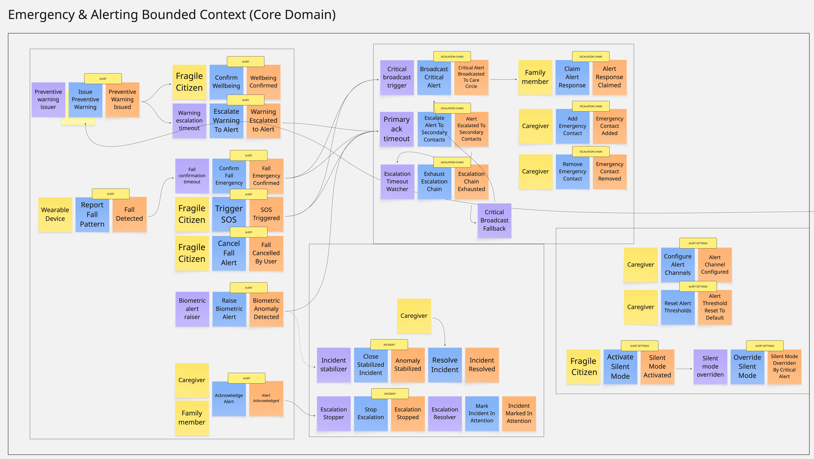

Este contexto candidato agrupa los comportamientos relacionados con la detección y gestión de situaciones de emergencia, la generación y escalamiento de alertas, el reconocimiento de incidentes y la coordinación de la respuesta por parte de familiares y cuidadores.

Su Lenguaje Ubicuo se encuentra asociado a conceptos como advertencia preventiva, detección de caídas, SOS, alerta crítica, reconocimiento de alerta, escalamiento, contacto de emergencia y estabilización de incidentes.

Se clasificó como parte del **Core Domain** debido a que representa una de las capacidades de mayor valor diferencial de Guardian+: permitir que familiares y cuidadores reaccionen oportunamente ante eventos que puedan comprometer el bienestar de una persona vulnerable.


#### Health Monitoring Bounded Context (Core Domain)


Este contexto candidato concentra las capacidades relacionadas con el monitoreo de bioseñales, la evaluación de umbrales biométricos, la visualización de información de salud y la generación de reportes y resúmenes periódicos.

Dentro de su Lenguaje Ubicuo se encuentran conceptos como bioseñales, telemetría, umbral biométrico, indicadores de salud, métricas en tiempo real, reportes de salud y resúmenes semanales.

Se clasificó como parte del **Core Domain** porque el monitoreo continuo del estado de la persona bajo cuidado constituye una de las funcionalidades centrales de Guardian+ y proporciona información fundamental para detectar posibles anomalías y alimentar posteriormente los procesos de prevención y emergencia.


#### Care Routines & Wellness Bounded Context (Supporting Domain)

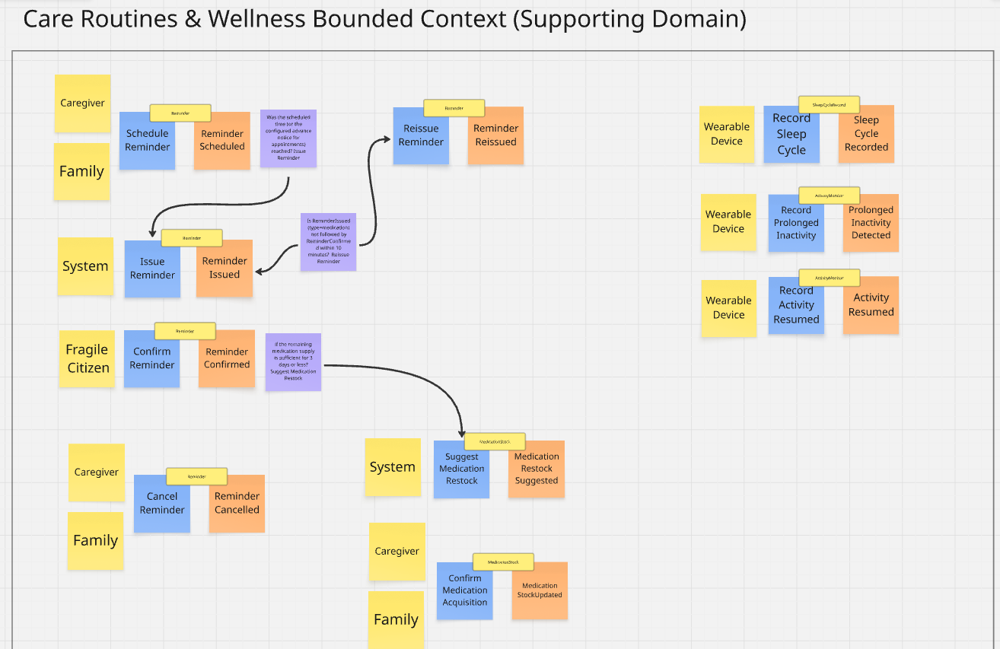

Este contexto candidato agrupa las capacidades destinadas a apoyar las actividades cotidianas de cuidado y bienestar. Entre ellas se encuentran la programación, emisión, confirmación, reemisión y cancelación de recordatorios, así como el seguimiento del stock de medicamentos, ciclos de sueño, periodos prolongados de inactividad y reanudación de actividad.

Su Lenguaje Ubicuo incluye conceptos como recordatorio, rutina, medicación, stock, sueño, actividad, inactividad y bienestar.

Fue clasificado como **Supporting Domain**, ya que complementa las capacidades principales de monitoreo y atención de emergencias, mejorando la continuidad del cuidado diario, pero sin constituir por sí mismo el principal diferenciador estratégico de Guardian+.


#### Mobility & Geofencing Bounded Context (Supporting Domain)

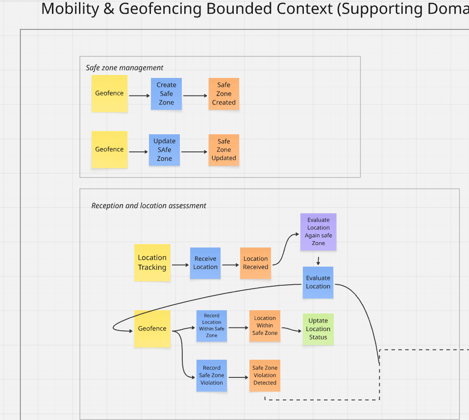

Este contexto candidato reúne las funcionalidades relacionadas con el seguimiento de ubicación y la definición de zonas seguras para la persona bajo cuidado. Incluye la creación y actualización de geocercas, la recepción de ubicaciones y la evaluación de si la persona permanece dentro o fuera de los límites configurados.

Su Lenguaje Ubicuo se encuentra compuesto por conceptos como geocerca, zona segura, ubicación, seguimiento, estado de ubicación y violación de zona segura.

Se clasificó como **Supporting Domain**, debido a que aporta información contextual importante para la seguridad de la persona bajo cuidado y puede originar situaciones que requieran atención, aunque su funcionamiento complementa a los contextos principales de monitoreo y alertamiento.


#### IAM Bounded Context (Generic Domain)

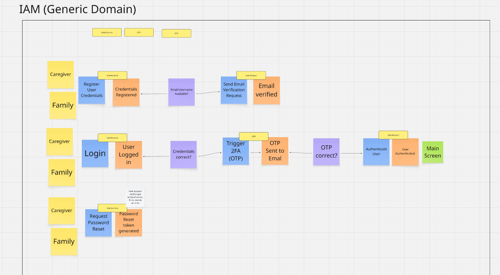

Este contexto candidato agrupa los procesos relacionados con la gestión de identidad y acceso a Guardian+. Incluye el registro de credenciales, verificación de correo electrónico, autenticación, uso de códigos OTP y recuperación de contraseña.

Su Lenguaje Ubicuo comprende conceptos como credenciales, autenticación, verificación, OTP, contraseña, inicio de sesión y usuario autenticado.

Se clasificó como **Generic Domain** porque representa una capacidad necesaria para garantizar el acceso seguro a la plataforma, pero corresponde a una problemática común en numerosos sistemas de software y no constituye un elemento diferenciador propio del negocio de Guardian+.


#### Profile Bounded Context (Generic Domain)

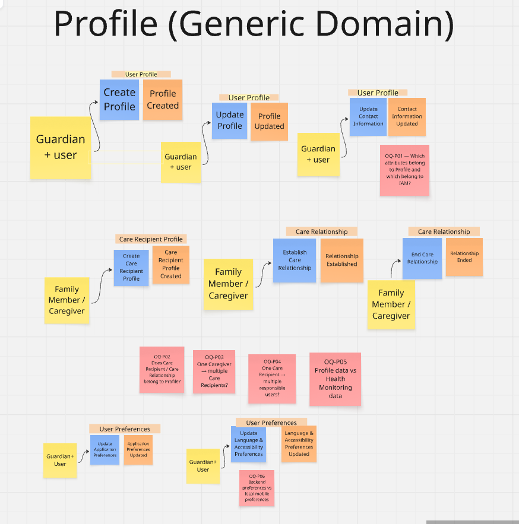

Este contexto candidato gestiona la información asociada a los perfiles de los usuarios y de las personas bajo cuidado, así como las relaciones existentes entre familiares, cuidadores y Care Recipients. También contempla la gestión de información de contacto y preferencias de uso de la aplicación.

Su Lenguaje Ubicuo incluye conceptos como perfil de usuario, perfil de persona bajo cuidado, relación de cuidado, información de contacto, preferencias de aplicación, idioma y accesibilidad.

Se clasificó como **Generic Domain** debido a que proporciona información fundamental para que otros contextos puedan operar correctamente, pero sus capacidades corresponden principalmente a gestión de perfiles y relaciones, y no constituyen el núcleo diferenciador de Guardian+.


#### Subscriptions Bounded Context (Generic Domain)

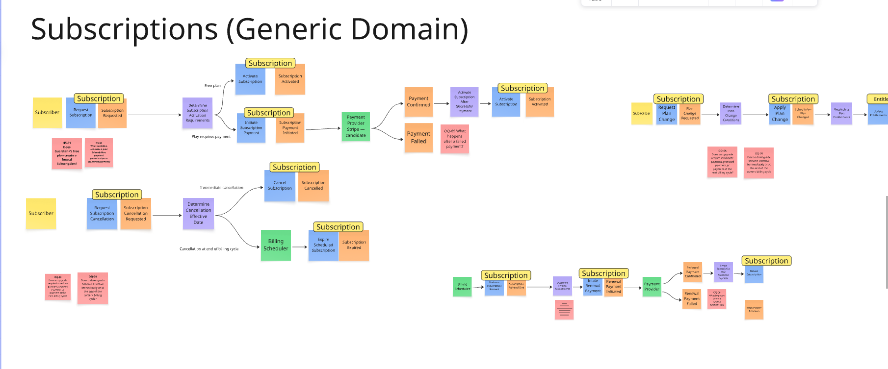

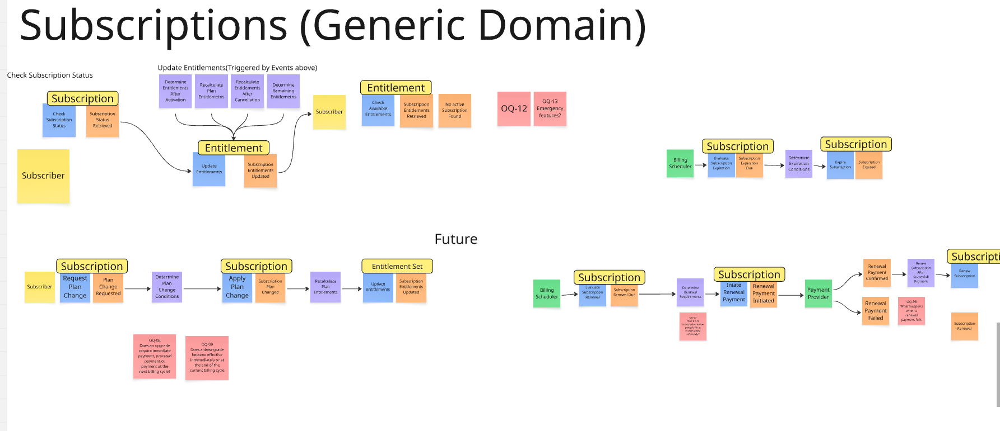

Este contexto candidato concentra las reglas relacionadas con el ciclo de vida comercial de las suscripciones de Guardian+. Incluye la solicitud y activación de suscripciones, cambios de plan, renovación, cancelación, expiración y administración de los beneficios asociados a cada plan.

Su Lenguaje Ubicuo se encuentra relacionado con conceptos como suscripción, plan, pago, renovación, cancelación, expiración y entitlement.

Se clasificó como **Generic Domain** porque permite implementar el modelo comercial y controlar los beneficios disponibles para los usuarios, pero no representa la principal fuente de innovación o diferenciación de Guardian+.


Como resultado del Candidate Context Discovery, el equipo estableció una primera descomposición estratégica del dominio de Guardian+. Los contextos **Emergency & Alerting** y **Health Monitoring** fueron reconocidos como parte del Core Domain debido a su relación directa con la propuesta de valor principal de la solución. **Care Routines & Wellness** y **Mobility & Geofencing** fueron clasificados como Supporting Domains debido a que complementan y fortalecen las capacidades centrales de cuidado. Finalmente, **IAM**, **Profile** y **Subscriptions** fueron identificados como Generic Domains al representar capacidades necesarias para el funcionamiento de la plataforma, pero comunes a otros tipos de sistemas.

Esta descomposición servirá como base para las siguientes actividades de Strategic-Level Domain-Driven Design, donde se analizarán los mensajes intercambiados entre contextos, sus responsabilidades y las relaciones de integración mediante Domain Message Flows, Bounded Context Canvases y Context Mapping.

##### 2.5.1.2. Domain Message Flows Modeling

En esta sección se documentan los principales flujos de mensajes (comandos, eventos y policies) del Bounded Context **Emergency & Alerting**, modelados como diagramas de secuencia a partir del Design-Level EventStorming. Se seleccionaron los tres flujos de mayor valor de negocio, correspondientes a los tres agregados centrales del contexto (INCIDENT, ALERT y ESCALATION CHAIN).

#### Bounded Context: Emergency & Alerting

**Flujo 1 — Caída confirmada**

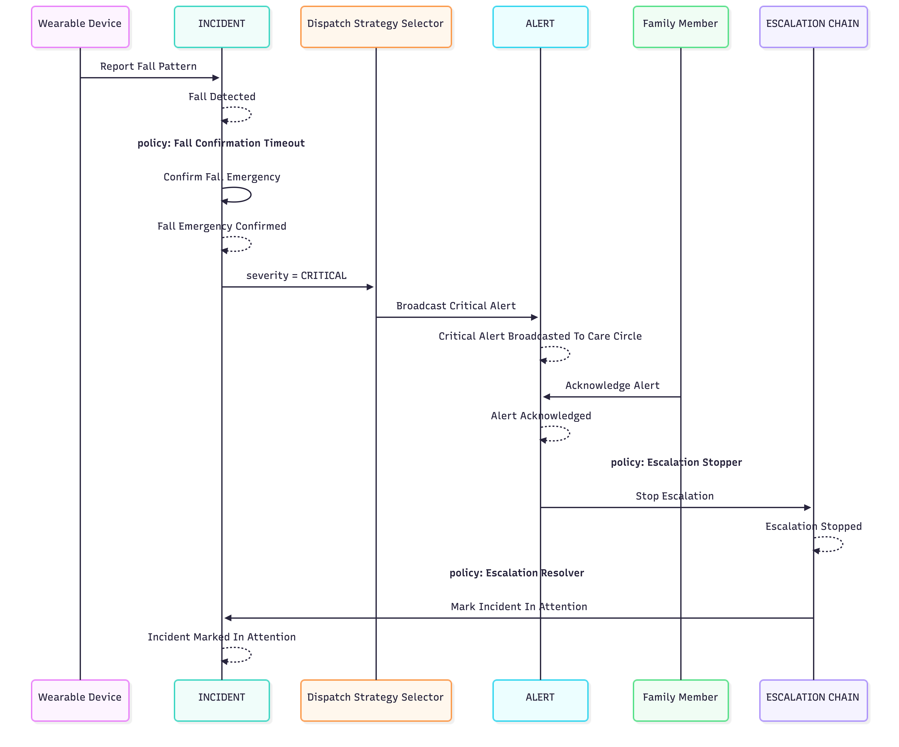

**Flujo 2 — SOS manual**

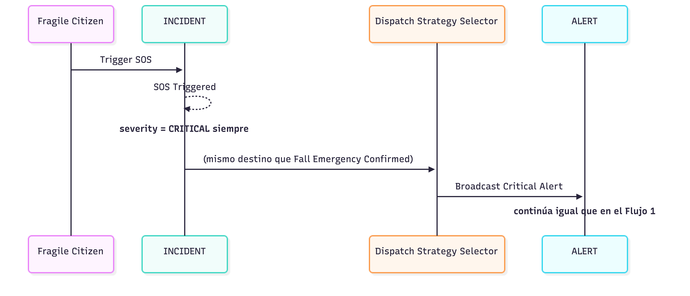

**Flujo 3 — Anomalía biométrica escalada**

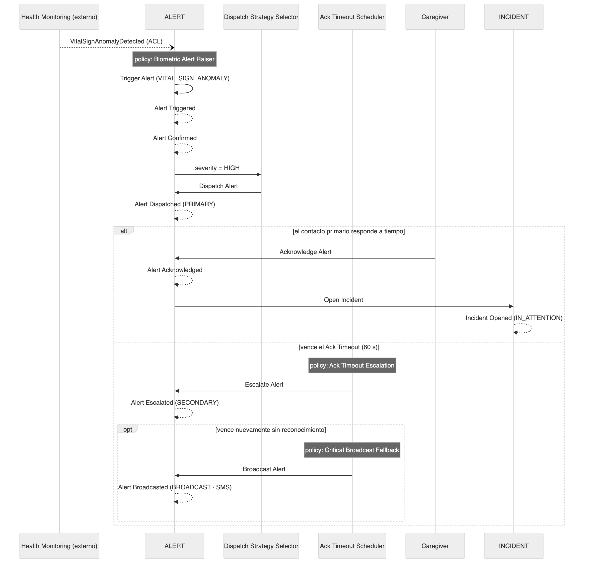

##### 2.5.1.3. Bounded Context Canvases
En esta sección se detallan los diseños de los Bounded Contexts candidatos identificados, priorizando aquellos clasificados como Core Domain por su impacto estratégico en Guardian+. El diseño aplica rigurosamente la estructura visual del **Bounded Context Design Canvas V1 (Nick Tune)**, utilizando el formato estándar de tablas Markdown para asegurar compatibilidad absoluta con cualquier procesador de texto (GitHub, Notion, Word, PDF). Se define la interfaz pública mediante Actions y Queries, aislando el Ubiquitous Language y las Policies.

#### Bounded Context: Emergency & Alerting (Core Domain)

<!-- CANVAS: EMERGENCY & ALERTING (NICK TUNE V1 TEMPLATE) -->
<table border="1" width="100%" cellpadding="10" cellspacing="0" style="border-collapse: collapse; font-family: Arial, sans-serif;">
<tr>
<td width="42%" valign="top" style="border-right: 2px solid #333; border-bottom: none; padding: 15px;">
<div style="font-size: 0.9em; font-weight: bold; color: #222;">Name</div>
<div style="color: #c62828; font-size: 1.3em; font-weight: bold; margin-top: 4px; margin-bottom: 12px;">Emergency &amp; Alerting</div>
<hr style="border: 0; border-top: 1px solid #ddd; margin: 10px 0;">

<div style="font-size: 0.9em; font-weight: bold; color: #222;">Strategic Classification</div>
<div style="font-size: 0.75em; color: #777; margin-bottom: 4px;">core/supportive/generic/other</div>
<div style="color: #c62828; font-size: 1em; margin-bottom: 12px;">
<strong>Core - </strong> Principal diferenciador de Guardian+: garantiza una respuesta humana oportuna ante eventos que comprometen la seguridad del Fragile Citizen.
</div>
<hr style="border: 0; border-top: 1px solid #ddd; margin: 10px 0;">

<div style="font-size: 0.9em; font-weight: bold; color: #222;">Description</div>
<div style="font-size: 0.75em; color: #777; margin-bottom: 4px;">Summary of purpose and responsibilities - not implementation</div>
<div style="color: #c62828; font-size: 0.95em; line-height: 1.4; margin-bottom: 15px;">
Registra y clasifica los Incidents que comprometen la seguridad del Fragile Citizen, deriva de ellos las Alerts correspondientes, selecciona la estrategia de despacho según la severidad y gobierna el escalamiento progresivo hacia el Care Circle hasta obtener un reconocimiento efectivo.
</div>
<hr style="border: 0; border-top: 1px solid #ddd; margin: 10px 0;">

<div style="font-size: 0.9em; font-weight: bold; color: #222;">Business Policies</div>
<div style="font-size: 0.75em; color: #777; margin-bottom: 8px;">Key business rules and policies</div>
<table width="100%" border="0" cellpadding="0" cellspacing="4" style="text-align: center;">
<tr>
<td width="32%" bgcolor="#e8eaf6" style="border: 1px solid #3f51b5; padding: 8px; font-size: 0.8em;">Dispatch Strategy Selector (CRITICAL difunde / HIGH escala)</td>
<td width="32%" bgcolor="#e8eaf6" style="border: 1px solid #3f51b5; padding: 8px; font-size: 0.8em;">Ventana de Confirmación de Caída (20 s)</td>
<td width="32%" bgcolor="#e8eaf6" style="border: 1px solid #3f51b5; padding: 8px; font-size: 0.8em;">Ack Timeout por Eslabón (60 s)</td>
</tr>
<tr>
<td width="32%" bgcolor="#e8eaf6" style="border: 1px solid #3f51b5; padding: 8px; font-size: 0.8em;">Escalation Stopper &amp; Resolver</td>
<td width="32%" bgcolor="#e8eaf6" style="border: 1px solid #3f51b5; padding: 8px; font-size: 0.8em;">Critical Broadcast Fallback ante cadena agotada</td>
<td width="32%" bgcolor="#e8eaf6" style="border: 1px solid #3f51b5; padding: 8px; font-size: 0.8em;">Override de Silent Mode solo en severidad CRITICAL</td>
</tr>
</table>
<hr style="border: 0; border-top: 1px solid #ddd; margin: 10px 0;">

<div style="font-size: 0.9em; font-weight: bold; color: #222;">Ubiquitous Language</div>
<div style="font-size: 0.75em; color: #777; margin-bottom: 6px;">Key domain terminology</div>
<table width="100%" border="0" cellpadding="0" cellspacing="0" style="color: #c62828; font-weight: bold; font-size: 0.85em;">
<tr>
<td width="50%" valign="top">
• Incident<br>
• Alert<br>
• Escalation Chain<br>
• Alert Settings
</td>
<td width="50%" valign="top">
• Severity<br>
• Acknowledgment<br>
• Preventive Warning<br>
• Silent Mode
</td>
</tr>
</table>
</td>

<td width="58%" valign="top" style="padding: 0;">
<div style="padding: 12px; border-bottom: 2px solid #333;">
<div align="center">
<strong style="font-size: 1em;">Capabilities &amp; Responsibilities</strong><br>
<span style="font-size: 0.75em; color: #777;">Services provided to consumers</span>
</div>
<table width="100%" border="0" cellpadding="8" cellspacing="0" style="margin-top: 8px;">
<tr>
<td width="50%" valign="top" align="center" style="border-right: 1px solid #ddd; padding-right: 10px;">
<strong style="font-size: 0.85em;">Informational</strong><br>
<span style="font-size: 0.7em; color: #777;">Queries, reports, etc.</span><br><br>
<table width="90%" border="0" cellpadding="8" cellspacing="0" bgcolor="#e8f5e9" style="border: 1px solid #2e7d32; text-align: center; margin-bottom: 8px;">
<tr><td style="font-size: 0.8em; font-weight: bold; color: #1b5e20;">Get Active Incidents</td></tr>
</table>
<table width="90%" border="0" cellpadding="8" cellspacing="0" bgcolor="#e8f5e9" style="border: 1px solid #2e7d32; text-align: center; margin-bottom: 8px;">
<tr><td style="font-size: 0.8em; font-weight: bold; color: #1b5e20;">Get Incident History</td></tr>
</table>
<table width="90%" border="0" cellpadding="8" cellspacing="0" bgcolor="#e8f5e9" style="border: 1px solid #2e7d32; text-align: center; margin-bottom: 8px;">
<tr><td style="font-size: 0.8em; font-weight: bold; color: #1b5e20;">Get Pending Alerts</td></tr>
</table>
<table width="90%" border="0" cellpadding="8" cellspacing="0" bgcolor="#e8f5e9" style="border: 1px solid #2e7d32; text-align: center;">
<tr><td style="font-size: 0.8em; font-weight: bold; color: #1b5e20;">Get Alert Settings</td></tr>
</table>
</td>
<td width="50%" valign="top" align="center" style="padding-left: 10px;">
<strong style="font-size: 0.85em;">Actions</strong><br>
<span style="font-size: 0.7em; color: #777;">Invokable commands, scheduled tasks, etc.</span><br><br>

<table width="90%" border="0" cellpadding="6" cellspacing="0" bgcolor="#e3f2fd" style="border: 1px solid #1565c0; text-align: center; margin-bottom: 6px;">
<tr><td style="font-size: 0.8em; font-weight: bold; color: #0d47a1;">Register Incident</td></tr>
</table>
<table width="90%" border="0" cellpadding="6" cellspacing="0" bgcolor="#e3f2fd" style="border: 1px solid #1565c0; text-align: center; margin-bottom: 6px;">
<tr><td style="font-size: 0.8em; font-weight: bold; color: #0d47a1;">Confirm / Dismiss Incident</td></tr>
</table>
<table width="90%" border="0" cellpadding="6" cellspacing="0" bgcolor="#e3f2fd" style="border: 1px solid #1565c0; text-align: center; margin-bottom: 6px;">
<tr><td style="font-size: 0.8em; font-weight: bold; color: #0d47a1;">Broadcast Critical Alert</td></tr>
</table>
<table width="90%" border="0" cellpadding="6" cellspacing="0" bgcolor="#e3f2fd" style="border: 1px solid #1565c0; text-align: center; margin-bottom: 6px;">
<tr><td style="font-size: 0.8em; font-weight: bold; color: #0d47a1;">Escalate To Next Contact</td></tr>
</table>
<table width="90%" border="0" cellpadding="6" cellspacing="0" bgcolor="#e3f2fd" style="border: 1px solid #1565c0; text-align: center; margin-bottom: 6px;">
<tr><td style="font-size: 0.8em; font-weight: bold; color: #0d47a1;">Acknowledge Alert</td></tr>
</table>
<table width="90%" border="0" cellpadding="6" cellspacing="0" bgcolor="#e3f2fd" style="border: 1px solid #1565c0; text-align: center;">
<tr><td style="font-size: 0.8em; font-weight: bold; color: #0d47a1;">Configure Alert Settings</td></tr>
</table>
</td>
</tr>
</table>
</div>

<div style="padding: 12px;">
<div align="center" style="margin-bottom: 8px;">
<strong style="font-size: 1em;">Dependencies</strong><br>
<span style="font-size: 0.75em; color: #777;">Interactions with other bounded contexts and services</span>
</div>
<table width="100%" border="1" cellpadding="6" cellspacing="0" style="border-collapse: collapse; font-size: 0.8em; text-align: left;">
<tr bgcolor="#f5f5f5">
<th>Name</th>
<th>Reason</th>
<th>System</th>
<th>Relationship</th>
</tr>
<tr>
<td>Health Monitoring</td>
<td>Consume anomalías biométricas confirmadas</td>
<td>Internal</td>
<td>In (Customer/Supplier)</td>
</tr>
<tr>
<td>Mobility &amp; Geofencing</td>
<td>Consume salidas de zona segura y resuelve coordenadas del incidente</td>
<td>Internal</td>
<td>In (Customer/Supplier)</td>
</tr>
<tr>
<td>Care Routines &amp; Wellness</td>
<td>Consume eventos de inactividad prolongada</td>
<td>Internal</td>
<td>In (Customer/Supplier)</td>
</tr>
<tr>
<td>Profile</td>
<td>Proyecta localmente el Care Circle y el orden de contactos</td>
<td>Internal</td>
<td>In (ECST)</td>
</tr>
<tr>
<td>IAM</td>
<td>Valida identidad y autorización de cada comando</td>
<td>Internal</td>
<td>In (OHS)</td>
</tr>
<tr>
<td>Notification Providers</td>
<td>Despacha las notificaciones push y SMS al Care Circle</td>
<td>External</td>
<td>Out (ACL)</td>
</tr>
</table>
</div>
</td>
</tr>
</table>

#### Bounded Context: Health Monitoring (Core Domain)

<!-- CANVAS: HEALTH MONITORING (NICK TUNE V1 TEMPLATE) -->
<table border="1" width="100%" cellpadding="10" cellspacing="0" style="border-collapse: collapse; font-family: Arial, sans-serif;">
<tr>
<td width="42%" valign="top" style="border-right: 2px solid #333; border-bottom: none; padding: 15px;">
<div style="font-size: 0.9em; font-weight: bold; color: #222;">Name</div>
<div style="color: #c62828; font-size: 1.3em; font-weight: bold; margin-top: 4px; margin-bottom: 12px;">Health Monitoring</div>
<hr style="border: 0; border-top: 1px solid #ddd; margin: 10px 0;">

<div style="font-size: 0.9em; font-weight: bold; color: #222;">Strategic Classification</div>
<div style="font-size: 0.75em; color: #777; margin-bottom: 4px;">core/supportive/generic/other</div>
<div style="color: #c62828; font-size: 1em; margin-bottom: 12px;">
<strong>Core - </strong> Esencial para habilitar el monitoreo clínico continuo y la prevención de crisis.
</div>
<hr style="border: 0; border-top: 1px solid #ddd; margin: 10px 0;">

<div style="font-size: 0.9em; font-weight: bold; color: #222;">Description</div>
<div style="font-size: 0.75em; color: #777; margin-bottom: 4px;">Summary of purpose and responsibilities - not implementation</div>
<div style="color: #c62828; font-size: 0.95em; line-height: 1.4; margin-bottom: 15px;">
Ingesta, procesa y almacena la telemetría continua de Vital Signs, evaluando umbrales clínicos en tiempo real para proveer vistas en vivo y consolidar Health Reports preventivos.
</div>
<hr style="border: 0; border-top: 1px solid #ddd; margin: 10px 0;">

<div style="font-size: 0.9em; font-weight: bold; color: #222;">Business Policies</div>
<div style="font-size: 0.75em; color: #777; margin-bottom: 8px;">Key business rules and policies</div>
<table width="100%" border="0" cellpadding="0" cellspacing="4" style="text-align: center;">
<tr>
<td width="32%" bgcolor="#e8eaf6" style="border: 1px solid #3f51b5; padding: 8px; font-size: 0.8em;">Validación de Integridad de Vital Signs</td>
<td width="32%" bgcolor="#e8eaf6" style="border: 1px solid #3f51b5; padding: 8px; font-size: 0.8em;">Regla de Tolerancia (3 lecturas consecutivas)</td>
<td width="32%" bgcolor="#e8eaf6" style="border: 1px solid #3f51b5; padding: 8px; font-size: 0.8em;">Política de Compilación Semanal</td>
</tr>
</table>
<hr style="border: 0; border-top: 1px solid #ddd; margin: 10px 0;">

<div style="font-size: 0.9em; font-weight: bold; color: #222;">Ubiquitous Language</div>
<div style="font-size: 0.75em; color: #777; margin-bottom: 6px;">Key domain terminology</div>
<table width="100%" border="0" cellpadding="0" cellspacing="0" style="color: #c62828; font-weight: bold; font-size: 0.85em;">
<tr>
<td width="50%" valign="top">
• Vital Signs<br>
• VitalSignStream
</td>
<td width="50%" valign="top">
• Health Report<br>
</td>
</tr>
</table>
</td>

<td width="58%" valign="top" style="padding: 0;">
<div style="padding: 12px; border-bottom: 2px solid #333;">
<div align="center">
<strong style="font-size: 1em;">Capabilities & Responsibilities</strong><br>
<span style="font-size: 0.75em; color: #777;">Services provided to consumers</span>
</div>
<table width="100%" border="0" cellpadding="8" cellspacing="0" style="margin-top: 8px;">
<tr>
<td width="50%" valign="top" align="center" style="border-right: 1px solid #ddd; padding-right: 10px;">
<strong style="font-size: 0.85em;">Informational</strong><br>
<span style="font-size: 0.7em; color: #777;">Queries, reports, etc.</span><br><br>
<table width="90%" border="0" cellpadding="8" cellspacing="0" bgcolor="#e8f5e9" style="border: 1px solid #2e7d32; text-align: center; margin-bottom: 8px;">
<tr><td style="font-size: 0.8em; font-weight: bold; color: #1b5e20;">Get Live Vital Signs</td></tr>
</table>
<table width="90%" border="0" cellpadding="8" cellspacing="0" bgcolor="#e8f5e9" style="border: 1px solid #2e7d32; text-align: center;">
<tr><td style="font-size: 0.8em; font-weight: bold; color: #1b5e20;">Get Historical Health Report</td></tr>
</table>
</td>
<td width="50%" valign="top" align="center" style="padding-left: 10px;">
<strong style="font-size: 0.85em;">Actions</strong><br>
<span style="font-size: 0.7em; color: #777;">Invokable commands, scheduled tasks, etc.</span><br><br>

<table width="90%" border="0" cellpadding="6" cellspacing="0" bgcolor="#e3f2fd" style="border: 1px solid #1565c0; text-align: center; margin-bottom: 6px;">
<tr><td style="font-size: 0.8em; font-weight: bold; color: #0d47a1;">Detect Vital Signs</td></tr>
</table>
<table width="90%" border="0" cellpadding="6" cellspacing="0" bgcolor="#e3f2fd" style="border: 1px solid #1565c0; text-align: center; margin-bottom: 6px;">
<tr><td style="font-size: 0.8em; font-weight: bold; color: #0d47a1;">Evaluate Vital Sign Thresholds</td></tr>
</table>
<table width="90%" border="0" cellpadding="6" cellspacing="0" bgcolor="#e3f2fd" style="border: 1px solid #1565c0; text-align: center;">
<tr><td style="font-size: 0.8em; font-weight: bold; color: #0d47a1;">Compile Weekly Summary</td></tr>
</table>
</td>
</tr>
</table>
</div>

<div style="padding: 12px;">
<div align="center" style="margin-bottom: 8px;">
<strong style="font-size: 1em;">Dependencies</strong><br>
<span style="font-size: 0.75em; color: #777;">Interactions with other bounded contexts and services</span>
</div>
<table width="100%" border="1" cellpadding="6" cellspacing="0" style="border-collapse: collapse; font-size: 0.8em; text-align: left;">
<tr bgcolor="#f5f5f5">
<th>Name</th>
<th>Reason</th>
<th>System</th>
<th>Relationship</th>
</tr>
<tr>
<td>Wearable Device</td>
<td>Provee datos biométricos crudos</td>
<td>External</td>
<td>In (ACL)</td>
</tr>
<tr>
<td>Emergency & Alerting</td>
<td>Consume anomalías de signos vitales (eventos)</td>
<td>Internal</td>
<td>Out (Supplier)</td>
</tr>
<tr>
<td>Profile / IAM</td>
<td>Resuelve estado de suscripción y perfiles</td>
<td>Internal</td>
<td>In (OHS)</td>
</tr>
</table>
</div>
</td>
</tr>
</table>

#### Bounded Context: Care Routines & Wellness (Supporting Domain)

<!-- CANVAS: CARE ROUTINES & WELLNESS (NICK TUNE V1 TEMPLATE) -->
<table border="1" width="100%" cellpadding="10" cellspacing="0" style="border-collapse: collapse; font-family: Arial, sans-serif;">
<tr>
<td width="42%" valign="top" style="border-right: 2px solid #333; border-bottom: none; padding: 15px;">
<div style="font-size: 0.9em; font-weight: bold; color: #222;">Name</div>
<div style="color: #c62828; font-size: 1.3em; font-weight: bold; margin-top: 4px; margin-bottom: 12px;">Care Routines &amp; Wellness</div>
<hr style="border: 0; border-top: 1px solid #ddd; margin: 10px 0;">

<div style="font-size: 0.9em; font-weight: bold; color: #222;">Strategic Classification</div>
<div style="font-size: 0.75em; color: #777; margin-bottom: 4px;">core/supportive/generic/other</div>
<div style="color: #c62828; font-size: 1em; margin-bottom: 12px;">
<strong>Supporting - </strong> Da soporte al valor central de Guardian+ asegurando que las rutinas de bienestar del Fragile Citizen se cumplan.
</div>
<hr style="border: 0; border-top: 1px solid #ddd; margin: 10px 0;">

<div style="font-size: 0.9em; font-weight: bold; color: #222;">Description</div>
<div style="font-size: 0.75em; color: #777; margin-bottom: 4px;">Summary of purpose and responsibilities - not implementation</div>
<div style="color: #c62828; font-size: 0.95em; line-height: 1.4; margin-bottom: 15px;">
Gestiona el ciclo de vida de los Reminders de rutina (medicación, citas, actividad física e hidratación), registra y clasifica los Sleep Cycles, detecta Prolonged Inactivity mediante el Activity Monitor, y controla el Medication Stock sugiriendo su reabastecimiento.
</div>
<hr style="border: 0; border-top: 1px solid #ddd; margin: 10px 0;">

<div style="font-size: 0.9em; font-weight: bold; color: #222;">Business Policies</div>
<div style="font-size: 0.75em; color: #777; margin-bottom: 8px;">Key business rules and policies</div>
<table width="100%" border="0" cellpadding="0" cellspacing="4" style="text-align: center;">
<tr>
<td width="32%" bgcolor="#e8eaf6" style="border: 1px solid #3f51b5; padding: 8px; font-size: 0.8em;">Reminder Issuance Policy (Sleep Window)</td>
<td width="32%" bgcolor="#e8eaf6" style="border: 1px solid #3f51b5; padding: 8px; font-size: 0.8em;">Reminder Reissue Policy (10 min)</td>
<td width="32%" bgcolor="#e8eaf6" style="border: 1px solid #3f51b5; padding: 8px; font-size: 0.8em;">Medication Stock Policy (umbral 3 días)</td>
</tr>
</table>
<hr style="border: 0; border-top: 1px solid #ddd; margin: 10px 0;">

<div style="font-size: 0.9em; font-weight: bold; color: #222;">Ubiquitous Language</div>
<div style="font-size: 0.75em; color: #777; margin-bottom: 6px;">Key domain terminology</div>
<table width="100%" border="0" cellpadding="0" cellspacing="0" style="color: #c62828; font-weight: bold; font-size: 0.85em;">
<tr>
<td width="50%" valign="top">
- Reminder<br>
- Sleep Cycle
</td>
<td width="50%" valign="top">
- Activity Monitor<br>
- Medication Stock
</td>
</tr>
</table>
</td>

<td width="58%" valign="top" style="padding: 0;">
<div style="padding: 12px; border-bottom: 2px solid #333;">
<div align="center">
<strong style="font-size: 1em;">Capabilities &amp; Responsibilities</strong><br>
<span style="font-size: 0.75em; color: #777;">Services provided to consumers</span>
</div>
<table width="100%" border="0" cellpadding="8" cellspacing="0" style="margin-top: 8px;">
<tr>
<td width="50%" valign="top" align="center" style="border-right: 1px solid #ddd; padding-right: 10px;">
<strong style="font-size: 0.85em;">Informational</strong><br>
<span style="font-size: 0.7em; color: #777;">Queries, reports, etc.</span><br><br>
<table width="90%" border="0" cellpadding="8" cellspacing="0" bgcolor="#e8f5e9" style="border: 1px solid #2e7d32; text-align: center; margin-bottom: 8px;">
<tr><td style="font-size: 0.8em; font-weight: bold; color: #1b5e20;">Get Reminder Status</td></tr>
</table>
<table width="90%" border="0" cellpadding="8" cellspacing="0" bgcolor="#e8f5e9" style="border: 1px solid #2e7d32; text-align: center;">
<tr><td style="font-size: 0.8em; font-weight: bold; color: #1b5e20;">Get Medication Stock Status</td></tr>
</table>
</td>
<td width="50%" valign="top" align="center" style="padding-left: 10px;">
<strong style="font-size: 0.85em;">Actions</strong><br>
<span style="font-size: 0.7em; color: #777;">Invokable commands, scheduled tasks, etc.</span><br><br>

<table width="90%" border="0" cellpadding="6" cellspacing="0" bgcolor="#e3f2fd" style="border: 1px solid #1565c0; text-align: center; margin-bottom: 6px;">
<tr><td style="font-size: 0.8em; font-weight: bold; color: #0d47a1;">Schedule / Issue / Reissue Reminder</td></tr>
</table>
<table width="90%" border="0" cellpadding="6" cellspacing="0" bgcolor="#e3f2fd" style="border: 1px solid #1565c0; text-align: center; margin-bottom: 6px;">
<tr><td style="font-size: 0.8em; font-weight: bold; color: #0d47a1;">Confirm / Cancel Reminder</td></tr>
</table>
<table width="90%" border="0" cellpadding="6" cellspacing="0" bgcolor="#e3f2fd" style="border: 1px solid #1565c0; text-align: center; margin-bottom: 6px;">
<tr><td style="font-size: 0.8em; font-weight: bold; color: #0d47a1;">Record Activity &amp; Sleep Telemetry</td></tr>
</table>
<table width="90%" border="0" cellpadding="6" cellspacing="0" bgcolor="#e3f2fd" style="border: 1px solid #1565c0; text-align: center;">
<tr><td style="font-size: 0.8em; font-weight: bold; color: #0d47a1;">Confirm Medication Acquisition</td></tr>
</table>
</td>
</tr>
</table>
</div>

<div style="padding: 12px;">
<div align="center" style="margin-bottom: 8px;">
<strong style="font-size: 1em;">Dependencies</strong><br>
<span style="font-size: 0.75em; color: #777;">Interactions with other bounded contexts and services</span>
</div>
<table width="100%" border="1" cellpadding="6" cellspacing="0" style="border-collapse: collapse; font-size: 0.8em; text-align: left;">
<tr bgcolor="#f5f5f5">
<th>Name</th>
<th>Reason</th>
<th>System</th>
<th>Relationship</th>
</tr>
<tr>
<td>Wearable Device</td>
<td>Provee telemetría de actividad, inactividad y sueño</td>
<td>External</td>
<td>In (ACL)</td>
</tr>
<tr>
<td>Profile / IAM</td>
<td>Resuelve identidad y perfil de la persona bajo cuidado</td>
<td>Internal</td>
<td>In (OHS)</td>
</tr>
<tr>
<td>Emergency &amp; Alerting</td>
<td>Consume inactividad prolongada, reemisión y reabastecimiento</td>
<td>Internal</td>
<td>Out (Supplier)</td>
</tr>
</table>
</div>
</td>
</tr>
</table>

#### 2.5.2. Context Mapping
#### 2.5.2.1. Heurísticas de Diseño y Exploración de Alternativas (What-If Analysis Global)

El equipo sometió la totalidad de los siete Bounded Contexts candidatos al proceso de cuestionamiento heurístico recomendado por Domain-Driven Design (DDD Crew y Nick Tune) para validar la ubicación de cada capability y evitar dependencias cíclicas o acoplamiento innecesario:

*   **¿Qué pasaría si movemos el capability de evaluación de umbrales clínicos (`EvaluateClinicalThresholds`) de *Health Monitoring* a *Emergency & Alerting*?**
    *   *Evaluación:* Si la evaluación clínica se traslada a Emergencias, *Health Monitoring* se degradaría a un almacén pasivo de telemetría (CRUD). Además, obligaría a *Emergency & Alerting* a conocer la semántica médica de rangos basales, tolerancias fisiológicas y filtros de ruido. Se descarta: la evaluación médica permanece en *Health Monitoring*, y este solo notifica a emergencias cuando una anomalía clínica ha sido confirmada.
*   **¿Qué pasaría si descomponemos el capability de alertas en *Emergency & Alerting* y movemos el despacho de recordatorios de medicación desde *Care Routines & Wellness* hacia este?**
    *   *Evaluación:* Aunque ambos implican notificar al usuario, sus invariantes y acuerdos de nivel de servicio (SLA) son divergentes. Una alerta de emergencia exige despacho de máxima prioridad en menos de 5 segundos con escalamiento jerárquico no bloqueante, mientras que un recordatorio de medicación es un aviso programado con tolerancia a reintentos lentos. Mezclarlos en el mismo contexto generaría contención y riesgo de saturación en el bus de emergencias críticas. Se mantiene la separación.
*   **¿Qué pasaría si tomamos el capability de despacho de notificaciones (Push/SMS) de *Emergency & Alerting*, *Care Routines & Wellness* y *Health Monitoring* para formar un nuevo Bounded Context (*Notification Service*)?**
    *   *Evaluación:* Crear un contexto de dominio para enviar notificaciones introduce una sobrecarga transaccional y de red innecesaria para una función que es netamente técnica y de infraestructura. En su lugar, cada contexto interactúa de manera aislada con pasarelas de mensajería externas a través de puertos y adaptadores (`Infrastructure Layer`).
*   **¿Qué pasaría si duplicamos la información de relaciones de cuidado (`CareCircle`) en *Emergency & Alerting* para romper la dependencia en tiempo real con *Profile*?**
    *   *Evaluación:* Durante un incidente crítico (como una caída con pérdida de conocimiento), una falla de red o una consulta lenta hacia *Profile* bloquearía el auxilio al paciente. Se decidió aplicar desnormalización eventual: *Emergency & Alerting* almacena una copia local optimizada de la agenda y jerarquía de contactos del *Care Circle*, sincronizada de manera reactiva mediante eventos de integración emitidos por *Profile* (`CareRelationshipEstablished`, `CareRelationshipEnded`).
*   **¿Qué pasaría si unificamos *IAM*, *Profile* y *Subscriptions* en un único gran Bounded Context genérico?**
    *   *Evaluación:* Aunque los tres pertenecen al Generic Domain, operan con ciclos de vida y razones de cambio dispares. *IAM* maneja autenticación, credenciales efímeras y seguridad criptográfica; *Profile* gestiona la semántica de lazos familiares y preferencias de accesibilidad; y *Subscriptions* gobierna la facturación recurrente, planes comerciales y pasarelas de pago. Mantenerlos como tres contextos genéricos separados protege la pureza de sus modelos y minimiza el radio de impacto ante auditorías de seguridad o cambios en proveedores comerciales.
*   **¿Qué pasaría si aislamos el cálculo de transgresión de zonas seguras en *Mobility & Geofencing* y emitimos solo eventos de brecha a *Emergency & Alerting*?**
    *   *Evaluación:* Es la decisión óptima. *Mobility & Geofencing* ingesta la señal de posicionamiento GPS y calcula polígonos/radios geográficos de manera continua. *Emergency & Alerting* no necesita conocer latitud ni longitud en cada segundo, únicamente consume el evento de negocio `SafeZoneBreached` cuando la persona abandona su perímetro seguro autorizado.

---

#### 2.5.2.2. Discusión de Alternativas de Context Mapping Global

| Alternativa | Topología y Patrones Evaluados | Ventajas | Desventajas | Veredicto |
| :--- | :--- | :--- | :--- | :--- |
| **Alternativa 1:** Modelo Monolítico con *Shared Kernel* | Todos los contextos de negocio comparten un núcleo común de librerías (`Shared Kernel`) que contiene los modelos de `User`, `Patient` y `Biometrics`. | Reduce el código duplicado y evita la necesidad de mappers entre módulos en etapas tempranas. | Fuerte acoplamiento bidireccional; cualquier cambio en el modelo del paciente obliga a recompilar y desplegar todos los módulos. Alto riesgo de corrupción conceptual. | **Rechazada:** Destruye la autonomía de los Bounded Contexts y viola los principios del diseño táctico de DDD. |
| **Alternativa 2:** Orquestación Centralizada y *Conformist* | *Emergency & Alerting* actúa como orquestador síncrono mediante llamadas directas REST, conformándose con los esquemas de *Health Monitoring*, *Mobility* y *Profile*. | Trazabilidad directa y centralizada de flujos de control en un único punto. | Efecto dominó: si *Health Monitoring* se congestiona por ráfagas de telemetría IoT, bloquea el hilo de ejecución de *Emergency & Alerting*. Viola los SLAs de tiempo real. | **Rechazada:** Compromete la seguridad física del Fragile Citizen ante contingencias de infraestructura. |
| **Alternativa 3:** Desacoplamiento Basado en Eventos con OHS/PL y ACL | Core Domains consumen eventos de dominio asíncronos vía *Customer/Supplier*; Generic Domains ofrecen contratos abiertos (*Open Host Service*); se usan *Anti-Corruption Layers* para hardware IoT y pasarelas externas. | Aislamiento frente a fallos, procesamiento no bloqueante de telemetría en tiempo real, independencia evolutiva de esquemas y resiliencia ante cortes de servicios externos. | Requiere diseñar y versionar contratos de eventos de integración (*Published Language*) y adaptadores de traducción para cada contexto. | **Aprobada:** Proporciona la resiliencia y el aislamiento de dominio requeridos por la plataforma Guardian+. |

---

#### 2.5.2.3. Context Map Global de Guardian+

A continuación se presenta la topología integral de integración que interconecta la totalidad de los Bounded Contexts y sistemas externos del ecosistema:

```
                 +---------------------------------------------------------+
                  |               EXTERNAL ACTORS & HARDWARE                |
                  +--------------+---------------------------+--------------+
                                 |                           |
                 (Raw Vital Signs Telemetry)      (Fall Pattern / SOS / Bat)
                   [MQTT Topic: /vitals]             [MQTT Topic: /alerts]
                                 |                           |
                                 v [In]                      v [In]
                  +--------------------------+  +---------------------------+
                  |    Health Monitoring     |  |   Mobility & Geofencing   |
                  |         (Core)           |  |       (Supporting)        |
                  |          [ACL]           |  |           [ACL]           |
                  +--------------+-----------+  +-------------+-------------+
                                 |                            |
                                 | [U] (Supplier)             | [U] (Supplier)
                                 | Integration Event:         | Integration Event:
                                 | 3 Consecutive Threshold    | SafeZoneBreached
                                 | Violations Confirmed       |
                                 v [D] (Customer)             v [D] (Customer)
               +-----------------+----------------------------+---------------+
               |                 Emergency & Alerting (Core)                  |
               |                                                              |
               | - Biometric alert raiser (Raise Biometric Alert)             |
               | - Fall confirmation timeout / SOS Triage Engine              |
               | - Multi-tier Escalation (Primary ack timeout / Broadcast)    |
               | - Emergency Contacts & Alert Channels Governance             |
               +-----------------+----------------------------+---------------+
                                 ^                            ^
                                 | [D] (Customer)             | [D] (Customer)
                                 | Integration Event:         | Integration Event:
                                 | ProlongedInactivity        | CareRelationshipEstablished
                                 | Detected                   | CareRelationshipEnded
                                 |                            |
                  +--------------+-----------+  +-------------+-------------+
                  | Care Routines & Wellness |  |          Profile          |
                  |       (Supporting)       |  |         (Generic)         |
                  +--------------+-----------+  +-------------+-------------+
                                 ^                            ^
                                 | [D]                        | [D]
                                 |                            |
                                 |            [U]             |
                                 | [Open Host Service (OHS)]  |
                                 | [Published Language (PL)]  |
                                 | (Identity Tokens / Claims) |
                                 +-------------+--------------+
                                               |
                                               |
                                +--------------v-------------+
                                |            IAM             |
                                |         (Generic)          |
                                +--------------+-------------+
                                               |
                                               | [U] (OHS / PL)
                                               v [D]
                                +--------------+-------------+
                                |       Subscriptions        |
                                |         (Generic)          |
                                |           [ACL]            |
                                +--------------+-------------+
                                               |
                                               | [D] (Conformist / SDK Adapter)
                                               v [U]
                                +--------------+-------------+
                                |  External Stripe Gateway   |
                                +----------------------------+

```

#### 2.5.2.4. Catálogo de Relaciones y Patrones de Integración Global

*   **Wearable Hardware -> Health Monitoring (Anti-Corruption Layer - ACL):**
    *   *Tipo:* External -> Internal Downstream.
    *   *Patrón:* **Anti-Corruption Layer (ACL)**.
    *   *Justificación:* El wearable físico es un productor externo que emite tramas crudas serializadas y optimizadas para restricciones energéticas del microcontrolador (ESP32-S3). Aunque el canal de transporte subyacente es un bus Pub/Sub, el Bounded Context de Health Monitoring implementa una Anti-Corruption Layer (ACL) en su capa de infraestructura (compuesta por un MQTT Inbound Adapter y un Telemetry Payload Translator/Assembler). Esta capa intercepta las tramas crudas, valida la integridad de los paquetes y traduce las variables de hardware a los Value Objects y Comandos propios del Lenguaje Ubicuo del dominio (`VitalSignTelemetryBatch`, `HeartRate`, `BloodPressure`), garantizando que las particularidades del firmware no contaminen ni acoplen el modelo clínico interno.

*   **GNSS Module -> Mobility & Geofencing (Anti-Corruption Layer - ACL):**
    *   *Tipo:* External -> Internal Downstream.
    *   *Patrón:* **Anti-Corruption Layer (ACL)**.
    *   *Justificación:* El hardware de rastreo emite sentencias geográficas crudas (formato NMEA / coordenadas en latitud y longitud flotantes). La ACL filtra la degradación de señal satelital y transforma la posición en el Value Object `GeographicCoordinate`.
*   **Health Monitoring -> Emergency & Alerting (Customer / Supplier con Published Language):**
    *   *Tipo:* Upstream (Supplier) -> Downstream (Customer).
    *   *Patrón:* **Customer/Supplier** con **Published Language (PL)**.
    *   *Justificación:* *Health Monitoring* actúa como proveedor notificando desviaciones clínicas. Para evitar acoplamiento, expone un contrato estandarizado de evento de integración (`VitalSignAnomalyDetected`) con el payload mínimo necesario (identificador de paciente, parámetro violado y severidad), permitiendo que Emergencias opere como cliente consumidor sin conocer cómo se calcularon los umbrales basales.
*   **Mobility & Geofencing -> Emergency & Alerting (Customer / Supplier):**
    *   *Tipo:* Upstream (Supplier) -> Downstream (Customer).
    *   *Patrón:* **Customer/Supplier**.
    *   *Justificación:* Cuando un Fragile Citizen cruza los límites de una geocerca activa sin retorno inmediato, este contexto emite de forma asíncrona el evento `SafeZoneBreached`. *Emergency & Alerting* consume este evento para catalogar un nuevo incidente de desorientación y activar el despacho al Care Circle.
*   **Care Routines & Wellness -> Emergency & Alerting (Customer / Supplier):**
    *   *Tipo:* Upstream (Supplier) -> Downstream (Customer).
    *   *Patrón:* **Customer/Supplier**.
    *   *Justificación:* El contexto de rutinas monitorea la actividad diaria del paciente. Si los sensores cinemáticos registran una inactividad prolongada no justificada en horas diurnas (US27), se emite el evento `ProlongedInactivityDetected`, consumido por Emergencias para ejecutar la verificación de bienestar del paciente.
*   **Profile -> Emergency & Alerting (Event-Carried State Transfer / Customer-Supplier):**
    *   *Tipo:* Upstream (Supplier) -> Downstream (Customer).
    *   *Patrón:* **Customer/Supplier con replicación eventual**.
    *   *Justificación:* *Emergency & Alerting* requiere conocer la jerarquía de teléfonos y canales de contacto del *Care Circle* para el escalamiento a 60 segundos. Para no depender síncronamente de la base de datos de *Profile*, Emergencias escucha los eventos `CareRelationshipEstablished` y `CareRelationshipEnded` y actualiza una tabla de lectura interna desnormalizada.
*   **IAM -> Profile, Subscriptions, Health Monitoring, Emergency & Alerting (Open Host Service / Published Language):**
    *   *Tipo:* Upstream -> Downstream.
    *   *Patrón:* **Open Host Service (OHS)** con **Published Language (PL)**.
    *   *Justificación:* *IAM* provee autenticación y autorización mediante un mecanismo estándar de tokens de acceso (JSON Web Tokens firmados) con un Published Language documentado. Todos los contextos descendentes validan las firmas criptográficas de los tokens y extraen el `UserId` y roles sin consultar síncronamente a la base de datos de identidad en cada petición.
*   **Subscriptions -> Stripe (Conformist / ACL Adapter):**
    *   *Tipo:* External Upstream -> Downstream.
    *   *Patrón:* **Anti-Corruption Layer Adapter**.
    *   *Justificación:* La gestión de pagos depende de las librerías oficiales del proveedor externo. *Subscriptions* implementa adaptadores de webhook (`PaymentWebhookController` y `PaymentProviderAdapter`) para conformarse a los eventos de facturación de Stripe (`invoice.paid`, `customer.subscription.deleted`) y traducirlos a las transiciones de estado del agregado `Subscription` (`ACTIVE`, `CANCELLED`, `EXPIRED`).

#### 2.5.3. Software Architecture

##### 2.5.3.1. Software Architecture Context Level Diagrams

Introducción

En esta sección se presenta la vista de contexto de Guardian+ aplicando el C4 Model, elaborada con Structurizr. Este diagrama posiciona a Guardian+ como un único sistema de software en el centro, y muestra alrededor a los actores que lo utilizan y a los sistemas externos con los que se integra, sin entrar todavía en detalles internos de implementación.

Explicación

Guardian+ es utilizado por tres tipos de actores: el Familiar, quien supervisa remotamente el bienestar de la persona bajo cuidado sin estar presente de forma permanente; el Cuidador, encargado del cuidado frecuente o permanente de dicha persona, ya sea de forma particular o institucional; y la Persona bajo cuidado (adulto mayor, persona con discapacidad o en situación de dependencia), quien interactúa con el sistema físicamente a través de la pulsera IoT.

El sistema se integra con cuatro servicios externos, cada uno resolviendo una necesidad específica que Guardian+ no implementa por sí mismo: Stripe, para el procesamiento de pagos y suscripciones; un servicio de notificaciones push/SMS, para el despacho de alertas y recordatorios; un servicio de videollamada, que habilita la comunicación directa en tiempo real entre familiar/cuidador y la persona bajo cuidado; y Google Maps, utilizado tanto para la geocodificación y el cálculo de geocercas en el backend como para la visualización del mapa y la ubicación en tiempo real dentro de la aplicación móvil.

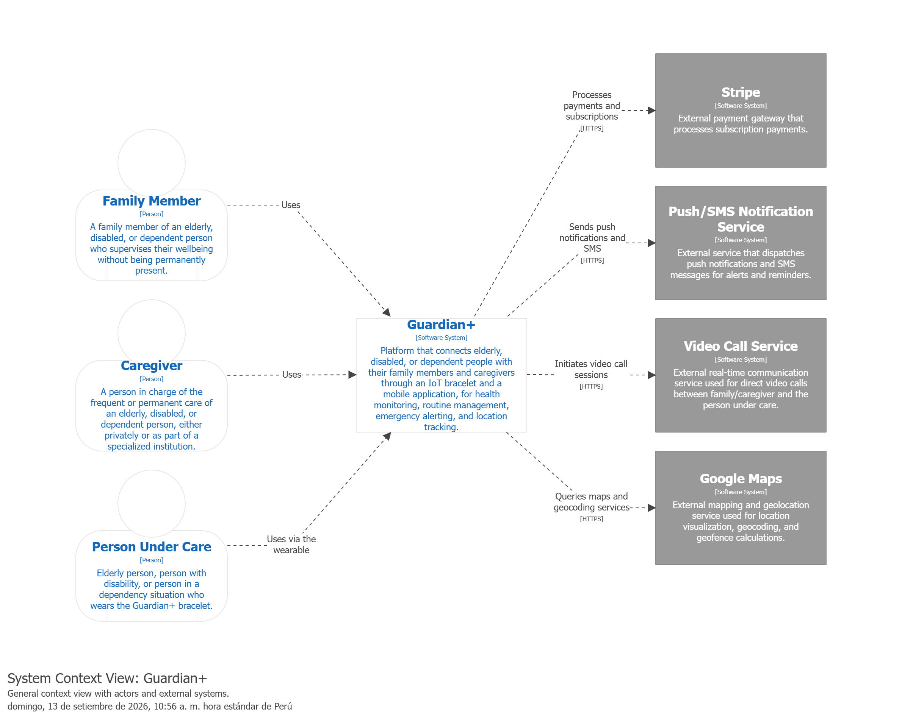

##### 2.5.3.2. Software Architecture Container Level Diagrams

Introducción

Esta sección descompone a Guardian+ en sus contenedores de alto nivel — las unidades desplegables independientes que conforman la solución — y muestra cómo se distribuyen las responsabilidades entre ellos, las decisiones tecnológicas adoptadas y los protocolos de comunicación entre contenedores.

Explicación

La plataforma está compuesta por cinco contenedores. La Guardian+ Landing Page (Angular, HTML, CSS, TypeScript) es el sitio público de marketing donde familiares y cuidadores conocen la propuesta de valor, los planes de suscripción y los canales de contacto de Guardian+; funciona como página informativa independiente, sin comunicación directa con el backend. La Guardian+ Mobile Application (Android nativo, Kotlin) es la interfaz que usan diariamente familiares y cuidadores para todo el monitoreo, gestión de rutinas, alertas y localización — es el único cliente que consume la API. El Guardian+ Wearable Firmware (embebido en C/C++ sobre ESP32-S3) es el software que corre dentro de la pulsera IoT, responsable de capturar signos vitales, detectar caídas, obtener ubicación GPS y permitir la activación del botón SOS.

Ambos clientes activos (Mobile Application y Wearable Firmware) se comunican con la Guardian+ REST API (Java y Spring Boot), que centraliza toda la lógica de negocio del sistema y persiste su información en la Guardian+ Database (PostgreSQL Server) vía JDBC. La comunicación del wearable con el backend utiliza MQTT sobre HTTPS — un protocolo liviano, adecuado para telemetría IoT de bajo consumo — mientras que la aplicación móvil consume la API mediante peticiones RESTful en JSON sobre HTTPS. Adicionalmente, el backend se comunica directamente con Stripe, el servicio de notificaciones y Google Maps para resolver pagos, alertas y geolocalización respectivamente, mientras que la videollamada se establece directamente entre la aplicación móvil y el servicio externo correspondiente, una vez que el backend orquesta el inicio de la sesión.


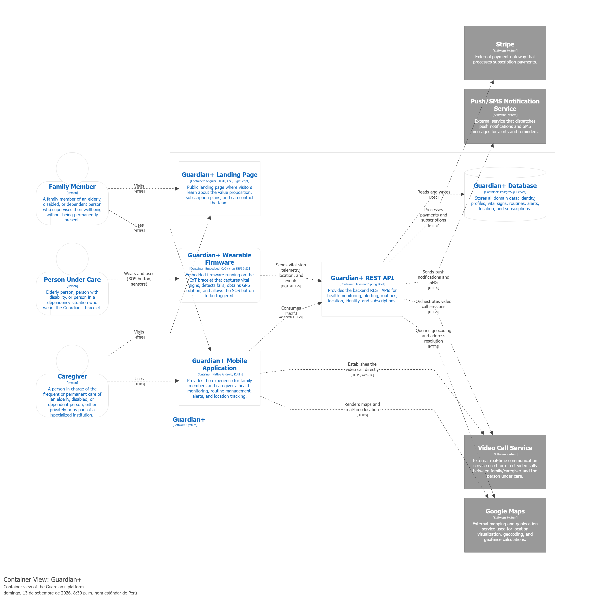

##### 2.5.3.3. Software Architecture Components Level Diagrams

Introducción

Esta sección presenta la vista de componentes de la Guardian+ REST API, ilustrando los módulos funcionales internos del backend y cómo interactúan entre sí para resolver las distintas capacidades del sistema, con la API como elemento centralizado y sus componentes circundantes.

Explicación

El backend se organiza en siete componentes, correspondientes uno a uno con los Bounded Contexts definidos en el diseño estratégico de Domain-Driven Design del equipo: Emergency & Alerting y Health Monitoring como Core Domains, encargados respectivamente de la detección/escalamiento de emergencias y del monitoreo de signos vitales — los diferenciadores centrales de la propuesta de valor de Guardian+; Care Routines & Wellness y Mobility & Geofencing como Supporting Domains, que dan soporte a la gestión de rutinas de bienestar y a la localización/geocercas; y IAM, Profile y Subscriptions como Generic Domains, que resuelven capacidades transversales reutilizables (identidad y autorización, gestión de perfiles, y planes de suscripción).

Todos los componentes de negocio dependen de IAM para validar identidad y autorización mediante una capa anticorrupción (ACL), asegurando que cada comando solo pueda ser ejecutado por el actor correspondiente (por ejemplo, solo el Cuidador puede cancelar un recordatorio, o solo la persona bajo cuidado puede confirmarlo). Asimismo, Emergency & Alerting escucha eventos de integración emitidos por Health Monitoring, Care Routines & Wellness y Mobility & Geofencing — anomalías en signos vitales, inactividad prolongada y salida de zona segura respectivamente — reaccionando automáticamente para generar y escalar alertas; esta relación es la traducción directa de las políticas ya definidas en el Event Storming del equipo. Finalmente, Emergency & Alerting es también responsable de despachar las notificaciones push/SMS y de orquestar las sesiones de videollamada hacia los servicios externos correspondientes, mientras que Subscriptions se comunica con Stripe para el procesamiento de pagos.

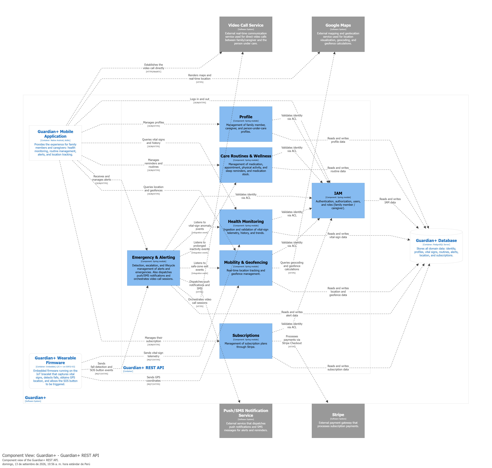

##### 2.5.3.4. Software Architecture Deployment Diagrams

### 2.6. Tactical-Level Domain-Driven Design

#### 2.6.x. Bounded Context: <Nombre del Bounded Context>

##### 2.6.x.1. Domain Layer

##### 2.6.x.2. Interface Layer

##### 2.6.x.3. Application Layer

##### 2.6.x.4. Infrastructure Layer

##### 2.6.x.5. Bounded Context Software Architecture Component Level Diagrams

##### 2.6.x.6. Bounded Context Software Architecture Code Level Diagrams

###### 2.6.x.6.1. Bounded Context Domain Layer Class Diagrams

###### 2.6.x.6.2. Bounded Context Database Design Diagram


#### 2.6.1. Bounded Context: Emergency & Alerting

El Bounded Context Emergency & Alerting constituye el Core Domain principal de Guardian+. Su responsabilidad consiste en registrar y clasificar los incidentes que comprometen la seguridad de un Fragile Citizen (caídas, activaciones de SOS, anomalías biométricas, salidas de zona segura e inactividad prolongada), derivar de ellos las alertas correspondientes, seleccionar la estrategia de despacho según la severidad y gobernar el escalamiento progresivo hacia el Care Circle hasta obtener un reconocimiento efectivo.

A diferencia de los contextos que producen señales (Health Monitoring, Mobility & Geofencing, Care Routines & Wellness), este contexto no observa telemetría: consume eventos de negocio ya interpretados y concentra las reglas de reacción, temporización y escalamiento que traducen una señal en una respuesta humana oportuna.

La arquitectura táctica se implementa sobre Java y Spring Boot aplicando una estructura de paquetes hexagonal/onion estricta dividida en cuatro capas: domain, interfaces, application e infrastructure.

```
com.guardianplus.platform.emergencyalerting/
├── domain/
│   ├── model/
│   │   ├── aggregates/
│   │   ├── commands/
│   │   ├── entities/
│   │   ├── events/
│   │   ├── queries/
│   │   └── valueobjects/
│   └── repositories/
├── interfaces/
│   ├── acl/
│   ├── events/
│   └── rest/
│       ├── controllers/
│       ├── resources/
│       └── transform/
├── application/
│   ├── acl/
│   ├── commandservices/
│   ├── internal/
│   │   ├── commandservices/
│   │   ├── eventhandlers/
│   │   └── queryservices/
│   └── queryservices/
└── infrastructure/
    ├── notifications/
    │   └── adapters/
    ├── persistence/
    │   └── jpa/
    │       ├── adapters/
    │       ├── assemblers/
    │       ├── converters/
    │       ├── embeddables/
    │       ├── entities/
    │       └── repositories/
    └── scheduling/
```

##### 2.6.1.1. Domain Layer

Encapsula las reglas de reacción ante emergencias, las invariantes del ciclo de vida de incidentes y alertas, y las políticas de escalamiento embebidas en los propios agregados y Value Objects. La separación entre `Incident` (la situación real) y `Alert` (el artefacto de notificación derivado) es la decisión de modelado central del contexto: un incidente puede originar múltiples alertas (primaria, escalada y de difusión), pero solo el incidente persiste en el historial de salud del Fragile Citizen.

###### Aggregates

*   **Incident**
    *   Agregado raíz que representa la situación real que compromete la seguridad del Fragile Citizen, independientemente de cuántas notificaciones se deriven de ella.
    *   Hereda de `AbstractDomainAggregateRoot<Incident>` para registrar y publicar eventos de dominio.
    *   Gobierna de forma autónoma su ciclo de vida (`DETECTED → CONFIRMED | DISMISSED → IN_ATTENTION → RESOLVED`), rechazando transiciones inválidas sin depender de servicios externos.
    *   *Atributos:*
        *   `id: IncidentId`
        *   `fragileCitizenId: FragileCitizenId`
        *   `type: IncidentType`
        *   `severity: Severity`
        *   `status: IncidentStatus`
        *   `geoSnapshot: GeoSnapshot`
        *   `confirmationWindow: ConfirmationWindow`
        *   `detectedAt: Instant`
        *   `confirmedAt: Instant`
        *   `resolvedAt: Instant`
    *   *Métodos:*
        *   `Incident(RegisterIncidentCommand command)`
        *   `confirm(): void`
        *   `dismissAsFalsePositive(String reason): void`
        *   `markInAttention(ResponderId responderId): void`
        *   `resolve(): void`
        *   `requiresBroadcast(): boolean`
        *   `isConfirmationWindowExpired(Instant now): boolean`

*   **Alert**
    *   Agregado raíz que representa el artefacto de notificación derivado de un incidente, dirigido a un destinatario específico del Care Circle.
    *   Ciclo de vida: `ISSUED → DELIVERED → ACKNOWLEDGED | EXPIRED`.
    *   *Atributos:*
        *   `id: AlertId`
        *   `incidentId: IncidentId`
        *   `recipientId: ContactId`
        *   `severity: Severity`
        *   `dispatchMode: DispatchMode`
        *   `channels: Set<NotificationChannel>`
        *   `status: AlertStatus`
        *   `issuedAt: Instant`
        *   `deliveredAt: Instant`
        *   `acknowledgedAt: Instant`
    *   *Métodos:*
        *   `Alert(IssueAlertCommand command)`
        *   `markAsDelivered(): void`
        *   `acknowledge(ContactId contactId): void`
        *   `claimResponse(ContactId contactId): void`
        *   `expire(): void`
        *   `isPending(): boolean`

*   **EscalationChain**
    *   Agregado raíz que materializa el plan ordenado de destinatarios y temporizadores asociado a un incidente confirmado. Se instancia únicamente tras la confirmación, nunca antes.
    *   Encapsula la política de avance secuencial y la condición de agotamiento de la cadena.
    *   *Atributos:*
        *   `id: EscalationChainId`
        *   `incidentId: IncidentId`
        *   `steps: List<EscalationStep>`
        *   `currentStepIndex: Integer`
        *   `ackTimeout: AckTimeout`
        *   `status: EscalationStatus`
        *   `startedAt: Instant`
        *   `stoppedAt: Instant`
    *   *Métodos:*
        *   `EscalationChain(InstantiateEscalationChainCommand command, List<EmergencyContact> orderedContacts)`
        *   `advanceToNextStep(): Optional<EscalationStep>`
        *   `stop(): void`
        *   `exhaust(): void`
        *   `hasRemainingSteps(): boolean`
        *   `isStepTimedOut(Instant now): boolean`

*   **AlertSettings**
    *   Agregado raíz que concentra la configuración de alertamiento por Fragile Citizen: canales por severidad, umbrales personalizados, modo silencioso y el orden de los contactos de emergencia que alimenta la cadena de escalamiento.
    *   *Atributos:*
        *   `id: AlertSettingsId`
        *   `fragileCitizenId: FragileCitizenId`
        *   `channelPolicy: ChannelPolicy`
        *   `thresholds: List<AlertThreshold>`
        *   `emergencyContacts: List<EmergencyContact>`
        *   `silentMode: SilentMode`
        *   `updatedAt: Instant`
    *   *Métodos:*
        *   `configureChannels(ChannelPolicy policy): void`
        *   `configureThresholds(List<AlertThreshold> thresholds): void`
        *   `resetThresholdsToClinicalDefaults(): void`
        *   `addEmergencyContact(EmergencyContact contact): void`
        *   `removeEmergencyContact(ContactId contactId): void`
        *   `reorderEmergencyContacts(List<ContactId> orderedIds): void`
        *   `activateSilentMode(): void`
        *   `deactivateSilentMode(): void`
        *   `resolveChannelsFor(Severity severity): Set<NotificationChannel>`

###### Entities

*   **EscalationStep**
    *   Entidad interna que representa un eslabón ordenado de la cadena de escalamiento (`EscalationChain`).
    *   *Atributos:*
        *   `id: Long`
        *   `stepOrder: Integer`
        *   `contactId: ContactId`
        *   `role: ContactRole`
        *   `status: StepStatus`
        *   `notifiedAt: Instant`
*   **EmergencyContact**
    *   Entidad interna de `AlertSettings` que referencia por identidad a un contacto gobernado por el contexto Profile, añadiendo el rol y la prioridad que solo tienen sentido dentro del alertamiento.
    *   *Atributos:*
        *   `id: Long`
        *   `contactId: ContactId`
        *   `priorityOrder: Integer`
        *   `role: ContactRole`
        *   `isPrimary: Boolean`
*   **AlertThreshold**
    *   Entidad interna de `AlertSettings` que registra la personalización de un umbral respecto del valor clínico predeterminado.
    *   *Atributos:*
        *   `id: Long`
        *   `metricType: String`
        *   `minValue: Double`
        *   `maxValue: Double`
        *   `isClinicalDefault: Boolean`

###### Value Objects

*   **Severity:** Enum (`CRITICAL`, `HIGH`, `MEDIUM`) que gobierna la estrategia de despacho. Métodos: `requiresBroadcast()`, `overridesSilentMode()`.
*   **IncidentType:** Enum (`FALL`, `SOS`, `BIOMETRIC_ANOMALY`, `SAFE_ZONE_BREACH`, `PROLONGED_INACTIVITY`).
*   **IncidentStatus:** Enum (`DETECTED`, `CONFIRMED`, `DISMISSED`, `IN_ATTENTION`, `RESOLVED`). Método: `canTransitionTo(IncidentStatus target)`.
*   **AlertStatus:** Enum (`ISSUED`, `DELIVERED`, `ACKNOWLEDGED`, `EXPIRED`).
*   **DispatchMode:** Enum (`BROADCAST`, `SEQUENTIAL`), derivado de la severidad por la política de despacho.
*   **NotificationChannel:** Enum (`PUSH`, `SMS`, `IN_APP`, `HAPTIC`).
*   **EscalationStatus:** Enum (`ACTIVE`, `STOPPED`, `EXHAUSTED`).
*   **StepStatus:** Enum (`PENDING`, `NOTIFIED`, `SKIPPED`).
*   **ContactRole:** Enum (`PRIMARY_CAREGIVER`, `FAMILY_MEMBER`, `SECONDARY_CONTACT`).
*   **ConfirmationWindow:** Encapsula la ventana de cancelación local del Fragile Citizen (`seconds: Integer`). Invariante: $5 - 120\\text{ s}$. Método: `hasExpired(Instant detectedAt, Instant now)`.
*   **AckTimeout:** Encapsula el tiempo de espera de reconocimiento por eslabón (`seconds: Integer`). Invariante: valor mayor a 0; valor por defecto $60\\text{ s}$.
*   **SilentMode:** Encapsula el estado del modo discreto (`active: Boolean`, `activatedAt: Instant`). Método: `allows(Severity severity)`, que retorna `false` salvo que la severidad sea `CRITICAL`.
*   **ChannelPolicy:** Mapa inmutable de severidad hacia el conjunto de canales habilitados. Método: `channelsFor(Severity severity)`.
*   **GeoSnapshot:** Captura geográfica inmutable del momento del incidente (`latitude: Double`, `longitude: Double`, `capturedAt: Instant`). Se obtiene por consulta puntual al contexto Mobility & Geofencing.
*   **IncidentId / AlertId / EscalationChainId / AlertSettingsId:** Identificadores inmutables tipo UUID.
*   **FragileCitizenId / ContactId / ResponderId:** Identificadores de referencia inmutables hacia entidades gobernadas por otros contextos.

###### Commands & Queries (Domain Model)

*   `RegisterIncidentCommand(UUID fragileCitizenId, String incidentType, String severity, Double latitude, Double longitude, Instant detectedAt)`
*   `ConfirmIncidentCommand(UUID incidentId)`
*   `DismissIncidentCommand(UUID incidentId, String reason)`
*   `MarkIncidentInAttentionCommand(UUID incidentId, UUID responderId)`
*   `ResolveIncidentCommand(UUID incidentId)`
*   `IssueAlertCommand(UUID incidentId, UUID recipientId, String severity, String dispatchMode)`
*   `BroadcastCriticalAlertCommand(UUID incidentId)`
*   `AcknowledgeAlertCommand(UUID alertId, UUID contactId)`
*   `ClaimAlertResponseCommand(UUID alertId, UUID contactId)`
*   `InstantiateEscalationChainCommand(UUID incidentId, UUID fragileCitizenId)`
*   `EscalateToNextContactCommand(UUID escalationChainId)`
*   `StopEscalationCommand(UUID escalationChainId)`
*   `ExhaustEscalationChainCommand(UUID escalationChainId)`
*   `ConfigureAlertChannelsCommand(UUID fragileCitizenId, Map<String, Set<String>> channelsBySeverity)`
*   `ConfigureAlertThresholdsCommand(UUID fragileCitizenId, List<ThresholdDefinition> thresholds)`
*   `ResetAlertThresholdsCommand(UUID fragileCitizenId)`
*   `AddEmergencyContactCommand(UUID fragileCitizenId, UUID contactId, String role, Boolean isPrimary)`
*   `RemoveEmergencyContactCommand(UUID fragileCitizenId, UUID contactId)`
*   `ReorderEmergencyContactsCommand(UUID fragileCitizenId, List<UUID> orderedContactIds)`
*   `ActivateSilentModeCommand(UUID fragileCitizenId)`
*   `DeactivateSilentModeCommand(UUID fragileCitizenId)`
*   `GetIncidentByIdQuery(IncidentId incidentId)`
*   `GetActiveIncidentsByFragileCitizenIdQuery(FragileCitizenId fragileCitizenId)`
*   `GetIncidentHistoryByCitizenAndDateRangeQuery(FragileCitizenId fragileCitizenId, DateRange dateRange, Severity severityFilter)`
*   `GetAlertsByIncidentIdQuery(IncidentId incidentId)`
*   `GetPendingAlertsByContactIdQuery(ContactId contactId)`
*   `GetEscalationChainByIncidentIdQuery(IncidentId incidentId)`
*   `GetAlertSettingsByFragileCitizenIdQuery(FragileCitizenId fragileCitizenId)`

###### Domain Events

*   `IncidentDetectedEvent`: Emitido al registrar un incidente, portando tipo y severidad inicial.
*   `IncidentConfirmedEvent`: Emitido cuando vence la ventana de confirmación sin cancelación del Fragile Citizen, o cuando la naturaleza del incidente (SOS) lo confirma de inmediato.
*   `IncidentDismissedEvent`: Emitido cuando el Fragile Citizen cancela dentro de la ventana, clasificando el evento como falso positivo resuelto.
*   `IncidentMarkedInAttentionEvent`: Emitido cuando un responsable asume la atención del incidente.
*   `IncidentResolvedEvent`: Emitido al cierre definitivo del incidente, ya sea por estabilización automática o por confirmación manual del cuidador.
*   `AlertIssuedEvent`: Emitido al derivar una alerta de un incidente hacia un destinatario concreto.
*   `AlertDeliveredEvent`: Emitido tras la confirmación de entrega por parte del proveedor de notificaciones.
*   `AlertAcknowledgedEvent`: Emitido cuando un destinatario reconoce la alerta.
*   `AlertResponseClaimedEvent`: Emitido cuando un destinatario declara que asumirá la respuesta, habilitando la notificación al resto del Care Circle.
*   `EscalationChainInstantiatedEvent`: Emitido al materializar la cadena de escalamiento de un incidente confirmado.
*   `EscalationAdvancedEvent`: Emitido al avanzar al siguiente eslabón por vencimiento del `AckTimeout`.
*   `EscalationStoppedEvent`: Emitido al detener la cadena tras un reconocimiento efectivo.
*   `EscalationChainExhaustedEvent`: Emitido cuando se agotan todos los eslabones sin reconocimiento, habilitando la difusión de último recurso.
*   `AlertSettingsUpdatedEvent`: Emitido ante cualquier modificación de canales, umbrales, contactos o modo silencioso.

###### Repositories (Domain Interfaces)

*   **IncidentRepository:**
    *   `save(Incident incident): Incident`
    *   `findById(IncidentId id): Optional<Incident>`
    *   `findActiveByFragileCitizenId(FragileCitizenId citizenId): List<Incident>`
    *   `findByCitizenAndPeriod(FragileCitizenId citizenId, DateRange period, Severity severity): List<Incident>`
    *   `findPendingConfirmation(Instant threshold): List<Incident>`
*   **AlertRepository:**
    *   `save(Alert alert): Alert`
    *   `saveAll(List<Alert> alerts): List<Alert>`
    *   `findById(AlertId id): Optional<Alert>`
    *   `findByIncidentId(IncidentId incidentId): List<Alert>`
    *   `findPendingByContactId(ContactId contactId): List<Alert>`
*   **EscalationChainRepository:**
    *   `save(EscalationChain chain): EscalationChain`
    *   `findByIncidentId(IncidentId incidentId): Optional<EscalationChain>`
    *   `findActiveWithExpiredTimeout(Instant now): List<EscalationChain>`
*   **AlertSettingsRepository:**
    *   `save(AlertSettings settings): AlertSettings`
    *   `findByFragileCitizenId(FragileCitizenId citizenId): Optional<AlertSettings>`

---

##### 2.6.1.2. Interface Layer

Traduce estímulos externos hacia comandos y consultas de aplicación, expone contratos HTTP RESTful para la app móvil y canaliza los eventos de integración provenientes de los contextos proveedores de señales.

###### REST Controllers

*   **IncidentsController** (`/api/v1/incidents`):
    *   `POST /`: Registra un incidente detectado por el gateway del dispositivo wearable.
    *   `GET /`: Lista paginada y filtrable por `citizenId`, `severity`, `page` y `size`.
    *   `GET /{incidentId}`: Recupera el detalle de un incidente específico.
    *   `POST /{incidentId}/confirm`: Confirma manualmente la emergencia.
    *   `POST /{incidentId}/dismiss`: Cancela el incidente dentro de la ventana de confirmación (falso positivo).
    *   `POST /{incidentId}/resolve`: Cierra definitivamente el incidente.
*   **AlertsController** (`/api/v1/alerts`):
    *   `GET /pending/{contactId}`: Lista las alertas pendientes de reconocimiento de un destinatario.
    *   `GET /incident/{incidentId}`: Lista las alertas derivadas de un incidente.
    *   `POST /{alertId}/acknowledge`: Registra el reconocimiento de la alerta por parte del destinatario.
    *   `POST /{alertId}/claim`: Declara que el destinatario asumirá la respuesta al incidente.
*   **AlertSettingsController** (`/api/v1/alert-settings`):
    *   `GET /citizen/{citizenId}`: Recupera la configuración vigente de alertamiento.
    *   `PUT /citizen/{citizenId}/channels`: Personaliza los canales de notificación por severidad.
    *   `PUT /citizen/{citizenId}/thresholds`: Configura umbrales personalizados.
    *   `POST /citizen/{citizenId}/thresholds/reset`: Restablece los umbrales clínicos predeterminados.
    *   `POST /citizen/{citizenId}/silent-mode`: Activa el modo discreto.
    *   `DELETE /citizen/{citizenId}/silent-mode`: Desactiva el modo discreto.
*   **EmergencyContactsController** (`/api/v1/emergency-contacts`):
    *   `GET /citizen/{citizenId}`: Lista la agenda ordenada de contactos de auxilio.
    *   `POST /`: Incorpora un contacto de emergencia a la cadena.
    *   `DELETE /{contactId}`: Retira un contacto, validando la permanencia de al menos un contacto primario.
    *   `PUT /reorder`: Reordena la prioridad de los contactos dentro de la cadena.

###### Resources & Assemblers

*   *Resources (DTOs):* `RegisterIncidentResource`, `IncidentResource`, `IncidentSummaryResource`, `AlertResource`, `AcknowledgeAlertResource`, `AlertSettingsResource`, `ConfigureAlertChannelsResource`, `ConfigureAlertThresholdsResource`, `EmergencyContactResource`, `ReorderEmergencyContactsResource`.
*   *Assemblers (Mappers):* `RegisterIncidentCommandFromResourceAssembler`, `IncidentResourceFromEntityAssembler`, `AlertResourceFromEntityAssembler`, `AcknowledgeAlertCommandFromResourceAssembler`, `AlertSettingsResourceFromEntityAssembler`, `ConfigureAlertChannelsCommandFromResourceAssembler`, `EmergencyContactResourceFromEntityAssembler`.

###### Integration Events & ACL Facade

*   *Eventos consumidos (inbound):*
    *   `VitalSignAnomalyDetectedIntegrationEvent`: Proveniente de `Health Monitoring`; origina un incidente de tipo `BIOMETRIC_ANOMALY` con severidad `HIGH`.
    *   `SafeZoneBreachedIntegrationEvent`: Proveniente de `Mobility & Geofencing`; origina un incidente de tipo `SAFE_ZONE_BREACH`.
    *   `ProlongedInactivityDetectedIntegrationEvent`: Proveniente de `Care Routines & Wellness`; origina un incidente de tipo `PROLONGED_INACTIVITY`.
    *   `CareRelationshipEstablishedIntegrationEvent` y `CareRelationshipEndedIntegrationEvent`: Provenientes de `Profile`; actualizan la proyección local de contactos del Care Circle mediante Event-Carried State Transfer.
*   *Eventos publicados (outbound):*
    *   `EmergencyDispatchedIntegrationEvent`: Notifica a contextos de soporte que un incidente confirmado entró en despacho.
    *   `IncidentResolvedIntegrationEvent`: Notifica el cierre de un incidente para su incorporación al historial de salud.
*   `EmergencyAlertingContextFacade`: Interfaz expuesta para consultas sincrónicas de lectura segura entre contextos (estado de incidentes activos por Fragile Citizen).

---

##### 2.6.1.3. Application Layer

Orquesta los flujos de casos de uso delegando las reglas de negocio en los agregados correspondientes. Los Event Handlers de esta capa son la materialización directa de las policies identificadas en el Design-Level EventStorming.

###### Command Services

*   **IncidentCommandService & IncidentCommandServiceImpl:**
    *   `handle(RegisterIncidentCommand command): Optional<Incident>`: Construye y persiste el agregado `Incident`, resolviendo la ventana de confirmación aplicable según el tipo de incidente.
    *   `handle(ConfirmIncidentCommand command): void`: Confirma la emergencia y habilita la selección de estrategia de despacho.
    *   `handle(DismissIncidentCommand command): void`: Clasifica el incidente como falso positivo resuelto e interrumpe cualquier despacho pendiente.
    *   `handle(MarkIncidentInAttentionCommand command): void`: Transiciona el incidente a `IN_ATTENTION` tras un reconocimiento efectivo.
    *   `handle(ResolveIncidentCommand command): void`: Cierra el incidente y publica el evento de integración correspondiente.
*   **AlertCommandService & AlertCommandServiceImpl:**
    *   `handle(IssueAlertCommand command): Optional<Alert>`: Deriva una alerta del incidente resolviendo los canales habilitados desde `AlertSettings`.
    *   `handle(BroadcastCriticalAlertCommand command): List<Alert>`: Emite alertas simultáneas hacia todos los contactos del Care Circle.
    *   `handle(AcknowledgeAlertCommand command): void`: Registra el reconocimiento del destinatario.
    *   `handle(ClaimAlertResponseCommand command): void`: Registra la asunción de respuesta y notifica al resto de destinatarios.
*   **EscalationChainCommandService & EscalationChainCommandServiceImpl:**
    *   `handle(InstantiateEscalationChainCommand command): Optional<EscalationChain>`: Construye la cadena a partir del orden de contactos vigente en `AlertSettings`.
    *   `handle(EscalateToNextContactCommand command): void`: Avanza al siguiente eslabón y emite la alerta correspondiente.
    *   `handle(StopEscalationCommand command): void`: Detiene la cadena tras un reconocimiento efectivo.
    *   `handle(ExhaustEscalationChainCommand command): void`: Marca la cadena como agotada al no quedar eslabones disponibles.
*   **AlertSettingsCommandService & AlertSettingsCommandServiceImpl:**
    *   `handle(ConfigureAlertChannelsCommand command): void`
    *   `handle(ConfigureAlertThresholdsCommand command): void`
    *   `handle(ResetAlertThresholdsCommand command): void`
    *   `handle(AddEmergencyContactCommand command): void`
    *   `handle(RemoveEmergencyContactCommand command): void`
    *   `handle(ReorderEmergencyContactsCommand command): void`
    *   `handle(ActivateSilentModeCommand command): void`
    *   `handle(DeactivateSilentModeCommand command): void`

###### Query Services

*   **IncidentQueryService & IncidentQueryServiceImpl:** Resuelve `GetIncidentByIdQuery`, `GetActiveIncidentsByFragileCitizenIdQuery` y `GetIncidentHistoryByCitizenAndDateRangeQuery`.
*   **AlertQueryService & AlertQueryServiceImpl:** Resuelve `GetAlertsByIncidentIdQuery` y `GetPendingAlertsByContactIdQuery`.
*   **EscalationChainQueryService & EscalationChainQueryServiceImpl:** Resuelve `GetEscalationChainByIncidentIdQuery`.
*   **AlertSettingsQueryService & AlertSettingsQueryServiceImpl:** Resuelve `GetAlertSettingsByFragileCitizenIdQuery`.

###### Event Handlers

*   `IncidentDetectedEventHandler`: Implementa la policy **Fall Confirmation Timeout**. Programa el vencimiento de la ventana de cancelación local; si el Fragile Citizen no cancela, despacha `ConfirmIncidentCommand`.
*   `IncidentConfirmedEventHandler`: Implementa la policy **Dispatch Strategy Selector**. Evalúa la severidad del incidente: si es `CRITICAL` despacha `BroadcastCriticalAlertCommand`; si es `HIGH` despacha `InstantiateEscalationChainCommand` seguido de `EscalateToNextContactCommand`.
*   `AlertAcknowledgedEventHandler`: Implementa la policy **Escalation Stopper**. Despacha `StopEscalationCommand` sobre la cadena asociada al incidente.
*   `EscalationStoppedEventHandler`: Implementa la policy **Escalation Resolver**. Despacha `MarkIncidentInAttentionCommand`, cerrando la separación transaccional entre `EscalationChain` e `Incident`.
*   `EscalationChainExhaustedEventHandler`: Implementa la policy **Critical Broadcast Fallback**. Ante el agotamiento de la cadena sin reconocimiento, despacha `BroadcastCriticalAlertCommand` como último recurso.
*   `AlertResponseClaimedEventHandler`: Notifica al resto de destinatarios que un integrante del Care Circle ya asumió la respuesta.
*   `VitalSignAnomalyDetectedEventHandler`: Implementa la policy **Biometric Alert Raiser**. Traduce el evento de integración de `Health Monitoring` en un `RegisterIncidentCommand` de severidad `HIGH`.
*   `SafeZoneBreachedEventHandler` y `ProlongedInactivityDetectedEventHandler`: Traducen los eventos de integración de `Mobility & Geofencing` y `Care Routines & Wellness` en incidentes del tipo correspondiente.
*   `CareRelationshipChangedEventHandler`: Actualiza la proyección local desnormalizada del Care Circle ante altas y bajas de relaciones de cuidado en `Profile`.

###### Application ACL Implementation

*   `EmergencyAlertingContextFacadeImpl`: Implementa la fachada de acceso público del contexto.
*   `ProfileContextAcl`: Traduce los identificadores y estructuras de contacto provenientes de `Profile` hacia los Value Objects propios (`ContactId`, `ContactRole`), evitando el acoplamiento directo con su modelo.
*   `MobilityContextAcl`: Resuelve la consulta puntual de coordenadas para componer el `GeoSnapshot` de un incidente confirmado.

---

##### 2.6.1.4. Infrastructure Layer

Implementa la persistencia técnica en PostgreSQL, la integración con los proveedores externos de notificación y los componentes de programación temporal que sostienen las políticas de temporización del contexto.

###### Persistence JPA Entities

*   `IncidentPersistenceEntity`: Mapea la tabla `incidents`. Columnas: `id`, `fragile_citizen_id`, `incident_type`, `severity`, `status`, `latitude`, `longitude`, `geo_captured_at`, `confirmation_window_seconds`, `detected_at`, `confirmed_at`, `resolved_at`. Hereda campos de auditoría de `AuditableAbstractPersistenceEntity`.
*   `AlertPersistenceEntity`: Mapea la tabla `alerts`. Columnas: `id`, `incident_id`, `recipient_id`, `severity`, `dispatch_mode`, `channels`, `status`, `issued_at`, `delivered_at`, `acknowledged_at`.
*   `EscalationChainPersistenceEntity`: Mapea la tabla `escalation_chains`, con relación `@OneToMany` hacia `EscalationStepPersistenceEntity`.
*   `EscalationStepPersistenceEntity`: Mapea la tabla `escalation_steps`.
*   `AlertSettingsPersistenceEntity`: Mapea la tabla `alert_settings`, con el `ChannelPolicy` embebido y relaciones `@OneToMany` hacia contactos y umbrales.
*   `EmergencyContactPersistenceEntity`: Mapea la tabla `emergency_contacts`.
*   `AlertThresholdPersistenceEntity`: Mapea la tabla `alert_thresholds`.
*   `CareCircleProjectionPersistenceEntity`: Mapea la tabla de lectura desnormalizada `care_circle_projection`, alimentada por los eventos de integración de `Profile`.

###### Spring Data Repositories & Adapters

*   `IncidentPersistenceRepository`, `AlertPersistenceRepository`, `EscalationChainPersistenceRepository` y `AlertSettingsPersistenceRepository`: Extienden `JpaRepository<..., UUID>`.
*   `IncidentRepositoryImpl`, `AlertRepositoryImpl`, `EscalationChainRepositoryImpl` y `AlertSettingsRepositoryImpl`: Implementan las interfaces de dominio usando los assemblers de persistencia para traducir bidireccionalmente entre entidades JPA y agregados.

###### Persistence Assemblers

*   `IncidentPersistenceAssembler`: Traduce los tipos primitivos de `IncidentPersistenceEntity` hacia los Value Objects (`Severity`, `IncidentStatus`, `GeoSnapshot`, `ConfirmationWindow`) y recompone el agregado `Incident`.
*   `AlertPersistenceAssembler`, `EscalationChainPersistenceAssembler` y `AlertSettingsPersistenceAssembler`: Traducen entre sus respectivas entidades JPA y agregados de dominio.

###### Notification Adapters

*   `NotificationDispatcher`: Puerto de salida del dominio para el despacho efectivo de alertas, independiente del proveedor.
*   `PushNotificationProviderAdapter`: Implementación sobre Firebase Cloud Messaging para el canal `PUSH`.
*   `SmsProviderAdapter`: Implementación sobre proveedor SMS para el canal `SMS`, utilizado como canal de respaldo en severidad `CRITICAL`.

###### Scheduling

*   `FallConfirmationTimeoutScheduler`: Tarea de alta frecuencia que recupera los incidentes en estado `DETECTED` con ventana de confirmación vencida y despacha `ConfirmIncidentCommand`.
*   `EscalationAckTimeoutScheduler`: Tarea que identifica las cadenas activas cuyo `AckTimeout` ha expirado y despacha `EscalateToNextContactCommand` o `ExhaustEscalationChainCommand` según queden o no eslabones disponibles.
*   `AlertExpirationScheduler`: Tarea de mantenimiento que transiciona a `EXPIRED` las alertas sin reconocimiento una vez cerrado el incidente asociado.

---

##### 2.6.1.5. Bounded Context Software Architecture Component Level Diagrams

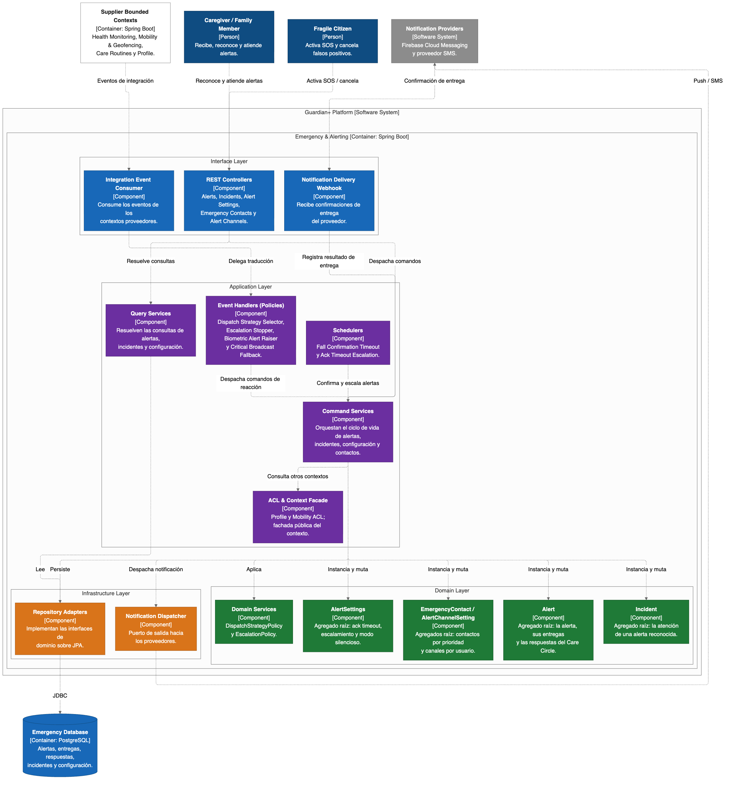

##### 2.6.1.6. Bounded Context Software Architecture Code Level Diagrams

###### 2.6.1.6.1. Bounded Context Domain Layer Class Diagrams

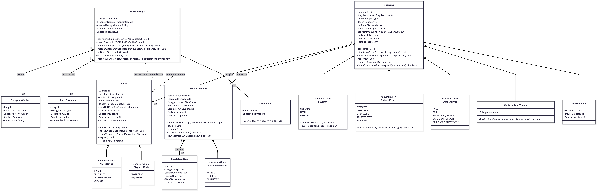

###### 2.6.1.6.2. Bounded Context Database Design Diagram

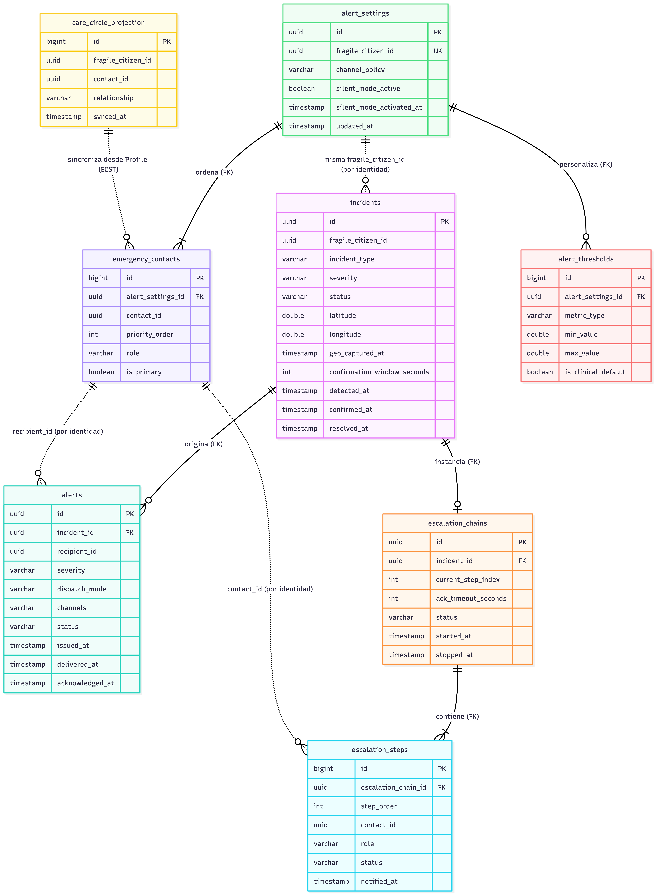


#### 2.6.2. Bounded Context: Health Monitoring

El Bounded Context Health Monitoring pertenece al Core Domain de Guardian+. Su responsabilidad consiste en la captura, ingestión, evaluación de umbrales clínicos y persistencia de telemetría de signos vitales (frecuencia cardíaca, presión arterial, saturación de oxígeno, temperatura y frecuencia respiratoria) proveniente de dispositivos wearables asignados a un Fragile Citizen, así como la consolidación y compilación de Health Reports periódicos.

La arquitectura táctica se implementa sobre Java y Spring Boot aplicando una estructura de paquetes hexagonal/onion estricta dividida en cuatro capas: domain, interfaces, application e infrastructure.

com.guardianplus.platform.healthmonitoring/
├── domain/
│   ├── model/
│   │   ├── aggregates/
│   │   ├── commands/
│   │   ├── entities/
│   │   ├── events/
│   │   ├── queries/
│   │   └── valueobjects/
│   └── repositories/
├── interfaces/
│   ├── acl/
│   ├── events/
│   └── rest/
│       ├── controllers/
│       ├── resources/
│       └── transform/
├── application/
│   ├── acl/
│   ├── commandservices/
│   ├── internal/
│   │   ├── commandservices/
│   │   ├── eventhandlers/
│   │   └── queryservices/
│   └── queryservices/
└── infrastructure/
    ├── persistence/
    │   └── jpa/
    │       ├── adapters/
    │       ├── assemblers/
    │       ├── converters/
    │       ├── embeddables/
    │       ├── entities/
    │       └── repositories/
    └── scheduling/

##### 2.6.2.1. Domain Layer

Encapsula la lógica pura del dominio médico, las invariantes fisiológicas y las reglas de evaluación clínica embebidas en los propios agregados y Value Objects.

###### Aggregates

*   **VitalSignTelemetry**
    *   Agregado raíz principal que representa la captura puntual de signos vitales de un Fragile Citizen.
    *   Hereda de `AbstractDomainAggregateRoot<VitalSignTelemetry>` para registrar y publicar eventos de dominio.
    *   Valida de forma autónoma la transgresión de umbrales clínicos sobre cada uno de sus Value Objects constitutivos sin depender de entidades externas.
    *   *Atributos:*
        *   `id: VitalSignTelemetryId`
        *   `fragileCitizenId: FragileCitizenId`
        *   `heartRate: HeartRate`
        *   `bloodPressure: BloodPressure`
        *   `oxygenSaturation: OxygenSaturation`
        *   `bodyTemperature: BodyTemperature`
        *   `respiratoryRate: RespiratoryRate`
        *   `integrityStatus: TelemetryIntegrityStatus`
        *   `hasClinicalDeviation: Boolean`
        *   `recordedAt: Instant`
        *   `createdAt: Instant`
    *   *Métodos:*
        *   `VitalSignTelemetry(RecordVitalSignTelemetryCommand command)`
        *   `evaluateThresholds(): boolean`
        *   `markAsCorrupted(String reason): void`
        *   `hasClinicalDeviation(): Boolean`

*   **HealthReport**
    *   Agregado raíz que consolida y sintetiza series temporales de signos vitales dentro de un rango temporal.
    *   *Atributos:*
        *   `id: HealthReportId`
        *   `fragileCitizenId: FragileCitizenId`
        *   `period: DateRange`
        *   `summaries: List<VitalSignSummary>`
        *   `recurrentAnomaliesCount: Integer`
        *   `generatedAt: Instant`
    *   *Métodos:*
        *   `HealthReport(GenerateHealthReportCommand command, List<VitalSignTelemetry> telemetries)`
        *   `isClinicallyStable(): boolean`

###### Entities

*   **VitalSignSummary**
    *   Entidad interna que compone el reporte médico agregado (`HealthReport`).
    *   *Atributos:*
        *   `id: Long`
        *   `metricType: String`
        *   `averageValue: Double`
        *   `minValue: Double`
        *   `maxValue: Double`
        *   `stabilityIndex: String`

###### Value Objects

*   **HeartRate:** Encapsula la frecuencia cardíaca en pulsaciones por minuto (`beatsPerMinute: Integer`). Invariante: $20 - 300\\text{ BPM}$. Métodos: `isBradycardia()`, `isTachycardia()`, `isAbnormal()`.
*   **BloodPressure:** Encapsula los valores hemodinámicos sistólico y diastólico (`systolic: Integer`, `diastolic: Integer`) en $\\text{mmHg}$. Invariante: valores mayores a 0. Métodos: `isHypertensive()`, `isHypotensive()`, `isAbnormal()`.
*   **OxygenSaturation:** Encapsula la saturación de oxígeno periférico $\\text{SpO}_2$ (`percentage: Double`). Invariante: $0.0 - 100.0\\%$. Métodos: `isHypoxemia()`, `isAbnormal()`.
*   **BodyTemperature:** Encapsula la temperatura cutánea (`celsius: Double`). Invariante: $25.0 - 45.0^{\\circ}\\text{C}$. Métodos: `isFebrile()`, `isHypothermic()`, `isAbnormal()`.
*   **RespiratoryRate:** Encapsula la frecuencia respiratoria (`breathsPerMinute: Integer`). Invariante: valor mayor a 0. Métodos: `isBradypnea()`, `isTachypnea()`, `isAbnormal()`.
*   **DateRange:** Intervalo temporal inmutable (`startDate: Instant`, `endDate: Instant`). Método: `contains(Instant timestamp)`.
*   **VitalSignTelemetryId:** Identificador inmutable tipo UUID.
*   **HealthReportId:** Identificador inmutable tipo UUID.
*   **FragileCitizenId:** Identificador de referencia inmutable al paciente monitoreado.
*   **TelemetryIntegrityStatus:** Enum (`VALID`, `CORRUPTED`, `INCOMPLETE`).

###### Commands & Queries (Domain Model)

*   `RecordVitalSignTelemetryCommand(UUID fragileCitizenId, Integer heartRate, Integer systolicBp, Integer diastolicBp, Double oxygenSaturation, Double temperature, Integer respiratoryRate, Instant recordedAt)`
*   `EvaluateVitalSignThresholdsCommand(UUID telemetryId)`
*   `GenerateHealthReportCommand(UUID fragileCitizenId, Instant periodStart, Instant periodEnd)`
*   `CompileWeeklySummaryCommand(UUID fragileCitizenId)`
*   `GetLiveVitalSignsByFragileCitizenIdQuery(FragileCitizenId fragileCitizenId)`
*   `GetVitalSignTelemetriesByCitizenAndDateRangeQuery(FragileCitizenId fragileCitizenId, DateRange dateRange)`
*   `GetHealthReportByIdQuery(HealthReportId healthReportId)`
*   `GetAllHealthReportsByFragileCitizenIdQuery(FragileCitizenId fragileCitizenId)`

###### Domain Events

*   `VitalSignsDetectedEvent`: Emitido tras validar e instanciar una captura de signos vitales.
*   `VitalSignThresholdsEvaluatedEvent`: Emitido al concluir la validación de umbrales del agregado, portando el estado de desviación (`hasDeviation: boolean`).
*   `HealthReportGeneratedEvent`: Emitido tras la compilación de un reporte longitudinal.
*   `WeeklySummaryCompiledEvent`: Emitido por la tarea programada dominical.

###### Repositories (Domain Interfaces)

*   **VitalSignTelemetryRepository:**
    *   `save(VitalSignTelemetry telemetry): VitalSignTelemetry`
    *   `saveAll(List<VitalSignTelemetry> telemetries): List<VitalSignTelemetry>`
    *   `findLatestByFragileCitizenId(FragileCitizenId citizenId): Optional<VitalSignTelemetry>`
    *   `findRecentByFragileCitizenId(FragileCitizenId citizenId, int count): List<VitalSignTelemetry>`
    *   `findByFragileCitizenIdAndPeriod(FragileCitizenId citizenId, DateRange period): List<VitalSignTelemetry>`
*   **HealthReportRepository:**
    *   `save(HealthReport report): HealthReport`
    *   `findById(HealthReportId id): Optional<HealthReport>`
    *   `findByFragileCitizenId(FragileCitizenId citizenId): List<HealthReport>`

---

##### 2.6.2.2. Interface Layer

Traduce estímulos externos hacia comandos y consultas de aplicación, expone contratos HTTP RESTful y canaliza eventos de integración.

###### REST Controllers

*   **VitalSignsController** (`/api/v1/vital-signs`):
    *   `POST /`: Registra una lectura individual de signos vitales.
    *   `POST /batches`: Ingesta por lotes para sincronización de telemetría offline.
    *   `GET /live/{citizenId}`: Consulta el último estado biométrico para visualización en tiempo real.
    *   `GET /history/{citizenId}`: Retorna lecturas históricas filtradas por rango temporal.
*   **HealthReportsController** (`/api/v1/health-reports`):
    *   `POST /`: Dispara la generación bajo demanda de un reporte de salud.
    *   `GET /{reportId}`: Recupera un reporte específico compilado.
    *   `GET /citizen/{citizenId}`: Lista los reportes emitidos de un Fragile Citizen.

###### Resources & Assemblers

*   *Resources (DTOs):* `RecordVitalSignTelemetryResource`, `VitalSignTelemetryResource`, `LiveVitalSignsResource`, `GenerateHealthReportResource`, `HealthReportResource`.
*   *Assemblers (Mappers):* `RecordVitalSignCommandFromResourceAssembler`, `VitalSignResourceFromEntityAssembler`, `LiveVitalSignsResourceFromEntityAssembler`, `GenerateHealthReportCommandFromResourceAssembler`, `HealthReportResourceFromEntityAssembler`.

###### Integration Events & ACL Facade

*   `VitalSignAnomalyDetectedIntegrationEvent`: Evento publicado hacia el bus de mensajería cuando se confirman 3 transgresiones basales consecutivas, consumido por `Emergency & Alerting`.
*   `HealthReportCompiledIntegrationEvent`: Notifica a contextos de soporte la disponibilidad de un nuevo reporte estructurado.
*   `HealthMonitoringContextFacade`: Interfaz expuesta para consultas sincrónicas de lectura segura entre contextos.

---

##### 2.6.2.3. Application Layer

Orquesta los flujos de casos de uso delegando las reglas clínicas en los agregados correspondientes.

###### Command Services

*   **VitalSignTelemetryCommandService & VitalSignTelemetryCommandServiceImpl:**
    *   `handle(RecordVitalSignTelemetryCommand command): Optional<VitalSignTelemetry>`: Construye y persiste `VitalSignTelemetry`, activando internamente la validación de umbrales del aggregate root.
    *   `handle(EvaluateVitalSignThresholdsCommand command): void`: Evalúa el agregado; recupera las últimas lecturas del repositorio y comprueba la política de 3 violaciones consecutivas para disparar la alerta de integración si corresponde.
*   **HealthReportCommandService & HealthReportCommandServiceImpl:**
    *   `handle(GenerateHealthReportCommand command): Optional<HealthReport>`: Extrae telemetrías del período y construye y persiste el aggregate `HealthReport`.
    *   `handle(CompileWeeklySummaryCommand command): void`: Orquesta la síntesis semanal programada.

###### Query Services

*   **VitalSignTelemetryQueryService & VitalSignTelemetryQueryServiceImpl:** Resuelve `GetLiveVitalSignsByFragileCitizenIdQuery` y `GetVitalSignTelemetriesByCitizenAndDateRangeQuery`.
*   **HealthReportQueryService & HealthReportQueryServiceImpl:** Resuelve `GetHealthReportByIdQuery` y `GetAllHealthReportsByFragileCitizenIdQuery`.

###### Event Handlers

*   `VitalSignsDetectedEventHandler`: Reacciona a `VitalSignsDetectedEvent` y ejecuta inmediatamente `EvaluateVitalSignThresholdsCommand`.
*   `VitalSignThresholdsEvaluatedEventHandler`: Si el aggregate reporta desviación clínica (`hasClinicalDeviation == true`), consulta las 2 lecturas inmediatamente anteriores en `VitalSignTelemetryRepository`. Si las 3 lecturas violan umbrales, despacha `VitalSignAnomalyDetectedIntegrationEvent`.
*   `WeeklySummaryCompiledEventHandler`: Gestiona la indexación y caché de los resúmenes médicos compilados.

###### Application ACL Implementation

*   `HealthMonitoringContextFacadeImpl`: Implementa la fachada de acceso público del contexto.

---

##### 2.6.2.4. Infrastructure Layer

Implementa la persistencia técnica en PostgreSQL, la comunicación con el broker MQTT y los componentes de programación temporal.

###### Persistence JPA Entities

*   `VitalSignTelemetryPersistenceEntity`: Mapea la tabla `vital_sign_telemetries`. Columnas: `id`, `fragile_citizen_id`, `heart_rate_bpm`, `bp_systolic_mmhg`, `bp_diastolic_mmhg`, `spo2_percentage`, `temperature_celsius`, `respiratory_rate_rpm`, `has_clinical_deviation`, `integrity_status`, `recorded_at`. Hereda campos de auditoría de `AuditableAbstractPersistenceEntity`.
*   `HealthReportPersistenceEntity`: Mapea la tabla `health_reports`. Contiene el período embebido y la relación `@OneToMany` hacia `ReportSummaryPersistenceEntity`.
*   `ReportSummaryPersistenceEntity`: Mapea la tabla `report_summaries`.

###### Spring Data Repositories & Adapters

*   `VitalSignTelemetryPersistenceRepository`: Extiende `JpaRepository<VitalSignTelemetryPersistenceEntity, UUID>`.
*   `HealthReportPersistenceRepository`: Extiende `JpaRepository<HealthReportPersistenceEntity, UUID>`.
*   `VitalSignTelemetryRepositoryImpl`: Implementa `VitalSignTelemetryRepository` usando `VitalSignTelemetryPersistenceAssembler` para traducir bidireccionalmente entre entidades JPA y agregados de dominio.
*   `HealthReportRepositoryImpl`: Implementa `HealthReportRepository`.

###### Persistence Assemblers

*   `VitalSignTelemetryPersistenceAssembler`: Traduce los tipos primitivos de `VitalSignTelemetryPersistenceEntity` hacia las instancias de los Value Objects (`HeartRate`, `BloodPressure`, etc.) y recompone el agregado `VitalSignTelemetry`.
*   `HealthReportPersistenceAssembler`: Traduce entre `HealthReportPersistenceEntity` y `HealthReport`.

###### Scheduling

*   `WeeklyHealthSummaryScheduler`: Tarea periódica anotada con `@Scheduled(cron = "0 0 0 * * SUN")` que invoca `CompileWeeklySummaryCommand` para los pacientes activos.

---
##### 2.6.2.5. Bounded Context Software Architecture Component Level Diagrams
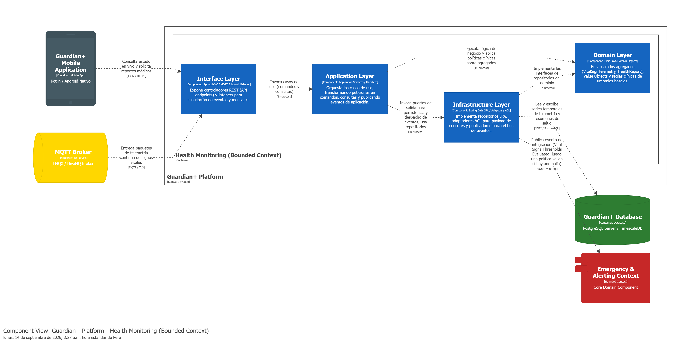

##### 2.6.2.6. Bounded Context Software Architecture Code Level Diagrams
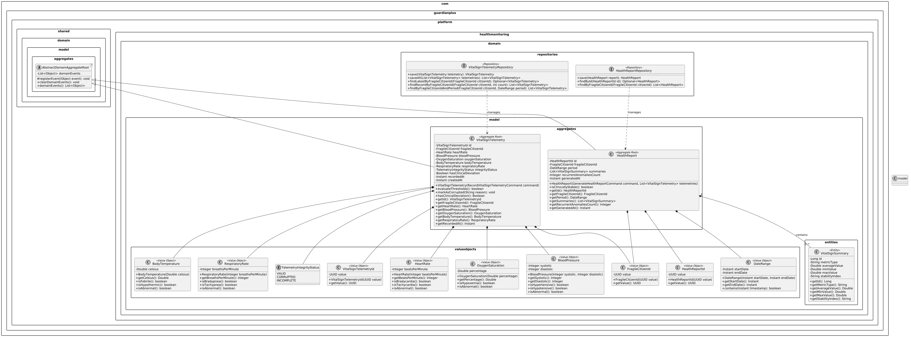

###### 2.6.2.6.1. Bounded Context Domain Layer Class Diagrams

###### 2.6.2.6.2. Bounded Context Database Design Diagram


### 2.6.3. Bounded Context: Subscriptions

El Bounded Context **Subscriptions** pertenece al Generic Domain de Guardian+ y es responsable de gestionar el ciclo de vida comercial de las suscripciones de la plataforma. Abarca la solicitud y activación de una suscripción, cambios de plan, renovación, cancelación, expiración y determinación de los beneficios o entitlements asociados al plan vigente.

Este contexto mantiene aisladas las reglas comerciales de Guardian+ respecto de capacidades pertenecientes a otros contextos, como identidad, perfiles, monitoreo de salud o gestión de emergencias. Las integraciones necesarias con proveedores de pago y mecanismos de programación temporal se realizan mediante abstracciones y adaptadores, evitando que dichas dependencias formen parte directa del modelo de dominio.

##### 2.6.3.1. Domain Layer

##### Aggregate Root

###### Subscription

Representa una suscripción comercial de Guardian+ y constituye el Aggregate Root principal del bounded context. Es responsable de mantener la consistencia del ciclo de vida de una suscripción, incluyendo activación, cambio de plan, renovación, cancelación y expiración.

**Atributos principales:**

- `id: SubscriptionId`
- `subscriberId: SubscriberId`
- `planId: PlanId`
- `status: SubscriptionStatus`
- `currentPeriodStart: Instant`
- `currentPeriodEnd: Instant`
- `cancelAtPeriodEnd: Boolean`
- `createdAt: Instant`
- `updatedAt: Instant`

**Métodos principales:**

- `activate(planId: PlanId): void`
- `changePlan(newPlanId: PlanId): void`
- `renew(newPeriodEnd: Instant): void`
- `requestCancellation(): void`
- `cancel(): void`
- `scheduleCancellation(): void`
- `expire(): void`
- `isActive(): Boolean`
- `requiresRenewal(currentDate: Instant): Boolean`

El aggregate protege las invariantes relacionadas con las transiciones válidas de estado. Por ejemplo, una suscripción expirada no puede renovarse sin pasar nuevamente por las condiciones de activación definidas por el dominio.

###### EntitlementSet

Representa el conjunto efectivo de beneficios que una suscripción habilita para un usuario. Su responsabilidad es mantener de manera consistente los entitlements derivados del plan y del estado actual de la suscripción.

**Atributos principales:**

- `subscriptionId: SubscriptionId`
- `entitlements: Set<Entitlement>`
- `updatedAt: Instant`

**Métodos principales:**

- `replaceWith(entitlements: Set<Entitlement>): void`
- `grant(entitlement: Entitlement): void`
- `revoke(entitlement: Entitlement): void`
- `contains(code: EntitlementCode): Boolean`
- `revokeAll(): void`

El aggregate se actualiza como consecuencia de cambios relevantes en la suscripción, tales como activación, cambio de plan, cancelación o expiración.

##### Entities

###### Plan

Representa una alternativa comercial disponible en Guardian+. Define las características generales utilizadas por el dominio para evaluar las condiciones de una suscripción.

**Atributos principales:**

- `id: PlanId`
- `name: String`
- `price: Money`
- `billingCycle: BillingCycle`
- `active: Boolean`
- `entitlementCodes: Set<EntitlementCode>`

**Métodos principales:**

- `isFree(): Boolean`
- `requiresPayment(): Boolean`
- `includes(entitlementCode: EntitlementCode): Boolean`

###### Entitlement

Representa un beneficio o capacidad comercial que puede habilitarse como parte de un plan de suscripción.

**Atributos principales:**

- `code: EntitlementCode`
- `name: String`
- `description: String`

**Métodos principales:**

- `matches(code: EntitlementCode): Boolean`

##### Value Objects

###### SubscriptionId
Identificador inmutable de una suscripción.

###### SubscriberId
Identificador del titular de la suscripción. Permite referenciar al usuario propietario sin incorporar directamente el modelo del contexto IAM o Profile dentro de Subscriptions.

###### PlanId
Identificador inmutable de un plan comercial.

###### EntitlementCode
Código único utilizado para identificar un beneficio comercial.

###### Money
Representa un monto monetario compuesto por un valor y una moneda.

**Atributos:**
- `amount: Decimal`
- `currency: Currency`

###### BillingCycle
Representa la periodicidad comercial de un plan, por ejemplo mensual o anual.

###### SubscriptionStatus
Representa el estado vigente de una suscripción.

Estados candidatos:
- `PENDING`
- `ACTIVE`
- `CANCELLATION_SCHEDULED`
- `CANCELLED`
- `EXPIRED`

##### Domain Services

###### SubscriptionActivationPolicy

Evalúa las condiciones necesarias para activar una suscripción y determina si el plan seleccionado requiere procesamiento de pago.

**Operaciones principales:**

- `determineRequirements(plan: Plan): ActivationRequirements`

###### SubscriptionLifecyclePolicy

Centraliza reglas de negocio relacionadas con las transiciones del ciclo de vida de una suscripción.

**Operaciones principales:**

- `determinePlanChangeConditions(subscription: Subscription, newPlan: Plan): PlanChangeDecision`
- `determineCancellationEffectiveDate(subscription: Subscription): CancellationDecision`
- `determineRenewalRequirements(subscription: Subscription, plan: Plan): RenewalRequirements`
- `determineExpirationConditions(subscription: Subscription): ExpirationDecision`

###### EntitlementPolicy

Determina el conjunto de beneficios que corresponde a una suscripción según el plan contratado y su estado vigente.

**Operaciones principales:**

- `afterActivation(subscription: Subscription, plan: Plan): Set<Entitlement>`
- `afterPlanChange(subscription: Subscription, plan: Plan): Set<Entitlement>`
- `afterCancellation(subscription: Subscription): Set<Entitlement>`
- `afterExpiration(subscription: Subscription): Set<Entitlement>`

##### Repository Interfaces

###### SubscriptionRepository

Abstracción para recuperar y persistir aggregates `Subscription`.

**Operaciones principales:**

- `findById(id: SubscriptionId): Optional<Subscription>`
- `findActiveBySubscriberId(subscriberId: SubscriberId): Optional<Subscription>`
- `save(subscription: Subscription): Subscription`

###### PlanRepository

Permite consultar los planes comerciales disponibles.

**Operaciones principales:**

- `findById(id: PlanId): Optional<Plan>`
- `findActivePlans(): List<Plan>`

###### EntitlementSetRepository

Permite recuperar y persistir el conjunto de beneficios efectivos de una suscripción.

**Operaciones principales:**

- `findBySubscriptionId(subscriptionId: SubscriptionId): Optional<EntitlementSet>`
- `save(entitlementSet: EntitlementSet): EntitlementSet`

#### 2.6.3.2. Interface Layer

La Interface Layer expone las capacidades del bounded context Subscriptions hacia los clientes de Guardian+ y recibe mensajes provenientes de integraciones externas. Esta capa traduce solicitudes HTTP o mensajes externos a comandos y consultas entendibles por la Application Layer, sin contener reglas propias del dominio.

##### Backend API

###### SubscriptionController

Expone los endpoints REST relacionados con el ciclo de vida de una suscripción.

Responsabilidades principales:

- solicitar una nueva suscripción;
- solicitar cambio de plan;
- solicitar cancelación;
- consultar el estado de una suscripción;
- consultar los entitlements disponibles.

###### PaymentWebhookController

Recibe las notificaciones enviadas por el proveedor externo de pagos y las traduce a acciones de aplicación, como confirmación o fallo de un pago inicial o de renovación.

##### Message Consumers

###### BillingSchedulerConsumer

Recibe o dispara las señales temporales necesarias para evaluar renovaciones y expiraciones de suscripciones.

#### 2.6.3.3. Application Layer

La Application Layer orquesta los casos de uso de Subscriptions utilizando los aggregates, servicios de dominio y repositorios definidos en la Domain Layer. Esta capa no implementa las reglas centrales del negocio, sino que coordina su ejecución.

##### Command Handlers

- `RequestSubscriptionHandler`
- `ActivateSubscriptionHandler`
- `InitiateSubscriptionPaymentHandler`
- `RequestPlanChangeHandler`
- `ApplyPlanChangeHandler`
- `RequestSubscriptionCancellationHandler`
- `CancelSubscriptionHandler`
- `EvaluateSubscriptionRenewalHandler`
- `InitiateRenewalPaymentHandler`
- `RenewSubscriptionHandler`
- `EvaluateSubscriptionExpirationHandler`
- `ExpireSubscriptionHandler`
- `UpdateEntitlementsHandler`

##### Query Handlers

- `GetSubscriptionStatusHandler`
- `GetAvailableEntitlementsHandler`

##### Event Handlers

- `SubscriptionActivatedHandler`
- `SubscriptionPlanChangedHandler`
- `SubscriptionCancelledHandler`
- `SubscriptionExpiredHandler`
- `PaymentConfirmedHandler`
- `PaymentFailedHandler`
- `RenewalPaymentConfirmedHandler`
- `RenewalPaymentFailedHandler`


#### 2.6.3.4. Infrastructure Layer

La Infrastructure Layer contiene las implementaciones técnicas de las abstracciones definidas por las capas internas y los adaptadores utilizados para comunicarse con sistemas externos. De esta forma, las reglas comerciales de Subscriptions permanecen independientes de frameworks, proveedores de pago y tecnologías de persistencia.

##### Repository Implementations

###### SubscriptionRepositoryImpl
Implementa `SubscriptionRepository` y gestiona la persistencia del aggregate `Subscription`.

###### PlanRepositoryImpl
Implementa `PlanRepository` y permite recuperar la configuración persistida de los planes comerciales.

###### EntitlementSetRepositoryImpl
Implementa `EntitlementSetRepository` y gestiona la persistencia de los beneficios efectivos asociados a cada suscripción.

##### External Service Adapters

###### PaymentProviderAdapter

Implementa la comunicación con el proveedor externo de pagos encargado de procesar cobros de activación y renovación.

Responsabilidades principales:

- iniciar solicitudes de pago;
- recuperar o interpretar referencias externas;
- validar notificaciones del proveedor;
- traducir estados externos a conceptos comprendidos por la Application Layer.

La selección definitiva del proveedor permanece desacoplada del dominio. Stripe se considera actualmente un candidato de implementación.

###### BillingSchedulerAdapter

Implementa el mecanismo técnico utilizado para activar evaluaciones temporales del ciclo de vida de las suscripciones, como renovación y expiración.

##### 2.6.3.5. Bounded Context Software Architecture Component Level Diagrams

pendiente
##### 2.6.3.6. Bounded Context Software Architecture Code Level Diagrams

Pendiente 
###### 2.6.3.6.1. Bounded Context Domain Layer Class Diagrams

pendiente
###### 2.6.3.6.2. Bounded Context Database Design Diagram

pendiente

### 2.6.4. Bounded Context: Profile

El Bounded Context **Profile** pertenece al Generic Domain de Guardian+ y es responsable de gestionar la información descriptiva de los usuarios, los perfiles de las personas bajo cuidado, las relaciones de cuidado y las preferencias asociadas al uso de la aplicación.

Este contexto mantiene separadas las responsabilidades relacionadas con identidad y autenticación, pertenecientes al Bounded Context IAM, de aquellas relacionadas con la información de perfil y las relaciones entre usuarios y personas bajo cuidado. De esta manera, Profile administra información necesaria para personalizar la experiencia de Guardian+ sin asumir responsabilidades de seguridad o autenticación.

#### 2.6.4.1. Domain Layer

La Domain Layer concentra las reglas de negocio relacionadas con la gestión de perfiles, personas bajo cuidado, relaciones de cuidado y preferencias de usuario. Esta capa mantiene las invariantes del contexto Profile y no depende de tecnologías de persistencia, frameworks o mecanismos de autenticación externos.

##### Aggregate Roots

###### UserProfile

Representa la información descriptiva asociada a un usuario de Guardian+. Este aggregate mantiene los datos personales y de contacto utilizados por la aplicación, manteniéndose independiente de las credenciales administradas por IAM.

**Atributos principales:**

- `id: UserProfileId`
- `userId: UserId`
- `firstName: String`
- `lastName: String`
- `phoneNumber: String`
- `profileImageUrl: String`
- `createdAt: Instant`
- `updatedAt: Instant`

**Métodos principales:**

- `updatePersonalInformation(firstName: String, lastName: String): void`
- `updateContactInformation(phoneNumber: String): void`
- `updateProfileImage(imageUrl: String): void`

El aggregate garantiza que la información de perfil permanezca asociada a una identidad válida mediante `userId`, sin almacenar ni administrar credenciales de autenticación.

###### CareRecipientProfile

Representa el perfil de una persona vulnerable que requiere cuidado dentro de Guardian+. Contiene información descriptiva necesaria para que familiares y cuidadores puedan identificar y gestionar adecuadamente a la persona bajo su responsabilidad.

**Atributos principales:**

- `id: CareRecipientProfileId`
- `createdByUserId: UserId`
- `firstName: String`
- `lastName: String`
- `birthDate: LocalDate`
- `profileImageUrl: String`
- `createdAt: Instant`
- `updatedAt: Instant`

**Métodos principales:**

- `updatePersonalInformation(firstName: String, lastName: String, birthDate: LocalDate): void`
- `updateProfileImage(imageUrl: String): void`

###### CareRelationship

Representa la relación de responsabilidad existente entre un usuario de Guardian+ y una persona bajo cuidado. Permite identificar quiénes pueden actuar como familiares responsables o cuidadores de un Care Recipient.

**Atributos principales:**

- `id: CareRelationshipId`
- `userId: UserId`
- `careRecipientProfileId: CareRecipientProfileId`
- `relationshipType: RelationshipType`
- `status: CareRelationshipStatus`
- `startedAt: Instant`
- `endedAt: Instant`

**Métodos principales:**

- `establish(): void`
- `end(): void`
- `isActive(): Boolean`

El aggregate controla el ciclo de vida de la relación de cuidado y evita que una relación finalizada continúe siendo considerada activa dentro del contexto.

###### UserPreferences

Representa las preferencias de experiencia y accesibilidad configuradas por un usuario de Guardian+.

**Atributos principales:**

- `userId: UserId`
- `language: Language`
- `notificationsEnabled: Boolean`
- `highContrastEnabled: Boolean`
- `voiceAssistanceEnabled: Boolean`
- `fontScale: FontScale`
- `updatedAt: Instant`

**Métodos principales:**

- `updateApplicationPreferences(notificationsEnabled: Boolean): void`
- `updateLanguage(language: Language): void`
- `updateAccessibilityPreferences(highContrastEnabled: Boolean, voiceAssistanceEnabled: Boolean, fontScale: FontScale): void`
##### Domain Services

###### CareRelationshipPolicy

Evalúa las reglas necesarias para establecer una nueva relación entre un usuario y una persona bajo cuidado.

**Operaciones principales:**

- `canEstablishRelationship(userId: UserId, careRecipientProfileId: CareRecipientProfileId): Boolean`
- `validateRelationshipType(type: RelationshipType): void`
##### Repository Interfaces

###### UserProfileRepository

Abstracción para recuperar y persistir perfiles de usuario.

**Operaciones principales:**

- `findById(id: UserProfileId): Optional<UserProfile>`
- `findByUserId(userId: UserId): Optional<UserProfile>`
- `save(profile: UserProfile): UserProfile`

###### CareRecipientProfileRepository

Abstracción para gestionar los perfiles de personas bajo cuidado.

**Operaciones principales:**

- `findById(id: CareRecipientProfileId): Optional<CareRecipientProfile>`
- `findByCreatedByUserId(userId: UserId): List<CareRecipientProfile>`
- `save(profile: CareRecipientProfile): CareRecipientProfile`

###### CareRelationshipRepository

Abstracción para recuperar y persistir relaciones de cuidado.

**Operaciones principales:**

- `findById(id: CareRelationshipId): Optional<CareRelationship>`
- `findActiveByUserId(userId: UserId): List<CareRelationship>`
- `findActiveByCareRecipientId(careRecipientProfileId: CareRecipientProfileId): List<CareRelationship>`
- `save(relationship: CareRelationship): CareRelationship`

###### UserPreferencesRepository

Abstracción para gestionar las preferencias de cada usuario.

**Operaciones principales:**

- `findByUserId(userId: UserId): Optional<UserPreferences>`
- `save(preferences: UserPreferences): UserPreferences`

#### 2.6.4.2. Interface Layer

La Interface Layer expone las capacidades del Bounded Context Profile hacia los clientes de Guardian+ mediante interfaces HTTP o mecanismos equivalentes. Esta capa recibe solicitudes, valida su estructura y las transforma en comandos o consultas que serán procesadas por la Application Layer.

##### Backend API

###### UserProfileController

Expone las operaciones relacionadas con la creación, consulta y actualización de perfiles de usuario.

Responsabilidades principales:

- crear un perfil de usuario;
- actualizar información personal;
- actualizar información de contacto;
- consultar el perfil asociado a un usuario.

###### CareRecipientProfileController

Expone las operaciones relacionadas con las personas bajo cuidado.

Responsabilidades principales:

- crear un perfil de Care Recipient;
- actualizar información del Care Recipient;
- consultar perfiles de personas bajo cuidado.

###### CareRelationshipController

Gestiona las operaciones relacionadas con las relaciones entre familiares, cuidadores y Care Recipients.

Responsabilidades principales:

- establecer una relación de cuidado;
- finalizar una relación;
- consultar relaciones activas.

###### UserPreferencesController

Expone operaciones para administrar las preferencias de aplicación, idioma y accesibilidad de los usuarios.

#### 2.6.4.3. Application Layer

La Application Layer coordina los casos de uso del contexto Profile utilizando los aggregates, políticas de dominio y repositorios definidos en la Domain Layer. Su responsabilidad consiste en orquestar las operaciones sin incorporar reglas de negocio que pertenezcan al modelo de dominio.

##### Command Handlers

- `CreateUserProfileHandler`
- `UpdateUserProfileHandler`
- `UpdateContactInformationHandler`
- `CreateCareRecipientProfileHandler`
- `EstablishCareRelationshipHandler`
- `EndCareRelationshipHandler`
- `UpdateApplicationPreferencesHandler`
- `UpdateLanguageAndAccessibilityPreferencesHandler`

Create Profile
Update Profile
Update Contact Information
Create Care Recipient Profile
Establish Care Relationship
End Care Relationship
Update Application Preferences
Update Language & Accessibility Preferences

##### Query Handlers

- `GetUserProfileHandler`
- `GetCareRecipientProfileHandler`
- `GetCareRelationshipsHandler`
- `GetUserPreferencesHandler`

##### Event Handlers

- `ProfileCreatedHandler`
- `ProfileUpdatedHandler`
- `ContactInformationUpdatedHandler`
- `CareRecipientProfileCreatedHandler`
- `CareRelationshipEstablishedHandler`
- `CareRelationshipEndedHandler`
- `ApplicationPreferencesUpdatedHandler`
- `LanguageAndAccessibilityPreferencesUpdatedHandler`

#### 2.6.4.4. Infrastructure Layer

La Infrastructure Layer implementa las abstracciones definidas por las capas internas y proporciona los mecanismos técnicos necesarios para persistencia y comunicación con otros contextos. El modelo de dominio permanece independiente de frameworks, bases de datos y mecanismos externos.

##### Repository Implementations

###### UserProfileRepositoryImpl

Implementa `UserProfileRepository` y gestiona la persistencia de los perfiles de usuario.

###### CareRecipientProfileRepositoryImpl

Implementa `CareRecipientProfileRepository` y gestiona la persistencia de los perfiles de personas bajo cuidado.

###### CareRelationshipRepositoryImpl

Implementa `CareRelationshipRepository` y gestiona el almacenamiento y recuperación de las relaciones de cuidado.

###### UserPreferencesRepositoryImpl

Implementa `UserPreferencesRepository` y gestiona la persistencia de las preferencias de usuario.

##### Mappers

###### UserProfileMapper

Traduce entre los objetos de persistencia y el aggregate `UserProfile`.

###### CareRecipientProfileMapper

Traduce entre las entidades persistentes y el aggregate `CareRecipientProfile`.

###### CareRelationshipMapper

Realiza la conversión entre la representación de persistencia y el aggregate `CareRelationship`.

###### UserPreferencesMapper

Traduce las configuraciones persistidas hacia el modelo `UserPreferences` del dominio.

##### External Context Adapters

###### IdentityReferenceAdapter

Permite validar o resolver referencias a usuarios administrados por el Bounded Context IAM sin incorporar su modelo interno dentro de Profile.

El contexto Profile únicamente utiliza `UserId` como referencia externa y no almacena contraseñas, tokens ni credenciales de autenticación.

##### 2.6.4.5. Bounded Context Software Architecture Component Level Diagrams

pendiente
##### 2.6.4.6. Bounded Context Software Architecture Code Level Diagrams

Pendiente 
###### 2.6.4.6.1. Bounded Context Domain Layer Class Diagrams

pendiente
###### 2.6.4.6.2. Bounded Context Database Design Diagram

pendiente

### 2.6.5. Bounded Context: Care Routines & Wellness

El Bounded Context Care Routines & Wellness pertenece al Supporting Domain de Guardian+ y es responsable de asegurar que las rutinas de bienestar del adulto mayor, persona con discapacidad o en situación de dependencia se cumplan: recordatorios de medicación, citas médicas, actividad física e hidratación; registro y clasificación de ciclos de sueño; detección de inactividad física prolongada; y control del stock de medicamentos con sugerencia de reabastecimiento.

##### 2.6.5.1. Domain Layer

Encapsula la lógica pura de rutina y bienestar, las invariantes de ciclo de vida de cada recordatorio y las decisiones de programación temporal embebidas en los propios agregados, Value Objects y Domain Services.

###### Aggregates

*   **Reminder**
    *   Agregado raíz principal que representa un recordatorio individual de rutina (medicación, cita médica, actividad física o hidratación) y su ciclo de vida completo.
    *   Hereda de `AbstractDomainAggregateRoot<Reminder>` para registrar y publicar eventos de dominio.
    *   Protege las transiciones válidas de estado; delega en `ReminderIssuancePolicy` y `ReminderReissuePolicy` la decisión de cuándo emitir, suprimir o reemitir, sin evaluar dichas condiciones por sí mismo.
    *   *Atributos:*
        *   `id: ReminderId`
        *   `personUnderCareId: PersonUnderCareId`
        *   `type: ReminderType`
        *   `scheduledTime: Instant`
        *   `issuedAt: Instant`
        *   `status: ReminderStatus`
        *   `reissueCount: Integer`
    *   *Métodos:*
        *   `Reminder(ScheduleReminderCommand command)`
        *   `issue(IssuanceOutcome outcome, Instant currentTime): void`
        *   `confirm(): void`
        *   `cancel(): void`
        *   `reissue(): void`
        *   `isActive(): Boolean`

*   **SleepCycleRecord**
    *   Agregado raíz que representa un ciclo de sueño cerrado del adulto mayor, persona con discapacidad o en situación de dependencia.
    *   *Atributos:*
        *   `id: SleepCycleRecordId`
        *   `personUnderCareId: PersonUnderCareId`
        *   `startTime: Instant`
        *   `endTime: Instant`
        *   `interruptionCount: Integer`
        *   `classification: SleepClassification`
    *   *Métodos:*
        *   `SleepCycleRecord(RecordSleepCycleCommand command)`
        *   `classify(): SleepClassification`

*   **ActivityMonitor**
    *   Agregado raíz que representa el estado de actividad física de una persona bajo cuidado a lo largo del día.
    *   *Atributos:*
        *   `id: ActivityMonitorId`
        *   `personUnderCareId: PersonUnderCareId`
        *   `status: ActivityStatus`
        *   `inactivitySince: Instant`
    *   *Métodos:*
        *   `recordProlongedInactivity(Instant detectedAt): void`
        *   `recordActivityResumed(Instant resumedAt): void`
        *   `isInactive(): Boolean`

*   **MedicationStock**
    *   Agregado raíz que representa el balance de dosis restantes de un tratamiento de medicación y determina, junto a `MedicationStockPolicy`, cuándo corresponde sugerir su reabastecimiento.
    *   *Atributos:*
        *   `id: MedicationStockId`
        *   `personUnderCareId: PersonUnderCareId`
        *   `remainingDoses: Integer`
        *   `dailyConsumption: Decimal`
        *   `lastAcquisitionDate: Instant`
    *   *Métodos:*
        *   `registerConsumption(Integer dosesConsumed): void`
        *   `confirmAcquisition(Integer dosesAdded): void`
        *   `remainingDaysOfSupply(): Decimal`

###### Value Objects

*   **ReminderId:** Identificador inmutable de un recordatorio.
*   **SleepCycleRecordId:** Identificador inmutable de un ciclo de sueño registrado.
*   **ActivityMonitorId:** Identificador inmutable de un monitor de actividad.
*   **MedicationStockId:** Identificador inmutable de un control de stock de medicación.
*   **PersonUnderCareId:** Identificador de referencia inmutable a la persona bajo cuidado; evita incorporar directamente el modelo del contexto Profile dentro de Care Routines & Wellness.
*   **ReminderType:** Enum (`MEDICATION`, `APPOINTMENT`, `PHYSICAL_ACTIVITY`, `HYDRATION`).
*   **ReminderStatus:** Enum (`SCHEDULED`, `ISSUED`, `CONFIRMED`, `CANCELLED`, `REISSUED`, `SUPPRESSED`).
*   **ActivityStatus:** Enum (`NORMAL`, `INACTIVITY_DETECTED`).
*   **SleepClassification:** Enum (`REGULAR`, `FRAGMENTED`).
*   **IssuanceOutcome:** Enum (`ISSUE`, `SUPPRESS`). Resultado de `ReminderIssuancePolicy` que el aggregate `Reminder` aplica en `issue()`.
*   **SleepWindow:** Intervalo horario inmutable configurado para la persona bajo cuidado, utilizado por `ReminderIssuancePolicy` para determinar la supresión de recordatorios de hidratación.

###### Domain Services

*   **ReminderIssuancePolicy:** Evalúa si un recordatorio debe emitirse normalmente o suprimirse al cumplirse su horario programado, considerando el tipo de recordatorio y la ventana de sueño configurada.
    *   `determineIssuanceOutcome(Reminder reminder, Instant currentTime, SleepWindow sleepWindow): IssuanceOutcome`
*   **ReminderReissuePolicy:** Determina si un recordatorio de medicación emitido requiere reemisión por falta de confirmación dentro del tiempo de tolerancia definido (10 minutos).
    *   `requiresReissue(Reminder reminder, Instant currentTime): Boolean`
*   **MedicationStockPolicy:** Determina si el balance vigente de un control de stock amerita sugerir reabastecimiento.
    *   `requiresRestockSuggestion(MedicationStock stock): Boolean`

###### Commands & Queries (Domain Model)

*   `ScheduleReminderCommand(UUID personUnderCareId, ReminderType type, Instant scheduledTime)`
*   `IssueReminderCommand(UUID reminderId)`
*   `ConfirmReminderCommand(UUID reminderId)`
*   `CancelReminderCommand(UUID reminderId)`
*   `ReissueReminderCommand(UUID reminderId)`
*   `RecordSleepCycleCommand(UUID personUnderCareId, Instant startTime, Instant endTime, Integer interruptionCount)`
*   `RecordProlongedInactivityCommand(UUID personUnderCareId, Instant detectedAt)`
*   `RecordActivityResumedCommand(UUID personUnderCareId, Instant resumedAt)`
*   `SuggestMedicationRestockCommand(UUID personUnderCareId)`
*   `ConfirmMedicationAcquisitionCommand(UUID personUnderCareId, Integer dosesAdded)`
*   `GetReminderStatusByIdQuery(ReminderId reminderId)`
*   `GetRemindersByPersonUnderCareIdQuery(PersonUnderCareId personUnderCareId)`
*   `GetMedicationStockStatusQuery(PersonUnderCareId personUnderCareId)`

###### Domain Events

*   `ReminderScheduledEvent`: Emitido al programarse un nuevo recordatorio.
*   `ReminderIssuedEvent`: Emitido cuando `ReminderIssuancePolicy` determina que el recordatorio debe emitirse.
*   `ReminderConfirmedEvent`: Emitido cuando la persona bajo cuidado confirma el recordatorio.
*   `ReminderCancelledEvent`: Emitido al cancelarse un recordatorio.
*   `ReminderReissuedEvent`: Emitido cuando `ReminderReissuePolicy` determina que corresponde una reemisión.
*   `ReminderSuppressedEvent`: Emitido cuando `ReminderIssuancePolicy` determina que el recordatorio debe suprimirse (recordatorio de hidratación dentro de la ventana de sueño).
*   `SleepCycleRecordedEvent`: Emitido tras registrar y clasificar un ciclo de sueño.
*   `ProlongedInactivityDetectedEvent`: Emitido al transicionar `ActivityMonitor` de `NORMAL` a `INACTIVITY_DETECTED`.
*   `ActivityResumedEvent`: Emitido al resetear `ActivityMonitor` a `NORMAL`.
*   `MedicationRestockSuggestedEvent`: Emitido cuando `MedicationStockPolicy` determina que corresponde sugerir reabastecimiento.
*   `MedicationStockUpdatedEvent`: Emitido tras confirmarse la adquisición de un nuevo envase.

###### Repositories (Domain Interfaces)

*   **ReminderRepository:**
    *   `findById(ReminderId id): Optional<Reminder>`
    *   `findDueForIssuance(Instant currentTime): List<Reminder>`
    *   `findOverdueForReissue(Instant currentTime): List<Reminder>`
    *   `save(Reminder reminder): Reminder`
*   **SleepCycleRecordRepository:**
    *   `findByPersonUnderCareId(PersonUnderCareId personUnderCareId): List<SleepCycleRecord>`
    *   `save(SleepCycleRecord record): SleepCycleRecord`
*   **ActivityMonitorRepository:**
    *   `findByPersonUnderCareId(PersonUnderCareId personUnderCareId): Optional<ActivityMonitor>`
    *   `save(ActivityMonitor monitor): ActivityMonitor`
*   **MedicationStockRepository:**
    *   `findByPersonUnderCareId(PersonUnderCareId personUnderCareId): Optional<MedicationStock>`
    *   `save(MedicationStock stock): MedicationStock`

---

##### 2.6.5.2. Interface Layer

Traduce estímulos externos (solicitudes HTTP de cuidadores/familiares y telemetría del dispositivo wearable) hacia comandos y consultas de aplicación, expone contratos HTTP RESTful y canaliza eventos de integración.

###### REST Controllers

*   **RemindersController** (`/api/v1/reminders`):
    *   `POST /`: Programa un nuevo recordatorio.
    *   `PUT /{reminderId}/confirm`: Confirma un recordatorio emitido.
    *   `DELETE /{reminderId}`: Cancela un recordatorio programado o emitido.
    *   `GET /citizen/{personUnderCareId}`: Lista los recordatorios de una persona bajo cuidado.
*   **MedicationStockController** (`/api/v1/medication-stock`):
    *   `PUT /{stockId}/acquisition`: Confirma la adquisición de un nuevo envase de medicamento.
    *   `GET /citizen/{personUnderCareId}`: Consulta el estado vigente del stock.

###### Message Consumers

*   **ActivityTelemetryConsumer:** Recibe la telemetría de movimiento e inactividad enviada por el dispositivo wearable y la traduce en `RecordProlongedInactivityCommand` o `RecordActivityResumedCommand`.
*   **SleepTelemetryConsumer:** Recibe la telemetría de ciclos de sueño enviada por el dispositivo wearable y la traduce en `RecordSleepCycleCommand`.

###### Resources & Assemblers

*   *Resources (DTOs):* `ScheduleReminderResource`, `ReminderResource`, `ConfirmMedicationAcquisitionResource`, `MedicationStockResource`.
*   *Assemblers (Mappers):* `ScheduleReminderCommandFromResourceAssembler`, `ReminderResourceFromEntityAssembler`, `ConfirmMedicationAcquisitionCommandFromResourceAssembler`, `MedicationStockResourceFromEntityAssembler`.

###### Integration Events

*   `ProlongedInactivityDetectedIntegrationEvent`: Publicado cuando se detecta inactividad prolongada, consumido por `Emergency & Alerting`.
*   `ReminderReissuedIntegrationEvent`: Publicado cuando un recordatorio de medicación es reemitido, consumido por `Emergency & Alerting` para notificar al cuidador.
*   `MedicationRestockSuggestedIntegrationEvent`: Publicado cuando se sugiere un reabastecimiento, consumido por `Emergency & Alerting` para notificar al familiar.

---

##### 2.6.5.3. Application Layer

Orquesta los flujos de casos de uso de rutina y bienestar delegando las reglas de negocio en los agregados y Domain Services correspondientes.

###### Command Services

*   **ReminderCommandService & ReminderCommandServiceImpl:**
    *   `handle(ScheduleReminderCommand command): Result<Reminder, ApplicationError>`: Construye y persiste `Reminder` en estado `SCHEDULED`.
    *   `handle(IssueReminderCommand command): Result<Reminder, ApplicationError>`: Recupera el agregado, consulta `ReminderIssuancePolicy` y aplica el resultado mediante `issue()`.
    *   `handle(ConfirmReminderCommand command): Result<Reminder, ApplicationError>`: Confirma el recordatorio si su estado lo permite.
    *   `handle(CancelReminderCommand command): Result<Reminder, ApplicationError>`: Cancela el recordatorio.
    *   `handle(ReissueReminderCommand command): Result<Reminder, ApplicationError>`: Reemite el recordatorio de medicación.
*   **SleepCycleRecordCommandService & SleepCycleRecordCommandServiceImpl:**
    *   `handle(RecordSleepCycleCommand command): Result<SleepCycleRecord, ApplicationError>`: Construye y persiste el ciclo de sueño clasificado.
*   **ActivityMonitorCommandService & ActivityMonitorCommandServiceImpl:**
    *   `handle(RecordProlongedInactivityCommand command): Result<ActivityMonitor, ApplicationError>`.
    *   `handle(RecordActivityResumedCommand command): Result<ActivityMonitor, ApplicationError>`.
*   **MedicationStockCommandService & MedicationStockCommandServiceImpl:**
    *   `handle(SuggestMedicationRestockCommand command): Result<Void, ApplicationError>`: Evalúa `MedicationStockPolicy` y registra la sugerencia.
    *   `handle(ConfirmMedicationAcquisitionCommand command): Result<MedicationStock, ApplicationError>`: Actualiza el balance tras la adquisición.

###### Query Services

*   **ReminderQueryService & ReminderQueryServiceImpl:** Resuelve `GetReminderStatusByIdQuery` y `GetRemindersByPersonUnderCareIdQuery`.
*   **MedicationStockQueryService & MedicationStockQueryServiceImpl:** Resuelve `GetMedicationStockStatusQuery`.

###### Event Handlers

*   `ReminderConfirmedEventHandler`: Reacciona a `ReminderConfirmedEvent` cuando `type == MEDICATION`, registrando el consumo correspondiente en `MedicationStock` y evaluando `MedicationStockPolicy`.
*   `ProlongedInactivityDetectedEventHandler`: Reacciona a `ProlongedInactivityDetectedEvent` (interno) republicándolo como `ProlongedInactivityDetectedIntegrationEvent` hacia `Emergency & Alerting`.
*   `ReminderReissuedEventHandler`: Reacciona a `ReminderReissuedEvent` (interno) republicándolo como `ReminderReissuedIntegrationEvent` hacia `Emergency & Alerting`.
*   `MedicationRestockSuggestedEventHandler`: Reacciona a `MedicationRestockSuggestedEvent` (interno) republicándolo como `MedicationRestockSuggestedIntegrationEvent` hacia `Emergency & Alerting`.

---

##### 2.6.5.4. Infrastructure Layer

Implementa la persistencia técnica en PostgreSQL, la comunicación con el broker MQTT del dispositivo wearable y los componentes de programación temporal que traducen las políticas de tiempo del dominio.

###### Persistence JPA Entities

*   `ReminderPersistenceEntity`: Mapea la tabla `reminders`. Columnas: `id`, `person_under_care_id`, `type`, `scheduled_time`, `issued_at`, `status`, `reissue_count`. Hereda campos de auditoría de `AuditableAbstractPersistenceEntity`.
*   `SleepCycleRecordPersistenceEntity`: Mapea la tabla `sleep_cycle_records`. Columnas: `id`, `person_under_care_id`, `start_time`, `end_time`, `interruption_count`, `classification`.
*   `ActivityMonitorPersistenceEntity`: Mapea la tabla `activity_monitors`. Columnas: `id`, `person_under_care_id`, `status`, `inactivity_since`.
*   `MedicationStockPersistenceEntity`: Mapea la tabla `medication_stocks`. Columnas: `id`, `person_under_care_id`, `remaining_doses`, `daily_consumption`, `last_acquisition_date`.

###### Spring Data Repositories & Adapters

*   `ReminderPersistenceRepository`: Extiende `JpaRepository<ReminderPersistenceEntity, UUID>`.
*   `SleepCycleRecordPersistenceRepository`: Extiende `JpaRepository<SleepCycleRecordPersistenceEntity, UUID>`.
*   `ActivityMonitorPersistenceRepository`: Extiende `JpaRepository<ActivityMonitorPersistenceEntity, UUID>`.
*   `MedicationStockPersistenceRepository`: Extiende `JpaRepository<MedicationStockPersistenceEntity, UUID>`.
*   `ReminderRepositoryImpl`: Implementa `ReminderRepository` usando `ReminderPersistenceAssembler` para traducir bidireccionalmente entre entidad JPA y aggregate.
*   `SleepCycleRecordRepositoryImpl`, `ActivityMonitorRepositoryImpl`, `MedicationStockRepositoryImpl`: Implementan sus respectivos puertos de dominio siguiendo el mismo patrón.

###### Persistence Assemblers

*   `ReminderPersistenceAssembler`: Traduce los tipos primitivos de `ReminderPersistenceEntity` hacia los Value Objects del aggregate (`ReminderType`, `ReminderStatus`, etc.) y recompone `Reminder`.
*   `SleepCycleRecordPersistenceAssembler`, `ActivityMonitorPersistenceAssembler`, `MedicationStockPersistenceAssembler`: Traducen entre su entidad JPA correspondiente y su aggregate de dominio.

###### Messaging

*   `WearableTelemetryBrokerAdapter`: Implementa la conexión técnica con el broker MQTT, suscribiéndose a los tópicos de telemetría de actividad/inactividad y de sueño, y entregando los mensajes a `ActivityTelemetryConsumer` y `SleepTelemetryConsumer` respectivamente.

###### Scheduling

*   `ReminderDueCheckScheduler`: Tarea periódica anotada con `@Scheduled(fixedDelay = 30000)` que consulta `ReminderRepository.findDueForIssuance(Instant.now())` e invoca `IssueReminderCommand` por cada resultado.
*   `ReminderReissueScheduler`: Tarea periódica anotada con `@Scheduled(fixedDelay = 60000)` que consulta `ReminderRepository.findOverdueForReissue(Instant.now())` e invoca `ReissueReminderCommand` por cada resultado.

##### 2.6.5.6. Bounded Context Software Architecture Code Level Diagrams

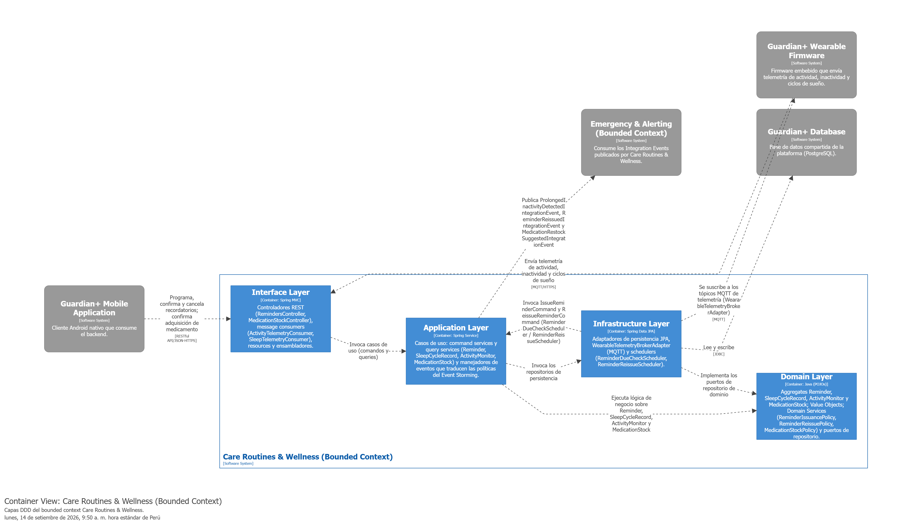

###### 2.6.5.6.1. Bounded Context Domain Layer Class Diagrams

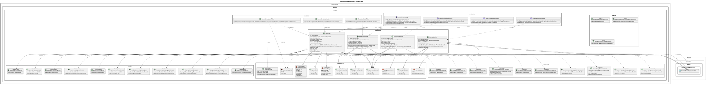

###### 2.6.5.6.2. Bounded Context Database Design Diagram

pendiente