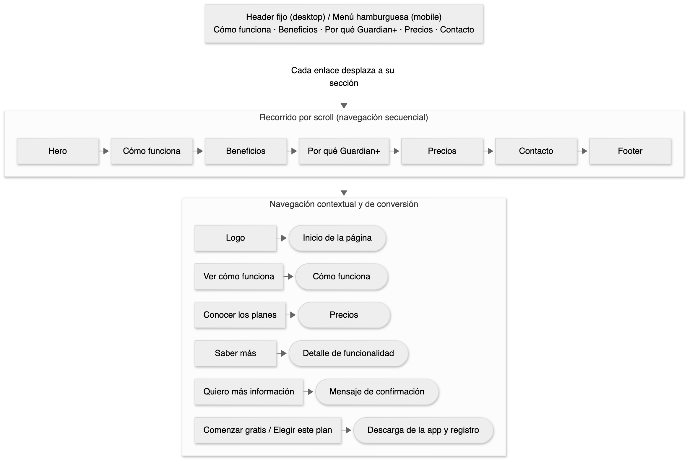
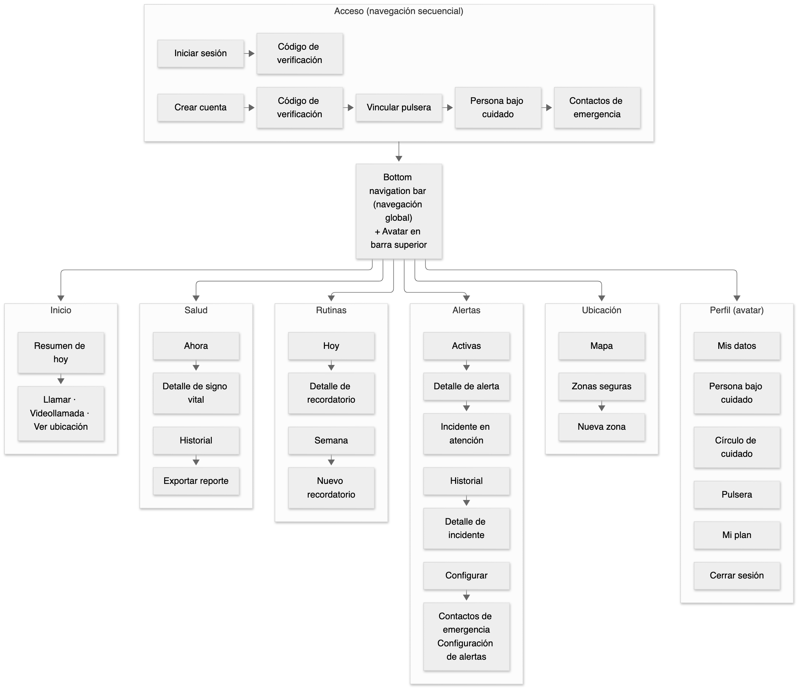

# Capítulo III: Solution UI/UX Design

## 3.1. Product design

### 3.1.1. Style Guidelines

Las presentes directrices de estilo definen el lenguaje visual, los componentes y las convenciones de interfaz para la plataforma Guardian+, abarcando tanto el sitio web estático (Landing Page) como la aplicación móvil nativa y multiplataforma. Este sistema asegura consistencia, accesibilidad universal y un entorno confiable para familiares, cuidadores y ciudadanos en situación de vulnerabilidad o dependencia.

#### 3.1.1.1. General Style Guidelines

##### A. Tono de Comunicación y Lenguaje

El tono de Guardian+ equilibra la precisión médica con la serenidad humana indispensable para mitigar la ansiedad en situaciones de riesgo continuo:

*   **Formal / Casual:** *Formal y Profesional*. Proyecta rigor clínico, seguridad en la gestión de telemetría biométrica y solidez en los protocolos de auxilio.
*   **Entusiasta / Sereno:** *Sereno y Calmo*. Prioriza la claridad analítica y la templanza en estados de alarma crítica, evitando elementos alarmistas que susciten pánico infundado.
*   **Respetuoso / Irreverente:** *Estrictamente Respetuoso*. Reconoce la dignidad, privacidad y autonomía de las personas bajo cuidado y la responsabilidad de sus redes de apoyo.
*   **Divertido / Serio:** *Serio y Confiable*. Enfocado en la eficiencia operativa, la legibilidad inmediata de signos vitales y la rapidez de respuesta ante emergencias.

##### B. Paleta de Colores

La paleta cromática se estructura bajo las especificaciones técnicas del design system implementado, garantizando cumplimiento de contraste WCAG 2.1 nivel AA y AAA para usuarios con visión reducida o adultos mayores:

| Token de Color | Código Hex | Rol en Interfaz | Conformidad WCAG |
| :--- | :--- | :--- | :--- |
| **Primary** | `#167A62` | Verde esmeralda clínico para botones primarios, estados activos y cabeceras | AA (4.8:1 sobre blanco) |
| **Primary Foreground** | `#FFFFFF` | Texto e iconos interactivos sobre contenedores primarios | AAA (> 7.0:1) |
| **Secondary (Pastel)** | `#D3F8F0` | Fondo de métricas estables, insignias y estados de sincronización | AA con Foreground |
| **Secondary Foreground** | `#169084` | Etiquetas, iconografía médica de soporte y enlaces secundarios | AA (4.5:1 sobre pastel) |
| **Accent Mint** | `#D9F0E7` | Relleno de chips interactivos y zonas de selección activa | AAA (> 7.0:1) |
| **Accent Foreground** | `#123128` | Verde bosque profundo para títulos y datos numéricos de alta jerarquía | AAA (12.2:1 sobre acento) |
| **Neutral Background** | `#F8FBF9` | Fondo base de las vistas móviles y secciones de la Landing Page | AAA (> 14.0:1 con texto) |
| **Neutral Foreground** | `#123128` | Color principal de lectura para párrafos, valores y etiquetas | AAA (14.5:1 sobre fondo) |
| **Neutral Muted** | `#EEF4F1` | Contenedores neutros secundarios y divisores estructurales | AA |
| **Muted Foreground** | `#587168` | Texto secundario, unidades de medida (bpm, mmHg) y marcas de tiempo | AA (4.6:1 sobre fondo) |
| **Border** | `#CFE0D8` | Líneas de división de tablas y bordes de tarjetas contenedoras | Componente UI |
| **Surface Card** | `#FFFFFF` | Superficie de tarjetas de métricas biométricas y tarjetas de incidentes | AAA con Foreground |
| **Card Foreground** | `#123128` | Texto principal de métricas y estados dentro de tarjetas | AAA (> 14.0:1) |
| **Destructive / Alert** | `#C53B3B` | Indicador de emergencias críticas, picos de presión y botón SOS activo | AA (4.7:1 sobre blanco) |
| **Destructive Foreground** | `#FFFFFF` | Tipografía de advertencias críticas sobre fondos destructivos | AAA (> 7.0:1) |
| **Pastel Orange (Warning)** | `#FFE6CC` | Advertencias de batería baja, umbrales en observación y rutinas pendientes | AAA con `#7A3E00` |
| **Pastel Orange Text** | `#B25900` | Etiquetas de advertencia preventiva y estados de tolerancia | AA (4.6:1 sobre fondo) |
| **Pastel Yellow (Notice)**| `#FFF4CC` | Alertas informativas de geocercas, recordatorios y revisiones programadas | AAA con `#665200` |
| **Pastel Yellow Text** | `#806600` | Tipografía de notificaciones preventivas y estados de sincronización | AA (4.5:1 sobre fondo) |

##### C. Tipografía

La selección tipográfica maximiza la legibilidad en pantallas móviles de diversa densidad de píxeles y en paneles de visualización web:

*   **Familia Primaria (UI & Body Text):** `Inter`, Sans-Serif. Empleada en interfaces de usuario, etiquetas de navegación, formularios y texto de soporte general por su alta legibilidad en tamaños reducidos.
*   **Familia Secundaria (Display & Metrics):** `Plus Jakarta Sans`, Sans-Serif geométrica. Empleada en encabezados principales, paneles analíticos y lecturas de telemetría en tiempo real (frecuencia cardíaca, SpO₂).
*   **Familia Monospaciada (Data & Logs):** `JetBrains Mono`, Monospace. Empleada en coordenadas GPS, códigos identificadores de incidentes, tramas de telemetría y sellos temporales.

Escala tipográfica normalizada:

| Nivel Jerárquico | Familia Tipográfica | Peso | Tamaño (Desktop) | Tamaño (Mobile) | Line Height |
| :--- | :--- | :--- | :--- | :--- | :--- |
| **H1 Display** | Plus Jakarta Sans | Bold (700) | 36px | 28px | 1.2 |
| **H2 Section** | Plus Jakarta Sans | SemiBold (600) | 24px | 22px | 1.3 |
| **H3 Subsection** | Plus Jakarta Sans | Medium (500) | 18px | 16px | 1.4 |
| **Body Large** | Inter | Regular (400) | 16px | 16px | 1.5 |
| **Body Base** | Inter | Regular (400) | 14px | 14px | 1.5 |
| **Caption / Meta**| Inter | Medium (500) | 12px | 12px | 1.4 |
| **Data Metric** | JetBrains Mono | Medium (500) | 28px | 24px | 1.1 |

##### D. Espaciado, Bordes y Elevaciones (Effects)

*   **Sistema de Espaciado:** Cuadrícula base de 8px (incrementos de 4px, 8px, 12px, 16px, 24px, 32px, 48px).
*   **Border Radius:** 
    *   *Default (Tokens UI):* `12px` para tarjetas contenedoras, bloques analíticos y campos de entrada.
    *   *Subtle:* `6px` para botones de acción secundaria y etiquetas de estado.
    *   *Large:* `20px` para hojas inferiores modales (bottom sheets) y diálogos de confirmación.
    *   *Full:* `9999px` para botones de llamada directa, avatares e indicadores de pulso SOS.
*   **Elevaciones (Sombras CSS):**
    *   *Flat:* Sin sombra (`box-shadow: none`), demarcado por borde `#CFE0D8`.
    *   *Low:* `0px 1px 3px rgba(18, 49, 40, 0.06), 0px 1px 2px rgba(18, 49, 40, 0.04)` para tarjetas estáticas.
    *   *Mid:* `0px 4px 6px -1px rgba(18, 49, 40, 0.08), 0px 2px 4px -1px rgba(18, 49, 40, 0.04)` para elementos interactivos en foco y barras flotantes.
    *   *High:* `0px 10px 15px -3px rgba(18, 49, 40, 0.1), 0px 4px 6px -2px rgba(18, 49, 40, 0.05)` para modales de emergencia crítica.

    

### 3.1.2. Information Architecture

#### 3.1.2.1. Organization Systems

Guardian+ organiza su información combinando estructuras visuales y esquemas de categorización según el tipo de contenido y la necesidad del usuario en cada momento.

##### Estructuras de organización

**Jerárquica (Visual Hierarchy).** Se aplica a la navegación principal de la app: desde el Inicio se accede a las 5 secciones core (Monitoreo de Salud, Rutinas y Bienestar, Alertas, Ubicación, Perfil), y dentro de cada una la información se prioriza visualmente según su criticidad — por ejemplo, en Alertas, las alertas activas se muestran por encima del historial de incidentes ya resueltos.

**Secuencial (Step-by-step).** Se usa en procesos donde el orden de los pasos es obligatorio: el flujo de autenticación y registro (Email → Contraseña → Iniciar Sesión), la respuesta ante una emergencia (alerta generada → ventana de confirmación → escalamiento a contactos), y la configuración inicial de la pulsera al vincular un nuevo dispositivo.

**Matricial (Matrix).** Se aplica donde el usuario necesita comparar información en dos dimensiones a la vez: el calendario semanal de recordatorios de medicación (horarios × días de la semana) y la comparación de planes de suscripción (beneficios × plan).

##### Esquemas de categorización

**Alfabético.** Para listas donde el usuario busca un ítem puntual por nombre: la lista de contactos de emergencia y el listado de medicamentos registrados.

**Cronológico.** Para todo lo que representa una secuencia en el tiempo: el historial de signos vitales, el historial de incidentes/alertas y el historial de pagos, donde lo más reciente aparece primero.

**Por tópico.** Es el criterio principal de la navegación de la app — cada sección agrupa funcionalidad relacionada siguiendo directamente los Bounded Contexts del dominio (Salud, Rutinas, Alertas, Ubicación, Perfil), de modo que el usuario siempre sabe en qué "mundo" de la app está.

#### 3.1.2.2. Labelling Systems

Guardian+ define un sistema de etiquetas breve y consistente para que familiares, cuidadores y visitantes identifiquen cada conjunto de información sin necesidad de interpretar términos técnicos. Las etiquetas parten del Ubiquitous Language definido en el Capítulo II, pero se expresan en un lenguaje cotidiano y sereno, coherente con el tono de comunicación establecido en las Style Guidelines. Una misma etiqueta representa siempre el mismo concepto, tanto en la Landing Page como en la aplicación móvil.

##### Criterios de etiquetado

| Criterio | Aplicación en Guardian+ |
|---|---|
| **Mínimo de palabras** | Las etiquetas de navegación y los botones utilizan entre una y tres palabras. Las acciones se expresan con verbos en infinitivo (*Reconocer*, *Llamar*, *Exportar reporte*). |
| **Lenguaje cotidiano** | Los términos del dominio se traducen a palabras de uso común. Por ejemplo, *Fragile Citizen* se presenta como *Persona bajo cuidado* o directamente por su nombre. |
| **Tono sereno** | Los estados se comunican sin alarmismo: se utiliza *Requiere atención* en lugar de expresiones como *¡Peligro!*, reservando el color rojo y la palabra *Crítica* para emergencias reales. |
| **Ícono acompañado de texto** | Las opciones de navegación, los tipos de alerta y los estados combinan siempre ícono y texto. El color nunca es el único medio para transmitir un significado. |
| **Unidades visibles** | Cada valor biométrico muestra su unidad junto al número: lpm, mmHg, %, °C y rpm. |
| **Consistencia entre productos** | Las etiquetas compartidas entre la Landing Page y la aplicación (*Zonas seguras*, *Círculo de cuidado*, nombres de planes) se escriben exactamente igual en ambos productos. |

##### Del Ubiquitous Language a las etiquetas de interfaz

La siguiente tabla establece la correspondencia entre los términos del dominio y la etiqueta que el usuario visualiza, asegurando que la interfaz y el modelo de dominio hablen del mismo concepto.

| Término del dominio | Etiqueta en la interfaz | Ubicación en la app |
|---|---|---|
| **Fragile Citizen** | Persona bajo cuidado (o su nombre, por ejemplo *Elena*) | Inicio, Perfil |
| **Care Circle** | Círculo de cuidado | Perfil |
| **Family / Caregiver** | Familiar / Cuidador | Registro, Círculo de cuidado |
| **Vital Signs** | Signos vitales | Salud |
| **Health History** | Historial | Salud, Alertas |
| **Care Routine** | Rutinas | Navegación principal |
| **Medication Reminder** | Medicación | Rutinas |
| **Medical Appointment** | Citas médicas | Rutinas |
| **Alert** | Alerta | Alertas |
| **Incident** | Incidente | Alertas › Historial |
| **Acknowledgment** | Reconocer | Detalle de alerta |
| **Emergency Contact** | Contactos de emergencia | Alertas › Configuración |
| **Escalation Chain** | Escalamiento | Alertas › Configuración |
| **Alert Settings** | Configuración de alertas | Alertas › Configuración |
| **Silent Mode** | Modo silencioso | Pulsera, Perfil › Pulsera |
| **Safe Zone** | Zonas seguras | Ubicación |
| **Care Plan** | Mi plan | Perfil |
| **Wearable Device** | Pulsera | Perfil, Onboarding |

##### Etiquetas del Landing Page

Las etiquetas del Landing Page coinciden con las secciones presentadas en los wireframes y mock-ups. Cada una funciona como una promesa de contenido: el visitante asocia la etiqueta con la información que encontrará al seleccionarla, sin que toda la información se concentre en un mismo lugar.

| Etiqueta | Tipo | Asociación (qué encuentra el visitante) |
|---|---|---|
| **Cómo funciona** | Menú principal | Proceso de uso de Guardian+ en tres pasos: pulsera, app y círculo de cuidado. |
| **Beneficios** | Menú principal | Las seis funcionalidades principales del producto. |
| **Por qué Guardian+** | Menú principal | Diferenciación frente a relojes fitness y botones SOS, junto con un testimonio. |
| **Precios** | Menú principal | Comparación de los planes Esencial, Guardian+ y Cuidado Pro. |
| **Contacto** | Menú principal | Formulario de contacto, teléfono y horario de atención. |
| **Conocer los planes** | CTA primario | Desplaza al visitante a la sección Precios. |
| **Ver cómo funciona** | CTA secundario | Desplaza al visitante a la sección Cómo funciona. |
| **Saber más** | Enlace de tarjeta | Amplía la descripción de una funcionalidad específica. |
| **Más elegido** | Distintivo | Identifica el plan recomendado para la mayoría de familias. |
| **Comenzar gratis** | CTA de plan | Inicia el uso del plan Esencial. |
| **Elegir este plan** | CTA de plan | Inicia la contratación de un plan de pago. |
| **Quiero más información** | Botón de formulario | Envía la solicitud de contacto al equipo de Guardian+. |
| **Privacidad · Términos** | Enlace de footer | Políticas de privacidad y términos de uso. |

Los campos del formulario de contacto utilizan etiquetas visibles sobre cada campo: *Nombre*, *Teléfono*, *Correo electrónico*, *¿A quién deseas cuidar?* y *Cuéntanos qué necesitas*.

Asimismo, las funcionalidades presentadas en la sección Beneficios anticipan las secciones que el usuario encontrará dentro de la aplicación, reforzando la asociación entre ambos productos:

| Funcionalidad en el Landing Page | Sección asociada en la app |
|---|---|
| **Salud en tiempo real** | Salud |
| **Detección de caídas + SOS** | Alertas |
| **Ubicación y zonas seguras** | Ubicación |
| **Rutinas sin olvidos** | Rutinas |
| **Prevención activa** | Alertas (inactividad prolongada) |
| **Siempre cerca** | Inicio (videollamada) |

##### Etiquetas de la aplicación móvil

La navegación principal de la aplicación se compone de cinco etiquetas, cada una asociada a un Bounded Context del dominio. El acceso a Perfil se ubica en el avatar de la barra superior.

| Etiqueta | Ícono | Contenido asociado | Bounded Context | User Stories |
|---|---|---|---|---|
| **Inicio** | Casa | Estado general de la persona bajo cuidado, accesos rápidos y próximos recordatorios. | Vista integradora | US23 |
| **Salud** | Pulso | Signos vitales en tiempo real, historial y reportes de salud. | Health Monitoring | US01–US05, US07, US19, US21, US24 |
| **Rutinas** | Calendario | Medicación, citas médicas, actividad física, hidratación y descanso. | Care Routines & Wellness | US06, US13, US14, US17, US26, US27, US29 |
| **Alertas** | Campana | Alertas activas, historial de incidentes, contactos de emergencia y configuración de alertas. | Emergency & Alerting | US08–US12, US15, US16, US20, US22, US25 |
| **Ubicación** | Marcador de mapa | Ubicación actual y zonas seguras. | Mobility & Geofencing | US18, US28 |
| **Perfil** | Avatar | Datos del usuario, persona bajo cuidado, círculo de cuidado, pulsera, plan y sesión. | Profile, IAM, Subscriptions | — |

Dentro de cada sección se utilizan las siguientes etiquetas:

| Sección | Pestañas | Etiquetas de contenido | Acciones |
|---|---|---|---|
| **Inicio** | — | *Elena está bien*, *Actualizado hace 2 min*, *Próximos recordatorios*, *Última alerta* | Llamar, Videollamada, Ver ubicación |
| **Salud** | Ahora · Historial | *Ritmo cardíaco (lpm)*, *Presión arterial (mmHg)*, *Oxígeno (%)*, *Temperatura (°C)*, *Respiración (rpm)*; filtros *Día · Semana · Mes* | Exportar reporte, Ver reporte semanal |
| **Rutinas** | Hoy · Semana | *Medicación*, *Citas médicas*, *Actividad*, *Hidratación*, *Descanso*, *Por agotarse* | Nuevo recordatorio, Reponer medicina |
| **Alertas** | Activas · Historial | *Caída*, *SOS*, *Signo vital fuera de rango*, *Salida de zona segura*, *Inactividad*, *Batería baja* | Reconocer, Llamar, Marcar estabilizado, Cerrar incidente, Configurar |
| **Ubicación** | Mapa · Zonas seguras | *Ubicación actual*, *Dentro de zona segura*, *Fuera de zona segura*, *Última actualización* | Nueva zona, Editar zona |
| **Perfil** | — | *Mis datos*, *Persona bajo cuidado*, *Círculo de cuidado*, *Pulsera*, *Mi plan* | Cerrar sesión |

Los flujos de acceso utilizan las etiquetas *Iniciar sesión*, *Crear cuenta*, *Correo electrónico*, *Contraseña*, *Código de verificación*, *¿Olvidaste tu contraseña?* y *Vincular pulsera*.

##### Etiquetas de estado

Los estados del dominio se presentan mediante etiquetas breves acompañadas del color semántico definido en la paleta de las Style Guidelines.

| Concepto | Valor del dominio | Etiqueta | Color semántico |
|---|---|---|---|
| **Severidad de alerta** | `CRITICAL` / `HIGH` / `MEDIUM` | Crítica / Alta / Media | Destructive / Pastel Orange / Pastel Yellow |
| **Estado de alerta** | `PENDING_CONFIRMATION` | Confirmando | Pastel Yellow |
| | `TRIGGERED` / `ESCALATED` | Nueva / Escalada | Destructive |
| | `ACKNOWLEDGED` | Reconocida | Pastel Orange |
| | `DISMISSED` / `RESOLVED` | Descartada / Resuelta | Neutral Muted |
| **Estado de incidente** | `IN_ATTENTION` / `STABILIZED` / `CLOSED` | En atención / Estabilizado / Cerrado | Pastel Orange / Secondary / Neutral Muted |
| **Estado de recordatorio** | `SCHEDULED` / `ISSUED` / `REISSUED` | Programado / Pendiente / Reenviado | Neutral Muted / Pastel Yellow / Pastel Orange |
| | `CONFIRMED` / `CANCELLED` / `SUPPRESSED` | Confirmado / Cancelado / Omitido | Secondary / Neutral Muted / Neutral Muted |
| **Lectura de signo vital** | Rango normal / elevado / bajo / sin señal | Normal / Elevado / Bajo / Sin señal | Secondary / Pastel Orange / Pastel Orange / Neutral Muted |
| **Zona segura** | Dentro / fuera del perímetro | En su zona segura / Fuera de zona segura | Secondary / Pastel Yellow |
| **Pulsera** | Conectada / sin señal / batería baja | Conectada / Sin conexión / Batería baja | Secondary / Neutral Muted / Pastel Orange |

##### Etiquetas de la pulsera

La pulsera presenta un conjunto mínimo de etiquetas, pensadas para ser comprendidas por la persona bajo cuidado en una pantalla reducida.

| Etiqueta | Función | User Story |
|---|---|---|
| **SOS** | Solicita ayuda inmediata a los contactos de emergencia. | US15 |
| **Estoy bien** | Confirma, dentro de la ventana de 30 segundos, que la persona se encuentra a salvo tras una advertencia, evitando movilizar al círculo de cuidado. | US10 |
| **Confirmar** | Registra que la medicación o la actividad recordada fue realizada. | US06, US14, US26 |
| **Modo silencioso** | Recibe notificaciones sin sonido, excepto ante alertas críticas. | US22 |

#### 3.1.2.3. SEO Tags and Meta Tags

Guardian+ define elementos de Search Engine Optimization (SEO) para mejorar la identificación y visibilidad de su experiencia web en motores de búsqueda. Asimismo, se establecen elementos de App Store Optimization (ASO) para describir y posicionar adecuadamente la aplicación móvil en plataformas de distribución de aplicaciones.

##### Landing Page

La Landing Page constituye la presencia web pública de Guardian+ y tiene como propósito presentar la propuesta de valor de la solución, sus principales funcionalidades, beneficios, planes de suscripción y canales de contacto para familiares y cuidadores.

Debido a que la experiencia se estructura como una página informativa con navegación entre secciones, se utiliza un conjunto común de metadatos a nivel del documento principal.

| SEO Element | Value |
|---|---|
| **Title** | Guardian+ \| Cuidado y monitoreo remoto |
| **Meta Description** | Guardian+ conecta a familiares y cuidadores con personas bajo cuidado mediante monitoreo remoto, alertas oportunas, geolocalización y tecnología wearable. |
| **Meta Keywords** | Guardian+, cuidado remoto, cuidadores, familiares, personas bajo cuidado, monitoreo de salud, alertas de emergencia, wearable, geolocalización, planes de suscripción |
| **Meta Author** | Healthify Team |

La configuración SEO definida para la Landing Page se incorporará en el documento principal mediante las etiquetas HTML correspondientes a `title`, `description`, `keywords` y `author`. Asimismo, se considera la configuración de `viewport` para garantizar una correcta visualización en dispositivos móviles.

| HTML Tag | Value |
|---|---|
| `<title>` | Guardian+ \| Cuidado y monitoreo remoto |
| `<meta name="description">` | Guardian+ conecta a familiares y cuidadores con personas bajo cuidado mediante monitoreo remoto, alertas oportunas, geolocalización y tecnología wearable. |
| `<meta name="keywords">` | Guardian+, cuidado remoto, cuidadores, familiares, personas bajo cuidado, monitoreo de salud, alertas de emergencia, wearable, geolocalización, planes de suscripción |
| `<meta name="author">` | Healthify Team |
| `<meta name="viewport">` | width=device-width, initial-scale=1.0 |

Los términos seleccionados se relacionan con las principales secciones definidas para la Landing Page, como la explicación del funcionamiento de Guardian+, sus beneficios, características diferenciadoras, planes de suscripción y canales de contacto.

##### Web Application

En la arquitectura actual de Guardian+ no se contempla una Web Application operativa independiente. La experiencia web corresponde a la Landing Page pública, mientras que las funcionalidades operativas de monitoreo, alertas, ubicación, rutinas, perfiles y suscripciones son proporcionadas mediante la aplicación móvil.

Por este motivo, en la presente iteración no se definen SEO Tags ni Meta Tags adicionales para una Web Application separada, concentrándose la estrategia SEO de la experiencia web en la Landing Page.

##### Mobile Application — ASO Elements

La aplicación móvil constituye el principal medio de interacción para familiares y cuidadores dentro de Guardian+. Para su publicación y presentación en plataformas de distribución de aplicaciones se definen los siguientes elementos de App Store Optimization (ASO):

| ASO Element | Value |
|---|---|
| **App Title** | Guardian+ |
| **App Subtitle/Short Description** | Cuidado y monitoreo remoto |
| **App Keywords** | cuidado remoto, cuidadores, familiares, adulto mayor, persona bajo cuidado, monitoreo, salud, alertas, emergencia, wearable, ubicación, seguridad |
| **App Description** | Guardian+ es una aplicación de apoyo para familiares y cuidadores que permite centralizar el seguimiento de personas bajo cuidado. Integrada con un dispositivo wearable, facilita el monitoreo remoto, la consulta de información relevante, la gestión de alertas ante situaciones de riesgo, el seguimiento de ubicación y el apoyo a rutinas de cuidado, permitiendo una respuesta más oportuna incluso cuando el responsable no se encuentra físicamente presente. |

Los elementos ASO definidos buscan comunicar de forma clara el propósito de Guardian+ y favorecer su identificación mediante términos relacionados con cuidado remoto, monitoreo, seguridad, alertas, ubicación y asistencia a personas bajo cuidado.

#### 3.1.2.4. Searching Systems

#### 3.1.2.5. Navigation Systems

Guardian+ combina distintos sistemas de navegación para que visitantes y usuarios recorran el contenido sin perder de vista dónde se encuentran ni cómo volver. En el Landing Page, la navegación acompaña un recorrido narrativo que conduce al visitante hacia la elección de un plan o el contacto con el equipo. En la aplicación móvil, la navegación prioriza el acceso inmediato al estado de la persona bajo cuidado y la respuesta rápida ante una emergencia.

##### Landing Page

| Mecanismo | Componente | Descripción |
|---|---|---|
| **Navegación global** | Header fijo | Presenta el menú *Cómo funciona · Beneficios · Por qué Guardian+ · Precios · Contacto* en el mismo orden en que aparecen las secciones al hacer scroll. Permanece visible durante todo el recorrido y cada enlace desplaza al visitante a su sección (US30). |
| **Navegación global (mobile)** | Menú hamburguesa | En pantallas móviles el menú se agrupa en un ícono de hamburguesa que despliega las mismas cinco opciones. |
| **Navegación secuencial** | Scroll narrativo | Las secciones siguen el orden problema → solución → diferenciación → precio → acción, guiando al visitante de forma progresiva hacia la conversión. |
| **Navegación contextual** | CTAs | *Conocer los planes* lleva a Precios, *Ver cómo funciona* lleva a Cómo funciona y *Saber más* amplía cada funcionalidad sin abandonar la página. |
| **Navegación de conversión** | CTAs de planes y formulario | *Comenzar gratis* y *Elegir este plan* redirigen a la descarga de la aplicación móvil, donde se completa el registro. *Quiero más información* envía la solicitud de contacto y muestra un mensaje de confirmación. |
| **Navegación de retorno** | Logo y footer | El logo devuelve al inicio de la página. El footer repite el menú principal e incluye los enlaces *Privacidad · Términos*. |

##### Aplicación móvil

| Tipo de navegación | Componente | Uso en Guardian+ |
|---|---|---|
| **Global** | Bottom navigation bar | Cinco destinos permanentes: *Inicio · Salud · Rutinas · Alertas · Ubicación*. Se muestra en todas las pantallas principales y se oculta en los flujos secuenciales y en la alerta a pantalla completa, para que el usuario se concentre en una sola tarea. |
| **Suplementaria** | Barra superior | Muestra el título de la pantalla, la flecha de regreso en pantallas secundarias y el avatar que conduce a Perfil. En Alertas incluye el acceso a *Configurar*. |
| **Local** | Pestañas | Cada sección organiza su contenido en pestañas: *Ahora · Historial* en Salud, *Hoy · Semana* en Rutinas, *Activas · Historial* en Alertas y *Mapa · Zonas seguras* en Ubicación. |
| **Contextual** | Tarjetas y enlaces internos | Las tarjetas de Inicio llevan a la sección correspondiente; el detalle de una alerta enlaza con *Ver ubicación* y con el historial de signos vitales del momento del evento. |
| **Secuencial** | Flujos paso a paso | El registro sigue los pasos *Crear cuenta → Código de verificación → Vincular pulsera → Persona bajo cuidado → Contactos de emergencia*, con un indicador de progreso (*Paso 2 de 5*). La creación de una zona segura también se realiza paso a paso. |
| **Por notificaciones** | Notificaciones push | Cada notificación abre directamente la pantalla relacionada: una alerta abre su detalle, un recordatorio abre Rutinas y la salida de una zona segura abre Ubicación. |
| **Indicadores de estado** | Badges | La pestaña Alertas muestra la cantidad de alertas activas, de modo que el usuario las identifica desde cualquier sección. |

Adicionalmente, se establecen las siguientes reglas de navegación:

| Regla | Descripción |
|---|---|
| **Profundidad máxima** | Ninguna pantalla se encuentra a más de tres niveles desde la navegación principal (sección → detalle → edición). |
| **Retorno predecible** | La flecha de regreso y el gesto del sistema siempre devuelven a la pantalla anterior, sin perder filtros ni pestañas seleccionadas. |
| **Estado por sección** | Cada destino de la bottom navigation bar conserva su propio estado; al volver a una sección, el usuario la encuentra donde la dejó. |
| **Prioridad de emergencia** | Una alerta crítica se superpone a cualquier pantalla y lleva al usuario a la acción *Reconocer* en un máximo de dos toques. |

##### Ruta de emergencia

La ruta de emergencia es el recorrido más crítico del producto, por lo que se diseña con el menor número de pasos posible.

| Paso | Pantalla | Acción del usuario | Resultado |
|---|---|---|---|
| **1** | Notificación push | Toca la notificación | Se abre el detalle de la alerta a pantalla completa. |
| **2** | Detalle de alerta | Toca *Reconocer* | Se detiene el escalamiento y se abre el incidente con estado *En atención*. |
| **3** | Incidente en atención | *Llamar*, *Ver ubicación* o *Videollamada* | El usuario se comunica con la persona bajo cuidado o acude a su ubicación. |
| **4** | Incidente en atención | *Marcar estabilizado* y luego *Cerrar incidente* | El incidente se registra en *Alertas › Historial* y en el historial de salud. |

Si la alerta no es reconocida dentro del tiempo de espera configurado, el sistema la escala al siguiente contacto de emergencia según la cadena de escalamiento definida en *Configuración de alertas*.

##### Mapa de navegación de la aplicación

El siguiente diagrama presenta la distribución de las pantallas de la aplicación móvil y las rutas entre ellas.

### 3.1.3. Landing Page UI Design

#### 3.1.3.1. Landing Page Wireframe

##### Landing page wireframe desktop

###### Wireframe desktop - Cómo funciona

###### Wireframe desktop - Beneficios

###### Wireframe desktop - Por qué Guardian+

###### Wireframe desktop - Precios

###### Wireframe desktop - Contacto

##### Landing page wireframe mobile

###### Wireframe mobile - Cómo funciona

###### Wireframe mobile - Beneficios

###### Wireframe mobile - Por qué Guardian+

###### Wireframe mobile - Precios

###### Wireframe mobile - Contacto

El wireframe de Guardian+ se estructura en escala de grises para validar la arquitectura de información antes de introducir color, tipografía final o imágenes: header de navegación, hero con CTA, sección de 3 preguntas del dolor del usuario, proceso en 3 pasos, grilla de 6 funcionalidades, bloque de diferenciación de marca, tabla de 3 planes de suscripción, formulario de contacto y footer. El menú de navegación (Cómo funciona → Beneficios → Por qué Guardian+ → Precios → Contacto) refleja exactamente ese mismo orden de scroll, siguiendo un flujo narrativo secuencial (problema → solución → diferenciación → precio → acción) coherente con lo definido en Organization Systems.

Jerarquía visual: cada bloque respeta un orden claro de lectura (título grande → subtítulo → contenido de apoyo → acción), reforzado por tamaño y peso tipográfico, no por color — esto permite validar que la jerarquía funciona incluso sin la paleta final.

Principios de diseño aplicados: alineación en grilla de 3 columnas para las tarjetas de pasos, funcionalidades y planes; proximidad (ícono + título + descripción + CTA agrupados en un mismo contenedor); repetición del mismo patrón de tarjeta en las 3 secciones de contenido, para que el usuario reconozca el patrón sin esfuerzo.

Diseño inclusivo: textos cortos y escaneables (títulos de 3-6 palabras, descripciones de una línea), CTAs con texto explícito ("Conocer los planes", no solo un ícono), y formulario de contacto con etiquetas visibles sobre cada campo (no solo placeholder), reduciendo la carga cognitiva para el público objetivo — familiares y cuidadores que buscan tranquilidad, no fricción técnica.

Versión Mobile: las mismas secciones se apilan en una sola columna, el menú colapsa a ícono de hamburguesa, y las grillas de 3 columnas pasan a apilarse verticalmente, manteniendo el mismo orden de lectura que en desktop.

#### 3.1.3.2. Landing Page Mock-up

##### Landing page mockup desktop

###### Mockup desktop - Cómo funciona

###### Mockup desktop - Beneficios

###### Mockup desktop - Por qué guardian+

###### Mockup desktop - Precios

###### Mockup desktop - Contacto

##### Landing page mockup mobile

###### Mockup mobile - Cómo funciona

###### Mockup mobile - Beneficios

###### Mockup mobile - Por qué guardian+

###### Mockup mobile - Precios

###### Mockup mobile - Contacto

### 3.1.4. Mobile Applications UX/UI Design

#### 3.1.4.1. Mobile Applications Wireframes

#### 3.1.4.2. Mobile Applications Wireflow Diagrams

#### 3.1.4.3. Mobile Applications Mock-ups

#### 3.1.4.4. Mobile Applications User Flow Diagrams

#### 3.1.4.5. Mobile Applications Prototyping