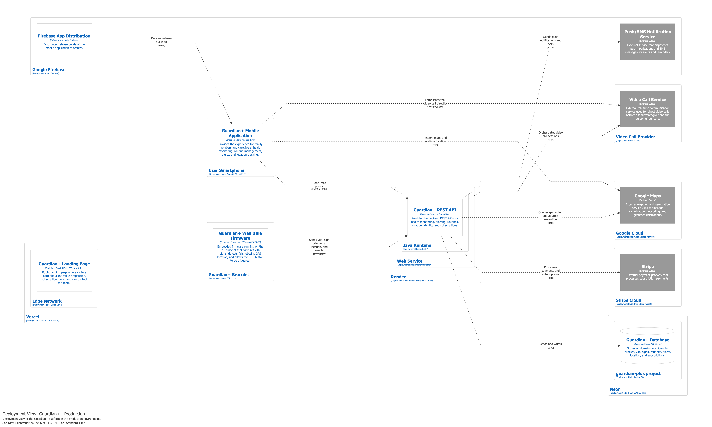

# Capítulo IV: Product Implementation & Validation

## 4.1. Software Configuration Management

### 4.1.1. Software Development Environment Configuration

En esta sección se especifican los productos de software que utilizan los integrantes del equipo para colaborar durante el ciclo de vida de Guardian+. Para cada producto se indica su propósito dentro del proyecto, su tipo de uso y la ruta de referencia, en el caso de servicios SaaS, o la ruta de descarga, en el caso de herramientas que se instalan en el computador de cada integrante. Las herramientas se agrupan según la actividad del ciclo de vida en la que se utilizan.

#### Project Management

| Product | Purpose | Type | Reference / Download URL |
|---|---|---|---|
| **ClickUp** | Gestión del Product Backlog, planificación de Sprints, estimación con Story Points, asignación de tareas y seguimiento de su estado. | SaaS | [Tablero de Guardian+](https://sharing.clickup.com/9013201240/b/h/6-1400350000000524-2/1612e210bce4708) |
| **WhatsApp** | Comunicación diaria del equipo y coordinación rápida de avances y bloqueos. | SaaS / Mobile | [whatsapp.com](https://www.whatsapp.com/download) |
| **Discord** | Reuniones sincrónicas del equipo, revisiones de avance y sesiones de trabajo colaborativo. | SaaS / Desktop | [discord.com](https://discord.com/download) |

#### Requirements Management

| Product | Purpose | Type | Reference / Download URL |
|---|---|---|---|
| **ClickUp** | Registro y priorización de User Stories, Technical Stories y Epics dentro del Product Backlog. | SaaS | [clickup.com](https://clickup.com) |
| **UXPressia** | Elaboración de User Personas, Empathy Maps, User Journey Maps e Impact Maps. | SaaS | [uxpressia.com](https://uxpressia.com) |
| **Miro** | Sesiones de EventStorming, Big Picture EventStorming y descubrimiento de Bounded Contexts candidatos. | SaaS | [miro.com](https://miro.com) |

#### Product UX/UI Design

| Product | Purpose | Type | Reference / Download URL |
|---|---|---|---|
| **Figma** | Diseño de Style Guidelines, wireframes, mock-ups y prototipos del Landing Page y de la aplicación móvil. | SaaS | [figma.com](https://www.figma.com) |

#### Software Architecture & Modeling

| Product | Purpose | Type | Reference / Download URL |
|---|---|---|---|
| **Structurizr** | Elaboración de los diagramas de arquitectura bajo el C4 Model. | SaaS | [structurizr.com](https://structurizr.com) |
| **Mermaid** | Diagramas como código para diagramas de clases, componentes, Domain Message Flows y mapas de navegación, versionados junto al informe. | Library / SaaS | [mermaid.js.org](https://mermaid.js.org) |
| **Graphviz** | Generación de los diagramas de base de datos a partir de archivos `.dot` versionados en el repositorio del informe. | Desktop | [graphviz.org/download](https://graphviz.org/download/) |

#### Software Development

| Product | Purpose | Type | Reference / Download URL |
|---|---|---|---|
| **Git** | Control de versiones distribuido para todos los repositorios del proyecto. | Desktop | [git-scm.com/downloads](https://git-scm.com/downloads) |
| **GitHub** | Alojamiento de repositorios, revisión de cambios mediante Pull Requests e integración de ramas bajo GitFlow. | SaaS | [Organización Healthify](https://github.com/upc-pre-202620-1asi0238-13980-Healthify) |
| **Visual Studio Code** | Editor de código para el desarrollo del Landing Page y la edición del informe en Markdown. | Desktop | [code.visualstudio.com/download](https://code.visualstudio.com/download) |
| **Node.js y npm** | Entorno de ejecución y gestor de paquetes para instalar dependencias, ejecutar y compilar el Landing Page. | Desktop | [nodejs.org/en/download](https://nodejs.org/en/download) |
| **IntelliJ IDEA** | IDE para el desarrollo de los RESTful Web Services en Java con Spring Boot. | Desktop | [jetbrains.com/idea/download](https://www.jetbrains.com/idea/download/) |
| **Java Development Kit (JDK)** | Compilación y ejecución de los Web Services. | Desktop | [oracle.com/java/technologies/downloads](https://www.oracle.com/java/technologies/downloads/) |
| **Apache Maven** | Gestión de dependencias y construcción del proyecto de Web Services mediante Maven Wrapper. | Desktop | [maven.apache.org/download.cgi](https://maven.apache.org/download.cgi) |
| **PostgreSQL** | Base de datos relacional utilizada por los Web Services durante el desarrollo local. | Desktop | [postgresql.org/download](https://www.postgresql.org/download/) |
| **Docker Desktop** | Construcción y ejecución local de la imagen de contenedor de los Web Services antes de su despliegue. | Desktop | [docker.com/products/docker-desktop](https://www.docker.com/products/docker-desktop/) |
| **Android Studio** | IDE para el desarrollo de la aplicación móvil nativa en Kotlin, incluyendo Android SDK y Android Emulator. | Desktop | [developer.android.com/studio](https://developer.android.com/studio) |

#### Software Testing

| Product | Purpose | Type | Reference / Download URL |
|---|---|---|---|
| **JUnit 5 y Mockito** | Pruebas unitarias y de integración de los Web Services, incluidas en los starters de prueba de Spring Boot. | Library | [junit.org/junit5](https://junit.org/junit5/) |
| **Cucumber** | Ejecución de los escenarios de aceptación escritos en Gherkin a partir de los criterios de aceptación de las User Stories. | Library | [cucumber.io](https://cucumber.io) |
| **Swagger UI** | Prueba manual de los endpoints expuestos por los Web Services a partir de su especificación OpenAPI. | Library | [swagger.io/tools/swagger-ui](https://swagger.io/tools/swagger-ui/) |
| **JUnit, Espresso y Compose UI Test** | Pruebas unitarias e instrumentadas de la aplicación móvil. | Library | [developer.android.com/training/testing](https://developer.android.com/training/testing) |
| **Jest y React Testing Library** | Pruebas de los componentes del Landing Page. | Library | [jestjs.io](https://jestjs.io) |
| **Lighthouse** | Evaluación de accesibilidad, rendimiento y buenas prácticas SEO del Landing Page. | Browser tool | [developer.chrome.com/docs/lighthouse](https://developer.chrome.com/docs/lighthouse/overview/) |

#### Software Deployment

| Product | Purpose | Type | Reference / Download URL |
|---|---|---|---|
| **Vercel** | Publicación del Landing Page con despliegue automático desde la rama `main` de su repositorio. | SaaS | [vercel.com](https://vercel.com) |
| **Render** | Despliegue de los Web Services como contenedor Docker, con despliegue automático desde la rama `main`. | SaaS | [render.com](https://render.com) |
| **Neon** | Servicio gestionado de PostgreSQL para la base de datos de los Web Services desplegados. | SaaS | [neon.tech](https://neon.tech) |
| **Firebase App Distribution** | Distribución de las versiones de prueba de la aplicación móvil a los testers y usuarios de validación. | SaaS | [firebase.google.com/products/app-distribution](https://firebase.google.com/products/app-distribution) |

#### Software Documentation

| Product | Purpose | Type | Reference / Download URL |
|---|---|---|---|
| **GitHub y Markdown** | Elaboración colaborativa y versionamiento del informe del proyecto. | SaaS | [guardian-plus-report](https://github.com/upc-pre-202620-1asi0238-13980-Healthify/guardian-plus-report) |
| **OpenAPI Specification vía Swagger** | Documentación de los endpoints de los Web Services, generada con springdoc-openapi. | Library | [springdoc.org](https://springdoc.org) |

#### Technology Stack

Las versiones de lenguajes y frameworks corresponden a las configuradas actualmente en los repositorios de cada producto.

| Product | Technology | Version |
|---|---|---|
| **Landing Page** | React | 19.3 |
| | React Scripts | 5.0.1 |
| **Web Services** | Java | 27 |
| | Spring Boot | 4.1.1 |
| | springdoc-openapi | 3.1.0 |
| | PostgreSQL | Driver JDBC gestionado por Spring Boot |
| **Mobile Application** | Kotlin | 2.2.10 |
| | Android Gradle Plugin | 9.4.1 |
| | Jetpack Compose BOM | 2026.02.01 |
| | Material Design 3 | Gestionado por Compose BOM |
| | Android SDK | `compileSdk` y `targetSdk` 37, `minSdk` 24 |

### 4.1.2. Source Code Management

El equipo utiliza Git como sistema de control de versiones distribuido y GitHub como plataforma para almacenar y administrar los repositorios de los productos que conforman Guardian+. Esta organización permite mantener trazabilidad sobre los cambios realizados, separar el trabajo de cada integrante y revisar las modificaciones mediante Pull Requests antes de integrarlas a las ramas principales.

Los repositorios utilizados por Guardian+ son los siguientes:

| Product / Artifact | Repository | Purpose |
|---|---|---|
| Project Report | [guardian-plus-report](https://github.com/upc-pre-202620-1asi0238-13980-Healthify/guardian-plus-report) | Documentación colaborativa del proyecto elaborada en Markdown. |
| Landing Page | [guardian-plus-website](https://github.com/upc-pre-202620-1asi0238-13980-Healthify/guardian-plus-website) | Código fuente correspondiente al sitio web público de Guardian+. |
| Web Services | [guardian-plus-platform](https://github.com/upc-pre-202620-1asi0238-13980-Healthify/guardian-plus-platform) | Backend y RESTful Web Services que soportan los procesos de negocio de Guardian+. |
| Mobile Application | [guardian-plus-mobile-app](https://github.com/upc-pre-202620-1asi0238-13980-Healthify/guardian-plus-mobile-app) | Aplicación móvil Android desarrollada para familiares y cuidadores. |
| IoT Simulator | [guardian-plus-iot-simulator](https://github.com/upc-pre-202620-1asi0238-13980-Healthify/guardian-plus-iot-simulator) | Simulación de los datos y eventos generados por el dispositivo wearable durante el desarrollo y las pruebas. |

En la iteración actual no se mantiene una Web Application operativa independiente. La experiencia web pública corresponde a la Landing Page, mientras que las principales funcionalidades operativas son proporcionadas mediante la aplicación móvil y los Web Services.

#### 4.1.2.1. GitFlow & Branching Strategy

Guardian+ adopta GitFlow como estrategia de organización de ramas para mantener separado el código estable, el trabajo de integración y el desarrollo de nuevas funcionalidades. Los cambios se desarrollan en ramas independientes y se integran mediante Pull Requests, evitando realizar modificaciones directas sobre las ramas principales.

Las ramas consideradas en el workflow son las siguientes:

| Branch | Purpose | Origin | Destination |
|---|---|---|---|
| `main` | Contiene las versiones estables del producto y representa el estado preparado para una release. | — | — |
| `develop` | Rama de integración que concentra los cambios aprobados durante el desarrollo de cada Sprint. | `main` | `main` mediante una release |
| `feat/*` | Rama temporal utilizada para desarrollar una nueva funcionalidad, artefacto o capacidad de forma aislada. | `develop` | `develop` |
| `release/*` | Rama temporal utilizada para estabilizar una versión antes de integrarla a producción. Solo admite correcciones necesarias para completar la release. | `develop` | `main` y `develop` |
| `hotfix/*` | Rama temporal destinada a corregir errores críticos detectados sobre una versión estable. | `main` | `main` y `develop` |
| `fix/*` | Rama complementaria utilizada para correcciones identificadas durante el desarrollo antes de una release. | `develop` | `develop` |

##### Branch Naming Conventions

Los nombres de las ramas se escriben en inglés, utilizando minúsculas y palabras separadas mediante guiones. El nombre debe indicar claramente el propósito del cambio.

| Branch Type | Convention | Example |
|---|---|---|
| Feature | `feat/<scope>-<short-description>` | `feat/profile-settings` |
| Development Fix | `fix/<scope>-<short-description>` | `fix/subscriptions-entitlement-alignment` |
| Release | `release/v<major>.<minor>.<patch>` | `release/v1.0.0` |
| Hotfix | `hotfix/v<major>.<minor>.<patch>-<short-description>` | `hotfix/v1.0.1-login-error` |

Una nueva funcionalidad comienza desde `develop`. Una vez finalizada y revisada, se crea un Pull Request hacia `develop`. De esta manera, los cambios permanecen aislados hasta que sean aprobados e incorporados a la rama de integración.

El flujo utilizado para una funcionalidad es:

`develop` → `feat/*` → Pull Request → `develop`

Cuando el conjunto de funcionalidades correspondiente a una versión se encuentra preparado para estabilización, se crea una rama `release/*` desde `develop`. Las correcciones realizadas durante esta etapa permanecen limitadas a los ajustes necesarios para completar la versión. Finalmente, la rama se integra tanto a `main` como a `develop`.

El flujo de una release es:

`develop` → `release/vX.Y.Z` → `main` + `develop`

Si se detecta un error crítico en una versión que ya se encuentra en `main`, se crea una rama `hotfix/*` directamente desde `main`. Una vez solucionado el problema, el cambio se integra nuevamente tanto a `main` como a `develop` para evitar diferencias entre la versión estable y la versión en desarrollo.

El flujo de un hotfix es:

`main` → `hotfix/vX.Y.Z-description` → `main` + `develop`

##### Pull Request Strategy

Las ramas `main` y `develop` se utilizan como ramas de integración y no como espacios de desarrollo directo. Las funcionalidades y correcciones se implementan en ramas independientes y posteriormente se integran mediante Pull Requests.

Antes de aceptar un Pull Request se verifica que:

- el cambio corresponda al propósito definido para la rama;
- no se incluyan modificaciones ajenas al alcance del Pull Request;
- no existan conflictos pendientes;
- la documentación o código modificado mantenga consistencia con el proyecto;
- los commits sigan la convención definida por el equipo.

##### Conventional Commits

Los mensajes de commit siguen Conventional Commits con el objetivo de comunicar claramente la naturaleza de cada modificación y mantener un historial legible.

La estructura utilizada es:

`<type>(<scope>): <description>`

Los tipos principales adoptados por el equipo son:

| Type | Usage |
|---|---|
| `feat` | Incorporación de una nueva funcionalidad o capacidad. |
| `fix` | Corrección de un error. |
| `docs` | Modificaciones relacionadas exclusivamente con documentación. |
| `test` | Creación o modificación de pruebas. |
| `refactor` | Reestructuración interna sin modificar el comportamiento funcional esperado. |
| `chore` | Tareas de mantenimiento que no modifican directamente la funcionalidad del producto. |
| `build` | Cambios relacionados con dependencias o configuración del proceso de construcción. |
| `ci` | Cambios relacionados con procesos de integración o despliegue continuo. |

Ejemplos aplicados al proyecto:

`feat(profile): add care relationship management`

`fix(subscriptions): correct entitlement synchronization`

`docs(chapterIV): document gitflow strategy`

`test(alerting): add incident service unit tests`

El `scope` identifica el componente, bounded context o sección afectada y la descripción se redacta de manera breve y específica.

##### Semantic Versioning

Guardian+ adopta Semantic Versioning para identificar las releases mediante la estructura:

`MAJOR.MINOR.PATCH`

Cada componente representa:

- **MAJOR:** se incrementa cuando una versión introduce cambios incompatibles con la versión anterior.
- **MINOR:** se incrementa cuando se añaden funcionalidades manteniendo compatibilidad con la versión anterior.
- **PATCH:** se incrementa cuando se incorporan correcciones compatibles con la versión existente.

Las versiones se representan mediante tags con el prefijo `v`.

Ejemplos:

`v1.0.0` — primera versión estable.

`v1.1.0` — incorporación de nuevas funcionalidades compatibles.

`v1.1.1` — corrección de un error sin introducir cambios incompatibles.

Las ramas de release utilizan la versión que se está preparando, por ejemplo `release/v1.0.0`. Una vez integrada la release en `main`, se crea el tag correspondiente para identificar de manera inequívoca el estado del código asociado a dicha versión.

### 4.1.3. Source Code Style Guide & Conventions

Guardian+ establece convenciones de código comunes para mantener consistencia, legibilidad y mantenibilidad entre los diferentes productos que forman parte de la solución. Las reglas se aplican de acuerdo con las tecnologías utilizadas actualmente en los repositorios del proyecto y toman como referencia las convenciones oficiales o ampliamente adoptadas para cada lenguaje y framework.

Todos los nombres utilizados en el código fuente, incluyendo clases, métodos, variables, componentes, archivos, paquetes y escenarios de pruebas, se redactan en inglés.

Las convenciones documentadas en esta sección corresponden únicamente a las tecnologías que forman parte de la implementación actual de Guardian+.

| Product | Language / Technology | Application in Guardian+ |
|---|---|---|
| Landing Page | HTML5, CSS3, JavaScript | Estructura, presentación y comportamiento de la experiencia web pública. |
| Web Services | Java, Spring Boot | Implementación de los RESTful Web Services y lógica correspondiente a los Bounded Contexts. |
| Mobile Application | Kotlin, Android | Implementación de la aplicación móvil nativa de Guardian+. |
| IoT Simulator | C++ | Simulación y procesamiento de datos y eventos asociados al dispositivo wearable. |
| Automated Acceptance Tests | Gherkin | Especificación de escenarios BDD relacionados con User Stories y criterios de aceptación. |

#### General Coding Conventions

Independientemente del lenguaje utilizado, el equipo adopta las siguientes convenciones generales:

- Los identificadores y nombres de elementos de código se escriben en inglés.
- Los nombres deben expresar claramente la responsabilidad del elemento y evitar abreviaturas ambiguas.
- Se mantiene una única responsabilidad por clase, función o componente siempre que sea posible.
- Se evita duplicar lógica y se reutilizan funciones, componentes o servicios cuando representan el mismo comportamiento.
- Los comentarios se utilizan para explicar decisiones o comportamientos que no sean evidentes a partir del propio código, evitando comentarios redundantes.
- No se mantiene código comentado dentro del repositorio. El historial de Git se utiliza para recuperar implementaciones anteriores.
- Las credenciales, API keys, tokens y otros datos sensibles no deben almacenarse directamente en el código fuente.
- Los archivos y directorios deben organizarse de acuerdo con el módulo, funcionalidad o Bounded Context al que pertenecen.
- El código debe mantener la separación de responsabilidades definida por la arquitectura de cada producto.
- Antes de integrar cambios mediante Pull Request, el código debe compilar o ejecutarse correctamente y las pruebas relacionadas con la funcionalidad modificada deben completarse satisfactoriamente.

#### HTML Coding Conventions

Para los documentos HTML utilizados en la Landing Page se adoptan las siguientes reglas:

- Se utiliza HTML5 y elementos semánticos siempre que correspondan, como `header`, `nav`, `main`, `section`, `article` y `footer`.
- Los nombres de elementos y atributos se escriben en minúsculas.
- Los valores de los atributos se delimitan mediante comillas dobles.
- La estructura del documento mantiene una indentación consistente de dos espacios.
- Las imágenes informativas incluyen el atributo `alt` con una descripción significativa.
- Los elementos interactivos utilizan etiquetas apropiadas para su función.
- Se utilizan atributos ARIA cuando sean necesarios para complementar la accesibilidad.
- Los identificadores y nombres de clases se redactan en inglés.
- Se evita agregar estilos directamente mediante el atributo `style`, manteniendo la presentación en los archivos CSS correspondientes.
- Se mantiene una estructura jerárquica clara de encabezados y secciones.

Ejemplo:

```html
<section class="subscription-plans" aria-labelledby="plans-title">
  <h2 id="plans-title">Subscription Plans</h2>

  <article class="subscription-card">
    <h3>Premium Plan</h3>
    <button type="button">View details</button>
  </article>
</section>
```

#### CSS Coding Conventions

Las hojas de estilo de Guardian+ siguen las siguientes convenciones:

- Los selectores de clase utilizan `kebab-case`.
- Los nombres describen el elemento o propósito visual y se redactan en inglés.
- Cada declaración CSS se coloca en una línea independiente.
- Se utiliza una indentación de dos espacios.
- Se prioriza el uso de clases frente a selectores excesivamente específicos.
- Se evita el uso de `!important`, excepto cuando exista una justificación técnica.
- Los valores reutilizables, como colores, dimensiones o espaciados, se centralizan mediante variables CSS cuando corresponda.
- Los estilos deben respetar los colores, tipografía, spacing y demás decisiones establecidas en los Style Guidelines de Guardian+.
- Los estilos responsive utilizan breakpoints consistentes y evitan la duplicación innecesaria de reglas.
- Se evita utilizar identificadores como selectores exclusivamente para aplicar estilos.

Ejemplo:

```css
.subscription-card {
  display: flex;
  flex-direction: column;
  gap: 1rem;
  padding: 1.5rem;
}

.subscription-card__title {
  font-weight: 600;
}
```

#### JavaScript Coding Conventions

JavaScript se utiliza para implementar el comportamiento e interacción de la Landing Page.

Se aplican las siguientes convenciones:

- Las variables y funciones utilizan `camelCase`.
- Las clases utilizan `PascalCase`.
- Las constantes globales utilizan `UPPER_SNAKE_CASE`.
- Los nombres se redactan en inglés y deben expresar claramente su propósito.
- Se utiliza `const` por defecto cuando una referencia no requiere reasignación.
- Se utiliza `let` únicamente cuando el valor necesita ser reasignado.
- Se evita utilizar `var`.
- Se utiliza comparación estricta mediante `===` y `!==`.
- Las funciones se mantienen pequeñas y enfocadas en una única responsabilidad.
- Se evita modificar innecesariamente el estado global.
- Las operaciones relacionadas con el DOM se mantienen separadas de la lógica que pueda reutilizarse.
- Los eventos se gestionan mediante `addEventListener`.
- Se verifica la existencia de los elementos del DOM antes de operar con ellos cuando corresponda.
- Se evita duplicar selectores, valores o lógica cuando pueden almacenarse en una variable o función reutilizable.

Ejemplo:

```javascript
const planButtons = document.querySelectorAll(".subscription-card__button");

function handlePlanSelection(event) {
  const selectedPlan = event.currentTarget.dataset.plan;

  if (!selectedPlan) {
    return;
  }

  console.log(`Selected plan: ${selectedPlan}`);
}

planButtons.forEach((button) => {
  button.addEventListener("click", handlePlanSelection);
});
```

#### Java and Spring Boot Coding Conventions

Los Web Services de Guardian+ se implementan mediante Java y Spring Boot.

Las convenciones utilizadas son:

- Las clases, interfaces, enumeraciones y records utilizan `PascalCase`.
- Los métodos, variables y atributos utilizan `camelCase`.
- Las constantes utilizan `UPPER_SNAKE_CASE`.
- Los packages utilizan únicamente minúsculas.
- Las clases se organizan de acuerdo con el Bounded Context y la capa arquitectónica correspondiente.
- Los Controllers se mantienen enfocados en recibir solicitudes y delegar el procesamiento hacia la Application Layer.
- Las reglas de negocio permanecen en la Domain Layer y no se implementan directamente en Controllers o componentes de infraestructura.
- Los Commands, Queries y Events representan acciones o hechos relevantes del dominio mediante nombres explícitos.
- Los Handlers coordinan los casos de uso definidos en la Application Layer.
- Las interfaces Repository pertenecientes al modelo se mantienen separadas de sus implementaciones tecnológicas.
- Las implementaciones de persistencia, integración con servicios externos y otros detalles técnicos se mantienen en Infrastructure.
- Las dependencias se proporcionan mediante inyección por constructor.
- Las estructuras utilizadas para solicitudes y respuestas REST se mantienen separadas del modelo de dominio cuando corresponda.
- Las excepciones representan condiciones significativas y no se utilizan como mecanismo habitual de control de flujo.

La organización del código mantiene la separación establecida durante el Tactical-Level Domain-Driven Design:

```text
com.guardianplus.platform.<boundedcontext>
├── domain
├── application
├── interfaces
└── infrastructure
```

Ejemplo:

```java
public final class ActivateSubscriptionHandler {

    private final SubscriptionRepository subscriptionRepository;

    public ActivateSubscriptionHandler(
            SubscriptionRepository subscriptionRepository) {
        this.subscriptionRepository = subscriptionRepository;
    }

    public void handle(ActivateSubscriptionCommand command) {
        Subscription subscription =
                subscriptionRepository.findById(command.subscriptionId());

        subscription.activate();

        subscriptionRepository.save(subscription);
    }
}
```

#### Kotlin and Android Coding Conventions

La aplicación móvil nativa de Guardian+ utiliza Kotlin para Android.

Las convenciones principales son:

- Las clases, interfaces, objects y enumeraciones utilizan `PascalCase`.
- Las variables, propiedades, funciones y métodos utilizan `camelCase`.
- Las constantes utilizan `UPPER_SNAKE_CASE`.
- Los packages utilizan nombres en minúsculas.
- Se utiliza `val` en lugar de `var` siempre que un valor no requiera modificación.
- Se aprovechan las características de null safety proporcionadas por Kotlin y se evita utilizar valores nullable cuando no son necesarios.
- Los nombres de archivos corresponden al principal elemento declarado en ellos.
- La lógica de presentación se mantiene separada de las operaciones de red, persistencia y reglas de negocio.
- Los estados de UI se modelan mediante estructuras explícitas y se favorece la inmutabilidad.
- Los textos visibles por el usuario se mantienen en recursos para facilitar su mantenimiento e internacionalización.
- Los colores, tipografías y estilos reutilizables utilizan los recursos o temas definidos para la aplicación.
- Las funciones se mantienen pequeñas y orientadas a una responsabilidad específica.
- Se evita utilizar valores literales repetidos cuando pueden representarse mediante constantes o recursos.

Ejemplo:

```kotlin
data class ProfileUiState(
    val isLoading: Boolean = false,
    val displayName: String = "",
    val errorMessage: String? = null
)

class ProfileViewModel {
    fun updateProfile(profileId: String) {
        // Application interaction
    }
}
```

#### C++ Coding Conventions

El IoT Simulator de Guardian+ utiliza C++ para representar el comportamiento y los eventos generados por el dispositivo wearable.

Se aplican las siguientes convenciones:

- Las clases, estructuras y enumeraciones utilizan `PascalCase`.
- Las funciones y variables utilizan `camelCase`.
- Las constantes utilizan `UPPER_SNAKE_CASE`.
- Los identificadores se redactan en inglés y describen claramente su responsabilidad.
- Los archivos de cabecera y de implementación mantienen responsabilidades relacionadas.
- Se evita el uso de valores literales repetidos mediante constantes con nombres significativos.
- Las funciones deben mantenerse pequeñas y enfocadas en una operación específica.
- Los datos obtenidos o simulados deben validarse antes de ser procesados o transmitidos.
- La lógica encargada de producir datos se mantiene separada de la lógica utilizada para comunicarlos.
- Los recursos utilizados durante la ejecución deben gestionarse adecuadamente para evitar pérdidas de memoria o estados inválidos.
- Se utilizan referencias constantes cuando un parámetro no necesita modificarse.

Ejemplo:

```cpp
constexpr int MAX_HEART_RATE = 220;

bool isValidHeartRate(const int heartRate) {
    return heartRate > 0 && heartRate <= MAX_HEART_RATE;
}

void processHeartRate(const int heartRate) {
    if (!isValidHeartRate(heartRate)) {
        return;
    }

    // Process simulated wearable data
}
```

#### Gherkin and BDD Feature File Conventions

Los Acceptance Tests implementados bajo el enfoque Behavior-Driven Development utilizan archivos `.feature` escritos mediante Gherkin. Estos escenarios mantienen trazabilidad con las User Stories y Acceptance Criteria definidos para Guardian+.

Se adoptan las siguientes convenciones:

- Cada archivo `.feature` representa una funcionalidad o comportamiento claramente delimitado.
- Los nombres de los archivos utilizan `kebab-case`, por ejemplo `emergency-alert.feature`.
- Los escenarios se redactan en inglés.
- Las palabras clave `Feature`, `Scenario`, `Given`, `When`, `Then`, `And` y `But` se utilizan de acuerdo con su propósito.
- `Given` establece las precondiciones necesarias para ejecutar el escenario.
- `When` representa la acción o evento que desencadena el comportamiento.
- `Then` expresa el resultado observable esperado.
- `And` y `But` complementan pasos sin modificar su propósito semántico.
- Los escenarios describen comportamiento observable y evitan detalles internos de implementación.
- Cada escenario se enfoca en validar un comportamiento específico.
- Los escenarios pueden identificarse mediante tags relacionados con la User Story correspondiente.
- Cuando una misma situación requiere validarse con diferentes conjuntos de datos se utiliza `Scenario Outline` junto con `Examples`.
- Los nombres de los escenarios deben expresar claramente el comportamiento que se está validando.

Ejemplo:

```gherkin
@US08
Feature: Emergency alert after fall detection

  Scenario: Generate an emergency alert after a confirmed fall
    Given a care recipient has an active care relationship
    And the wearable device is connected
    When a fall is confirmed
    Then an emergency alert should be created
    And the registered care circle should be notified
```

Los Step Definitions asociados a los archivos `.feature` se implementan utilizando el lenguaje correspondiente al proyecto de testing y contienen únicamente el código necesario para ejecutar los pasos definidos, sin duplicar reglas de negocio que pertenezcan a la solución.

#### Naming Conventions Summary

| Element | Convention | Example |
|---|---|---|
| Java / Kotlin class | `PascalCase` | `CareRelationship` |
| C++ class / struct | `PascalCase` | `VitalSignReading` |
| Method / Function | `camelCase` | `activateSubscription()` |
| Variable / Property | `camelCase` | `currentPeriodEnd` |
| Constant | `UPPER_SNAKE_CASE` | `MAX_RETRY_ATTEMPTS` |
| Java / Kotlin package | lowercase | `com.guardianplus.platform.profile` |
| JavaScript file | `kebab-case` | `subscription-plans.js` |
| CSS class | `kebab-case` | `subscription-card` |
| Gherkin file | `kebab-case.feature` | `emergency-alert.feature` |
| REST resource | plural lowercase noun | `/subscriptions` |

Estas convenciones permiten mantener un criterio común entre los diferentes productos de Guardian+, facilitar las revisiones de código y conservar la separación arquitectónica definida durante el diseño e implementación de la solución.

### 4.1.4. Software Deployment Configuration

En esta sección se especifica la configuración de despliegue de cada producto digital de Guardian+, incluyendo los pasos necesarios para que, a partir de su repositorio de código fuente, se logre su publicación satisfactoria. El despliegue se integra con la estrategia de GitFlow definida en la sección 4.1.2: los productos se publican en producción a partir de la rama `main`, mientras que el desarrollo y la integración se realizan en las ramas `feat/*` y `develop`. Las credenciales y cadenas de conexión se configuran como variables de entorno en cada plataforma y no se almacenan en los repositorios.

#### Deployment Overview

| Product | Repository | Platform | Deployment Trigger | Public Access |
|---|---|---|---|---|
| **Landing Page** | [guardian-plus-website](https://github.com/upc-pre-202620-1asi0238-13980-Healthify/guardian-plus-website) | Vercel | Integración de cambios en `main` | URL pública aún no disponible; se registrará en esta sección tras el primer despliegue |
| **Web Services** | [guardian-plus-platform](https://github.com/upc-pre-202620-1asi0238-13980-Healthify/guardian-plus-platform) | Render (Docker) y Neon (PostgreSQL) | Integración de cambios en `main` | URL pública aún no disponible; se registrará en esta sección tras el primer despliegue, junto con la ruta de su documentación en Swagger UI |
| **Mobile Application** | [guardian-plus-mobile-app](https://github.com/upc-pre-202620-1asi0238-13980-Healthify/guardian-plus-mobile-app) | Firebase App Distribution | Publicación de una release versionada con Semantic Versioning, por ejemplo `v1.0.0` | Invitación por correo a los testers registrados |

#### Deployment Environments

| Environment | Branch | Landing Page | Web Services | Mobile Application |
|---|---|---|---|---|
| **Local** | `feat/*`, `develop` | `npm start` en `localhost:3000` | `./mvnw spring-boot:run` con PostgreSQL local | Android Emulator desde Android Studio |
| **Preview** | Pull Request | Preview Deployment generado automáticamente por Vercel | — | — |
| **Production** | `main` | Vercel Production | Render y Neon | Firebase App Distribution |

#### Landing Page Deployment

| Step | Action |
|---|---|
| **1** | Verificar que `node_modules/` y `build/` estén incluidos en `.gitignore` y que `npm run build` se ejecute sin errores. |
| **2** | Iniciar sesión en Vercel con la cuenta de GitHub del equipo y seleccionar *Add New → Project*. |
| **3** | Importar el repositorio `guardian-plus-website`. |
| **4** | Configurar el proyecto: *Framework Preset* `Create React App`, *Install Command* `npm ci`, *Build Command* `npm run build` y *Output Directory* `build`. |
| **5** | Definir `main` como *Production Branch*. |
| **6** | Ejecutar *Deploy* y registrar la URL pública asignada por Vercel. |
| **7** | Validar la navegación entre secciones, el formulario de contacto, los meta tags definidos en la sección 3.1.2.3 y los resultados de accesibilidad y rendimiento en Lighthouse. |

Una vez configurado, cada integración en `main` publica automáticamente una nueva versión del Landing Page, y cada Pull Request genera una URL de vista previa que permite revisar los cambios antes de integrarlos.

#### Web Services Deployment

**Preparación del repositorio**

| Step | Action |
|---|---|
| **1** | Agregar un `Dockerfile` multi-stage en la raíz del repositorio: una etapa de construcción con Maven y JDK 27 que ejecuta `./mvnw -DskipTests package`, y una etapa de ejecución con JRE 27 que copia el archivo `.jar` generado y lo inicia con `java -jar`. |
| **2** | Agregar un `.dockerignore` que excluya `target/`, `.idea/` y otros archivos locales. |
| **3** | Configurar `server.port=${PORT:8080}` en `application.properties`, de modo que la aplicación utilice el puerto asignado por Render. |
| **4** | Verificar que la conexión a la base de datos se obtenga de las variables de entorno `SPRING_DATASOURCE_*`, sin credenciales en el código fuente. |

**Base de datos en Neon**

| Step | Action |
|---|---|
| **5** | Crear el proyecto `guardian-plus` en Neon, en la región AWS us-east-1 (N. Virginia). |
| **6** | Crear la base de datos `guardian_plus` y obtener los datos de conexión (host, usuario y contraseña), utilizando `sslmode=require`. |

**Servicio en Render**

| Step | Action |
|---|---|
| **7** | En Render, seleccionar *New → Web Service* y conectar el repositorio `guardian-plus-platform`. |
| **8** | Configurar *Language* `Docker`, *Branch* `main`, *Region* `Virginia (US East)` e *Instance Type* `Free`. |
| **9** | Registrar las variables de entorno indicadas en la tabla siguiente. |
| **10** | Configurar `/v3/api-docs` como *Health Check Path* y mantener activo *Auto-Deploy* ante cada commit en `main`. |
| **11** | Ejecutar el despliegue y validar el acceso público a la documentación de los Web Services en la ruta `/swagger-ui/index.html` del dominio asignado por Render. |

| Variable | Description | Source |
|---|---|---|
| `SPRING_DATASOURCE_URL` | Cadena de conexión JDBC de la base de datos `guardian_plus`, con el parámetro `sslmode=require`. | Neon |
| `SPRING_DATASOURCE_USERNAME` | Usuario de la base de datos. | Neon |
| `SPRING_DATASOURCE_PASSWORD` | Contraseña de la base de datos. | Neon |
| `JWT_SECRET` | Clave utilizada por IAM para firmar los JWT de sesión. | Generada por el equipo |
| `STRIPE_SECRET_KEY` | Clave secreta de Stripe en modo de prueba. | Stripe Dashboard |
| `GOOGLE_MAPS_API_KEY` | Clave para las consultas de geocodificación. | Google Cloud Console |
| `FIREBASE_CREDENTIALS` | Credenciales de la cuenta de servicio de Firebase, codificadas en Base64, para el envío de notificaciones push. | Firebase Console |

Las variables de integraciones externas se registran a medida que cada integración se implementa. Asimismo, la instancia gratuita de Render se suspende tras un periodo de inactividad, por lo que la primera solicitud posterior puede demorar alrededor de un minuto; antes de cada demostración se realiza una solicitud previa para reactivar el servicio.

#### Mobile Application Deployment

| Step | Action |
|---|---|
| **1** | Crear el proyecto `guardian-plus` en Firebase y registrar la aplicación Android con su `applicationId` definitivo. Este identificador no puede modificarse después sin registrar una nueva aplicación. |
| **2** | Descargar `google-services.json` y ubicarlo en el módulo `app/`. El archivo se excluye del repositorio mediante `.gitignore` y se comparte con el equipo por un canal privado. |
| **3** | Definir en `BuildConfig` la URL base de la API (`API_BASE_URL`), apuntando al servicio de Render en el build de release, y registrar la API key de Google Maps en `local.properties`. |
| **4** | Generar el keystore de firma desde *Build → Generate Signed App Bundle or APK* y almacenarlo fuera del repositorio, junto con sus credenciales. |
| **5** | Desde la rama `release/*`, actualizar `versionName` con la versión semántica de la release e incrementar `versionCode`. |
| **6** | Generar el APK de release firmado desde Android Studio o mediante `./gradlew assembleRelease`. |
| **7** | En Firebase Console, ingresar a *App Distribution*, cargar el APK, redactar las notas de la versión y asignarlo al grupo de testers `validation-testers`. |
| **8** | Verificar que los testers reciban la invitación por correo e instalen la aplicación mediante Firebase App Tester. |

#### Deployment Considerations

| Decision | Description |
|---|---|
| **Transporte de telemetría** | En la presente iteración, la pulsera es reemplazada por el IoT Simulator, que envía la telemetría y los eventos del dispositivo directamente al endpoint de ingesta de la REST API mediante HTTPS (TS02). No se despliega un broker MQTT, ya que el transporte se encuentra aislado en el adaptador de telemetría de la capa de infraestructura; un broker gestionado, como HiveMQ Cloud o EMQX, podrá incorporarse cuando se integre la pulsera física sin afectar el modelo de dominio. |
| **Eventos de integración** | Debido a que los Bounded Contexts se despliegan dentro de una única REST API, los eventos de integración entre ellos se publican en memoria mediante Spring Application Events, sin requerir infraestructura adicional. Los puertos de salida definidos en cada contexto, como `MobilityEventOutputPort`, permiten reemplazar este mecanismo por un Message Broker como RabbitMQ si en el futuro los contextos se despliegan de forma independiente. |
| **Ubicación de los servicios** | La REST API y la base de datos se despliegan en la región US East para reducir la latencia entre ambos. |

#### Deployment Diagram

El siguiente diagrama, elaborado con Structurizr bajo el C4 Model, presenta la distribución de los contenedores de Guardian+ en el entorno de producción. Su explicación detallada se encuentra en la sección 2.5.3.4.



## 4.2. Landing Page & Mobile Application Implementation

### 4.2.1. Sprint n

#### 4.2.1.1. Sprint Planning n

#### 4.2.1.2. Aspect Leaders and Collaborators

#### 4.2.1.3. Sprint Backlog n

#### 4.2.1.4. Development Evidence for Sprint Review

#### 4.2.1.5. Testing Suite Evidence for Sprint Review

#### 4.2.1.6. Execution Evidence for Sprint Review

#### 4.2.1.7. Services Documentation Evidence for Sprint Review

#### 4.2.1.8. Software Deployment Evidence for Sprint Review

#### 4.2.1.9. Team Collaboration Insights during Sprint

## 4.3. Validation Interviews

### 4.3.1. Diseño de Entrevistas

### 4.3.2. Registro de Entrevistas

### 4.3.3. Evaluaciones según heurísticas